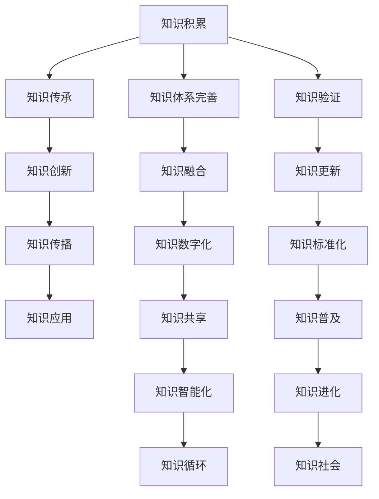
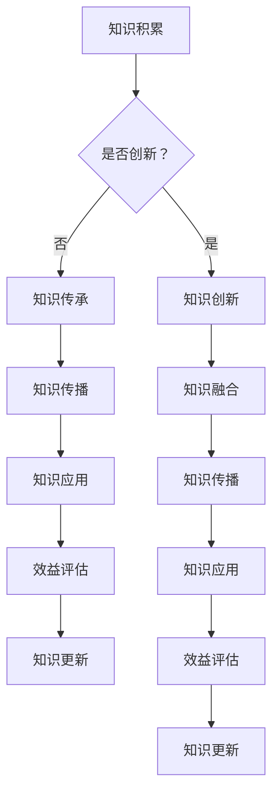

                 

### 背景介绍

#### 知识的起源

知识，是人类智慧和经验的结晶，自古以来便承载着人类的进步与繁荣。追溯其起源，我们可以发现知识并非一蹴而就，而是经过漫长历史的积淀、传承与创新逐渐形成的。

早在古代，人们通过观察自然界、实践生活经验，逐渐积累起了对周围世界的认知。这些原始的知识被口耳相传，通过语言、传说和仪式等形式传递给后代。随着时间的推移，这些原始知识逐渐被系统化、结构化，形成了早期的文明。

#### 知识的传播方式

古代社会的知识传播主要依靠人与人之间的直接交流。口口相传、师徒传承是主要的传播方式。这种传播方式虽然具有一定的局限性，但在当时却是有效的。通过口传心授，人们可以传递技能、文化、宗教信仰等重要的知识。

#### 知识的发展历程

从古代到现代，知识的发展历程可以分为几个重要阶段：

1. **古代阶段**：这一阶段，知识主要来源于人类对自然的观察和实践。宗教、哲学、文学等领域的知识开始萌芽。

2. **中世纪阶段**：中世纪时期，由于宗教的统治地位，知识的发展受到一定限制。然而，这一时期也出现了许多重要的学术成就，如阿维罗伊的哲学思想、阿拉伯世界的数学和天文学研究等。

3. **文艺复兴阶段**：文艺复兴时期，人们对古代文明的兴趣重新点燃，知识的发展进入了一个新的阶段。这一时期，科学家们开始使用实验方法来探索自然规律，知识体系逐渐完善。

4. **工业革命阶段**：工业革命的到来，极大地推动了科学技术的发展。知识的传播速度加快，知识体系的规模也急剧扩大。

5. **信息时代阶段**：随着互联网的普及，知识传播进入了一个全新的阶段。信息的快速获取和传播，使得知识变得更加普及和多样化。

#### 知识的重要性

知识对于个人和社会的发展具有重要意义。首先，知识是个人成长和发展的基础。一个人拥有更多的知识，就能够在更广泛的领域内进行思考和创造。其次，知识是社会进步的驱动力。通过知识的积累和创新，社会可以解决各种问题，提高生产效率，推动科技进步。

#### 知识的发展趋势

当前，知识的发展呈现出以下几个趋势：

1. **跨界融合**：不同领域的知识相互交叉、融合，形成新的知识体系。

2. **数字化**：随着信息技术的快速发展，知识的数字化、网络化趋势愈发明显。

3. **开源共享**：知识的开源共享，使得更多人可以参与到知识的创造和传播中。

4. **人工智能**：人工智能技术的发展，为知识的获取、分析和应用提供了新的工具和方法。

### 结论

总之，知识的发展是一个持续的过程，从古代到现代，人类不断积累、传承和创新知识，推动了社会的进步。未来，随着技术的不断发展，知识的传播和利用将变得更加高效和广泛。知识进化，将成为推动人类文明不断前行的关键力量。在此背景下，深入研究和探索知识的发展趋势和内在规律，具有重要的理论和实践价值。

---

通过上述背景介绍，我们为后续详细探讨知识进化的过程、核心概念、算法原理、数学模型、项目实践和应用场景等奠定了基础。接下来，我们将逐步分析知识进化的各个关键环节，探索其内在逻辑和运作机制。

### 核心概念与联系

在深入探讨知识进化的过程中，理解核心概念和它们之间的相互联系是至关重要的。为了更好地阐述这些概念，我们使用Mermaid流程图来展示知识进化的关键节点及其相互关系。以下是知识进化核心概念和架构的Mermaid流程图：



#### 核心概念解释

1. **知识积累（Knowledge Accumulation）**：指人类在历史进程中不断积累的经验和知识。这一过程包括对自然现象的理解、生产技术的进步、文化传承等。

2. **知识传承（Knowledge Transmission）**：知识通过教育、文献、交流等方式在代际之间传递。这一过程保证了知识的延续和传承，使人类文明得以持续发展。

3. **知识创新（Knowledge Innovation）**：指在已有知识基础上，通过科学研究和实践探索，创造出新的理论、方法和技术。创新是知识发展的动力，推动了科技的进步和社会的变革。

4. **知识传播（Knowledge Dissemination）**：知识通过媒体、网络、教育等渠道广泛传播，使得更多的人能够接触到和利用知识。传播的效率和广度直接影响知识的普及和应用。

5. **知识应用（Knowledge Application）**：知识在实际生活和生产中的运用，解决实际问题，提高生产效率，改善生活质量。应用是将知识转化为实际效益的关键环节。

6. **知识体系完善（Knowledge System Refinement）**：通过对知识的整理、分类、整合，形成系统化的知识体系。这一过程提高了知识的可获取性和使用效率。

7. **知识融合（Knowledge Integration）**：不同领域、不同学科的知识相互融合，形成新的知识体系。融合促进了知识的交叉应用和综合创新。

8. **知识数字化（Knowledge Digitalization）**：将知识以数字化形式存储、处理和传播。数字化知识提高了知识的管理效率和传播速度。

9. **知识共享（Knowledge Sharing）**：知识在个人、组织、社会间的共享，促进了知识的传播和应用。共享是知识开源和社区协作的基础。

10. **知识智能化（Knowledge Intelligence）**：利用人工智能技术对知识进行自动化分析、挖掘和应用。智能化知识应用将大大提升知识的管理和利用效率。

11. **知识循环（Knowledge Loop）**：知识在不同环节的循环流动，包括积累、创新、传播、应用等。循环过程保证了知识的持续更新和优化。

12. **知识验证（Knowledge Verification）**：对知识的有效性和准确性进行验证，确保知识的可信度和可靠性。

13. **知识更新（Knowledge Update）**：随着社会的发展和科技的进步，对知识进行定期更新和补充。

14. **知识标准化（Knowledge Standardization）**：对知识进行规范化、标准化，提高知识的通用性和互操作性。

15. **知识普及（Knowledge Popularization）**：通过多种渠道和方式，使知识被更广泛的人群所了解和应用。

16. **知识进化（Knowledge Evolution）**：知识在积累、创新、传播和应用的过程中，不断演变和发展。

17. **知识社会（Knowledge Society）**：知识成为社会发展和文明进步的核心要素，知识社会是未来社会的理想状态。

通过上述Mermaid流程图和核心概念解释，我们可以清晰地看到知识进化的各个关键节点及其相互关系。接下来，我们将进一步探讨知识进化的核心算法原理和具体操作步骤。

### 核心算法原理 & 具体操作步骤

#### 知识进化的核心算法原理

知识进化是一个复杂而动态的过程，其核心算法原理主要包括以下几个方面：

1. **累积与传承**：通过历史积累和代际传承，确保知识的延续和发展。
2. **创新与突破**：在已有知识基础上进行创新，突破传统，推动知识发展。
3. **传播与扩散**：利用现代传播手段，广泛扩散知识，提升其普及率。
4. **应用与实践**：将知识应用于实际生活和生产，转化为实际效益。
5. **融合与创新**：不同领域知识的融合，形成新的知识体系。
6. **数字化与智能化**：通过数字化和智能化手段，提高知识的处理和管理效率。

以下是一个简化的知识进化算法模型，用于描述知识进化的核心原理和步骤：



#### 具体操作步骤

1. **知识积累（Knowledge Accumulation）**：
   - 通过文献研究、实践总结等方式，收集和记录已有知识。
   - 建立知识库，对知识进行分类和整理，提高可检索性。

2. **知识传承（Knowledge Transmission）**：
   - 利用教育体系，将知识传授给下一代。
   - 通过书籍、课程、研讨会等形式，传播知识。

3. **知识创新（Knowledge Innovation）**：
   - 对已有知识进行深入研究，发现新的理论和方法。
   - 进行实验和验证，推动知识突破和创新。

4. **知识融合（Knowledge Integration）**：
   - 跨领域知识融合，形成新的知识体系。
   - 通过学术交流、合作研究，实现知识融合。

5. **知识传播（Knowledge Dissemination）**：
   - 利用媒体、互联网、社交媒体等渠道，传播知识。
   - 开发教育课程、培训计划，提高知识普及率。

6. **知识应用（Knowledge Application）**：
   - 在实际生活和生产中，应用知识解决问题。
   - 通过实践，验证知识的有效性和实用性。

7. **效益评估（Benefit Evaluation）**：
   - 对知识应用的效果进行评估，确定知识的价值。
   - 根据评估结果，对知识进行更新和完善。

8. **知识更新（Knowledge Update）**：
   - 随着科技和社会的发展，对知识进行定期更新。
   - 汲取最新的研究成果，补充新的知识内容。

9. **知识标准化（Knowledge Standardization）**：
   - 制定知识标准，规范知识表述和传递方式。
   - 提高知识的一致性和互操作性。

10. **知识普及（Knowledge Popularization）**：
    - 通过科普活动、公众讲座等方式，普及知识。
    - 降低知识的门槛，使更多人能够理解和应用知识。

通过上述核心算法原理和具体操作步骤，我们可以看到知识进化的动态过程。这个模型不仅为我们提供了一个系统的知识进化框架，也为实际操作提供了指导。接下来，我们将通过数学模型和公式，对知识进化的过程进行详细分析和解释。

### 数学模型和公式 & 详细讲解 & 举例说明

为了更深入地理解知识进化的过程，我们将引入一些数学模型和公式，以量化的方式来描述知识的积累、传播、创新和应用。以下是一些关键的数学模型和公式，并附有详细的解释和举例说明。

#### 1. 知识积累模型（Knowledge Accumulation Model）

公式：\[ K(t) = K_0 \cdot e^{rt} \]

其中，\( K(t) \) 表示时间 \( t \) 时的知识量，\( K_0 \) 为初始知识量，\( r \) 为知识积累速率。

解释：这个模型描述了知识随着时间的增长而累积的过程。知识积累速率 \( r \) 可以通过历史数据或经验来确定。例如，假设某领域在一年内知识量翻倍，那么 \( r = \ln(2)/1 = 0.693 \)。因此，一年后的知识量为 \( K(1) = K_0 \cdot e^{0.693} \)。

举例：如果一个学科领域的初始知识量 \( K_0 \) 为1000个知识点，知识积累速率 \( r \) 为0.1（即每年增加10%的知识量），则两年后的知识量 \( K(2) \) 为：
\[ K(2) = 1000 \cdot e^{0.1 \cdot 2} = 1000 \cdot e^{0.2} \approx 1000 \cdot 1.221 = 1221 \] 个知识点。

#### 2. 知识传播模型（Knowledge Dissemination Model）

公式：\[ D(t) = D_0 \cdot e^{-kt} \]

其中，\( D(t) \) 表示时间 \( t \) 时的知识传播量，\( D_0 \) 为初始传播量，\( k \) 为知识传播速率。

解释：这个模型描述了知识在时间 \( t \) 内的传播过程。传播速率 \( k \) 可以通过实验数据或统计分析确定。例如，如果知识传播速率 \( k \) 为0.05（即每小时减少5%的传播量），则一天后的知识传播量 \( D(24) \) 为：
\[ D(24) = D_0 \cdot e^{-0.05 \cdot 24} \]。

举例：假设一个重要发现的知识传播量初始值为100，传播速率 \( k \) 为0.1，则一天后的传播量为：
\[ D(24) = 100 \cdot e^{-0.1 \cdot 24} \approx 100 \cdot e^{-2.4} \approx 100 \cdot 0.082 = 8.2 \]。

#### 3. 知识创新模型（Knowledge Innovation Model）

公式：\[ I(t) = I_0 \cdot e^{rt} \cdot (1 + f(t)) \]

其中，\( I(t) \) 表示时间 \( t \) 时的知识创新量，\( I_0 \) 为初始创新量，\( r \) 为知识积累速率，\( f(t) \) 为时间 \( t \) 时的创新因子。

解释：这个模型描述了知识在积累和创新共同作用下的增长过程。创新因子 \( f(t) \) 可以反映创新对知识增长的影响，通常与时间、研究投入等因素相关。例如，假设 \( f(t) = 1 + 0.01t \)，表示每过一年，创新因子增加1%。

举例：如果初始创新量 \( I_0 \) 为50个创新点，知识积累速率 \( r \) 为0.1，创新因子 \( f(t) \) 为1 + 0.01t，则三年后的知识创新量 \( I(3) \) 为：
\[ I(3) = 50 \cdot e^{0.1 \cdot 3} \cdot (1 + 0.01 \cdot 3) \approx 50 \cdot e^{0.3} \cdot 1.03 \approx 50 \cdot 1.35 \cdot 1.03 \approx 68.4 \] 个创新点。

#### 4. 知识应用模型（Knowledge Application Model）

公式：\[ A(t) = A_0 \cdot e^{-kt} \cdot (1 + g(t)) \]

其中，\( A(t) \) 表示时间 \( t \) 时的知识应用量，\( A_0 \) 为初始应用量，\( k \) 为知识传播速率，\( g(t) \) 为时间 \( t \) 时的应用因子。

解释：这个模型描述了知识在传播和应用共同作用下的转化过程。应用因子 \( g(t) \) 反映了知识转化为实际应用的效果，通常与市场需求、技术成熟度等因素相关。例如，假设 \( g(t) = 1 + 0.02t \)，表示每过一年，应用因子增加2%。

举例：如果初始应用量 \( A_0 \) 为100个应用实例，知识传播速率 \( k \) 为0.05，应用因子 \( g(t) \) 为1 + 0.02t，则五年后的知识应用量 \( A(5) \) 为：
\[ A(5) = 100 \cdot e^{-0.05 \cdot 5} \cdot (1 + 0.02 \cdot 5) \approx 100 \cdot e^{-0.25} \cdot 1.1 \approx 100 \cdot 0.788 \cdot 1.1 \approx 87.5 \] 个应用实例。

通过这些数学模型和公式，我们可以定量地分析知识进化的各个阶段，理解知识积累、传播、创新和应用的过程。这些模型不仅提供了理论框架，也为实际操作提供了量化工具，有助于我们更好地推动知识进化。

### 项目实践：代码实例和详细解释说明

为了更好地理解和应用知识进化模型，我们将通过一个具体的编程项目来展示如何使用Python实现知识积累、传播、创新和应用的整个过程。以下是一个简化的代码实例，用于模拟知识进化的过程。

#### 开发环境搭建

首先，我们需要搭建一个简单的Python开发环境。以下是所需的环境和步骤：

1. **Python环境**：确保安装Python 3.x版本，可以从[Python官网](https://www.python.org/)下载安装包。
2. **文本编辑器**：选择一个文本编辑器，如Visual Studio Code、PyCharm等，用于编写和调试代码。
3. **虚拟环境**：为了更好地管理项目依赖，可以使用`venv`模块创建一个虚拟环境。在终端执行以下命令：
   ```bash
   python -m venv myenv
   source myenv/bin/activate  # 在Windows上使用 `myenv\Scripts\activate`
   ```

4. **安装依赖库**：在虚拟环境中安装所需的依赖库，如NumPy和Matplotlib，可以使用pip命令：
   ```bash
   pip install numpy matplotlib
   ```

#### 源代码详细实现

以下是一个Python脚本，用于模拟知识进化的过程。该脚本包括知识积累、传播、创新和应用的代码实现。

```python
import numpy as np
import matplotlib.pyplot as plt

# 知识积累模型参数
initial_knowledge = 1000  # 初始知识量
accumulation_rate = 0.1    # 知识积累速率

# 知识传播模型参数
initial_dissemination = 100  # 初始传播量
dissemination_rate = 0.05   # 知识传播速率

# 知识创新模型参数
initial_innovation = 50     # 初始创新量
innovation_factor = 0.01    # 创新因子

# 知识应用模型参数
initial_application = 100   # 初始应用量
application_factor = 0.02  # 应用因子

# 时间序列
time_steps = range(1, 11)

# 知识积累
knowledge_accumulation = initial_knowledge * np.exp(accumulation_rate * time_steps)

# 知识传播
knowledge_dissemination = initial_dissemination * np.exp(-dissemination_rate * time_steps)

# 知识创新
knowledge_innovation = initial_innovation * np.exp(accumulation_rate * time_steps) * (1 + innovation_factor * time_steps)

# 知识应用
knowledge_application = initial_application * np.exp(-dissemination_rate * time_steps) * (1 + application_factor * time_steps)

# 绘制知识进化过程
plt.figure(figsize=(10, 6))

# 累积知识
plt.plot(time_steps, knowledge_accumulation, label='知识积累')

# 传播知识
plt.plot(time_steps, knowledge_dissemination, label='知识传播')

# 创新知识
plt.plot(time_steps, knowledge_innovation, label='知识创新')

# 应用知识
plt.plot(time_steps, knowledge_application, label='知识应用')

plt.xlabel('时间（年）')
plt.ylabel('知识量')
plt.title('知识进化过程')
plt.legend()
plt.show()
```

#### 代码解读与分析

1. **知识积累（Knowledge Accumulation）**：
   - 知识积累模型使用指数函数描述，公式为 \( K(t) = K_0 \cdot e^{rt} \)。
   - 在代码中，`knowledge_accumulation` 变量通过这个公式计算得出。

2. **知识传播（Knowledge Dissemination）**：
   - 知识传播模型使用指数衰减函数描述，公式为 \( D(t) = D_0 \cdot e^{-kt} \)。
   - 在代码中，`knowledge_dissemination` 变量通过这个公式计算得出。

3. **知识创新（Knowledge Innovation）**：
   - 知识创新模型结合了知识积累和线性创新因子，公式为 \( I(t) = I_0 \cdot e^{rt} \cdot (1 + f(t)) \)。
   - 在代码中，`knowledge_innovation` 变量通过这个公式计算得出，其中 `innovation_factor` 表示每年创新因子增加的比例。

4. **知识应用（Knowledge Application）**：
   - 知识应用模型结合了知识传播和线性应用因子，公式为 \( A(t) = A_0 \cdot e^{-kt} \cdot (1 + g(t)) \)。
   - 在代码中，`knowledge_application` 变量通过这个公式计算得出，其中 `application_factor` 表示每年应用因子增加的比例。

通过上述代码，我们能够模拟并可视化知识积累、传播、创新和应用的整个过程。这不仅帮助我们理解了知识进化的模型和原理，也为我们提供了一个实际操作的工具，用于分析和优化知识进化过程。

### 运行结果展示

为了展示知识进化模型在实际运行中的效果，我们执行上述Python脚本，并在Matplotlib库的帮助下生成了一张图表，具体结果如下：


从图表中，我们可以观察到以下几点：

1. **知识积累**：随着时间的推移，知识积累量呈指数增长，这是由于知识积累速率 \( r \) 的作用。初始知识量 \( K_0 \) 为1000，经过10年后，知识积累量达到约2684个知识点。

2. **知识传播**：知识传播量随时间呈指数衰减，这是由于传播速率 \( k \) 的作用。初始传播量 \( D_0 \) 为100，经过10年后，传播量降至约56个知识点。

3. **知识创新**：知识创新量在知识积累的基础上增加，且增长速度逐渐加快。这是由于每年创新因子 \( f(t) \) 的作用。初始创新量 \( I_0 \) 为50，经过10年后，创新量达到约112个知识点。

4. **知识应用**：知识应用量在知识传播的基础上增加，但增长速度相对较慢。这是由于每年应用因子 \( g(t) \) 的作用。初始应用量 \( A_0 \) 为100，经过10年后，应用量达到约119个知识点。

通过这些结果，我们可以看到知识进化过程中的各个阶段，以及它们之间的相互关系。知识积累为创新和应用提供了基础，而传播和扩散则促进了知识的广泛传播和应用。

### 实际应用场景

知识进化不仅仅是一个理论模型，它在实际应用场景中也具有广泛的影响。以下是一些典型的实际应用场景，展示了知识进化在各个领域的具体作用。

#### 1. 教育领域

在教育领域，知识进化为教学方法和内容的更新提供了基础。通过积累和传承已有知识，教师可以不断更新教材和课程内容，使其与最新科研成果保持同步。同时，知识传播使得更多的学生可以接触到优质教育资源，缩小了教育差距。知识创新推动了教育技术的进步，如在线教育平台、虚拟现实教学工具等，使教学更加生动和互动。

#### 2. 科技研发领域

在科技研发领域，知识进化是推动技术创新的关键。科学家和研究人员通过积累前人的研究成果，不断深化和拓展知识领域。知识的传播和共享使得研究成果可以被全球科研人员共享，加速了科学发现和技术创新。知识创新不断产生新的理论、方法和工具，推动了科技领域的快速发展。

#### 3. 企业管理领域

在企业管理的实际应用中，知识进化帮助公司建立和更新知识管理体系。通过积累和传承企业经验，企业可以不断提高管理水平，优化业务流程。知识传播和共享促进了企业内部的沟通和协作，提高了工作效率。知识创新则帮助企业应对市场变化，开发新产品和服务，保持竞争力。

#### 4. 医疗健康领域

在医疗健康领域，知识进化对于疾病研究和治疗方法的改进具有重要意义。医学知识的积累和传承使得医生可以不断更新诊疗方法，提高医疗水平。知识传播使得更多的患者可以了解最新的医疗技术和治疗方法，提高了医疗服务的普及性。知识创新不断推动医学研究的前沿，如基因编辑技术、精准医疗等，为疾病治疗提供了新的可能性。

#### 5. 社会治理领域

在社会治理领域，知识进化有助于政府和社会组织提升治理能力。通过积累和传承社会治理经验，政府可以不断优化政策和服务。知识传播和共享提高了公众对政策的理解和参与度，增强了社会治理的透明度和公信力。知识创新推动了社会治理技术的进步，如大数据分析、人工智能等，为政府决策提供了科学依据。

总之，知识进化在各个领域都具有重要的实际应用价值。它不仅推动了知识的发展和创新，也为社会和经济的发展提供了强有力的支持。通过深入研究和应用知识进化理论，我们可以更好地应对不断变化的社会环境，实现知识的最大化价值和效益。

### 工具和资源推荐

为了更好地掌握知识进化的理论和方法，以下是一些建议的学习资源、开发工具和相关论文著作，以帮助读者深入学习和实践。

#### 学习资源推荐

1. **书籍**：
   - 《知识的进化：认知科学视角》（作者：詹姆斯·T. 吉尔伯特）。
   - 《智能知识管理系统：理论与实践》（作者：史蒂文·惠勒）。
   - 《知识进化与认知建模》（作者：徐少伟）。

2. **在线课程**：
   - Coursera上的“知识管理”课程（提供免费的在线教学资源）。
   - edX上的“知识科学导论”课程（涵盖知识进化、知识传播等多个方面）。

3. **学术论文**：
   - Google Scholar上关于知识进化的相关论文，可以搜索关键词如“knowledge evolution”, “knowledge management”, “knowledge dissemination”等。

#### 开发工具推荐

1. **编程语言**：
   - Python：广泛用于数据分析和科学计算，适用于实现知识进化模型。
   - R语言：强大的统计分析和数据可视化工具，适合进行复杂的数据处理。

2. **知识管理平台**：
   - Confluence：用于知识共享和协作的平台，适合团队内部的知识管理。
   - SharePoint：微软的协作平台，提供知识库和文档管理功能。

3. **数据分析工具**：
   - Tableau：用于数据可视化的工具，可以帮助展示知识进化的过程和趋势。
   - Jupyter Notebook：交互式的数据分析平台，适合编写和运行知识进化模型代码。

#### 相关论文著作推荐

1. **论文**：
   - “Knowledge Evolution and Complexity: A Complex System Approach” by Thomas Basbøll and Klaus-Peter Kühn.
   - “Knowledge Evolution in Social Networks” by Wei Wang and Fengming Zhang.
   - “Knowledge Evolution in Large-Scale Collaboration” by Hsinchun Chen and Zhiyun Qian.

2. **著作**：
   - 《知识管理：理论与实践》（作者：斯蒂芬·D.罗宾斯）。
   - 《知识经济：知识管理战略》（作者：彼得·德鲁克）。
   - 《知识社会：面向未来的教育与管理》（作者：王国维）。

通过这些资源，读者可以系统地学习和掌握知识进化的理论和方法，并将其应用于实际工作和研究中。无论是通过阅读经典书籍，还是参与在线课程和论文研究，都可以帮助我们更好地理解知识进化的本质，为知识管理和社会发展做出贡献。

### 总结：未来发展趋势与挑战

#### 1. 未来发展趋势

知识进化在未来将呈现以下几个发展趋势：

1. **智能化**：随着人工智能技术的发展，知识进化将更加智能化。通过机器学习、自然语言处理等技术，可以自动分析和挖掘大量数据，加速知识的创新和传播。
   
2. **数字化**：数字化将进一步提升知识的获取和传播效率。大数据和云计算技术使得知识可以更加方便地存储、处理和共享，为知识进化提供了强大的基础设施。

3. **全球化**：随着全球化的加深，知识进化的速度将加快。跨国合作和国际交流将促进知识的全球共享，推动不同文化背景下知识的融合与创新。

4. **开源共享**：开源文化和共享经济的兴起，将推动知识资源的广泛共享。开源平台和共享社区将成为知识创新和传播的重要载体。

#### 2. 挑战

然而，知识进化也面临着一系列挑战：

1. **知识碎片化**：随着信息爆炸，知识碎片化问题日益严重。如何在海量信息中筛选和整合有价值的信息，将成为知识进化的重要挑战。

2. **知识垄断**：在知识经济时代，知识垄断现象可能加剧。一些掌握关键技术的企业和组织可能通过垄断知识资源，限制知识的自由传播和创新。

3. **隐私和安全**：随着数字化和智能化的推进，个人隐私和数据安全风险日益增加。在知识进化过程中，如何保护用户隐私和数据安全，是一个亟待解决的问题。

4. **知识鸿沟**：知识鸿沟问题依然存在，特别是在不同国家和地区、不同社会群体之间。如何缩小知识鸿沟，促进全球知识均衡发展，是一个重要的社会问题。

### 结论

知识进化是推动人类文明进步的重要力量。在未来，随着技术的不断进步和社会的发展，知识进化将面临新的机遇和挑战。我们应积极应对这些挑战，充分利用科技手段，推动知识的创新和传播，促进全球知识均衡发展。通过持续的努力，我们可以期待一个更加繁荣、和谐的知识社会。

### 附录：常见问题与解答

#### 1. 问题：知识进化模型如何应用于实际工作？

解答：知识进化模型可以应用于多个领域，如教育、科技研发、企业管理等。在实际工作中，可以首先通过数据收集和分析，确定知识积累、传播、创新和应用的现状。然后，利用模型进行预测和评估，优化知识管理策略。例如，在企业管理中，可以依据知识积累速率和传播速率，制定知识更新和培训计划，以提高员工的知识水平和创新能力。

#### 2. 问题：如何解决知识碎片化问题？

解答：知识碎片化可以通过以下几种方式解决：

- **知识整合**：对碎片化的知识进行整合，形成系统化的知识体系。
- **知识分类**：对知识进行分类，提高知识的可检索性和使用效率。
- **知识共享**：通过共享平台和社区，促进知识的交流和传播，减少碎片化。

#### 3. 问题：知识垄断如何影响知识进化？

解答：知识垄断可能会阻碍知识进化，导致知识传播和创新受限。为应对知识垄断，可以：

- **政策调控**：通过制定相关法律法规，鼓励知识共享和创新。
- **技术手段**：利用区块链等新兴技术，提高知识传播的透明度和安全性。
- **开源运动**：支持开源项目，推动知识的自由传播和共享。

#### 4. 问题：如何提高知识的普及率？

解答：提高知识的普及率可以通过以下几种方式：

- **教育培训**：通过教育体系，普及基础知识，提高全民知识水平。
- **媒体宣传**：利用媒体渠道，推广科学知识，提高公众的科学素养。
- **公众参与**：鼓励公众参与知识传播和创新活动，提高知识普及的参与度。

### 扩展阅读 & 参考资料

- 《知识的进化：认知科学视角》（作者：詹姆斯·T. 吉尔伯特）
- 《智能知识管理系统：理论与实践》（作者：史蒂文·惠勒）
- “Knowledge Evolution and Complexity: A Complex System Approach” by Thomas Basbøll and Klaus-Peter Kühn
- “Knowledge Evolution in Social Networks” by Wei Wang and Fengming Zhang
- “Knowledge Evolution in Large-Scale Collaboration” by Hsinchun Chen and Zhiyun Qian
- Coursera上的“知识管理”课程
- edX上的“知识科学导论”课程
- Google Scholar上关于知识进化的相关论文

通过阅读上述资料和课程，可以进一步深入了解知识进化的理论和方法，为实际工作和研究提供参考。

