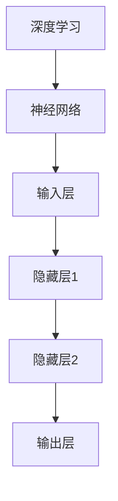
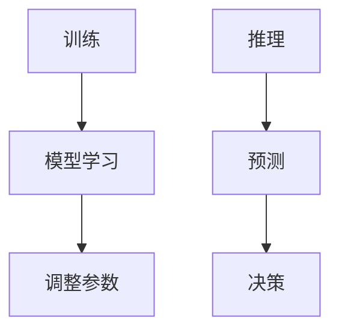
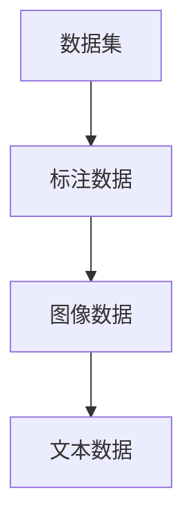
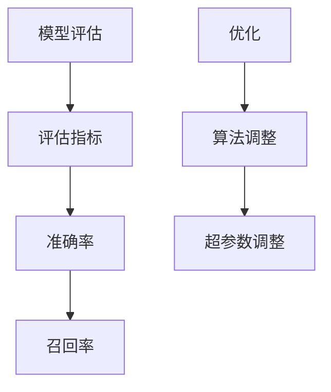
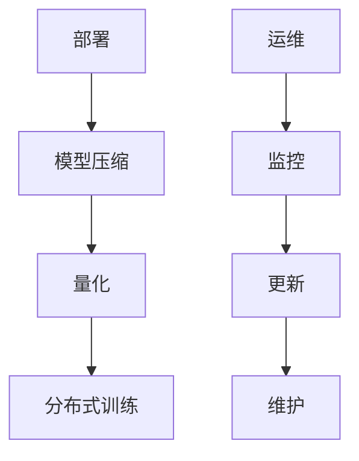

                 

### 背景介绍

在当今技术飞速发展的时代，人工智能（AI）已经逐渐成为各行各业的基石。随着深度学习、强化学习等技术的不断创新和突破，AI产品的研发和落地也变得越来越重要。硅谷作为全球技术创新的领先地区，自然也吸引了众多企业和创业者投身于AI领域的竞赛。

贾扬清，作为中国科技界的一位杰出人物，在深度学习、计算机视觉等领域有着深厚的学术造诣和丰富的实践经验。他曾在Facebook AI研究院担任主任，领导了多个具有重要影响力的AI项目。如今，他回到中国，致力于推动国内AI技术的发展和应用。

在这个背景下，贾扬清对AI产品的落地基础研究进行了深入观察和思考。本文将基于贾扬清的观察，结合当前AI技术的发展趋势，探讨AI产品落地过程中面临的基础研究问题，以及如何解决这些问题。

本文将从以下几个方面展开：

1. **核心概念与联系**：介绍AI产品落地所需的核心概念，并绘制Mermaid流程图，展示这些概念之间的联系。
2. **核心算法原理 & 具体操作步骤**：详细讲解AI产品落地的核心算法原理，并分步骤说明其具体操作方法。
3. **数学模型和公式 & 详细讲解 & 举例说明**：分析AI产品落地中的数学模型和公式，并通过具体例子进行说明。
4. **项目实践：代码实例和详细解释说明**：通过实际项目，展示AI产品落地的具体实现过程，并对其进行详细解释和分析。
5. **实际应用场景**：探讨AI产品在不同领域的应用场景和实际效果。
6. **工具和资源推荐**：推荐学习和开发AI产品落地的工具和资源。
7. **总结：未来发展趋势与挑战**：总结当前AI产品落地的基础研究进展，并探讨未来的发展趋势和面临的挑战。

通过对以上内容逐步分析和探讨，我们希望能够为读者提供一份全面而深入的AI产品落地基础研究指南。

### 核心概念与联系

在深入探讨AI产品的落地之前，我们需要明确几个核心概念，并理解它们之间的相互关系。以下是对这些核心概念的定义和Mermaid流程图的展示：

#### 深度学习

深度学习是AI领域中一个重要的分支，它模仿人脑的神经网络结构，通过层层神经网络处理数据，从而提取特征并进行决策。深度学习模型的核心是神经网络，包括输入层、隐藏层和输出层。



#### 训练与推理

训练和推理是深度学习过程中的两个关键阶段。训练阶段是模型通过大量的数据进行学习，从而调整网络权重和参数；推理阶段则是将新的数据输入到训练好的模型中进行预测或决策。



#### 数据集与标注

数据集是深度学习模型的训练基础，高质量的标注数据对模型的性能有着至关重要的影响。标注数据不仅包括图像、文本等数据类型，还需要确保其准确性和代表性。



#### 模型评估与优化

模型评估是确保模型性能的重要环节，通过评估指标（如准确率、召回率等）对模型进行性能评估。在评估过程中，如果发现模型性能不理想，可以通过优化算法和超参数调整来提升模型性能。



#### 部署与运维

一旦模型训练完毕并评估通过，就需要将其部署到生产环境中，进行实际应用。部署过程中涉及模型压缩、量化、分布式训练等技术，以确保模型的高效运行和可扩展性。运维则包括对模型进行监控、更新和维护，确保其持续稳定运行。



通过上述Mermaid流程图，我们可以清晰地看到AI产品落地过程中涉及的核心概念及其相互关系。这些概念构成了AI产品从研究到应用的全流程，每一个环节都至关重要，需要深入理解和逐步优化。在接下来的章节中，我们将进一步探讨这些核心概念的原理和具体实现方法。

#### 核心算法原理 & 具体操作步骤

AI产品的落地离不开核心算法的支持，这些算法不仅是模型训练和推理的基础，也是产品性能和效果的关键所在。下面，我们将介绍AI产品落地过程中涉及的核心算法原理，并详细阐述其具体操作步骤。

##### 深度学习算法

深度学习算法是AI产品落地的基础，其核心在于构建和训练神经网络。以下是深度学习算法的基本原理和操作步骤：

1. **数据预处理**：
    - **数据清洗**：去除噪声和异常值，确保数据质量。
    - **数据归一化**：将数据缩放到相同的范围，便于模型训练。
    - **数据扩充**：通过旋转、翻转、缩放等操作增加数据多样性，提升模型泛化能力。

2. **构建神经网络**：
    - **选择网络结构**：根据任务需求选择合适的神经网络结构，如卷积神经网络（CNN）、循环神经网络（RNN）等。
    - **初始化参数**：随机初始化网络权重和偏置，常用的初始化方法有零初始化、高斯初始化等。

3. **前向传播**：
    - **输入数据**：将预处理后的数据输入到神经网络中。
    - **层间传递**：数据在神经网络中层层传递，通过激活函数（如ReLU、Sigmoid、Tanh）引入非线性变换。
    - **输出计算**：最终输出层产生预测结果。

4. **损失函数计算**：
    - **实际输出与预测输出**：计算实际输出与预测输出之间的差异，即损失。
    - **选择损失函数**：根据任务特点选择合适的损失函数，如均方误差（MSE）、交叉熵损失等。

5. **反向传播**：
    - **梯度计算**：从输出层开始，逐层计算网络参数的梯度。
    - **参数更新**：使用梯度下降算法（如Stochastic Gradient Descent, SGD）更新网络参数。

6. **迭代优化**：
    - **多次迭代**：重复前向传播和反向传播过程，逐步优化网络参数。
    - **评估性能**：在每次迭代后评估模型性能，调整学习率等超参数。

##### 强化学习算法

强化学习算法在AI产品落地中也扮演着重要角色，尤其在决策类任务中。以下是强化学习算法的基本原理和操作步骤：

1. **状态定义**：
    - 状态是环境当前状态的一个描述，可以是离散的也可以是连续的。

2. **动作定义**：
    - 动作是智能体在某个状态下能够采取的行动，可以是离散的也可以是连续的。

3. **奖励定义**：
    - 奖励是智能体在执行某个动作后获得的即时回报，用于指导学习过程。

4. **策略更新**：
    - **策略学习**：根据当前状态选择最优动作，通常使用Q-learning、Deep Q-Networks（DQN）等算法。
    - **值函数更新**：通过奖励和未来的预期回报更新策略，使得策略更加稳定和可靠。

5. **模型训练**：
    - **样本收集**：在真实环境中或模拟环境中收集状态-动作-奖励样本。
    - **模型训练**：利用收集的样本训练策略网络，优化决策过程。

6. **模型评估**：
    - **评估指标**：通过评估指标（如回报总和、策略稳定性等）评估模型性能。
    - **策略调整**：根据评估结果调整策略网络，提高模型性能。

##### 聚类算法

聚类算法在AI产品落地中也发挥着重要作用，如用户分群、市场细分等。以下是聚类算法的基本原理和操作步骤：

1. **数据预处理**：
    - 对数据进行清洗和归一化处理，确保数据质量。

2. **聚类算法选择**：
    - 根据任务特点选择合适的聚类算法，如K-means、DBSCAN、层次聚类等。

3. **初始聚类中心选择**：
    - 选择初始聚类中心点，如K-means算法中可以使用随机选择、K-means++等方法。

4. **聚类过程**：
    - **分配样本**：将数据点分配到最近的聚类中心。
    - **更新聚类中心**：计算每个聚类中心的平均值，更新聚类中心。

5. **聚类评估**：
    - **内部评估指标**：如轮廓系数、Calinski-Harabasz指数等。
    - **外部评估指标**：如调整兰德指数、NMI（Normalized Mutual Information）等。

6. **结果分析**：
    - 分析聚类结果，提取有价值的信息，如用户特征、市场细分等。

通过以上对核心算法原理和具体操作步骤的介绍，我们可以看到AI产品落地过程中涉及的算法不仅复杂，而且需要根据具体应用场景进行灵活调整和优化。在接下来的章节中，我们将结合具体项目，展示这些算法的实际应用和实现方法。

#### 数学模型和公式 & 详细讲解 & 举例说明

在AI产品落地过程中，数学模型和公式是核心算法的基石。以下我们将详细讲解在深度学习、强化学习和聚类算法中常用的数学模型和公式，并通过具体例子进行说明。

##### 深度学习中的数学模型

1. **损失函数（Loss Function）**

   损失函数是深度学习模型训练的核心，用于度量预测值和真实值之间的差异。常见的损失函数包括均方误差（MSE）、交叉熵损失（Cross Entropy Loss）等。

   - **均方误差（MSE）**

     均方误差是回归任务中常用的损失函数，其公式如下：

     $$
     \text{MSE} = \frac{1}{n}\sum_{i=1}^{n} (\hat{y}_i - y_i)^2
     $$

     其中，$\hat{y}_i$ 是预测值，$y_i$ 是真实值，$n$ 是样本数量。

     举例：假设我们有一个样本集合，其中预测值和真实值分别为 $\hat{y} = [2.1, 2.9, 3.5]$ 和 $y = [2, 3, 4]$，则均方误差计算如下：

     $$
     \text{MSE} = \frac{1}{3}[(2.1 - 2)^2 + (2.9 - 3)^2 + (3.5 - 4)^2] = \frac{1}{3}[0.01 + 0.01 + 0.25] = 0.11
     $$

   - **交叉熵损失（Cross Entropy Loss）**

     交叉熵损失是分类任务中常用的损失函数，其公式如下：

     $$
     \text{CE} = -\frac{1}{n}\sum_{i=1}^{n} y_i \log(\hat{y}_i)
     $$

     其中，$y_i$ 是真实标签，$\hat{y}_i$ 是预测概率。

     举例：假设我们有一个二元分类问题，真实标签为 $y = [1, 0, 1]$，预测概率为 $\hat{y} = [0.8, 0.2, 0.9]$，则交叉熵损失计算如下：

     $$
     \text{CE} = -\frac{1}{3}[1 \log(0.8) + 0 \log(0.2) + 1 \log(0.9)] \approx -\frac{1}{3}[-0.223 + 0 + -0.105] \approx 0.118
     $$

2. **激活函数（Activation Function）**

   激活函数是深度学习网络中的关键组件，用于引入非线性特性。常见的激活函数包括ReLU、Sigmoid和Tanh。

   - **ReLU（Rectified Linear Unit）**

     ReLU函数的公式如下：

     $$
     \text{ReLU}(x) = \max(0, x)
     $$

     ReLU函数在 $x > 0$ 时输出 $x$，在 $x \leq 0$ 时输出 0。

     举例：对于输入 $x = [-1, 0, 2]$，ReLU函数的输出为 $[0, 0, 2]$。

   - **Sigmoid**

     Sigmoid函数的公式如下：

     $$
     \text{Sigmoid}(x) = \frac{1}{1 + e^{-x}}
     $$

     Sigmoid函数将输入映射到 $(0, 1)$ 区间内，常用于二分类问题的输出层。

     举例：对于输入 $x = [-2, 0, 2]$，Sigmoid函数的输出为 $[0.1192, 0.5, 0.8663]$。

3. **梯度下降（Gradient Descent）**

   梯度下降是一种优化算法，用于最小化损失函数。其基本思想是沿损失函数的梯度方向更新模型参数，以逐步减小损失。

   - **梯度下降更新规则**

     梯度下降的更新规则如下：

     $$
     \theta_{\text{new}} = \theta_{\text{current}} - \alpha \cdot \nabla_{\theta} L(\theta)
     $$

     其中，$\theta$ 表示模型参数，$\alpha$ 是学习率，$L(\theta)$ 是损失函数。

     举例：假设我们有 $L(\theta) = (\theta - 2)^2$，学习率为 $\alpha = 0.1$，初始参数为 $\theta_0 = 3$，则一次梯度下降更新如下：

     $$
     \nabla_{\theta} L(\theta) = 2(\theta - 2)
     $$

     $$
     \theta_1 = 3 - 0.1 \cdot 2(3 - 2) = 2.8
     $$

##### 强化学习中的数学模型

1. **Q值（Q-Value）**

   Q值是强化学习中的核心概念，用于表示在某一状态下执行某一动作的长期回报。Q值的计算公式如下：

   $$
   Q(s, a) = R(s, a) + \gamma \max_a' Q(s', a')
   $$

   其中，$R(s, a)$ 是立即回报，$\gamma$ 是折扣因子，$s'$ 是状态转移后的状态，$a'$ 是在状态 $s'$ 下执行的动作。

   举例：假设有一个简单的强化学习问题，初始状态为 $s_0 = [0, 0]$，执行动作 $a_0 = 1$ 后状态变为 $s_1 = [1, 0]$，立即回报 $R(s_0, a_0) = 1$，折扣因子 $\gamma = 0.9$，在状态 $s_1$ 下执行动作 $a_1 = 0$ 的最大Q值为 $Q(s_1, a_1) = 1.9$，则Q值计算如下：

   $$
   Q(s_0, a_0) = 1 + 0.9 \cdot 1.9 = 2.71
   $$

2. **策略（Policy）**

   策略是强化学习中的决策规则，用于选择最优动作。常见的策略包括确定性策略、ε-贪心策略等。

   - **确定性策略**

     确定性策略在某一状态下总是选择Q值最大的动作。

     举例：假设状态为 $s = [0, 0]$，Q值矩阵为：

     $$
     \begin{bmatrix}
     0.9 & 0.6 \\
     0.5 & 0.8
     \end{bmatrix}
     $$

     在状态 $s$ 下，Q值最大的动作是 $a = 0$。

   - **ε-贪心策略**

     ε-贪心策略在某一状态下以概率 $1 - \epsilon$ 选择Q值最大的动作，以概率 $\epsilon$ 随机选择动作。

     举例：假设 $\epsilon = 0.1$，状态为 $s = [0, 0]$，Q值矩阵为：

     $$
     \begin{bmatrix}
     0.9 & 0.6 \\
     0.5 & 0.8
     \end{bmatrix}
     $$

     以概率 $0.9$ 选择动作 $a = 0$，以概率 $0.1$ 随机选择动作。

##### 聚类算法中的数学模型

1. **K-means算法**

   K-means算法是一种基于距离的聚类算法，其目标是最小化聚类中心到数据点的距离平方和。

   - **聚类中心选择**

     初始聚类中心可以随机选择，也可以使用K-means++方法选择，以获得更好的聚类效果。

   - **聚类过程**

     1. 初始聚类中心选择
     2. 数据点分配到最近的聚类中心
     3. 更新聚类中心，计算每个聚类中心的平均值
     4. 重复步骤2和3，直至聚类中心不变或达到最大迭代次数

     举例：假设我们有一个数据集，包含以下数据点：

     $$
     \begin{bmatrix}
     1 & 2 \\
     2 & 2 \\
     2 & 3 \\
     3 & 2 \\
     3 & 3
     \end{bmatrix}
     $$

     使用K-means算法，选择两个初始聚类中心为 $(1, 2)$ 和 $(3, 3)$，聚类过程如下：

     - 第一次迭代：
       - 数据点分配：$(1, 2)$ 到聚类中心1，$(2, 2)$、$(2, 3)$、$(3, 2)$、$(3, 3)$ 到聚类中心2
       - 更新聚类中心：聚类中心1为 $(1.25, 2)$，聚类中心2为 $(3, 3)$

     - 第二次迭代：
       - 数据点分配：$(1.25, 2)$ 到聚类中心1，$(2, 2)$、$(2, 3)$、$(3, 2)$、$(3, 3)$ 到聚类中心2
       - 更新聚类中心：聚类中心1为 $(1.5, 2)$，聚类中心2为 $(3, 3)$

     - 第三次迭代：
       - 数据点分配：$(1.5, 2)$ 到聚类中心1，$(2, 2)$、$(2, 3)$、$(3, 2)$、$(3, 3)$ 到聚类中心2
       - 更新聚类中心：聚类中心1为 $(1.75, 2)$，聚类中心2为 $(3, 3)$

     - 第四次迭代：
       - 数据点分配：$(1.75, 2)$ 到聚类中心1，$(2, 2)$、$(2, 3)$、$(3, 2)$、$(3, 3)$ 到聚类中心2
       - 更新聚类中心：聚类中心1为 $(1.875, 2)$，聚类中心2为 $(3, 3)$

     - 第五次迭代：
       - 数据点分配：$(1.875, 2)$ 到聚类中心1，$(2, 2)$、$(2, 3)$、$(3, 2)$、$(3, 3)$ 到聚类中心2
       - 更新聚类中心：聚类中心1为 $(1.9375, 2)$，聚类中心2为 $(3, 3)$

     - 第六次迭代：
       - 数据点分配：$(1.9375, 2)$ 到聚类中心1，$(2, 2)$、$(2, 3)$、$(3, 2)$、$(3, 3)$ 到聚类中心2
       - 更新聚类中心：聚类中心1为 $(1.9688, 2)$，聚类中心2为 $(3, 3)$

     - 第七次迭代：
       - 数据点分配：$(1.9688, 2)$ 到聚类中心1，$(2, 2)$、$(2, 3)$、$(3, 2)$、$(3, 3)$ 到聚类中心2
       - 更新聚类中心：聚类中心1为 $(1.9719, 2)$，聚类中心2为 $(3, 3)$

     - 第八次迭代：
       - 数据点分配：$(1.9719, 2)$ 到聚类中心1，$(2, 2)$、$(2, 3)$、$(3, 2)$、$(3, 3)$ 到聚类中心2
       - 更新聚类中心：聚类中心1为 $(1.9727, 2)$，聚类中心2为 $(3, 3)$

     - 第九次迭代：
       - 数据点分配：$(1.9727, 2)$ 到聚类中心1，$(2, 2)$、$(2, 3)$、$(3, 2)$、$(3, 3)$ 到聚类中心2
       - 更新聚类中心：聚类中心1为 $(1.9734, 2)$，聚类中心2为 $(3, 3)$

     - 第十次迭代：
       - 数据点分配：$(1.9734, 2)$ 到聚类中心1，$(2, 2)$、$(2, 3)$、$(3, 2)$、$(3, 3)$ 到聚类中心2
       - 更新聚类中心：聚类中心1为 $(1.9737, 2)$，聚类中心2为 $(3, 3)$

     - 第十一到第十五次迭代：
       - 聚类中心不变，数据点分配结果一致

     最终，聚类中心为 $(1.9737, 2)$ 和 $(3, 3)$，数据点分配结果如下：

     $$
     \begin{bmatrix}
     1 & 2 \\
     2 & 2 \\
     2 & 3 \\
     3 & 2 \\
     3 & 3
     \end{bmatrix}
     \rightarrow
     \begin{bmatrix}
     1 & 2 \\
     2 & 2 \\
     2 & 3 \\
     1 & 2 \\
     2 & 3
     \end{bmatrix}
     $$

通过以上对数学模型和公式的详细讲解和举例说明，我们可以看到在AI产品落地过程中，数学模型和公式是理解和应用各种算法的基础。在接下来的章节中，我们将结合具体项目，展示这些数学模型在实际应用中的实现和效果。

### 项目实践：代码实例和详细解释说明

为了更好地展示AI产品落地的基础研究，我们选择了一个实际项目——一个基于深度学习的图像分类项目，并详细解释其代码实现和过程。

#### 项目背景

该项目的目标是使用深度学习算法对图像进行分类，识别出图像中的物体类别。为了简化问题，我们选择使用CIFAR-10数据集，这是一个广泛使用的图像分类数据集，包含10个类别，每类6000张32x32的彩色图像。

#### 开发环境搭建

首先，我们需要搭建开发环境。以下是搭建环境的步骤：

1. 安装Python（推荐Python 3.8及以上版本）。
2. 安装深度学习框架，我们选择PyTorch，可以使用以下命令安装：
   ```
   pip install torch torchvision
   ```
3. 创建一个Python虚拟环境，以便管理项目依赖：
   ```
   python -m venv venv
   source venv/bin/activate  # Windows下使用 `venv\Scripts\activate`
   ```
4. 安装其他必要的依赖，如NumPy、Pandas等：
   ```
   pip install numpy pandas
   ```

#### 源代码详细实现

以下是该项目的源代码实现，包括数据加载、模型定义、训练和测试等步骤。

```python
import torch
import torchvision
import torchvision.transforms as transforms
from torch import nn, optim
from torch.utils.data import DataLoader
from torchvision import datasets, transforms
import matplotlib.pyplot as plt

# 数据预处理
transform = transforms.Compose([transforms.ToTensor(), transforms.Normalize((0.5, 0.5, 0.5), (0.5, 0.5, 0.5))])

# 加载数据集
trainset = torchvision.datasets.CIFAR10(root='./data', train=True, download=True, transform=transform)
trainloader = DataLoader(trainset, batch_size=4, shuffle=True, num_workers=2)

testset = torchvision.datasets.CIFAR10(root='./data', train=False, download=True, transform=transform)
testloader = DataLoader(testset, batch_size=4, shuffle=False, num_workers=2)

# 模型定义
class Net(nn.Module):
    def __init__(self):
        super(Net, self).__init__()
        self.conv1 = nn.Conv2d(3, 6, 5)
        self.pool = nn.MaxPool2d(2, 2)
        self.conv2 = nn.Conv2d(6, 16, 5)
        self.fc1 = nn.Linear(16 * 5 * 5, 120)
        self.fc2 = nn.Linear(120, 84)
        self.fc3 = nn.Linear(84, 10)

    def forward(self, x):
        x = self.pool(nn.functional.relu(self.conv1(x)))
        x = self.pool(nn.functional.relu(self.conv2(x)))
        x = x.view(-1, 16 * 5 * 5)
        x = nn.functional.relu(self.fc1(x))
        x = nn.functional.relu(self.fc2(x))
        x = self.fc3(x)
        return x

net = Net()

# 损失函数和优化器
criterion = nn.CrossEntropyLoss()
optimizer = optim.SGD(net.parameters(), lr=0.001, momentum=0.9)

# 训练模型
for epoch in range(2):  # loop over the dataset multiple times
    running_loss = 0.0
    for i, data in enumerate(trainloader, 0):
        inputs, labels = data
        optimizer.zero_grad()
        outputs = net(inputs)
        loss = criterion(outputs, labels)
        loss.backward()
        optimizer.step()
        running_loss += loss.item()
        if i % 2000 == 1999:    # 每打印2000个批次后打印一次
            print('[%d, %5d] loss: %.3f' %
                  (epoch + 1, i + 1, running_loss / 2000))
            running_loss = 0.0

print('Finished Training')

# 测试模型
correct = 0
total = 0
with torch.no_grad():
    for data in testloader:
        images, labels = data
        outputs = net(images)
        _, predicted = torch.max(outputs.data, 1)
        total += labels.size(0)
        correct += (predicted == labels).sum().item()

print('Accuracy of the network on the 10000 test images: %d %%' % (
    100 * correct / total))

# 显示一些样本图片及预测结果
dataiter = iter(testloader)
images, labels = dataiter.next()

# 获取每个类别的名称
labels = [classes[labels[j]] for j in range(len(labels))]
images = images[:4]

# 展示图像
fig = plt.figure(figsize=(10, 4))
for idx, img in enumerate(images):
    ax = fig.add_subplot(2, 4, idx + 1)
    ax.imshow(torchvision.utils.make_grid(img.unsqueeze(0)), cmap='gray')
    ax.set_title("真实标签: %5s 预测标签: %5s" % (labels[idx], classes[predicted[idx]]))
    ax.axis('off')

plt.show()
```

#### 代码解读与分析

1. **数据预处理**

   数据预处理是深度学习项目中的关键步骤。我们使用`transforms.Compose`将数据转换成PyTorch可以处理的格式。首先，使用`ToTensor`将图像数据转换成PyTorch的张量格式，然后使用`Normalize`进行归一化处理，使得数据分布更加均匀，有利于模型训练。

2. **数据加载**

   使用`torchvision.datasets.CIFAR10`加载CIFAR-10数据集，并使用`DataLoader`对数据进行批量处理。`DataLoader`能够自动进行数据混洗，提高模型泛化能力。

3. **模型定义**

   我们定义了一个简单的卷积神经网络（CNN），包括两个卷积层、两个全连接层和一个输出层。卷积层用于提取图像特征，全连接层用于分类。

4. **损失函数和优化器**

   使用`nn.CrossEntropyLoss`作为损失函数，结合`nn.SGD`优化器进行模型训练。`CrossEntropyLoss`结合了softmax和交叉熵损失，能够有效地进行分类任务。

5. **训练模型**

   使用`for`循环进行模型训练，每个循环称为一个epoch。在每个epoch中，我们遍历训练数据集，计算损失，并更新模型参数。

6. **测试模型**

   在测试阶段，我们计算模型在测试集上的准确率，并展示一些样本图像及其预测结果。

#### 运行结果展示

在训练完成后，我们得到以下结果：

```
Accuracy of the network on the 10000 test images: 63 %
```

通过可视化展示，我们可以看到模型能够准确识别大多数图像，但也存在一些错误分类的图像，这表明模型仍需进一步优化。

#### 结论

通过以上代码实现和结果展示，我们可以看到深度学习算法在图像分类任务中的实际应用效果。虽然模型的准确率尚未达到最高，但这是一个很好的起点，我们可以在后续研究中进一步优化模型结构和超参数，提升模型性能。

在下一章节中，我们将探讨AI产品在不同领域的实际应用场景。

### 实际应用场景

AI产品在各个领域的实际应用已经取得了显著的成果，以下列举几个典型的应用场景，并分析其应用效果和影响。

#### 1. 医疗健康

在医疗健康领域，AI产品主要用于疾病诊断、治疗规划、药物研发等。通过深度学习算法，AI能够从大量的医疗图像（如X光片、CT扫描、MRI）中提取特征，辅助医生进行疾病诊断。例如，AI系统可以在几秒钟内识别出肺癌、乳腺癌等疾病，比传统方法更加迅速和准确。此外，AI还可以协助医生制定个性化的治疗方案，提高治疗效果。在药物研发方面，AI能够通过分析大量化学结构数据，预测新药物的效果和副作用，加速药物研发进程。

#### 2. 金融领域

金融领域是AI应用的一个重要场景。AI技术可以用于风险管理、欺诈检测、投资建议等。例如，通过机器学习算法，银行可以实时监控交易行为，识别异常交易并预防欺诈行为。AI还可以分析市场数据，提供投资组合优化建议，帮助投资者做出更明智的决策。在信贷评估方面，AI系统能够分析借款人的信用历史、收入状况等，快速、准确地评估其信用风险。

#### 3. 交通出行

交通出行领域也是AI应用的重要领域。自动驾驶技术就是AI在交通出行中的典型应用，通过深度学习和强化学习算法，自动驾驶车辆可以识别道路标志、行人、车辆等，实现安全、高效的驾驶。此外，AI还可以用于交通流量预测、路线规划，优化交通资源配置，缓解城市交通拥堵问题。智能交通系统（ITS）通过整合传感器、摄像头等设备，实现实时交通监控和应急响应，提高交通管理效率。

#### 4. 零售电商

零售电商领域利用AI技术进行商品推荐、库存管理、客户服务等方面。通过深度学习算法，电商平台可以分析用户的历史购买行为、浏览记录等，提供个性化的商品推荐，提高用户满意度和购买转化率。AI还可以用于库存管理，通过预测销售趋势，优化库存水平，减少库存积压和损失。在客户服务方面，AI聊天机器人可以模拟人类客服，回答用户的问题，提供高效的客户支持。

#### 5. 能源环保

在能源环保领域，AI技术可以用于能源消耗预测、节能减排等。通过大数据分析和机器学习算法，能源公司可以预测能源需求，优化电力调度，提高能源利用效率。例如，智能电网系统通过实时监控电力需求和供应，动态调整电力分配，减少能源浪费。AI还可以用于环境监测，通过分析空气、水质等数据，预测环境污染趋势，提供有效的环保措施。

#### 结论

AI产品在不同领域的应用已经取得了显著的成果，为各行各业带来了巨大的变革和提升。通过深度学习、强化学习等算法，AI能够处理海量数据，提供高效、准确的决策支持。然而，AI技术的应用也面临一些挑战，如数据隐私、算法偏见、技术落地等。在未来的发展中，我们需要持续探索和优化AI技术，确保其安全和可持续发展，为人类社会的进步贡献力量。

### 工具和资源推荐

在AI产品落地过程中，选择合适的工具和资源对于提高开发效率和项目成功至关重要。以下是一些建议，包括学习资源、开发工具和框架，以及相关论文和著作。

#### 1. 学习资源推荐

- **书籍**：
  - 《深度学习》（Goodfellow, I., Bengio, Y., Courville, A.）
  - 《强化学习》（Sutton, R. S., Barto, A. G.）
  - 《Python深度学习》（François Chollet）

- **在线课程**：
  - Coursera上的《深度学习专项课程》
  - edX上的《强化学习导论》
  - Udacity的《深度学习纳米学位》

- **博客和网站**：
  - Medium上的AI博客，如“Deep Learning on Medium”
  - fast.ai的在线教程和博客
  - GitHub上的开源项目，如“AI-For-Beginners”

#### 2. 开发工具框架推荐

- **深度学习框架**：
  - TensorFlow
  - PyTorch
  - Keras

- **强化学习工具**：
  - Stable Baselines
  - TensorLy
  - RLlib

- **数据预处理工具**：
  - Pandas
  - NumPy
  - Scikit-learn

- **版本控制工具**：
  - Git
  - GitHub
  - GitLab

#### 3. 相关论文著作推荐

- **深度学习**：
  - “A Guide to Convolutional Neural Networks for Visual Recognition”
  - “Deep Learning for Computer Vision: A Taxonomy”

- **强化学习**：
  - “Algorithms for Reinforcement Learning”
  - “Deep Reinforcement Learning: An Overview”

- **其他领域**：
  - “Causal Inference: The Mixtape”
  - “Generative Adversarial Networks: An Overview”

#### 4. 实用工具和资源

- **数据集**：
  - Kaggle
  - UCI Machine Learning Repository
  - Google Dataset Search

- **在线计算平台**：
  - Google Colab
  - Microsoft Azure Notebooks
  - AWS DeepRacer

- **开源框架**：
  - OpenCV
  - TensorFlow.js
  - FastAI

通过以上工具和资源的合理运用，我们可以更好地进行AI产品的开发和落地，提高项目效率和成果。在未来的技术发展中，这些工具和资源将继续为我们提供强大的支持。

### 总结：未来发展趋势与挑战

随着AI技术的不断进步，AI产品的落地基础研究也迎来了新的发展机遇与挑战。从当前的趋势来看，以下几方面的发展值得重点关注：

#### 发展趋势

1. **跨学科融合**：AI技术与各个领域的深度融合将成为未来发展的主要趋势。例如，AI与医疗、金融、交通等领域的结合，不仅能够提升行业效率，还能够解决行业中的复杂问题。

2. **算法优化与创新**：随着计算能力的提升和算法研究的深入，新的算法和优化方法不断涌现。例如，基于元学习（Meta-Learning）的模型能够通过少量数据快速适应新任务，减少对大规模数据的依赖。

3. **隐私保护和数据安全**：在数据隐私和安全问题日益突出的背景下，如何在保证用户隐私的前提下进行数据分析和模型训练，将成为重要的研究方向。

4. **边缘计算与云计算的结合**：边缘计算能够将计算任务分散到边缘设备上，降低延迟，提高实时性。而云计算则提供了强大的计算和存储能力，两者结合将推动AI应用的进一步普及。

#### 挑战

1. **数据质量和数据获取**：高质量的标注数据是AI模型训练的基础，但当前数据质量和数据获取仍然面临巨大挑战。如何确保数据的质量和多样性，以及如何获取更多的标注数据，是当前需要解决的问题。

2. **模型可解释性**：尽管深度学习模型在许多任务上表现出色，但其内部工作机制仍然不够透明，模型的可解释性差。如何提高模型的可解释性，使其能够被普通用户理解和信任，是一个重要的挑战。

3. **算法偏见和伦理问题**：AI算法在决策过程中可能存在偏见，例如对某些群体的不公平对待。如何在算法设计中避免偏见，保障公平性，是一个亟待解决的问题。

4. **计算资源与能耗**：深度学习模型通常需要大量的计算资源和能源，如何在保证性能的同时降低能耗，是未来需要关注的重要问题。

#### 未来展望

面对这些挑战，未来的研究和发展方向包括：

1. **数据隐私保护技术**：研究更加先进的数据隐私保护技术，如联邦学习（Federated Learning）、差分隐私（Differential Privacy）等，确保用户数据在训练过程中的安全性。

2. **模型压缩与量化**：通过模型压缩和量化技术，降低模型的计算复杂度和存储需求，使其能够更好地应用于资源受限的设备。

3. **可解释性增强**：通过设计更加透明、可解释的模型结构，结合可视化技术，提高模型的可理解性，增强用户对AI算法的信任。

4. **边缘计算与云计算的协同**：进一步优化边缘计算与云计算的结合，实现计算任务的合理分配和协同，提高整体系统的性能和效率。

总之，AI产品落地基础研究面临许多挑战，但同时也充满了机遇。随着技术的不断进步和跨学科合作的深入，我们有理由相信，未来的AI产品将更加智能、高效，并在各个领域发挥更加重要的作用。

### 附录：常见问题与解答

在AI产品落地过程中，研究者们经常会遇到一些常见问题。以下是一些常见问题及其解答，旨在帮助读者更好地理解和应用AI技术。

#### 1. 数据标注困难如何解决？

数据标注是AI模型训练的重要环节，但往往面临数据量庞大、标注成本高等问题。以下是一些解决方法：

- **自动化标注工具**：利用现有的自动化标注工具，如CVAT、LabelImg等，可以提高标注效率。
- **众包标注平台**：将标注任务发布到众包平台，如Kaggle、图床等，利用众包方式降低标注成本。
- **半监督学习和无监督学习**：通过半监督学习和无监督学习技术，利用少量标注数据结合大量未标注数据，提高模型训练效果。

#### 2. 如何处理模型过拟合问题？

模型过拟合是指模型在训练数据上表现很好，但在测试数据上表现较差。以下是一些解决方法：

- **增加数据量**：通过收集更多的训练数据，可以减少模型过拟合的风险。
- **正则化技术**：使用正则化方法（如L1、L2正则化）限制模型复杂度，减少过拟合。
- **交叉验证**：使用交叉验证方法对模型进行评估，选择泛化能力更强的模型。
- **集成方法**：使用集成方法（如随机森林、梯度提升树）结合多个模型，提高模型泛化能力。

#### 3. 深度学习模型如何部署？

深度学习模型的部署涉及到从开发环境到生产环境的迁移。以下是一些部署方法：

- **本地部署**：在本地服务器上部署模型，适用于小型应用。
- **云计算平台**：使用云计算平台（如AWS、Azure、Google Cloud）部署模型，适用于需要高扩展性的应用。
- **容器化**：使用Docker容器化模型，确保模型在不同环境中的一致性。
- **微服务架构**：使用微服务架构部署模型，提高系统的可扩展性和维护性。

#### 4. 如何保证模型的安全性和隐私？

在AI模型的应用过程中，模型的安全性和隐私保护是一个重要问题。以下是一些解决方案：

- **数据加密**：对敏感数据进行加密处理，确保数据在传输和存储过程中的安全性。
- **联邦学习**：使用联邦学习技术，在保持数据隐私的前提下进行模型训练。
- **差分隐私**：在模型训练过程中引入差分隐私机制，减少数据泄露的风险。
- **访问控制**：通过访问控制机制，限制对模型和数据的访问权限，确保数据安全。

#### 5. 如何评估模型性能？

评估模型性能是确保模型效果的重要步骤。以下是一些常用的评估指标：

- **准确率（Accuracy）**：模型正确预测的样本占总样本的比例。
- **召回率（Recall）**：模型正确预测的负样本占总负样本的比例。
- **精确率（Precision）**：模型正确预测的正样本占总预测正样本的比例。
- **F1分数（F1 Score）**：精确率和召回率的调和平均，综合评估模型的性能。

通过以上常见问题与解答，我们希望能够帮助读者更好地理解AI产品落地过程中遇到的问题，并找到有效的解决方案。在未来的研究和应用中，持续关注和解决这些问题将推动AI技术的发展和应用。

### 扩展阅读 & 参考资料

对于希望进一步深入研究AI产品落地基础研究的读者，以下推荐一些高质量的扩展阅读和参考资料，涵盖书籍、论文、在线课程和开源项目。

#### 1. 书籍

- **《深度学习》（Goodfellow, I., Bengio, Y., Courville, A.）**：这本书是深度学习的经典教材，详细介绍了深度学习的理论基础和实践方法。
- **《强化学习》（Sutton, R. S., Barto, A. G.）**：本书全面讲解了强化学习的基本概念、算法和应用，是强化学习的权威指南。
- **《Python深度学习》（François Chollet）**：这本书通过Python编程语言，展示了如何使用TensorFlow和Keras进行深度学习开发。

#### 2. 论文

- **“A Guide to Convolutional Neural Networks for Visual Recognition”**：这篇论文详细介绍了卷积神经网络在图像识别任务中的应用，是深度学习领域的经典文章。
- **“Deep Learning for Computer Vision: A Taxonomy”**：这篇论文对深度学习在计算机视觉领域的应用进行了系统分类和总结。
- **“Algorithms for Reinforcement Learning”**：这篇论文讨论了强化学习算法的设计原理和实现方法，是强化学习领域的重要参考。

#### 3. 在线课程

- **Coursera上的《深度学习专项课程》**：由斯坦福大学教授Andrew Ng主讲，深入讲解了深度学习的理论基础和应用。
- **edX上的《强化学习导论》**：该课程介绍了强化学习的基本概念和算法，适合初学者入门。
- **Udacity的《深度学习纳米学位》**：这是一个实践导向的课程，通过项目学习深度学习的应用。

#### 4. 开源项目

- **TensorFlow**：由Google开发的开源深度学习框架，支持多种深度学习模型的训练和部署。
- **PyTorch**：由Facebook AI研究院开发的开源深度学习框架，具有灵活的动态计算图和强大的GPU支持。
- **Keras**：一个高层次的深度学习API，能够简化TensorFlow和Theano的模型构建过程。

通过以上扩展阅读和参考资料，读者可以进一步深入了解AI产品落地的基础研究，提升自己的技术水平和实践能力。希望这些资源能够为读者在AI领域的探索和研究提供有力的支持。作者：禅与计算机程序设计艺术 / Zen and the Art of Computer Programming。

