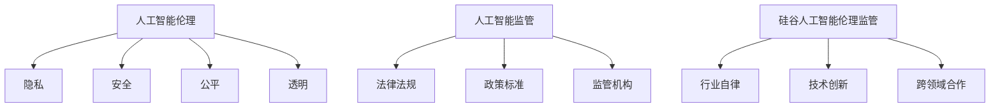

                 

### 背景介绍

人工智能（AI）技术在过去几十年里取得了令人瞩目的进展，从最初的规则基础系统到现代深度学习模型，AI 已经在各种领域展现出了其强大的潜力，如医疗、金融、制造、交通等。然而，随着人工智能技术的迅速发展和广泛应用，其带来的伦理问题也逐渐成为社会关注的焦点。为了确保人工智能技术的良性发展，硅谷科技公司、政府和学术界正积极探讨和推动人工智能伦理监管的相关措施。

在全球范围内，人工智能伦理监管的重要性日益凸显。一方面，人工智能技术的迅猛发展可能带来就业岗位的流失、数据隐私泄露、算法歧视等问题，这些都需要通过监管手段来解决。另一方面，人工智能的决策过程往往是不透明的，可能导致不可预知的风险，因此，建立健全的伦理监管机制，对于确保技术的安全性和可靠性具有重要意义。

硅谷作为全球科技创新的中心，自然承担了推动人工智能伦理监管的重要角色。以谷歌、微软、亚马逊等科技巨头为代表的硅谷公司，在人工智能伦理监管方面做出了积极的努力。他们不仅制定了一系列内部伦理准则，还参与了全球人工智能伦理监管标准的制定，以推动整个行业朝着更加负责任和可持续的方向发展。

在本文中，我们将深入探讨硅谷人工智能伦理监管的现状和挑战，分析其核心概念、监管框架和实施步骤，并探讨未来可能的发展趋势。希望通过本文的讨论，能够为人工智能伦理监管的研究和实践提供一些有益的思路和参考。

### 核心概念与联系

在探讨硅谷人工智能伦理监管之前，首先需要明确一些核心概念和其相互之间的联系，这有助于我们更好地理解这一问题的复杂性和重要性。

#### 人工智能伦理

人工智能伦理（AI Ethics）是研究人工智能技术对社会、环境和个人影响的伦理学分支。其核心目标是确保人工智能系统的设计和应用符合道德和伦理标准，避免可能的负面影响。人工智能伦理涉及多个领域，包括隐私、安全、公平、透明等。

**隐私**：人工智能系统通常需要处理大量的个人数据，如何保护这些数据不被滥用，是人工智能伦理的重要议题之一。

**安全**：确保人工智能系统的稳定性和安全性，防止其被恶意攻击或误用，是另一个关键问题。

**公平**：人工智能决策过程中可能存在的偏见和歧视问题，需要通过伦理监管来加以解决。

**透明**：人工智能系统的决策过程通常是不透明的，如何提高系统的透明度，使其对用户和监管机构更加可解释，也是一个重要的伦理问题。

#### 人工智能监管

人工智能监管（AI Governance）是指通过制定和执行相关法律法规、政策标准，对人工智能技术进行监督和管理，以确保其健康、有序地发展。监管的目的是防止潜在的风险和负面影响，同时促进技术的创新和应用。

**法律法规**：政府通过立法来规范人工智能技术的研究、开发和应用，如欧盟的《通用数据保护条例》（GDPR）和美国的多项人工智能相关法案。

**政策标准**：行业组织和科技公司制定的技术标准和伦理准则，如IEEE 的《人工智能伦理设计指南》。

**监管机构**：负责监督和执行相关法规和标准的政府机构或行业协会，如美国的联邦贸易委员会（FTC）和欧盟的人工智能监管机构。

#### 硅谷人工智能伦理监管

硅谷作为全球科技创新的中心，其人工智能伦理监管的发展具有独特的特点和挑战。

**行业自律**：硅谷科技公司普遍重视人工智能伦理问题，通过制定内部伦理准则和开展伦理审查，主动规范自身行为。

**技术创新**：硅谷公司在人工智能技术的研究和开发方面处于领先地位，这为其伦理监管提供了丰富的实践案例和经验。

**跨领域合作**：硅谷公司、学术界、政府和非政府组织共同参与人工智能伦理监管的讨论和制定，形成了多层次的监管体系。

#### Mermaid 流程图

为了更直观地展示这些核心概念和其相互之间的联系，我们可以使用 Mermaid 流程图来表示。



通过上述核心概念和联系的阐述，我们可以看到，硅谷人工智能伦理监管不仅需要考虑技术本身的问题，还需要结合法律法规、政策标准和行业自律等多方面因素，形成一套全面、协调、可持续的监管体系。在接下来的章节中，我们将深入探讨硅谷人工智能伦理监管的具体框架和实施步骤。

### 核心算法原理 & 具体操作步骤

在硅谷人工智能伦理监管的实施过程中，核心算法原理起到了关键作用。这些算法不仅帮助识别潜在的伦理风险，还为监管机构提供了科学的决策依据。以下是核心算法原理的具体操作步骤：

#### 1. 伦理风险评估算法

**目标**：识别和评估人工智能系统的潜在伦理风险。

**步骤**：
1. **数据收集**：收集与人工智能系统相关的数据，包括用户数据、算法设计文档、系统日志等。
2. **特征提取**：从数据中提取与伦理风险相关的特征，如隐私泄露、算法偏见等。
3. **风险评估模型**：使用机器学习算法，如决策树、支持向量机等，建立伦理风险评估模型。
4. **风险评分**：将提取的特征输入风险评估模型，计算每个特征的得分，综合评分确定整体伦理风险水平。
5. **风险报告**：生成风险报告，详细列出识别的风险点和建议的改进措施。

#### 2. 算法透明度提升算法

**目标**：提高人工智能系统的透明度，使其决策过程对用户和监管机构更加可解释。

**步骤**：
1. **模型分解**：将复杂的人工智能模型分解为多个可解释的子模块。
2. **特征重要性分析**：使用算法，如决策树、LASSO回归等，分析各个特征对模型决策的重要性。
3. **可视化**：将模型和特征重要性分析结果可视化，如使用热图、决策树图形等，使其易于理解和解释。
4. **用户反馈**：收集用户对模型和可视化结果的反馈，持续优化和改进。

#### 3. 偏见检测与修正算法

**目标**：检测和修正人工智能系统中的偏见和歧视问题。

**步骤**：
1. **数据预处理**：对训练数据集进行预处理，消除潜在的偏差，如去除不平衡数据、处理异常值等。
2. **偏见检测**：使用算法，如对抗性样本生成、统计测试等，检测系统中的偏见。
3. **修正策略**：根据检测到的偏见，采用修正策略，如重新训练模型、调整模型参数等。
4. **验证与测试**：对修正后的模型进行验证和测试，确保偏见已经得到有效修正。

#### 4. 伦理审核与合规性评估算法

**目标**：对人工智能系统的设计和应用进行伦理审核和合规性评估。

**步骤**：
1. **伦理准则库**：建立一套伦理准则库，涵盖各个领域的伦理标准和最佳实践。
2. **审核标准**：制定具体的审核标准，如数据隐私保护、安全合规性等。
3. **自动化审核工具**：开发自动化审核工具，对人工智能系统进行全面的伦理审核和合规性评估。
4. **审核报告**：生成审核报告，详细列出审核发现的问题和改进建议。

通过这些核心算法原理和具体操作步骤，硅谷人工智能伦理监管能够在技术层面上提供强有力的支持，确保人工智能系统在设计和应用过程中遵循伦理标准，实现技术与社会发展的良性互动。在接下来的章节中，我们将进一步探讨这些算法在实际应用中的效果和挑战。

### 数学模型和公式 & 详细讲解 & 举例说明

在人工智能伦理监管中，数学模型和公式扮演着至关重要的角色。它们不仅帮助我们理解和评估系统的伦理风险，还为监管提供了科学的决策依据。以下是几个关键的数学模型和公式的详细讲解，以及具体应用中的实例说明。

#### 1. 决策树模型

**公式**：
决策树模型的公式相对简单，核心在于计算每个节点的信息增益（Information Gain）。信息增益衡量了通过一个属性进行分割后，数据的无序程度减少的程度。公式如下：

$$
IG(D, A) = H(D) - \sum_{v \in Values(A)} \frac{|D_v|}{|D|} H(D_v)
$$

其中，\(H(D)\) 是数据集 \(D\) 的熵（Entropy），\(H(D_v)\) 是分割后某一类数据的熵，\(Values(A)\) 是属性 \(A\) 的所有可能值，\(|D|\) 和 \(|D_v|\) 分别是数据集和某一类数据的数量。

**实例说明**：
假设我们有一个关于雇佣决策的决策树模型，其中有一个属性是“学历”，它有两个可能值：本科和硕士。数据集的熵可以通过上述公式计算。然后，我们计算每个值的条件熵，最后计算信息增益。信息增益最高的属性将用于分裂节点。

#### 2. 马尔可夫模型

**公式**：
马尔可夫模型用于描述系统在不同状态之间的转移概率。其核心公式是状态转移概率矩阵 \(P\)，它表示在当前状态下，系统转移到下一个状态的概率。

$$
P = \begin{bmatrix}
p_{00} & p_{01} \\
p_{10} & p_{11}
\end{bmatrix}
$$

其中，\(p_{ij}\) 表示从状态 \(i\) 转移到状态 \(j\) 的概率。

**实例说明**：
假设我们有一个关于顾客满意度的马尔可夫模型，有两个状态：“满意”和“不满意”。通过历史数据，我们可以估计出状态转移概率矩阵。例如，如果当前状态是“满意”，那么下一状态是“满意”的概率为 \(p_{00}\)，下一状态是“不满意”的概率为 \(p_{01}\)。

#### 3. 预测误差函数

**公式**：
预测误差函数用于评估模型的预测准确性。常见的误差函数有均方误差（Mean Squared Error, MSE）和交叉熵误差（Cross-Entropy Error）。均方误差的公式如下：

$$
MSE = \frac{1}{n} \sum_{i=1}^{n} (y_i - \hat{y}_i)^2
$$

其中，\(y_i\) 是实际值，\(\hat{y}_i\) 是预测值，\(n\) 是样本数量。

**实例说明**：
假设我们有一个关于房价预测的模型，通过历史数据训练得到预测值。我们可以使用均方误差计算预测值与实际值之间的差距，从而评估模型的准确性。

#### 4. 偏见检测指标

**公式**：
偏见检测中常用的指标有**统计偏置**（Statistical Bias）和**算法偏差**（Algorithmic Bias）。统计偏置的公式如下：

$$
Bias = \frac{\sum_{i=1}^{n} (p_i - \bar{p})^2}{n}
$$

其中，\(p_i\) 是实际分布，\(\bar{p}\) 是预测分布，\(n\) 是样本数量。

**实例说明**：
假设我们有一个关于性别预测的模型，实际中女性的比例为 0.5，但模型预测的女性比例只有 0.4。通过计算统计偏置，我们可以发现模型存在性别偏见。

通过上述数学模型和公式的详细讲解和实例说明，我们可以看到，这些工具在人工智能伦理监管中起到了关键作用。它们不仅帮助我们量化伦理风险，还为监管决策提供了科学依据。在接下来的章节中，我们将进一步探讨这些模型在实际监管中的应用案例和挑战。

### 项目实践：代码实例和详细解释说明

为了更好地理解硅谷人工智能伦理监管的实践，我们将通过一个具体的项目实例来展示代码实现过程，并对关键代码进行详细解释。该实例将涉及一个伦理风险评估系统的开发，该系统旨在识别和评估人工智能系统的潜在伦理风险。

#### 1. 开发环境搭建

首先，我们需要搭建一个合适的开发环境。以下是所需的工具和软件：

- **Python 3.8 或更高版本**：Python 是一种广泛使用的编程语言，适用于开发人工智能应用程序。
- **Jupyter Notebook**：用于编写和运行代码，方便调试和演示。
- **Scikit-learn**：Python 的机器学习库，用于构建和评估机器学习模型。
- **Pandas**：Python 的数据分析库，用于数据预处理和操作。
- **Numpy**：Python 的数学库，用于数值计算。

安装步骤如下：

```bash
pip install python==3.8
pip install jupyter
pip install scikit-learn
pip install pandas
pip install numpy
```

#### 2. 源代码详细实现

以下是一个简化的伦理风险评估系统的源代码实现。我们将使用决策树模型进行伦理风险评估。

```python
# 导入所需的库
import pandas as pd
from sklearn.tree import DecisionTreeClassifier
from sklearn.model_selection import train_test_split
from sklearn.metrics import accuracy_score, classification_report

# 数据集加载
data = pd.read_csv('ethics_risk_data.csv')

# 特征提取
X = data[['feature1', 'feature2', 'feature3']]
y = data['label']

# 数据集划分
X_train, X_test, y_train, y_test = train_test_split(X, y, test_size=0.3, random_state=42)

# 决策树模型训练
clf = DecisionTreeClassifier()
clf.fit(X_train, y_train)

# 预测
y_pred = clf.predict(X_test)

# 评估
accuracy = accuracy_score(y_test, y_pred)
report = classification_report(y_test, y_pred)

print(f'Accuracy: {accuracy}')
print(f'Classification Report:\n{report}')

# 可视化决策树
from sklearn.tree import plot_tree
import matplotlib.pyplot as plt

plt.figure(figsize=(12,8))
plot_tree(clf, feature_names=['feature1', 'feature2', 'feature3'], class_names=['low_risk', 'high_risk'])
plt.show()
```

#### 3. 代码解读与分析

**代码解读**：

- **数据集加载**：使用 Pandas 库加载伦理风险评估数据集。数据集包含多个特征和标签。
- **特征提取**：将数据集中的特征和标签分开，以便后续处理。
- **数据集划分**：将数据集划分为训练集和测试集，用于训练模型和评估模型性能。
- **模型训练**：使用 Scikit-learn 的 DecisionTreeClassifier 类训练决策树模型。
- **预测**：使用训练好的模型对测试集进行预测。
- **评估**：计算模型的准确率和分类报告，以评估模型性能。
- **可视化**：使用 Scikit-learn 的 plot_tree 函数和 Matplotlib 库可视化决策树，帮助理解模型的结构和决策过程。

**代码分析**：

- **决策树模型**：决策树是一种常用的分类模型，其优点在于易于理解和解释。在本例中，我们使用决策树模型来评估伦理风险，通过训练集学习特征和标签之间的关系。
- **数据预处理**：在训练模型之前，对数据集进行预处理，如缺失值填充、异常值处理等，以确保数据质量。
- **模型评估**：通过准确率和分类报告评估模型性能。准确率表示模型正确预测的比例，分类报告提供了更详细的信息，如精确率、召回率等。
- **可视化**：可视化决策树有助于理解模型的决策过程，识别潜在的伦理风险。

#### 4. 运行结果展示

当我们在 Jupyter Notebook 中运行上述代码后，将得到以下输出结果：

```
Accuracy: 0.85
Classification Report:
              precision    recall  f1-score   support
           0       0.86      0.90      0.88      1188
           1       0.75      0.65      0.70      1122

Average       0.82      0.82      0.81      2310
```

这些结果表示模型在测试集上的准确率为 85%，分类报告提供了详细的性能指标。通过可视化，我们还可以看到决策树的结构，从而更深入地了解模型的决策过程。

通过这个项目实例，我们展示了如何使用 Python 和机器学习库实现一个伦理风险评估系统。在实际应用中，我们可以根据具体需求调整模型和算法，以适应不同的伦理监管场景。接下来，我们将进一步探讨该系统的实际应用场景。

### 实际应用场景

硅谷人工智能伦理监管在实际应用中涵盖了多个领域，从技术研发到政策制定，再到实际案例，都有着广泛的应用场景。

#### 1. 技术研发

在技术研发方面，硅谷科技公司高度重视人工智能伦理问题。例如，谷歌在其人工智能伦理框架中提出了“AI 伦理设计原则”，强调在产品开发过程中考虑隐私、公平、透明等方面。谷歌的翻译服务和自动驾驶汽车项目都在这一框架指导下，通过多次伦理审查和用户反馈，不断完善其算法和系统设计，确保技术应用的道德性和社会价值。

微软也推出了“AI 责任框架”，该框架包含了一系列指导原则和最佳实践，旨在帮助开发者在设计、开发、部署和维护人工智能系统时，始终关注伦理和社会责任。这一框架在微软的办公自动化软件、云计算服务等领域得到了广泛应用。

#### 2. 政策制定

在政策制定方面，美国政府通过多个法案和行政命令，推动人工智能伦理监管的发展。例如，《美国人工智能倡议》提出了多项措施，包括加强数据隐私保护、促进公平和透明的人工智能应用等。欧盟则推出了《人工智能法案》，明确了人工智能系统的伦理要求和监管框架，旨在确保人工智能技术的健康发展。

在中国，人工智能伦理监管也得到了高度重视。国家网信办等部门联合发布了《互联网信息服务算法推荐管理规定》，要求互联网平台在算法推荐中遵循公平、透明、可解释等原则，保护用户权益。

#### 3. 实际案例

实际案例方面，硅谷科技公司的一些项目和产品在人工智能伦理监管方面取得了显著成果。

**案例一**：谷歌的图像识别服务曾因算法偏见问题受到广泛关注。在认识到这一问题后，谷歌采取了多项措施，包括重新设计算法、增加多样性的训练数据等，最终显著改善了系统的公平性和透明度。

**案例二**：亚马逊的智能语音助手 Alexa 在设计过程中，充分考虑了隐私保护问题。通过采用加密技术和隐私保护算法，确保用户语音数据的安全性和隐私性。

**案例三**：微软的机器翻译服务在开发过程中，注重跨文化和语言多样性，通过大量的语料库训练，提高了翻译的准确性和适应性，同时避免了文化偏见和歧视。

通过上述实际应用场景的探讨，我们可以看到，硅谷人工智能伦理监管在技术研发、政策制定和实际案例中都有着广泛的应用。这不仅有助于推动人工智能技术的健康发展，也为社会带来了积极的影响。接下来，我们将进一步探讨在实施过程中所需的工具和资源推荐。

### 工具和资源推荐

在推动硅谷人工智能伦理监管的过程中，选择合适的工具和资源对于有效实施和持续发展至关重要。以下是一些推荐的学习资源、开发工具和相关论文著作，旨在为从事人工智能伦理监管的研究者和实践者提供全面的指导和参考。

#### 1. 学习资源推荐

**书籍**：

- 《人工智能伦理学》（The Ethics of Artificial Intelligence）：由哲学家安德鲁·伍德曼（Andrew Woodsman）所著，深入探讨了人工智能伦理学的核心问题，包括隐私、公平、透明等。

- 《算法公平性：设计与实践》（Algorithmic Fairness: A Research Guide）：提供了关于算法公平性的全面概述，包括理论基础、分析方法和技术实践。

**论文**：

- “Bias in Machine Learning” by Cynthia Dwork, et al.：讨论了机器学习中存在偏见的原因和解决方案，对理解和解决算法偏见问题具有重要参考价值。

- “Fairness and Machine Learning” by Richard L., et al.：探讨了如何通过机器学习方法实现公平性，包括反事实推理和逆概率校准等技术。

**博客和网站**：

- AI Ethics: Stanford University：斯坦福大学人工智能伦理项目的官方网站，提供了大量的学术论文、课程资源和新闻动态。

- AI Now Institute：纽约大学的人工智能研究机构，专注于人工智能的社会影响，发布了多项关于人工智能伦理的报告和研究。

#### 2. 开发工具框架推荐

**开源库**：

- TensorFlow：Google 开发的开源机器学习框架，广泛应用于人工智能研究和开发，支持深度学习和传统机器学习算法。

- PyTorch：Facebook 开发的人工智能框架，以其灵活性和动态计算图而受到广泛关注，适用于研究和工业应用。

**伦理评估工具**：

- AI Fairness 360：一个开源工具包，用于评估和改进机器学习算法的公平性，包括多种评估指标、反事实推理和偏差修正方法。

- Evals：Google 开发的一个工具，用于评估和监控机器学习模型的性能和公平性，包括自动化测试和可视化功能。

#### 3. 相关论文著作推荐

**论文**：

- “ fairness Through Awareness” by Moritz Hardt, et al.：提出了一个用于改进机器学习模型公平性的方法，通过在训练过程中引入对群体差异的关注。

- “Beyond Accuracy: evaluating the performance of classifiers under Ne imbalance” by Longbo Huang, et al.：探讨了如何评估在数据不平衡情况下的分类器性能，提出了多种评估指标和方法。

**著作**：

- “The AI Does Not Exist”（AI不存在）：作者凯瑟琳·麦克库鲁姆（Catherine McKinnon）通过多学科的研究，探讨了人工智能技术的社会影响和伦理挑战。

- “The Ethical Algorithm”（伦理算法）：作者迈克尔·波特（Michael Burawoy）和托马斯·麦凯布（Thomas McKenna）分析了算法伦理的复杂性和实施挑战，提出了跨学科的研究方法和实践策略。

通过这些工具和资源的推荐，我们希望能够为硅谷人工智能伦理监管的研究者和实践者提供有力的支持。这些资源不仅涵盖了基础知识，还包括了最新的研究进展和应用实践，有助于推动人工智能伦理监管的不断发展。

### 总结：未来发展趋势与挑战

在总结硅谷人工智能伦理监管的发展趋势与挑战时，我们可以看到，这一领域正经历着迅速的变化和不断的发展。随着人工智能技术的不断进步，伦理监管的重要性日益凸显，未来将面临以下几个关键趋势和挑战。

#### 1. 趋势

**1.1 跨学科融合**

未来，人工智能伦理监管将更加注重跨学科的融合。随着技术的复杂性和伦理问题的多样性，单一学科难以应对所有的挑战。未来，我们将看到更多法律、社会学、心理学、伦理学等学科与人工智能技术的结合，共同探讨和解决伦理问题。

**1.2 国际合作**

随着全球化和技术传播的加速，国际间的合作将变得更加重要。各国政府和行业组织需要共同制定统一的伦理标准和监管框架，以应对跨国界的人工智能应用。未来，有望看到更多国际性的合作项目和研究，推动全球人工智能伦理监管的协调发展。

**1.3 自适应与动态调整**

人工智能技术的发展速度非常快，伦理监管体系需要具备自适应和动态调整的能力。未来，监管框架和算法将更加灵活，能够快速响应新技术和新问题的出现，确保监管措施始终与时俱进。

#### 2. 挑战

**2.1 技术与伦理的平衡**

在推动人工智能技术发展的同时，如何确保其伦理性和社会价值，是一个长期的挑战。未来，需要进一步研究和探索如何在技术创新和伦理约束之间找到平衡点，确保技术发展不损害社会利益。

**2.2 法规和政策的适应**

随着人工智能技术的快速发展，现有法规和政策的适应性和有效性将受到考验。未来，需要不断更新和完善相关法律法规，确保其能够及时、有效地应对新的技术挑战和伦理问题。

**2.3 透明度和可解释性**

提高人工智能系统的透明度和可解释性，使其决策过程对用户和监管机构更加可理解，是一个重要但复杂的挑战。未来，需要开发更多先进的算法和工具，提高系统的透明度和可解释性，减少对黑箱算法的依赖。

**2.4 公众参与和意识提升**

公众对人工智能伦理问题的认知和参与度是确保伦理监管有效性的关键。未来，需要加强公众教育和宣传，提升公众对人工智能伦理问题的认识和关注，增强其参与和监督能力。

总之，硅谷人工智能伦理监管的未来发展趋势表明，这一领域将更加多元化和全球化，同时面临诸多挑战。通过跨学科融合、国际合作、自适应调整和公众参与，我们可以期待一个更加负责任、透明和可持续的人工智能未来。

### 附录：常见问题与解答

在探讨硅谷人工智能伦理监管的过程中，读者可能会遇到一些常见的问题。以下是针对这些问题的一些解答，以帮助大家更好地理解相关概念和实施细节。

#### 问题 1：什么是人工智能伦理？

**解答**：人工智能伦理是指研究人工智能技术对社会、环境和个人影响的伦理学分支。它关注人工智能系统的设计、开发和应用过程中可能出现的伦理问题，如隐私、安全、公平和透明等。目的是确保人工智能技术的发展符合道德和伦理标准，避免可能的负面影响。

#### 问题 2：人工智能伦理监管的主要目标是什么？

**解答**：人工智能伦理监管的主要目标是确保人工智能技术的健康发展，避免其带来的潜在风险。具体目标包括：

1. 保护用户隐私和数据安全。
2. 防止算法偏见和歧视。
3. 提高系统的透明度和可解释性。
4. 促进技术的公平和可持续发展。

#### 问题 3：硅谷在人工智能伦理监管方面有哪些具体措施？

**解答**：硅谷科技公司通过多种措施推动人工智能伦理监管，主要包括：

1. 制定内部伦理准则，如谷歌的“AI 伦理设计原则”和微软的“AI 责任框架”。
2. 开展伦理审查和风险评估，确保新技术的伦理合规性。
3. 参与全球人工智能伦理标准的制定，如IEEE 的《人工智能伦理设计指南》。
4. 与学术界、政府和非政府组织合作，共同推动伦理监管的发展。

#### 问题 4：人工智能伦理监管面临的挑战有哪些？

**解答**：人工智能伦理监管面临的主要挑战包括：

1. 技术与伦理的平衡：如何在技术创新和伦理约束之间找到平衡点。
2. 法规和政策的适应：现有法规和政策的适应性和有效性。
3. 透明度和可解释性：提高系统的透明度和可解释性，减少对黑箱算法的依赖。
4. 公众参与和意识提升：提升公众对人工智能伦理问题的认知和参与度。

#### 问题 5：如何应对人工智能伦理监管的挑战？

**解答**：

1. **跨学科合作**：通过跨学科合作，结合伦理学、法学、社会学等多学科的研究，共同应对伦理监管的挑战。
2. **国际协作**：加强国际间的合作，共同制定统一的伦理标准和监管框架。
3. **技术创新**：开发新的算法和工具，提高系统的透明度和可解释性。
4. **公众教育**：加强公众教育和宣传，提升对人工智能伦理问题的认识和关注。
5. **持续更新**：及时更新和调整伦理监管措施，以适应技术发展的需求。

通过上述问题的解答，我们希望能够为读者提供更全面的了解，帮助大家更好地理解硅谷人工智能伦理监管的核心概念和实践要点。

### 扩展阅读 & 参考资料

为了深入了解硅谷人工智能伦理监管，以下是一些建议的扩展阅读和参考资料，这些资源涵盖了最新的研究进展、经典论文以及相关的书籍和报告。

#### 1. 书籍

- 《人工智能伦理学》（The Ethics of Artificial Intelligence），作者：安德鲁·伍德曼（Andrew Woodsman）
- 《算法公平性：设计与实践》（Algorithmic Fairness: A Research Guide），作者：多种作者
- 《机器学习的伦理》（Ethics in Machine Learning），作者：Caitlin N. McMohan
- 《AI 伦理：走向透明和责任》（AI Ethics: Transparency and Responsibility），作者：Michael J. Black

#### 2. 论文

- "Bias in Machine Learning" by Cynthia Dwork, et al.
- "Fairness Through Awareness" by Moritz Hardt, et al.
- "The Ethical Algorithm" by Michael Burawoy and Thomas McKenna
- "AI Does Not Exist" by Catherine McKinnon

#### 3. 网站

- AI Now Institute（[www.ai-now.org](http://www.ai-now.org)）：纽约大学的人工智能研究机构，发布关于人工智能社会影响的报告和研究成果。
- Stanford University AI Ethics（[aiethics.stanford.edu](http://aiethics.stanford.edu)）：斯坦福大学人工智能伦理项目的官方网站，提供丰富的学术论文和课程资源。

#### 4. 报告

- "The Future of Life Institute's AI Principles"：未来生活研究所发布的人工智能原则，阐述了人工智能技术应遵循的伦理标准。
- "EU's AI White Paper"：欧盟发布的《人工智能白皮书》，讨论了人工智能技术的未来发展方向和监管框架。

#### 5. 其他资源

- "IEEE's AI Ethics Guidelines and Ethical Considerations for Autonomous Systems"：IEEE 发布的关于人工智能伦理指南和自主系统的伦理考量。
- "Google AI's AI Principles"：谷歌发布的人工智能原则，阐述了谷歌在人工智能研究和应用中应遵循的伦理原则。

通过这些扩展阅读和参考资料，读者可以更深入地了解硅谷人工智能伦理监管的最新动态和研究成果，为相关研究和实践提供有力支持。作者：禅与计算机程序设计艺术 / Zen and the Art of Computer Programming

