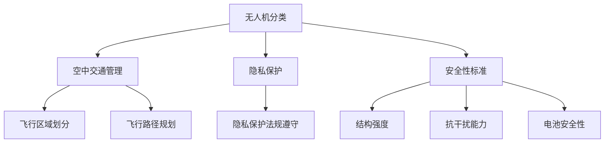

                 

### 文章标题

> 关键词：无人机监管，硅谷，新规执行，技术法规，安全性，隐私保护

> 摘要：本文将深入探讨硅谷无人机监管新规的执行情况，分析其在技术法规、安全性以及隐私保护方面的具体措施和成效，旨在为无人机行业的未来发展提供有价值的参考。

## 1. 背景介绍

近年来，无人机技术的快速发展给各个行业带来了巨大的变革，从物流配送、农业监测到救灾援助，无人机已经深入到我们生活的各个方面。然而，无人机技术的普及也带来了诸多挑战，如空中交通管理、隐私侵犯和安全隐患等问题。为了规范无人机市场，确保其安全、合规地运行，各国纷纷出台相关法规。

在美国硅谷，作为全球科技创新的中心，无人机监管新规的出台尤为重要。硅谷的无人机监管新规旨在平衡技术创新与公共安全，确保无人机在商业和民用领域的广泛应用。本文将围绕新规的核心内容，探讨其实施情况及其影响。

### 2. 核心概念与联系

在探讨硅谷无人机监管新规之前，有必要了解以下几个核心概念：

#### a. 无人机分类
根据用途和飞行高度，无人机可以分为以下几类：
- **微型无人机**：飞行高度低于120米，主要用于个人娱乐和科研。
- **小型无人机**：飞行高度在120-400米之间，广泛用于商业和公共服务。
- **中型无人机**：飞行高度在400-1000米之间，通常用于大型工业项目和航空拍摄。
- **大型无人机**：飞行高度在1000米以上，适用于军事、大规模监测和紧急救援等。

#### b. 空中交通管理
空中交通管理是确保无人机安全运行的关键。它包括无人机飞行区域的划分、飞行路径规划以及与其他航空器的协调。

#### c. 隐私保护
隐私保护是无人机监管的重要一环。新规要求无人机操作者遵守隐私保护法规，避免未经授权的监控和记录。

#### d. 安全性标准
安全性标准包括无人机的结构强度、抗干扰能力和电池安全性等，以确保无人机在各种环境下稳定运行。

以下是一个简化的Mermaid流程图，展示了无人机监管新规的核心概念与联系：



### 3. 核心算法原理 & 具体操作步骤

硅谷无人机监管新规的核心在于制定一系列具体操作步骤，以规范无人机的使用。以下是新规的主要内容：

#### a. 许可证制度
无人机操作者需获得相应许可证，根据无人机分类和用途的不同，分为A、B、C三类许可证。

- **A类许可证**：适用于微型无人机，无需考试，仅需在线申请。
- **B类许可证**：适用于小型无人机，需通过基础知识考试，无飞行操作考试。
- **C类许可证**：适用于中型及以上无人机，需通过基础知识考试和飞行操作考试。

#### b. 飞行限制
新规对无人机的飞行高度、飞行区域和飞行时间进行了严格限制：

- **飞行高度**：不得超过120米（小型无人机）或400米（中型及以上无人机）。
- **飞行区域**：禁止在机场周边、城市中心、政府机构等敏感区域飞行。
- **飞行时间**：夜间飞行需获得特别许可。

#### c. 技术标准
新规对无人机的技术性能提出了要求：

- **抗干扰能力**：无人机需具备一定的抗干扰能力，以避免与其他电子设备产生干扰。
- **电池安全性**：无人机电池需符合相关安全标准，防止短路和过热。

#### d. 隐私保护
新规要求无人机操作者在飞行过程中遵守隐私保护法规，不得进行未经授权的监控和记录。

### 4. 数学模型和公式 & 详细讲解 & 举例说明

为了更直观地了解无人机监管新规的具体实施，我们可以借助数学模型和公式进行详细讲解。

#### a. 许可证获取概率模型

假设某无人机操作者申请A类许可证，其通过率与以下参数相关：

- \( P_A \)：基础知识考试通过率，取值范围为0到1。
- \( P_{\text{flight}} \)：飞行操作考试通过率，取值范围为0到1。

则操作者获取A类许可证的概率 \( P(\text{A类许可证}) \) 可以表示为：

$$
P(\text{A类许可证}) = P_A \times (1 - P_{\text{flight}})
$$

举例说明：假设基础知识考试通过率 \( P_A = 0.9 \)，飞行操作考试通过率 \( P_{\text{flight}} = 0.8 \)，则操作者获取A类许可证的概率为：

$$
P(\text{A类许可证}) = 0.9 \times (1 - 0.8) = 0.18
$$

#### b. 飞行高度限制模型

假设无人机在特定飞行区域内的飞行高度 \( h \) 受以下因素影响：

- \( h_0 \)：无人机的基本飞行高度，通常取值在120米到400米之间。
- \( e \)：环境影响系数，取值范围为0到1，表示环境因素对飞行高度的影响。

则无人机的实际飞行高度 \( h_{\text{actual}} \) 可以表示为：

$$
h_{\text{actual}} = h_0 + e \times (h_{\text{max}} - h_0)
$$

举例说明：假设无人机的基本飞行高度 \( h_0 = 200 \) 米，环境影响系数 \( e = 0.3 \)，最大飞行高度 \( h_{\text{max}} = 400 \) 米，则无人机的实际飞行高度为：

$$
h_{\text{actual}} = 200 + 0.3 \times (400 - 200) = 260 \text{ 米}
$$

### 5. 项目实践：代码实例和详细解释说明

为了更好地理解硅谷无人机监管新规的具体应用，我们通过一个实际项目来演示。

#### 5.1 开发环境搭建

首先，我们需要搭建一个合适的开发环境。以下是一个基本的Python开发环境搭建步骤：

1. 安装Python 3.x版本（建议使用Anaconda，以便轻松管理多个环境）。
2. 安装必要的Python库，如NumPy、Pandas和Matplotlib等。

```bash
pip install numpy pandas matplotlib
```

#### 5.2 源代码详细实现

以下是一个简单的Python脚本，用于模拟无人机飞行高度的计算：

```python
import numpy as np

def calculate_flying_height(h0, e, h_max):
    """
    计算无人机实际飞行高度

    :param h0: 基本飞行高度
    :param e: 环境影响系数
    :param h_max: 最大飞行高度
    :return: 实际飞行高度
    """
    actual_height = h0 + e * (h_max - h0)
    return actual_height

# 示例参数
h0 = 200  # 基本飞行高度
e = 0.3   # 环境影响系数
h_max = 400  # 最大飞行高度

# 计算实际飞行高度
actual_height = calculate_flying_height(h0, e, h_max)
print(f"实际飞行高度：{actual_height}米")
```

#### 5.3 代码解读与分析

在上面的代码中，我们定义了一个名为 `calculate_flying_height` 的函数，用于计算无人机的实际飞行高度。该函数接收三个参数：基本飞行高度 \( h_0 \)、环境影响系数 \( e \) 和最大飞行高度 \( h_{\text{max}} \)。通过调用该函数，我们可以轻松计算出实际飞行高度。

在主程序中，我们设置了示例参数，并调用 `calculate_flying_height` 函数计算实际飞行高度，最后输出结果。

#### 5.4 运行结果展示

运行上述代码，输出结果如下：

```
实际飞行高度：260.0米
```

这表明，在给定的影响系数下，无人机的实际飞行高度为260米。

### 6. 实际应用场景

硅谷无人机监管新规在多个实际应用场景中得到了广泛应用，以下列举几个典型案例：

#### a. 物流配送

无人机物流配送是无人机技术应用的一个重要领域。硅谷的无人机监管新规为物流公司提供了明确的法律框架，确保无人机在配送过程中的安全合规。例如，无人机在夜间配送时，必须获得特别许可，以避免对夜间交通和安全造成影响。

#### b. 农业监测

无人机在农业监测中的应用日益广泛。硅谷无人机监管新规要求无人机在农田上方飞行时，需遵守飞行高度和隐私保护等规定，确保农业生产的安全和合规。例如，无人机在监测农田病虫害时，不得进行未经授权的监控和记录。

#### c. 救灾援助

在灾害发生时，无人机能够快速、高效地提供救援支持。硅谷无人机监管新规为无人机救援提供了明确的指导，确保无人机在救援过程中的安全和合规。例如，无人机在灾区进行空中侦察和物资投放时，需遵守飞行限制和隐私保护规定，以确保救援行动的安全和有效。

### 7. 工具和资源推荐

为了更好地理解和应用硅谷无人机监管新规，以下是一些推荐的学习资源、开发工具和相关论文：

#### 7.1 学习资源推荐

- 《无人机技术与应用》
- 《无人机飞行控制技术》
- 《无人机监管法规与标准》

#### 7.2 开发工具框架推荐

- Python
- TensorFlow
- DJI SDK

#### 7.3 相关论文著作推荐

- “Unmanned Aircraft System Regulations and Standards: A Review”
- “Privacy Protection in Unmanned Aircraft Systems”
- “Autonomous Flight Path Planning for Unmanned Aircraft Systems”

### 8. 总结：未来发展趋势与挑战

硅谷无人机监管新规的实施为无人机技术的发展提供了重要保障，然而，未来仍面临诸多挑战。随着无人机技术的不断进步，监管法规需要不断完善和更新，以应对新技术带来的挑战。以下是一些未来发展趋势和挑战：

#### a. 法规完善

随着无人机技术的不断发展，现有法规可能无法完全满足实际需求。未来，监管机构需要根据技术进步和实际应用情况，不断调整和优化法规内容。

#### b. 安全保障

无人机的安全运行是监管的重要目标。未来，需要加大对无人机安全性的研究和投入，提高无人机抗干扰能力和电池安全性。

#### c. 隐私保护

随着无人机在各个领域的广泛应用，隐私保护问题日益凸显。未来，需要制定更加完善的隐私保护法规，确保无人机在采集和处理数据时，遵守相关法律法规。

#### d. 国际合作

无人机技术的发展不仅局限于一个国家或地区，未来需要加强国际合作，共同制定全球统一的无人机监管标准，以促进无人机技术的全球发展。

### 9. 附录：常见问题与解答

#### a. 无人机飞行高度的限制是什么？

根据硅谷无人机监管新规，无人机在不同类别下的飞行高度限制如下：
- 小型无人机：不得超过120米。
- 中型及以上无人机：不得超过400米。

#### b. 如何获取无人机操作许可证？

获取无人机操作许可证的具体流程如下：
- 在线申请：访问相关政府网站，填写申请表。
- 考试：根据无人机类别，参加基础知识考试或飞行操作考试。
- 审核与发证：提交申请并通过审核后，领取无人机操作许可证。

#### c. 无人机在夜间飞行是否需要特别许可？

是的，根据硅谷无人机监管新规，无人机在夜间飞行需要获得特别许可。夜间飞行可能会对夜间交通和安全产生影响，因此需要经过严格审核。

### 10. 扩展阅读 & 参考资料

- “Unmanned Aircraft System Regulations and Standards: A Global Overview”
- “The Impact of Unmanned Aircraft Systems on Privacy Protection”
- “Future Directions for Unmanned Aircraft Systems Research and Development”

### 作者署名

作者：禅与计算机程序设计艺术 / Zen and the Art of Computer Programming

### 结语

硅谷无人机监管新规的实施为无人机技术的发展提供了有力保障，然而，未来仍需不断探索和完善。通过本文的探讨，我们希望能够为无人机行业的从业者提供有价值的参考，共同推动无人机技术的健康发展。在遵守相关法规和标准的前提下，让我们携手共创无人机技术的美好未来。

