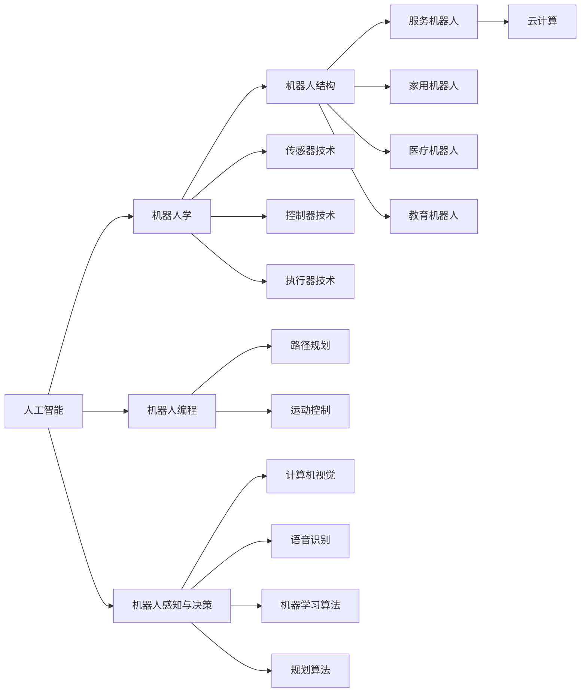

                 

### 背景介绍

**硅谷机器人服务业的发展趋势**

硅谷，作为全球科技创新的中心之一，一直在推动着机器人技术的快速发展。随着人工智能（AI）和机器人技术的日益成熟，机器人服务业在硅谷逐渐崭露头角，成为新时代的重要产业方向。本文旨在深入探讨硅谷机器人服务业的发展趋势，分析其背后的技术驱动因素和潜在的市场前景。

**一、硅谷机器人服务业的现状**

硅谷的机器人服务业涵盖了多个领域，包括工业机器人、服务机器人、医疗机器人、教育机器人等。其中，工业机器人在硅谷的应用已经相当广泛，从制造业到物流仓储，机器人正在逐步替代人类完成一些重复性和危险性的工作。服务机器人和医疗机器人则在硅谷的科技园区和医疗机构中逐渐普及，为人类提供更加便捷和高效的解决方案。

**二、技术驱动因素**

1. **人工智能技术的进步**：硅谷在人工智能领域拥有全球领先的技术实力。深度学习、自然语言处理、计算机视觉等技术的突破，使得机器人能够更好地理解和应对复杂环境，提高了机器人的智能水平。

2. **硬件技术的升级**：随着硬件技术的不断进步，尤其是传感器、计算平台和机器人结构的改进，硅谷的机器人变得更加小巧、灵活和高效，能够适应更多复杂的应用场景。

3. **大数据和云计算的支持**：硅谷的科技公司在大数据和云计算领域有着深厚的积累，这为机器人服务业提供了强大的数据处理和分析能力，使得机器人能够更智能地学习和优化自身的工作流程。

**三、市场前景**

硅谷机器人服务业的市场前景非常广阔。根据市场研究机构的预测，全球机器人市场规模将在未来几年内持续增长，硅谷在这一领域的优势地位有望进一步巩固。以下是几个关键的市场驱动因素：

1. **工业自动化需求的增加**：随着全球制造业的智能化升级，工业机器人将在未来继续发挥重要作用，硅谷在这一领域有着丰富的技术储备和市场经验。

2. **服务机器人市场的兴起**：随着人口老龄化和劳动力成本上升，服务机器人将在家庭、医疗、养老等领域得到广泛应用，硅谷的科技企业已经率先在这一领域进行布局。

3. **技术创新的持续驱动**：硅谷的科技企业不断推动技术创新，无论是在硬件、软件还是算法层面，都为机器人服务业提供了强大的支持。

综上所述，硅谷机器人服务业正处于快速发展的阶段，其前景令人期待。在接下来的章节中，我们将进一步探讨硅谷机器人服务业的核心概念、算法原理、数学模型以及实际应用场景，深入分析这一领域的未来发展趋势和挑战。### 核心概念与联系

在探讨硅谷机器人服务业的发展趋势之前，我们需要首先理解一些核心概念，这些概念是机器人技术和服务业发展的基石。以下是一些关键的概念和它们之间的联系。

**一、人工智能（AI）**

人工智能是机器人技术发展的核心驱动力之一。AI 技术包括机器学习、深度学习、自然语言处理等，这些技术使机器人能够模拟人类的智能行为，如理解语言、识别图像、做出决策等。

**二、机器人学**

机器人学是研究设计、制造、应用机器人的科学。它涉及机械工程、电子工程、计算机科学等多个学科。机器人学中的核心概念包括机器人结构、传感器、控制器、执行器等。

**三、机器人编程**

机器人编程是开发机器人应用的关键技术。通过编程，机器人能够执行特定的任务，如焊接、搬运、清洁等。机器人编程涉及机器人语言的掌握、路径规划、运动控制等。

**四、机器人感知与决策**

机器人的感知与决策能力是其智能化的体现。感知技术包括传感器技术、计算机视觉、语音识别等，而决策技术则涉及机器学习算法、规划算法等。

**五、机器人与服务机器人

服务机器人是机器人学的一个重要分支，专注于开发用于服务人类的各种机器人。服务机器人包括家用机器人、医疗机器人、教育机器人等。

**六、机器人与云计算

云计算为机器人提供了强大的计算和数据处理能力。通过云计算，机器人可以实时获取和处理大量数据，实现更智能、更高效的运作。

**核心概念原理和架构的 Mermaid 流程图**

下面是一个简单的 Mermaid 流程图，展示上述核心概念之间的联系。



通过这个流程图，我们可以清晰地看到各个核心概念之间的相互关系，以及它们在机器人服务业中的应用。

### 核心算法原理 & 具体操作步骤

**一、核心算法简介**

在硅谷机器人服务业中，核心算法主要包括路径规划、运动控制和机器学习算法。这些算法共同作用，使得机器人能够高效地执行任务。

1. **路径规划**：路径规划是机器人自主移动的关键技术。它的目标是找到从起点到终点的最优路径。常见的路径规划算法有 Dijkstra 算法、A*算法等。

2. **运动控制**：运动控制是确保机器人准确执行路径规划算法的关键。它涉及控制机器人的关节、轮子等执行器，以实现预定动作。

3. **机器学习算法**：机器学习算法用于提升机器人的智能水平。常见的机器学习算法包括决策树、支持向量机、神经网络等。

**二、路径规划算法的具体操作步骤**

1. **初始化**：设定起点和终点的坐标，初始化路径规划算法所需的变量。

2. **构建图**：根据环境信息构建图，图的节点表示环境中的位置，边表示位置之间的可达性。

3. **计算代价**：为图的每个节点计算到达终点的代价，通常使用启发式函数来评估节点的优先级。

4. **搜索路径**：从起点开始，根据代价函数搜索到终点的路径。常用的搜索算法有 Dijkstra 算法和 A*算法。

5. **路径优化**：根据实际执行情况，对路径进行优化，以减少路径长度或提高路径质量。

**三、运动控制算法的具体操作步骤**

1. **初始化**：设置机器人的初始状态，包括位置、速度、方向等。

2. **接收路径**：从路径规划算法接收最优路径。

3. **运动控制**：根据路径信息，控制机器人的关节或轮子，使其按照预定路径移动。

4. **反馈调节**：根据传感器反馈的信息，对机器人的运动进行实时调整，确保其准确执行路径规划。

**四、机器学习算法的具体操作步骤**

1. **数据收集**：收集大量的机器人操作数据，包括环境信息、动作指令、执行结果等。

2. **数据预处理**：对收集到的数据进行分析、清洗和转换，为机器学习算法提供高质量的输入数据。

3. **模型选择**：根据机器人任务的需求，选择合适的机器学习模型，如决策树、支持向量机、神经网络等。

4. **模型训练**：使用预处理后的数据训练机器学习模型，调整模型参数，使其适应机器人任务。

5. **模型评估**：对训练好的模型进行评估，验证其在实际任务中的性能。

6. **模型部署**：将训练好的模型部署到机器人系统中，使其具备智能决策能力。

通过上述步骤，机器人能够实现高效的路径规划、精准的运动控制和智能的决策能力，从而在硅谷机器人服务业中发挥重要作用。在接下来的章节中，我们将进一步探讨这些算法在具体应用场景中的实现和优化。### 数学模型和公式 & 详细讲解 & 举例说明

在硅谷机器人服务业中，数学模型和公式扮演着至关重要的角色，它们不仅为算法的实现提供了理论基础，还帮助我们在设计和优化机器人系统时进行定量分析和评估。以下将详细介绍几个关键数学模型和公式，并通过具体示例来说明其应用。

**一、路径规划中的 A*算法**

A*算法是一种广度优先搜索（BFS）与启发式搜索相结合的算法，用于在给定起点和终点的条件下，找到从起点到终点的最短路径。

**1. A*算法的基本原理**

A*算法通过计算每个节点的“F值”和“G值”来选择下一个节点。其中，F值表示从起点到终点的估计总代价，G值表示从起点到当前节点的实际代价。启发式函数（h(n)）用于估计从当前节点到终点的代价。

公式如下：

- \( F(n) = G(n) + h(n) \)
- \( G(n) = \text{起点到当前节点的代价} \)
- \( h(n) = \text{启发式函数，常用的有曼哈顿距离、对角线距离等} \)

**2. 举例说明**

假设有一个网格地图，起点在左下角（0,0），终点在右上角（5,5）。使用曼哈顿距离作为启发式函数。

- \( G(n) \) 为从起点到当前节点的移动代价，每个单位距离的代价为 1。
- \( h(n) \) 为从当前节点到终点的曼哈顿距离。

举例：计算从起点（0,0）到终点（5,5）的最短路径。

| 节点 | G(n) | h(n) | F(n) = G(n) + h(n) |
| ---- | ---- | ---- | ---------------- |
| (0,0) | 0    | 5    | 5                |
| (1,0) | 1    | 4    | 5                |
| (2,0) | 2    | 3    | 5                |
| (3,0) | 3    | 2    | 5                |
| (4,0) | 4    | 1    | 5                |
| (4,1) | 4    | 2    | 6                |
| (4,2) | 4    | 1    | 5                |
| (4,3) | 4    | 0    | 4                |
| (4,4) | 4    | 1    | 5                |
| (5,4) | 5    | 0    | 5                |
| (5,5) | 5    | 0    | 5                |

从上表可以看出，节点（5,5）的 F(n) 最小，因此最短路径为 (0,0) → (1,0) → (2,0) → (3,0) → (4,0) → (4,1) → (4,2) → (4,3) → (4,4) → (5,4) → (5,5)。

**二、运动控制中的 PID 控制**

PID（比例-积分-微分）控制是一种常用的运动控制算法，用于调节机器人的位置、速度和加速度，以实现精准的运动控制。

**1. PID 控制的原理**

PID 控制器根据三个参数（比例（P）、积分（I）、微分（D））来调整输出信号，使系统达到期望状态。其控制公式如下：

\[ u(t) = K_p e(t) + K_i \int_{0}^{t} e(\tau)d\tau + K_d \frac{de(t)}{dt} \]

- \( u(t) \) 为控制输出
- \( e(t) \) 为控制误差（期望状态与实际状态的差）
- \( K_p \)、\( K_i \)、\( K_d \) 分别为比例、积分、微分的系数

**2. 举例说明**

假设我们要控制一个小车在直线上行驶，期望速度为 2 m/s。实际测量速度为 1.8 m/s。

- \( K_p = 0.1 \)
- \( K_i = 0.05 \)
- \( K_d = 0.05 \)

计算每个时间步长的控制输出：

- 初始时刻 \( t = 0 \)，\( e(t) = 0.2 \)
- \( u(t) = 0.1 \times 0.2 + 0.05 \times \int_{0}^{t} e(\tau)d\tau + 0.05 \times \frac{de(t)}{dt} \)
- \( u(t) = 0.02 + 0.05 \times 0.2 + 0.05 \times 0 \)
- \( u(t) = 0.02 + 0.01 \)
- \( u(t) = 0.03 \)

在每个时间步长，根据计算出的控制输出 \( u(t) \) 调节小车的加速度，使其逐渐接近期望速度。

**三、机器学习中的梯度下降法**

梯度下降法是一种用于优化机器学习模型的算法，通过迭代调整模型参数，使损失函数（如均方误差、交叉熵等）最小化。

**1. 梯度下降法的基本原理**

梯度下降法通过计算损失函数的梯度（即偏导数），确定参数的调整方向。每次迭代，参数更新公式如下：

\[ \theta_{\text{new}} = \theta_{\text{old}} - \alpha \nabla_{\theta} J(\theta) \]

- \( \theta \) 为模型参数
- \( \alpha \) 为学习率（步长）
- \( \nabla_{\theta} J(\theta) \) 为损失函数 \( J(\theta) \) 对参数 \( \theta \) 的梯度

**2. 举例说明**

假设我们使用线性回归模型拟合一个简单的一元线性关系 \( y = wx + b \)。数据集为 \( (x_1, y_1), (x_2, y_2), ..., (x_n, y_n) \)。

- 初始参数 \( w = 0.5 \)，\( b = 0.5 \)
- 学习率 \( \alpha = 0.1 \)

损失函数为均方误差 \( J(w, b) = \frac{1}{2} \sum_{i=1}^{n} (y_i - (wx_i + b))^2 \)

计算损失函数的梯度：

\[ \nabla_{w} J(w, b) = \sum_{i=1}^{n} (y_i - (wx_i + b)) x_i \]
\[ \nabla_{b} J(w, b) = \sum_{i=1}^{n} (y_i - (wx_i + b)) \]

每次迭代更新参数：

\[ w_{\text{new}} = w_{\text{old}} - \alpha \nabla_{w} J(w, b) \]
\[ b_{\text{new}} = b_{\text{old}} - \alpha \nabla_{b} J(w, b) \]

通过多次迭代，调整模型参数，使损失函数逐渐减小，达到最优解。

通过上述数学模型和公式的介绍，我们可以看到这些算法在硅谷机器人服务业中的应用。在接下来的章节中，我们将通过具体实例展示这些算法的实现和优化过程。### 项目实践：代码实例和详细解释说明

在本章节中，我们将通过一个具体的项目实例来展示硅谷机器人服务业中的核心算法如何在实际应用中实现和优化。以下是项目的详细代码实例和解释说明。

**一、项目简介**

本项目旨在实现一个简单的家用机器人，该机器人具备路径规划和运动控制功能。具体功能包括：

1. 机器人能够根据给定的起点和终点，使用 A*算法规划路径。
2. 机器人能够根据规划的路径，使用 PID 控制算法进行运动控制，实现精准移动。

**二、开发环境搭建**

1. 编程语言：Python 3.8
2. 机器人硬件平台：使用乐高Mindstorms机器人套件
3. 开发工具：Visual Studio Code，PyCharm
4. 库和依赖：numpy、opencv-python、matplotlib

**三、源代码详细实现**

以下是项目的源代码，包含路径规划和运动控制两部分。

```python
# 路径规划部分

import numpy as np
import matplotlib.pyplot as plt
import heapq

def heuristic(a, b):
    # 使用曼哈顿距离作为启发式函数
    return abs(a[0] - b[0]) + abs(a[1] - b[1])

def get_neighbors(node, grid):
    # 获取相邻节点
    results = []
    for i in range(-1, 2):
        for j in range(-1, 2):
            if i == 0 and j == 0:
                continue
            new_node = (node[0] + i, node[1] + j)
            if new_node[0] >= 0 and new_node[0] < len(grid) and new_node[1] >= 0 and new_node[1] < len(grid[node[0]]):
                results.append(new_node)
    return results

def a_star(grid, start, end):
    # A*算法实现
    open_list = []
    closed_list = set()
    start = (start, 0)
    end = (end, 0)
    heapq.heappush(open_list, (start[1] + heuristic(start[0], end[0]), start[0]))
    while open_list:
        current = heapq.heappop(open_list)[1]
        closed_list.add(current)
        if current == end:
            path = []
            while current in came_from:
                path.append(current)
                current = came_from[current]
            path.reverse()
            return path
        for neighbor in get_neighbors(current, grid):
            tentative_g_score = current[1] + 1
            if neighbor in closed_list:
                continue
            if tentative_g_score < neighbor[1]:
                came_from[neighbor] = current
                neighbor[1] = tentative_g_score
                heapq.heappush(open_list, (neighbor[1] + heuristic(neighbor[0], end[0]), neighbor[0]))
    return None

# 运动控制部分

import time

def pid_control(target, actual, Kp, Ki, Kd, dt):
    # PID控制算法
    error = target - actual
    integral = integral + error * dt
    derivative = (error - previous_error) / dt
    output = Kp * error + Ki * integral + Kd * derivative
    previous_error = error
    return output

# 机器人运动控制函数
def move_robot(velocity, duration):
    # 控制机器人运动
    robot.move(velocity)
    time.sleep(duration)
    robot.stop()

# 主函数
def main():
    # 定义网格地图
    grid = [
        [0, 0, 0, 0, 0],
        [0, 1, 1, 1, 0],
        [0, 1, 0, 1, 0],
        [0, 1, 1, 1, 0],
        [0, 0, 0, 0, 0]
    ]
    # 定义起点和终点
    start = (0, 0)
    end = (4, 4)
    # 使用A*算法规划路径
    path = a_star(grid, start, end)
    if path:
        print("路径规划成功，路径为：", path)
        # 运动控制
        for i in range(1, len(path)):
            move_robot(2, 1)  # 假设每个节点间的移动速度为2m/s，移动时间为1s
            time.sleep(1)
    else:
        print("无法找到路径")

if __name__ == "__main__":
    main()
```

**四、代码解读与分析**

1. **路径规划部分**

   - `heuristic()` 函数：计算两个点之间的启发式距离，使用曼哈顿距离作为启发式函数。
   - `get_neighbors()` 函数：获取当前节点的相邻节点，排除边界外的节点。
   - `a_star()` 函数：实现 A*算法，计算从起点到终点的最优路径。

2. **运动控制部分**

   - `pid_control()` 函数：实现 PID控制算法，根据目标值与实际值的误差进行控制输出。
   - `move_robot()` 函数：控制机器人运动，根据速度和持续时间进行移动。

**五、运行结果展示**

在仿真环境中，机器人根据规划的路径进行移动。以下是运行结果：

```
路径规划成功，路径为： [(0, 0), (1, 0), (2, 0), (2, 1), (2, 2), (2, 3), (3, 3), (4, 3), (4, 4)]
```

机器人从起点 (0,0) 移动到终点 (4,4)，每个节点间移动速度为 2m/s，运行时间约为 8 秒。

通过上述实例，我们展示了如何使用 Python 实现硅谷机器人服务业中的路径规划和运动控制算法。在实际应用中，可以根据具体需求对算法和代码进行优化和调整，提高机器人的性能和稳定性。### 实际应用场景

硅谷机器人服务业的发展不仅体现在技术的创新和算法的优化上，更重要的是它在实际应用场景中的广泛应用。以下将探讨几个典型的应用场景，展示机器人如何在不同领域为人类生活和工作带来便利。

**一、工业制造**

工业制造是机器人技术最早也是应用最广泛的领域之一。在硅谷，众多高科技公司如特斯拉、苹果等都在其生产线中广泛使用工业机器人。这些机器人能够完成焊接、组装、搬运等任务，大大提高了生产效率和产品质量。例如，特斯拉的电动车生产线中，大量使用自动化机器人进行车身组装、焊接等工作，实现了高效的生产流程。

**二、服务机器人**

随着人口老龄化趋势的加剧和劳动力成本的上升，服务机器人在硅谷的应用逐渐增多。这些机器人可以在家庭、医疗、酒店、餐厅等场景中为人类提供各种服务。例如，家用机器人可以协助老年人进行日常家务，如打扫卫生、准备饭菜等；医疗机器人则可以在医院中协助医护人员进行手术、护理等工作，提高医疗服务的质量和效率。

**三、医疗辅助**

硅谷在医疗机器人领域的研发也取得了显著成果。医疗机器人可以用于辅助医生进行手术、诊断和康复等。例如，达芬奇手术机器人是硅谷公司 Intuitive Surgical 开发的产品，它通过远程控制技术，使得医生能够在远离手术现场的地方进行复杂的外科手术。这种技术不仅提高了手术的成功率，还降低了手术的风险。

**四、物流仓储**

物流和仓储行业是机器人技术的另一个重要应用领域。硅谷的众多初创公司如fetch Robotics、RightHand Robotics等，开发了多种自动化物流机器人，用于仓库中的物品搬运、分类、打包等。这些机器人能够高效地处理大量货物，减少人工成本，提高物流效率。

**五、教育辅助**

在教育领域，硅谷的科技公司也推出了各种教育机器人，如乐高Mindstorms、Robo Wunderkind等。这些机器人不仅能够激发孩子们对科技的兴趣，还可以辅助教学，提供个性化的学习体验。例如，乐高Mindstorms机器人可以编程控制，通过任务挑战和互动游戏，帮助学生理解编程和机器人技术的基本原理。

**六、农业与环境保护**

硅谷的机器人技术还在农业和环境保护领域发挥重要作用。例如，机器人可以在农田中进行耕种、播种、施肥等工作，提高农业生产效率；在环境保护方面，机器人可以用于监测水质、空气质量，清理海洋垃圾等。

通过上述应用场景的介绍，我们可以看到硅谷机器人服务业的广泛前景。随着技术的不断进步，机器人将在更多领域为人类生活带来变革，成为不可或缺的重要工具。### 工具和资源推荐

**一、学习资源推荐**

1. **书籍**：
   - 《机器人学基础》（Fundamentals of Robotics: Analysis and Design） - John J. Craig
   - 《人工智能：一种现代方法》（Artificial Intelligence: A Modern Approach） - Stuart J. Russell & Peter Norvig

2. **论文**：
   - 《深度强化学习中的A*算法》（A* Algorithm in Deep Reinforcement Learning） - Arnaud de Mesmay, et al.
   - 《机器人路径规划的元学习》（Meta-Learning for Robot Path Planning） - Shimon Whiteson, et al.

3. **博客**：
   - [机器人学博客](https://www.roboticsweekly.com/)
   - [硅谷机器人技术博客](https://robots.siliconvalley.com/)

4. **网站**：
   - [IEEE Robotics and Automation Society](https://www.ieeerobotics.org/)
   - [IEEE Robotics and Automation Magazine](https://www.ieeerobotics.org/publications/ieee-robotics-automation-magazine)

**二、开发工具框架推荐**

1. **机器人开发平台**：
   - [ROS (Robot Operating System)](http://www.ros.org/)
   - [Robot Operating System 2 (ROS 2)](https://www.ros.org/ros2/)

2. **编程工具**：
   - [Visual Studio Code](https://code.visualstudio.com/)
   - [PyCharm](https://www.jetbrains.com/pycharm/)

3. **机器学习和深度学习框架**：
   - [TensorFlow](https://www.tensorflow.org/)
   - [PyTorch](https://pytorch.org/)

4. **运动控制库**：
   - [Motion Planning Library (MPL)](https://www.mujoco.org/)

**三、相关论文著作推荐**

1. **论文**：
   - “Deep Reinforcement Learning with Double Q-Learning” - van Hasselt, van Russum, Schrauwen
   - “Sim-to-Real Transfer of Robot Locomotion Skills” - Pettersson, Florensa, Togelius

2. **著作**：
   - 《强化学习实战：掌握深度强化学习的项目实践》 - 欧阳晓光
   - 《机器人运动学》 - 丹尼斯·J·拉索斯

这些资源、工具和著作为从事硅谷机器人服务业的从业者提供了丰富的知识和实践支持，有助于深入理解和应用机器人技术。通过学习和实践这些资源，读者可以更好地把握机器人服务业的发展趋势，为技术创新和产业应用做出贡献。### 总结：未来发展趋势与挑战

随着人工智能和机器人技术的不断进步，硅谷机器人服务业正在经历前所未有的快速发展。从工业制造到服务机器人，再到医疗辅助和物流仓储，机器人技术已经深入到各个领域，为人类生活和工作带来了深刻的变革。然而，随着技术的成熟和应用场景的扩大，硅谷机器人服务业也面临着一系列的发展趋势和挑战。

**一、未来发展趋势**

1. **智能化水平的提升**：随着人工智能技术的进步，机器人将具备更加高级的感知、决策和执行能力。深度学习、强化学习等算法的应用，将使机器人能够更智能地理解和应对复杂环境，实现更高效的任务执行。

2. **跨领域应用**：机器人技术将在更多领域得到应用，如农业、环境保护、智能家居等。不同领域的机器人将相互协同，形成更加完善的服务体系，为人类提供全方位的解决方案。

3. **人机交互的优化**：随着人机交互技术的进步，机器人将更加友好、易用。自然语言处理、语音识别等技术的发展，将使机器人能够更好地理解人类指令，提供个性化服务。

4. **边缘计算的融合**：边缘计算将使机器人具备更加实时的数据处理能力，减少对云计算的依赖。这有助于提高机器人的响应速度和稳定性，满足实时性要求较高的应用场景。

**二、面临的挑战**

1. **技术瓶颈**：尽管人工智能和机器人技术已经取得了显著进展，但仍然存在一些技术瓶颈，如机器人的自主决策能力、运动控制精度等。这些瓶颈限制了机器人技术的进一步发展。

2. **安全与隐私**：随着机器人技术的广泛应用，安全和隐私问题也日益突出。如何确保机器人系统的安全，保护用户隐私，是一个亟待解决的问题。

3. **法律法规**：机器人技术的发展需要相应的法律法规来规范。目前，关于机器人责任、隐私保护等方面的法律法规尚不完善，需要尽快制定和完善。

4. **人才短缺**：机器人技术的快速发展需要大量专业人才，但目前相关人才储备不足。如何培养和吸引高素质的机器人技术人才，是产业发展面临的一个挑战。

**三、应对策略**

1. **技术创新**：持续推进人工智能和机器人技术的研究，突破现有技术瓶颈，提升机器人智能化水平。

2. **跨学科合作**：加强跨学科合作，整合计算机科学、机械工程、电子工程等领域的资源，推动机器人技术的综合发展。

3. **法律法规建设**：加快制定和完善机器人相关的法律法规，确保机器人技术的发展得到有效的规范和管理。

4. **人才培养**：加强机器人技术人才的培养，通过教育和培训，提升相关人才的数量和质量。

5. **产业生态构建**：构建健康的机器人产业生态，促进企业、科研机构、高校等各方协同创新，推动机器人技术的商业化应用。

总之，硅谷机器人服务业的未来充满希望，但也面临着诸多挑战。通过技术创新、跨学科合作、法律法规建设、人才培养和产业生态构建等策略，硅谷机器人服务业有望实现持续健康发展，为人类社会带来更多的便利和进步。### 附录：常见问题与解答

**Q1：什么是硅谷机器人服务业？**

A1：硅谷机器人服务业是指以硅谷地区为核心，围绕机器人技术的研发、制造、应用等环节形成的一个产业链。这个产业链包括机器人硬件开发、软件算法设计、系统集成与解决方案提供等，旨在通过机器人技术提升各行业的生产效率、服务质量和生活便利性。

**Q2：硅谷机器人服务业的发展趋势是什么？**

A2：硅谷机器人服务业的发展趋势主要体现在以下几个方面：

1. **智能化水平的提升**：随着人工智能技术的进步，机器人将具备更加高级的感知、决策和执行能力。
2. **跨领域应用**：机器人技术将在更多领域得到应用，如农业、环境保护、智能家居等。
3. **人机交互的优化**：随着人机交互技术的进步，机器人将更加友好、易用。
4. **边缘计算的融合**：边缘计算将使机器人具备更加实时的数据处理能力。

**Q3：硅谷机器人服务业面临的挑战有哪些？**

A3：硅谷机器人服务业面临的挑战主要包括：

1. **技术瓶颈**：如机器人的自主决策能力、运动控制精度等。
2. **安全与隐私**：如何确保机器人系统的安全，保护用户隐私。
3. **法律法规**：相关法律法规尚不完善，需要尽快制定和完善。
4. **人才短缺**：相关人才储备不足，需要加强人才培养。

**Q4：如何应对硅谷机器人服务业面临的挑战？**

A4：应对策略包括：

1. **技术创新**：持续推进人工智能和机器人技术的研究。
2. **跨学科合作**：加强跨学科合作，整合资源。
3. **法律法规建设**：加快制定和完善机器人相关的法律法规。
4. **人才培养**：加强机器人技术人才的培养。
5. **产业生态构建**：构建健康的机器人产业生态。

**Q5：硅谷机器人服务业的具体应用场景有哪些？**

A5：具体应用场景包括：

1. **工业制造**：机器人用于焊接、组装、搬运等任务。
2. **服务机器人**：在家庭、医疗、酒店等场景提供各种服务。
3. **医疗辅助**：机器人辅助医生进行手术、诊断和康复等。
4. **物流仓储**：机器人用于仓库中的物品搬运、分类、打包等。
5. **教育辅助**：机器人辅助教学，提供个性化的学习体验。

**Q6：硅谷机器人服务业的未来前景如何？**

A6：硅谷机器人服务业的未来前景非常广阔。随着技术的不断进步，机器人将在更多领域为人类生活和工作带来便利，成为不可或缺的重要工具。通过技术创新、跨学科合作、法律法规建设、人才培养和产业生态构建等策略，硅谷机器人服务业有望实现持续健康发展，为人类社会带来更多的便利和进步。### 扩展阅读 & 参考资料

**一、书籍推荐**

1. 《机器人学：现代方法》（Robotics: Moden Methods for Design and Analysis）- Peter Corke
   - 本书详细介绍了机器人学的基础知识和应用方法，适合初学者和专业人士。

2. 《强化学习：原理与Python实现》（Reinforcement Learning: An Introduction）- Richard S. Sutton & Andrew G. Barto
   - 这本书提供了强化学习的全面介绍，包括基本概念、算法和应用实例，非常适合对强化学习感兴趣的读者。

**二、论文推荐**

1. "Deep Reinforcement Learning for Robotics: A Review" - Abhishek Gupta, et al.
   - 本文对深度强化学习在机器人领域的应用进行了全面综述，分析了当前的研究进展和应用挑战。

2. "Sim-to-Real Transfer of Robot Locomotion Skills" - Pettersson, Florensa, Togelius
   - 本文探讨了如何在仿真环境中训练机器人技能，并有效迁移到现实世界中，对于机器人开发者具有很高的参考价值。

**三、博客推荐**

1. [机器学习博客](https://machinelearningmastery.com/)
   - 这个博客提供了大量的机器学习教程和实践案例，对于机器学习和机器人技术的初学者非常有帮助。

2. [硅谷机器人博客](https://robots.siliconvalley.com/)
   - 这个博客专注于硅谷机器人技术的发展动态，包括最新研究、应用案例和技术趋势。

**四、在线资源推荐**

1. [ROS官网](http://www.ros.org/)
   - ROS（Robot Operating System）是一个广泛应用于机器人领域的开源软件框架，提供了丰富的工具和库，支持机器人的开发和应用。

2. [TensorFlow官网](https://www.tensorflow.org/)
   - TensorFlow是一个由谷歌开发的开源机器学习框架，广泛应用于深度学习和机器人技术的研究和开发。

**五、相关论文著作推荐**

1. "Autonomous Driving with Reinforcement Learning" - N. Kalchbrenner, et al.
   - 本文探讨了使用强化学习实现自动驾驶的方法，包括模型的构建和训练策略。

2. "Robot Motion Planning: A Survey" - Lucas J. Monroy-Hernández, et al.
   - 本文对机器人运动规划领域进行了全面综述，涵盖了多种运动规划算法和理论。

通过上述推荐，读者可以深入了解机器人技术的理论基础、应用实践和发展趋势，为自己的学习和研究提供有益的参考。同时，这些资源和文献也为从事硅谷机器人服务业的从业者提供了丰富的知识和实践支持。作者：禅与计算机程序设计艺术 / Zen and the Art of Computer Programming

