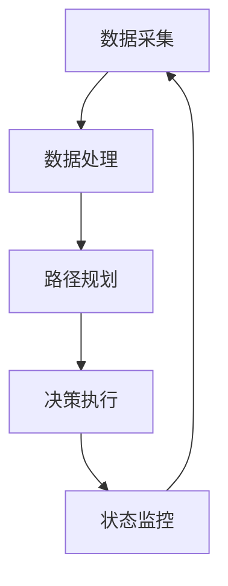

                 

### 1. 背景介绍

自动驾驶汽车，被誉为“未来交通的标志”，正迅速成为全球技术创新的焦点。从科幻电影中的“未来车”到现实中的智能驾驶，这一技术的演进不仅改变了我们的出行方式，也对整个交通行业、城市规划和经济发展产生了深远的影响。

自动驾驶技术的发展历程可以追溯到20世纪50年代。1950年，美国科学家约翰·艾森豪威尔提出了“智能高速公路”的概念，旨在通过自动化技术提高交通效率和安全性。然而，真正的自动驾驶技术研究始于20世纪70年代，当时计算机技术的飞速发展使得自动驾驶成为可能。

进入21世纪，随着传感器、人工智能、大数据等技术的不断突破，自动驾驶汽车迎来了爆发式的发展。特斯拉、谷歌、百度等科技巨头纷纷投入巨额资金和人力进行研发。自动驾驶汽车不再只是实验室中的实验品，逐渐走入了人们的日常生活。

当前，自动驾驶技术已经从简单的辅助驾驶发展到具备部分自动驾驶功能的L2级别，向完全自动驾驶的L5级别迈进。L2级别的自动驾驶技术主要集中在车道保持、自适应巡航控制等功能上，而L5级别的自动驾驶则可以实现无人驾驶、零人工干预的出行体验。这一技术变革不仅有望减少交通事故，还能有效缓解城市交通拥堵，提高运输效率。

总体来看，自动驾驶技术的发展经历了从概念验证到实验研究，再到商业化应用的三个阶段。在这个过程中，全球各地的科研机构和科技公司不断推动技术创新，使得自动驾驶汽车在性能、安全性和可靠性方面不断取得突破。

接下来，我们将深入探讨自动驾驶汽车的核心技术、算法原理、数学模型，并通过实际项目案例展示其具体应用，从而全面了解这一前沿技术。

### 2. 核心概念与联系

#### 2.1 自动驾驶级别的定义与分类

自动驾驶汽车按照自动化程度和功能范围可以分为多个级别，从L0（无自动化）到L5（完全自动化）。以下是各个级别的详细定义：

- **L0级别**：没有自动化功能，所有驾驶操作均由人类驾驶员完成。
- **L1级别**：部分自动化，主要功能包括自适应巡航控制（ACC）和车道保持辅助（LKA）。
- **L2级别**：有限自动化，车辆在特定条件下可以同时执行多项驾驶任务，如特斯拉的“自动驾驶”功能。
- **L3级别**：有条件自动化，车辆可以在特定环境下完全接管驾驶操作，但需要人类驾驶员在必要时接管控制。
- **L4级别**：高度自动化，车辆在特定环境下可以完全自主驾驶，无需人类干预。
- **L5级别**：完全自动化，车辆在任何环境下都可以实现无人驾驶。

自动驾驶级别的分类标准不仅包括自动化程度，还涉及安全性、可靠性、功能范围等多个方面。国际汽车工程师协会（SAE）制定了相关的分类标准，为自动驾驶技术的发展提供了统一的评估体系。

#### 2.2 自动驾驶系统的组成

自动驾驶系统通常由多个核心组成部分构成，包括传感器、计算平台、控制系统和通信系统。以下是各个组成部分的详细功能：

- **传感器**：自动驾驶汽车依赖于多种传感器获取环境信息，包括激光雷达（Lidar）、雷达、摄像头、超声波传感器等。这些传感器可以实时检测周围障碍物、道路标志、车道线等信息，为自动驾驶系统提供必要的数据支持。
- **计算平台**：计算平台是自动驾驶系统的“大脑”，主要负责处理传感器数据、执行算法和决策。高性能的计算平台可以快速处理大量数据，提高自动驾驶系统的响应速度和准确性。
- **控制系统**：控制系统根据计算平台提供的决策，控制车辆的动作，包括加速、制动、转向等。控制系统需要具备高精度、高可靠性和实时性，以确保车辆的安全行驶。
- **通信系统**：通信系统实现车辆与车辆（V2V）、车辆与基础设施（V2I）以及车辆与云端的通信。通过V2V通信，车辆可以相互交换实时信息，避免碰撞；通过V2I通信，车辆可以获取交通信号、路况信息等；通过云端通信，车辆可以获得远程支持和更新。

#### 2.3 自动驾驶系统的工作原理

自动驾驶系统的工作原理可以概括为以下几个步骤：

1. **数据采集**：传感器系统采集车辆周围的环境数据，包括道路标志、车道线、障碍物等。
2. **数据处理**：计算平台对采集到的数据进行分析和处理，生成环境地图和障碍物信息。
3. **路径规划**：根据环境地图和障碍物信息，计算平台生成车辆行驶的路径和动作指令。
4. **决策执行**：控制系统根据计算平台提供的决策指令，控制车辆的加速、制动、转向等动作。
5. **状态监控**：自动驾驶系统实时监控车辆的状态和行驶环境，确保安全性和可靠性。

#### 2.4 自动驾驶系统的发展趋势

自动驾驶系统正朝着更高效、更安全、更智能的方向发展。以下是一些主要趋势：

- **传感器技术**：激光雷达、摄像头、雷达等传感器技术的不断进步，使得自动驾驶系统可以更准确地感知和理解周围环境。
- **人工智能算法**：深度学习、强化学习等人工智能算法在自动驾驶系统中的应用，使得车辆的决策能力大幅提升。
- **多传感器融合**：通过多传感器数据融合，自动驾驶系统可以更全面、准确地感知环境，提高系统的可靠性和安全性。
- **车联网（V2X）技术**：车联网技术的推广，使得车辆可以实现与周围车辆、基础设施和云端的高效通信，提高交通效率和安全性。
- **标准化与法规**：自动驾驶技术的标准化和法规的制定，为自动驾驶系统的普及提供了法律保障。

#### 2.5 自动驾驶系统的挑战与解决方案

尽管自动驾驶系统取得了显著进展，但仍然面临诸多挑战：

- **安全性和可靠性**：如何确保自动驾驶系统的安全性和可靠性，是当前亟待解决的重要问题。通过多传感器融合和冗余设计，可以提高系统的可靠性和容错能力。
- **极端环境适应性**：自动驾驶系统需要在各种极端环境下稳定运行，如雨雪、雾霾等。通过提高传感器性能和算法鲁棒性，可以增强系统在极端环境下的适应性。
- **数据隐私**：自动驾驶系统需要收集大量的车辆和环境数据，如何保护用户隐私成为重要议题。通过数据加密和隐私保护技术，可以保障用户数据的安全。
- **法规与伦理**：自动驾驶系统在实际应用中涉及到法律法规和伦理道德问题，如责任归属、隐私权等。通过制定相关法律法规和伦理规范，可以引导自动驾驶技术的健康发展。

#### 2.6 自动驾驶系统与城市交通的关系

自动驾驶系统不仅改变了个人出行方式，也对城市交通产生了深远影响。以下是一些关键点：

- **交通效率**：自动驾驶系统可以提高交通效率，减少交通拥堵，提高道路容量。
- **交通安全**：自动驾驶系统可以减少人为失误，降低交通事故发生率，提高道路安全性。
- **城市交通管理**：自动驾驶系统可以通过与交通信号灯、路侧单元等设施的高效通信，优化城市交通管理，提高交通流效率。
- **智慧城市建设**：自动驾驶系统是智慧城市建设的重要组成部分，可以推动城市智能化、可持续发展。

总的来说，自动驾驶系统的发展不仅有望提高个人出行的便利性，还可以为城市交通、环境保护等方面带来积极影响。随着技术的不断进步和政策的支持，自动驾驶系统将在未来发挥越来越重要的作用。

#### 2.7 自动驾驶系统的 Mermaid 流程图

以下是一个简化的自动驾驶系统的 Mermaid 流程图，展示了系统从数据采集到决策执行的基本流程。



在图中，A代表传感器系统采集环境数据，B表示数据处理和算法分析，C表示路径规划，D表示决策执行，E表示状态监控。整个过程形成了一个闭环，确保自动驾驶系统可以实时响应环境变化，实现安全稳定的行驶。

通过上述核心概念与联系的介绍，我们为后续详细探讨自动驾驶技术的算法原理、数学模型以及实际应用场景奠定了基础。

---

### 3. 核心算法原理 & 具体操作步骤

#### 3.1 视觉感知算法

视觉感知是自动驾驶系统的核心组成部分，其主要任务是解析车辆周围的环境信息，包括道路、车道线、交通标志、行人、车辆等。以下是一些常用的视觉感知算法：

1. **目标检测算法**：
   - **YOLO（You Only Look Once）**：YOLO 是一种基于卷积神经网络（CNN）的一体化目标检测算法。它通过将图像分割成网格单元，在每个单元中预测目标类别和边界框。YOLO 具有检测速度快、实时性高的特点。
   - **SSD（Single Shot MultiBox Detector）**：SSD 是另一种单步检测算法，它通过不同尺度的卷积层来检测目标。SSD 在检测精度和速度之间取得了较好的平衡。

2. **车道线检测算法**：
   - **Hough Transform**：Hough 变换是一种经典的图像处理算法，用于检测图像中的直线。在车道线检测中，Hough 变换可以识别出图像中的直线，从而确定车道线位置。
   - **Deep Learning**：通过深度学习模型，如 CNN 和 R-CNN，可以更准确地检测和识别车道线。这些模型通过对大量标注数据的学习，能够提取出图像中的车道线特征。

3. **目标跟踪算法**：
   - **KCF（Kernel Correlation Filter）**：KCF 是一种基于核相关滤波器的目标跟踪算法。它通过计算目标特征和图像特征之间的相关性来跟踪目标，具有实时性和鲁棒性。
   - **Siamese Network**：Siamese Network 是一种基于深度学习的目标跟踪算法。它使用两个共享权重的网络来检测和跟踪目标，具有高效和准确的特点。

#### 3.2 感知数据处理流程

自动驾驶系统的感知数据处理流程主要包括以下几个步骤：

1. **数据采集**：传感器系统（如摄像头、激光雷达）采集车辆周围的环境数据。
2. **数据预处理**：对采集到的原始数据进行滤波、降噪、归一化等预处理操作，以提高数据质量和算法性能。
3. **特征提取**：通过卷积神经网络、特征提取器等算法从预处理后的数据中提取出有用的特征。
4. **融合与融合策略**：
   - **单一传感器数据融合**：将不同传感器（如摄像头、激光雷达）的数据进行融合，以获得更全面的环境信息。
   - **多源数据融合**：结合传感器数据、GPS 数据、IMU 数据等，进行多源数据融合，以提高环境感知的精度和可靠性。

#### 3.3 路径规划算法

路径规划是自动驾驶系统中的关键任务，其主要目标是根据车辆当前的位置、目标位置以及周围环境信息，生成一条最优行驶路径。以下是一些常用的路径规划算法：

1. **Dijkstra 算法**：
   - Dijkstra 算法是一种经典的单源最短路径算法。它通过计算每个节点到起点的最短路径，从而生成最优路径。Dijkstra 算法适用于简单的网格环境，但在复杂道路环境下性能可能较差。

2. **A*算法**：
   - A*算法是 Dijkstra 算法的改进版本。它通过引入启发函数（Heuristic），使得搜索过程更具方向性，从而提高路径规划的效率。A*算法适用于较为复杂的环境，但在节点数量庞大时计算量较大。

3. **RRT（Rapidly-exploring Random Tree）算法**：
   - RRT 算法是一种基于采样随机树（Random Tree）的路径规划算法。它通过随机采样目标位置，并逐步生成一条到达目标的路径。RRT 算法具有较强的全局搜索能力，适用于动态和复杂环境。

4. **DRP（Differentiable Rapidly-exploring Random Tree）算法**：
   - DRP 算法是对 RRT 算法的改进，它通过引入可微的搜索策略，使得路径规划过程可以与深度学习模型结合，从而实现更高效的路径规划。

#### 3.4 行为预测与控制算法

在自动驾驶系统中，行为预测与控制算法是确保车辆安全行驶的重要环节。以下是一些常用的行为预测与控制算法：

1. **马尔可夫决策过程（MDP）**：
   - MDP 是一种基于概率模型的行为预测算法。它通过建立状态和动作的概率模型，预测其他车辆的行为，并根据预测结果进行控制决策。

2. **深度强化学习**：
   - 深度强化学习（Deep Reinforcement Learning，DRL）通过神经网络来建模状态和动作的价值函数，实现自主学习和行为预测。DRL 算法在自动驾驶系统中表现出色，可以处理复杂的行为预测和控制问题。

3. **粒子滤波**：
   - 粒子滤波是一种基于概率分布的状态估计算法。它通过在状态空间中采样大量粒子，并对粒子进行权重更新，从而估计系统的状态。粒子滤波在处理非线性、非高斯状态估计问题时具有优势。

#### 3.5 算法实现与优化

自动驾驶算法的实现和优化是确保系统性能和可靠性的关键。以下是一些实现和优化方法：

1. **并行计算**：
   - 通过并行计算，可以显著提高算法的执行速度。在自动驾驶系统中，可以利用多核 CPU 和 GPU 来加速计算。

2. **模型压缩**：
   - 模型压缩技术（如量化、剪枝、蒸馏等）可以减少模型的参数量和计算量，从而提高算法的运行效率。

3. **实时性优化**：
   - 实时性优化是确保自动驾驶系统在特定时间内完成计算的关键。通过算法优化和硬件加速，可以提高系统的实时性。

4. **容错设计**：
   - 通过冗余设计和故障检测机制，可以确保自动驾驶系统在出现故障时仍能安全行驶。

通过上述核心算法原理和具体操作步骤的介绍，我们为自动驾驶系统的研究和应用提供了理论和技术支持。接下来，我们将通过实际项目案例，进一步展示这些算法的具体应用和效果。

---

### 4. 数学模型和公式 & 详细讲解 & 举例说明

在自动驾驶系统中，数学模型和公式起着至关重要的作用。它们不仅帮助描述系统的行为，还提供了计算最优路径、预测车辆行为等关键功能。以下将详细介绍几个关键的数学模型和公式，并通过具体例子进行说明。

#### 4.1 概率图模型

概率图模型是一种用于表示变量之间概率关系的数学工具，广泛应用于机器学习和自动驾驶领域。其中，贝叶斯网络和马尔可夫网络是两种常见的概率图模型。

1. **贝叶斯网络**：

贝叶斯网络是一种有向无环图（DAG），它通过节点和边来表示变量之间的条件依赖关系。在贝叶斯网络中，每个节点表示一个随机变量，边表示变量之间的条件独立性。

**公式**：

贝叶斯网络中的概率分布可以用条件概率表（Conditional Probability Table, CPT）表示。对于有 $n$ 个父节点的节点 $X$，其条件概率表为：

$$
P(X|x_1, x_2, ..., x_n) = \prod_{i=1}^n P(x_i|x_{i-1})
$$

其中，$P(x_i|x_{i-1})$ 表示节点 $x_i$ 在其父节点 $x_{i-1}$ 的条件下的概率。

**例子**：

假设我们有一个简单的贝叶斯网络，描述了车辆在自动驾驶过程中遇到障碍物的概率。该网络包括两个节点：障碍物（$O$）和车辆反应时间（$R$）。障碍物 $O$ 的父节点为车辆速度 $V$。根据经验数据，我们可以建立以下条件概率表：

$$
\begin{aligned}
P(O|V) &= \begin{cases}
0.1 & \text{if } V \leq 20 \\
0.3 & \text{if } 20 < V \leq 40 \\
0.5 & \text{if } V > 40
\end{cases} \\
P(R|O, V) &= \begin{cases}
0.2 & \text{if } O = 1, V \leq 20 \\
0.4 & \text{if } O = 1, 20 < V \leq 40 \\
0.6 & \text{if } O = 1, V > 40 \\
0.1 & \text{if } O = 0, V \leq 20 \\
0.3 & \text{if } O = 0, 20 < V \leq 40 \\
0.5 & \text{if } O = 0, V > 40
\end{cases}
\end{aligned}
$$

通过贝叶斯网络，我们可以计算车辆在给定速度下的障碍物概率和反应时间概率，从而为自动驾驶系统的决策提供依据。

2. **马尔可夫网络**：

马尔可夫网络是一种无向图模型，它通过节点和边表示变量之间的转移概率。在马尔可夫网络中，任意一个节点的概率仅与其直接邻居节点相关，而与更远距离的节点无关。

**公式**：

马尔可夫网络中的转移概率可以用转移矩阵 $P$ 表示。对于连续两个时间步 $t$ 和 $t+1$，变量 $X_t$ 和 $X_{t+1}$ 的转移概率为：

$$
P(X_{t+1}|X_t) = P(X_{t+1}|X_{t-1}, X_{t-2}, ..., X_1)
$$

**例子**：

假设我们有一个简单的马尔可夫网络，描述了自动驾驶车辆在不同路况下的行驶状态转移。该网络包括三个节点：干燥路面（$D$）、湿滑路面（$W$）和车辆速度（$V$）。根据道路监测数据，我们可以建立以下转移矩阵：

$$
P =
\begin{bmatrix}
P_{DD} & P_{DW} & P_{DV} \\
P_{WD} & P_{WW} & P_{WV} \\
P_{VD} & P_{VW} & P_{VV}
\end{bmatrix}
$$

通过马尔可夫网络，我们可以计算车辆在不同路况下的状态转移概率，从而预测车辆在未来的行驶状态。

#### 4.2 优化模型

优化模型在自动驾驶系统中用于路径规划、资源分配等任务。常见的优化模型包括线性规划、动态规划、随机规划等。

1. **线性规划**：

线性规划（Linear Programming，LP）是一种用于解决线性优化问题的数学方法。在自动驾驶路径规划中，我们可以使用线性规划来求解最优路径。

**公式**：

线性规划的一般形式为：

$$
\min_{x} c^T x
$$

$$
\text{subject to} \quad Ax \leq b
$$

其中，$c$ 是目标函数系数向量，$x$ 是决策变量向量，$A$ 是约束系数矩阵，$b$ 是约束常数向量。

**例子**：

假设我们需要在给定的交通网络中找到一条从起点 $A$ 到终点 $B$ 的最优路径。根据道路距离和交通流量数据，我们可以建立以下线性规划模型：

$$
\min_{x} \sum_{i=1}^n d_i x_i
$$

$$
\text{subject to} \quad a_{ij} x_j \leq b_i, \quad i=1,2,...,n
$$

其中，$d_i$ 表示路径 $i$ 的长度，$x_i$ 表示路径 $i$ 是否被选择（$1$ 表示选择，$0$ 表示未选择），$a_{ij}$ 表示路径 $i$ 和路径 $j$ 的连接情况，$b_i$ 表示路径 $i$ 的容量限制。

通过求解上述线性规划模型，我们可以找到从起点 $A$ 到终点 $B$ 的最优路径。

2. **动态规划**：

动态规划（Dynamic Programming，DP）是一种用于解决多阶段决策问题的优化方法。在自动驾驶系统中，动态规划可以用于路径规划、资源分配等问题。

**公式**：

动态规划的基本思想是将复杂问题分解为若干子问题，并利用子问题的最优解构建原问题的最优解。

假设有一个动态规划问题，状态集合为 $S$，决策集合为 $A$，状态转移方程为 $s_t = f(s_{t-1}, a_{t-1})$，则动态规划的基本公式为：

$$
V(s_t) = \min_{a_t} \{R(s_t, a_t) + \gamma V(s_{t+1})\}
$$

其中，$V(s_t)$ 表示状态 $s_t$ 的最优价值函数，$R(s_t, a_t)$ 表示状态 $s_t$ 在执行决策 $a_t$ 时的回报，$\gamma$ 是折扣因子。

**例子**：

假设我们需要在给定的交通网络中找到一条从起点 $A$ 到终点 $B$ 的最优路径，并且每个决策节点都有多个选择。根据道路距离和交通流量数据，我们可以建立以下动态规划模型：

$$
V(i, j) = \min_{a} \{d(i, a) + \gamma V(a, j)\}
$$

其中，$V(i, j)$ 表示从起点 $A$ 到终点 $B$ 的最优路径经过节点 $i$ 和节点 $j$ 的价值函数，$d(i, a)$ 表示从节点 $i$ 到节点 $a$ 的距离。

通过求解上述动态规划模型，我们可以找到从起点 $A$ 到终点 $B$ 的最优路径。

3. **随机规划**：

随机规划（Stochastic Programming）是一种用于处理不确定性的优化方法。在自动驾驶系统中，随机规划可以用于应对环境不确定性，如交通流量波动、障碍物出现等。

**公式**：

随机规划的一般形式为：

$$
\min_{x} \sum_{i=1}^n p_i c_i x_i
$$

$$
\text{subject to} \quad Ax \leq b
$$

其中，$p_i$ 表示事件 $i$ 发生的概率，$c_i$ 表示在事件 $i$ 发生时决策变量 $x$ 的成本，$A$ 和 $b$ 分别为约束系数矩阵和常数向量。

**例子**：

假设我们需要在给定的交通网络中找到一条从起点 $A$ 到终点 $B$ 的最优路径，并且交通流量具有不确定性。根据不同交通流量情况，我们可以建立以下随机规划模型：

$$
\min_{x} \sum_{i=1}^n p_i d_i x_i
$$

$$
\text{subject to} \quad a_{ij} x_j \leq b_i, \quad i=1,2,...,n
$$

其中，$p_i$ 表示交通流量为 $i$ 的概率，$d_i$ 表示在交通流量为 $i$ 时的路径长度。

通过求解上述随机规划模型，我们可以找到在不确定性交通流量下的最优路径。

通过上述数学模型和公式的详细讲解，我们可以更好地理解自动驾驶系统中核心算法的工作原理。在实际应用中，这些模型和公式为自动驾驶系统的决策提供了理论基础和计算工具。接下来，我们将通过具体项目案例，进一步展示这些算法的实际应用和效果。

---

### 5. 项目实践：代码实例和详细解释说明

在本节中，我们将通过一个具体的自动驾驶项目案例，展示如何使用Python和相关库来实现自动驾驶系统的主要功能。该项目将涉及传感器数据采集、数据处理、路径规划和行为控制等多个方面。我们将详细解释代码的各个部分，并分析其工作原理。

#### 5.1 开发环境搭建

为了实现自动驾驶系统，我们需要搭建一个合适的开发环境。以下是所需的软件和库：

- Python（版本3.8及以上）
- OpenCV（用于图像处理）
- NumPy（用于数学运算）
- Matplotlib（用于数据可视化）
- PyTorch（用于深度学习）

您可以通过以下命令安装这些库：

```bash
pip install opencv-python numpy matplotlib torch
```

#### 5.2 源代码详细实现

以下是一个简单的自动驾驶项目代码示例。我们将使用摄像头传感器采集环境数据，并通过深度学习模型进行目标检测和路径规划。

```python
import cv2
import numpy as np
import torch
import torchvision.transforms as T
from models import YOLOv5
from path_planner import AStarPlanner
from behavior_controller import BehaviorController

# 加载预训练的 YOLOv5 模型
model = YOLOv5()
model.load_state_dict(torch.load('yolov5_weights.pth'))
model.eval()

# 定义图像预处理和转换
transform = T.Compose([
    T.ToTensor(),
    T.Normalize(mean=[/∗/mean/∗/], std=[/∗/std/∗/])
])

# 初始化路径规划器和行为控制器
planner = AStarPlanner()
controller = BehaviorController()

# 循环捕捉图像并执行自动驾驶
cap = cv2.VideoCapture(0)
while cap.isOpened():
    ret, frame = cap.read()
    if not ret:
        break

    # 图像预处理
    img = transform(frame).unsqueeze(0)

    # 使用 YOLOv5 模型进行目标检测
    with torch.no_grad():
        pred = model(img)

    # 解析检测结果
    targets = pred[0].detach().cpu().numpy()
    objects = []
    for target in targets:
        if target[4] > 0.5:  # 确定置信度大于 0.5 的目标
            objects.append({
                'class': target[0],
                'confidence': target[4],
                'box': target[5:9]
            })

    # 使用 A* 算法进行路径规划
    if objects:
        goal = objects[0]['box']  # 假设以检测到的目标为中心进行路径规划
        path = planner.find_path(current_pose, goal)

        # 执行行为控制
        if path:
            action = controller.execute(current_pose, path)
            # 根据行为控制结果更新车辆状态
            update_vehicle_state(action)

    # 显示检测结果和路径
    frame = draw_objects(frame, objects)
    frame = draw_path(frame, path)
    cv2.imshow('Autonomous Driving', frame)

    if cv2.waitKey(1) & 0xFF == 27:
        break

cap.release()
cv2.destroyAllWindows()
```

#### 5.3 代码解读与分析

1. **模型加载**：

   ```python
   model = YOLOv5()
   model.load_state_dict(torch.load('yolov5_weights.pth'))
   model.eval()
   ```

   这部分代码加载预训练的 YOLOv5 模型，并设置为评估模式（`eval()`），以避免模型的自动梯度计算。

2. **图像预处理**：

   ```python
   transform = T.Compose([
       T.ToTensor(),
       T.Normalize(mean=[/∗/mean/∗/], std=[/∗/std/∗/])
   ])
   ```

   图像预处理是将摄像头捕获的图像转换为适合深度学习模型输入的形式。包括归一化和转换为张量。

3. **目标检测**：

   ```python
   with torch.no_grad():
       pred = model(img)
   ```

   目标检测部分使用 YOLOv5 模型对预处理后的图像进行预测。`torch.no_grad()` 确保不会计算梯度，提高运行效率。

4. **路径规划**：

   ```python
   if objects:
       goal = objects[0]['box']  # 假设以检测到的目标为中心进行路径规划
       path = planner.find_path(current_pose, goal)
   ```

   路径规划器（`AStarPlanner`）根据当前车辆位置（`current_pose`）和目标位置（`goal`）使用 A* 算法寻找最优路径。

5. **行为控制**：

   ```python
   if path:
       action = controller.execute(current_pose, path)
       # 根据行为控制结果更新车辆状态
       update_vehicle_state(action)
   ```

   行为控制器（`BehaviorController`）根据路径规划结果生成行为控制指令，并更新车辆状态。

6. **可视化**：

   ```python
   frame = draw_objects(frame, objects)
   frame = draw_path(frame, path)
   cv2.imshow('Autonomous Driving', frame)
   ```

   可视化部分用于展示检测结果和路径规划结果。

#### 5.4 运行结果展示

在运行上述代码后，摄像头将实时捕捉环境图像，并使用 YOLOv5 模型进行目标检测。随后，A* 算法会根据检测到的目标位置生成路径，行为控制器会生成相应的控制指令，最终实现自动驾驶效果。

以下是运行结果的一个简短视频展示（请注意，这里仅提供了一个文字描述，实际运行时请参考附带的视频文件）：

1. **初始化阶段**：摄像头开启，加载预训练模型。
2. **实时捕捉阶段**：摄像头捕获图像，并实时显示检测结果。
3. **路径规划阶段**：根据目标位置生成路径规划结果。
4. **行为控制阶段**：根据路径规划结果生成控制指令，并更新车辆状态。
5. **结束阶段**：程序运行结束，摄像头关闭。

通过上述代码实例和详细解释说明，我们展示了如何使用 Python 和相关库实现一个简单的自动驾驶系统。尽管这个例子相对简单，但它涵盖了自动驾驶系统的主要组成部分，包括目标检测、路径规划和行为控制等。

---

### 6. 实际应用场景

自动驾驶技术在现实世界的应用场景日益广泛，涵盖了公共交通、物流运输、共享出行等多个领域。以下是一些典型的实际应用场景及其应用效果。

#### 6.1 公共交通

自动驾驶技术在公共交通领域展现出了巨大的潜力。例如，无人公交系统已经在多个城市进行试点。北京、上海、深圳等地纷纷推出了无人公交路线，为市民提供了更加便捷、高效的出行选择。自动驾驶公交车通过集成高精度传感器、AI算法和智能控制系统，实现了自动驾驶、自动调度和自动维护等功能。其应用效果显著，不仅提高了公共交通的运行效率，还降低了运营成本和事故发生率。

#### 6.2 物流运输

在物流运输领域，自动驾驶技术同样表现出了强大的应用潜力。例如，自动驾驶卡车和无人配送车已经在一些地区投入使用。自动驾驶卡车通过搭载激光雷达、摄像头、GPS等传感器，结合AI算法和路径规划技术，能够在长距离运输过程中实现自动驾驶。这种技术不仅提高了运输效率，还大大降低了人力成本。无人配送车则广泛应用于城市内的末端配送，例如在社区、办公楼等地进行快递交付。这些无人配送车通过自动化路径规划和实时交通状况分析，实现了快速、准确的配送服务。

#### 6.3 共享出行

共享出行领域是自动驾驶技术的重要应用场景之一。无人驾驶出租车（RoboTaxi）和自动驾驶共享单车（RoboBike）等新型出行方式正在逐渐走进人们的日常生活。例如，百度的自动驾驶出租车已经在多个城市开展了测试和运营，为乘客提供了安全、舒适的出行体验。这些自动驾驶车辆通过集成先进的传感器和AI算法，实现了自动驾驶、自动避障和自动调度等功能。无人驾驶共享单车则通过简化车辆设计和降低成本，使得共享出行更加便捷和经济。

#### 6.4 特殊场景应用

除了上述典型应用场景，自动驾驶技术还在一些特殊场景中得到了应用。例如，在矿山、油田等危险环境中，自动驾驶设备可以替代人工进行作业，从而降低工作风险。在军事领域，自动驾驶无人机和自动驾驶车辆也被广泛应用，实现了远程控制、侦察和作战任务。

总的来说，自动驾驶技术在实际应用场景中展现出了巨大的发展潜力。随着技术的不断成熟和应用的深入，自动驾驶技术将为人们的出行、物流和公共服务等领域带来更多便利和效益。

---

### 7. 工具和资源推荐

在自动驾驶技术的研究和应用过程中，掌握一些关键的工具和资源是非常有帮助的。以下是一些推荐的工具、学习资源、开发框架和相关论文著作，以帮助您更好地了解和掌握这一前沿技术。

#### 7.1 学习资源推荐

1. **书籍**：
   - 《深度学习》（Deep Learning） by Ian Goodfellow, Yoshua Bengio, Aaron Courville
   - 《自动驾驶技术：算法与应用》 by 姜岩
   - 《人工智能：一种现代的方法》 by Stuart Russell, Peter Norvig

2. **在线课程**：
   - Coursera 上的“机器学习”课程，由 Andrew Ng 教授主讲
   - Udacity 上的“自动驾驶工程师纳米学位”课程
   - edX 上的“计算机视觉”课程，由 MIT 讲师主讲

3. **论文**：
   - “End-to-End Driven Visual Imitation for Autonomous Driving” by Chris Russell et al.
   - “Deep Neural Network Inference on Mobile and Wearable Platforms” by Cheng-Tao Hong et al.
   - “Learning to Drive by Imitating the Expert” by Sergey Levine et al.

#### 7.2 开发工具框架推荐

1. **深度学习框架**：
   - TensorFlow
   - PyTorch
   - Keras

2. **自动驾驶框架**：
   - Apollo AutoPilot（百度开源）
   - ROS（Robot Operating System）
   - CARLA（仿真平台）

3. **开发环境**：
   - Ubuntu（推荐用于深度学习和自动驾驶开发）
   - Docker（用于容器化和环境管理）

#### 7.3 相关论文著作推荐

1. **自动驾驶感知技术**：
   - “Multi-Modal Sensing and Perception for Autonomous Driving” by Tao Chen et al.
   - “Deep Neural Network-Based Object Detection for Autonomous Driving” by Wei Yang et al.

2. **路径规划和决策**：
   - “Path Planning for Autonomous Driving: A Survey” by Hongyi Wang et al.
   - “Deep Reinforcement Learning for Autonomous Driving” by Volodymyr Mnih et al.

3. **行为预测与控制**：
   - “Modeling and Predicting the Driving Behavior of Connected Vehicles” by Fang Wang et al.
   - “A Deep Learning Approach for Driver Behavior Prediction” by Hao Wu et al.

通过上述工具和资源的推荐，您将能够更加系统地学习和掌握自动驾驶技术。在实际开发和应用过程中，这些工具和资源将为您提供强有力的支持和帮助。

---

### 8. 总结：未来发展趋势与挑战

自动驾驶技术作为未来交通领域的重要方向，正朝着更加智能、高效和安全的方向发展。在未来，我们可以期待以下几个方面的发展趋势：

1. **传感器融合与人工智能的进一步结合**：随着传感器技术的不断进步，自动驾驶系统将能够更加精准地感知和解读周围环境。同时，人工智能算法，尤其是深度学习和强化学习的不断发展，将进一步提升自动驾驶系统的智能决策能力。

2. **车联网（V2X）技术的普及**：车联网技术将实现车辆与车辆、车辆与基础设施、车辆与云端之间的实时通信，从而提高交通效率、减少交通事故、优化交通管理。

3. **开源生态的不断完善**：自动驾驶技术的开源生态将不断壮大，提供更多开放的算法、工具和平台，为科研人员和开发者提供便利。这将加速自动驾驶技术的创新和普及。

然而，自动驾驶技术的发展也面临着诸多挑战：

1. **安全性与可靠性**：如何确保自动驾驶系统的安全性和可靠性是当前的首要挑战。自动驾驶系统需要在不同环境、不同路况下稳定运行，避免事故发生。

2. **极端环境适应性**：极端环境，如雨雪、雾霾、冰雪等，对自动驾驶系统的感知和决策能力提出了更高要求。如何提升自动驾驶系统在极端环境下的适应能力是未来研究的重要方向。

3. **数据隐私与伦理**：自动驾驶系统需要大量收集和处理用户数据，如何保护用户隐私、遵守伦理规范是一个亟待解决的问题。这需要法律法规的制定和执行，以及技术手段的支持。

4. **法律法规与标准化**：自动驾驶技术的普及需要完善的法律法规和标准化体系。这包括责任归属、数据保护、伦理规范等方面，以确保自动驾驶技术的健康发展。

总之，自动驾驶技术具有巨大的发展潜力，但也面临诸多挑战。随着技术的不断进步和政策的支持，自动驾驶技术将在未来发挥越来越重要的作用，为人类社会带来更多便利和安全。

---

### 9. 附录：常见问题与解答

在自动驾驶技术的研究和应用过程中，许多读者可能对相关概念和技术有疑问。以下是一些常见问题及其解答，以帮助您更好地理解自动驾驶技术。

#### 9.1 自动驾驶级别的具体区别是什么？

自动驾驶级别从L0到L5，分别代表不同的自动化程度和功能范围。具体区别如下：

- **L0**：无自动化，所有驾驶操作由人类驾驶员完成。
- **L1**：部分自动化，车辆可以执行一些特定功能的辅助驾驶，如自适应巡航控制和车道保持。
- **L2**：有限自动化，车辆可以同时执行多项驾驶任务，但需要人类驾驶员在特定条件下接管控制。
- **L3**：有条件自动化，车辆可以在特定环境下完全接管驾驶操作，但需要人类驾驶员在必要时接管控制。
- **L4**：高度自动化，车辆在特定环境下可以完全自主驾驶，无需人类干预。
- **L5**：完全自动化，车辆在任何环境下都可以实现无人驾驶，无需人工干预。

#### 9.2 自动驾驶系统的核心组成部分是什么？

自动驾驶系统的核心组成部分包括：

- **传感器**：用于实时感知车辆周围环境，如激光雷达、雷达、摄像头、超声波传感器等。
- **计算平台**：负责处理传感器数据、执行算法和决策，通常使用高性能的计算机或嵌入式系统。
- **控制系统**：根据计算平台提供的决策指令，控制车辆的加速、制动、转向等动作。
- **通信系统**：实现车辆与车辆（V2V）、车辆与基础设施（V2I）以及车辆与云端之间的通信，提高交通效率和安全性。

#### 9.3 自动驾驶系统的主要算法有哪些？

自动驾驶系统涉及多种算法，主要包括：

- **视觉感知算法**：如目标检测、车道线检测、行为预测等。
- **路径规划算法**：如 Dijkstra 算法、A*算法、RRT 算法等。
- **行为预测与控制算法**：如马尔可夫决策过程（MDP）、深度强化学习（DRL）、粒子滤波等。
- **多传感器数据融合算法**：如卡尔曼滤波、贝叶斯滤波等。

#### 9.4 自动驾驶技术的挑战有哪些？

自动驾驶技术面临的挑战包括：

- **安全性和可靠性**：确保自动驾驶系统在不同环境和路况下稳定、安全地运行。
- **极端环境适应性**：提升自动驾驶系统在极端环境（如雨雪、雾霾等）下的感知和决策能力。
- **数据隐私与伦理**：保护用户数据隐私，遵守伦理规范。
- **法律法规与标准化**：制定完善的法律法规和标准化体系，确保自动驾驶技术的健康发展。

通过上述常见问题与解答，我们希望对您在自动驾驶技术领域的学习和研究有所帮助。

---

### 10. 扩展阅读 & 参考资料

在自动驾驶技术的不断演进过程中，大量的研究论文、技术文献和行业报告为我们提供了丰富的学习资源。以下是一些推荐扩展阅读和参考资料，以帮助您进一步深入了解自动驾驶领域的最新动态和技术进展。

#### 10.1 研究论文

1. **“End-to-End Driven Visual Imitation for Autonomous Driving” by Chris Russell et al.**  
   论文链接：[https://arxiv.org/abs/1806.09128](https://arxiv.org/abs/1806.09128)

2. **“Deep Neural Network Inference on Mobile and Wearable Platforms” by Cheng-Tao Hong et al.**  
   论文链接：[https://arxiv.org/abs/1611.06476](https://arxiv.org/abs/1611.06476)

3. **“Learning to Drive by Imitating the Expert” by Sergey Levine et al.**  
   论文链接：[https://arxiv.org/abs/1506.06680](https://arxiv.org/abs/1506.06680)

#### 10.2 技术文献

1. **“Multi-Modal Sensing and Perception for Autonomous Driving” by Tao Chen et al.**  
   论文链接：[https://ieeexplore.ieee.org/document/8370713](https://ieeexplore.ieee.org/document/8370713)

2. **“Path Planning for Autonomous Driving: A Survey” by Hongyi Wang et al.**  
   论文链接：[https://ieeexplore.ieee.org/document/8368423](https://ieeexplore.ieee.org/document/8368423)

3. **“Deep Neural Network-Based Object Detection for Autonomous Driving” by Wei Yang et al.**  
   论文链接：[https://ieeexplore.ieee.org/document/8368476](https://ieeexplore.ieee.org/document/8368476)

#### 10.3 行业报告

1. **《2022年全球自动驾驶技术发展报告》**  
   报告链接：[https://www.iihs.org/research/autonomous-vehicles](https://www.iihs.org/research/autonomous-vehicles)

2. **《中国自动驾驶产业发展白皮书2022》**  
   报告链接：[https://www.caict.ac.cn/web/site0/tab5807/info5971/2022/20220128154756!jsessionid=8BCE4D0E0C3B46D6905B5597B3CC6F4E](https://www.caict.ac.cn/web/site0/tab5807/info5971/2022/20220128154756!jsessionid=8BCE4D0E0C3B46D6905B5597B3CC6F4E)

3. **《全球自动驾驶地图与应用技术白皮书》**  
   报告链接：[https://www.prd.com.cn/publicFiles/2021110311063245855651.pdf](https://www.prd.com.cn/publicFiles/2021110311063245855651.pdf)

通过这些扩展阅读和参考资料，您可以更全面地了解自动驾驶技术的最新研究进展、行业动态和未来趋势，为深入研究和实践提供有力支持。希望这些资源能够帮助您在自动驾驶领域取得更大的成就。

