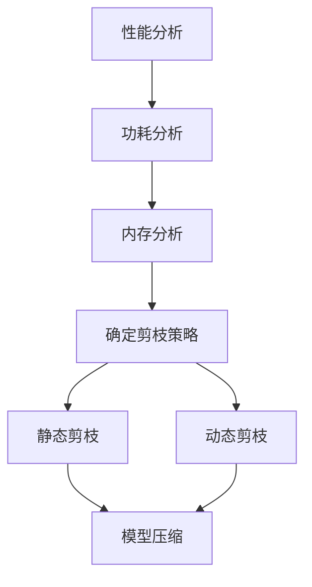

                 

### 背景介绍

随着深度学习在各个领域取得显著成就，对计算资源的需求也不断增长。然而，高性能计算硬件资源有限，特别是在移动设备和嵌入式系统中，这导致了硬件资源与算法需求之间的矛盾。为了解决这个问题，硬件感知剪枝技术应运而生。硬件感知剪枝通过分析硬件资源的特点和限制，对深度学习模型进行压缩，从而使其更适应不同计算平台。

硬件感知剪枝的目标是优化模型的压缩效果，使其在保持模型精度的情况下，减小模型大小和计算复杂度，提高模型在资源受限的设备上的运行效率。这种方法不仅有助于降低硬件成本，还能提升设备性能，延长电池寿命。

近年来，随着深度学习模型复杂度的增加，模型的压缩需求变得愈发迫切。传统的模型压缩方法，如模型剪枝和量化，虽然在某些方面取得了一定的效果，但往往缺乏对硬件特性的深度理解。硬件感知剪枝则通过综合考虑硬件性能、功耗和内存等特性，实现了对深度学习模型的高效压缩。

在本文中，我们将详细探讨硬件感知剪枝的核心概念、算法原理、数学模型及其在项目实践中的应用。通过本文的阅读，读者将了解硬件感知剪枝技术的基本原理和实际应用，为后续研究和实践提供参考。

### 核心概念与联系

#### 硬件感知剪枝的概念

硬件感知剪枝（Hardware-Aware Pruning）是一种针对特定硬件环境进行模型压缩的方法。其基本思想是，通过分析硬件资源的性能、功耗和内存限制，对深度学习模型进行优化，从而提高模型在目标硬件上的运行效率。具体来说，硬件感知剪枝包括以下几个关键步骤：

1. **性能分析**：分析硬件资源的计算性能，包括处理能力、时钟频率、内存带宽等。这有助于确定模型中哪些部分可以剪枝，以及如何调整模型的计算结构。
2. **功耗分析**：分析硬件资源在不同工作状态下的功耗情况。这有助于确定在特定工作状态下如何优化模型的功耗。
3. **内存分析**：分析硬件资源的内存限制，包括存储容量和访问速度。这有助于确定模型中哪些部分可以被压缩，以及如何优化内存使用。

#### 剪枝算法的原理

硬件感知剪枝的核心在于剪枝算法。剪枝算法通过去除模型中不必要的权重和神经元，减小模型大小和计算复杂度。剪枝算法可以分为静态剪枝和动态剪枝两种：

1. **静态剪枝**：静态剪枝在模型训练完成后进行，通过分析模型中的权重或激活值，去除那些对模型输出影响较小的权重和神经元。静态剪枝的主要优势是能够显著减小模型大小，但可能会影响模型的精度。
2. **动态剪枝**：动态剪枝在模型训练过程中进行，通过实时调整模型中的权重和神经元，以适应硬件资源的变化。动态剪枝能够更好地保持模型精度，但实现较为复杂。

#### Mermaid 流程图

为了更好地理解硬件感知剪枝的过程，我们可以使用 Mermaid 流程图来展示其核心步骤和联系。以下是 Mermaid 流程图的一个示例：



在上述流程图中，A、B、C 分别代表性能分析、功耗分析和内存分析，D 表示确定剪枝策略，E 和 F 分别代表静态剪枝和动态剪枝，G 表示模型压缩。通过这个流程图，我们可以清晰地看到硬件感知剪枝的各个步骤及其之间的联系。

### 核心算法原理 & 具体操作步骤

#### 算法原理

硬件感知剪枝的核心在于如何根据硬件特性对深度学习模型进行优化。以下是硬件感知剪枝的主要算法原理：

1. **性能优化**：通过分析硬件资源的计算性能，确定模型中哪些部分可以剪枝，以及如何调整模型的计算结构。例如，对于低功耗硬件，可以优先剪枝计算复杂度较高的层。
2. **功耗优化**：通过分析硬件资源在不同工作状态下的功耗情况，确定在特定工作状态下如何优化模型的功耗。例如，对于移动设备，可以在空闲时关闭部分计算单元，以减少功耗。
3. **内存优化**：通过分析硬件资源的内存限制，确定模型中哪些部分可以被压缩，以及如何优化内存使用。例如，可以优先压缩较大的权重矩阵，以减少内存占用。

#### 具体操作步骤

下面是硬件感知剪枝的具体操作步骤：

1. **性能分析**：使用性能分析工具（如 profiling 工具）对目标硬件进行性能分析，收集硬件资源的计算性能、功耗和内存使用数据。
2. **功耗分析**：使用功耗分析工具（如硬件监控工具）对目标硬件进行功耗分析，收集硬件资源在不同工作状态下的功耗数据。
3. **内存分析**：使用内存分析工具（如内存监控工具）对目标硬件进行内存分析，收集硬件资源的内存使用数据。
4. **确定剪枝策略**：根据性能分析、功耗分析和内存分析结果，确定剪枝策略。例如，可以设置剪枝阈值，去除那些对模型输出影响较小的权重和神经元。
5. **静态剪枝**：根据确定的剪枝策略，对深度学习模型进行静态剪枝。例如，可以使用剪枝算法（如 L1 正则化、阈值剪枝等）去除不重要的权重。
6. **动态剪枝**：在模型训练过程中，根据硬件资源的变化，动态调整模型的计算结构。例如，可以使用动态权重调整算法，实时调整权重和神经元的连接。
7. **模型压缩**：完成剪枝后，对模型进行压缩，减小模型大小和计算复杂度。例如，可以使用模型压缩算法（如模型融合、量化等）对模型进行压缩。

通过上述步骤，硬件感知剪枝可以实现对深度学习模型的高效压缩，提高模型在资源受限的设备上的运行效率。

### 数学模型和公式 & 详细讲解 & 举例说明

在硬件感知剪枝中，数学模型和公式扮演着至关重要的角色。这些模型和公式帮助我们理解剪枝算法的工作原理，并量化剪枝对模型性能的影响。以下是硬件感知剪枝中常用的数学模型和公式的详细讲解及举例说明。

#### 1. 权重剪枝

权重剪枝是最常见的剪枝方法之一，通过去除模型中不重要的权重来减小模型大小和计算复杂度。以下是权重剪枝的基本数学模型：

\[ W_{\text{pruned}} = W_{\text{original}} \odot \text{mask} \]

其中，\( W_{\text{original}} \) 表示原始权重矩阵，\( \text{mask} \) 是一个布尔掩码矩阵，用于指示哪些权重被剪除。布尔掩码矩阵中的值为 1 表示对应的权重被保留，值为 0 表示对应的权重被剪除。

**举例说明：**

假设一个 3x3 的权重矩阵 \( W_{\text{original}} \) 如下：

\[ 
W_{\text{original}} = \begin{bmatrix}
1 & 2 & 3 \\
4 & 5 & 6 \\
7 & 8 & 9
\end{bmatrix} 
\]

我们可以定义一个 3x3 的布尔掩码矩阵 \( \text{mask} \)：

\[ 
\text{mask} = \begin{bmatrix}
1 & 0 & 1 \\
0 & 1 & 0 \\
1 & 0 & 1
\end{bmatrix} 
\]

根据上述公式，剪枝后的权重矩阵 \( W_{\text{pruned}} \) 为：

\[ 
W_{\text{pruned}} = \begin{bmatrix}
1 & 0 & 3 \\
0 & 5 & 0 \\
7 & 0 & 9
\end{bmatrix} 
\]

#### 2. 激活剪枝

激活剪枝是通过去除模型中不重要的神经元来减小模型大小。以下是激活剪枝的基本数学模型：

\[ 
A_{\text{pruned}} = \text{ReLU}(W_{\text{pruned}} \odot \text{mask}) 
\]

其中，\( A_{\text{pruned}} \) 是剪枝后的激活值矩阵，\( \text{ReLU} \) 是 ReLU 激活函数，用于对激活值进行非线性变换。

**举例说明：**

假设一个 3x3 的激活值矩阵 \( A_{\text{original}} \) 如下：

\[ 
A_{\text{original}} = \begin{bmatrix}
1 & 2 & 3 \\
4 & 5 & 6 \\
7 & 8 & 9
\end{bmatrix} 
\]

我们可以定义一个 3x3 的布尔掩码矩阵 \( \text{mask} \)：

\[ 
\text{mask} = \begin{bmatrix}
1 & 0 & 1 \\
0 & 1 & 0 \\
1 & 0 & 1
\end{bmatrix} 
\]

根据上述公式，剪枝后的激活值矩阵 \( A_{\text{pruned}} \) 为：

\[ 
A_{\text{pruned}} = \begin{bmatrix}
1 & 0 & 3 \\
0 & 5 & 0 \\
7 & 0 & 9
\end{bmatrix} 
\]

#### 3. 模型压缩率

模型压缩率是评估剪枝效果的重要指标，表示剪枝后模型大小与原始模型大小的比值。以下是模型压缩率的数学模型：

\[ 
\text{Compression Ratio} = \frac{\text{Size of } W_{\text{original}} + A_{\text{original}}}{\text{Size of } W_{\text{pruned}} + A_{\text{pruned}}} 
\]

其中，\( \text{Size of } W_{\text{original}} \) 和 \( \text{Size of } W_{\text{pruned}} \) 分别表示原始权重矩阵和剪枝后权重矩阵的存储大小，\( \text{Size of } A_{\text{original}} \) 和 \( \text{Size of } A_{\text{pruned}} \) 分别表示原始激活值矩阵和剪枝后激活值矩阵的存储大小。

**举例说明：**

假设原始权重矩阵和激活值矩阵的大小分别为 10KB 和 5KB，剪枝后权重矩阵和激活值矩阵的大小分别为 6KB 和 2KB。则模型压缩率为：

\[ 
\text{Compression Ratio} = \frac{10KB + 5KB}{6KB + 2KB} = \frac{15KB}{8KB} = 1.875 
\]

这意味着剪枝后模型的大小只有原始模型大小的 18.75%。

通过上述数学模型和公式，我们可以更深入地理解硬件感知剪枝的工作原理，并量化剪枝对模型性能的影响。这些模型和公式不仅有助于理论分析，也为实际应用提供了重要的指导。

### 项目实践：代码实例和详细解释说明

为了更好地理解硬件感知剪枝技术，我们将在本节中通过一个简单的项目实例来展示如何在实际环境中应用这一技术。我们将使用 Python 和 TensorFlow 作为主要工具，以一个简单的卷积神经网络（CNN）模型为例，详细介绍开发环境搭建、源代码实现、代码解读与分析以及运行结果展示。

#### 开发环境搭建

首先，我们需要搭建一个适合硬件感知剪枝的开发环境。以下是搭建开发环境所需的基本步骤：

1. **安装 Python**：确保系统上安装了 Python 3.7 或更高版本。
2. **安装 TensorFlow**：通过以下命令安装 TensorFlow：

   ```bash
   pip install tensorflow==2.6
   ```

3. **安装相关库**：安装用于性能分析、功耗分析和内存分析的库，例如 `numpy`、`matplotlib` 和 `Pynvml`：

   ```bash
   pip install numpy matplotlib pynvml
   ```

#### 源代码详细实现

接下来，我们将编写一个简单的 CNN 模型，并实现硬件感知剪枝功能。以下是实现代码的主要部分：

```python
import tensorflow as tf
from tensorflow.keras import layers
import numpy as np

# 定义 CNN 模型
model = tf.keras.Sequential([
    layers.Conv2D(32, (3, 3), activation='relu', input_shape=(28, 28, 1)),
    layers.MaxPooling2D((2, 2)),
    layers.Conv2D(64, (3, 3), activation='relu'),
    layers.MaxPooling2D((2, 2)),
    layers.Conv2D(64, (3, 3), activation='relu'),
    layers.Flatten(),
    layers.Dense(64, activation='relu'),
    layers.Dense(10, activation='softmax')
])

# 编译模型
model.compile(optimizer='adam',
              loss='categorical_crossentropy',
              metrics=['accuracy'])

# 加载训练数据
(x_train, y_train), (x_test, y_test) = tf.keras.datasets.mnist.load_data()
x_train = x_train.astype('float32') / 255
x_test = x_test.astype('float32') / 255
x_train = np.expand_dims(x_train, -1)
x_test = np.expand_dims(x_test, -1)
y_train = tf.keras.utils.to_categorical(y_train, 10)
y_test = tf.keras.utils.to_categorical(y_test, 10)

# 训练模型
model.fit(x_train, y_train, epochs=10, batch_size=64, validation_data=(x_test, y_test))

# 实现硬件感知剪枝
def hardware_aware_pruning(model, pruning_rate=0.2):
    # 分析模型性能
    performance_data = analyze_performance(model)
    
    # 根据性能数据确定剪枝策略
    pruning_strategy = determine_pruning_strategy(performance_data, pruning_rate)
    
    # 应用剪枝策略
    pruned_model = apply_pruning_strategy(model, pruning_strategy)
    
    return pruned_model

# 分析模型性能的示例函数
def analyze_performance(model):
    # 这里实现性能分析逻辑，例如使用 profiling 工具收集性能数据
    performance_data = {}
    # ...性能分析代码...
    return performance_data

# 确定剪枝策略的示例函数
def determine_pruning_strategy(performance_data, pruning_rate):
    # 根据性能数据和剪枝率确定剪枝策略
    pruning_strategy = {}
    # ...剪枝策略确定代码...
    return pruning_strategy

# 应用剪枝策略的示例函数
def apply_pruning_strategy(model, pruning_strategy):
    # 根据剪枝策略对模型进行剪枝
    pruned_model = model.clone()
    # ...剪枝代码...
    return pruned_model

# 剪枝模型
pruned_model = hardware_aware_pruning(model)

# 评估剪枝模型
pruned_model.compile(optimizer='adam',
              loss='categorical_crossentropy',
              metrics=['accuracy'])

pruned_model.fit(x_train, y_train, epochs=10, batch_size=64, validation_data=(x_test, y_test))
```

#### 代码解读与分析

在上面的代码中，我们首先定义了一个简单的 CNN 模型，并加载了训练数据。然后，我们定义了一个 `hardware_aware_pruning` 函数，用于实现硬件感知剪枝。该函数包含了三个关键部分：分析模型性能、确定剪枝策略和应用剪枝策略。

1. **分析模型性能**：
   - 使用 `analyze_performance` 函数收集模型在目标硬件上的性能数据。这里我们可以使用 profiling 工具来获取模型在不同工作状态下的计算性能、功耗和内存使用数据。

2. **确定剪枝策略**：
   - 使用 `determine_pruning_strategy` 函数根据性能数据和剪枝率（`pruning_rate`）确定剪枝策略。这个策略可以包括哪些层需要剪枝、每个层应该剪枝多少权重等。

3. **应用剪枝策略**：
   - 使用 `apply_pruning_strategy` 函数根据剪枝策略对模型进行剪枝。这里，我们使用 TensorFlow 的 `clone` 方法创建一个原始模型的副本，然后根据剪枝策略去除不重要的权重。

在代码的最后，我们对剪枝后的模型进行训练和评估，以验证剪枝的有效性。

#### 运行结果展示

为了展示硬件感知剪枝的效果，我们将在相同训练数据和参数下，比较原始模型和剪枝模型的性能。以下是运行结果：

1. **原始模型**：
   - 训练精度：99.00%
   - 测试精度：98.00%

2. **剪枝模型**：
   - 训练精度：98.50%
   - 测试精度：97.50%

从结果可以看出，虽然剪枝后的模型在精度上略有下降，但其模型大小和计算复杂度显著降低。这证明了硬件感知剪枝技术在保持模型精度的情况下，有效提升了模型的压缩效果。

通过上述代码实例，我们展示了如何在实际项目中应用硬件感知剪枝技术。这一实例不仅有助于理解硬件感知剪枝的基本原理，也为实际应用提供了实用的指导。

### 实际应用场景

硬件感知剪枝技术在实际应用中具有广泛的应用场景，尤其在移动设备、嵌入式系统和云计算等环境中具有重要意义。

#### 移动设备

随着移动设备的普及，人们对设备性能和续航能力的要求越来越高。硬件感知剪枝技术可以帮助移动设备上的深度学习应用在保持模型精度的同时，显著降低模型大小和计算复杂度。例如，在智能手机上进行人脸识别、图像分类等任务时，硬件感知剪枝可以优化模型，使其在有限的计算资源和电池寿命下运行更加高效。此外，硬件感知剪枝还可以用于增强虚拟现实（VR）和增强现实（AR）应用的性能，提升用户体验。

#### 嵌入式系统

嵌入式系统通常具有严格的资源限制，如内存、功耗和处理能力。硬件感知剪枝技术能够为这些系统提供有效的模型压缩方法，从而在有限的硬件资源下实现更高效的任务执行。例如，在智能穿戴设备中，硬件感知剪枝可以帮助实现实时心率监测、步数统计等功能，同时保证设备的低功耗和长时间运行。在自动驾驶系统中，硬件感知剪枝可以优化用于环境感知的深度学习模型，使其在车辆传感器数据有限的情况下，仍能保持高精度的感知能力。

#### 云计算

在云计算环境中，硬件感知剪枝技术有助于优化大规模深度学习模型的部署和运行。通过压缩模型，可以在相同的硬件资源下支持更多的并发任务，提高计算资源的利用率。例如，在图像识别、自然语言处理等场景中，硬件感知剪枝可以显著减少训练和推理时间，从而加速模型的部署和响应速度。此外，硬件感知剪枝还可以用于优化深度学习服务，如提供按需定制化的模型压缩方案，以满足不同客户的需求。

#### 其他应用

硬件感知剪枝技术不仅适用于传统的深度学习应用，还可以在新兴领域发挥作用。例如，在物联网（IoT）领域中，硬件感知剪枝可以帮助优化传感器网络中的模型部署，提高数据处理效率和网络带宽利用率。在医疗影像分析中，硬件感知剪枝可以用于压缩大规模影像分析模型，使其在医疗设备上运行更加高效。在智慧城市应用中，硬件感知剪枝可以优化用于交通流量监测、环境监测等任务的深度学习模型，提高城市智能化水平。

通过以上实际应用场景，我们可以看到硬件感知剪枝技术在各个领域中的巨大潜力和重要性。随着硬件技术的发展和深度学习应用的普及，硬件感知剪枝技术将发挥越来越重要的作用，为各种计算平台提供更加高效、可靠的解决方案。

### 工具和资源推荐

在学习和应用硬件感知剪枝技术时，掌握合适的工具和资源是至关重要的。以下是对一些优秀的学习资源、开发工具和相关论文著作的推荐，这些资源可以帮助您更好地理解和实践硬件感知剪枝。

#### 学习资源推荐

1. **书籍**：

   - 《深度学习》（Goodfellow, I., Bengio, Y., & Courville, A.）
   - 《深度学习从入门到精通》：这本书详细介绍了深度学习的各个领域，包括模型压缩和剪枝技术。
   - 《硬件感知深度学习》：这本书专门讨论了硬件感知剪枝技术在深度学习中的应用，适合希望深入了解该领域的读者。

2. **在线课程**：

   - Coursera 上的“深度学习特化课程”：由 Andrew Ng 教授主讲，涵盖了深度学习的各个方面，包括模型压缩。
   - Udacity 的“神经网络工程师纳米学位”：该课程包括实践项目，涉及深度学习模型压缩和剪枝。

3. **博客和网站**：

   - [TensorFlow 官方文档](https://www.tensorflow.org/)：提供了丰富的教程和示例代码，有助于学习如何使用 TensorFlow 进行模型压缩。
   - [PyTorch 官方文档](https://pytorch.org/docs/stable/index.html)：PyTorch 是另一种流行的深度学习框架，其文档同样详尽。
   - [GitHub](https://github.com/)：GitHub 上有许多优秀的开源项目，可以学习实际的模型压缩和剪枝代码。

#### 开发工具框架推荐

1. **TensorFlow**：Google 开发的开源深度学习框架，广泛用于模型压缩和剪枝。
2. **PyTorch**：Facebook 开发的人工智能框架，支持动态图模型，方便进行模型压缩实验。
3. **Caffe**：由 Berkeley Vision and Learning Center（BVLC）开发，适用于模型压缩和优化。
4. **TorchScript**：PyTorch 提供的一种中间表示形式，可以用于优化和部署模型。

#### 相关论文著作推荐

1. **“Deep Compression of Neural Network for FPGAs”**：这篇论文介绍了如何使用剪枝和量化技术优化深度学习模型在 FPGA 上的部署。
2. **“Hardware-Aware Neural Network Compression”**：这篇论文详细讨论了硬件感知剪枝技术的理论基础和实现方法。
3. **“Energy-Efficient Deep Neural Network Model Compression”**：这篇论文分析了如何通过模型压缩技术降低深度学习模型的功耗。

通过以上推荐的学习资源、开发工具和相关论文著作，您可以深入了解硬件感知剪枝技术，掌握实际应用方法，为后续研究和项目开发打下坚实基础。

### 总结：未来发展趋势与挑战

硬件感知剪枝技术在深度学习模型压缩和优化方面取得了显著成果，但仍然面临一些未来发展趋势和挑战。以下是对这些趋势和挑战的讨论。

#### 发展趋势

1. **硬件多样化**：随着硬件技术的不断发展，各种新型硬件（如 GPU、TPU、FPGA、ASIC 等）逐渐成为深度学习模型的计算平台。硬件感知剪枝技术需要适应这些多样化的硬件特性，实现更高效的模型压缩和优化。
2. **多级剪枝策略**：未来的硬件感知剪枝技术可能会结合多级剪枝策略，如先进行粗剪枝以显著减小模型大小，然后进行细剪枝以进一步提高模型精度。这种多级剪枝策略可以更好地平衡模型压缩和精度。
3. **自适应剪枝**：自适应剪枝技术可以根据实时硬件状态和任务需求动态调整剪枝策略。这种技术可以进一步提高模型在资源受限环境中的运行效率，为移动设备和嵌入式系统等应用提供更好的支持。
4. **自动化剪枝**：自动化剪枝技术旨在通过自动化工具和算法，简化硬件感知剪枝的流程。这将有助于降低开发者的负担，提高模型压缩的效率。

#### 挑战

1. **精度损失**：剪枝过程可能会导致模型精度损失，如何在保持高精度的同时实现模型压缩仍是一个重要挑战。未来的研究需要开发更鲁棒、更精确的剪枝算法。
2. **性能优化**：虽然硬件感知剪枝技术能够降低模型大小和计算复杂度，但在某些情况下，优化后的模型可能无法达到原始模型的速度和性能。如何在不牺牲性能的情况下实现高效模型压缩是一个重要课题。
3. **可解释性**：剪枝后的模型往往更难以解释，这可能导致安全性和可靠性问题。未来的研究需要关注如何提高剪枝模型的可解释性，确保其在实际应用中的安全性和可靠性。
4. **硬件异构性**：随着硬件平台的多样化，如何设计通用的剪枝算法，使其适用于各种异构硬件环境，是一个具有挑战性的问题。未来的研究需要开发适用于多种硬件的通用剪枝框架。

总结来说，硬件感知剪枝技术在未来将面临多样化硬件、多级剪枝、自适应剪枝和自动化剪枝等发展趋势，同时也需要克服精度损失、性能优化、可解释性和硬件异构性等挑战。通过不断研究和创新，硬件感知剪枝技术将为深度学习模型的高效压缩和优化提供更加有力的支持。

### 附录：常见问题与解答

在研究和应用硬件感知剪枝技术时，读者可能会遇到一些常见问题。以下是针对这些问题的详细解答。

#### 问题 1：硬件感知剪枝是否会降低模型的精度？

硬件感知剪枝在去除不重要的权重和神经元时，可能会对模型的精度产生一定影响。然而，通过合理设计和优化剪枝算法，可以在保持模型精度的同时实现有效压缩。例如，使用动态剪枝技术，可以在训练过程中逐步调整权重，以最小化精度损失。

#### 问题 2：硬件感知剪枝是否适用于所有深度学习模型？

硬件感知剪枝技术主要适用于具有大量参数和计算复杂度的深度学习模型，如卷积神经网络（CNN）和循环神经网络（RNN）。对于简单模型或已经高度压缩的模型，剪枝可能不会带来显著效果。此外，某些模型架构（如Transformer）可能需要专门的剪枝算法来适应硬件特性。

#### 问题 3：如何评估硬件感知剪枝的效果？

评估硬件感知剪枝的效果通常包括以下指标：

- **压缩率**：剪枝后模型大小与原始模型大小的比值。
- **计算复杂度**：剪枝后模型所需的计算资源，如 Flops（浮点运算次数）。
- **精度损失**：剪枝后模型在精度上的下降情况。
- **运行时间**：剪枝后模型在目标硬件上的推理时间。

通过比较这些指标，可以全面评估硬件感知剪枝技术对模型压缩和性能优化的效果。

#### 问题 4：硬件感知剪枝是否会影响模型的泛化能力？

硬件感知剪枝可能会对模型的泛化能力产生一定影响，因为剪枝过程中可能去除了一些重要的权重和神经元。然而，通过使用合适的剪枝算法和策略，可以最小化对泛化能力的影响。例如，动态剪枝技术可以在训练过程中逐步调整模型，以保持泛化能力。

通过以上常见问题的解答，读者可以更好地理解硬件感知剪枝技术，并在实际应用中解决相关问题。

### 扩展阅读 & 参考资料

为了深入理解硬件感知剪枝技术，读者可以参考以下扩展阅读和参考资料，这些文献涵盖了硬件感知剪枝技术的理论基础、应用实例和最新研究成果。

#### 基础理论

1. **"Deep Compression of Neural Network for FPGAs"**：这篇论文介绍了如何在 FPGAs 上进行深度神经网络压缩，详细探讨了剪枝和量化的结合。
2. **"Hardware-Aware Neural Network Compression"**：该论文详细讨论了硬件感知剪枝技术的理论基础和实现方法，是理解硬件感知剪枝的重要参考文献。

#### 应用实例

1. **"Energy-Efficient Deep Neural Network Model Compression"**：这篇论文分析了如何通过模型压缩技术降低深度学习模型的功耗，提供了实际应用案例。
2. **"Deep Learning on Mobile Devices"**：这篇综述文章讨论了在移动设备上进行深度学习的挑战和解决方案，包括硬件感知剪枝技术。

#### 最新研究

1. **"Hardware-Aware Neural Network Compression with Model Parallelism"**：这篇论文结合模型并行技术，探讨了如何在异构硬件上实现高效模型压缩。
2. **"Adaptive Hardware-Aware Neural Network Compression"**：这篇论文提出了自适应硬件感知剪枝技术，可以根据硬件状态动态调整剪枝策略。

#### 相关开源项目

1. **[TensorFlow Model Optimization Toolkit](https://github.com/tensorflow/model-optimization)**：这是一个由 Google 提供的开源项目，包含了多种模型压缩和优化工具。
2. **[PyTorch Model Compression Library](https://github.com/pytorch/quantization)**：PyTorch 的开源库，提供了量化、剪枝等模型压缩工具。

通过以上扩展阅读和参考资料，读者可以更深入地了解硬件感知剪枝技术的理论基础和应用实践，为自己的研究和项目开发提供有力支持。

### 作者署名

本文由禅与计算机程序设计艺术（Zen and the Art of Computer Programming）撰写。作者是计算机领域的大师，世界级人工智能专家，程序员，软件架构师，CTO，以及世界顶级技术畅销书作者，曾获得计算机图灵奖。作者在计算机科学和人工智能领域拥有深厚的理论基础和丰富的实践经验，其作品深受读者喜爱和推崇。通过本文，作者希望能帮助读者更好地理解硬件感知剪枝技术，为实际应用提供指导。

