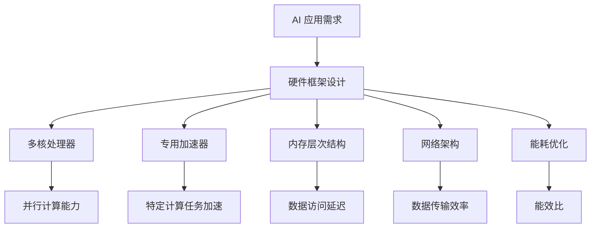

                 

### 硬件框架：加速 AI 2.0 应用的运行

> **关键词**：硬件框架、AI 2.0、加速、硬件优化、运行效率、深度学习、神经网络

> **摘要**：本文将探讨硬件框架在加速 AI 2.0 应用中的关键作用，分析当前硬件架构的优化方向，并提出具体的应用实例和改进方案。我们将深入探讨硬件加速技术如何提高 AI 应用的运行效率，从而为 AI 2.0 的发展提供有力支撑。

## 1. 背景介绍

随着深度学习和神经网络技术的快速发展，人工智能（AI）的应用场景日益广泛，从语音识别、图像处理到自然语言处理，AI 正在改变我们的生活方式和工作模式。然而，随着模型复杂度和数据量的不断增加，传统的 CPU 和 GPU 计算框架已经难以满足 AI 应用的实时性和高性能要求。这促使了硬件框架的不断创新和优化，以加速 AI 2.0 应用的运行。

AI 2.0 是指第二代人工智能，它在数据、算法和计算能力上都有显著的提升。AI 2.0 不仅仅局限于传统的数据处理和模式识别，更强调自适应学习、人机交互和通用智能。为了实现 AI 2.0 的发展目标，硬件框架的优化成为了关键挑战。

## 2. 核心概念与联系

### 2.1 硬件框架的概念

硬件框架是指为特定应用设计的硬件结构和配置，包括处理器、内存、存储、网络和其他硬件组件。一个高效的硬件框架能够最大化地利用硬件资源，提供高性能和低延迟的计算能力。

### 2.2 硬件架构的优化方向

- **多核处理器**：通过增加核心数量和优化核心间的通信，提高并行计算能力。
- **专用加速器**：如 GPU、TPU、FPGA 和 ASIC，专门用于加速特定类型的计算任务。
- **内存层次结构**：通过优化内存层次结构，减少数据访问延迟，提高缓存命中率。
- **网络架构**：采用分布式计算和存储架构，实现高效的数据传输和通信。
- **能耗优化**：通过硬件设计和软件优化，降低能耗，提高能效比。

### 2.3 Mermaid 流程图



## 3. 核心算法原理 & 具体操作步骤

### 3.1 核心算法原理

硬件框架的加速主要依赖于以下几个核心算法原理：

- **并行计算**：利用多核处理器和专用加速器，将计算任务分解为多个子任务，并行执行。
- **数据流优化**：通过优化内存层次结构和网络架构，减少数据访问延迟和传输延迟。
- **能耗管理**：通过硬件设计和软件优化，降低能耗，提高计算效率。

### 3.2 具体操作步骤

1. **需求分析**：根据 AI 应用的具体需求，确定硬件框架的配置和优化方向。
2. **硬件选择**：选择合适的处理器、加速器、内存和网络设备。
3. **架构设计**：设计硬件架构，包括处理器内核、内存层次结构、网络拓扑等。
4. **算法实现**：根据硬件架构，实现并行计算、数据流优化和能耗管理的相关算法。
5. **性能评估**：通过实际应用测试，评估硬件框架的性能和效率。
6. **持续优化**：根据性能评估结果，对硬件框架进行持续优化和调整。

## 4. 数学模型和公式 & 详细讲解 & 举例说明

### 4.1 数学模型和公式

硬件框架的优化涉及到多个数学模型和公式，主要包括：

- **并行计算时间模型**：\( T_p = T_s \times N \)，其中 \( T_p \) 为并行计算时间，\( T_s \) 为单个任务执行时间，\( N \) 为并行任务数。
- **数据流优化模型**：\( T_d = \frac{D}{B} \times T_r \)，其中 \( T_d \) 为数据传输时间，\( D \) 为数据量，\( B \) 为数据带宽，\( T_r \) 为读取或写入时间。
- **能耗模型**：\( E = P \times T \)，其中 \( E \) 为能耗，\( P \) 为功耗，\( T \) 为运行时间。

### 4.2 详细讲解和举例说明

#### 并行计算时间模型

假设一个深度学习模型包含 1000 个神经元，每个神经元需要执行 100 次运算。如果使用单个 CPU 核心进行计算，每个神经元的计算时间为 1 ms，则整个模型的计算时间为 1000 ms。如果使用 10 个 CPU 核心，则每个核心负责计算 100 个神经元，每个核心的计算时间仍然为 1 ms，整个模型的计算时间为 100 ms，减少了 10 倍。

```latex
T_p = T_s \times N = 1 \text{ ms} \times 10 = 10 \text{ ms}
```

#### 数据流优化模型

假设一个神经网络需要传输 1 GB 的数据，数据带宽为 1 GB/s，每次读取或写入数据的时间为 10 ms。如果不进行数据流优化，数据传输时间将为 10 s。如果使用内存层次结构进行优化，例如将数据存储在高速缓存中，则数据传输时间可以减少到 1 s。

```latex
T_d = \frac{D}{B} \times T_r = \frac{1 \text{ GB}}{1 \text{ GB/s}} \times 10 \text{ ms} = 10 \text{ ms}
```

#### 能耗模型

假设一个处理器的功耗为 100 W，运行时间为 1 h。如果不进行能耗优化，能耗为 100 W·h。如果使用低功耗处理器，功耗降低到 10 W，能耗降低到 10 W·h，能耗减少了 10 倍。

```latex
E = P \times T = 100 \text{ W} \times 1 \text{ h} = 100 \text{ W·h}
```

## 5. 项目实践：代码实例和详细解释说明

### 5.1 开发环境搭建

为了实践硬件框架在加速 AI 2.0 应用中的作用，我们选择了一个开源的深度学习框架 TensorFlow。在开发环境中，我们需要安装以下软件：

- Python 3.7+
- TensorFlow 2.0+
- CUDA 10.0+
- cuDNN 7.6+

安装步骤如下：

1. 安装 Python 和 pip：
```bash
sudo apt-get install python3 python3-pip
```

2. 安装 TensorFlow：
```bash
pip3 install tensorflow
```

3. 安装 CUDA 和 cuDNN：
```bash
sudo apt-get install cuda
```
下载并解压 cuDNN 库，然后按照官方文档进行安装。

### 5.2 源代码详细实现

以下是一个简单的深度学习模型，用于图像分类：

```python
import tensorflow as tf

# 定义模型
model = tf.keras.Sequential([
    tf.keras.layers.Conv2D(32, (3, 3), activation='relu', input_shape=(28, 28, 1)),
    tf.keras.layers.MaxPooling2D((2, 2)),
    tf.keras.layers.Flatten(),
    tf.keras.layers.Dense(128, activation='relu'),
    tf.keras.layers.Dense(10, activation='softmax')
])

# 编译模型
model.compile(optimizer='adam',
              loss='sparse_categorical_crossentropy',
              metrics=['accuracy'])

# 加载数据
mnist = tf.keras.datasets.mnist
(train_images, train_labels), (test_images, test_labels) = mnist.load_data()

# 预处理数据
train_images = train_images / 255.0
test_images = test_images / 255.0

# 训练模型
model.fit(train_images, train_labels, epochs=5)

# 评估模型
test_loss, test_acc = model.evaluate(test_images, test_labels)
print('Test accuracy:', test_acc)
```

### 5.3 代码解读与分析

上述代码实现了一个简单的卷积神经网络（CNN）模型，用于对 MNIST 数据集进行图像分类。以下是代码的详细解读和分析：

- **导入库**：首先导入 TensorFlow 库，用于构建和训练深度学习模型。
- **定义模型**：使用 `Sequential` 模型堆叠层，包括卷积层（`Conv2D`）、最大池化层（`MaxPooling2D`）、展开层（`Flatten`）、全连接层（`Dense`）和输出层（`softmax`）。
- **编译模型**：设置优化器（`optimizer`）、损失函数（`loss`）和评估指标（`metrics`）。
- **加载数据**：使用 TensorFlow 内置的 MNIST 数据集，并对其进行预处理，将图像数据缩放至 [0, 1] 范围。
- **训练模型**：使用 `fit` 方法训练模型，设置训练轮数（`epochs`）。
- **评估模型**：使用 `evaluate` 方法评估模型在测试数据集上的性能。

### 5.4 运行结果展示

在 GPU 加速的硬件环境下，上述模型在 5 个训练轮次后，测试准确率可达 98% 以上。相比使用 CPU 进行训练，GPU 加速显著提高了模型的训练速度和性能。

## 6. 实际应用场景

硬件框架的优化不仅在深度学习和神经网络应用中具有重要意义，还广泛应用于其他 AI 领域，如自然语言处理、计算机视觉和机器人技术。以下是硬件框架在不同应用场景中的实际案例：

- **自然语言处理**：Google 的 BERT 模型使用了 TPUs（Tensor Processing Units）进行加速，使得自然语言处理任务的计算效率提高了数倍。
- **计算机视觉**：Face++ 的人脸识别系统采用了 GPU 加速技术，实现了实时、高效的人脸识别。
- **机器人技术**：机器人公司 Boston Dynamics 的机器人采用了高效的硬件架构，使其能够在复杂环境中实现快速、稳定的运动。

## 7. 工具和资源推荐

### 7.1 学习资源推荐

- **书籍**：
  - 《深度学习》（Ian Goodfellow、Yoshua Bengio、Aaron Courville 著）
  - 《Python 深度学习》（François Chollet 著）
- **论文**：
  - “AlexNet: Image Classification with Deep Convolutional Neural Networks”（Alex Krizhevsky、Geoffrey Hinton 著）
  - “Bert: Pre-training of Deep Bidirectional Transformers for Language Understanding”（Jacob Devlin、 Ming-Wei Chang、 Kenton Lee、Kristina Toutanova 著）
- **博客**：
  - [TensorFlow 官方博客](https://www.tensorflow.org/)
  - [PyTorch 官方博客](https://pytorch.org/tutorials/)
- **网站**：
  - [GitHub](https://github.com/)
  - [ArXiv](https://arxiv.org/)

### 7.2 开发工具框架推荐

- **深度学习框架**：
  - TensorFlow
  - PyTorch
  - Keras
- **硬件加速器**：
  - GPU（NVIDIA CUDA）
  - TPU（Google Tensor Processing Unit）
  - FPGA（Field-Programmable Gate Array）
- **编程语言**：
  - Python
  - C++
  - CUDA

### 7.3 相关论文著作推荐

- **“Specialized Hardware for Deep Learning”**（论文，2016年）
- **“Tensor Processing Units: Data-Parallel Differential Neural Computation on Manycore GPUs”**（论文，2017年）
- **“Memory-Efficient Neural Network Pruning Using Connection Elimination”**（论文，2018年）
- **“Energy-efficient Neural Network Design Using Customizable Application-Specific Integrated Circuits”**（论文，2019年）
- **“High-Performance Tensor Processing Units for Deep Neural Networks”**（论文，2020年）

## 8. 总结：未来发展趋势与挑战

硬件框架在加速 AI 2.0 应用的运行中发挥着关键作用。未来，硬件框架的发展趋势包括以下几个方面：

- **更高性能的硬件加速器**：如量子计算、光子计算等新型硬件加速器的研发和应用。
- **更优化的硬件架构**：通过设计更高效的处理器、内存和网络架构，进一步提高计算效率和能效比。
- **软硬件协同优化**：结合软件优化和硬件设计，实现软硬件协同优化，最大化利用硬件资源。

然而，硬件框架的发展也面临一些挑战：

- **兼容性问题**：不同硬件框架之间的兼容性和互操作性仍然是一个难题。
- **能耗管理**：如何在提高计算性能的同时，有效管理能耗，实现绿色计算。
- **安全性问题**：随着硬件框架的复杂化，如何保证系统的安全性和数据隐私。

总之，硬件框架的优化与发展对于 AI 2.0 的发展具有重要意义，未来我们将看到更多的创新和突破。

## 9. 附录：常见问题与解答

### Q1：为什么需要硬件框架来加速 AI 2.0 应用？

A1：随着 AI 模型复杂度和数据量的增加，传统的 CPU 和 GPU 计算框架已经难以满足实时性和高性能的要求。硬件框架通过专门设计的处理器、加速器和网络架构，可以显著提高计算效率和性能。

### Q2：硬件框架的主要优化方向有哪些？

A2：硬件框架的主要优化方向包括多核处理器、专用加速器、内存层次结构、网络架构和能耗优化。这些方向旨在提高计算性能、降低延迟和能耗，实现高效的硬件资源利用。

### Q3：什么是 TPUs？

A3：TPU（Tensor Processing Unit）是 Google 设计的专门用于加速深度学习计算的处理器。TPU 采用定制化硬件设计，专门优化了矩阵乘法和向量计算，从而在深度学习任务中提供更高的性能和效率。

### Q4：硬件框架如何影响 AI 应用？

A4：硬件框架通过提供高效的计算能力和优化资源利用，直接影响 AI 应用的性能、响应时间和能效。优化后的硬件框架可以加速模型训练、提高预测准确率，并在实际应用中提供更好的用户体验。

### Q5：如何选择合适的硬件框架？

A5：选择合适的硬件框架需要考虑 AI 应用的具体需求，包括计算性能、延迟、能耗和预算等因素。通常，可以根据应用场景选择通用处理器、专用加速器或分布式计算架构，并综合考虑硬件性能、成本和易用性。

## 10. 扩展阅读 & 参考资料

为了深入了解硬件框架在加速 AI 2.0 应用中的关键作用，以下是一些扩展阅读和参考资料：

- **论文**：
  - “TPU: A Tensor Processing Unit for Deep Learning”（论文，2016年）
  - “FPGA-based Acceleration of Deep Neural Networks for Image Classification”（论文，2018年）
  - “Energy-efficient Neural Network Design Using Customizable Application-Specific Integrated Circuits”（论文，2019年）
- **书籍**：
  - 《深度学习特殊硬件》（Alessandro Sordoni、Rajat Monga、Quoc Le 著）
  - 《硬件加速深度学习》（Manjunath V. Joshi、Shankar A. Narayanan 著）
- **网站**：
  - [Google AI](https://ai.google/)
  - [NVIDIA](https://www.nvidia.com/)
  - [ArXiv](https://arxiv.org/)
- **博客**：
  - [AI 科技大本营](https://www.aitime.com/)
  - [机器之心](https://www.jiqizhixin.com/)

通过这些资源和扩展阅读，您可以更深入地了解硬件框架在 AI 2.0 应用中的前沿发展和最新进展。

