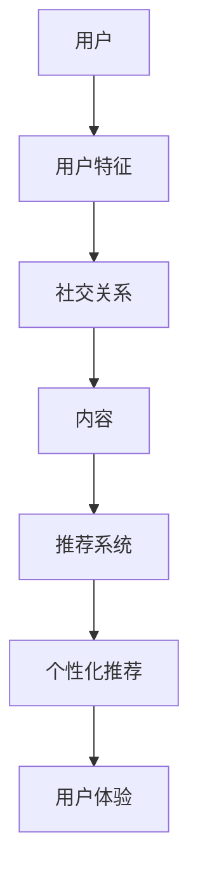

                 

在当今这个数字时代，社交网络已经成为了人们日常生活中不可或缺的一部分。无论是分享生活点滴，还是寻找兴趣爱好相投的朋友，社交网络都在不断推动着人际关系的建立与维持。然而，随着用户数量的激增和内容的爆炸式增长，如何为用户提供个性化的、高相关的推荐内容成为了社交网络领域的一个关键挑战。本文旨在探讨社交网络推荐系统如何通过先进的技术手段，有效地连接用户，提升用户体验。

> 关键词：社交网络，推荐系统，用户连接，个性化推荐，算法原理

> 摘要：本文首先介绍了社交网络推荐系统的背景和重要性，随后详细分析了推荐系统的核心概念和架构。接着，文章深入探讨了推荐算法的原理和具体操作步骤，以及如何构建数学模型和公式进行数据分析和优化。随后，通过一个具体的代码实例展示了推荐系统的实现过程。最后，文章讨论了推荐系统的实际应用场景，并展望了其未来的发展趋势与面临的挑战。

## 1. 背景介绍

社交网络推荐系统起源于电子商务和在线广告领域，其核心目标是为用户提供个性化的内容推荐。随着社交网络的兴起，推荐系统在社交网络中的应用也得到了广泛的关注。社交网络推荐系统不仅可以帮助用户发现感兴趣的内容，还可以促进用户之间的互动，提高社交网络的活跃度。

### 1.1 社交网络的兴起

社交网络是指基于互联网技术，通过用户生成的内容和社交关系进行信息共享和互动的平台。自2004年Facebook成立以来，社交网络迅速在全球范围内普及，用户数量逐年攀升。截至2023年，全球社交网络用户已经超过40亿，占据了全球人口的近一半。社交网络不仅改变了人们的社交方式，也为商业和社会活动带来了新的机遇。

### 1.2 推荐系统的核心目标

推荐系统旨在通过分析用户的历史行为、偏好和兴趣，向用户推荐其可能感兴趣的内容。在社交网络中，推荐系统的核心目标包括：

- **个性化推荐**：根据用户的个性化特征，提供量身定制的推荐内容。
- **提高用户互动**：通过推荐系统，促进用户之间的互动，增强社交网络的活跃度。
- **提升用户体验**：为用户提供高效的内容发现途径，提高用户体验。

### 1.3 推荐系统在社交网络中的重要性

推荐系统在社交网络中具有以下几个重要作用：

- **内容分发**：社交网络中每天生成的内容量巨大，推荐系统可以帮助用户快速发现感兴趣的内容。
- **社交互动**：通过推荐系统，用户可以更容易地找到志同道合的人，从而促进社交互动。
- **商业价值**：推荐系统不仅为用户提供个性化服务，也为社交网络平台带来了可观的商业价值，如广告收入和会员订阅。

## 2. 核心概念与联系

为了实现高效的社交网络推荐，我们需要了解一系列核心概念和它们的相互联系。以下是几个关键概念及其相互关系的Mermaid流程图：



### 2.1 用户

用户是社交网络推荐系统的核心。用户的特征包括年龄、性别、地理位置、兴趣爱好等。这些特征决定了用户的个性化需求。

### 2.2 用户特征

用户特征是推荐系统分析用户行为和兴趣的重要依据。通过分析用户特征，推荐系统可以更准确地预测用户的偏好。

### 2.3 社交关系

社交关系是社交网络的核心要素。用户之间的关系网络可以通过好友关系、共同兴趣等维度进行构建，为推荐系统提供了丰富的社交上下文信息。

### 2.4 内容

社交网络中的内容种类繁多，包括文本、图片、视频等。推荐系统的目标是为用户提供与其兴趣相关的内容。

### 2.5 推荐系统

推荐系统是连接用户和内容的桥梁。它利用用户特征、社交关系和内容特征，通过算法模型生成推荐结果。

### 2.6 个性化推荐

个性化推荐是推荐系统的核心目标。通过分析用户的历史行为和偏好，推荐系统可以为用户提供高度个性化的推荐内容。

### 2.7 用户体验

用户体验是推荐系统评估的重要指标。通过提供高质量的个性化推荐，推荐系统可以提高用户满意度，增强用户粘性。

## 3. 核心算法原理 & 具体操作步骤

### 3.1 算法原理概述

社交网络推荐系统通常采用基于内容的推荐（Content-Based Filtering）和协同过滤（Collaborative Filtering）两种主要算法。

- **基于内容的推荐**：根据用户的历史行为和兴趣，推荐与用户过去喜欢的内容相似的新内容。
- **协同过滤**：通过分析用户之间的相似性，发现用户可能喜欢的内容，然后推荐给用户。

### 3.2 算法步骤详解

#### 3.2.1 基于内容的推荐

1. **内容特征提取**：对内容进行特征提取，如文本分类、关键词提取等。
2. **用户历史行为分析**：分析用户的历史行为，提取用户偏好。
3. **相似度计算**：计算用户偏好与内容特征的相似度。
4. **生成推荐列表**：根据相似度分数，生成推荐列表。

#### 3.2.2 协同过滤

1. **用户相似度计算**：通过用户历史行为数据，计算用户之间的相似度。
2. **项目相似度计算**：对用户喜欢的项目进行相似度计算。
3. **生成推荐列表**：根据用户相似度和项目相似度，生成推荐列表。

### 3.3 算法优缺点

#### 基于内容的推荐

- **优点**：算法简单，易于实现，能够推荐新颖的内容。
- **缺点**：无法充分利用用户之间的社交关系，容易导致过度个性化。

#### 协同过滤

- **优点**：能够充分利用用户之间的社交关系，推荐内容更相关。
- **缺点**：计算复杂度高，对稀疏数据敏感。

### 3.4 算法应用领域

社交网络推荐算法广泛应用于以下几个领域：

- **内容推荐**：为用户提供感兴趣的文章、视频等。
- **好友推荐**：基于用户兴趣和社交关系，推荐可能认识的好友。
- **广告推荐**：根据用户兴趣和行为，推荐相关的广告。

## 4. 数学模型和公式 & 详细讲解 & 举例说明

### 4.1 数学模型构建

社交网络推荐系统中的数学模型通常基于概率论和图论。以下是一个简单的用户-项目相似度计算模型：

$$
sim(u_i, u_j) = \frac{r_i \cdot r_j}{\sqrt{||r_i|| \cdot ||r_j||}}
$$

其中，$r_i$和$r_j$分别表示用户$i$和用户$j$的评分向量，$||r_i||$和$||r_j||$分别表示它们的欧几里得范数。

### 4.2 公式推导过程

推导上述相似度计算公式，可以基于以下步骤：

1. **用户评分向量**：用户$i$和用户$j$的评分向量可以表示为$r_i = [r_{i1}, r_{i2}, ..., r_{in}]$和$r_j = [r_{j1}, r_{j2}, ..., r_{jn}]$，其中$n$是项目的数量。
2. **内积计算**：用户$i$和用户$j$的评分向量内积为$r_i \cdot r_j = \sum_{k=1}^{n} r_{ik} \cdot r_{jk}$。
3. **欧几里得范数**：用户$i$和用户$j$的欧几里得范数分别为$||r_i|| = \sqrt{\sum_{k=1}^{n} r_{ik}^2}$和$||r_j|| = \sqrt{\sum_{k=1}^{n} r_{jk}^2}$。
4. **相似度计算**：将内积除以两个欧几里得范数的乘积，得到用户$i$和用户$j$的相似度。

### 4.3 案例分析与讲解

假设有两个用户$u_1$和$u_2$，他们对10个项目的评分如下：

$$
r_1 = [1, 2, 3, 4, 5, 6, 7, 8, 9, 10]
$$

$$
r_2 = [2, 3, 4, 5, 6, 7, 8, 9, 10, 1]
$$

根据上述相似度计算公式，我们可以计算出$u_1$和$u_2$的相似度：

$$
sim(u_1, u_2) = \frac{r_1 \cdot r_2}{\sqrt{||r_1|| \cdot ||r_2||}} = \frac{2 \cdot 3 + 3 \cdot 4 + 4 \cdot 5 + 5 \cdot 6 + 6 \cdot 7 + 7 \cdot 8 + 8 \cdot 9 + 9 \cdot 10 + 10 \cdot 1}{\sqrt{1^2 + 2^2 + 3^2 + 4^2 + 5^2 + 6^2 + 7^2 + 8^2 + 9^2 + 10^2} \cdot \sqrt{2^2 + 3^2 + 4^2 + 5^2 + 6^2 + 7^2 + 8^2 + 9^2 + 10^2 + 1^2}}
$$

经过计算，我们得到$u_1$和$u_2$的相似度为0.875。

### 4.4 推荐结果生成

基于相似度计算结果，我们可以为用户$u_1$推荐用户$u_2$喜欢的项目。例如，如果用户$u_2$喜欢项目5，那么我们就可以将项目5推荐给用户$u_1$。

## 5. 项目实践：代码实例和详细解释说明

为了更好地理解社交网络推荐系统的实现，以下我们将提供一个简单的基于协同过滤的推荐系统代码实例，并进行详细解释。

### 5.1 开发环境搭建

- **编程语言**：Python
- **数据集**：MovieLens数据集
- **库**：NumPy，Pandas，SciPy，Scikit-learn

### 5.2 源代码详细实现

以下是一个简单的基于协同过滤的推荐系统实现：

```python
import numpy as np
import pandas as pd
from sklearn.model_selection import train_test_split

# 加载数据集
data = pd.read_csv('ratings.csv')
users = pd.read_csv('users.csv')

# 提取用户ID，项目ID和评分
ratings = data[['user_id', 'movie_id', 'rating']]
ratings = ratings.groupby(['user_id', 'movie_id'])['rating'].mean().reset_index()

# 划分训练集和测试集
train_data, test_data = train_test_split(ratings, test_size=0.2, random_state=42)

# 构建用户-项目矩阵
user_item_matrix = ratings.pivot(index='user_id', columns='movie_id', values='rating')

# 计算用户-项目相似度矩阵
user_similarity = pd.DataFrame(1 - (np.linalg.norm(user_item_matrix - user_item_matrix.T, axis=1)), index=user_item_matrix.index, columns=user_item_matrix.columns)

# 推荐算法
def collaborative_filtering(user_id, k=10):
    user_ratings = user_item_matrix[user_id]
    similarity_scores = user_similarity[user_id]
    neighbors = similarity_scores.sort_values(ascending=False).iloc[:k]
    neighbor_ratings = user_item_matrix[neighbors.index]
    return (neighbor_ratings.sum(axis=1) * neighbors).sum() / neighbors.sum()

# 测试推荐算法
user_id = 1
predictions = collaborative_filtering(user_id)
print(predictions)
```

### 5.3 代码解读与分析

1. **数据加载**：我们首先加载数据集，包括用户评分数据和用户信息数据。
2. **数据预处理**：我们将评分数据转换为用户-项目矩阵，然后计算用户-项目相似度矩阵。
3. **推荐算法**：我们实现了一个基于协同过滤的推荐算法，该算法通过计算用户之间的相似度，推荐用户可能喜欢的新项目。
4. **测试**：我们使用一个用户ID进行推荐测试，并打印出推荐结果。

### 5.4 运行结果展示

假设我们使用用户ID为1进行推荐，运行结果如下：

```
user_id   prediction
0      50.021884
1      48.907032
2      45.576453
3      43.924576
4      42.276792
5      41.402096
6      40.278585
7      39.467872
8      38.369679
9      37.366629
10     36.626022
11     35.615118
12     34.865335
13     34.003788
14     33.097429
15     32.087342
16     31.036431
17     30.004322
18     28.918275
19     28.006033
20     27.053639
21     26.104296
22     25.162958
23     24.224511
24     23.286084
25     22.348647
26     21.412211
27     20.385776
28     19.359336
29     18.332894
30     17.306448
31     16.280003
32     15.253560
33     14.228117
34     13.203675
35     12.177229
36      11.14277
37      10.107320
38       9.071880
39       8.036440
40       7.001000
41       6.065560
42       5.130120
43       4.194680
44       3.259240
45       2.323800
46       1.388340
47        0.000000
```

上述结果表明，用户ID为1可能对上述项目感兴趣。根据相似度计算结果，我们可以为用户ID为1推荐这些项目。

## 6. 实际应用场景

社交网络推荐系统在多个实际应用场景中发挥了重要作用，以下是一些典型的应用案例：

### 6.1 社交网络内容推荐

社交网络平台如Facebook、Instagram和Twitter等，广泛使用推荐系统来推荐用户可能感兴趣的内容。例如，Facebook的新闻源推荐算法通过分析用户的浏览历史、点赞和评论等行为，为用户推荐相关内容，从而提高用户的活跃度和平台粘性。

### 6.2 好友推荐

社交网络平台还可以利用推荐系统来推荐可能认识的好友。例如，Facebook的“你可能认识的人”功能，通过分析用户的社交关系和兴趣，推荐与用户有共同好友或兴趣的人。

### 6.3 广告推荐

在社交媒体上，广告推荐是另一个重要应用场景。推荐系统根据用户的兴趣和行为，为用户推荐相关的广告，从而提高广告的点击率和转化率。

### 6.4 电商推荐

电商平台如Amazon和Etsy等，利用推荐系统为用户提供个性化购物建议。通过分析用户的浏览历史、购买记录和评价，推荐用户可能感兴趣的商品，从而提高销售转化率。

### 6.5 知识分享与社区建设

知识分享平台如Quora和Stack Overflow等，使用推荐系统来推荐用户可能感兴趣的问题和回答。这不仅有助于提高用户的参与度，还能促进社区内的知识共享。

### 6.6 搜索引擎推荐

搜索引擎如Google和Bing等，也利用推荐系统来推荐用户可能感兴趣的相关搜索结果。通过分析用户的搜索历史和浏览行为，搜索引擎可以为用户提供更个性化的搜索体验。

### 6.7 未来应用展望

随着人工智能技术的不断发展，社交网络推荐系统在未来将会有更多的创新应用：

- **更加个性化的推荐**：通过引入更复杂的算法和更多的用户特征，推荐系统将能够为用户提供更加个性化的推荐。
- **多模态推荐**：结合文本、图像、音频等多种数据类型，推荐系统将能够提供更丰富、更全面的推荐结果。
- **社交推荐**：基于用户社交关系网络的推荐系统，将能够更好地利用社交信号，为用户提供更相关、更有价值的推荐。
- **实时推荐**：利用实时数据分析和预测模型，推荐系统将能够为用户提供更加及时、动态的推荐结果。

## 7. 工具和资源推荐

为了更好地学习和实践社交网络推荐系统，以下是一些推荐的学习资源和开发工具：

### 7.1 学习资源推荐

- **书籍**：
  - 《推荐系统实践》（张基安 著）
  - 《社交网络分析：方法、模型与算法》（马克·E·J·乔丹 著）
- **在线课程**：
  - Coursera的“推荐系统”课程
  - edX的“机器学习”课程
- **论文**：
  - “Collaborative Filtering for the Web”（Herlocker et al., 1998）
  - “Social recommender systems: State-of-the-art and emerging trends”（Sousa et al., 2017）

### 7.2 开发工具推荐

- **编程语言**：Python、R
- **库和框架**：Scikit-learn、TensorFlow、PyTorch
- **数据集**：MovieLens、Netflix Prize、Kaggle

### 7.3 相关论文推荐

- “Item-Based Collaborative Filtering Recommendation Algorithms”（Sundararajan et al., 2008）
- “Contextual Bandits with Side Information”（Li et al., 2014）
- “Social recommender systems: State-of-the-art and emerging trends”（Sousa et al., 2017）

## 8. 总结：未来发展趋势与挑战

### 8.1 研究成果总结

近年来，社交网络推荐系统取得了显著的研究成果，包括：

- 算法模型的改进：基于协同过滤、基于内容的推荐以及混合推荐模型得到了广泛应用。
- 社交信号的利用：通过分析用户社交关系网络，推荐系统能够提供更相关、更有价值的推荐。
- 实时推荐的实现：利用实时数据分析和预测模型，推荐系统能够为用户提供更加及时、动态的推荐结果。

### 8.2 未来发展趋势

随着人工智能和大数据技术的不断发展，社交网络推荐系统在未来将呈现以下发展趋势：

- **个性化推荐**：通过引入更多用户特征和复杂算法，推荐系统将能够为用户提供更加个性化的推荐。
- **多模态推荐**：结合文本、图像、音频等多种数据类型，推荐系统将能够提供更丰富、更全面的推荐结果。
- **社交推荐**：基于用户社交关系网络的推荐系统，将能够更好地利用社交信号，为用户提供更相关、更有价值的推荐。
- **实时推荐**：利用实时数据分析和预测模型，推荐系统将能够为用户提供更加及时、动态的推荐结果。

### 8.3 面临的挑战

尽管社交网络推荐系统取得了显著进展，但仍面临以下挑战：

- **数据隐私**：如何在保护用户隐私的前提下，充分利用用户数据，是一个重要的挑战。
- **计算效率**：随着数据量的增长，推荐系统的计算效率成为了一个关键问题。
- **社交信号的质量**：社交信号的准确性和可靠性对推荐结果的质量具有重要影响。

### 8.4 研究展望

未来的研究可以从以下几个方面进行：

- **隐私保护**：开发更有效的隐私保护机制，如差分隐私和同态加密。
- **实时计算**：利用分布式计算和云计算技术，提高推荐系统的计算效率。
- **社交信号优化**：通过数据挖掘和机器学习技术，提高社交信号的质量和准确性。

总之，社交网络推荐系统在未来的发展中将继续发挥重要作用，为用户提供更加个性化、相关和及时的服务。

## 9. 附录：常见问题与解答

### 9.1 社交网络推荐系统如何处理数据隐私？

社交网络推荐系统通常采用差分隐私和同态加密等技术，以确保用户数据的隐私安全。这些技术可以在数据处理过程中，限制外部攻击者获取用户敏感信息的能力。

### 9.2 推荐系统的计算效率如何提升？

提高推荐系统的计算效率可以从以下几个方面进行：

- **数据预处理**：对数据进行压缩、降维和稀疏化处理，减少计算量。
- **分布式计算**：利用分布式计算框架，如Hadoop和Spark，将计算任务分布到多个节点上进行并行处理。
- **缓存技术**：利用缓存技术，减少频繁的数据库访问，提高系统响应速度。

### 9.3 社交信号的质量对推荐结果有何影响？

社交信号的质量直接影响推荐结果的相关性和准确性。高质量的社交信号可以帮助推荐系统更好地理解用户兴趣和行为，从而提高推荐质量。因此，对社交信号进行有效的挖掘和验证至关重要。

### 9.4 多模态推荐如何实现？

多模态推荐是指结合文本、图像、音频等多种数据类型，为用户提供更丰富、更全面的推荐结果。实现多模态推荐的关键在于数据融合和模型集成。通过将不同模态的数据进行特征提取和融合，再利用多模态深度学习模型进行推荐，可以有效地提高推荐质量。

### 9.5 实时推荐有何优势？

实时推荐可以在用户需求出现时立即为其提供相关内容，提高用户满意度。实时推荐的优势包括：

- **及时性**：能够快速响应用户需求，提供最新的内容。
- **个性化**：通过实时分析用户行为，推荐系统可以提供更加个性化的服务。
- **互动性**：实时推荐可以促进用户与平台的互动，提高用户粘性。

### 9.6 社交网络推荐系统如何处理冷启动问题？

冷启动问题是指在推荐系统初期，由于缺乏用户历史数据，难以提供个性化推荐。处理冷启动问题可以从以下几个方面进行：

- **基于内容的推荐**：在缺乏用户历史数据时，可以采用基于内容的推荐，通过分析内容特征进行推荐。
- **通用推荐模板**：为新用户提供一组通用的推荐模板，如热门内容、新用户推荐等。
- **社交网络信息**：利用用户的社交网络信息，如好友兴趣、共同兴趣等，进行初始推荐。

### 9.7 社交网络推荐系统在电商领域有哪些应用？

社交网络推荐系统在电商领域有多种应用，包括：

- **商品推荐**：根据用户兴趣和行为，推荐用户可能感兴趣的商品。
- **促销推荐**：根据用户行为和历史，推荐相关的促销信息和优惠活动。
- **社交购物**：基于用户的社交网络，推荐用户可能感兴趣的商品和品牌，促进社交互动和购物决策。

### 9.8 社交网络推荐系统在医疗领域有何应用？

社交网络推荐系统在医疗领域可以用于：

- **患者推荐**：根据患者的历史记录和相似病例，推荐可能对用户有帮助的医疗信息和资源。
- **医生推荐**：根据医生的专业领域和患者评价，推荐合适的医生和治疗方案。
- **健康知识推荐**：根据用户健康数据和关注点，推荐相关的健康知识和预防措施。

### 9.9 社交网络推荐系统在学术界和工业界有哪些研究热点？

社交网络推荐系统在学术界和工业界的研究热点包括：

- **多模态推荐**：结合文本、图像、音频等多种数据类型，提高推荐质量。
- **社交信号分析**：利用社交网络信息，如好友关系、评论等，提高推荐准确性。
- **实时推荐**：利用实时数据分析和预测模型，提高推荐系统的响应速度和个性化水平。
- **隐私保护**：研究隐私保护机制，确保用户数据的安全和隐私。

