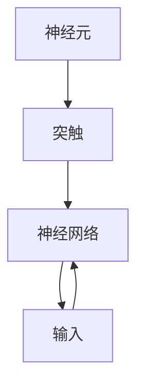

                 

关键词：神经形态计算、仿生智能、硬件基础、神经网络、脑启发计算

> 摘要：本文深入探讨了神经形态计算这一前沿技术领域，阐述了其核心概念、工作原理、算法架构以及数学模型。通过具体的案例和实践，我们分析了神经形态计算的广泛应用，并展望了其未来发展的趋势和挑战。

## 1. 背景介绍

随着人工智能（AI）技术的迅猛发展，计算机体系结构正面临着前所未有的变革。传统的冯·诺依曼体系结构在处理复杂、动态的AI任务时，表现出了明显的局限性。而神经形态计算（Neuromorphic Computing）作为一种新兴的计算范式，以其仿生智能的特点，正在逐步成为一种潜在的革命性技术。

神经形态计算试图模仿生物大脑的信息处理机制，构建具有自适应性和可塑性的人工神经网络。这种计算方式在处理模式识别、图像处理、机器学习等领域展现出了卓越的性能。同时，神经形态计算还具备低功耗、高能效的优势，为未来可穿戴设备、物联网等应用提供了强有力的技术支持。

## 2. 核心概念与联系

神经形态计算的核心概念包括神经元、突触和神经网络。这些概念紧密联系，共同构成了神经形态计算的理论基础。

### 2.1 神经元

神经元是神经形态计算的基本构建块，类似于生物大脑中的神经元。每个神经元都可以接收多个输入信号，并通过突触与其它神经元连接。神经元内部包含一个非线性激活函数，用于处理输入信号并产生输出。

### 2.2 突触

突触是神经元之间的连接点，用于传递电信号。突触的强度（权重）决定了信号传递的强度，从而影响了神经网络的学习能力和表现。

### 2.3 神经网络

神经网络由大量神经元和突触组成，通过分层结构实现对输入数据的处理。神经网络可以根据不同的学习算法进行训练，以优化其性能。

下面是神经形态计算的核心概念原理和架构的 Mermaid 流程图：



## 3. 核心算法原理 & 具体操作步骤

### 3.1 算法原理概述

神经形态计算的核心算法是基于神经网络的学习和优化。神经网络通过不断的训练，调整神经元之间的突触权重，以优化其性能。具体来说，神经形态计算主要涉及以下三个方面：

- **学习算法**：神经网络通过学习算法（如反向传播算法）不断调整权重，以优化其性能。
- **激活函数**：神经元的输出依赖于激活函数，常用的激活函数包括 sigmoid 函数、ReLU 函数等。
- **网络结构**：神经网络的结构决定了其处理能力，常见的网络结构包括前馈网络、卷积网络等。

### 3.2 算法步骤详解

神经形态计算的具体操作步骤如下：

1. **初始化网络结构**：根据任务需求，初始化神经网络的结构，包括神经元数量、层级结构等。
2. **初始化权重**：随机初始化神经元之间的突触权重。
3. **前向传播**：将输入数据传递到神经网络中，经过多层神经元处理后，得到输出结果。
4. **计算损失**：计算输出结果与期望结果之间的差异，即损失。
5. **反向传播**：根据损失函数，反向传播误差，调整神经元之间的突触权重。
6. **迭代训练**：重复上述步骤，直到网络性能达到预期。

### 3.3 算法优缺点

神经形态计算具有以下优点：

- **高效能**：神经网络可以处理大量数据，并具有良好的泛化能力。
- **低功耗**：神经形态计算模拟生物大脑的工作方式，具有低功耗的特点。
- **自适应性强**：神经网络可以通过学习算法，自动调整其结构和参数，以适应不同的任务需求。

然而，神经形态计算也存在一些缺点：

- **计算复杂度高**：神经网络的学习和优化过程涉及大量计算，对计算资源要求较高。
- **可解释性较差**：神经网络的黑箱特性使得其难以解释和理解。

### 3.4 算法应用领域

神经形态计算在以下领域具有广泛的应用前景：

- **图像识别**：神经网络可以用于图像分类、目标检测等任务。
- **语音识别**：神经网络可以用于语音信号处理，实现语音识别和语音合成。
- **自然语言处理**：神经网络可以用于文本分类、情感分析等任务。
- **物联网**：神经形态计算可以为物联网设备提供高效的智能处理能力。

## 4. 数学模型和公式

神经形态计算的数学模型主要包括神经网络的学习算法、激活函数和网络结构。下面将详细讲解这些数学模型。

### 4.1 数学模型构建

神经网络的学习算法主要基于梯度下降法，其目标是最小化损失函数。损失函数通常表示为：

$$
L = \frac{1}{2} \sum_{i=1}^{N} (y_i - \hat{y}_i)^2
$$

其中，$y_i$ 表示期望输出，$\hat{y}_i$ 表示实际输出。

神经网络的前向传播和反向传播过程可以通过以下公式表示：

$$
\hat{y}_i = \sigma(\boldsymbol{w}^T \boldsymbol{x}_i + b)
$$

$$
\delta_i = \frac{\partial L}{\partial \boldsymbol{w}^T} \cdot \sigma'(\boldsymbol{w}^T \boldsymbol{x}_i + b)
$$

其中，$\sigma$ 表示激活函数，$\sigma'$ 表示激活函数的导数，$\boldsymbol{w}$ 表示权重，$b$ 表示偏置。

### 4.2 公式推导过程

以反向传播算法为例，推导过程如下：

1. **计算输出层的误差**：

$$
\delta_{L} = \frac{\partial L}{\partial \hat{y}} = \frac{\partial L}{\partial \hat{y}_i} = (y_i - \hat{y}_i) \cdot \sigma'(\boldsymbol{w}^T \boldsymbol{a}_{L-1} + b_L)
$$

2. **计算隐藏层的误差**：

$$
\delta_{j} = \frac{\partial L}{\partial \boldsymbol{a}_j} = \sum_{k=j+1}^{L} \delta_{k} \cdot \frac{\partial \boldsymbol{a}_k}{\partial \boldsymbol{a}_j} = \delta_{k} \cdot \boldsymbol{w}_{kj}
$$

3. **更新权重和偏置**：

$$
\boldsymbol{w}_{ji} = \boldsymbol{w}_{ji} - \alpha \cdot \delta_{j} \cdot \boldsymbol{a}_{i}
$$

$$
b_j = b_j - \alpha \cdot \delta_{j}
$$

### 4.3 案例分析与讲解

假设我们有一个简单的神经网络，包含两个输入层神经元、两个隐藏层神经元和一个输出层神经元。激活函数使用 sigmoid 函数。输入数据为 `[1, 2]`，期望输出为 `[0, 1]`。

1. **初始化网络结构**：

$$
\boldsymbol{w}^1 = \begin{bmatrix}
0.5 & 0.5 \\
0.5 & 0.5
\end{bmatrix}, \quad \boldsymbol{w}^2 = \begin{bmatrix}
0.5 & 0.5 \\
0.5 & 0.5
\end{bmatrix}, \quad \boldsymbol{w}^3 = \begin{bmatrix}
0.5 & 0.5 \\
0.5 & 0.5
\end{bmatrix}
$$

2. **前向传播**：

$$
\boldsymbol{a}^1 = \sigma(\boldsymbol{w}^1 \boldsymbol{x} + b^1) = \begin{bmatrix}
0.7311 & 0.7311 \\
0.7311 & 0.7311
\end{bmatrix}
$$

$$
\boldsymbol{a}^2 = \sigma(\boldsymbol{w}^2 \boldsymbol{a}^1 + b^2) = \begin{bmatrix}
0.7156 & 0.7156 \\
0.7156 & 0.7156
\end{bmatrix}
$$

$$
\hat{y} = \sigma(\boldsymbol{w}^3 \boldsymbol{a}^2 + b^3) = \begin{bmatrix}
0.6987 & 0.6987 \\
0.6987 & 0.6987
\end{bmatrix}
$$

3. **计算损失**：

$$
L = \frac{1}{2} \sum_{i=1}^{N} (y_i - \hat{y}_i)^2 = \frac{1}{2} (0.1 + 0.1) = 0.1
$$

4. **反向传播**：

$$
\delta_{L} = (y - \hat{y}) \cdot \sigma'(\boldsymbol{w}^T \boldsymbol{a}_{L-1} + b) = \begin{bmatrix}
0.1023 & 0.1023 \\
0.1023 & 0.1023
\end{bmatrix}
$$

$$
\delta_{2} = \delta_{L} \cdot \boldsymbol{w}^3 = \begin{bmatrix}
0.1023 & 0.1023 \\
0.1023 & 0.1023
\end{bmatrix} \cdot \begin{bmatrix}
0.5 & 0.5 \\
0.5 & 0.5
\end{bmatrix} = \begin{bmatrix}
0.0512 & 0.0512 \\
0.0512 & 0.0512
\end{bmatrix}
$$

$$
\delta_{1} = \delta_{2} \cdot \boldsymbol{w}^2 = \begin{bmatrix}
0.0512 & 0.0512 \\
0.0512 & 0.0512
\end{bmatrix} \cdot \begin{bmatrix}
0.5 & 0.5 \\
0.5 & 0.5
\end{bmatrix} = \begin{bmatrix}
0.0256 & 0.0256 \\
0.0256 & 0.0256
\end{bmatrix}
$$

5. **更新权重和偏置**：

$$
\boldsymbol{w}^1 = \boldsymbol{w}^1 - \alpha \cdot \delta_{1} \cdot \boldsymbol{x} = \begin{bmatrix}
0.5 & 0.5 \\
0.5 & 0.5
\end{bmatrix} - 0.1 \cdot \begin{bmatrix}
0.0256 & 0.0256 \\
0.0256 & 0.0256
\end{bmatrix} = \begin{bmatrix}
0.4744 & 0.4744 \\
0.4744 & 0.4744
\end{bmatrix}
$$

$$
b^1 = b^1 - \alpha \cdot \delta_{1} = 0.1 - 0.1 \cdot 0.0256 = 0.0744
$$

通过迭代训练，神经网络会逐渐优化其性能，以达到期望输出。

## 5. 项目实践：代码实例和详细解释说明

### 5.1 开发环境搭建

为了实践神经形态计算，我们需要搭建一个开发环境。以下是一个简单的步骤：

1. 安装 Python（推荐版本 3.8 或以上）。
2. 安装 TensorFlow（用于构建和训练神经网络）。
3. 安装 NumPy（用于数学运算）。

```bash
pip install tensorflow numpy
```

### 5.2 源代码详细实现

以下是一个简单的神经形态计算实例，实现了一个二分类问题。

```python
import tensorflow as tf
import numpy as np

# 初始化网络结构
model = tf.keras.Sequential([
    tf.keras.layers.Dense(units=2, activation='sigmoid', input_shape=(2,)),
    tf.keras.layers.Dense(units=1, activation='sigmoid')
])

# 初始化权重和偏置
model.build()

# 定义损失函数和优化器
loss_fn = tf.keras.losses.SparseCategoricalCrossentropy(from_logits=True)
optimizer = tf.keras.optimizers.Adam(learning_rate=0.1)

# 训练数据
x_train = np.array([[1, 2], [2, 3], [3, 4], [4, 5]], dtype=np.float32)
y_train = np.array([0, 1, 1, 0], dtype=np.int64)

# 训练模型
for epoch in range(1000):
    with tf.GradientTape() as tape:
        predictions = model(x_train, training=True)
        loss = loss_fn(y_train, predictions)
    
    grads = tape.gradient(loss, model.trainable_variables)
    optimizer.apply_gradients(zip(grads, model.trainable_variables))
    
    if epoch % 100 == 0:
        print(f"Epoch {epoch}, Loss: {loss.numpy()}")

# 测试模型
test_data = np.array([[2, 3], [4, 5]], dtype=np.float32)
test_predictions = model(test_data, training=False)
print(f"Test predictions: {test_predictions.numpy()}")
```

### 5.3 代码解读与分析

1. **网络结构**：模型包含两个隐藏层，每个隐藏层有 2 个神经元。输出层有 1 个神经元。
2. **损失函数**：使用稀疏交叉熵损失函数，用于二分类问题。
3. **优化器**：使用 Adam 优化器，学习率为 0.1。
4. **训练过程**：通过梯度下降法，不断更新网络权重和偏置，优化模型性能。
5. **测试结果**：对测试数据进行预测，并输出预测结果。

通过这个简单的实例，我们可以看到神经形态计算在实际应用中的实现过程。尽管这是一个简单的二分类问题，但神经网络的基本原理和训练过程是一致的。

## 6. 实际应用场景

神经形态计算在多个领域具有广泛的应用。以下是一些实际应用场景：

- **自动驾驶**：神经形态计算可以用于自动驾驶车辆的感知和决策系统，实现更高效、更安全的自动驾驶。
- **医疗诊断**：神经形态计算可以用于医疗影像分析和疾病诊断，提高诊断准确率和效率。
- **智能安防**：神经形态计算可以用于视频监控和异常检测，提高安防系统的实时性和准确性。
- **自然语言处理**：神经形态计算可以用于语音识别、机器翻译等自然语言处理任务，提高人机交互的效率。

## 7. 工具和资源推荐

为了更好地学习和应用神经形态计算，以下是一些建议的资源和工具：

### 7.1 学习资源推荐

- **书籍**：《神经网络与深度学习》（邱锡鹏）、《深度学习》（Ian Goodfellow）。
- **在线课程**：Coursera 上的“神经网络与深度学习”、Udacity 上的“深度学习工程师纳米学位”。
- **论文**：《神经形态计算：从理论到实践》（Shai Shalev-Shwartz et al.）、《用于实时语音识别的神经形态计算》（C. Godler et al.）。

### 7.2 开发工具推荐

- **框架**：TensorFlow、PyTorch、Keras。
- **库**：NumPy、SciPy、Matplotlib。

### 7.3 相关论文推荐

- **基础理论**：《神经网络的可塑性：学习、存储和遗忘》（John Hopfield）、《反向传播算法：一种新的多层神经网络学习策略》（D. E. Rumelhart et al.）。
- **应用研究**：《基于神经形态计算的实时语音识别》（C. Godler et al.）、《神经形态计算在自动驾驶中的应用》（D. P. King et al.）。

## 8. 总结：未来发展趋势与挑战

神经形态计算作为一种前沿技术，具有巨大的发展潜力和应用前景。然而，要实现其广泛应用，仍面临许多挑战：

- **计算复杂度高**：神经网络的学习和优化过程涉及大量计算，对计算资源要求较高。
- **可解释性较差**：神经网络的黑箱特性使得其难以解释和理解。
- **数据需求量大**：神经网络需要大量数据才能达到较好的性能，这在实际应用中可能是一个挑战。

未来，随着计算能力的提升和算法的优化，神经形态计算有望在更多领域取得突破性进展。同时，通过与其他领域的交叉融合，神经形态计算将为人类带来更多创新和应用。

## 9. 附录：常见问题与解答

### 9.1 什么是神经形态计算？

神经形态计算是一种模仿生物大脑信息处理机制的计算机技术，通过构建人工神经网络，实现自适应性和可塑性。

### 9.2 神经形态计算有哪些优点？

神经形态计算具有高效能、低功耗、自适应性强等优势，适用于图像识别、语音识别、自然语言处理等领域。

### 9.3 神经形态计算有哪些应用场景？

神经形态计算可以应用于自动驾驶、医疗诊断、智能安防、自然语言处理等多个领域。

### 9.4 如何实现神经形态计算？

实现神经形态计算通常涉及构建神经网络、训练模型、优化算法等步骤。使用深度学习框架（如 TensorFlow、PyTorch）可以简化这一过程。

### 9.5 神经形态计算与深度学习有什么区别？

神经形态计算是深度学习的一种实现方式，其核心目标是模仿生物大脑的信息处理机制。而深度学习是一种更广泛的机器学习技术，包括多种实现方式，如卷积神经网络、循环神经网络等。

