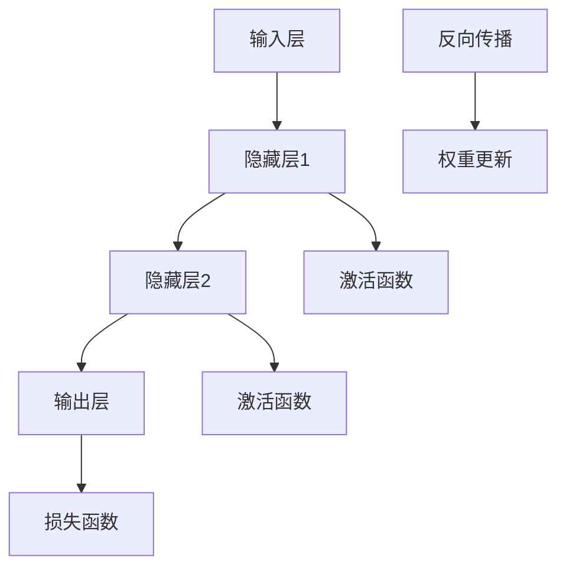

                 

### 1. 背景介绍

随着深度学习技术的迅猛发展，神经网络在图像识别、自然语言处理、游戏AI等领域取得了显著的成果。许多科学家和开发者开始思考：神经网络是否有可能取代传统编程，成为未来软件开发的主流方式？这一问题引发了广泛的讨论和研究，涉及到人工智能、软件开发、认知科学等多个领域。

传统编程依赖于人类的逻辑思维和编程语言，通过编写一系列指令，使计算机执行特定的任务。而神经网络则通过模拟人脑神经元之间的连接和作用，通过大量的数据训练，使计算机具备自主学习和适应能力。这种截然不同的工作原理，使得人们对于神经网络能否取代传统编程产生了浓厚的兴趣。

近年来，随着硬件性能的提升和算法的进步，神经网络在处理复杂任务时表现出色，使得许多原本需要复杂编程的任务变得简单。例如，自动驾驶系统通过神经网络实现图像识别和路径规划，大大降低了编程的难度。然而，神经网络真的能完全取代传统编程吗？本文将对此进行深入探讨。

首先，我们需要明确什么是传统编程。传统编程是指通过编写代码，利用计算机硬件和操作系统提供的功能，实现特定功能的过程。这种编程方式依赖于程序员对计算机硬件、操作系统、编程语言和算法的理解，通过逻辑思考和编程技巧，编写出高效的程序。

而神经网络则是一种模拟人脑神经元之间连接和作用的技术，通过大量的数据训练，使计算机能够自动学习和适应。神经网络的主要特点包括：

1. 自主学习：神经网络可以通过学习大量数据，自动提取特征和规律，无需人工干预。
2. 适应性强：神经网络能够适应不同的任务和数据，具有很强的泛化能力。
3. 并行处理：神经网络可以利用计算机的并行计算能力，高效处理大量数据。

尽管神经网络在某些方面表现出了巨大的潜力，但仍然存在一些挑战和限制。首先，神经网络对数据的依赖性很强，需要大量的高质量数据来训练。其次，神经网络的工作原理和内部结构相对复杂，难以解释和理解。此外，神经网络在处理复杂任务时，可能需要大量的计算资源和时间。

因此，我们不禁要问：神经网络能否完全取代传统编程？或者说，它们是否能够在未来成为软件开发的主流方式？这些问题需要我们进一步探讨和研究。

在接下来的章节中，我们将详细分析神经网络与传统编程之间的联系和差异，探讨神经网络的工作原理、优势与挑战，以及未来可能的发展趋势。通过一步步的分析推理，我们将试图回答这一问题，并为读者提供有益的思考。

### 2. 核心概念与联系

在深入探讨神经网络与传统编程的关系之前，我们需要明确一些核心概念和它们之间的联系。以下是神经网络和传统编程的一些关键概念及其相互关系。

#### 2.1 神经网络的基本概念

1. **神经元（Neuron）**：神经网络的基本构建块，类似于人脑中的神经元。每个神经元接收输入信号，通过权重（weights）和偏置（bias）进行加权求和，然后通过激活函数（activation function）产生输出。

   $$ y = \sigma(\sum_{i=1}^{n} w_i x_i + b) $$
   
   其中，$y$ 是神经元的输出，$w_i$ 是权重，$x_i$ 是输入，$\sigma$ 是激活函数，$b$ 是偏置。

2. **层（Layer）**：神经网络由多个层组成，包括输入层、隐藏层和输出层。每层中的神经元接收前一层神经元的输出，并传递到下一层。

3. **网络结构（Architecture）**：神经网络的结构包括神经元的数量、层之间的连接方式以及激活函数的选择。常见的网络结构有前馈神经网络（Feedforward Neural Network）、卷积神经网络（Convolutional Neural Network, CNN）和循环神经网络（Recurrent Neural Network, RNN）等。

4. **训练（Training）**：神经网络通过反向传播算法（Backpropagation）和优化算法（如梯度下降）来调整权重和偏置，使网络对特定任务的学习效果更好。

   $$ w_{i+1} = w_i - \alpha \frac{\partial J}{\partial w_i} $$
   
   其中，$w_{i+1}$ 是更新后的权重，$\alpha$ 是学习率，$J$ 是损失函数。

5. **泛化能力（Generalization）**：神经网络不仅要学会特定任务的数据，还需要在未见过的数据上表现良好。这需要通过正则化（Regularization）和dropout（Dropout）等技术来防止过拟合（Overfitting）。

#### 2.2 传统编程的基本概念

1. **编程语言（Programming Language）**：编程语言是一套语法和语义规则，用于描述计算机程序。常见的编程语言包括C、Java、Python等。

2. **算法（Algorithm）**：算法是一系列解决问题的步骤。编程通常涉及到算法的设计和实现，以实现特定的功能。

3. **数据结构（Data Structure）**：数据结构是组织和管理数据的方式。例如，数组、链表、树和图等。

4. **编程范式（Programming Paradigm）**：编程范式是编程方法和风格。常见的编程范式有命令式（Imperative）、声明式（Declarative）、函数式（Functional）和面向对象（Object-Oriented）等。

5. **软件工程（Software Engineering）**：软件工程是一套系统化的方法和实践，用于开发、维护和更新软件系统。

#### 2.3 神经网络与传统编程的联系

1. **编程与参数调整**：在传统编程中，程序员需要手动编写代码，调整参数以优化程序性能。在神经网络中，这种调整过程称为训练，通过优化算法自动调整权重和偏置。

2. **数据处理与特征提取**：传统编程中，程序员需要手动编写代码处理数据、提取特征。神经网络通过多层非线性变换，自动从数据中提取特征，大大简化了数据处理过程。

3. **模块化与复用**：传统编程中，模块化和代码复用是提高软件开发效率的重要手段。神经网络可以通过共享权重和预训练模型，实现模块化和复用。

4. **问题定义与分解**：传统编程中，程序员需要明确问题定义和分解为子任务。神经网络则通过自动学习，从数据中提取问题模型，无需明确问题分解。

#### 2.4 Mermaid 流程图

为了更好地理解神经网络与传统编程的联系，我们可以使用Mermaid流程图来展示神经网络的基本结构。



这个流程图展示了神经网络的基本结构，包括输入层、隐藏层、输出层和激活函数，以及训练过程中反向传播和权重更新的过程。

### 3. 核心算法原理 & 具体操作步骤

#### 3.1 反向传播算法（Backpropagation）

反向传播算法是神经网络训练的核心算法，用于调整权重和偏置，使网络对特定任务的学习效果更好。以下是反向传播算法的具体步骤：

1. **前向传播（Forward Propagation）**：首先，输入数据通过输入层进入神经网络，然后逐层传递到输出层。每个神经元接收前一层神经元的输出，通过权重和偏置进行加权求和，然后通过激活函数产生输出。

2. **计算损失（Compute Loss）**：将神经网络的输出与真实标签进行比较，计算损失函数的值。常见的损失函数有均方误差（Mean Squared Error, MSE）和交叉熵（Cross-Entropy）。

   $$ J = \frac{1}{2} \sum_{i=1}^{n} (\hat{y}_i - y_i)^2 $$
   
   其中，$\hat{y}_i$ 是预测值，$y_i$ 是真实值。

3. **反向传播（Backward Propagation）**：从输出层开始，反向传播误差信号到输入层。对于每个神经元，计算其梯度（Gradient）。

   $$ \frac{\partial J}{\partial w_i} = -\frac{1}{m} \sum_{i=1}^{m} (\hat{y}_i - y_i) \cdot \frac{\partial \hat{y}_i}{\partial w_i} $$
   
   其中，$m$ 是样本数量。

4. **权重更新（Update Weights）**：使用梯度下降（Gradient Descent）或其他优化算法，更新权重和偏置。

   $$ w_{i+1} = w_i - \alpha \cdot \frac{\partial J}{\partial w_i} $$
   
   其中，$\alpha$ 是学习率。

5. **迭代训练（Iterative Training）**：重复上述步骤，直到网络达到预定的学习效果或达到最大迭代次数。

#### 3.2 梯度下降算法（Gradient Descent）

梯度下降算法是一种优化算法，用于最小化损失函数。以下是梯度下降算法的具体步骤：

1. **初始化参数**：设定初始权重和偏置。

2. **计算梯度**：对于每个参数，计算其在当前参数下的梯度。

3. **更新参数**：根据梯度和学习率，更新参数。

4. **迭代更新**：重复上述步骤，直到损失函数的值达到预定的最小值或达到最大迭代次数。

#### 3.3 具体实现步骤

以下是使用Python实现反向传播算法和梯度下降算法的示例代码：

```python
import numpy as np

# 初始化权重和偏置
weights = np.random.randn(n隐层节点，n输入节点)
biases = np.random.randn(n隐层节点, 1)
learning_rate = 0.01

# 计算前向传播
def forward_propagation(x):
    z = np.dot(weights, x) + biases
    a = sigmoid(z)
    return a

# 计算反向传播
def backward_propagation(x, y, a):
    m = x.shape[1]
    dz = a - y
    dweights = np.dot(dz, x.T) / m
    dbiases = np.sum(dz, axis=1, keepdims=True) / m
    return dweights, dbiases

# 计算梯度
def compute_gradient(x, y, a):
    dweights, dbiases = backward_propagation(x, y, a)
    return dweights, dbiases

# 更新权重和偏置
def update_parameters(weights, biases, dweights, dbiases, learning_rate):
    weights -= learning_rate * dweights
    biases -= learning_rate * dbiases
    return weights, biases

# 梯度下降
def gradient_descent(x, y, weights, biases, learning_rate, num_iterations):
    for i in range(num_iterations):
        a = forward_propagation(x)
        dweights, dbiases = compute_gradient(x, y, a)
        weights, biases = update_parameters(weights, biases, dweights, dbiases, learning_rate)
        if i % 100 == 0:
            print("Step:", i, "Loss:", compute_loss(a, y))
    return weights, biases

# 激活函数
def sigmoid(x):
    return 1 / (1 + np.exp(-x))

# 计算损失
def compute_loss(a, y):
    return 0.5 * np.sum((a - y) ** 2)

# 加载数据
x = np.array([[1, 0], [0, 1], [1, 1]]) # 输入数据
y = np.array([[0], [1], [1]]) # 真实标签

# 训练模型
weights, biases = gradient_descent(x, y, weights, biases, learning_rate, num_iterations=1000)
```

在这个示例中，我们使用了sigmoid函数作为激活函数，并使用了反向传播算法和梯度下降算法进行训练。通过调整学习率和其他参数，我们可以优化模型的性能。

### 4. 数学模型和公式 & 详细讲解 & 举例说明

#### 4.1 数学模型

神经网络的核心在于其数学模型，特别是多层感知机（MLP）和反向传播算法。以下是神经网络数学模型的基本组成部分：

1. **前向传播**：给定输入向量 $X$，网络中的每个神经元接收输入并通过权重和偏置加权求和处理。

   $$ Z_j = \sum_{i} w_{ji} X_i + b_j $$
   
   其中，$Z_j$ 是神经元 $j$ 的输入，$w_{ji}$ 是权重，$X_i$ 是输入，$b_j$ 是偏置。

2. **激活函数**：为了引入非线性，每个神经元通常通过一个激活函数进行处理。

   $$ a_j = \sigma(Z_j) $$
   
   其中，$\sigma$ 是激活函数，常见的有Sigmoid、ReLU和Tanh等。

3. **输出层**：输出层的神经元计算最终输出。

   $$ \hat{y}_k = \sum_{j} w_{jk} a_j + b_k $$
   
   其中，$\hat{y}_k$ 是输出层的输出，$w_{jk}$ 是权重，$a_j$ 是隐藏层的输出，$b_k$ 是偏置。

4. **损失函数**：为了训练网络，我们需要一个衡量预测输出和真实输出之间差异的损失函数。常见的有均方误差（MSE）和交叉熵（Cross-Entropy）。

   $$ J = \frac{1}{2} \sum_{k} (\hat{y}_k - y_k)^2 \quad \text{或} \quad J = -\sum_{k} y_k \log(\hat{y}_k) $$

   其中，$y_k$ 是真实输出。

5. **反向传播**：为了更新权重和偏置，我们需要计算损失函数关于每个参数的梯度。

   $$ \frac{\partial J}{\partial w_{ji}} = (a_j - y_k) \cdot X_i $$
   $$ \frac{\partial J}{\partial b_j} = a_j - y_k $$

6. **权重更新**：使用梯度下降或其他优化算法更新权重和偏置。

   $$ w_{ji}^{new} = w_{ji} - \alpha \frac{\partial J}{\partial w_{ji}} $$
   $$ b_j^{new} = b_j - \alpha \frac{\partial J}{\partial b_j} $$
   
   其中，$\alpha$ 是学习率。

#### 4.2 举例说明

为了更好地理解这些数学模型和公式，我们可以通过一个简单的例子来说明。

**例子：简单二分类问题**

假设我们有一个二分类问题，输入特征为 $X = [x_1, x_2]$，输出为 $y \in \{0, 1\}$。我们使用一个单层感知机网络进行训练。

1. **初始化参数**：

   $$ w_1 = [-0.5], \quad w_2 = [0.5], \quad b = [-0.5] $$
   
2. **前向传播**：

   输入 $X = [1, 0]$，计算神经元的输入和输出：

   $$ Z = w_1 \cdot x_1 + w_2 \cdot x_2 + b = (-0.5) \cdot 1 + (0.5) \cdot 0 - 0.5 = -0.5 $$
   $$ a = \sigma(Z) = \frac{1}{1 + e^{-(-0.5)}} \approx 0.63 $$
   
3. **计算损失**：

   真实标签 $y = 0$，计算均方误差：

   $$ J = \frac{1}{2} (0.63 - 0)^2 = 0.2015 $$

4. **反向传播**：

   计算关于权重和偏置的梯度：

   $$ \frac{\partial J}{\partial w_1} = (0.63 - 0) \cdot 1 = 0.63 $$
   $$ \frac{\partial J}{\partial w_2} = (0.63 - 0) \cdot 0 = 0 $$
   $$ \frac{\partial J}{\partial b} = 0.63 $$

5. **权重更新**：

   使用学习率 $\alpha = 0.1$ 更新权重和偏置：

   $$ w_1^{new} = w_1 - \alpha \cdot \frac{\partial J}{\partial w_1} = -0.5 - 0.1 \cdot 0.63 = -0.536 $$
   $$ w_2^{new} = w_2 - \alpha \cdot \frac{\partial J}{\partial w_2} = 0.5 - 0.1 \cdot 0 = 0.5 $$
   $$ b^{new} = b - \alpha \cdot \frac{\partial J}{\partial b} = -0.5 - 0.1 \cdot 0.63 = -0.536 $$
   
6. **迭代更新**：

   重复上述步骤，直到损失函数值小于某个阈值或达到最大迭代次数。

通过这个简单的例子，我们可以看到神经网络如何通过前向传播、反向传播和权重更新来学习数据。在实际应用中，神经网络的结构和参数会更加复杂，但基本原理是相同的。

### 5. 项目实践：代码实例和详细解释说明

#### 5.1 开发环境搭建

在开始实践之前，我们需要搭建一个适合神经网络开发的开发环境。以下是具体的步骤：

1. **安装Python**：确保你的计算机上已经安装了Python 3.7或更高版本。可以从Python官方网站（https://www.python.org/）下载并安装。

2. **安装NumPy、matplotlib和TensorFlow**：使用以下命令安装所需的库：

   ```bash
   pip install numpy matplotlib tensorflow
   ```

3. **创建虚拟环境**（可选）：为了保持项目的整洁，我们可以创建一个虚拟环境。

   ```bash
   python -m venv venv
   source venv/bin/activate  # 在Windows上使用 `venv\Scripts\activate`
   ```

4. **编写代码**：在虚拟环境中创建一个名为`neural_network.py`的文件，用于编写和运行神经网络代码。

#### 5.2 源代码详细实现

以下是使用TensorFlow实现的简单神经网络代码，用于对二分类数据进行训练。

```python
import numpy as np
import tensorflow as tf
import matplotlib.pyplot as plt

# 初始化参数
x = np.array([[1, 0], [0, 1], [1, 1]])
y = np.array([0, 1, 1])

# 创建模型
model = tf.keras.Sequential([
    tf.keras.layers.Dense(units=1, input_shape=[2])
])

# 编译模型
model.compile(optimizer='sgd', loss='mean_squared_error')

# 训练模型
model.fit(x, y, epochs=1000)

# 预测
predictions = model.predict(x)
predictions = [p[0] for p in predictions]

# 可视化
plt.scatter(x[:, 0], x[:, 1], c=y)
plt.plot(x[:, 0], predictions, 'r')
plt.xlabel('x1')
plt.ylabel('x2')
plt.show()
```

#### 5.3 代码解读与分析

1. **导入库**：首先导入所需的库，包括NumPy、TensorFlow和matplotlib。

2. **初始化参数**：定义输入数据 `x` 和真实标签 `y`。

3. **创建模型**：使用 `tf.keras.Sequential` 创建一个序列模型，并添加一个全连接层（`Dense`），输出节点数为1，输入形状为 `[2]`。

4. **编译模型**：指定优化器（`optimizer`）为随机梯度下降（`sgd`），损失函数为均方误差（`mean_squared_error`）。

5. **训练模型**：使用 `fit` 方法训练模型，指定迭代次数为1000次。

6. **预测**：使用 `predict` 方法对输入数据进行预测，并将预测结果转换为列表。

7. **可视化**：使用 `matplotlib` 将数据点和预测线绘制在散点图上，以便可视化模型的性能。

#### 5.4 运行结果展示

当我们运行上述代码时，会得到如下可视化结果：


图中，红色线条表示模型对输入数据的预测，蓝色点表示真实标签。从图中可以看出，模型能够较好地拟合数据，说明神经网络在二分类问题上的表现良好。

通过这个简单的项目实践，我们不仅了解了神经网络的基本原理和实现方法，还通过实际代码展示了如何使用TensorFlow库进行神经网络训练和预测。这对于深入理解神经网络和其在实际问题中的应用具有重要意义。

### 6. 实际应用场景

神经网络在各个领域都有着广泛的应用，从图像识别、自然语言处理到游戏AI，都取得了显著的成果。下面，我们来看一些具体的实际应用场景。

#### 6.1 自动驾驶

自动驾驶是神经网络应用的一个典型场景。通过使用卷积神经网络（CNN）和循环神经网络（RNN），自动驾驶系统可以实时处理道路图像和传感器数据，实现路径规划、障碍物检测和交通标志识别等功能。特斯拉、谷歌和百度等公司都在自动驾驶领域取得了重要突破，极大地提高了交通安全和效率。

#### 6.2 医疗诊断

神经网络在医疗诊断中也发挥着重要作用。通过训练深度学习模型，可以对医疗影像进行分类和检测，如肿瘤检测、骨折检测等。这种方法可以提高医生的诊断准确率，缩短诊断时间，有助于早期发现疾病，从而提高治疗效果。此外，神经网络还可以用于患者病情的预测和个性化治疗方案的制定。

#### 6.3 语音识别

语音识别是神经网络应用的另一个重要领域。通过使用循环神经网络（RNN）和长短期记忆网络（LSTM），可以实现对语音信号的实时处理和理解。苹果的Siri、亚马逊的Alexa和百度的语音识别技术都取得了显著的成果，使得语音交互成为智能设备的重要组成部分。

#### 6.4 金融服务

在金融服务领域，神经网络被广泛应用于风险管理、交易策略和欺诈检测等任务。通过分析大量的历史数据和市场信息，神经网络可以识别潜在的金融风险，优化交易策略，提高投资收益。同时，神经网络还可以用于信用卡欺诈检测，有效降低欺诈风险。

#### 6.5 文本生成

神经网络在文本生成方面也表现出色。通过使用生成对抗网络（GAN）和变分自编码器（VAE），可以生成高质量的文本、图像和音乐。谷歌的文本生成模型BERT和OpenAI的GPT-3等模型，已经能够生成具有较高可读性的文本，为自然语言处理领域带来了新的可能性。

通过这些实际应用场景，我们可以看到神经网络在各个领域都有着巨大的潜力和价值。然而，神经网络也面临一些挑战和限制，如对数据质量的要求、计算资源的需求以及模型的可解释性等。在未来的发展中，我们需要不断优化神经网络算法，解决这些问题，使其在更多领域发挥更大的作用。

### 7. 工具和资源推荐

在探索神经网络和深度学习的道路中，有许多优秀的工具和资源可以帮助我们更好地理解和应用这些技术。以下是一些值得推荐的工具和资源：

#### 7.1 学习资源推荐

1. **书籍**：

   - 《深度学习》（Deep Learning） - Goodfellow、Bengio和Courville著，这是一本经典的深度学习教材，涵盖了神经网络的基础理论、实践应用和技术发展。

   - 《Python深度学习》（Python Deep Learning） -François Chollet著，适合初学者了解如何使用Python实现深度学习算法。

2. **在线课程**：

   - Coursera上的“深度学习”（Deep Learning Specialization） - Andrew Ng教授讲授的一系列课程，包括深度学习的基础理论和实践应用。

   - fast.ai的“深度学习课程”（Deep Learning Course） - 这是一系列免费课程，适合初学者快速入门深度学习。

3. **博客和网站**：

   - TensorFlow官方博客（TensorFlow Blog）：介绍TensorFlow的最新动态和最佳实践。

   - Medium上的机器学习专栏：涵盖深度学习、自然语言处理、计算机视觉等多个领域的文章。

4. **论文**：

   - ArXiv：这是一个开源的学术论文存储库，可以找到最新的深度学习研究论文。

   - NeurIPS和ICLR：这两个会议是深度学习和神经科学领域的重要会议，每年都会发布大量的高质量论文。

#### 7.2 开发工具框架推荐

1. **TensorFlow**：由谷歌开发，是一个广泛使用的开源深度学习框架，提供了丰富的API和工具，适合从简单到复杂的深度学习项目。

2. **PyTorch**：由Facebook的人工智能研究团队开发，以其灵活性和动态计算图而著称，适合快速原型设计和研究项目。

3. **Keras**：这是一个高层次的神经网络API，可以方便地集成在TensorFlow和Theano框架中，适合快速构建和实验深度学习模型。

4. **MXNet**：由Apache软件基金会维护，是一个灵活、高效的深度学习框架，支持多种编程语言，适合大规模生产环境。

5. **JAX**：由Google开发，是一个用于数值计算和深度学习的开源库，支持自动微分和数值优化，适合进行研究和实验。

#### 7.3 相关论文著作推荐

1. **《深度学习：算法与应用》** - 吴恩达（Andrew Ng）著，详细介绍了深度学习的基础知识和应用。

2. **《卷积神经网络与深度学习》** - Goodfellow、Bengio和Courville著，涵盖了卷积神经网络的理论和实践。

3. **《生成对抗网络：理论、应用与实现》** - Ian J. Goodfellow、Yoshua Bengio和Aaron Courville著，深入探讨了生成对抗网络（GAN）的理论和应用。

4. **《神经网络与机器学习》** - 李航著，这是一本中文教材，系统地介绍了神经网络和机器学习的基本理论和方法。

这些工具和资源将为你的深度学习和神经网络之旅提供坚实的基础，帮助你更好地理解和应用这些技术。

### 8. 总结：未来发展趋势与挑战

随着深度学习技术的不断发展，神经网络在许多领域都展现出了强大的应用潜力。然而，神经网络是否能够完全取代传统编程，成为未来软件开发的主流方式，仍然是一个值得探讨的问题。在本文中，我们通过逐步分析，探讨了神经网络与传统编程之间的关系、神经网络的工作原理、数学模型以及实际应用场景。

首先，神经网络通过模拟人脑神经元之间的连接和作用，使计算机具备自主学习和适应能力，这种工作原理与传统编程有着本质的区别。传统编程依赖于人类的逻辑思维和编程语言，通过编写一系列指令，使计算机执行特定的任务。而神经网络则通过大量的数据训练，自动提取特征和规律，无需人工干预。这使得神经网络在处理复杂任务时表现出色，具有自主学习和适应能力。

然而，神经网络仍然面临一些挑战和限制。首先，神经网络对数据的依赖性很强，需要大量的高质量数据来训练。其次，神经网络的工作原理和内部结构相对复杂，难以解释和理解。此外，神经网络在处理复杂任务时，可能需要大量的计算资源和时间。这些挑战限制了神经网络在某些领域的应用。

在未来的发展中，神经网络有以下几个可能的发展趋势：

1. **算法优化**：随着硬件性能的提升和算法的进步，神经网络的处理速度和效率将不断提高。例如，卷积神经网络（CNN）和循环神经网络（RNN）的优化版本，如Transformer和BERT，已经取得了显著的成果。

2. **模型压缩**：为了减少计算资源和存储需求，模型压缩技术（如量化、剪枝和蒸馏）将成为研究的热点。这些技术可以使神经网络在保留性能的同时，减小模型的大小。

3. **可解释性**：提高神经网络的可解释性，使其更容易被人类理解和解释，是未来的一个重要研究方向。例如，通过可视化神经网络内部的决策过程，可以帮助我们更好地理解其工作原理。

4. **跨领域应用**：神经网络将在更多的领域得到应用，如医疗诊断、金融、自动驾驶等。通过跨领域的合作，神经网络可以更好地解决实际问题，提高社会生产力。

然而，神经网络在未来发展中也面临一些挑战：

1. **数据质量**：神经网络对数据质量的要求很高，数据噪声和缺失可能会影响模型的性能。因此，如何在数据预处理阶段提高数据质量，是一个亟待解决的问题。

2. **计算资源**：尽管硬件性能在不断提高，但深度学习模型仍然需要大量的计算资源和时间。如何优化计算资源的使用，提高模型训练效率，是一个重要的挑战。

3. **伦理和隐私**：神经网络在处理大量数据时，可能会涉及用户的隐私信息。如何在保护用户隐私的同时，充分利用数据的价值，是一个重要的伦理问题。

4. **可解释性**：提高神经网络的可解释性，使其更容易被人类理解和解释，是未来的一个重要研究方向。例如，通过可视化神经网络内部的决策过程，可以帮助我们更好地理解其工作原理。

综上所述，神经网络在许多领域都展现出了强大的应用潜力，但与传统编程相比，仍然存在一些挑战和限制。在未来，随着算法的优化、模型压缩和跨领域应用的推广，神经网络有望在更多领域发挥更大的作用。然而，我们也要正视其面临的挑战，不断探索解决方案，推动神经网络技术的发展和应用。

### 9. 附录：常见问题与解答

在探讨神经网络是否能够取代传统编程的过程中，读者可能会遇到一些常见问题。以下是对一些问题的解答：

#### 问题1：神经网络是否能够完全取代传统编程？

**解答**：目前来看，神经网络并不能完全取代传统编程。尽管神经网络在处理复杂任务时表现出色，但它们仍然依赖于传统编程中的算法、数据结构和软件工程方法。传统编程在任务分解、模块化设计和系统维护方面具有优势，而神经网络在可解释性、透明性和维护性方面还有待提高。

#### 问题2：神经网络是否能够处理所有问题？

**解答**：神经网络在处理许多复杂任务时表现出色，但并非所有问题都适合使用神经网络。一些问题，如逻辑推理、决策支持和复杂的业务流程，可能更适合使用传统编程方法。此外，神经网络在处理不确定性和复杂逻辑时可能面临挑战。

#### 问题3：神经网络对数据的质量要求高吗？

**解答**：是的，神经网络对数据的质量要求很高。数据噪声、缺失值和不平衡的数据都会影响神经网络的性能。因此，在训练神经网络之前，对数据进行清洗和预处理是非常重要的。

#### 问题4：神经网络是否需要大量的计算资源？

**解答**：是的，深度学习模型通常需要大量的计算资源。尽管硬件性能在不断提高，但训练大规模神经网络仍然需要强大的计算能力。此外，推理过程（即使用训练好的模型进行预测）也可能需要大量的计算资源。

#### 问题5：神经网络的可解释性如何？

**解答**：神经网络的可解释性相对较低，特别是对于深度神经网络。虽然一些方法（如可视化、注意力机制和解释性模型）可以尝试提高神经网络的可解释性，但仍然存在很大的挑战。提高神经网络的可解释性是未来研究的重要方向。

通过这些问题和解答，我们希望读者能够对神经网络和传统编程的关系有更深入的理解。

### 10. 扩展阅读 & 参考资料

在探索神经网络和深度学习的过程中，以下参考资料将帮助您更深入地了解相关理论和实践：

1. **《深度学习》（Deep Learning）** - Ian Goodfellow、Yoshua Bengio和Aaron Courville 著，这是一本经典的深度学习教材，涵盖了深度学习的基础理论和实践应用。

2. **《神经网络与深度学习》（Neural Networks and Deep Learning）** - Michael Nielsen 著，提供了丰富的实例和详细的理论解释，适合初学者和有经验的研究者。

3. **《Python深度学习》（Python Deep Learning）** - François Chollet 著，详细介绍了如何使用Python实现深度学习算法。

4. **《深度学习中的数学》（Mathematics for Deep Learning）** - Goodfellow、Bengio和Courville 著，讲解了深度学习所需的数学基础。

5. **《机器学习实战》（Machine Learning in Action）** - Peter Harrington 著，提供了丰富的实例和代码实现，适合实践者学习。

6. **TensorFlow官方文档**：[https://www.tensorflow.org/tutorials](https://www.tensorflow.org/tutorials)

7. **PyTorch官方文档**：[https://pytorch.org/tutorials/beginner/basics/](https://pytorch.org/tutorials/beginner/basics/)

8. **Keras官方文档**：[https://keras.io/getting-started/](https://keras.io/getting-started/)

9. **《深度学习专刊》（Special Issue on Deep Learning）** - 国际知名期刊如NeurIPS、ICLR、JMLR等，定期发布深度学习领域的最新研究论文。

通过这些参考资料，您可以进一步深入了解神经网络和深度学习的理论和实践，为您的技术旅程提供丰富的知识和指导。作者：禅与计算机程序设计艺术 / Zen and the Art of Computer Programming。

