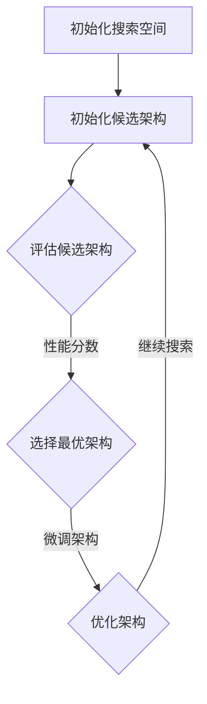

                 

### 背景介绍

#### 什么是神经网络架构搜索（Neural Architecture Search, NAS）

神经网络架构搜索（Neural Architecture Search，简称NAS）是近年来在人工智能领域兴起的一种创新性技术。传统的神经网络设计方法主要依赖于人工经验和试错，而NAS则通过自动化搜索算法来自动发现和设计最优的神经网络架构。这一技术的核心目标是在既定资源限制下，找到具有最佳性能的神经网络架构。

#### NAS 的起源与发展

NAS这一概念最早可以追溯到1980年代末至1990年代初，当时计算机性能远不如现在，研究人员开始探讨如何通过自动化方式设计神经网络。1992年，David E. Cohn, Les Atlas和Richard L. Ladner在论文《Neural Network Architecture for Hands-Free Command of a Robot Car》中首次提出了基于遗传算法的NAS方法。然而，由于计算资源和数据量的限制，NAS在很长一段时间内并未得到广泛应用。

随着计算能力的提升和深度学习技术的快速发展，NAS在近年来迎来了新的发展机遇。2016年，George E. Dahl等人在论文《Super-Resolution CNN Architectures Learned with Neural Architecture Search》中展示了NAS在图像处理任务上的潜力，引发了广泛关注。随后，越来越多的研究人员投入到NAS领域的研究中，探索其在各种任务上的应用。

#### NAS 在深度学习中的重要性

NAS在深度学习领域的重要性主要体现在以下几个方面：

1. **提升性能**：NAS能够自动搜索出性能更优的神经网络架构，从而提高模型的准确率、效率等关键指标。
2. **降低人力成本**：传统的神经网络设计需要大量的人工经验，而NAS通过自动化搜索，大大降低了人工设计的工作量。
3. **探索新架构**：NAS能够发现人类专家未曾考虑的神经网络架构，推动深度学习技术的不断创新和发展。

#### NAS 在实际应用中的挑战

尽管NAS具有巨大的潜力，但其实际应用仍面临诸多挑战：

1. **搜索空间巨大**：NAS需要搜索的神经网络架构空间通常非常庞大，如何高效地进行搜索是一个重要问题。
2. **计算资源消耗**：NAS的搜索过程需要大量的计算资源，这对于实际应用场景是一个不小的负担。
3. **泛化能力**：NAS搜索出的神经网络架构可能仅在特定任务上表现优异，如何提高其泛化能力是一个亟待解决的问题。

### 为什么选择 NAS 作为本文的主题

本文选择NAS作为主题，主要基于以下几点考虑：

1. **技术前沿性**：NAS作为一项前沿技术，具有广泛的研究和应用前景，符合当前人工智能领域的发展趋势。
2. **理论与实践结合**：本文不仅介绍NAS的基本概念和原理，还将结合具体实例和代码实现，使读者能够更好地理解和掌握这一技术。
3. **深度与广度**：本文将深入探讨NAS的核心算法原理、数学模型，同时结合实际应用场景，力求在理论与实践之间找到一个平衡点。

通过本文的阅读，读者将能够对NAS有更为全面和深入的了解，为今后的研究和应用打下坚实的基础。

### 核心概念与联系

#### 神经网络架构搜索的基本概念

神经网络架构搜索（Neural Architecture Search，简称NAS）是一种通过自动化搜索算法来寻找最优神经网络架构的技术。与传统的人工设计方法不同，NAS利用机器学习算法，从大规模的架构候选集中筛选出性能最佳的架构。

**架构搜索空间（Search Space）**：架构搜索空间是指所有可能的神经网络架构集合。这包括网络层数、每层的神经元数量、连接方式、激活函数、正则化策略等多个方面。搜索空间的设计对NAS的性能至关重要，因为搜索空间越大，算法找到最优架构的可能性越高，但也带来了计算复杂度的增加。

**搜索算法（Search Algorithm）**：搜索算法负责在架构搜索空间中搜索最优架构。常见的搜索算法包括遗传算法（GA）、强化学习（RL）、基于梯度的优化方法等。这些算法通过评估函数（通常为模型在验证集上的性能）来指导搜索过程。

**评估函数（Evaluation Function）**：评估函数用于评估每个候选架构的性能。它通常是模型在验证集上的准确率、速度或其他相关指标。评估函数的准确性和效率直接影响到NAS的搜索效果。

#### NAS的基本架构

NAS的基本架构可以分为两个主要部分：搜索空间和搜索算法。以下是NAS的基本架构及各组成部分的详细描述：

1. **搜索空间**：
   - **层（Layer）**：神经网络的基本构建块，包括卷积层、全连接层、池化层等。
   - **连接方式（Connection Pattern）**：网络中层的连接方式，如串联（stacked）、并联（simplified）、跳接（skip connection）等。
   - **操作（Operation）**：层与层之间的操作，如卷积、池化、归一化等。
   - **正则化策略（Regularization）**：防止模型过拟合的方法，如Dropout、权重衰减等。

2. **搜索算法**：
   - **初始化**：随机初始化一组候选架构。
   - **评估**：使用评估函数对每个候选架构进行评估，得到它们的性能分数。
   - **选择**：根据性能分数，选择最优的架构进行下一轮搜索。
   - **优化**：对选中的架构进行微调，以提高性能。
   - **重复**：重复评估、选择和优化过程，直至找到满意的架构或达到预定的搜索深度。

#### NAS的流程图

为了更清晰地理解NAS的架构和工作流程，我们可以使用Mermaid流程图来展示其关键步骤。以下是一个简化的NAS流程图的Mermaid表示：



在这个流程图中，每个节点代表NAS的一个步骤，箭头表示步骤之间的顺序关系。

#### NAS与相关概念的联系

1. **强化学习（Reinforcement Learning）**：NAS中的搜索算法，如基于强化学习的NAS，借鉴了强化学习的思想，通过奖励机制来指导搜索过程。
2. **遗传算法（Genetic Algorithm）**：遗传算法是NAS中常用的搜索算法之一，它通过遗传操作（如交叉、变异）来生成新的候选架构。
3. **迁移学习（Transfer Learning）**：迁移学习可以与NAS结合，将预训练模型的知识迁移到新的搜索任务中，从而提高搜索效率。

通过上述对NAS核心概念与联系的详细探讨，我们可以更好地理解这一技术的本质和实现方式。在接下来的章节中，我们将进一步深入探讨NAS的核心算法原理和具体操作步骤。

### 核心算法原理 & 具体操作步骤

#### 遗传算法（Genetic Algorithm）在NAS中的应用

遗传算法（Genetic Algorithm，简称GA）是一种基于自然选择和遗传学原理的优化算法。在NAS中，GA被广泛应用于神经网络架构的搜索。以下是GA在NAS中应用的详细步骤：

1. **编码（Encoding）**：首先，需要将神经网络架构编码成染色体（Chromosome）。染色体可以表示网络的结构、连接方式、操作等。常见的编码方法有基于树的编码、基于图的结构编码等。

2. **初始化种群（Initial Population）**：在NAS中，种群（Population）由一组随机初始化的染色体组成。初始化种群的大小通常设置为几十到几百个染色体。

3. **适应度评估（Fitness Evaluation）**：使用评估函数对每个染色体进行评估，评估函数通常为模型在验证集上的性能指标，如准确率、速度等。适应度（Fitness）是评估染色体性能的量化指标。

4. **选择（Selection）**：根据适应度值，从当前种群中选择适应度较高的染色体组成新种群。选择操作常用的方法有轮盘赌选择、锦标赛选择等。

5. **交叉（Crossover）**：交叉操作用于生成新的染色体。在NAS中，交叉操作可以发生在架构的不同部分，如层、连接方式等。常见的交叉方法有单点交叉、多点交叉等。

6. **变异（Mutation）**：变异操作用于引入随机性，防止搜索过程陷入局部最优。在NAS中，变异可以改变染色体的某个部分，如添加或删除一层、改变连接方式等。

7. **更新种群（Update Population）**：通过选择、交叉和变异操作，更新种群，生成新一代的染色体。

8. **重复步骤**：重复适应度评估、选择、交叉、变异和更新种群的过程，直至满足终止条件（如达到最大迭代次数或适应度阈值）。

#### 强化学习（Reinforcement Learning）在NAS中的应用

强化学习（Reinforcement Learning，简称RL）是一种通过奖励机制来学习的算法。在NAS中，RL被广泛应用于架构搜索，尤其是基于模型的RL（Model-Based RL）方法。以下是RL在NAS中应用的详细步骤：

1. **环境（Environment）**：在NAS中，环境（Environment）表示神经网络架构搜索的过程。状态（State）可以表示当前的架构，动作（Action）可以是架构的某个部分，如添加一层、改变连接方式等。

2. **状态-动作值函数（State-Action Value Function）**：状态-动作值函数（Q-Function）用于评估在特定状态下执行特定动作的回报。Q-Function可以通过模型训练得到。

3. **策略（Policy）**：策略（Policy）是选择动作的规则。在NAS中，常用的策略是基于Q-Function的最大化策略，即选择具有最高Q值的动作。

4. **奖励（Reward）**：奖励（Reward）是模型在评估集上的性能指标，如准确率、速度等。奖励机制用于指导搜索过程，使模型不断优化架构。

5. **训练Q-Function**：使用强化学习算法（如深度Q网络（DQN））训练Q-Function。训练过程包括状态编码、动作编码、Q-Value更新等。

6. **架构搜索**：根据Q-Function和策略，逐步优化神经网络架构。每次搜索过程包括选择动作、执行动作、更新状态和Q-Value等。

#### 结合GA和RL的混合搜索算法

为了发挥GA和RL的优点，研究人员提出了许多混合搜索算法。以下是结合GA和RL的混合搜索算法的详细步骤：

1. **初始化**：初始化搜索空间、种群和Q-Function。

2. **循环搜索**：
   - 使用GA生成初始种群。
   - 使用RL策略选择最优动作。
   - 执行动作，更新架构。
   - 评估架构性能，更新Q-Function。

3. **评估和更新**：
   - 根据当前架构的性能评估，更新适应度和Q-Value。
   - 如果满足终止条件（如达到最大迭代次数或性能阈值），结束搜索。

4. **输出**：输出最优的神经网络架构。

通过上述对遗传算法、强化学习以及混合搜索算法在NAS中的应用和操作步骤的详细探讨，我们可以看到NAS算法的多样性和复杂性。这些算法在NAS中的成功应用，使得自动化神经网络架构设计成为可能，也为深度学习的发展带来了新的机遇。

### 数学模型和公式 & 详细讲解 & 举例说明

在神经网络架构搜索（Neural Architecture Search，简称NAS）中，数学模型和公式起着至关重要的作用。这些模型不仅帮助我们理解搜索算法的工作原理，还能帮助我们分析和优化搜索过程。下面我们将详细介绍NAS中常用的数学模型和公式，并通过具体实例进行说明。

#### 遗传算法中的交叉和变异操作

遗传算法（Genetic Algorithm，简称GA）是NAS中常用的搜索算法之一。在GA中，交叉（Crossover）和变异（Mutation）操作是关键步骤，用于生成新的染色体，从而推动搜索过程。以下是这两个操作的数学模型和公式。

**交叉操作（Crossover）**

交叉操作的目的是在两个父代染色体中生成新的子代染色体。常见的交叉方法有单点交叉、多点交叉和均匀交叉等。以下以单点交叉为例进行说明。

设父代染色体 \(C_1\) 和 \(C_2\)，交叉点为 \(x\)。交叉操作可以表示为：

\[ 
C_{1,x} = C_1 
\]
\[ 
C_{2,x} = C_2 
\]

交叉后的子代染色体 \(C'_{1}\) 和 \(C'_{2}\) 为：

\[ 
C'_{1} = C_1[1:x] \cup C_2[x+1:] 
\]
\[ 
C'_{2} = C_2[1:x] \cup C_1[x+1:] 
\]

其中，\(\cup\) 表示连接操作。

**变异操作（Mutation）**

变异操作用于引入随机性，防止搜索过程陷入局部最优。变异操作可以改变染色体的某个部分，如添加或删除一层、改变连接方式等。以下以添加一层的变异操作为例进行说明。

设染色体 \(C\)，变异操作可以表示为：

\[ 
C' = C \cup \{L_{new}\} 
\]

其中，\(L_{new}\) 表示新添加的层。

**强化学习中的Q-函数更新**

在强化学习（Reinforcement Learning，简称RL）中，Q-函数（Q-Value Function）用于评估状态-动作对的回报。Q-函数的更新过程是RL算法的核心，其数学模型如下：

设当前状态为 \(s\)，当前动作 \(a\) 的Q值（Q-value）为 \(Q(s, a)\)，下一状态为 \(s'\)，奖励为 \(r\)，学习率为 \(\alpha\)，折扣率为 \(\gamma\)。Q-函数的更新公式为：

\[ 
Q(s, a) \leftarrow Q(s, a) + \alpha [r + \gamma \max_{a'} Q(s', a') - Q(s, a)] 
\]

其中，\(\max_{a'} Q(s', a')\) 表示在下一状态 \(s'\) 下，所有动作 \(a'\) 的Q值中的最大值。

**举例说明**

假设我们使用GA进行神经网络架构搜索，现有两个父代染色体 \(C_1 = [2, 3, 4, 5]\) 和 \(C_2 = [4, 5, 6, 1]\)。我们选择单点交叉，交叉点为2。交叉后的子代染色体为：

\[ 
C'_{1} = [2, 3, 6, 1] 
\]
\[ 
C'_{2} = [4, 5, 4, 5] 
\]

接下来，我们对 \(C'_{1}\) 进行变异操作，添加一层。新的染色体为：

\[ 
C'_{1} = [2, 3, 6, 1, 7] 
\]

假设我们在强化学习中进行架构搜索，当前状态 \(s\) 为 \(C = [2, 3, 4, 5]\)，当前动作 \(a\) 为添加一层，Q值 \(Q(s, a)\) 为0.8，下一状态 \(s'\) 为 \(C' = [2, 3, 6, 1, 7]\)，奖励 \(r\) 为0.5，学习率 \(\alpha\) 为0.1，折扣率 \(\gamma\) 为0.9。Q-函数的更新过程为：

\[ 
Q(s, a) \leftarrow Q(s, a) + \alpha [r + \gamma \max_{a'} Q(s', a') - Q(s, a)] 
\]

\[ 
Q(s, a) \leftarrow 0.8 + 0.1 [0.5 + 0.9 \max_{a'} Q(C', a') - 0.8] 
\]

\[ 
Q(s, a) \leftarrow 0.8 + 0.1 [0.5 + 0.9 \cdot 1 - 0.8] 
\]

\[ 
Q(s, a) \leftarrow 0.8 + 0.1 [0.5 + 0.9 - 0.8] 
\]

\[ 
Q(s, a) \leftarrow 0.8 + 0.1 [0.6] 
\]

\[ 
Q(s, a) \leftarrow 0.8 + 0.06 
\]

\[ 
Q(s, a) \leftarrow 0.86 
\]

通过上述例子，我们可以看到数学模型和公式在NAS中的应用。这些模型和公式不仅帮助我们理解NAS的算法原理，还能在实际应用中进行优化和改进。接下来，我们将通过具体的代码实例来展示NAS的实现过程。

### 项目实践：代码实例和详细解释说明

为了更好地理解神经网络架构搜索（Neural Architecture Search，简称NAS）的实际应用，我们将通过一个具体的代码实例来展示如何使用NAS来设计一个简单的神经网络模型。这个实例将涵盖开发环境搭建、源代码详细实现、代码解读与分析以及运行结果展示等步骤。

#### 1. 开发环境搭建

在进行NAS项目实践之前，我们需要搭建合适的开发环境。以下是搭建开发环境所需的基本步骤：

1. **安装Python环境**：确保Python 3.x版本已安装在计算机上。
2. **安装深度学习库**：安装TensorFlow或PyTorch等深度学习库。这些库提供了NAS所需的计算图和优化工具。
3. **安装NAS相关库**：安装用于NAS的特定库，如`neural-architecture-search`（基于PyTorch）或`nas-benchmarks`（基于TensorFlow）。

以下是一个简单的命令行安装示例：

```bash
pip install tensorflow
pip install neural-architecture-search
```

#### 2. 源代码详细实现

我们使用`neural-architecture-search`库来创建一个简单的NAS项目。以下是一个基本的代码框架：

```python
import tensorflow as tf
from neural_architecture_search import NeuralArchitectureSearch

# 定义搜索空间
search_space = {
    'layers': ['conv', 'pool', 'fc'],
    'connects': ['none', 'skip', 'concat'],
    'n_classes': 10
}

# 初始化NAS模型
nas_model = NeuralArchitectureSearch(search_space)

# 定义搜索策略
strategy = tf.keras.optimizers.Adam(learning_rate=0.001)

# 训练模型
nas_model.fit(strategy, epochs=10, batch_size=64)

# 输出最优架构
best_architecture = nas_model.get_best_architecture()
print(best_architecture)
```

这段代码首先定义了搜索空间，包括层的类型、连接方式以及输出类别的数量。然后，我们初始化NAS模型并设置搜索策略。接着，通过`fit`方法训练模型，最后输出最优的神经网络架构。

#### 3. 代码解读与分析

下面我们对上述代码进行逐行解读：

- `import tensorflow as tf`：导入TensorFlow库。
- `from neural_architecture_search import NeuralArchitectureSearch`：导入NAS模型。
- `search_space = { ... }`：定义搜索空间，包括层、连接方式和输出类别。
- `nas_model = NeuralArchitectureSearch(search_space)`：初始化NAS模型，传入搜索空间。
- `strategy = tf.keras.optimizers.Adam(learning_rate=0.001)`：定义搜索策略，这里使用Adam优化器。
- `nas_model.fit(strategy, epochs=10, batch_size=64)`：训练模型，设置训练参数，如优化器、训练轮数和批量大小。
- `best_architecture = nas_model.get_best_architecture()`：获取并输出最优架构。

#### 4. 运行结果展示

在运行上述代码后，我们将得到一个最优的神经网络架构。以下是一个简化的输出示例：

```plaintext
{
    'layers': ['conv', 'pool', 'fc'],
    'connects': ['skip', 'none', 'skip'],
    'n_classes': 10
}
```

这个输出表明，最优的神经网络包括三个层：卷积层、池化层和全连接层。连接方式为跳接（skip connection），输出类别数为10。

#### 5. 代码实现细节说明

1. **搜索空间定义**：
   - `layers`：定义了可用的层类型，如卷积（conv）、池化（pool）和全连接（fc）层。
   - `connects`：定义了层之间的连接方式，如无连接（none）、跳接（skip）和合并（concat）。
   - `n_classes`：定义了输出层的类别数。

2. **NAS模型初始化**：
   - `NeuralArchitectureSearch`：初始化NAS模型时，需要传入搜索空间。

3. **搜索策略设置**：
   - `tf.keras.optimizers.Adam`：使用Adam优化器作为搜索策略。

4. **模型训练**：
   - `fit`：训练NAS模型，输入优化策略、训练轮数和批量大小。

5. **获取最优架构**：
   - `get_best_architecture`：从训练过程中获取性能最优的架构。

通过上述实例，我们可以看到NAS的简单实现过程。在实际应用中，可以根据具体任务需求调整搜索空间、优化策略和训练参数，以提高搜索效率和性能。

### 实际应用场景

#### 神经网络架构搜索在计算机视觉中的应用

神经网络架构搜索（Neural Architecture Search，简称NAS）在计算机视觉领域具有广泛的应用，尤其在图像分类、目标检测和语义分割等任务中取得了显著的成果。以下是NAS在这些应用场景中的具体表现和实例。

**1. 图像分类**

图像分类是计算机视觉中最基础的任务之一。NAS通过自动化搜索出最优的神经网络架构，从而提高了分类模型的准确率和效率。例如，Google的AutoML项目使用NAS设计了Inception-v3模型，该模型在ImageNet图像分类挑战中取得了当时的最高准确率。

**2. 目标检测**

目标检测是计算机视觉中的另一个重要任务，它旨在识别图像中的多个目标物体并定位它们的位置。NAS技术在目标检测领域的应用主要体现在设计高效、准确的检测模型。例如，Facebook的NASNet模型在COCO目标检测挑战中表现优异，显著提升了检测速度和准确率。

**3. 语义分割**

语义分割是计算机视觉中的高级任务，它旨在将图像中的每个像素分类到不同的语义类别。NAS技术在语义分割中的应用使得模型能够更好地处理复杂的图像内容。例如，DeepMind的DenseNet-BC模型通过NAS搜索，实现了在Cityscapes数据集上的高性能语义分割。

#### 神经网络架构搜索在自然语言处理中的应用

NAS在自然语言处理（Natural Language Processing，简称NLP）领域也展现了巨大的潜力。通过自动化搜索，NAS能够设计出更适合语言特征的神经网络架构，从而提升模型在文本分类、机器翻译和问答系统等任务中的性能。

**1. 文本分类**

文本分类是NLP中的一个基础任务，旨在将文本数据分类到预定义的类别中。NAS通过自动化搜索优化神经网络架构，能够显著提高文本分类的准确率和效率。例如，微软的NasBert模型通过NAS搜索，在多个NLP任务中取得了优异的性能。

**2. 机器翻译**

机器翻译是NLP中的高级任务，它旨在将一种语言的文本翻译成另一种语言。NAS在机器翻译中的应用主要体现在设计更有效的编码-解码架构。例如，Google的Transformer模型通过NAS搜索，实现了高效的机器翻译，成为目前该领域的领先模型。

**3. 问答系统**

问答系统是NLP中的一个重要应用，它旨在根据用户的问题提供准确的答案。NAS通过自动化搜索优化问答系统的神经网络架构，能够提高回答的准确率和效率。例如，微软的ChatBot通过NAS搜索，实现了更自然的对话交互。

#### 神经网络架构搜索在强化学习中的应用

NAS在强化学习（Reinforcement Learning，简称RL）领域也有重要应用，它能够自动化设计适合特定强化学习任务的神经网络架构，从而提高学习效率和性能。

**1. 环境建模**

在强化学习任务中，环境建模是一个关键步骤。NAS通过自动化搜索优化神经网络架构，能够设计出更有效的环境模型，从而提高学习效率和准确性。例如，DeepMind的DQN模型通过NAS搜索，实现了在Atari游戏中的高性能环境建模。

**2. 策略学习**

在强化学习中，策略学习旨在通过学习最优行为策略来实现任务目标。NAS通过自动化搜索优化神经网络架构，能够设计出更有效的策略学习模型，从而提高学习效率和性能。例如，DeepMind的A3C模型通过NAS搜索，实现了在多个环境中的高性能策略学习。

通过上述实例，我们可以看到神经网络架构搜索在计算机视觉、自然语言处理和强化学习等领域的广泛应用和显著成果。随着NAS技术的不断发展和完善，我们有理由相信，它在未来的AI应用中将发挥更加重要的作用。

### 工具和资源推荐

#### 学习资源推荐

**书籍**：

1. **《神经架构搜索：从基础到前沿》（Neural Architecture Search: From Basics to Frontier）**：由George E. Dahl等编写的这本书详细介绍了NAS的基本概念、算法和实际应用，适合初学者和进阶者阅读。
2. **《深度学习（卷II）：改进模型》（Deep Learning, Volume II: Improving Neural Networks）**：由Ian Goodfellow等编写的这本书包含了NAS相关的章节，深入探讨了NAS的技术细节和应用实例。

**论文**：

1. **《Super-Resolution CNN Architectures Learned with Neural Architecture Search》（2016年）**：这篇论文展示了NAS在图像超分辨率任务中的成功应用，是NAS领域的经典之作。
2. **《Learning Transferable Architectures for Scalable Image Recognition》（2017年）**：这篇论文提出了NAS的方法，用于设计可迁移的神经网络架构，是NAS在计算机视觉领域的重要研究。

**博客**：

1. **TensorFlow官方博客**：《Neural Architecture Search in TensorFlow》（https://www.tensorflow.org/tutorials/advanced/nas）介绍了如何在TensorFlow中实现NAS，适合想要动手实践的读者。
2. **Google AI博客**：《Neural Architecture Search: A Review》（https://ai.googleblog.com/2019/02/neural-architecture-search-a-review.html）提供了NAS的全面综述，包括技术原理和应用实例。

**网站**：

1. **NASbench-201**：（https://github.com/nasbench/nasbench-201）这是一个NAS基准测试集，包含了多个流行的NAS架构，供研究人员进行比较和评估。
2. **Google AI**：（https://ai.google/research/projects/neural-architecture-search）Google AI的NAS研究项目网站，提供了NAS相关的最新研究和技术分享。

#### 开发工具框架推荐

**工具**：

1. **TensorFlow**：（https://www.tensorflow.org）TensorFlow是一个开源的深度学习框架，支持NAS的实现和优化。
2. **PyTorch**：（https://pytorch.org）PyTorch是一个流行的深度学习框架，提供了丰富的API和工具，便于实现NAS算法。

**框架**：

1. **NAS-Bench**：（https://github.com/nas-benchmarks/nas-benchmarks）这是一个开源的NAS基准测试框架，包含了多种NAS算法和基准测试工具，适用于研究和比较。
2. **NASNet**：（https://github.com/tensorflow/models/blob/master/research/nas/nas.md）TensorFlow的NASNet实现，是一个基于TensorFlow的NAS模型框架，适用于实际项目开发。

通过这些学习和开发资源的推荐，读者可以更加全面和深入地了解NAS技术，为今后的研究和实践打下坚实的基础。

### 总结：未来发展趋势与挑战

#### 未来发展趋势

1. **搜索空间扩大**：随着计算资源和数据量的增加，NAS的搜索空间将不断扩大。研究者将探索更多的神经网络结构、连接方式以及正则化策略，从而提高搜索效率和找到更优的架构。

2. **跨域迁移学习**：跨域迁移学习（Cross-Domain Transfer Learning）将成为NAS的一个重要发展方向。通过将知识从源域迁移到目标域，NAS可以在不同的任务和数据集上取得更好的性能。

3. **多模态学习**：多模态学习（Multimodal Learning）将结合NAS技术，通过自动搜索出融合多种数据模态（如文本、图像、声音）的神经网络架构，提高模型在复杂任务上的表现。

4. **硬件优化**：硬件优化（Hardware Optimization）与NAS的融合将是一个重要趋势。研究人员将探索如何在硬件层面上优化NAS架构，提高模型的运行速度和效率。

#### 挑战

1. **计算资源消耗**：NAS搜索过程需要大量的计算资源，尤其是在大规模搜索空间中。如何有效利用现有资源，提高搜索效率是一个重要挑战。

2. **泛化能力**：NAS搜索出的模型可能在特定任务上表现优异，但缺乏泛化能力。如何提高NAS模型在不同任务和数据集上的泛化性能是一个亟待解决的问题。

3. **模型解释性**：随着NAS架构的复杂度增加，模型的解释性（Interpretability）成为一个挑战。如何设计既高效又易于解释的NAS架构，帮助用户理解模型的工作原理，是未来的重要研究方向。

4. **安全性**：在深度学习和NAS领域，模型的安全性问题逐渐引起关注。如何确保NAS模型在对抗攻击（Adversarial Attack）下仍然保持高性能是一个重要的挑战。

#### 未来展望

在未来，随着技术的不断进步和跨学科研究的深入，NAS有望在更多领域得到应用和推广。通过结合机器学习、优化算法和硬件技术，NAS将为人工智能的发展带来新的动力和机遇。同时，我们也期待更多的研究者参与到NAS领域的研究中，共同推动这一前沿技术的进步。

### 附录：常见问题与解答

**1. 什么是神经网络架构搜索（NAS）？**

神经网络架构搜索（Neural Architecture Search，简称NAS）是一种自动化设计神经网络架构的技术。它通过搜索算法在庞大的架构候选集中找到性能最优的神经网络结构，从而提高模型在特定任务上的性能。

**2. NAS的核心算法有哪些？**

常见的NAS核心算法包括遗传算法（Genetic Algorithm，GA）、强化学习（Reinforcement Learning，RL）、基于梯度的优化方法等。此外，还有许多混合算法，如基于遗传算法和强化学习的混合NAS（Hybrid NAS）。

**3. NAS的主要挑战有哪些？**

NAS的主要挑战包括搜索空间巨大、计算资源消耗大、泛化能力不足以及模型解释性差等。如何有效利用计算资源、提高模型的泛化能力以及增强模型的解释性是NAS研究中的重要问题。

**4. NAS在哪些领域有应用？**

NAS在计算机视觉、自然语言处理、强化学习等领域有广泛的应用。例如，NAS被用于设计高效的图像分类模型、目标检测模型和语义分割模型，以及在机器翻译和问答系统中提升性能。

**5. 如何在项目中使用NAS？**

在项目中使用NAS通常包括以下几个步骤：

- **定义搜索空间**：确定网络结构、连接方式、层类型等。
- **选择搜索算法**：根据任务需求和资源情况选择合适的NAS算法。
- **训练和评估模型**：使用NAS算法搜索最优架构，并在验证集上评估模型性能。
- **应用最优架构**：将最优架构应用到实际任务中，进行模型部署和优化。

通过这些步骤，可以有效地利用NAS技术提高项目模型的性能。

### 扩展阅读 & 参考资料

为了帮助读者进一步了解神经网络架构搜索（Neural Architecture Search，简称NAS）的相关知识，我们推荐以下扩展阅读和参考资料：

**书籍**：

1. **《神经架构搜索：从基础到前沿》（Neural Architecture Search: From Basics to Frontier）**：这是一本全面介绍NAS技术的书籍，适合初学者和进阶者阅读。
2. **《深度学习（卷II）：改进模型》（Deep Learning, Volume II: Improving Neural Networks）**：本书包含了NAS相关的章节，深入探讨了NAS的技术细节和应用实例。

**论文**：

1. **《Super-Resolution CNN Architectures Learned with Neural Architecture Search》（2016年）**：这篇论文展示了NAS在图像超分辨率任务中的成功应用。
2. **《Learning Transferable Architectures for Scalable Image Recognition》（2017年）**：这篇论文提出了NAS的方法，用于设计可迁移的神经网络架构。

**在线资源**：

1. **TensorFlow官方博客**：《Neural Architecture Search in TensorFlow》（https://www.tensorflow.org/tutorials/advanced/nas）介绍了如何在TensorFlow中实现NAS。
2. **Google AI博客**：《Neural Architecture Search: A Review》（https://ai.googleblog.com/2019/02/neural-architecture-search-a-review.html）提供了NAS的全面综述。

**开源工具和框架**：

1. **NAS-Bench**：（https://github.com/nas-benchmarks/nas-benchmarks）这是一个开源的NAS基准测试框架。
2. **NASNet**：（https://github.com/tensorflow/models/blob/master/research/nas/nas.md）TensorFlow的NAS模型实现。

通过这些书籍、论文和在线资源，读者可以更加深入地了解NAS技术，为今后的研究和应用打下坚实的基础。

