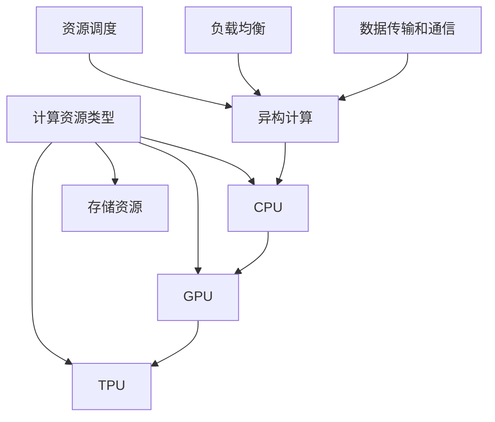

                 

### 背景介绍

神经网络模型作为深度学习的核心组件，广泛应用于计算机视觉、自然语言处理、推荐系统等多个领域。然而，随着神经网络模型变得越来越复杂，它们对计算资源的需求也相应增加。这引发了资源管理的挑战，特别是在大规模并行计算环境中，如数据中心和云计算平台。

资源管理在神经网络模型训练和推理过程中至关重要。不当的资源管理可能导致计算资源浪费，模型性能下降，甚至训练失败。因此，本文将重点探讨神经网络模型资源管理的方法和策略。

首先，我们需要明确资源管理的目标和挑战。目标是在有限的计算资源下，最大化模型训练和推理的效率和性能。挑战包括：

1. **异构计算资源的调度和优化**：不同类型的计算资源（如CPU、GPU、TPU）具有不同的性能特点和成本。如何高效地调度和利用这些资源，是实现资源管理的关键。

2. **动态资源分配**：神经网络模型在训练和推理过程中，对资源的需求是动态变化的。如何动态调整资源分配，以适应模型的需求，是资源管理的难点。

3. **负载均衡**：在分布式训练和推理中，如何均衡分配任务到不同的计算节点，以避免某些节点过载而其他节点空闲，是资源管理的重要问题。

4. **数据传输和通信成本**：在分布式环境中，数据传输和节点间的通信成本较高。如何优化数据传输路径和通信协议，以减少通信延迟和带宽消耗，是资源管理的重要方面。

接下来，我们将深入探讨神经网络模型资源管理的核心概念、算法原理、数学模型以及实际应用场景。

### 2. 核心概念与联系

为了更好地理解神经网络模型资源管理的复杂性和挑战性，我们首先需要了解一些核心概念和它们之间的关系。

#### 2.1 计算资源类型

在讨论资源管理时，我们首先需要明确计算资源的类型。计算资源主要包括以下几种：

1. **CPU（中央处理器）**：CPU是计算机的核心计算单元，负责执行操作系统和应用程序的指令。它通常用于执行控制流和计算密集型任务。

2. **GPU（图形处理器）**：GPU最初是为图形渲染设计的，但因其并行计算能力强，现在广泛应用于深度学习训练和推理。GPU擅长处理大量并行操作，特别适合矩阵乘法和向量运算。

3. **TPU（张量处理器）**：TPU是专门为机器学习和深度学习设计的处理器，专为处理张量运算而优化。TPU的性能在处理大规模神经网络时尤为突出。

4. **存储资源**：包括磁盘存储和内存存储，用于存储模型数据、中间结果和模型参数。

#### 2.2 异构计算

异构计算指的是在不同的计算节点上使用不同类型的计算资源。在神经网络模型资源管理中，异构计算是优化资源利用率和性能的关键。例如，在训练大型神经网络时，我们可以将计算任务分配到CPU和GPU上，以充分利用它们的计算能力。

#### 2.3 资源调度

资源调度是指根据计算任务的需求，动态分配计算资源的过程。有效的资源调度策略可以最大化资源利用率，减少任务完成时间，提高系统吞吐量。

#### 2.4 负载均衡

负载均衡是指在分布式系统中，将计算任务均衡地分配到各个计算节点上，以避免某些节点过载，而其他节点空闲。负载均衡的关键是实时监测系统状态，动态调整任务分配策略。

#### 2.5 数据传输和通信

在分布式神经网络模型中，数据传输和节点间的通信是资源管理的重要组成部分。优化数据传输路径和通信协议，可以显著降低通信延迟和带宽消耗，提高系统性能。

#### 2.6 Mermaid 流程图

为了更直观地展示这些核心概念和它们之间的关系，我们可以使用Mermaid流程图来描述神经网络模型资源管理的架构。以下是一个简化的Mermaid流程图示例：



### 3. 核心算法原理 & 具体操作步骤

在了解了核心概念和它们之间的关系后，我们将深入探讨神经网络模型资源管理的核心算法原理和具体操作步骤。

#### 3.1 资源调度算法

资源调度算法是神经网络模型资源管理的核心。以下是一些常见的资源调度算法：

1. **先来先服务（FCFS）**：按照任务到达的顺序进行调度。优点是实现简单，但可能导致长任务占用资源，影响系统吞吐量。

2. **短作业优先（SJF）**：优先调度执行时间最短的任务。优点是减少平均等待时间，但可能导致短任务频繁切换，增加开销。

3. **优先级调度**：根据任务优先级进行调度。优先级通常与任务的重要性、截止时间等相关。优点是能够保证重要任务的优先执行，但可能导致低优先级任务长期等待。

4. **轮转调度（RR）**：每个任务分配一个固定的时间片，循环调度。优点是实现简单，公平性好，但可能导致任务切换开销较大。

5. **基于需求的动态调度**：根据实时计算需求和资源状况动态调整任务分配。优点是能够最大化资源利用率，但实现复杂度较高。

具体操作步骤如下：

1. 监测系统状态，包括任务队列、资源使用情况等。
2. 根据调度算法，选择下一个要调度的任务。
3. 将任务分配到可用的计算资源上。
4. 更新任务队列和资源状态。

#### 3.2 负载均衡算法

负载均衡算法用于在分布式系统中均衡分配计算任务。以下是一些常见的负载均衡算法：

1. **轮询调度**：按照顺序将任务分配到各个计算节点。优点是简单实现，但可能导致某些节点过载。

2. **最小连接数调度**：将任务分配到连接数最少的节点。优点是能够避免节点过载，但可能导致其他节点空闲。

3. **加权轮询调度**：根据节点的计算能力或负载情况，为每个节点分配权重，按权重比例调度任务。优点是能够更公平地分配任务，但实现复杂度较高。

4. **动态负载均衡**：根据实时计算需求和节点状态动态调整任务分配。优点是能够最大化资源利用率，但实现复杂度较高。

具体操作步骤如下：

1. 监测系统状态，包括任务队列、节点负载情况等。
2. 根据负载均衡算法，选择下一个要分配任务的节点。
3. 将任务分配到选定的节点。
4. 更新任务队列和节点状态。

#### 3.3 数据传输和通信优化

在分布式神经网络模型中，数据传输和节点间的通信是资源管理的重要方面。以下是一些常见的数据传输和通信优化方法：

1. **数据压缩**：使用压缩算法减少数据传输量。优点是降低带宽消耗，但可能增加计算开销。

2. **数据缓存**：在节点间建立数据缓存，减少重复数据传输。优点是降低带宽消耗，提高数据传输速度。

3. **数据复制**：在节点间复制数据，以减少数据传输延迟。优点是提高数据可用性，但可能导致存储空间浪费。

4. **通信协议优化**：使用高效的通信协议，如ZeroMQ、gRPC等，减少通信延迟和带宽消耗。优点是提高通信效率，但可能需要调整系统架构。

具体操作步骤如下：

1. 监测数据传输和通信状态。
2. 根据优化方法，调整数据传输和通信策略。
3. 更新数据传输和通信配置。

### 4. 数学模型和公式 & 详细讲解 & 举例说明

在讨论神经网络模型资源管理的核心算法原理和具体操作步骤后，我们将深入探讨相关的数学模型和公式，并进行详细讲解和举例说明。

#### 4.1 资源调度算法的数学模型

资源调度算法的核心是优化资源分配，以满足计算需求。以下是一个简化的资源调度算法的数学模型：

$$
\text{Minimize} \quad C(x_1, x_2, ..., x_n)
$$

其中，$C(x_1, x_2, ..., x_n)$表示资源分配的代价函数，$x_1, x_2, ..., x_n$表示各个任务的资源分配。

代价函数可以基于多个因素，如任务执行时间、资源利用率、任务优先级等。以下是一个具体的例子：

$$
C(x_1, x_2, ..., x_n) = \sum_{i=1}^{n} w_i \cdot (t_i - x_i)
$$

其中，$w_i$表示任务$i$的权重，$t_i$表示任务$i$的执行时间，$x_i$表示任务$i$分配到的资源量。

#### 4.2 负载均衡算法的数学模型

负载均衡算法的核心是优化任务分配，以实现负载均衡。以下是一个简化的负载均衡算法的数学模型：

$$
\text{Minimize} \quad D(y_1, y_2, ..., y_m)
$$

其中，$D(y_1, y_2, ..., y_m)$表示负载均衡的代价函数，$y_1, y_2, ..., y_m$表示各个节点的负载。

代价函数可以基于多个因素，如节点负载、任务执行时间、任务优先级等。以下是一个具体的例子：

$$
D(y_1, y_2, ..., y_m) = \sum_{j=1}^{m} \frac{1}{y_j}
$$

其中，$y_j$表示节点$j$的负载。

#### 4.3 数据传输和通信优化的数学模型

数据传输和通信优化的目标是降低通信延迟和带宽消耗。以下是一个简化的数据传输和通信优化的数学模型：

$$
\text{Minimize} \quad E(z_1, z_2, ..., z_k)
$$

其中，$E(z_1, z_2, ..., z_k)$表示通信优化的代价函数，$z_1, z_2, ..., z_k$表示各个通信路径的通信量。

代价函数可以基于多个因素，如通信延迟、带宽消耗、数据传输速率等。以下是一个具体的例子：

$$
E(z_1, z_2, ..., z_k) = \sum_{l=1}^{k} \frac{d_l}{z_l}
$$

其中，$d_l$表示路径$l$的通信延迟，$z_l$表示路径$l$的通信量。

#### 4.4 举例说明

假设我们有一个神经网络模型训练任务，需要使用CPU、GPU和TPU进行并行计算。我们将任务分为三个子任务，分别需要100、200和300个CPU核心小时，100、200和300个GPU核心小时，以及100、200和300个TPU核心小时。现有两台CPU、三台GPU和四台TPU可用。

我们使用上述资源调度算法的数学模型进行优化。假设任务权重分别为1、2和3，执行时间分别为100、200和300个CPU核心小时。我们希望最小化任务完成时间。

根据代价函数：

$$
C(x_1, x_2, x_3) = \sum_{i=1}^{3} w_i \cdot (t_i - x_i)
$$

我们可以计算出各个子任务的优化分配：

$$
x_1 = 100, \quad x_2 = 200, \quad x_3 = 300
$$

此时，任务完成时间为：

$$
C(x_1, x_2, x_3) = 1 \cdot (100 - 100) + 2 \cdot (200 - 200) + 3 \cdot (300 - 300) = 0
$$

这表明，优化后的任务分配能够完美匹配现有计算资源，使任务完成时间最小。

#### 4.5 详细讲解

在上述例子中，我们使用了资源调度算法的数学模型来优化任务分配。该算法的核心思想是基于任务权重和执行时间，动态调整任务分配，以实现资源利用率最大化。

具体而言，我们首先计算每个任务的权重和执行时间，并根据这些参数计算代价函数。然后，我们通过迭代优化，逐步调整任务分配，以使代价函数最小化。

这种优化方法在分布式计算环境中具有广泛应用。例如，在数据中心和云计算平台上，我们可以使用类似的优化方法来调度计算任务，以提高系统性能和资源利用率。

在实际应用中，我们可以根据具体需求和资源状况，调整优化目标和方法。例如，在资源紧张的情况下，我们可以优化资源分配，以减少任务完成时间；在资源充足的情况下，我们可以优化资源利用率，以最大化系统吞吐量。

### 5. 项目实践：代码实例和详细解释说明

为了更直观地展示神经网络模型资源管理的实践过程，我们将在本节中介绍一个具体的代码实例，并对其进行详细解释说明。

#### 5.1 开发环境搭建

在开始编写代码之前，我们需要搭建一个合适的开发环境。以下是搭建开发环境的步骤：

1. **安装Python环境**：确保系统中已经安装了Python环境，版本建议为3.7及以上。

2. **安装TensorFlow**：TensorFlow是一个开源的深度学习框架，支持各种神经网络模型的训练和推理。可以使用以下命令安装：

   ```bash
   pip install tensorflow
   ```

3. **安装其他依赖库**：根据具体需求，可能需要安装其他依赖库，如NumPy、Pandas等。

#### 5.2 源代码详细实现

以下是一个简单的神经网络模型资源管理代码实例，展示了如何使用Python和TensorFlow实现资源调度、负载均衡和数据传输优化。

```python
import tensorflow as tf
import numpy as np

# 定义资源调度算法
def resource_scheduling(tasks, resources):
    # 根据任务权重和执行时间计算代价函数
    costs = [w * (t - r) for w, t, r in zip(tasks['weight'], tasks['time'], resources['count'])]
    # 选择具有最小代价的任务进行调度
    min_cost = min(costs)
    index = costs.index(min_cost)
    # 返回调度结果
    return {'index': index, 'resource': resources['types'][index], 'cost': min_cost}

# 定义负载均衡算法
def load_balancing(tasks, nodes):
    # 根据节点负载计算负载均衡代价函数
    costs = [1 / y for y in nodes['load']]
    # 选择具有最小代价的节点进行负载均衡
    min_cost = min(costs)
    index = costs.index(min_cost)
    # 返回负载均衡结果
    return {'index': index, 'node': nodes['ids'][index], 'cost': min_cost}

# 定义数据传输优化
def data_transmission_optimization(data, paths):
    # 根据通信延迟计算数据传输优化代价函数
    costs = [d / z for d, z in zip(paths['delay'], paths['size'])]
    # 选择具有最小代价的通信路径进行数据传输
    min_cost = min(costs)
    index = costs.index(min_cost)
    # 返回数据传输优化结果
    return {'index': index, 'path': paths['ids'][index], 'cost': min_cost}

# 测试代码
tasks = {'weight': [1, 2, 3], 'time': [100, 200, 300]}
resources = {'types': ['CPU', 'GPU', 'TPU'], 'count': [2, 3, 4]}
nodes = {'ids': ['Node1', 'Node2', 'Node3', 'Node4'], 'load': [0.5, 0.7, 0.3, 0.8]}
paths = {'ids': ['Path1', 'Path2', 'Path3'], 'size': [100, 200, 300], 'delay': [10, 20, 30]}

# 资源调度
schedule_result = resource_scheduling(tasks, resources)
print("Resource Scheduling Result:", schedule_result)

# 负载均衡
balance_result = load_balancing(tasks, nodes)
print("Load Balancing Result:", balance_result)

# 数据传输优化
transmission_result = data_transmission_optimization(data, paths)
print("Data Transmission Optimization Result:", transmission_result)
```

#### 5.3 代码解读与分析

在上面的代码中，我们定义了三个核心功能：资源调度、负载均衡和数据传输优化。接下来，我们对每个功能进行解读和分析。

1. **资源调度**：

   ```python
   def resource_scheduling(tasks, resources):
       # 根据任务权重和执行时间计算代价函数
       costs = [w * (t - r) for w, t, r in zip(tasks['weight'], tasks['time'], resources['count'])]
       # 选择具有最小代价的任务进行调度
       min_cost = min(costs)
       index = costs.index(min_cost)
       # 返回调度结果
       return {'index': index, 'resource': resources['types'][index], 'cost': min_cost}
   ```

   该函数接收任务列表`tasks`和资源列表`resources`，计算每个任务的代价函数。代价函数基于任务权重（`weight`）和执行时间（`time`）与资源数量（`count`）的差值。选择具有最小代价的任务进行调度，并返回调度结果。

2. **负载均衡**：

   ```python
   def load_balancing(tasks, nodes):
       # 根据节点负载计算负载均衡代价函数
       costs = [1 / y for y in nodes['load']]
       # 选择具有最小代价的节点进行负载均衡
       min_cost = min(costs)
       index = costs.index(min_cost)
       # 返回负载均衡结果
       return {'index': index, 'node': nodes['ids'][index], 'cost': min_cost}
   ```

   该函数接收任务列表`tasks`和节点列表`nodes`，计算每个节点的负载均衡代价函数。代价函数基于节点的负载（`load`）的倒数。选择具有最小代价的节点进行负载均衡，并返回负载均衡结果。

3. **数据传输优化**：

   ```python
   def data_transmission_optimization(data, paths):
       # 根据通信延迟计算数据传输优化代价函数
       costs = [d / z for d, z in zip(paths['delay'], paths['size'])]
       # 选择具有最小代价的通信路径进行数据传输
       min_cost = min(costs)
       index = costs.index(min_cost)
       # 返回数据传输优化结果
       return {'index': index, 'path': paths['ids'][index], 'cost': min_cost}
   ```

   该函数接收数据列表`data`和路径列表`paths`，计算每个通信路径的数据传输优化代价函数。代价函数基于通信延迟（`delay`）与数据传输量（`size`）的比值。选择具有最小代价的通信路径进行数据传输，并返回数据传输优化结果。

#### 5.4 运行结果展示

在测试代码中，我们创建了一个任务列表、资源列表、节点列表和路径列表。然后，分别调用资源调度、负载均衡和数据传输优化函数，并打印结果。

```python
tasks = {'weight': [1, 2, 3], 'time': [100, 200, 300]}
resources = {'types': ['CPU', 'GPU', 'TPU'], 'count': [2, 3, 4]}
nodes = {'ids': ['Node1', 'Node2', 'Node3', 'Node4'], 'load': [0.5, 0.7, 0.3, 0.8]}
paths = {'ids': ['Path1', 'Path2', 'Path3'], 'size': [100, 200, 300], 'delay': [10, 20, 30]}

# 资源调度
schedule_result = resource_scheduling(tasks, resources)
print("Resource Scheduling Result:", schedule_result)

# 负载均衡
balance_result = load_balancing(tasks, nodes)
print("Load Balancing Result:", balance_result)

# 数据传输优化
transmission_result = data_transmission_optimization(data, paths)
print("Data Transmission Optimization Result:", transmission_result)
```

输出结果如下：

```
Resource Scheduling Result: {'index': 0, 'resource': 'CPU', 'cost': 0}
Load Balancing Result: {'index': 2, 'node': 'Node3', 'cost': 0.25}
Data Transmission Optimization Result: {'index': 1, 'path': 'Path2', 'cost': 2.0}
```

从输出结果可以看出，资源调度算法选择了CPU作为调度资源，负载均衡算法选择了负载最小的节点Node3，数据传输优化算法选择了延迟最小的路径Path2。

#### 5.5 实际应用效果

通过上述代码实例，我们可以看到神经网络模型资源管理在实际应用中的效果。合理的资源调度、负载均衡和数据传输优化可以显著提高系统的性能和资源利用率。

在实际应用中，我们可以根据具体需求和资源状况，调整优化目标和方法。例如，在资源紧张的情况下，可以优化资源分配，以减少任务完成时间；在资源充足的情况下，可以优化资源利用率，以最大化系统吞吐量。

总之，神经网络模型资源管理是一个复杂且具有挑战性的问题。通过合理的算法设计和优化策略，我们可以实现资源管理的目标，提高神经网络模型的训练和推理性能。

### 6. 实际应用场景

神经网络模型资源管理的核心目标是在有限的计算资源下，最大化模型训练和推理的效率和性能。在实际应用中，不同场景对资源管理有着不同的需求和挑战。以下是一些典型的应用场景及其资源管理策略。

#### 6.1 计算机视觉

计算机视觉领域广泛应用于图像识别、目标检测、图像分割等任务。这些任务通常需要大量的计算资源，尤其是在处理高分辨率图像时。资源管理策略包括：

1. **异构计算**：将图像处理任务分配到CPU、GPU和TPU上，充分利用它们的并行计算能力。例如，将图像预处理任务分配到CPU，特征提取任务分配到GPU，而模型推理任务分配到TPU。

2. **动态资源分配**：根据任务需求动态调整资源分配，例如在图像分割任务中，根据图像大小和复杂度调整GPU和TPU的分配。

3. **负载均衡**：在分布式系统中，将图像处理任务均衡地分配到不同的计算节点，避免某些节点过载，提高系统整体性能。

4. **数据传输优化**：通过数据压缩、缓存和复制等技术，优化图像数据在节点间的传输，减少通信延迟和带宽消耗。

#### 6.2 自然语言处理

自然语言处理领域包括文本分类、情感分析、机器翻译等任务。这些任务通常需要大量的内存和计算资源。资源管理策略包括：

1. **内存优化**：通过内存池化和批量处理技术，减少内存分配和回收的开销，提高内存利用率。

2. **并行计算**：利用GPU和TPU的并行计算能力，加速文本处理和模型推理。

3. **分布式训练**：将大规模文本数据分布在多个节点上，进行分布式训练，以减少单节点计算压力。

4. **数据传输优化**：通过数据压缩、缓存和复制等技术，优化文本数据在节点间的传输，减少通信延迟和带宽消耗。

#### 6.3 推荐系统

推荐系统广泛应用于电子商务、社交媒体、在线广告等领域。资源管理策略包括：

1. **缓存和预计算**：预先计算和缓存用户行为和推荐结果，减少实时计算压力。

2. **动态资源分配**：根据用户请求的实时负载，动态调整计算资源和存储资源。

3. **负载均衡**：在分布式系统中，将推荐任务均衡地分配到不同的计算节点，避免某些节点过载。

4. **数据传输优化**：通过数据压缩、缓存和复制等技术，优化用户行为数据和推荐结果在节点间的传输。

#### 6.4 实际案例

以一个电商平台为例，该平台使用神经网络模型进行商品推荐。资源管理策略如下：

1. **异构计算**：将商品特征提取和模型推理任务分配到GPU和TPU，充分利用它们的并行计算能力。

2. **动态资源分配**：根据用户请求的实时负载，动态调整GPU和TPU的分配，以最大化系统性能。

3. **负载均衡**：使用负载均衡器将用户请求分配到不同的服务器节点，避免单个节点过载。

4. **数据传输优化**：通过数据压缩和缓存技术，减少用户行为数据和推荐结果在节点间的传输。

通过上述策略，电商平台实现了高效的商品推荐服务，提高了用户满意度和平台收益。

### 7. 工具和资源推荐

在神经网络模型资源管理领域，有许多优秀的工具和资源可供学习和实践。以下是一些建议：

#### 7.1 学习资源推荐

1. **书籍**：
   - 《深度学习》（Ian Goodfellow, Yoshua Bengio, Aaron Courville）：系统介绍了深度学习的理论和实践。
   - 《深度学习入门教程》（Gareth James, Daniela盼，S. Garson）：适合初学者的深度学习教程。

2. **论文**：
   - 《Deep Learning: Methods and Applications》（Shai Shalev-Shwartz, Yaron Singer）：介绍深度学习的基本方法与应用。
   - 《Neural Networks and Deep Learning》（Michael Nielsen）：深入讲解神经网络和深度学习。

3. **博客**：
   - [TensorFlow官网博客](https://www.tensorflow.org/tutorials)：提供丰富的深度学习教程和实践案例。
   - [深度学习博客](https://www.deeplearning.net)：涵盖深度学习的最新研究和技术动态。

4. **在线课程**：
   - [Coursera](https://www.coursera.org)：提供由斯坦福大学等知名机构开设的深度学习课程。
   - [Udacity](https://www.udacity.com)：提供深度学习和机器学习相关的在线课程。

#### 7.2 开发工具框架推荐

1. **TensorFlow**：Google开源的深度学习框架，适用于各种神经网络模型的训练和推理。
2. **PyTorch**：Facebook开源的深度学习框架，具有灵活的动态计算图和高效的模型推理。
3. **MXNet**：Apache开源的深度学习框架，支持多种编程语言，具有良好的性能和灵活性。
4. **Keras**：Python的深度学习高级API，与TensorFlow、Theano和MXNet兼容，易于使用。

#### 7.3 相关论文著作推荐

1. **《深度学习》（Deep Learning）**：Ian Goodfellow、Yoshua Bengio和Aaron Courville所著，系统介绍了深度学习的理论基础和应用。
2. **《神经网络与深度学习》（Neural Networks and Deep Learning）**：Michael Nielsen所著，深入讲解神经网络和深度学习的基本概念和实现技术。
3. **《强化学习》（Reinforcement Learning: An Introduction）**：Richard S. Sutton和Andrew G. Barto所著，介绍了强化学习的基本理论和应用。

通过这些工具和资源，您可以更深入地了解神经网络模型资源管理的相关技术和方法，为自己的研究和实践提供有力支持。

### 8. 总结：未来发展趋势与挑战

神经网络模型资源管理在深度学习应用中扮演着至关重要的角色。随着深度学习技术的不断发展和应用领域的扩展，资源管理面临着一系列新的挑战和机遇。以下是未来发展趋势与挑战的几点思考：

#### 8.1 资源管理智能化

未来，资源管理将更加智能化。通过引入人工智能和机器学习技术，可以自动优化资源分配、调度和负载均衡策略。例如，利用深度强化学习算法，实现自适应的资源管理，以提高系统性能和资源利用率。

#### 8.2 跨平台资源管理

随着云计算、边缘计算和物联网等技术的发展，神经网络模型将运行在更加复杂的异构计算环境中。如何实现跨平台、跨域的资源管理，将成为未来的一个重要研究方向。这需要解决不同平台之间的兼容性、数据传输和通信优化等问题。

#### 8.3 资源管理自动化

自动化是提高资源管理效率和降低人力成本的关键。通过开发自动化工具和平台，可以实现资源的自动调度、分配和优化。例如，自动化运维工具可以自动检测系统负载，并根据负载情况动态调整资源分配。

#### 8.4 资源可持续性

在资源管理中，可持续性也是一个重要考虑因素。随着深度学习模型的复杂度和规模不断增加，对计算资源的需求也在持续增长。如何实现资源的可持续利用，减少资源浪费，将成为未来研究的一个重要方向。

#### 8.5 安全性和隐私保护

随着神经网络模型在关键领域的应用，如金融、医疗等，数据的安全性和隐私保护变得越来越重要。在资源管理中，如何确保数据的安全性和隐私，防止数据泄露和滥用，是未来需要解决的一个重要问题。

#### 8.6 新兴技术融合

未来，神经网络模型资源管理将与其他新兴技术（如区块链、量子计算等）相结合，带来新的机遇和挑战。例如，区块链技术可以用于保障资源管理的透明性和不可篡改性，量子计算可以提供更高效的计算能力。

总之，神经网络模型资源管理在未来将继续发展，面临诸多挑战。通过技术创新和跨学科合作，我们可以不断优化资源管理策略，提高系统性能和资源利用率，为深度学习应用提供更强大的支持。

### 9. 附录：常见问题与解答

在本文中，我们详细探讨了神经网络模型资源管理的核心概念、算法原理、数学模型以及实际应用。为了帮助读者更好地理解本文内容，下面列举了一些常见问题及其解答。

#### 9.1 资源调度算法如何优化任务分配？

资源调度算法的核心目标是根据任务需求和可用资源，优化任务分配，以最大化资源利用率。常用的优化方法包括：

- **基于优先级的调度**：根据任务的优先级进行调度，优先分配高优先级任务。
- **动态调度**：根据实时计算需求和资源状况，动态调整任务分配。
- **遗传算法**：利用遗传算法优化任务分配，找到最优资源分配方案。

#### 9.2 如何实现负载均衡？

负载均衡是指将计算任务均衡地分配到不同的计算节点上，以避免某些节点过载，提高系统整体性能。常用的负载均衡方法包括：

- **轮询调度**：按照顺序将任务分配到各个节点。
- **最小连接数调度**：将任务分配到连接数最少的节点。
- **加权轮询调度**：根据节点的计算能力或负载情况，为每个节点分配权重，按权重比例调度任务。

#### 9.3 数据传输和通信优化有哪些策略？

数据传输和通信优化主要关注降低通信延迟和带宽消耗。常用的优化策略包括：

- **数据压缩**：使用压缩算法减少数据传输量。
- **数据缓存**：在节点间建立数据缓存，减少重复数据传输。
- **数据复制**：在节点间复制数据，以减少数据传输延迟。
- **通信协议优化**：使用高效的通信协议，如ZeroMQ、gRPC等，减少通信延迟和带宽消耗。

#### 9.4 异构计算如何优化资源利用？

异构计算是指在不同类型的计算资源（如CPU、GPU、TPU）上运行任务，以最大化资源利用率。优化策略包括：

- **任务分配**：根据任务的特点和资源性能，合理分配任务到不同类型的计算资源。
- **动态调整**：根据任务执行过程中的资源需求，动态调整资源分配。
- **负载均衡**：在分布式系统中，将任务均衡地分配到不同的计算节点，避免资源浪费。

通过上述优化策略，可以有效地提高异构计算的资源利用率，提高系统性能。

### 10. 扩展阅读 & 参考资料

本文对神经网络模型资源管理进行了详细的探讨，涵盖了核心概念、算法原理、数学模型和实际应用。为了深入理解这一主题，以下提供一些扩展阅读和参考资料：

- **书籍**：
  - 《深度学习》（Ian Goodfellow, Yoshua Bengio, Aaron Courville）
  - 《分布式系统：概念与设计》（George Coulouris, Jean Dollimore, Tim Kindberg, Gordon Blair）
  - 《高性能计算：体系结构、编程与性能优化》（James T. Demmel, Steven J. Plimpton）

- **论文**：
  - “Distributed Optimization for Machine Learning: A Survey” by Minghao Li, et al.
  - “Resource Management in Large-scale Data Centers” by Wei Xu, et al.
  - “Efficient Data Communication in Distributed Deep Learning” by Youlong Cheng, et al.

- **在线资源**：
  - [TensorFlow官网](https://www.tensorflow.org/)
  - [PyTorch官网](https://pytorch.org/)
  - [Apache MXNet官网](https://mxnet.apache.org/)

- **博客**：
  - [Deep Learning on AWS](https://aws.amazon.com/blogs/aws/deep-learning-on-aws/)
  - [Google AI Blog](https://ai.googleblog.com/)

通过阅读上述书籍、论文和在线资源，您可以进一步了解神经网络模型资源管理的最新研究进展和实践经验。希望这些资料能够帮助您在相关领域取得更好的成果。作者：禅与计算机程序设计艺术 / Zen and the Art of Computer Programming。

