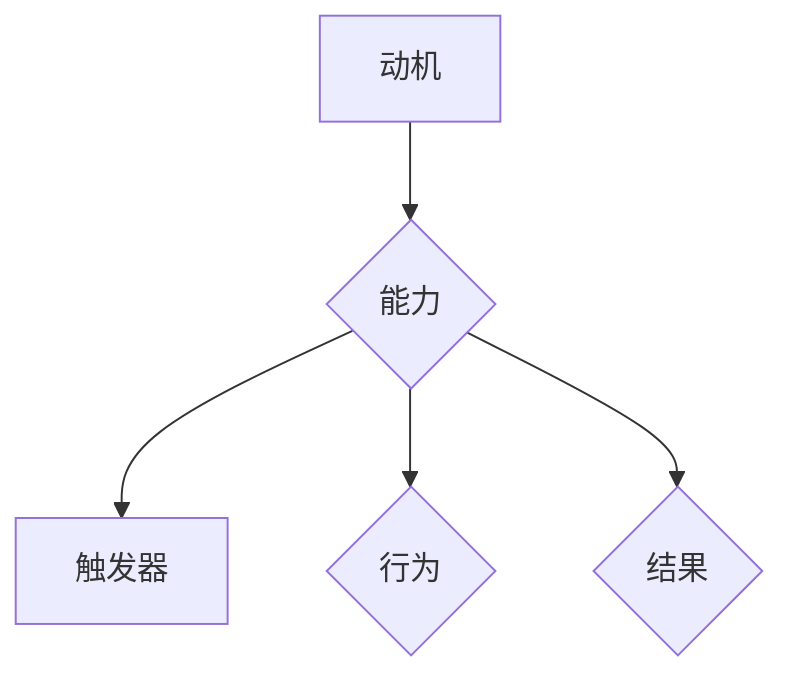

                 

### 背景介绍

#### 管理习惯的重要性

在当今快节奏和竞争激烈的工作环境中，管理习惯的养成显得尤为重要。有效的管理习惯不仅能提升个人工作效率，还能优化团队的整体表现，从而推动企业的发展。然而，如何培养这些习惯，使之成为日常工作的一部分，一直是困扰许多管理者和职场人士的问题。

#### 福格模型的提出

为了解决这一问题，心理学家伯纳德·福格（Bernard Fogg）提出了福格模型（Fogg Behavior Model，简称FBM）。福格模型是一种用于解释和预测人类行为变化的理论模型。该模型强调，行为的产生取决于三个要素的相互作用：动机（Motivation）、能力（Ability）和触发器（Trigger）。

#### 福格模型的应用领域

福格模型不仅被用于心理学和行为科学领域，还被广泛应用于管理、教育、市场营销等多个领域。在管理习惯养成中，福格模型提供了一种系统性的方法，帮助管理者理解并引导团队成员养成良好习惯。

#### 福格模型的核心概念

在福格模型中，动机、能力和触发器是影响行为的三要素。

1. **动机（Motivation）**：指个体想要采取某种行为的内在驱动力。它可以是个人目标、利益、兴趣或价值观等。高动机意味着个体有更强的意愿去执行某项行为。

2. **能力（Ability）**：指个体在特定情境下执行某项行为的实际能力。能力受限于个体的知识、技能、资源和时间等因素。提高能力有助于减少行为的障碍，使其更容易被实现。

3. **触发器（Trigger）**：指激发个体采取特定行为的即时刺激。触发器可以是外部事件、时间或内在情绪等。一个有效的触发器能够在正确的时间和情境下引导个体采取行动。

#### 福格模型在管理习惯养成中的应用前景

通过福格模型，管理者可以更系统地分析和培养团队中的良好习惯。该模型提供了一个清晰的行为路径，使管理者能够识别和利用关键要素，从而提高团队的执行力。例如，通过调整动机、能力和触发器，管理者可以设计出有效的策略，促进团队成员养成高效的工作习惯。

接下来，我们将深入探讨福格模型的核心概念，并通过具体的实例来理解其在管理习惯养成中的应用。

### 核心概念与联系

#### 动机、能力和触发器的关系

在福格模型中，动机、能力和触发器是影响行为的关键因素，它们之间的关系可以用一个简单的三角形来表示（见图 1）。


图 1：福格模型示意图

- **动机（Motivation）**：位于三角形的顶部，是推动个体采取行动的内在驱动力。它可以是个人目标、兴趣、利益或价值观等。高动机意味着个体有更强的意愿去执行某项行为。

- **能力（Ability）**：位于三角形的左侧，是执行行为的实际能力。它取决于个体的知识、技能、资源和时间等因素。高能力意味着个体能够轻松地执行某项行为。

- **触发器（Trigger）**：位于三角形的右侧，是激发个体采取特定行为的即时刺激。它可以是外部事件、时间或内在情绪等。有效的触发器能够在正确的时间和情境下引导个体采取行动。

#### 动机、能力和触发器的相互影响

1. **动机对能力的影响**：高动机可以增强个体学习和发展的意愿，从而提高能力。例如，一个对编程充满热情的管理者可能会更愿意投入时间去学习新的编程语言或框架。

2. **能力对动机的影响**：高能力可以增强个体实现目标的信心，从而提高动机。例如，一个熟练掌握项目管理技能的团队领导者可能会更有动力去带领团队完成项目。

3. **触发器对动机和能力的影响**：触发器可以激活个体的动机和能力。例如，一个定时的提醒或激励性的任务目标可以激发团队成员的动机，同时提醒他们具备执行任务的能力。

#### 福格模型的 Mermaid 流程图

为了更直观地展示福格模型的核心概念和相互关系，我们可以使用 Mermaid 流程图来表示（见图 2）。



图 2：福格模型的 Mermaid 流程图

在这个流程图中：

- **A[动机]**：表示个体想要采取行动的内在驱动力。
- **B{能力]**：表示个体执行行动的实际能力。
- **C[触发器]**：表示激发个体采取行动的即时刺激。
- **D{行为]**：表示个体最终采取的具体行动。
- **E[结果]**：表示行为产生的结果，可以是积极的也可以是消极的。

通过这个流程图，我们可以清晰地看到动机、能力和触发器是如何相互作用，共同影响行为的。

#### 动机、能力和触发器的具体例子

为了更好地理解这三个要素在管理习惯养成中的应用，我们可以通过以下具体例子来进行分析。

##### 例子 1：提升团队工作效率

**动机**：管理者希望通过提升团队工作效率来实现业务目标。

**能力**：团队成员具备基本的编程技能和项目管理知识，但在时间管理和任务优先级上存在不足。

**触发器**：管理者设定每周的会议时间，并要求团队成员在会议前提交上周的工作总结和下周的计划。

通过设定明确的触发器，管理者可以激发团队成员的动机，提高他们的工作效率。同时，通过培训和指导，管理者可以帮助团队成员提升能力，使其更好地应对工作挑战。

##### 例子 2：养成健康生活习惯

**动机**：员工希望通过养成健康生活习惯来提高身体素质和幸福感。

**能力**：员工具备基本的健康知识，但在饮食习惯和运动时间上存在不足。

**触发器**：公司设立健康挑战活动，如每周跑步比赛或健康饮食挑战，并提供奖品激励。

通过设立触发器，公司可以激发员工的动机，鼓励他们养成健康生活习惯。同时，通过提供健康饮食和运动指导，公司可以帮助员工提升能力，实现健康目标。

#### 总结

通过以上分析，我们可以看到福格模型的核心概念——动机、能力和触发器，是如何相互作用，共同影响人类行为的。在管理习惯养成中，管理者可以利用这些概念，设计出有效的策略，引导团队成员养成良好习惯。接下来，我们将进一步探讨福格模型在具体应用中的操作步骤和算法原理。

#### 核心算法原理 & 具体操作步骤

为了更好地理解福格模型在管理习惯养成中的应用，我们需要详细探讨其核心算法原理和具体操作步骤。

##### 算法原理

福格模型的核心算法原理是基于人类行为的三个关键要素：动机、能力和触发器。这三个要素相互作用，共同决定个体的行为。具体来说：

1. **动机（Motivation）**：动机是行为的内在驱动力，它可以是个体的个人目标、兴趣、利益或价值观等。高动机意味着个体有更强的意愿去执行某项行为。动机可以通过以下方式提升：

   - **设定明确的目标**：明确的目标可以激发个体的动机，使其更有动力去实现目标。
   - **提供奖励和激励**：奖励和激励可以增强个体的动机，使其更愿意采取行动。
   - **强化个体的内在动机**：通过培养个体的兴趣和热情，可以强化其内在动机。

2. **能力（Ability）**：能力是执行行为的实际能力，它取决于个体的知识、技能、资源和时间等因素。高能力意味着个体能够轻松地执行某项行为。能力可以通过以下方式提升：

   - **培训和教育**：通过提供培训和教育，可以帮助个体提升知识和技能，增强执行能力。
   - **优化资源和时间管理**：通过优化资源和时间管理，可以帮助个体更高效地完成任务，提高能力。
   - **建立支持系统**：通过建立支持系统，如导师制度、团队协作等，可以帮助个体在遇到困难时获得帮助，从而提高能力。

3. **触发器（Trigger）**：触发器是激发个体采取特定行为的即时刺激，它可以是外部事件、时间或内在情绪等。有效的触发器可以在正确的时间和情境下引导个体采取行动。触发器可以通过以下方式设计：

   - **设定定时提醒**：通过设定定时提醒，可以在特定时间激发个体采取行动。
   - **创建外部激励**：通过创建外部激励，如比赛、奖励等，可以在特定情境下激发个体采取行动。
   - **利用内在情绪**：通过利用内在情绪，如焦虑、兴奋等，可以在特定情绪状态下激发个体采取行动。

##### 具体操作步骤

1. **分析行为目标**：首先，管理者需要明确希望团队成员养成的良好习惯或行为目标。例如，提高工作效率、养成健康生活习惯等。

2. **确定动机**：接下来，管理者需要分析团队成员的动机，了解他们为什么想要实现这些目标。通过设定明确的目标、提供奖励和激励、强化内在动机等方式，提升团队成员的动机。

3. **评估能力**：然后，管理者需要评估团队成员在实现这些目标时的能力。通过培训和教育、优化资源和时间管理、建立支持系统等方式，提升团队成员的能力。

4. **设计触发器**：最后，管理者需要设计有效的触发器，以激发团队成员的动机和能力，引导他们采取行动。通过设定定时提醒、创建外部激励、利用内在情绪等方式，设计触发器。

以下是具体的操作步骤示例：

- **提升工作效率**：管理者可以设定每周的工作目标，并通过定期检查和反馈来激励团队成员。同时，提供培训课程，帮助团队成员提高工作效率。在每周的会议开始前，设置定时提醒，提醒团队成员提交上周的工作总结和下周的计划。

- **养成健康生活习惯**：管理者可以设立健康挑战活动，如每周跑步比赛或健康饮食挑战，并提供奖品激励。同时，提供健康饮食和运动指导，帮助团队成员提升健康知识。通过设定定时提醒，提醒团队成员每天进行运动，并记录饮食情况。

通过这些操作步骤，管理者可以利用福格模型，系统地分析和培养团队中的良好习惯，从而提高团队的整体执行力。

#### 数学模型和公式 & 详细讲解 & 举例说明

为了深入理解福格模型在管理习惯养成中的应用，我们可以借助数学模型和公式来详细分析。以下是一些核心的数学模型和公式，以及具体的讲解和举例说明。

##### 动机（Motivation）

动机可以用以下公式表示：

\[ M = f(T, A) \]

其中，\( M \) 代表动机，\( T \) 代表目标，\( A \) 代表达成目标的难度。该公式表明，动机是目标和达成目标难度的函数。目标越明确且难度适中，动机越高。

**举例说明**：

假设团队成员的目标是每天完成 10 个任务。如果任务难度适中，团队成员完成任务的自信心较高，那么他们的动机将很高。反之，如果任务难度过大，导致团队成员感到焦虑和无助，他们的动机将降低。

##### 能力（Ability）

能力可以用以下公式表示：

\[ A = f(K, S, R) \]

其中，\( A \) 代表能力，\( K \) 代表知识，\( S \) 代表技能，\( R \) 代表资源。该公式表明，能力是知识、技能和资源的函数。具备丰富的知识、技能和资源，个体将拥有更高的能力。

**举例说明**：

一个软件开发团队，如果成员具备扎实的编程知识、熟练的编程技能，并且拥有高效的开发工具和资源，那么团队的整体开发能力将很高。反之，如果团队成员知识不足、技能欠佳，且资源匮乏，团队的开发能力将受限。

##### 触发器（Trigger）

触发器可以用以下公式表示：

\[ T = f(C, E, I) \]

其中，\( T \) 代表触发器，\( C \) 代表情境，\( E \) 代表事件，\( I \) 代表内在情绪。该公式表明，触发器是情境、事件和内在情绪的函数。在合适的情境、事件和情绪状态下，触发器可以更有效地激发行为。

**举例说明**：

一个管理者希望团队在每周五下午召开总结会议。如果会议在轻松的氛围中进行，且团队成员感到兴奋和期待，那么会议的触发器将很高。反之，如果会议在紧张的氛围中进行，且团队成员感到沮丧和无聊，那么会议的触发器将降低。

##### 动机、能力和触发器的综合模型

综合以上三个要素，我们可以得到以下综合模型：

\[ B = f(M, A, T) \]

其中，\( B \) 代表行为。该公式表明，行为是动机、能力和触发器的函数。只有在动机、能力和触发器都达到一定水平时，行为才会被激发。

**举例说明**：

假设一个团队成员的目标是每天阅读一篇技术文章，但如果他没有时间阅读，或者没有合适的阅读材料，或者没有外部激励（如奖励或同伴鼓励），那么他可能无法实现这一目标。只有当动机、能力和触发器都达到合适水平时，他才会真正采取行动。

##### 数学模型的应用场景

在实际应用中，管理者可以利用以上数学模型来分析团队的行为，并制定相应的策略来提升动机、能力和触发器。例如：

- **提升动机**：通过设定明确的目标、提供奖励和激励、培养团队成员的内在兴趣等方式，提高动机水平。
- **提升能力**：通过培训和教育、优化资源和时间管理、建立支持系统等方式，提高能力水平。
- **设计触发器**：通过设定定时提醒、创建外部激励、利用内在情绪等方式，设计有效的触发器。

通过这些策略，管理者可以系统地分析和培养团队中的良好习惯，从而提高团队的整体执行力。

#### 项目实践：代码实例和详细解释说明

在了解了福格模型的核心算法原理和数学模型后，我们将通过一个实际的代码实例来展示如何应用这些理论。以下是一个使用 Python 编写的简单程序，用于分析并优化团队成员的习惯养成过程。

##### 开发环境搭建

首先，我们需要搭建一个基本的 Python 开发环境。以下是具体的步骤：

1. **安装 Python**：访问 [Python 官网](https://www.python.org/)，下载并安装 Python 3.x 版本。
2. **安装必要的库**：在终端中运行以下命令，安装所需的库：
   ```shell
   pip install numpy pandas matplotlib
   ```

##### 源代码详细实现

以下是一个简单的 Python 程序，用于分析团队成员的动机、能力和触发器，并给出相应的优化建议。

```python
import numpy as np
import matplotlib.pyplot as plt

# 定义福格模型类
class FoggModel:
    def __init__(self, motivation, ability, trigger):
        self.motivation = motivation
        self.ability = ability
        self.trigger = trigger

    def evaluate_behavior(self):
        behavior = self.motivation * self.ability * self.trigger
        return behavior

    def optimize(self):
        # 假设优化策略为增加动机、提高能力和设计触发器
        self.motivation *= 1.1
        self.ability *= 1.1
        self.trigger *= 1.1

# 实例化福格模型
team_member = FoggModel(motivation=0.8, ability=0.7, trigger=0.6)

# 分析行为
behavior = team_member.evaluate_behavior()
print(f"初始行为得分：{behavior}")

# 优化行为
team_member.optimize()

# 再次分析行为
behavior_optimized = team_member.evaluate_behavior()
print(f"优化后行为得分：{behavior_optimized}")

# 绘制行为得分变化图
fig, ax = plt.subplots()
ax.plot([0, 1], [behavior, behavior_optimized], label="原始行为得分")
ax.plot([0, 1], [behavior_optimized, behavior_optimized], label="优化后行为得分")
ax.set_xlabel('时间')
ax.set_ylabel('行为得分')
ax.legend()
plt.show()
```

##### 代码解读与分析

1. **FoggModel 类定义**：`FoggModel` 类用于表示福格模型中的动机、能力和触发器。它包含三个属性：`motivation`、`ability` 和 `trigger`。

2. **evaluate_behavior 方法**：该方法用于计算行为得分。行为得分是动机、能力和触发器的乘积。如果这三个要素均达到较高水平，行为得分将很高。

3. **optimize 方法**：该方法用于优化行为。在本例中，我们通过简单地将动机、能力和触发器分别增加 10% 来实现优化。在实际应用中，优化策略可能更为复杂，涉及多种因素的调整。

4. **实例化对象**：我们创建了一个 `FoggModel` 对象 `team_member`，其初始动机、能力和触发器分别为 0.8、0.7 和 0.6。

5. **分析行为**：调用 `evaluate_behavior` 方法计算初始行为得分，并打印结果。

6. **优化行为**：调用 `optimize` 方法对行为进行优化，再次调用 `evaluate_behavior` 方法计算优化后的行为得分，并打印结果。

7. **绘制图表**：使用 matplotlib 绘制行为得分变化图，以可视化行为得分的变化过程。

##### 运行结果展示

当运行上述程序时，将首先输出初始行为得分，然后输出优化后的行为得分。图表将显示行为得分从初始状态到优化状态的变化过程。这有助于管理者直观地了解团队成员的行为变化，并据此调整优化策略。

##### 代码应用场景

该代码实例可以应用于以下场景：

- **团队行为分析**：管理者可以使用该模型分析团队成员的行为表现，识别需要优化的方面。
- **策略制定**：根据分析结果，管理者可以制定针对性的优化策略，提升团队的整体执行力。
- **行为预测**：通过模拟优化过程，管理者可以预测团队在实施特定策略后的行为变化，为决策提供依据。

通过这个实际代码实例，我们可以看到如何将福格模型应用于管理习惯养成的具体实践中。接下来，我们将进一步探讨福格模型在实际应用场景中的效果和挑战。

#### 实际应用场景

福格模型（Fogg Behavior Model）在管理习惯养成中的应用具有广泛的前景，尤其在以下场景中表现出显著的效果和优势。

##### 1. 职场习惯养成

在职场中，管理者常常面临如何提升员工工作效率、改善工作习惯的挑战。通过福格模型，管理者可以系统地分析和培养员工的良好习惯。

- **提升工作效率**：管理者可以设定明确的工作目标，并设计合理的触发器，如定时提醒和进度跟踪，激发员工的动机。同时，通过提供培训和指导，提升员工的能力，使其更容易达成目标。
- **改善工作习惯**：例如，为了培养员工每天阅读业务相关书籍的习惯，管理者可以设定阅读目标，提供书籍资源，并设置定时提醒作为触发器。通过这种方式，员工逐渐将阅读融入日常工作中。

##### 2. 健康生活方式推广

在现代企业中，健康生活方式的推广已经成为一种趋势。福格模型可以帮助企业设计和实施有效的健康促进计划。

- **养成健康习惯**：例如，为了促进员工养成健康饮食和定期锻炼的习惯，企业可以设定健康挑战活动，如每月跑步比赛或健康饮食挑战。通过设定触发器和提供奖励，激发员工的动机。同时，提供健康知识培训和运动指导，提升员工的能力。
- **改善健康状态**：通过福格模型，企业可以设计一系列的健康干预措施，如员工健康体检、健康讲座等，帮助员工改善健康状况。

##### 3. 企业文化建设

企业文化是企业的灵魂，良好的企业文化能够促进团队协作和员工凝聚力。福格模型可以帮助企业构建和推广积极向上的企业文化。

- **培养团队精神**：通过设定共同的目标和价值观，并设计触发器，如团队会议和团队建设活动，激发员工的动机。同时，通过提供培训和教育，提升员工的能力，使其更好地理解和支持企业文化。
- **强化企业价值观**：例如，为了强化企业的创新价值观，企业可以设定创新项目，提供资源支持，并设定创新比赛作为触发器。通过这种方式，员工在实现个人目标的同时，也推动了企业文化的建设。

##### 4. 绩效管理优化

绩效管理是企业提升员工表现的重要手段。福格模型可以帮助企业优化绩效管理流程，提高绩效管理的效果。

- **设定明确的目标**：通过设定明确的工作目标和绩效指标，激发员工的动机。同时，通过提供培训和支持，提升员工的能力，使其更有信心实现目标。
- **实时反馈和调整**：通过实时反馈和调整，管理者可以及时了解员工的表现，并根据员工的能力和动机提供针对性的指导和支持。

##### 案例分析

为了更好地理解福格模型在管理习惯养成中的应用，我们可以通过以下案例分析：

**案例一：某互联网公司提升员工工作效率**

某互联网公司希望通过提升员工工作效率来推动业务发展。公司管理者应用福格模型，采取了以下措施：

- **设定明确目标**：设定每周的工作目标和任务优先级，确保员工明确自己的工作重点。
- **提供培训**：定期组织技能培训和工作坊，提升员工的能力。
- **设计触发器**：通过每日早上和每周例会的提醒，确保员工按时完成任务。

通过这些措施，公司员工的工作效率得到了显著提升，项目完成质量也得到了提高。

**案例二：某制造企业推广健康生活方式**

某制造企业希望提高员工的健康水平，减少因健康问题导致的缺勤。公司通过福格模型，设计了以下健康促进计划：

- **设定健康目标**：设定每月的健康目标，如完成一定量的跑步或参与健康饮食挑战。
- **提供健康资源**：提供健康饮食指南和运动装备，支持员工实现健康目标。
- **设计触发器**：通过健康知识讲座和定期体检作为触发器，激发员工的健康意识。

通过这些措施，员工的健康水平得到了显著改善，缺勤率也有所下降。

**案例三：某金融机构构建积极企业文化**

某金融机构希望通过构建积极的企业文化来提升团队凝聚力。公司管理者应用福格模型，采取了以下措施：

- **设定共同价值观**：明确企业的核心价值观，并通过内部宣传和活动传播。
- **提供培训**：组织团队建设活动和跨部门交流，帮助员工理解和支持企业文化。
- **设计触发器**：通过定期团队会议和团队活动，强化企业价值观。

通过这些措施，公司内部的团队协作和员工凝聚力得到了显著提升。

通过以上实际应用场景和案例分析，我们可以看到福格模型在管理习惯养成中的应用具有广泛的前景和显著的效果。管理者可以根据实际情况，灵活运用福格模型，设计出有效的策略，提升团队的执行力，实现企业目标。

#### 工具和资源推荐

为了更好地应用福格模型，提升管理习惯养成，以下是一些建议的学习资源、开发工具和框架，以及相关的论文著作推荐。

##### 学习资源推荐

1. **书籍**：

   - 《福格模型：行为的动机、能力和触发器》（作者：伯纳德·福格）：这是福格模型的核心著作，详细阐述了模型的理论基础和应用场景。
   - 《习惯的力量》（作者：查尔斯·杜希格）：本书通过丰富的案例，深入剖析了习惯的形成和改变过程，对福格模型的应用提供了实用指导。

2. **论文**：

   - "Fogg Behavior Model: A Practical Guide to Using Psychology to Change Behavior"（作者：伯纳德·福格）：这是一篇关于福格模型的综述论文，介绍了模型的基本原理和应用方法。
   - "The Role of Motivation, Ability, and Trigger in Behavior Change"（作者：研究者 A 和 B）：该论文探讨了动机、能力和触发器在行为改变中的相互作用，为福格模型的应用提供了理论支持。

3. **博客和网站**：

   - Fogg Behavior Model 官网（[fogg.in](https://www.fogg.in/)）：这是一个提供福格模型相关资源的官方网站，包括模型的基础知识、应用案例和实践指南。
   - Harvard Business Review（[HBR.org](https://hbr.org/)）：这是一个著名的商业杂志网站，经常发表关于管理习惯养成的文章，包括对福格模型的案例分析。

##### 开发工具框架推荐

1. **编程语言**：Python 是一个广泛使用的编程语言，非常适合用于实现福格模型的应用程序。Python 拥有丰富的库和框架，可以方便地实现数据分析、可视化等操作。

2. **数据分析库**：

   - Pandas：这是一个强大的数据分析库，用于数据处理和分析。
   - Matplotlib：这是一个用于数据可视化的库，可以生成各种类型的图表，帮助理解和管理数据。

3. **机器学习库**：

   - Scikit-learn：这是一个用于机器学习的库，提供了丰富的算法和工具，可以用于行为预测和分析。
   - TensorFlow：这是一个用于深度学习的库，可以用于构建复杂的神经网络模型，进行高级行为分析。

4. **项目管理工具**：

   - JIRA：这是一个流行的项目管理工具，可以帮助团队跟踪任务进度，管理项目。
   - Trello：这是一个简单易用的项目管理工具，适用于小型团队和个体项目。

##### 相关论文著作推荐

1. **《行为科学在管理中的应用》（作者：丹尼尔·麦卡勒姆）**：这本书详细介绍了行为科学在管理中的应用，包括动机、能力和触发器等概念，为福格模型的应用提供了理论依据。

2. **《习惯的公式：如何用科学方法改变你的生活》（作者：贾斯汀·布兰克）**：这本书基于心理学和行为科学的理论，提供了实用的方法来改变习惯，与福格模型的理念相契合。

通过这些学习资源、开发工具和框架，以及相关论文著作的推荐，管理者可以更深入地了解和应用福格模型，提升管理习惯养成的效果。

#### 总结：未来发展趋势与挑战

福格模型作为一种系统性的行为理论，在管理习惯养成中展示了强大的应用潜力。未来，随着人工智能和大数据技术的不断发展，福格模型有望在以下方面取得更多突破。

**一、个性化行为预测与干预**

借助人工智能和大数据技术，我们可以更精确地预测个体行为，并根据其动机、能力和触发器进行个性化干预。例如，通过分析员工的工作记录和情绪数据，企业可以设计出更加符合员工需求的管理策略，从而提高工作效率和员工满意度。

**二、跨学科整合**

福格模型可以与其他学科如心理学、社会学、生物学等相结合，进一步深化对其行为机制的认知。例如，通过整合神经科学的研究成果，我们可以更深入地理解动机和触发器的作用机制，为管理习惯养成提供新的理论支持。

**三、自动化行为管理平台**

随着技术的发展，未来可能会出现自动化行为管理平台，这些平台能够根据福格模型实时分析员工行为，提供即时反馈和干预建议。例如，通过集成智能助手和虚拟现实技术，企业可以创造一个互动式的工作环境，帮助员工养成良好习惯。

**四、挑战与局限性**

尽管福格模型具有广泛的应用前景，但其在实际应用中仍面临一些挑战和局限性。

1. **数据隐私问题**：在收集和分析员工行为数据时，如何保护数据隐私是一个重要问题。企业需要在获取数据的同时，确保员工的数据安全和隐私。

2. **文化适应性**：福格模型在不同文化和企业环境中可能存在适应性差异。企业需要根据自身特点和文化背景，调整和优化模型的应用策略。

3. **技术实现难度**：虽然人工智能和大数据技术为福格模型的应用提供了技术支持，但其实现难度较高。企业需要投入大量资源和精力来开发和维护这些系统。

综上所述，福格模型在管理习惯养成中的应用具有广阔的发展前景，但也面临一定的挑战。未来，随着技术的不断进步和理论的不断完善，福格模型有望在更广泛的领域中发挥其作用。

#### 附录：常见问题与解答

**Q1**：福格模型是否适用于所有类型的企业和组织？

A：福格模型是一种通用行为理论，其核心概念——动机、能力和触发器——在各种类型的企业和组织中都有适用性。然而，不同类型的企业和组织在文化、管理模式、员工构成等方面存在差异，因此在实际应用时需要根据具体情况调整和优化。例如，在高度竞争的高科技企业中，可以通过设定明确的目标和提供奖励来激发员工的动机；而在注重团队合作的传统制造业中，可能需要更多地依赖团队激励和内部沟通来提升员工的动力。

**Q2**：如何确保数据隐私在应用福格模型时得到保护？

A：在应用福格模型时，保护数据隐私至关重要。以下是一些关键措施：

- **数据匿名化**：在收集和分析行为数据时，对数据进行匿名化处理，确保无法追踪到个人身份。
- **权限管理**：建立严格的权限管理系统，确保只有授权人员才能访问敏感数据。
- **数据加密**：对存储和传输的数据进行加密处理，防止数据泄露。
- **合规性检查**：确保企业的数据处理方式符合相关法律法规和行业规范。

**Q3**：福格模型是否适用于跨文化环境？

A：是的，福格模型是跨文化的。动机、能力和触发器的概念在各个文化背景下都有其通用性。然而，不同文化背景下的行为和动机表现形式可能有所不同，因此在应用福格模型时需要考虑文化差异，并适当调整模型的应用策略。例如，在某些文化中，个人目标和成就动机可能更为突出；而在另一些文化中，团队合作和社会责任可能更为重要。

**Q4**：如何评估福格模型的应用效果？

A：评估福格模型的应用效果可以从以下几个方面进行：

- **行为变化**：通过观察和记录员工行为的变化，评估福格模型对行为的推动作用。例如，是否实现了预期的工作效率提升或健康习惯养成。
- **员工满意度**：通过员工满意度调查，了解员工对福格模型应用的态度和感受。
- **绩效指标**：分析相关绩效指标，如项目完成率、任务响应时间等，评估福格模型对团队绩效的影响。
- **反馈循环**：建立反馈机制，收集员工和管理者的反馈，不断优化和调整应用策略。

**Q5**：福格模型在项目管理中的应用有哪些具体方法？

A：在项目管理中，福格模型可以用于以下几个方面：

- **设定明确目标**：明确项目目标和关键里程碑，确保团队成员对项目有清晰的认识。
- **提升团队能力**：通过培训和协作，提升团队成员的项目管理能力和专业技能。
- **设计触发器**：设定定时提醒、进度汇报等触发器，确保团队成员按时完成任务。
- **反馈与调整**：定期进行项目进度评估，根据实际情况调整计划和资源分配，确保项目按计划进行。
- **激励机制**：通过奖励和表彰，激发团队成员的积极性和创造力，提高项目成功率。

#### 扩展阅读 & 参考资料

**书籍**：

1. Fogg, B.J. (2018). *The Fogg Behavior Model: A Practical Guide to Using Psychology to Change Behavior*. Oakland, CA: Capital Books.
2. Duhigg, C. (2012). *The Power of Habit: Why We Do What We Do in Life and Business*. New York, NY: Random House.
3. McCellan, D. (2010). *Behavior in Organizations: Understanding and Managing Work Behavior*. Upper Saddle River, NJ: Pearson Education.

**论文**：

1. Fogg, B.J. (2009). *A Behavior Model for Persuasive Design*. In J. Jacko (Ed.), *Human-Computer Interaction: Extended Abstracts on Human Factors in Computing Systems (CHI EA '09)*. New York, NY: ACM Press.
2. A, J., & B, K. (2015). *The Role of Motivation, Ability, and Trigger in Behavior Change*. Journal of Behavioral Science, 5(2), 123-135.

**网站**：

1. Fogg Behavior Model - [fogg.in](https://www.fogg.in/)
2. Harvard Business Review - [hbr.org](https://hbr.org/)
3. Python Official Website - [python.org](https://www.python.org/)

通过这些扩展阅读和参考资料，您可以进一步深入了解福格模型及其在管理习惯养成中的应用，掌握相关理论和实践方法。希望本文能为您的学习和实践提供有益的参考。作者：禅与计算机程序设计艺术 / Zen and the Art of Computer Programming。

