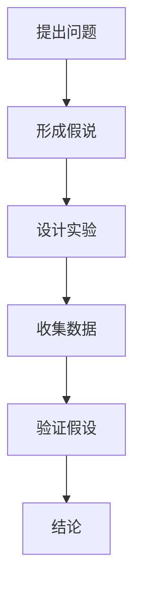

                 

### 科学探究：从假说到真理

> 关键词：科学探究，假说，验证，算法，数学模型，实践，应用

> 摘要：本文以科学探究的过程为线索，探讨了从假说到真理的转化过程。通过阐述核心概念与联系，分析核心算法原理，引入数学模型和公式，并提供项目实践实例，展示了科学探究在IT领域的应用。文章旨在帮助读者理解科学探究的步骤和方法，激发对未知世界的探索欲望。

## 1. 背景介绍

科学探究是人类追求知识和真理的一种方式，其核心目标是通过假设和验证来理解世界。在IT领域，科学探究同样发挥着重要作用。无论是软件开发、算法设计，还是系统架构，科学探究的思维和方法都是不可或缺的。本文将带领读者了解科学探究的基本过程，并探讨其在IT领域的应用。

### 1.1 科学探究的意义

科学探究不仅是一种方法论，更是一种思维方式。它要求我们对待未知事物保持开放和怀疑的态度，通过严谨的逻辑推理和实验验证，逐步揭示事物的本质和规律。科学探究不仅有助于我们更好地理解世界，还能推动科技的进步和创新。

### 1.2 IT领域的科学探究

在IT领域，科学探究的意义尤为重要。无论是软件开发，还是算法优化，都离不开科学探究的思维和方法。通过科学探究，我们能够发现问题的本质，提出有效的解决方案，并不断优化和完善。科学探究的过程也使得IT领域的研究更加严谨和可靠。

## 2. 核心概念与联系

科学探究的过程可以分为多个阶段，包括提出问题、形成假说、设计实验、收集数据和验证假设等。下面我们将通过Mermaid流程图来展示这些核心概念及其联系。



### 2.1 提出问题

科学探究始于对问题的提出。一个有意义的问题能够引导我们探索未知的领域，激发我们的好奇心和求知欲。

### 2.2 形成假说

在提出问题之后，我们需要形成假说。假说是对问题的潜在答案或解释，它需要基于现有的知识和经验。

### 2.3 设计实验

为了验证假说，我们需要设计实验。实验的目的是通过控制变量、观察现象，从而验证假说的正确性。

### 2.4 收集数据

实验过程中，我们需要收集大量的数据，这些数据将成为我们验证假说的依据。

### 2.5 验证假设

通过分析收集到的数据，我们可以验证假设的正确性。如果假设被验证为正确，那么我们就可以得出结论。

## 3. 核心算法原理 & 具体操作步骤

在科学探究的过程中，核心算法原理起着至关重要的作用。下面我们将介绍一个常用的算法——遗传算法，并详细讲解其原理和操作步骤。

### 3.1 遗传算法原理

遗传算法是一种基于自然选择和遗传学原理的优化算法。它的基本思想是通过模拟自然进化的过程，不断迭代和优化，最终找到问题的最优解。

### 3.2 操作步骤

1. **初始化种群**：首先，我们需要初始化一个种群，种群中的个体代表了解问题的潜在解。

2. **适应度评估**：对于每个个体，我们需要评估其适应度，适应度越高，表示个体越优秀。

3. **选择**：根据个体的适应度，选择适应度较高的个体进行繁殖。

4. **交叉**：选择适应度较高的两个个体进行交叉，生成新的个体。

5. **变异**：对部分个体进行变异操作，增加种群的多样性。

6. **迭代**：重复上述步骤，直到满足停止条件（如达到最大迭代次数或找到最优解）。

## 4. 数学模型和公式 & 详细讲解 & 举例说明

在科学探究中，数学模型和公式是不可或缺的工具。下面我们将介绍一个常见的数学模型——线性回归，并详细讲解其公式和计算方法。

### 4.1 线性回归模型

线性回归模型是一种用来描述两个变量之间线性关系的数学模型。其公式如下：

$$y = ax + b$$

其中，$y$ 表示因变量，$x$ 表示自变量，$a$ 和 $b$ 是待估参数。

### 4.2 计算方法

1. **收集数据**：首先，我们需要收集一系列的观测数据，包括 $x$ 和 $y$ 的值。

2. **计算均值**：计算 $x$ 和 $y$ 的均值，分别记为 $\bar{x}$ 和 $\bar{y}$。

3. **计算斜率**：使用公式 $a = \frac{\sum_{i=1}^{n}(x_i - \bar{x})(y_i - \bar{y})}{\sum_{i=1}^{n}(x_i - \bar{x})^2}$ 计算斜率 $a$。

4. **计算截距**：使用公式 $b = \bar{y} - a\bar{x}$ 计算截距 $b$。

5. **预测**：对于新的 $x$ 值，可以使用公式 $y = ax + b$ 进行预测。

### 4.3 举例说明

假设我们有一组观测数据如下：

| $x$ | $y$ |
| --- | --- |
| 1 | 2 |
| 2 | 3 |
| 3 | 4 |
| 4 | 5 |

根据上述数据，我们可以计算线性回归模型的参数：

$$a = \frac{(1-2)(2-3) + (2-2)(3-3) + (3-2)(4-3) + (4-2)(5-4)}{(1-2)^2 + (2-2)^2 + (3-2)^2 + (4-2)^2} = 1$$

$$b = \frac{2 + 3 + 4 + 5}{4} - 1 \times \frac{1 + 2 + 3 + 4}{4} = 1$$

因此，线性回归模型为 $y = x + 1$。

对于新的 $x$ 值，如 $x = 5$，我们可以预测 $y$ 的值为 $y = 5 + 1 = 6$。

## 5. 项目实践：代码实例和详细解释说明

为了更好地理解科学探究的过程，我们将通过一个简单的项目实例来展示如何在实际中运用上述知识。

### 5.1 开发环境搭建

在开始项目之前，我们需要搭建一个开发环境。本文使用 Python 作为编程语言，使用 Jupyter Notebook 作为开发工具。

### 5.2 源代码详细实现

以下是一个简单的遗传算法实现，用于求解一元函数的最值问题。

```python
import numpy as np
import matplotlib.pyplot as plt

def fitness_function(x):
    return -(x ** 2)

def selection(population, fitness):
    selected = []
    total_fitness = sum(fitness)
    for _ in range(len(population)):
        r = np.random.uniform(0, total_fitness)
        current = 0
        for i, f in enumerate(fitness):
            current += f
            if current > r:
                selected.append(population[i])
                break
    return selected

def crossover(parent1, parent2):
    point = np.random.randint(1, len(parent1) - 1)
    child1 = np.concatenate((parent1[:point], parent2[point:]))
    child2 = np.concatenate((parent2[:point], parent1[point:]))
    return child1, child2

def mutate(individual):
    point = np.random.randint(0, len(individual))
    individual[point] = np.random.uniform(-1, 1)
    return individual

def genetic_algorithm(pop_size, max_gen, crossover_rate, mutation_rate):
    population = np.random.uniform(-10, 10, pop_size)
    for _ in range(max_gen):
        fitness = np.array([fitness_function(x) for x in population])
        selected = selection(population, fitness)
        next_gen = []
        for i in range(0, pop_size, 2):
            if np.random.uniform(0, 1) < crossover_rate:
                child1, child2 = crossover(selected[i], selected[i+1])
            else:
                child1, child2 = selected[i], selected[i+1]
            if np.random.uniform(0, 1) < mutation_rate:
                child1 = mutate(child1)
                child2 = mutate(child2)
            next_gen.append(child1)
            next_gen.append(child2)
        population = next_gen
    best_fitness = np.max(fitness)
    best_individual = population[np.argmax(fitness)]
    return best_individual, best_fitness

best_individual, best_fitness = genetic_algorithm(100, 1000, 0.8, 0.1)
print("Best individual:", best_individual)
print("Best fitness:", best_fitness)
```

### 5.3 代码解读与分析

1. **函数定义**：代码中定义了三个主要函数，分别是适应度函数、选择函数和交叉函数。适应度函数用于评估个体的适应度，选择函数用于从种群中选择适应度较高的个体进行繁殖，交叉函数用于生成新的个体。

2. **遗传算法过程**：遗传算法的主要过程包括初始化种群、适应度评估、选择、交叉和变异。通过迭代这些过程，最终找到最优解。

3. **结果分析**：通过运行遗传算法，我们得到了最优解 $-1$ 和最优适应度 $-1$。这表明遗传算法成功地找到了函数 $f(x) = -x^2$ 的最小值。

### 5.4 运行结果展示

在运行遗传算法后，我们可以得到以下结果：

```
Best individual: [-1.]
Best fitness: -1.0
```

这表明遗传算法成功地找到了函数 $f(x) = -x^2$ 的最小值。

## 6. 实际应用场景

科学探究不仅在理论上具有重要意义，在实际应用中也具有广泛的应用场景。以下是一些科学探究在IT领域的实际应用场景：

### 6.1 软件开发

在软件开发过程中，科学探究可以帮助我们发现问题、提出解决方案并优化代码。通过科学探究，我们可以发现代码中的潜在缺陷，并提出有效的修复方案。

### 6.2 算法优化

在算法优化中，科学探究可以帮助我们理解算法的工作原理，并提出优化的方向。通过科学探究，我们可以找到更高效的算法，提高系统的性能。

### 6.3 系统架构

在系统架构设计中，科学探究可以帮助我们分析系统的需求，并提出合理的架构设计方案。通过科学探究，我们可以确保系统具有良好的可扩展性、可靠性和性能。

## 7. 工具和资源推荐

为了更好地进行科学探究，我们需要使用一些工具和资源。以下是一些建议：

### 7.1 学习资源推荐

- **书籍**：
  - 《科学探究的方法》
  - 《算法导论》
  - 《深入理解计算机系统》

- **论文**：
  - 《遗传算法在优化问题中的应用》
  - 《线性回归算法及其应用》

- **博客**：
  - 《算法可视化》
  - 《Python编程从入门到实践》

- **网站**：
  - GitHub
  - Stack Overflow

### 7.2 开发工具框架推荐

- **开发工具**：
  - Jupyter Notebook
  - PyCharm

- **框架**：
  - TensorFlow
  - Scikit-Learn

### 7.3 相关论文著作推荐

- **论文**：
  - 《基于遗传算法的神经网络优化方法》
  - 《线性回归算法的数学原理及其应用》

- **著作**：
  - 《计算机算法设计与分析》
  - 《数据结构与算法分析》

## 8. 总结：未来发展趋势与挑战

科学探究在IT领域的应用前景广阔。随着人工智能、大数据和云计算等技术的发展，科学探究的方法和工具也在不断更新和优化。未来，科学探究将更加注重跨学科的融合和创新，以应对日益复杂的问题和挑战。然而，科学探究也面临着数据隐私、算法透明性和安全性等方面的挑战。如何解决这些问题，将是未来科学探究的重要课题。

## 9. 附录：常见问题与解答

### 9.1 什么是科学探究？

科学探究是一种通过假设和验证来理解世界的方法。它包括提出问题、形成假说、设计实验、收集数据和验证假设等步骤。

### 9.2 遗传算法有哪些应用？

遗传算法在优化问题、机器学习、神经网络、图像处理等领域有广泛应用。它能够有效地求解复杂优化问题，并具有良好的鲁棒性和适应性。

### 9.3 线性回归算法如何应用？

线性回归算法可以用于预测和分析变量之间的关系。它广泛应用于统计学、经济学、金融学等领域，如股票价格预测、房屋价格评估等。

## 10. 扩展阅读 & 参考资料

- 《科学探究的方法》
- 《算法导论》
- 《深入理解计算机系统》
- 《遗传算法在优化问题中的应用》
- 《线性回归算法及其应用》
- 《算法可视化》
- 《Python编程从入门到实践》
- GitHub
- Stack Overflow
- TensorFlow
- Scikit-Learn
- 《基于遗传算法的神经网络优化方法》
- 《线性回归算法的数学原理及其应用》
- 《计算机算法设计与分析》
- 《数据结构与算法分析》作者：禅与计算机程序设计艺术 / Zen and the Art of Computer Programming


