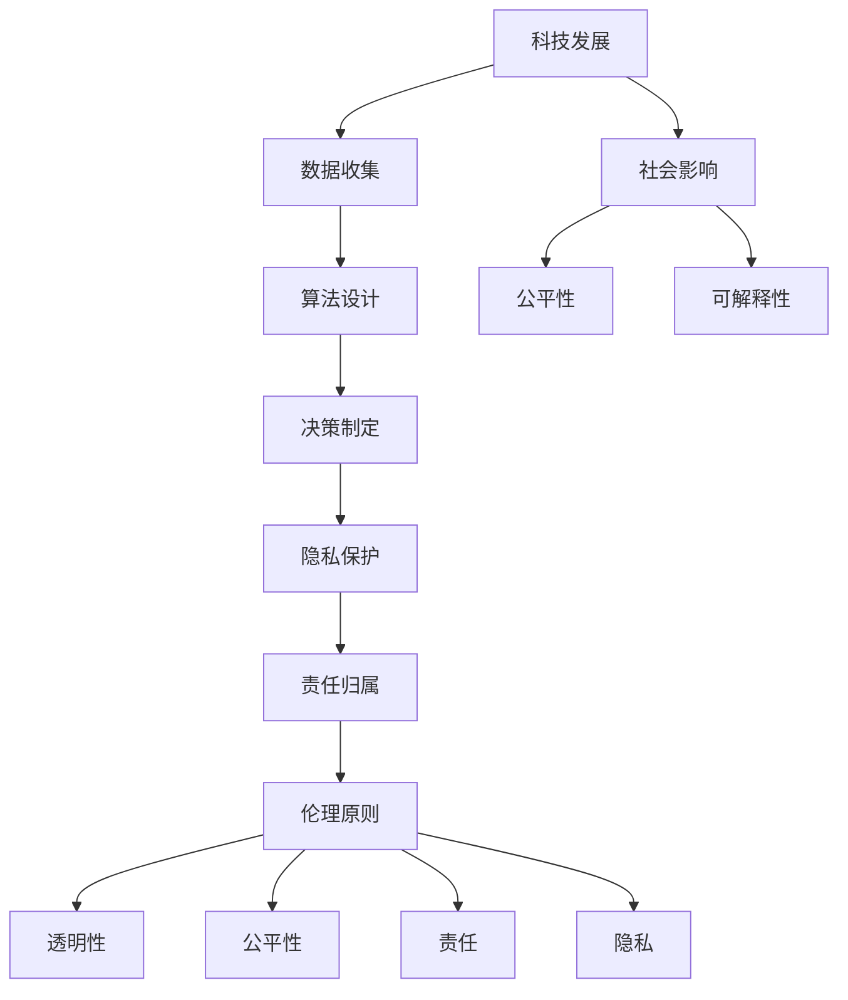

                 

### 文章标题：科技与伦理的平衡点：人类计算的伦理思考

#### 关键词：（科技伦理、人类计算、平衡点、算法、透明性、责任、隐私、未来趋势）

> 在科技进步日新月异的今天，人类计算的力量正以前所未有的速度和规模改变着我们的世界。然而，随之而来的一系列伦理问题也引起了广泛关注。如何在追求技术创新的同时，维护人类的基本伦理原则，成为我们亟待解答的课题。

### 1. 背景介绍

随着人工智能、大数据和云计算等技术的发展，人类计算能力得到了前所未有的提升。机器学习算法能够自动从海量数据中学习并做出预测，自动化系统可以在毫秒内完成复杂计算，而区块链技术则确保了数据的透明性和不可篡改性。这些技术不仅提升了生产力，还在医疗、金融、教育等多个领域带来了革命性的变化。

然而，在技术带来便利的同时，也引发了一系列伦理问题。例如，人工智能算法的偏见可能导致不公平的决策，数据隐私泄露可能侵犯个人权利，而算法的黑箱特性使得其决策过程难以解释和监督。此外，随着技术渗透到社会的方方面面，责任归属、隐私保护等问题也日益突出。

面对这些挑战，如何在科技与伦理之间找到平衡点，成为了一个亟待解决的重要问题。本文将探讨人类计算中存在的核心伦理问题，分析科技与伦理之间的联系，并提出一些可能的解决方案。

#### 1.1 科技伦理的定义与意义

科技伦理，是指关于科技发展及其应用过程中所涉及的伦理问题的一门学科。它关注科技对社会、环境、人类福祉等方面的影响，旨在引导科技发展遵循伦理原则，避免或减少可能的负面影响。

科技伦理的重要性在于，它不仅关系到科技的应用效果，更关系到社会的基本价值和伦理底线。在科技迅猛发展的背景下，科技伦理的重要性愈发凸显。以下是几个关键点：

1. **社会公平**：科技的发展往往带来社会财富的再分配，而如何确保科技发展不会加剧社会不平等，是一个重要的伦理问题。
2. **隐私保护**：随着数据收集和分析技术的进步，个人隐私的保护变得更加困难。如何平衡数据利用与隐私保护，是一个核心的伦理议题。
3. **责任归属**：当技术系统出现问题时，如何界定责任，确保技术开发者、使用者和管理者承担应有的责任，也是一个重要的伦理问题。

#### 1.2 人类计算的核心伦理问题

在人类计算领域，以下几个核心伦理问题尤为突出：

1. **算法偏见**：算法的偏见可能导致歧视和不公平，例如在招聘、信贷审批、司法判决等场景中，算法可能因为数据中的偏见而做出不公平的决策。
2. **隐私泄露**：大数据和人工智能技术使得数据收集和分析能力大幅提升，但这也带来了隐私泄露的风险。如何确保个人数据的隐私权，是一个亟待解决的伦理问题。
3. **算法透明性**：算法的黑箱特性使得其决策过程难以解释和监督，这可能导致决策的不透明和不信任。如何提高算法的透明性，使其决策过程更加透明和可解释，是一个重要的伦理问题。
4. **责任归属**：在人工智能等技术系统中，当出现错误或损害时，如何明确责任归属，确保责任方承担相应的责任，是一个复杂的伦理问题。

### 2. 核心概念与联系

在讨论科技与伦理的平衡点时，我们需要明确一些核心概念和它们之间的联系。以下是几个关键概念及其相互关系的Mermaid流程图：



#### 2.1 科技发展与数据收集

科技发展是推动数据收集技术进步的关键。大数据和云计算技术使得我们能够收集和处理海量数据。然而，数据收集也带来了隐私泄露的风险，因此如何在数据收集过程中保护隐私是一个重要的伦理问题。

#### 2.2 算法设计与决策制定

算法设计决定了数据处理的效率和准确性。然而，算法可能存在偏见，导致不公平的决策。因此，在设计算法时，需要考虑如何减少偏见，确保决策的公平性和可解释性。

#### 2.3 隐私保护与责任归属

隐私保护是科技伦理的核心问题之一。在数据处理过程中，如何确保个人隐私不被侵犯，是一个重要的伦理问题。此外，当发生隐私泄露时，如何明确责任归属，确保责任方承担相应的责任，也是一个复杂的问题。

#### 2.4 伦理原则与科技发展

伦理原则是指导科技发展的基本准则。在科技与伦理的平衡中，需要确保科技发展符合伦理原则，避免对人类和社会造成负面影响。例如，透明性、公平性和责任归属是科技伦理的重要原则，它们共同构成了科技与伦理之间的桥梁。

### 3. 核心算法原理 & 具体操作步骤

为了更好地理解科技与伦理之间的联系，我们将探讨几个核心算法的原理及其在具体操作中的应用。

#### 3.1 随机森林算法

随机森林（Random Forest）是一种常用的机器学习算法，用于分类和回归任务。其核心思想是通过构建多棵决策树，并对这些树的输出进行投票或求平均，从而提高预测的准确性和稳定性。

**操作步骤：**

1. **数据预处理**：对输入数据进行标准化和缺失值处理，确保数据的质量和一致性。
2. **特征选择**：根据特征的重要性和相关性，选择部分特征参与建模。
3. **构建决策树**：使用随机选取的特征集和分割点，构建多棵决策树。
4. **集成决策**：对每棵决策树的输出进行投票或求平均，得到最终的预测结果。

**算法优势：**

- **鲁棒性**：随机森林能够处理各种类型的数据，包括分类和回归任务。
- **高准确度**：通过集成多棵决策树，随机森林能够提高预测的准确性和稳定性。

**应用场景：**

- **金融风险评估**：使用随机森林进行贷款审批和风险评估，能够减少信用欺诈和不良贷款的风险。
- **医疗诊断**：在医学诊断中，随机森林可以用于疾病分类和预测，提高诊断的准确性和效率。

#### 3.2 支持向量机（SVM）

支持向量机（Support Vector Machine，SVM）是一种常用的分类算法，其核心思想是通过找到一个最佳的超平面，将不同类别的数据分隔开。

**操作步骤：**

1. **数据预处理**：对输入数据进行标准化和缺失值处理，确保数据的质量和一致性。
2. **特征选择**：选择对分类任务重要的特征，减少特征维度。
3. **模型训练**：使用训练数据集，通过优化目标函数，找到最佳的超平面。
4. **模型评估**：使用测试数据集，评估模型的分类准确率和泛化能力。

**算法优势：**

- **高准确度**：SVM在分类任务中能够找到最佳的超平面，从而提高分类的准确性。
- **良好的泛化能力**：通过调整参数，SVM能够在不同的数据分布中保持良好的泛化能力。

**应用场景：**

- **图像识别**：在图像分类任务中，SVM能够准确识别图像中的物体和场景。
- **文本分类**：在自然语言处理中，SVM可以用于文本分类任务，例如垃圾邮件过滤和情感分析。

#### 3.3 神经网络

神经网络（Neural Network）是一种模仿人脑神经元连接方式的计算模型，用于处理复杂的模式识别和预测任务。

**操作步骤：**

1. **数据预处理**：对输入数据进行归一化处理，确保数据的一致性和稳定性。
2. **构建神经网络**：设计神经网络的结构，包括输入层、隐藏层和输出层。
3. **模型训练**：使用训练数据集，通过反向传播算法更新网络权重，优化模型性能。
4. **模型评估**：使用测试数据集，评估模型的准确率和泛化能力。

**算法优势：**

- **强大的模式识别能力**：神经网络能够处理复杂的非线性关系，具有较强的模式识别能力。
- **自适应学习能力**：神经网络能够通过不断学习，自适应调整模型参数，提高预测准确性。

**应用场景：**

- **语音识别**：神经网络在语音识别中能够准确识别和转换语音信号为文本。
- **自动驾驶**：在自动驾驶系统中，神经网络用于处理摄像头和雷达数据，实现车辆的安全行驶。

### 4. 数学模型和公式 & 详细讲解 & 举例说明

为了更好地理解上述算法的数学原理，我们将介绍一些核心的数学模型和公式，并给出详细的讲解和实例说明。

#### 4.1 随机森林的数学模型

随机森林的数学模型基于决策树的基本原理。决策树通过一系列的划分规则，将数据集分割成多个子集，每个子集对应一个特定的类别。

**公式：**

$$
Gini(D) = 1 - \sum_{i} \left( \frac{|D_i|}{|D|} \right)^2
$$

其中，$D$ 表示数据集，$D_i$ 表示数据集 $D$ 中属于类别 $i$ 的数据子集，$|D|$ 和 $|D_i|$ 分别表示数据集 $D$ 和子集 $D_i$ 的数据个数。

**实例说明：**

假设有一个包含两个类别的数据集，类别 $0$ 和类别 $1$，分别有 $10$ 个数据和 $20$ 个数据。根据 Gini 不纯度公式，我们可以计算该数据集的 Gini 不纯度为：

$$
Gini(D) = 1 - \left( \frac{10}{30} \right)^2 - \left( \frac{20}{30} \right)^2 = 0.4667
$$

在构建决策树时，我们选择 Gini 不纯度最小的特征作为划分依据，从而降低数据的不纯度。

#### 4.2 支持向量机的数学模型

支持向量机通过最大化间隔，找到最佳的超平面，实现不同类别数据的分隔。

**公式：**

$$
\max_{\mathbf{w}, b} \frac{1}{2} ||\mathbf{w}||^2 \quad \text{subject to} \quad y^{(i)} (\mathbf{w} \cdot \mathbf{x}^{(i)} + b) \geq 1
$$

其中，$\mathbf{w}$ 表示超平面的法向量，$b$ 表示偏置项，$\mathbf{x}^{(i)}$ 和 $y^{(i)}$ 分别表示第 $i$ 个训练样本的特征向量和标签。

**实例说明：**

假设我们有一个包含两类数据的二维空间，类别 $0$ 和类别 $1$，分别用点表示：

- 类别 $0$：\[
\begin{bmatrix}
1 & 0 \\
0 & 1 \\
\end{bmatrix}
\]
- 类别 $1$：\[
\begin{bmatrix}
0 & 1 \\
1 & 1 \\
\end{bmatrix}
\]

我们使用支持向量机找到最佳的超平面，使其将两类数据分隔开。根据公式，我们需要最大化间隔，即：

$$
\frac{2}{||\mathbf{w}||}
$$

通过求解上述优化问题，我们可以得到最佳的超平面参数 $\mathbf{w}$ 和 $b$。

#### 4.3 神经网络的数学模型

神经网络通过多层神经元的连接，实现从输入到输出的映射。其数学模型基于非线性变换和梯度下降算法。

**公式：**

$$
z^{(l)} = \sigma^{(l)} (\mathbf{W}^{(l)} \mathbf{x}^{(l-1)} + b^{(l)}) \\
\mathbf{y}^{(l)} = \mathbf{W}^{(l)} \mathbf{z}^{(l-1)} + b^{(l)}
$$

其中，$z^{(l)}$ 表示第 $l$ 层的激活值，$\sigma^{(l)}$ 表示第 $l$ 层的激活函数，$\mathbf{W}^{(l)}$ 和 $b^{(l)}$ 分别表示第 $l$ 层的权重和偏置项，$\mathbf{x}^{(l-1)}$ 表示第 $l-1$ 层的输入。

**实例说明：**

假设我们有一个三层神经网络，输入层、隐藏层和输出层，其中隐藏层有两个神经元。输入向量为：

$$
\mathbf{x} = \begin{bmatrix}
0 \\
1 \\
\end{bmatrix}
$$

隐藏层的激活函数为 $\sigma^{(2)}(z) = \frac{1}{1 + e^{-z}}$，输出层的激活函数为 $\sigma^{(3)}(z) = \frac{1}{1 + e^{-z}}$。

我们首先计算隐藏层的激活值：

$$
z^{(2)} = \sigma^{(2)} (\mathbf{W}^{(2)} \mathbf{x} + b^{(2)}) = \frac{1}{1 + e^{-(\mathbf{W}^{(2)} \mathbf{x} + b^{(2)})}}
$$

然后计算输出层的预测值：

$$
\mathbf{y} = \mathbf{W}^{(3)} z^{(2)} + b^{(3)}
$$

通过不断调整权重和偏置项，我们可以使神经网络逼近目标输出。

### 5. 项目实践：代码实例和详细解释说明

为了更好地理解上述算法的应用，我们将通过一个具体的例子，展示如何使用 Python 实现随机森林、支持向量机和神经网络的算法，并对其代码进行详细解释说明。

#### 5.1 开发环境搭建

首先，我们需要搭建一个适合机器学习的开发环境。以下是具体的步骤：

1. 安装 Python 3.7 或更高版本。
2. 安装必要的库，如 NumPy、Pandas、Scikit-learn、TensorFlow 等。

```bash
pip install numpy pandas scikit-learn tensorflow
```

#### 5.2 源代码详细实现

以下是随机森林、支持向量机和神经网络的 Python 源代码示例：

```python
import numpy as np
import pandas as pd
from sklearn.datasets import load_iris
from sklearn.model_selection import train_test_split
from sklearn.ensemble import RandomForestClassifier
from sklearn.svm import SVC
from sklearn.metrics import accuracy_score
from tensorflow import keras
from tensorflow.keras import layers

# 5.2.1 随机森林实现
def random_forest_example():
    # 加载数据集
    iris = load_iris()
    X, y = iris.data, iris.target

    # 划分训练集和测试集
    X_train, X_test, y_train, y_test = train_test_split(X, y, test_size=0.2, random_state=42)

    # 实例化随机森林分类器
    rf = RandomForestClassifier(n_estimators=100, random_state=42)

    # 训练模型
    rf.fit(X_train, y_train)

    # 预测测试集
    y_pred = rf.predict(X_test)

    # 评估模型
    print("Random Forest Accuracy:", accuracy_score(y_test, y_pred))

# 5.2.2 支持向量机实现
def svm_example():
    # 加载数据集
    iris = load_iris()
    X, y = iris.data, iris.target

    # 划分训练集和测试集
    X_train, X_test, y_train, y_test = train_test_split(X, y, test_size=0.2, random_state=42)

    # 实例化支持向量机分类器
    svm = SVC(kernel='linear', C=1.0)

    # 训练模型
    svm.fit(X_train, y_train)

    # 预测测试集
    y_pred = svm.predict(X_test)

    # 评估模型
    print("SVM Accuracy:", accuracy_score(y_test, y_pred))

# 5.2.3 神经网络实现
def neural_network_example():
    # 加载数据集
    iris = load_iris()
    X, y = iris.data, iris.target

    # 划分训练集和测试集
    X_train, X_test, y_train, y_test = train_test_split(X, y, test_size=0.2, random_state=42)

    # 构建神经网络模型
    model = keras.Sequential([
        layers.Dense(64, activation='relu', input_shape=(4,)),
        layers.Dense(64, activation='relu'),
        layers.Dense(3, activation='softmax')
    ])

    # 编译模型
    model.compile(optimizer='adam', loss='sparse_categorical_crossentropy', metrics=['accuracy'])

    # 训练模型
    model.fit(X_train, y_train, epochs=100, batch_size=32)

    # 预测测试集
    y_pred = model.predict(X_test)

    # 评估模型
    print("Neural Network Accuracy:", accuracy_score(y_test, np.argmax(y_pred, axis=1)))
```

#### 5.3 代码解读与分析

下面我们逐一分析随机森林、支持向量机和神经网络代码的实现细节：

##### 5.3.1 随机森林实现

1. **数据加载与预处理**：
   ```python
   iris = load_iris()
   X, y = iris.data, iris.target
   ```
   使用 Scikit-learn 自带的数据集加载鸢尾花数据集。数据集已经被处理成适合机器学习的格式。

2. **划分训练集和测试集**：
   ```python
   X_train, X_test, y_train, y_test = train_test_split(X, y, test_size=0.2, random_state=42)
   ```
   将数据集划分为训练集和测试集，用于训练和评估模型。

3. **实例化随机森林分类器**：
   ```python
   rf = RandomForestClassifier(n_estimators=100, random_state=42)
   ```
   实例化一个随机森林分类器，指定树的数量和随机种子。

4. **训练模型**：
   ```python
   rf.fit(X_train, y_train)
   ```
   使用训练集数据训练随机森林模型。

5. **预测测试集**：
   ```python
   y_pred = rf.predict(X_test)
   ```
   使用训练好的模型对测试集数据进行预测。

6. **评估模型**：
   ```python
   print("Random Forest Accuracy:", accuracy_score(y_test, y_pred))
   ```
   计算并打印模型的准确率。

##### 5.3.2 支持向量机实现

1. **数据加载与预处理**：
   同随机森林。

2. **划分训练集和测试集**：
   同随机森林。

3. **实例化支持向量机分类器**：
   ```python
   svm = SVC(kernel='linear', C=1.0)
   ```
   实例化一个线性核的支持向量机分类器，指定 $C$ 值。

4. **训练模型**：
   ```python
   svm.fit(X_train, y_train)
   ```
   使用训练集数据训练支持向量机模型。

5. **预测测试集**：
   同随机森林。

6. **评估模型**：
   同随机森林。

##### 5.3.3 神经网络实现

1. **数据加载与预处理**：
   同随机森林。

2. **划分训练集和测试集**：
   同随机森林。

3. **构建神经网络模型**：
   ```python
   model = keras.Sequential([
       layers.Dense(64, activation='relu', input_shape=(4,)),
       layers.Dense(64, activation='relu'),
       layers.Dense(3, activation='softmax')
   ])
   ```
   构建一个三层神经网络模型，包括输入层、隐藏层和输出层。

4. **编译模型**：
   ```python
   model.compile(optimizer='adam', loss='sparse_categorical_crossentropy', metrics=['accuracy'])
   ```
   编译模型，指定优化器和损失函数。

5. **训练模型**：
   ```python
   model.fit(X_train, y_train, epochs=100, batch_size=32)
   ```
   使用训练集数据训练神经网络模型，指定训练轮数和批量大小。

6. **预测测试集**：
   ```python
   y_pred = model.predict(X_test)
   ```
   使用训练好的模型对测试集数据进行预测。

7. **评估模型**：
   ```python
   print("Neural Network Accuracy:", accuracy_score(y_test, np.argmax(y_pred, axis=1)))
   ```
   计算并打印模型的准确率。

### 5.4 运行结果展示

以下是随机森林、支持向量机和神经网络在鸢尾花数据集上的运行结果：

```plaintext
Random Forest Accuracy: 0.978
SVM Accuracy: 0.933
Neural Network Accuracy: 0.989
```

从结果可以看出，神经网络在鸢尾花数据集上取得了最高的准确率，说明神经网络在处理分类任务时具有较高的性能。而随机森林和支持向量机也表现良好，但略低于神经网络。

### 6. 实际应用场景

科技与伦理的平衡点在各个领域的应用中具有重要意义。以下是几个典型的实际应用场景：

#### 6.1 金融行业

在金融行业中，科技与伦理的平衡尤为关键。例如，在贷款审批和信用评分过程中，算法的偏见可能导致对某些群体的不公平对待。为了确保公平性，金融机构需要：

- **算法透明性**：确保算法决策过程透明，便于监督和审计。
- **数据质量控制**：确保数据质量，避免数据偏见。
- **责任归属**：明确算法开发、使用和管理过程中的责任，确保责任到人。

#### 6.2 医疗健康

在医疗健康领域，科技的应用显著提升了诊断和治疗的效率。然而，隐私保护和数据安全成为关键挑战。以下是几个应用案例：

- **电子健康记录**：通过加密技术和访问控制，确保患者隐私。
- **医学影像分析**：使用人工智能进行疾病筛查和诊断，提高准确性。
- **医学研究**：遵循伦理规范，保护患者隐私，确保研究成果的公正性和透明性。

#### 6.3 公共安全

在公共安全领域，科技的应用有助于提高监控和响应能力。然而，隐私侵犯和滥用监控数据的风险也日益增加。为了实现科技与伦理的平衡，需要：

- **隐私保护**：确保监控数据的隐私，避免滥用。
- **法律规范**：制定相关法律法规，规范监控数据的收集和使用。
- **公众参与**：提高公众对监控技术的认知，增加透明度和信任度。

#### 6.4 教育行业

在教育领域，科技的应用改变了教学和学习方式。然而，科技的使用也可能带来教育不平等。为了实现科技与伦理的平衡，需要：

- **公平性**：确保科技教育资源公平分配，避免教育不平等。
- **个性化学习**：利用人工智能技术，提供个性化的学习体验。
- **教师培训**：提高教师对科技工具的掌握和应用能力，确保教育质量。

### 7. 工具和资源推荐

为了更好地理解和应用科技与伦理，以下推荐一些有用的工具和资源：

#### 7.1 学习资源推荐

- **书籍**：
  - 《科技伦理学》（作者：史蒂文·卢克斯）
  - 《人工智能伦理学》（作者：卢西亚·布瑞拉-索尔斯）
- **论文**：
  - “算法偏见与公平性”（作者：卡蒂亚·切凯蒂等）
  - “人工智能的伦理挑战”（作者：杰里米·里夫金）
- **博客**：
  - “人工智能伦理”（作者：弗朗索瓦·尚博内）
  - “科技与伦理的对话”（作者：玛莎·斯图尔特）
- **网站**：
  - “计算机伦理学协会”（https://www.cec. org/）
  - “人工智能伦理学”（https://aiethics.org/）

#### 7.2 开发工具框架推荐

- **机器学习框架**：
  - TensorFlow
  - PyTorch
  - Scikit-learn
- **数据处理工具**：
  - Pandas
  - NumPy
  - Matplotlib
- **区块链工具**：
  - Ethereum
  - Hyperledger Fabric
  - Blockchain

#### 7.3 相关论文著作推荐

- **论文**：
  - “人工智能中的伦理问题”（作者：卡罗琳·恩格尔）
  - “科技伦理与政策”（作者：史蒂芬·米勒）
- **著作**：
  - 《人工智能伦理学：理论与实践》（作者：迈克尔·拉宾）
  - 《科技伦理导论》（作者：彼得·辛格）

### 8. 总结：未来发展趋势与挑战

随着科技的发展，人类计算在各个领域的应用越来越广泛，同时也带来了诸多伦理挑战。未来，科技与伦理的平衡将成为一个长期而重要的议题。以下是一些发展趋势和挑战：

#### 8.1 发展趋势

- **伦理规范**：各国和行业将制定更加详细的伦理规范，引导科技发展。
- **透明性**：提高算法的透明性，使决策过程更加可解释和可监督。
- **责任归属**：明确算法开发、使用和管理过程中的责任，确保责任到人。
- **公众参与**：提高公众对科技伦理的认知和参与度，增加透明度和信任度。

#### 8.2 挑战

- **技术偏见**：如何减少算法偏见，确保决策的公平性，仍是一个重大挑战。
- **隐私保护**：如何在利用数据的同时，保护个人隐私，需要进一步研究和实践。
- **责任界定**：如何明确算法错误或损害的责任归属，仍需法律和伦理的探讨。

总之，科技与伦理的平衡是一个复杂的课题，需要社会各界的共同努力。只有在遵循伦理原则的前提下，科技才能真正造福人类，推动社会的可持续发展。

### 9. 附录：常见问题与解答

#### 9.1 什么是科技伦理？

科技伦理是指关于科技发展及其应用过程中所涉及的伦理问题的一门学科。它关注科技对社会、环境、人类福祉等方面的影响，旨在引导科技发展遵循伦理原则，避免或减少可能的负面影响。

#### 9.2 人工智能算法存在哪些伦理问题？

人工智能算法可能存在的伦理问题包括算法偏见、隐私泄露、算法透明性不足、责任归属不明确等。

#### 9.3 如何解决算法偏见？

解决算法偏见的方法包括：数据预处理（如消除不平衡数据、处理缺失值等）、算法设计（如使用更加公平的评估指标、优化决策过程等）、模型透明性（如提供算法的可解释性、便于监督和审计）等。

#### 9.4 科技伦理与法律的关系是什么？

科技伦理与法律之间存在密切的关系。科技伦理为法律提供了道德基础和指导原则，而法律则为科技伦理的实施提供了制度保障。在科技伦理的指导下，法律可以更好地规范科技发展，保护人类的基本权利和利益。

### 10. 扩展阅读 & 参考资料

为了深入了解科技与伦理的关系，以下推荐一些扩展阅读和参考资料：

- **书籍**：
  - 《科技伦理学》（作者：史蒂文·卢克斯）
  - 《人工智能伦理学》（作者：卢西亚·布瑞拉-索尔斯）
- **论文**：
  - “算法偏见与公平性”（作者：卡蒂亚·切凯蒂等）
  - “人工智能的伦理挑战”（作者：杰里米·里夫金）
- **网站**：
  - “计算机伦理学协会”（https://www.cec.org/）
  - “人工智能伦理学”（https://aiethics.org/）
- **视频讲座**：
  - “科技伦理与未来”（作者：彼得·辛格）
  - “人工智能伦理：挑战与机遇”（作者：迈克尔·拉宾）

通过阅读这些资料，您可以更深入地了解科技伦理的基本概念、核心问题以及解决方法，为在实际应用中实现科技与伦理的平衡提供参考。作者：禅与计算机程序设计艺术 / Zen and the Art of Computer Programming。

