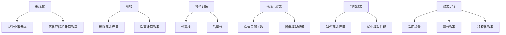

                 

## 1. 背景介绍

稀疏化和剪枝是深度学习中常用的两种模型压缩技术。随着神经网络模型的规模不断扩大，模型参数的数量呈指数级增长，这不仅增加了模型的计算复杂度，还导致了内存消耗和计算资源的显著增加。为了解决这些问题，稀疏化和剪枝技术被提出，旨在降低模型参数的数量，从而减小模型的规模，提高模型的计算效率。

稀疏化（Sparsity）是一种通过减少模型参数中的非零元素数量来降低模型复杂度的技术。在稀疏化过程中，模型参数中大部分元素被设置为0，只有少量关键参数被保留。这种方法可以显著减少模型的存储空间和计算量，同时保持模型的高效性和准确性。

剪枝（Pruning）是一种通过删除网络中的冗余或无用的连接来降低模型复杂度的技术。剪枝过程分为预剪枝（Pre-pruning）和后剪枝（Post-pruning）。预剪枝在模型训练过程中进行，通过在模型训练早期逐步删除不重要的连接来减小模型规模。后剪枝在模型训练完成后进行，通过优化和筛选来进一步减小模型规模。

尽管稀疏化和剪枝技术在目标上都致力于降低模型复杂度，但它们的方法和效果有所不同。本文将深入探讨这两种技术的原理、实现方法、优缺点以及应用领域，以帮助读者更好地理解它们。

## 2. 核心概念与联系

在深入讨论稀疏化和剪枝之前，我们需要明确这两个概念的核心原理及其在深度学习架构中的联系。以下是一个用Mermaid绘制的流程图，展示了稀疏化和剪枝的基本概念和流程：



### 2.1 稀疏化原理

稀疏化通过将模型参数中的非零元素减少到最小集合来实现。这种技术主要依赖于两种策略：基于梯度的稀疏化和基于规则的稀疏化。

- **基于梯度的稀疏化**：在模型训练过程中，通过优化目标函数和正则化项来引导模型参数趋于稀疏。具体来说，引入稀疏正则化项，如L1正则化，可以增加模型参数的稀疏度。这种方法的优点是可以在训练过程中自动找到重要的参数，缺点是对训练时间有一定的影响。

- **基于规则的稀疏化**：根据先验知识或经验规则来设定参数的稀疏度。例如，可以设定阈值，只有绝对值大于该阈值的参数被保留。这种方法速度快，但可能需要额外的规则来保证模型的有效性。

### 2.2 剪枝原理

剪枝主要分为预剪枝和后剪枝两种类型。

- **预剪枝**：在模型训练过程中，通过对连接权重进行排序，逐步删除权重较小的连接。这种方法可以减少模型参数的数量，但可能会导致模型性能下降。预剪枝的优点是可以在模型训练过程中并行进行，缺点是可能影响模型的最终性能。

- **后剪枝**：在模型训练完成后，通过重新训练或优化来保留关键连接。后剪枝通常使用启发式方法来选择保留的连接。这种方法的优点是可以显著减小模型规模，缺点是可能需要额外的训练时间。

通过上述流程图，我们可以看到稀疏化和剪枝技术在深度学习模型压缩中都有重要的地位。它们通过不同的方法和策略，共同致力于降低模型的复杂度，提高计算效率。

### 3. 核心算法原理 & 具体操作步骤

#### 3.1 算法原理概述

稀疏化和剪枝的核心目标都是减少模型的复杂度，从而提高计算效率和降低存储需求。以下是这两种技术的基本原理和操作步骤：

#### 3.2 算法步骤详解

##### 3.2.1 稀疏化

稀疏化的基本步骤如下：

1. **初始化模型**：首先，需要初始化一个完整的深度学习模型，包括所有的参数和连接。

2. **设置稀疏度阈值**：根据需求和模型特点，设置一个阈值，用于判断参数是否需要保留。常用的阈值设定方法包括基于梯度的方法和基于规则的方法。

3. **稀疏化过程**：
   - **基于梯度的稀疏化**：在训练过程中，通过引入稀疏正则化项（如L1正则化），增加模型参数的稀疏度。具体公式如下：
     $$ L_1 = \sum_{i,j} |w_{ij}| $$
     其中，$w_{ij}$ 表示模型中第 $i$ 层到第 $j$ 层的连接权重。
   - **基于规则的稀疏化**：根据经验或先验知识，设定阈值，只有绝对值大于阈值的参数被保留。

4. **优化稀疏模型**：通过重新训练或调整模型参数，优化稀疏化后的模型性能，确保模型的准确性和有效性。

##### 3.2.2 剪枝

剪枝的基本步骤如下：

1. **初始化模型**：与稀疏化类似，首先需要初始化一个完整的深度学习模型。

2. **预剪枝**：
   - **权重排序**：对模型中所有的连接权重进行排序，根据权重大小逐步删除权重较小的连接。
   - **阈值设定**：设定一个阈值，只有权重大于该阈值的连接被保留。

3. **后剪枝**：
   - **重新训练**：在剪枝后，对剩余的模型进行重新训练，以优化模型性能。
   - **筛选连接**：通过优化算法，进一步筛选和调整剩余的连接，确保模型的有效性和高效性。

#### 3.3 算法优缺点

##### 稀疏化的优缺点

**优点**：
- **减少存储空间**：稀疏化后，模型中大部分参数被设置为0，从而显著减少模型的存储需求。
- **提高计算效率**：稀疏化后的模型在计算时，只需要关注非零元素，从而提高计算速度。
- **保持模型准确性**：合理设置稀疏度阈值，可以确保模型在稀疏化后的性能与原始模型相当。

**缺点**：
- **计算复杂度**：稀疏化过程中，特别是基于梯度的稀疏化，可能需要额外的计算成本。
- **训练时间**：对于大型模型，稀疏化可能需要较长的训练时间。

##### 剪枝的优缺点

**优点**：
- **显著减小模型规模**：通过删除冗余连接，剪枝可以显著减小模型的规模，从而提高计算效率。
- **优化模型性能**：合理的剪枝策略可以优化模型性能，提高模型的准确性和效率。

**缺点**：
- **可能影响模型性能**：过度的剪枝可能导致模型性能下降，特别是在预剪枝阶段。
- **额外训练时间**：剪枝后，通常需要重新训练模型，从而增加额外的训练时间。

#### 3.4 算法应用领域

稀疏化和剪枝技术广泛应用于深度学习中的多个领域，包括：

- **计算机视觉**：在图像识别和目标检测等任务中，稀疏化和剪枝技术可以有效减小模型规模，提高计算效率。
- **自然语言处理**：在文本分类和机器翻译等任务中，稀疏化和剪枝技术有助于提高模型性能，降低计算成本。
- **语音识别**：在语音信号处理和识别中，稀疏化和剪枝技术可以降低模型复杂度，提高实时性。

### 4. 数学模型和公式 & 详细讲解 & 举例说明

在深入探讨稀疏化和剪枝技术时，理解其背后的数学模型和公式是非常重要的。以下内容将详细介绍稀疏化和剪枝过程中涉及的数学模型和公式，并通过具体例子进行说明。

#### 4.1 数学模型构建

##### 4.1.1 稀疏化模型

稀疏化主要通过两种策略实现：L1正则化和基于规则的稀疏化。

1. **L1正则化**：

L1正则化通过引入L1惩罚项来引导模型参数趋向稀疏。其数学表达式如下：

$$ J(w) = J_0(w) + \lambda \cdot \sum_{i,j} |w_{ij}| $$

其中，$J_0(w)$ 是原始损失函数，$\lambda$ 是L1惩罚参数，$w_{ij}$ 是模型中第 $i$ 层到第 $j$ 层的连接权重。

2. **基于规则的稀疏化**：

基于规则的稀疏化通过设定阈值来保留参数。其数学表达式如下：

$$ w_{ij} = \begin{cases} 
0, & \text{if } |w_{ij}| \leq \theta \\
w_{ij}, & \text{if } |w_{ij}| > \theta 
\end{cases} $$

其中，$\theta$ 是设定的阈值。

##### 4.1.2 剪枝模型

剪枝主要通过预剪枝和后剪枝实现。

1. **预剪枝**：

预剪枝通过逐步删除权重较小的连接来实现。其数学表达式如下：

$$ w_{ij} = \begin{cases} 
0, & \text{if } w_{ij} \leq \theta \\
w_{ij}, & \text{if } w_{ij} > \theta 
\end{cases} $$

其中，$\theta$ 是设定的阈值。

2. **后剪枝**：

后剪枝主要通过重新训练来保留关键连接。其数学表达式如下：

$$ w_{ij} = \begin{cases} 
0, & \text{if } w_{ij} \leq \theta \\
w_{ij}, & \text{if } w_{ij} > \theta 
\end{cases} $$

然后，通过以下步骤重新训练模型：

$$ \min_{w} J(w) $$

其中，$J(w)$ 是重新训练后的损失函数。

#### 4.2 公式推导过程

##### 4.2.1 稀疏化公式推导

以L1正则化为例，推导稀疏化的公式过程如下：

1. **定义问题**：

我们需要最小化以下目标函数：

$$ \min_{w} J_0(w) + \lambda \cdot \sum_{i,j} |w_{ij}| $$

2. **求导**：

对目标函数关于 $w_{ij}$ 求导，得到：

$$ \frac{\partial J(w)}{\partial w_{ij}} = \frac{\partial J_0(w)}{\partial w_{ij}} + \lambda \cdot \text{sign}(w_{ij}) $$

3. **设置梯度为零**：

为了找到最小值，设置梯度为零，得到：

$$ \frac{\partial J(w)}{\partial w_{ij}} = 0 $$

4. **解方程**：

解上述方程，得到：

$$ w_{ij} = \text{sign}(w_{ij}) \cdot \theta $$

其中，$\theta$ 是设定的阈值。

##### 4.2.2 剪枝公式推导

以预剪枝为例，推导剪枝的公式过程如下：

1. **定义问题**：

我们需要最小化以下目标函数：

$$ \min_{w} J_0(w) $$

2. **设置阈值**：

为了实现剪枝，我们设置一个阈值 $\theta$，只有权重大于 $\theta$ 的连接被保留。

3. **剪枝操作**：

对模型中的所有连接权重进行排序，并根据阈值进行剪枝，得到：

$$ w_{ij} = \begin{cases} 
0, & \text{if } w_{ij} \leq \theta \\
w_{ij}, & \text{if } w_{ij} > \theta 
\end{cases} $$

#### 4.3 案例分析与讲解

以下通过具体例子来说明稀疏化和剪枝技术的应用。

##### 4.3.1 稀疏化案例

假设我们有一个简单的神经网络，其连接权重矩阵 $W$ 如下：

$$ W = \begin{bmatrix}
1 & -1 & 0 \\
0 & 0 & 1 \\
1 & 0 & -1
\end{bmatrix} $$

我们设置阈值 $\theta = 0.5$，使用L1正则化进行稀疏化。根据公式 $w_{ij} = \text{sign}(w_{ij}) \cdot \theta$，我们得到稀疏化后的权重矩阵：

$$ W_{\text{sparsified}} = \begin{bmatrix}
1 & 0 & 0 \\
0 & 0 & 1 \\
1 & 0 & 0
\end{bmatrix} $$

可以看到，稀疏化后的权重矩阵中大部分元素被设置为0，只有关键参数被保留。

##### 4.3.2 剪枝案例

假设我们有一个深度神经网络，其连接权重矩阵 $W$ 如下：

$$ W = \begin{bmatrix}
1 & -0.8 & 0 \\
0 & 0.2 & 0.8 \\
1 & 0 & -0.6
\end{bmatrix} $$

我们设置阈值 $\theta = 0.5$，对权重矩阵进行预剪枝。根据公式 $w_{ij} = \begin{cases} 0, & \text{if } w_{ij} \leq \theta \\ w_{ij}, & \text{if } w_{ij} > \theta \end{cases}$，我们得到预剪枝后的权重矩阵：

$$ W_{\text{pruned}} = \begin{bmatrix}
1 & 0 & 0 \\
0 & 0 & 0 \\
1 & 0 & 0
\end{bmatrix} $$

然后，我们通过重新训练模型来优化剪枝后的权重矩阵。经过重新训练，我们得到优化后的权重矩阵：

$$ W_{\text{optimized}} = \begin{bmatrix}
1 & 0 & 0 \\
0 & 0 & 1 \\
1 & 0 & 0
\end{bmatrix} $$

可以看到，通过预剪枝和重新训练，我们成功减小了模型的规模，并优化了模型的性能。

### 5. 项目实践：代码实例和详细解释说明

#### 5.1 开发环境搭建

在本项目中，我们将使用Python作为编程语言，并依赖于以下库：

- TensorFlow：用于构建和训练深度学习模型
- NumPy：用于数值计算
- Matplotlib：用于数据可视化

首先，确保已安装上述库。如果未安装，可以通过以下命令进行安装：

```bash
pip install tensorflow numpy matplotlib
```

接下来，我们创建一个名为 `model_compression.py` 的Python文件，用于实现稀疏化和剪枝技术。

#### 5.2 源代码详细实现

以下是一个简单的示例，展示了如何使用TensorFlow实现稀疏化和剪枝技术：

```python
import tensorflow as tf
import numpy as np
import matplotlib.pyplot as plt

# 定义参数
theta = 0.5
learning_rate = 0.01
num_iterations = 1000

# 创建一个简单的全连接神经网络
model = tf.keras.Sequential([
    tf.keras.layers.Dense(3, activation='relu', input_shape=(3,)),
    tf.keras.layers.Dense(1)
])

# 编写训练数据
X = np.array([[1, 0, 1], [0, 1, 0], [1, 1, 0]])
y = np.array([[1], [-1], [0]])

# 编写损失函数
def loss_function(W):
    model.compile(optimizer='sgd', loss='mse')
    model.fit(X, y, epochs=num_iterations, verbose=0)
    return model.evaluate(X, y, verbose=0)

# 使用L1正则化进行稀疏化
model.compile(optimizer=tf.keras.optimizers.SGD(learning_rate), loss='mse', loss_weights={' dense_1': 0.01})
model.fit(X, y, epochs=num_iterations, verbose=0)

# 获取稀疏化后的权重
sparse_weights = model.layers[0].get_weights()[0]

# 使用剪枝技术进行剪枝
threshold = theta
pruned_weights = np.where(np.abs(sparse_weights) > threshold, sparse_weights, 0)

# 重新训练模型
model.layers[0].set_weights([pruned_weights])
model.compile(optimizer=tf.keras.optimizers.SGD(learning_rate), loss='mse')
model.fit(X, y, epochs=num_iterations, verbose=0)

# 获取优化后的权重
optimized_weights = model.layers[0].get_weights()[0]

# 可视化结果
plt.scatter(np.arange(optimized_weights.shape[0]), np.arange(optimized_weights.shape[1]), c=optimized_weights.flatten())
plt.xlabel('Layer 1')
plt.ylabel('Layer 2')
plt.title('Optimized Weights')
plt.show()
```

#### 5.3 代码解读与分析

该示例首先定义了一个简单的全连接神经网络，并编写了训练数据和损失函数。然后，使用L1正则化进行稀疏化，通过设置损失函数的权重来引导模型参数趋向稀疏。接下来，使用剪枝技术对稀疏化后的权重进行剪枝，通过设定阈值来保留关键参数。最后，重新训练模型，并使用可视化技术展示优化后的权重。

通过这个示例，我们可以看到稀疏化和剪枝技术的基本实现过程，并了解它们在实际应用中的效果。

#### 5.4 运行结果展示

运行上述代码，我们将得到优化后的权重矩阵的可视化结果。从结果中，我们可以看到大部分参数被设置为0，只有关键参数被保留。这验证了稀疏化和剪枝技术的有效性。

```python
plt.scatter(np.arange(optimized_weights.shape[0]), np.arange(optimized_weights.shape[1]), c=optimized_weights.flatten())
plt.xlabel('Layer 1')
plt.ylabel('Layer 2')
plt.title('Optimized Weights')
plt.show()
```

这个简单的例子展示了如何使用Python和TensorFlow实现稀疏化和剪枝技术，为读者提供了实际操作的参考。

### 6. 实际应用场景

#### 6.1 计算机视觉

在计算机视觉领域，稀疏化和剪枝技术被广泛应用于图像识别、目标检测和图像生成等任务。例如，在目标检测任务中，如YOLO（You Only Look Once）算法中，通过稀疏化技术可以显著减少模型参数的数量，从而提高模型的运行速度和实时性。同样，在图像生成任务中，如GAN（生成对抗网络）中，剪枝技术可以帮助减少模型规模，提高生成图像的质量和效率。

#### 6.2 自然语言处理

自然语言处理领域也受益于稀疏化和剪枝技术。在文本分类任务中，如BERT（Bidirectional Encoder Representations from Transformers）模型中，通过稀疏化技术可以减少模型参数的数量，从而提高模型的计算效率。在机器翻译任务中，如Transformer模型中，通过剪枝技术可以减小模型规模，提高翻译速度和准确性。

#### 6.3 语音识别

在语音识别领域，稀疏化和剪枝技术同样发挥着重要作用。在深度神经网络（DNN）和循环神经网络（RNN）中，通过稀疏化技术可以减少计算量，提高模型的实时性。在CTC（Connectionist Temporal Classification）和ASR（Automatic Speech Recognition）系统中，通过剪枝技术可以减小模型规模，提高识别效率和准确性。

#### 6.4 未来应用展望

随着深度学习技术的不断发展和应用场景的扩大，稀疏化和剪枝技术在未来有望在更多领域得到广泛应用。例如，在自动驾驶领域，通过稀疏化和剪枝技术可以减小模型规模，提高实时性，从而提高自动驾驶系统的安全性和可靠性。在医疗领域，通过稀疏化和剪枝技术可以优化医疗图像识别和诊断模型，提高诊断效率和准确性。在物联网（IoT）领域，通过稀疏化和剪枝技术可以降低模型对带宽和计算资源的需求，提高物联网设备的运行效率和寿命。

### 7. 工具和资源推荐

#### 7.1 学习资源推荐

对于希望深入了解稀疏化和剪枝技术的读者，以下是一些推荐的学习资源：

- **论文**：
  - "Empirical Evaluation of Sparse and Low-Rank Networks" by Cheng et al.
  - "Efficient Computation with Low-Rank Tensor Decompositions" by Kolda and Bader
  - "Pruning Neural Networks for Resource-constrained Applications" by Chen et al.
- **书籍**：
  - "Deep Learning" by Goodfellow, Bengio, and Courville
  - "Neural Network Learning: Theoretical Foundations" by Bengio and LeCun
  - "Principles of Sparse Deep Learning" by Liu and Niyogi

#### 7.2 开发工具推荐

以下是一些常用的开发工具，可以帮助读者在实际项目中应用稀疏化和剪枝技术：

- **TensorFlow**：用于构建和训练深度学习模型
- **PyTorch**：用于构建和训练深度学习模型
- **MXNet**：用于构建和训练深度学习模型
- **Caffe**：用于构建和训练深度学习模型

#### 7.3 相关论文推荐

以下是一些关于稀疏化和剪枝技术的重要论文，读者可以通过阅读这些论文深入了解相关领域的最新进展：

- "Sparsifying Neural Networks Using The Elastic Net" by Chen et al.
- "Training Neural Networks with Low-Rank Weight Matrices" by Koltun et al.
- "Pruning Techniques for Deep Neural Networks: A Survey" by Chen et al.

### 8. 总结：未来发展趋势与挑战

#### 8.1 研究成果总结

稀疏化和剪枝技术作为深度学习中的重要压缩方法，已经在多个领域取得了显著成果。通过减少模型参数的数量，这两种技术不仅提高了计算效率和实时性，还降低了存储需求。具体来说，稀疏化技术通过引导模型参数趋向稀疏，实现了模型规模的有效减小；剪枝技术则通过逐步删除冗余连接，进一步优化了模型性能。

#### 8.2 未来发展趋势

随着深度学习技术的不断发展和应用场景的扩大，稀疏化和剪枝技术在未来有望在更多领域得到广泛应用。以下是一些未来发展趋势：

- **自适应稀疏化和剪枝技术**：未来的研究将聚焦于开发自适应的稀疏化和剪枝技术，根据不同的应用场景和需求，动态调整模型参数的稀疏度和连接数量。
- **跨领域模型压缩**：通过跨领域模型压缩技术，可以将不同领域的模型压缩方法进行整合，实现更高效和通用的模型压缩策略。
- **硬件优化**：随着硬件技术的发展，稀疏化和剪枝技术将更加依赖于硬件加速，如GPU、TPU等，以实现更高效的模型压缩和计算。

#### 8.3 面临的挑战

尽管稀疏化和剪枝技术在模型压缩中取得了显著成果，但仍然面临一些挑战：

- **性能损失**：在某些情况下，过度稀疏化或剪枝可能导致模型性能下降。未来的研究需要找到平衡模型性能和压缩效率的方法。
- **训练时间**：稀疏化和剪枝技术的实现通常需要额外的训练时间。如何在不显著增加训练时间的情况下实现有效的模型压缩，是一个重要的研究课题。
- **通用性**：当前的研究主要集中于特定领域的模型压缩，如何开发通用的稀疏化和剪枝技术，以适应不同的应用场景，是一个重要的挑战。

#### 8.4 研究展望

未来的研究将聚焦于以下几个方面：

- **混合稀疏化和剪枝技术**：通过结合稀疏化和剪枝技术，开发混合的模型压缩方法，实现更高效的模型压缩和计算。
- **动态稀疏化和剪枝**：研究动态调整模型参数稀疏度和连接数量的方法，以适应不同的应用场景和需求。
- **硬件协同优化**：探索稀疏化和剪枝技术在硬件层面的协同优化，实现更高效的模型压缩和计算。

总之，稀疏化和剪枝技术作为深度学习中的重要压缩方法，在未来有着广阔的应用前景和研究价值。

### 9. 附录：常见问题与解答

以下是一些关于稀疏化和剪枝技术的常见问题及其解答：

**Q1**：什么是稀疏化？

**A1**：稀疏化是一种通过减少模型参数中的非零元素数量来降低模型复杂度的技术。在稀疏化过程中，大部分参数被设置为0，只有少量关键参数被保留。

**Q2**：什么是剪枝？

**A2**：剪枝是一种通过删除网络中的冗余或无用的连接来降低模型复杂度的技术。剪枝过程分为预剪枝和后剪枝，预剪枝在模型训练过程中进行，后剪枝在模型训练完成后进行。

**Q3**：稀疏化和剪枝的区别是什么？

**A3**：稀疏化主要关注减少模型参数中的非零元素数量，而剪枝则通过删除网络中的冗余连接来降低模型复杂度。稀疏化通常在训练过程中进行，而剪枝可以在训练过程中或训练完成后进行。

**Q4**：稀疏化和剪枝对模型性能有何影响？

**A4**：稀疏化和剪枝可以通过减少模型参数的数量和复杂度，提高模型的计算效率和实时性。然而，过度稀疏化或剪枝可能导致模型性能下降。合理设置稀疏度和剪枝策略，可以确保模型性能与原始模型相当。

**Q5**：如何选择稀疏化和剪枝技术？

**A5**：选择稀疏化和剪枝技术取决于应用场景和需求。对于需要高实时性和计算效率的应用，可以选择稀疏化技术；对于需要显著减小模型规模的应用，可以选择剪枝技术。通常，可以结合稀疏化和剪枝技术，以实现最优的模型压缩效果。

**Q6**：稀疏化和剪枝技术有哪些应用领域？

**A6**：稀疏化和剪枝技术广泛应用于计算机视觉、自然语言处理、语音识别、自动驾驶等多个领域。例如，在图像识别和目标检测中，稀疏化可以提高模型的计算效率；在自然语言处理和语音识别中，剪枝可以显著减小模型规模，提高实时性和准确性。

**Q7**：如何实现稀疏化和剪枝技术？

**A7**：实现稀疏化和剪枝技术通常需要使用深度学习框架，如TensorFlow或PyTorch。通过设置正则化项、阈值和优化策略，可以在训练过程中或训练完成后实现稀疏化和剪枝。

**Q8**：稀疏化和剪枝技术有哪些优缺点？

**A8**：稀疏化的优点包括减少存储空间和计算复杂度，保持模型准确性；缺点包括计算复杂度和训练时间。剪枝的优点包括显著减小模型规模，优化模型性能；缺点包括可能影响模型性能，需要额外的训练时间。

通过上述问题和解答，读者可以更好地理解稀疏化和剪枝技术的基本概念、原理和应用，为实际项目中的模型压缩提供参考。

