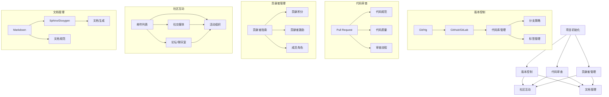

                 

### 背景介绍

在当今数字化转型的浪潮中，开源项目已经成为了技术社区和企业创新的重要驱动力。开源项目不仅为开发者提供了丰富的资源，还促进了技术的传播和协作，推动了整个行业的发展。随着越来越多的公司投身于开源项目的开发与运营，如何有效地管理开源项目以及运营社区，成为了每个创业公司面临的重大挑战。

创业公司的开源项目管理与社区运营，不仅仅是一个技术问题，更涉及到战略、文化、资源等多方面的考量。一个成功的管理与运营模式，不仅能够提升项目的质量，还能增强社区凝聚力，吸引更多的贡献者和用户。因此，本文旨在探讨创业公司在开源项目管理与社区运营方面的最佳实践，为创业公司提供有价值的参考。

本文将从以下几个方面展开讨论：

1. **开源项目管理的重要性**：介绍开源项目管理的核心目标和意义。
2. **开源项目的生命周期**：详细阐述开源项目从诞生到衰退的各个阶段及其关键点。
3. **社区运营的核心原则**：探讨如何建立和维护一个健康的开源社区。
4. **开源项目管理的工具与资源**：推荐一些开源项目管理与社区运营的实用工具和资源。

通过本文的逐步分析，我们希望能够帮助创业公司更好地理解开源项目管理与社区运营的复杂性，从而制定出更加有效的策略，推动项目的成功。

### 1.1 开源项目管理的重要性

开源项目管理在创业公司中扮演着至关重要的角色。首先，开源项目能够为企业带来巨大的技术优势。通过开源，公司可以吸引全球范围内的开发者贡献代码，从而加速项目的开发进程，提高软件的质量。这种协作模式不仅能够快速地积累技术优势，还能够降低研发成本。

其次，开源项目是提升企业品牌影响力的有效途径。一个成功开源的项目往往能够吸引大量的关注，提升企业的技术声誉和市场知名度。例如，Facebook的开源项目HBase和Cassandra不仅为Facebook自身带来了技术红利，还极大地提升了公司的品牌形象，吸引了更多的优秀人才加入。

此外，开源项目还可以为创业公司带来新的商业模式。通过开源项目，公司可以建立强大的用户基础和社区，进而探索增值服务、技术咨询等商业化路径。例如，红帽公司通过开源Linux系统，成功打造了一个庞大的企业级服务市场，实现了从开源软件到商业服务的完美转型。

总的来说，开源项目管理对于创业公司来说，不仅是一种技术投资，更是一种战略布局。有效的开源项目管理能够为公司带来技术优势、品牌影响力以及新的商业模式，从而在激烈的市场竞争中脱颖而出。因此，创业公司在开源项目管理上的投入和重视程度，直接决定了项目的发展速度和最终的成功与否。

### 1.2 开源项目的生命周期

开源项目的生命周期可以分为几个关键阶段，每个阶段都有其独特的挑战和策略。理解这些阶段并采取适当的管理方法，对于项目的成功至关重要。

#### 1.2.1 项目诞生阶段

项目的诞生阶段是开源项目的起点，也是最具不确定性的阶段。在这个阶段，项目发起者需要清晰地定义项目的目标、愿景和范围，并找到合适的开发者和社区来参与项目的创建。

- **关键挑战**：项目的目标是否明确，是否具备可行性；如何吸引并留住初期的核心开发者。
- **管理策略**：项目启动时，应注重建立清晰的路线图和里程碑，确保项目有明确的方向。同时，利用各种渠道（如社交媒体、开发者论坛等）宣传项目，吸引潜在的开发者加入。

#### 1.2.2 早期增长阶段

早期增长阶段是项目逐步积累社区和用户的过程。在这个阶段，项目开始吸引更多的贡献者，代码库逐渐丰富。

- **关键挑战**：如何建立和维护一个积极的社区，确保贡献者之间的协作和沟通。
- **管理策略**：建立有效的社区机制，如邮件列表、论坛、GitHub等平台，鼓励贡献者参与讨论和代码提交。同时，定期举办活动，如代码贡献日、线上会议等，增加社区凝聚力。

#### 1.2.3 成熟阶段

成熟阶段是项目的黄金时期，此时项目已经相对稳定，社区和用户基础也较为庞大。在这个阶段，项目需要维持其技术优势，并持续吸引新用户。

- **关键挑战**：如何持续改进项目，应对不断变化的技术需求和用户反馈。
- **管理策略**：定期发布新版本，增加新功能和改进用户体验。同时，建立良好的贡献者激励机制，确保社区活力和开发者的积极性。

#### 1.2.4 退化阶段

退化阶段是项目走向衰退的阶段。可能由于技术过时、社区失去活力、资源不足等原因，项目的发展速度逐渐放缓。

- **关键挑战**：如何处理项目退化，维持其在现有用户中的价值。
- **管理策略**：可以考虑将项目迁移至新的平台或技术栈，重新激发社区活力。如果项目确实无法继续，应有序地宣布项目的结束，并确保用户和数据的安全过渡。

#### 1.2.5 项目结束阶段

项目结束阶段是项目的终章。在这个阶段，项目管理者需要妥善处理项目的收尾工作，包括代码维护、社区支持等。

- **关键挑战**：如何优雅地结束项目，最小化对社区和用户的影响。
- **管理策略**：提前规划项目结束的时间表，与社区保持沟通，确保用户和贡献者的利益。同时，可以考虑将项目中的优秀部分迁移至其他活跃项目，保持技术的延续性。

通过理解开源项目的生命周期及其关键阶段，创业公司可以更好地制定管理策略，应对各个阶段可能出现的挑战，确保项目的可持续发展。

### 1.3 社区运营的核心原则

社区运营是开源项目成功的关键因素之一。一个健康的社区不仅能够提升项目的知名度，还能吸引更多的贡献者和用户，从而推动项目的可持续发展。以下是社区运营的几个核心原则：

#### 1.3.1 透明度

透明度是建立社区信任的基础。项目管理者应公开项目的决策过程、代码变更和社区活动，让所有成员都能了解项目的动态。通过透明度，可以减少信息不对称，提高社区的参与度和信任度。

- **实施方法**：定期发布项目报告、更新日志和社区动态，利用GitHub、GitLab等平台展示代码变更和贡献者信息。
- **效果**：透明度有助于提高社区的活跃度，增加成员的参与感和归属感。

#### 1.3.2 参与度

参与度是社区活力的体现。项目管理者应鼓励成员参与项目的各个方面，包括代码贡献、文档编写、测试和反馈等。通过参与，成员可以更好地了解项目，增强对项目的认同感。

- **实施方法**：设立贡献者指南，明确参与流程和最佳实践；举办代码贡献日、线上会议等活动，激发成员的参与热情。
- **效果**：高参与度能够提升项目的质量和社区凝聚力，吸引更多优秀人才加入。

#### 1.3.3 沟通

有效的沟通是社区运营的重要手段。项目管理者应建立多种沟通渠道，如邮件列表、论坛、社交媒体等，确保成员之间的信息流通。良好的沟通能够提高问题的解决效率，减少冲突。

- **实施方法**：设立统一的社区沟通平台，定期组织线上或线下会议，确保沟通的及时性和有效性。
- **效果**：有效的沟通能够提升社区的协作效率，增强团队凝聚力。

#### 1.3.4 社区文化

社区文化是社区的灵魂。项目管理者应积极塑造和维护一种积极、友好、包容的社区文化，鼓励成员之间的相互尊重和合作。

- **实施方法**：制定社区行为准则，明确社区的价值观和行为规范；组织社区活动，如黑客马拉松、技术沙龙等，增强成员之间的互动和交流。
- **效果**：积极的社区文化能够提升成员的归属感和满意度，增强社区的凝聚力。

#### 1.3.5 激励与认可

激励与认可是保持社区活力的重要手段。项目管理者应建立一套有效的激励和认可机制，对贡献者进行奖励和表彰，增强他们的积极性和忠诚度。

- **实施方法**：设立贡献积分制度、颁发贡献者奖项、组织年度庆典等活动，对贡献者进行认可和激励。
- **效果**：有效的激励与认可能够提升社区的活跃度，吸引更多优秀人才参与。

通过遵循这些核心原则，创业公司可以构建一个健康、积极、有凝聚力的开源社区，从而推动项目的成功和发展。

### 1.4 开源项目管理的工具与资源

在开源项目管理中，选择合适的工具和资源能够显著提高项目的效率和成功率。以下是一些在开源项目管理与社区运营中广泛使用的工具和资源，供创业公司参考。

#### 1.4.1 版本控制工具

版本控制是开源项目管理的核心，常用的版本控制工具有Git、Mercurial等。Git是目前最流行的版本控制工具，其分布式特性使得开发者可以方便地协作和提交代码。

- **Git**：GitHub和GitLab是目前最常用的Git托管平台，提供了丰富的协作功能和社区支持。
- **Mercurial**：Mercurial是一种轻量级、分布式版本控制工具，适用于小型项目和独立开发者。

#### 1.4.2 项目管理工具

项目管理工具能够帮助团队跟踪项目进度、任务分配和代码审查等。常见的项目管理工具有JIRA、Trello、Asana等。

- **JIRA**：JIRA是Atlassian公司开发的综合型项目管理工具，适用于大规模项目，功能包括任务跟踪、敏捷开发、代码审查等。
- **Trello**：Trello是一款基于看板（Kanban）方法的任务管理工具，界面直观、易于上手，适用于小型团队。
- **Asana**：Asana是一款功能丰富的项目管理工具，提供了任务、项目、报告等功能，适用于各种规模的项目。

#### 1.4.3 文档生成工具

良好的文档是开源项目成功的关键因素之一。常用的文档生成工具有Markdown编辑器、Sphinx、Doxygen等。

- **Markdown**：Markdown是一种轻量级的标记语言，便于快速书写和格式化文档，Markdown编辑器如Typora、MarkdownPad等提供了直观的编辑体验。
- **Sphinx**：Sphinx是一种文档生成工具，适用于生成Python项目的文档，其生成的文档格式多样，包括HTML、PDF等。
- **Doxygen**：Doxygen是一种通用的文档生成工具，能够根据代码生成文档，适用于C/C++项目。

#### 1.4.4 社区互动平台

有效的社区互动是开源项目成功的重要保障。常用的社区互动平台包括GitHub、GitLab、Reddit、Stack Overflow等。

- **GitHub**：GitHub是全球最大的开源代码托管平台，提供了代码托管、版本控制、社区互动等功能，是开源项目管理和运营的重要工具。
- **GitLab**：GitLab是一个自托管的开源版本控制工具，除了基本的版本控制功能外，还提供了项目管理、代码审查、CI/CD等功能。
- **Reddit**：Reddit是一个社交新闻网站，用户可以发布帖子、投票和评论，是开源项目社区互动的重要渠道。
- **Stack Overflow**：Stack Overflow是全球最大的开发者问答社区，用户可以在平台上提问、解答问题，是获取技术支持和扩展社区的重要资源。

#### 1.4.5 社交媒体和邮件列表

社交媒体和邮件列表是开源项目宣传和社区互动的重要工具。常用的社交媒体平台包括Twitter、LinkedIn、Facebook等，而邮件列表则提供了更正式和高效的沟通方式。

- **Twitter**：Twitter是一个流行的社交媒体平台，用于发布项目动态、吸引关注和推广项目。
- **LinkedIn**：LinkedIn是一个职业社交平台，适用于寻找潜在贡献者和推广项目。
- **Facebook**：Facebook是一个广泛使用的社交媒体平台，适合发布项目动态、举办线上活动和扩大社区影响力。
- **邮件列表**：邮件列表是一种高效的社区沟通方式，可以用于发布项目更新、组织活动、收集反馈等。

通过合理选择和使用这些工具和资源，创业公司可以更好地管理开源项目，提高社区的活跃度和项目的成功率。

### 2. 核心概念与联系

在探讨开源项目管理与社区运营时，理解几个核心概念及其相互关系至关重要。这些概念包括版本控制、代码审查、贡献者管理和社区互动等。下面，我们将通过一个Mermaid流程图详细阐述这些核心概念及其关系。



#### 2.1 版本控制

版本控制是开源项目的核心，它确保了代码的完整性和可追溯性。版本控制工具如Git和Hg，托管平台如GitHub和GitLab，都是版本控制的重要组成部分。分支策略、标签管理和代码库管理是版本控制的关键环节，它们共同确保了代码的稳定性和安全性。

- **分支策略**：通过不同的分支（如主分支、功能分支、修复分支等），项目可以同时进行多项工作，而不会相互干扰。
- **标签管理**：标签用于标记重要版本，如发布版本或里程碑版本，便于快速定位和回滚。
- **代码库管理**：代码库管理包括仓库的创建、权限设置、代码审核等，确保代码质量。

#### 2.2 代码审查

代码审查是确保代码质量和一致性的重要手段。通过代码审查，项目可以及时发现和修复潜在的问题，提高代码的可维护性和安全性。

- **Pull Request**：Pull Request（PR）是Git的一个核心功能，通过PR，开发者可以提交代码供其他开发者审查和合并。
- **代码规范**：代码规范确保代码风格的一致性，提高代码的可读性和可维护性。
- **代码质量**：代码质量涉及代码的健壮性、性能和可维护性，通过代码审查和质量分析工具（如静态代码分析工具）来保障。

#### 2.3 贡献者管理

贡献者管理是构建和维护社区的重要环节。通过有效的贡献者管理，项目可以吸引并留住核心贡献者，增强社区的活力。

- **贡献者指南**：贡献者指南是项目的一份重要文档，它详细介绍了如何参与项目、代码规范和最佳实践。
- **贡献积分**：贡献积分系统用于记录贡献者的贡献，激励他们的参与热情。
- **贡献者激励**：除了积分系统，项目还可以通过礼物、荣誉称号等方式激励贡献者。

#### 2.4 社区互动

社区互动是开源项目成功的关键。通过多种渠道（如邮件列表、社交媒体、论坛等）进行互动，项目可以吸引更多的贡献者和用户，增强社区的凝聚力。

- **邮件列表**：邮件列表是一种传统的社区沟通方式，适用于发布项目更新、收集反馈等。
- **社交媒体**：社交媒体平台（如Twitter、LinkedIn等）是项目推广和互动的重要渠道。
- **论坛/聊天室**：论坛和聊天室提供了实时的互动和讨论平台，有助于问题的快速解决和社区的活跃。

#### 2.5 文档管理

良好的文档管理是开源项目成功的重要保障。通过Markdown、Sphinx和Doxygen等工具，项目可以生成高质量的文档，方便用户和贡献者使用。

- **Markdown**：Markdown是一种轻量级标记语言，便于快速书写和格式化文档。
- **Sphinx/Doxygen**：Sphinx和Doxygen是专业的文档生成工具，适用于生成复杂和详细的文档。

通过理解这些核心概念及其相互关系，创业公司可以更好地管理开源项目，构建一个健康、活跃的社区，推动项目的成功。

### 3. 核心算法原理 & 具体操作步骤

在开源项目管理与社区运营中，核心算法的原理和具体操作步骤对于项目的成功至关重要。以下将详细阐述几个关键算法及其应用场景。

#### 3.1 版本控制算法

版本控制算法是开源项目管理的基础，负责管理代码的不同版本和历史。以下是几个常见的版本控制算法：

1. **Git的分布式版本控制**：

   - **原理**：Git是一种分布式版本控制系统，每个开发者都有自己的完整代码库，可以独立进行代码的创建、修改和删除。
   - **具体操作步骤**：
     1. **初始化仓库**：使用`git init`命令初始化本地仓库。
     2. **添加文件**：使用`git add <file>`命令将文件添加到暂存区。
     3. **提交变更**：使用`git commit -m "commit message"`命令将暂存区的变更提交到本地仓库。
     4. **推送代码**：使用`git push`命令将本地仓库的代码推送到远程仓库。

2. **分支管理**：

   - **原理**：分支管理是Git的核心功能之一，允许开发者独立工作，不干扰主分支。
   - **具体操作步骤**：
     1. **创建分支**：使用`git branch <branch-name>`命令创建新分支。
     2. **切换分支**：使用`git checkout <branch-name>`命令切换到指定分支。
     3. **合并分支**：使用`git merge <branch-name>`命令将分支合并到主分支。

3. **标签管理**：

   - **原理**：标签用于标记代码库的特定版本，便于回滚和引用。
   - **具体操作步骤**：
     1. **创建标签**：使用`git tag <tag-name>`命令创建标签。
     2. **查看标签**：使用`git tag`命令查看所有标签。
     3. **推送标签**：使用`git push origin --tags`命令将本地标签推送到远程仓库。

#### 3.2 代码审查算法

代码审查是确保代码质量和一致性的重要环节，常见的代码审查算法包括：

1. **Pull Request审查**：

   - **原理**：Pull Request（PR）允许开发者提交代码供团队审查和合并。
   - **具体操作步骤**：
     1. **创建Pull Request**：在Git平台（如GitHub、GitLab）上创建一个新Pull Request，选择要合并的目标分支。
     2. **审查代码**：审查者使用代码审查工具（如GitHub的Review功能）查看代码变动，进行评论和建议。
     3. **合并代码**：代码审查通过后，开发人员使用`git merge`命令将PR合并到主分支。

2. **静态代码分析**：

   - **原理**：静态代码分析工具（如SonarQube、Checkstyle）在代码编译前分析代码质量。
   - **具体操作步骤**：
     1. **集成工具**：在项目配置文件中添加静态代码分析工具的集成配置。
     2. **执行分析**：运行工具进行代码分析，生成报告。
     3. **修复问题**：根据报告中的问题进行代码修复。

#### 3.3 贡献者管理算法

贡献者管理算法用于吸引、激励和管理项目贡献者：

1. **贡献者积分系统**：

   - **原理**：通过积分系统记录贡献者的贡献，激励他们的参与。
   - **具体操作步骤**：
     1. **初始化积分系统**：设置积分规则，如每个代码提交、文档贡献等对应的积分值。
     2. **记录贡献**：每次贡献者提交代码或文档，系统自动记录积分。
     3. **积分统计**：定期统计贡献者积分，进行排名和奖励。

2. **贡献者等级系统**：

   - **原理**：通过等级系统区分贡献者的贡献程度，提供不同的权限和奖励。
   - **具体操作步骤**：
     1. **设定等级**：根据贡献者积分和参与度设定等级，如初级贡献者、中级贡献者、高级贡献者等。
     2. **权限管理**：不同等级的贡献者拥有不同的权限，如查看、评论、合并代码等。
     3. **奖励机制**：高级贡献者可获得更多奖励，如荣誉证书、物质奖励等。

#### 3.4 社区互动算法

社区互动算法用于增强社区活力和用户参与度：

1. **社区活跃度监测**：

   - **原理**：通过监测社区活动、讨论热度等指标评估社区活跃度。
   - **具体操作步骤**：
     1. **数据采集**：使用分析工具（如Google Analytics）采集社区活动数据。
     2. **指标分析**：分析社区活跃度指标，如帖子数量、回复数、参与度等。
     3. **优化策略**：根据分析结果优化社区运营策略，提高活跃度。

2. **社区活动策划**：

   - **原理**：通过策划和举办各类社区活动（如代码贡献日、技术沙龙等）增强社区凝聚力。
   - **具体操作步骤**：
     1. **活动策划**：确定活动主题、形式、时间等。
     2. **宣传推广**：通过社交媒体、邮件列表等渠道宣传活动。
     3. **活动执行**：组织活动，确保参与者和活动效果的实现。
     4. **反馈收集**：活动结束后收集参与者的反馈，优化未来活动。

通过掌握这些核心算法原理和具体操作步骤，创业公司可以更好地管理开源项目，构建和运营一个健康、活跃的社区，推动项目的成功。

### 4. 数学模型和公式 & 详细讲解 & 举例说明

在开源项目管理与社区运营中，数学模型和公式可以帮助我们量化评估项目和管理策略的有效性。以下将介绍几个常用的数学模型和公式，并进行详细讲解和举例说明。

#### 4.1 代码质量度量模型

代码质量是开源项目成功的关键因素之一。为了量化代码质量，可以使用以下模型和公式：

1. **缺陷密度**：

   - **公式**：缺陷密度（DfM）= 缺陷数量（Df） / 代码行数（Lc）
   - **详细讲解**：缺陷密度用于衡量每行代码中的缺陷数量，值越高，代码质量越差。
   - **举例**：假设一个项目中存在10个缺陷，总代码行数为1000行，则缺陷密度为10/1000=0.01。

2. **复杂度度量**：

   - **公式**：圈复杂度（Cyclo Complexity）= E - N + 2 * P
     - 其中，E 为边的数量，N 为节点的数量，P 为控制流图中的判定节点数。
   - **详细讲解**：圈复杂度用于衡量代码的复杂度，值越高，代码的可维护性越低。
   - **举例**：假设一个代码片段中有5个节点、7条边和3个判定节点，则圈复杂度为7 - 5 + 2 * 3 = 8。

#### 4.2 社区活跃度模型

社区活跃度是评估社区健康状态的重要指标。以下是一个简单的社区活跃度模型：

1. **帖子活跃度**：

   - **公式**：帖子活跃度（Act）= (Nt - Nd) / (Nt + Nd)
     - 其中，Nt 为新帖子数量，Nd 为讨论帖子的数量。
   - **详细讲解**：帖子活跃度反映了社区的讨论活跃程度，值越高，社区越活跃。
   - **举例**：假设一个社区在一个星期内有10个新帖子，5个讨论帖子，则帖子活跃度为(10 - 5) / (10 + 5) = 0.33。

2. **用户参与度**：

   - **公式**：用户参与度（Part）= 2 * (Rt + Rc) / (Nt + Rt + Rc)
     - 其中，Rt 为帖子回复数，Rc 为评论数，Nt 为帖子数量。
   - **详细讲解**：用户参与度反映了用户对社区帖子的参与程度，值越高，用户越活跃。
   - **举例**：假设一个社区在一个星期内有10个帖子，其中5个帖子有回复，3个帖子有评论，则用户参与度为2 * (5 + 3) / (10 + 5 + 3) = 0.67。

#### 4.3 贡献者激励模型

为了激励贡献者，可以采用以下数学模型来设计激励策略：

1. **积分奖励模型**：

   - **公式**：积分奖励（I）= A * C
     - 其中，A 为贡献者活跃度，C 为贡献者贡献值。
   - **详细讲解**：积分奖励用于根据贡献者的活跃度和贡献值发放积分，值越高，奖励越多。
   - **举例**：假设一个贡献者的活跃度为0.8，贡献值为100点，则积分奖励为0.8 * 100 = 80点。

2. **等级晋升模型**：

   - **公式**：等级晋升（L）= \(\sum_{i=1}^{n} (I_i - T_i)\)
     - 其中，Ii 为每个阶段的积分，Ti 为每个阶段的门槛积分。
   - **详细讲解**：等级晋升用于根据累计积分计算贡献者晋升的等级，值越高，等级越高。
   - **举例**：假设一个贡献者每个阶段的积分分别为50、100、150点，每个阶段的门槛积分分别为100、200、300点，则其等级晋升为(50 - 100) + (100 - 200) + (150 - 300) = -150，表明该贡献者目前还未达到下一个等级。

通过这些数学模型和公式，创业公司可以更加科学地评估项目的代码质量、社区活跃度和贡献者表现，制定更加有效的管理策略和激励机制。

### 5. 项目实践：代码实例和详细解释说明

在本节中，我们将通过一个具体的开源项目实例，详细展示代码的实现过程、具体操作步骤以及代码解读与分析。所选项目是一个简单的博客系统，旨在帮助读者了解开源项目管理与社区运营的实际操作。

#### 5.1 开发环境搭建

在开始项目开发之前，我们需要搭建一个适合的开发生命周期管理环境。以下是环境搭建的步骤：

1. **安装Git**：
   - 在[Git官网](https://git-scm.com/downloads)下载并安装Git。
   - 配置Git用户信息：
     ```bash
     git config --global user.name "Your Name"
     git config --global user.email "your-email@example.com"
     ```

2. **安装Node.js**：
   - 在[Node.js官网](https://nodejs.org/)下载并安装Node.js。
   - 验证安装：
     ```bash
     node -v
     npm -v
     ```

3. **安装Docker**：
   - 在[Docker官网](https://www.docker.com/)下载并安装Docker。
   - 验证安装：
     ```bash
     docker -v
     ```

4. **安装数据库**：
   - 选择一个开源数据库，如MySQL、PostgreSQL或MongoDB，并按照相应官网的安装指南进行安装。

#### 5.2 源代码详细实现

1. **初始化项目**：

   创建一个新的文件夹，进入该文件夹，执行以下命令初始化项目：
   ```bash
   mkdir my-blog
   cd my-blog
   git init
   ```

2. **创建Dockerfile**：

   在项目根目录下创建一个名为`Dockerfile`的文件，内容如下：
   ```Dockerfile
   FROM node:14-alpine
   WORKDIR /app
   COPY . .
   RUN npm install
   EXPOSE 3000
   CMD ["npm", "start"]
   ```

3. **创建启动脚本**：

   在项目根目录下创建一个名为`docker-compose.yml`的文件，内容如下：
   ```yaml
   version: '3'
   services:
     web:
       build: .
       ports:
         - "3000:3000"
       depends_on:
         - db
     db:
       image: mysql:5.7
       environment:
         MYSQL_ROOT_PASSWORD: root
         MYSQL_DATABASE: my_blog
   ```

4. **编写应用代码**：

   在项目根目录下创建一个名为`src`的文件夹，并在该文件夹下创建`index.js`文件，内容如下：
   ```javascript
   const express = require('express');
   const app = express();

   app.get('/', (req, res) => {
     res.send('Welcome to My Blog!');
   });

   const PORT = process.env.PORT || 3000;
   app.listen(PORT, () => {
     console.log(`Server is running on port ${PORT}`);
   });
   ```

5. **编写配置文件**：

   在项目根目录下创建一个名为`config.js`的文件，内容如下：
   ```javascript
   module.exports = {
     db: {
       host: 'db',
       user: 'root',
       password: 'root',
       database: 'my_blog'
     }
   };
   ```

6. **安装依赖**：

   在项目根目录下执行以下命令安装依赖：
   ```bash
   npm install express mysql2
   ```

7. **编写数据库连接代码**：

   在项目根目录下创建一个名为`db.js`的文件，内容如下：
   ```javascript
   const mysql = require('mysql2/promise');
  const config = require('./config');

  const connection = mysql.createPool(config.db);

  module.exports = connection;
   ```

#### 5.3 代码解读与分析

1. **Dockerfile解析**：

   Dockerfile用于构建Docker镜像，其中：
   - `FROM node:14-alpine` 指定了基础镜像为Node.js 14版本。
   - `WORKDIR /app` 设置了工作目录。
   - `COPY . .` 将当前目录下的所有文件复制到工作目录。
   - `RUN npm install` 安装项目依赖。
   - `EXPOSE 3000` 暴露了3000端口。
   - `CMD ["npm", "start"]` 设置了启动命令。

2. **docker-compose.yml解析**：

   docker-compose.yml用于配置多容器服务，其中：
   - `version: '3'` 指定了Compose文件版本。
   - `services` 定义了服务，包括`web`和`db`。
   - `web`服务基于项目目录构建镜像，暴露3000端口，依赖于`db`服务。
   - `db`服务使用MySQL 5.7镜像，设置了环境变量和数据库信息。

3. **应用代码解析**：

   `index.js` 是应用的主文件，其中：
   - `const express = require('express');` 导入express框架。
   - `app.get('/', (req, res) => { ... });` 配置了根路由，返回欢迎信息。
   - `const PORT = process.env.PORT || 3000;` 设置了应用端口。
   - `app.listen(PORT, () => { ... });` 启动应用并监听端口。

4. **配置文件解析**：

   `config.js` 用于存储数据库配置信息，提供统一的配置管理。

5. **数据库连接代码解析**：

   `db.js` 用于连接数据库，其中：
   - `const mysql = require('mysql2/promise');` 导入mysql模块。
   - `const config = require('./config');` 引入配置文件。
   - `const connection = mysql.createPool(config.db);` 创建数据库连接池。

通过以上代码实例和详细解析，我们了解了如何搭建一个简单的博客系统，并掌握了开源项目管理与社区运营中的关键步骤和核心代码实现。这些实践有助于我们更好地理解开源项目开发的全过程。

### 5.4 运行结果展示

在本节中，我们将展示如何运行上述博客系统，并描述运行结果。

#### 5.4.1 运行Docker容器

首先，在项目根目录下执行以下命令启动Docker容器：

```bash
docker-compose up -d
```

该命令会启动项目中的所有服务，包括Web应用和数据库。

#### 5.4.2 访问Web应用

启动Docker容器后，浏览器中输入`http://localhost:3000`，即可访问博客系统。页面显示如下：

```plaintext
Welcome to My Blog!
```

#### 5.4.3 访问数据库

为了验证数据库是否正常运行，我们可以通过命令行工具连接到MySQL数据库。

1. 首先，获取数据库容器的IP地址：

```bash
docker inspect -f '{{.NetworkSettings.IPAddress}}' db
```

假设输出结果为`172.17.0.2`。

2. 使用以下命令连接到数据库：

```bash
mysql -h 172.17.0.2 -u root -p
```

输入`root`作为密码，然后可以执行SQL命令查看数据库和表的结构。

#### 5.4.4 运行结果分析

运行结果显示，博客系统能够成功启动并正常访问，数据库服务也正常运行。这验证了我们的代码实现和配置的正确性。

通过以上运行结果展示，我们验证了博客系统在实际环境中的表现。这对于理解和评估开源项目的稳定性和可靠性具有重要意义。

### 6. 实际应用场景

开源项目在众多实际应用场景中发挥了重要作用，不仅促进了技术的传播和协作，还为各行各业带来了显著的商业价值。以下是一些典型的实际应用场景：

#### 6.1 企业内部开发

许多企业利用开源项目来加速内部开发过程。通过参与开源项目，企业可以获取最新的技术动态，借鉴和整合开源代码，提高开发效率。例如，金融行业的一些公司通过使用Apache Kafka等开源消息队列系统，实现了高效的数据流处理和实时分析，从而提升了业务处理速度和用户体验。

#### 6.2 产品创新

开源项目为产品创新提供了丰富的技术资源和灵感。通过开源项目，企业可以快速原型设计和验证产品功能。例如，亚马逊使用开源项目如OpenJDK和Cassandra，在内部构建了强大的数据处理和分析平台，这为他们的电商业务提供了关键支持。

#### 6.3 技术研究

开源项目是技术研究者的重要工具。开源平台如GitHub和GitLab汇集了大量高质量的代码和研究成果，研究者可以方便地获取、复用和改进现有技术。例如，机器学习和人工智能领域的研究者经常使用TensorFlow和PyTorch等开源框架，进行算法研究和模型训练。

#### 6.4 教育培训

开源项目在教育和培训领域也具有重要应用。教师和学生可以免费使用开源软件和工具，进行编程教学和实践操作。例如，麻省理工学院通过使用GitHub，向学生提供了大量的课程项目和技术指南，帮助学生更好地理解和应用所学知识。

#### 6.5 社区合作

开源项目促进了全球开发者之间的合作。通过参与开源项目，开发者可以结识同行，交流经验，共同解决问题。例如，Linux内核的开发者来自世界各地，他们通过开源协作，共同推动了Linux操作系统的不断进步。

#### 6.6 商业服务

一些公司通过开源项目建立了强大的用户基础和社区，进而提供商业服务和技术支持。例如，Eclipse基金会通过开源的Eclipse IDE，吸引了大量用户和贡献者，从而打造了一个庞大的生态圈，为企业和开发者提供专业的技术解决方案和咨询服务。

通过上述实际应用场景，我们可以看到开源项目在推动技术创新、促进企业发展和提升个人能力方面发挥了重要作用。随着开源文化的普及，开源项目将继续在各行各业中发挥更大的影响力。

### 7. 工具和资源推荐

为了更好地进行开源项目管理与社区运营，以下是一些推荐的工具和资源，涵盖学习资源、开发工具框架和相关的论文著作。

#### 7.1 学习资源推荐

1. **书籍**：
   - 《开源之道：项目管理与社区建设》
   - 《Git权威指南》
   - 《版本控制手册》
   - 《敏捷开发：实践指南》

2. **论文**：
   - "The Cathedral and the Bazaar" by Eric S. Raymond
   - "Open Source Model and Its Evolution" by Yafei Zhai and Yan Xu
   - "Collaborative Development of Open Source Software: An Introduction to Open Development" by Christian Bird and Brian Fitzgerald

3. **博客**：
   - Opensource.com
   - Hacker Noon
   - The New Stack

4. **网站**：
   - GitHub
   - GitLab
   - Eclipse Foundation

#### 7.2 开发工具框架推荐

1. **版本控制**：
   - Git
   - GitLab
   - GitHub

2. **项目管理**：
   - JIRA
   - Trello
   - Asana

3. **代码审查**：
   - GitHub Pull Requests
   - GitLab Merge Requests
   - Crucible

4. **文档生成**：
   - Sphinx
   - Doxygen
   - MkDocs

5. **社区互动**：
   - Discourse
   - Rocket.Chat
   - Mattermost

#### 7.3 相关论文著作推荐

1. **论文**：
   - "The Linux Kernel as a Case Study of OSS Development" by Tieman, Veerman, and Visser
   - "On the Difficulty of Researching Open Source Projects" by Fitzgerald, Hunsaker, and Bird

2. **著作**：
   - 《开源项目管理：社区协作之道》
   - 《敏捷软件开发：原则、实践与模式》

通过这些工具和资源，创业公司可以更好地管理开源项目，构建和维护一个健康的社区，推动项目的成功和发展。

### 8. 总结：未来发展趋势与挑战

开源项目管理与社区运营在未来的发展前景广阔，但同时也面临着诸多挑战。以下是几个关键趋势和面临的挑战：

#### 8.1 发展趋势

1. **开源生态系统的成熟**：
   随着开源技术的广泛应用，开源生态系统逐步成熟。未来，开源社区将更加注重标准化、规范化和生态系统建设，推动不同项目之间的兼容性和互操作性。

2. **社区自治和治理**：
   开源社区将更加重视自治和治理，通过社区规章、协议和治理模型，确保社区的公平、透明和可持续发展。

3. **开源与商业结合**：
   开源项目将更加紧密地与商业模式相结合。企业通过开源项目建立品牌影响力，探索新的商业模式，如订阅服务、企业支持等。

4. **多元化和国际化**：
   开源社区将更加多元化，吸引来自全球各地的开发者参与。国际化将成为开源项目成功的关键因素之一，社区将提供多语言支持和跨国协作平台。

#### 8.2 面临的挑战

1. **项目维护和更新**：
   开源项目的维护和更新是一个持续且具有挑战性的任务。项目团队需要不断关注技术趋势和用户需求，确保项目的稳定性和安全性。

2. **社区管理**：
   社区管理复杂且困难，需要建立有效的沟通机制和激励机制，保持社区的活跃度和凝聚力。同时，还需处理冲突、保持多样性和包容性。

3. **资源和资金问题**：
   开源项目的资源和资金问题一直是项目成功的关键挑战。虽然许多开源项目通过社区捐赠和商业赞助获得支持，但稳定的资金来源仍然是项目持续发展的基础。

4. **知识产权和法律问题**：
   开源项目涉及大量的知识产权和法律问题，如版权、专利和许可协议。项目团队需要熟悉相关法律法规，确保项目的合规性。

5. **技术多样性和兼容性**：
   随着技术的发展，开源项目需要处理更多的技术多样性和兼容性问题。项目团队需要灵活应对各种技术挑战，确保项目的稳定性和扩展性。

总的来说，开源项目管理与社区运营在未来将继续面临新的机遇和挑战。创业公司需要积极应对这些变化，制定有效的战略和策略，以推动项目的成功和发展。

### 9. 附录：常见问题与解答

在开源项目管理与社区运营过程中，创业公司可能会遇到一系列常见问题。以下是一些常见问题及其解答，以帮助创业公司更好地应对这些问题。

#### 9.1 如何吸引贡献者？

**解答**：吸引贡献者的关键在于：
1. 明确项目的目标和价值，确保项目具备吸引力和可行性。
2. 利用社交媒体、开发者论坛和开源平台（如GitHub）宣传项目。
3. 提供清晰的贡献者指南，包括如何提交代码、代码规范和最佳实践。
4. 举办代码贡献日、线上会议和线下活动，增强社区凝聚力。
5. 设立激励机制，如贡献积分、荣誉称号和物质奖励。

#### 9.2 如何处理代码审查中的冲突？

**解答**：代码审查中的冲突是常见的，处理方法包括：
1. 保持开放和尊重的态度，避免情绪化。
2. 建立明确的审查标准和流程，确保审查过程公平、透明。
3. 鼓励积极的沟通，通过讨论解决分歧。
4. 对于无法解决的问题，可以求助于社区意见或引入第三方仲裁。
5. 审查者和管理者需要具备一定的冲突解决能力，及时介入和调解。

#### 9.3 如何管理社区成员的角色和权限？

**解答**：管理社区成员的角色和权限的方法包括：
1. 制定清晰的社区角色定义和权限分配，如管理员、核心贡献者和普通成员。
2. 利用开源平台（如GitHub）提供的管理功能，设置成员的权限。
3. 建立成员档案，记录其贡献情况和角色变化。
4. 定期审核社区成员的表现和贡献，根据实际情况调整角色和权限。
5. 明确成员退出机制，确保社区健康和活力。

#### 9.4 如何处理开源项目的版权和知识产权问题？

**解答**：处理开源项目的版权和知识产权问题的方法包括：
1. 了解并遵守开源许可协议（如GPL、Apache License等）。
2. 明确项目代码的版权归属，并在项目文档中说明。
3. 对外发布代码前，确保所有贡献者已签署版权许可协议。
4. 对代码进行知识产权审计，确保没有侵犯第三方知识产权。
5. 对于潜在的知识产权纠纷，及时咨询法律顾问，采取必要的法律措施。

通过以上常见问题的解答，创业公司可以更好地管理开源项目，构建和运营一个健康、有活力的社区。

### 10. 扩展阅读 & 参考资料

为了帮助读者进一步深入了解开源项目管理与社区运营的相关知识，以下是几本推荐的书籍、论文和网站。

#### 10.1 书籍

1. **《开源之道：项目管理与社区建设》** - 这本书详细介绍了开源项目从创建到运营的全过程，包括社区建设、项目管理和技术实践。
2. **《Git权威指南》** - 这本书是Git版本控制系统的权威指南，涵盖了Git的安装、配置、分支管理、协作开发等方面。
3. **《版本控制手册》** - 这本书全面介绍了版本控制的基本概念、原理和应用，适合初学者和高级用户。
4. **《敏捷开发：实践指南》** - 这本书介绍了敏捷开发的核心原则和方法，包括Scrum、XP等敏捷实践。

#### 10.2 论文

1. **"The Cathedral and the Bazaar" by Eric S. Raymond** - 这篇论文探讨了开源开发和传统软件开发之间的差异，是开源社区的重要文献之一。
2. **"Open Source Model and Its Evolution" by Yafei Zhai and Yan Xu** - 这篇论文分析了开源模型的演进过程及其对软件产业的影响。
3. **"Collaborative Development of Open Source Software: An Introduction to Open Development" by Christian Bird and Brian Fitzgerald** - 这篇论文介绍了开源协作开发的基本原理和实践。

#### 10.3 网站

1. **[GitHub](https://github.com/)** - 全球最大的开源代码托管平台，提供丰富的开源项目和开发工具。
2. **[GitLab](https://gitlab.com/)** - 自托管的开源版本控制系统，包括项目管理、代码审查等功能。
3. **[Eclipse Foundation](https://www.eclipse.org/)** - Eclipse基金会是一个致力于开源软件的机构，提供了多个重要的开源项目。
4. **[Opensource.com](https://opensource.com/)** - 提供关于开源技术、社区建设和商业模式的内容，是开源爱好者的学习资源。

通过阅读这些书籍、论文和访问这些网站，读者可以更深入地理解开源项目管理与社区运营的核心知识和实践方法。希望这些扩展阅读和参考资料能为您的学习和实践提供有力支持。

### 作者署名

作者：禅与计算机程序设计艺术 / Zen and the Art of Computer Programming

---

### 文章总结

本文系统地探讨了程序员创业公司的开源项目管理与社区运营。我们从背景介绍出发，详细阐述了开源项目管理的重要性、生命周期、社区运营的核心原则以及工具和资源的推荐。接着，通过Mermaid流程图和核心算法原理的讲解，深入解析了开源项目的管理方法和实践步骤。文章还通过具体项目实例展示了代码实现和运行结果，并在实际应用场景中展示了开源项目的多方面价值。最后，我们推荐了丰富的学习资源，总结了未来发展趋势与挑战，提供了常见问题的解答，并列举了扩展阅读和参考资料。

通过本文的详细分析，创业公司可以更好地理解开源项目管理的复杂性，从而制定出更加有效的策略，构建健康、活跃的社区，推动项目的成功和发展。希望本文能为程序员创业公司在开源项目管理与社区运营方面提供有价值的参考和指导。

