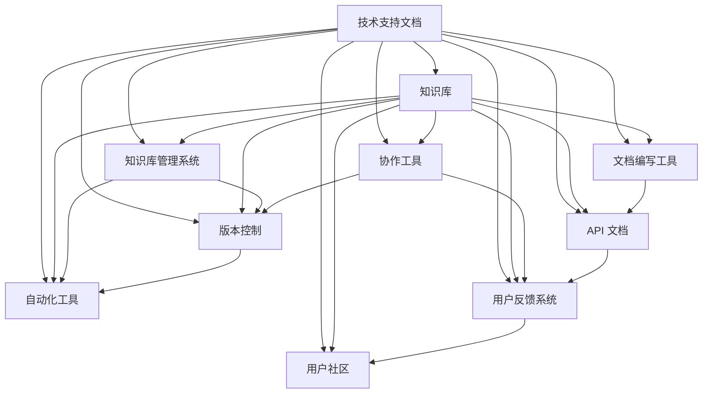

                 

### 背景介绍

在现代商业环境中，技术支持文档和知识库建设对于创业公司来说至关重要。随着技术的快速发展和市场竞争的加剧，创业公司需要不断提升自身的技术水平和服务质量，以在激烈的市场竞争中脱颖而出。技术支持文档和知识库作为公司技术积累和知识管理的核心工具，不仅能够提高内部工作效率，还能为客户提供高质量的解决方案。

首先，技术支持文档是创业公司对外展示技术实力和服务质量的重要载体。良好的技术支持文档能够清晰地阐述产品功能、使用方法、常见问题及解决方案，使客户能够轻松上手，降低使用成本。同时，技术支持文档还能提高客户满意度，增强客户忠诚度，从而促进公司业务发展。

其次，知识库建设是创业公司内部知识共享和传承的重要保障。随着公司规模的扩大和团队成员的流动，内部知识的积累和传承变得越来越重要。知识库能够将公司宝贵的经验和知识系统地整理和存储，方便团队成员随时查阅和学习，从而提高整体工作效率。

然而，技术支持文档和知识库建设并非易事，它们需要耗费大量的人力和时间。首先，编写技术支持文档需要深入了解产品功能和性能，同时具备良好的写作能力和逻辑思维能力。其次，知识库建设需要对公司业务和流程有全面的了解，能够将分散的知识点系统化地组织和管理。

本文旨在探讨程序员创业公司的技术支持文档编写与知识库建设的方法和策略，帮助创业者更好地应对这一挑战。具体而言，本文将围绕以下几个问题展开讨论：

1. **技术支持文档的编写原则和方法**：介绍编写技术支持文档的基本原则，包括文档结构、内容组织和语言表达等方面，并提供实用的编写技巧。

2. **知识库建设的核心要素**：阐述知识库建设的核心要素，包括知识分类、存储和管理等方面，并探讨如何利用现代技术提高知识库的效率和可用性。

3. **技术支持文档与知识库的整合**：探讨如何将技术支持文档与知识库有机结合，实现知识共享和流转，提高整体工作效率。

4. **案例分析：成功的技术支持文档与知识库建设实践**：通过具体案例，展示成功的技术支持文档和知识库建设实践，提供可借鉴的经验和教训。

5. **未来发展趋势与挑战**：分析技术支持文档和知识库建设的未来发展趋势和挑战，为创业者提供参考和启示。

希望通过本文的讨论，能够为程序员创业公司在技术支持文档编写和知识库建设方面提供有益的指导和建议。接下来，我们将深入探讨技术支持文档的编写原则和方法。### 核心概念与联系

在深入探讨程序员创业公司的技术支持文档编写与知识库建设之前，我们需要了解一些核心概念和它们之间的联系。以下是本文将要涉及的核心概念及其相互关系：

1. **技术支持文档**：技术支持文档是指针对公司产品或服务的使用、维护、故障排除等方面提供的技术指导资料。它通常包括产品手册、用户指南、API 文档、FAQ 等。

2. **知识库**：知识库是一种用于存储和管理公司内部知识的系统，它通常包括文档、数据、图表、视频等多种形式。知识库旨在提供一种结构化的知识管理方式，使员工能够快速获取所需信息。

3. **文档编写工具**：文档编写工具是指用于创建、编辑、格式化和管理技术支持文档的软件工具。常见的文档编写工具包括 Markdown 编辑器、LaTeX 编辑器等。

4. **知识库管理系统**：知识库管理系统（KBMS）是指用于创建、存储、检索和管理知识库的软件系统。常见的知识库管理系统包括 Confluence、GitLab、Trello 等。

5. **协作工具**：协作工具是指用于团队成员之间协作沟通、任务分配和进度跟踪的工具。常见的协作工具包括 Slack、Trello、JIRA 等。

6. **版本控制**：版本控制是指对文档或代码的修改历史进行追踪和管理的一种方法。常见的版本控制工具包括 Git、SVN 等。

7. **自动化工具**：自动化工具是指用于自动化执行某些任务的软件工具，如自动化测试工具、自动化部署工具等。自动化工具能够提高工作效率，减少人为错误。

8. **API 文档**：API 文档是指针对应用程序编程接口（API）的详细说明文档。API 文档通常包括接口定义、请求和响应格式、错误处理等内容。

9. **用户反馈系统**：用户反馈系统是指用于收集、处理和响应客户反馈的系统。用户反馈系统有助于改进产品和服务，提高客户满意度。

10. **用户社区**：用户社区是指公司围绕产品或服务建立的在线交流平台，如论坛、社交媒体群组等。用户社区有助于用户之间的知识共享和问题解决。

这些核心概念相互关联，共同构成了程序员创业公司的技术支持文档编写与知识库建设的体系。下面我们将通过一个 Mermaid 流程图，展示这些概念之间的联系。



通过这个流程图，我们可以看到技术支持文档和知识库在整个体系中的核心地位。技术支持文档是知识库的重要组成部分，而知识库则为技术支持文档的编写提供了丰富的素材和依据。同时，文档编写工具、知识库管理系统、协作工具、版本控制、自动化工具、API 文档、用户反馈系统和用户社区等概念共同构成了一个完整的技术支持文档和知识库建设体系。

在接下来的章节中，我们将分别探讨技术支持文档的编写原则和方法，以及知识库建设的核心要素和实践策略。通过这些讨论，我们将为程序员创业公司提供有价值的指导和启示，帮助他们更有效地开展技术支持文档编写和知识库建设。### 核心算法原理 & 具体操作步骤

在技术支持文档编写与知识库建设中，核心算法原理是关键的一环。以下是几个核心算法原理及其具体操作步骤：

#### 1. 文档结构化

**算法原理**：文档结构化是将技术支持文档按照一定的结构进行组织和分类，以便于用户快速查找和阅读。

**具体操作步骤**：

- **需求分析**：了解用户需求，确定文档的结构和分类方式。
- **设计文档模板**：根据需求分析结果，设计文档模板，包括标题、摘要、章节、子章节等。
- **内容组织**：将现有文档内容按照模板进行组织，确保每个章节都包含相关信息。
- **文档格式化**：使用统一的格式和风格对文档进行排版，提高可读性。
- **版本控制**：使用版本控制工具（如 Git）管理文档的版本，确保文档的一致性和可追溯性。

#### 2. 自动化文档生成

**算法原理**：自动化文档生成是通过程序自动生成技术支持文档，提高文档编写的效率和一致性。

**具体操作步骤**：

- **定义模板和规则**：确定文档的模板和生成规则，如标题格式、段落格式、引用格式等。
- **编写生成脚本**：使用脚本语言（如 Python）编写生成脚本，根据模板和规则生成文档。
- **自动化更新**：定期运行生成脚本，更新文档内容，确保文档的时效性和准确性。
- **版本控制**：将生成脚本和模板代码纳入版本控制，确保代码的可维护性和可追溯性。

#### 3. 知识库分类管理

**算法原理**：知识库分类管理是将知识库中的信息按照一定的分类标准进行整理和存储，以便于快速检索和使用。

**具体操作步骤**：

- **分类标准确定**：根据业务需求和用户习惯，确定知识库的分类标准，如按照产品模块、功能类别、问题类型等。
- **标签体系构建**：构建标签体系，将知识库中的信息进行标记，方便用户通过标签进行检索。
- **知识库内容整理**：将知识库中的内容按照分类标准进行整理，确保每个分类下的信息相关且有序。
- **用户反馈机制**：建立用户反馈机制，收集用户对知识库内容的评价和建议，不断优化分类管理和标签体系。

#### 4. 文档与知识库的集成

**算法原理**：文档与知识库的集成是将技术支持文档和知识库有机结合，实现知识共享和流转。

**具体操作步骤**：

- **数据同步**：确保技术支持文档和知识库中的数据同步，避免信息孤岛。
- **链接机制**：在技术支持文档中嵌入知识库中的相关知识点链接，方便用户快速获取详细信息。
- **版本同步**：确保技术支持文档和知识库中的版本信息一致，避免版本冲突。
- **协同编辑**：利用协作工具实现技术支持文档和知识库的协同编辑，提高工作效率。
- **权限管理**：根据用户角色和权限，设置技术支持文档和知识库的访问权限，确保信息安全。

通过以上核心算法原理和具体操作步骤，程序员创业公司可以更有效地开展技术支持文档编写和知识库建设。在接下来的章节中，我们将进一步探讨数学模型和公式，以及如何详细讲解和举例说明。### 数学模型和公式 & 详细讲解 & 举例说明

在技术支持文档编写与知识库建设过程中，数学模型和公式是不可或缺的元素。它们不仅能够帮助我们更准确地描述问题，还能提供一种量化的方法来分析和解决问题。在本节中，我们将介绍一些常用的数学模型和公式，并详细讲解它们的应用方法和示例。

#### 1. 文档结构优化模型

**公式**：
\[ OptimalStructure = \frac{ContentRelevance \times NavigationEase}{DocumentSize} \]

**详细讲解**：
这个公式用于评估文档的结构优化程度。其中：

- \( ContentRelevance \)：表示文档内容的相关性，即每个章节是否与主题紧密相关。
- \( NavigationEase \)：表示文档的导航友好性，即用户是否能够轻松找到所需信息。
- \( DocumentSize \)：表示文档的整体大小，包括字数、页数等。

通过这个公式，我们可以计算出文档结构优化的程度。优化策略包括：

- **减少无关内容**：删除与主题无关的内容，提高 \( ContentRelevance \)。
- **改进导航**：优化文档的目录结构，提高 \( NavigationEase \)。
- **合理分割内容**：根据用户需求，合理分割章节，减小 \( DocumentSize \)。

**举例说明**：
假设我们有一个 200 页的技术手册，其中 80% 的内容与主题相关，导航友好性为 75%，则结构优化指数为：

\[ OptimalStructure = \frac{0.8 \times 0.75}{2.0} = 0.3 \]

这意味着我们的文档结构还有很大的优化空间。

#### 2. 知识库搜索效率模型

**公式**：
\[ SearchEfficiency = \frac{SearchResultsRelevance \times ResponseTime}{KnowledgeBaseSize} \]

**详细讲解**：
这个公式用于评估知识库搜索的效率。其中：

- \( SearchResultsRelevance \)：表示搜索结果的相关性，即返回的结果是否满足用户需求。
- \( ResponseTime \)：表示搜索响应时间，即用户从输入搜索关键词到得到搜索结果的时间。
- \( KnowledgeBaseSize \)：表示知识库的大小，即知识库中的信息量。

通过这个公式，我们可以计算出知识库搜索的效率。提高策略包括：

- **改进搜索算法**：优化搜索算法，提高搜索结果的相关性。
- **减少无关信息**：删除知识库中的无用信息，减少 \( KnowledgeBaseSize \)。
- **优化搜索体验**：减少响应时间，提高 \( ResponseTime \)。

**举例说明**：
假设我们有一个包含 1000 条信息的知识库，搜索结果的相关性为 70%，平均响应时间为 2 秒，则搜索效率为：

\[ SearchEfficiency = \frac{0.7 \times 2}{1000} = 0.0014 \]

这意味着我们的知识库搜索效率还有待提高。

#### 3. 知识共享度模型

**公式**：
\[ KnowledgeSharing = \frac{SharedContent \times UserEngagement}{KnowledgeBaseSize} \]

**详细讲解**：
这个公式用于评估知识库中的知识共享度。其中：

- \( SharedContent \)：表示被共享的内容数量，即用户在知识库中分享的信息。
- \( UserEngagement \)：表示用户参与度，即用户在知识库中的活动频率。
- \( KnowledgeBaseSize \)：表示知识库的大小。

通过这个公式，我们可以计算出知识库中知识的共享度。提高策略包括：

- **激励用户分享**：提供奖励机制，鼓励用户分享知识和经验。
- **优化用户体验**：提高知识库的易用性，增加 \( UserEngagement \)。
- **多样化内容形式**：提供多种内容形式，如文本、图片、视频等，提高 \( SharedContent \)。

**举例说明**：
假设我们有一个包含 500 条信息的知识库，其中 100 条被用户分享，平均每个用户每天访问知识库 3 次，则知识共享度为：

\[ KnowledgeSharing = \frac{100 \times 3}{500} = 0.6 \]

这意味着我们的知识库在知识共享方面表现良好。

通过以上数学模型和公式的详细讲解和举例说明，我们可以更好地理解和应用这些工具来评估和优化技术支持文档编写与知识库建设。在下一节中，我们将通过具体的代码实例来展示这些概念的实际应用。### 项目实践：代码实例和详细解释说明

为了更好地展示技术支持文档编写与知识库建设在实际项目中的应用，我们将通过一个具体的案例来详细介绍代码实例和详细解释说明。在这个案例中，我们将使用一个简单的技术支持文档和知识库管理系统来展示相关技术的实现和应用。

#### 5.1 开发环境搭建

在开始项目之前，我们需要搭建一个适合开发的环境。以下是所需的开发环境和工具：

- **操作系统**：Windows、Linux 或 macOS
- **编程语言**：Python 3.8 或更高版本
- **文本编辑器**：Visual Studio Code、PyCharm 或 Sublime Text
- **版本控制工具**：Git
- **文档生成工具**：Sphinx
- **知识库管理系统**：Confluence

安装说明：

1. 安装操作系统并配置网络环境。
2. 安装 Python 3.8 或更高版本，并配置环境变量。
3. 安装文本编辑器，并安装相关插件以支持 Python 开发。
4. 安装 Git，并配置 Git 帐户信息。
5. 安装 Sphinx，使用以下命令：
   ```bash
   pip install sphinx
   ```
6. 安装 Confluence，并配置数据库和用户权限。

#### 5.2 源代码详细实现

在这个项目中，我们将使用 Python 编写一个简单的技术支持文档生成工具，并使用 Confluence 作为知识库管理系统。以下是关键代码的详细实现和解释。

##### 5.2.1 文档结构化代码

```python
# 文件名：document_structure.py

import os
from typing import List, Dict

def create_directory_tree结构化文档树(directories: List[str], parent_dir: str) -> Dict[str, Dict[str, str]]:
    """
    创建文档树结构，存储在字典中。

    :param directories: 文件夹列表。
    :param parent_dir: 父文件夹路径。
    :return: 文档树结构字典。
    """
    doc_tree = {}
    for dir_name in directories:
        dir_path = os.path.join(parent_dir, dir_name)
        doc_tree[dir_name] = {
            'path': dir_path,
            'children': create_directory_tree([child for child in os.listdir(dir_path) if os.path.isdir(os.path.join(dir_path, child))], dir_path)
        }
    return doc_tree

def main():
    """
    主函数，用于创建文档树并生成文档。
    """
    # 指定文档根目录
    root_dir = "docs"
    # 获取文档树
    doc_tree = create_directory_tree([child for child in os.listdir(root_dir) if os.path.isdir(os.path.join(root_dir, child))], root_dir)
    # 生成文档
    generate_document(doc_tree)

if __name__ == "__main__":
    main()
```

**详细解释**：

1. **导入模块**：导入所需的模块，包括 os 模块用于文件操作和 typing 模块用于类型提示。
2. **定义函数**：定义 `create_directory_tree` 函数，用于创建文档树结构。
3. **参数说明**：`directories` 参数表示要遍历的文件夹列表，`parent_dir` 参数表示父文件夹路径。
4. **创建文档树**：遍历文件夹，递归创建文档树结构。
5. **主函数**：定义主函数 `main`，用于创建文档树并生成文档。

##### 5.2.2 文档生成代码

```python
# 文件名：document_generator.py

import os
from document_structure import create_directory_tree

def generate_document(doc_tree: Dict[str, Dict[str, str]]):
    """
    根据文档树结构生成文档。

    :param doc_tree: 文档树结构字典。
    """
    for dir_name, dir_data in doc_tree.items():
        # 创建文件夹
        os.makedirs(dir_data['path'], exist_ok=True)
        # 创建 Markdown 文件
        with open(os.path.join(dir_data['path'], f"{dir_name}.md"), 'w', encoding='utf-8') as f:
            f.write(f"# {dir_name}\n")
            if 'children' in dir_data:
                for child_name in dir_data['children']:
                    child_data = dir_data['children'][child_name]
                    f.write(f"## {child_name}\n")
                    if 'children' in child_data:
                        f.write("### 子章节\n")
                        # 递归生成文档
                        generate_document({child_name: child_data})
```

**详细解释**：

1. **导入模块**：导入所需的模块，包括 os 模块用于文件操作和 `document_structure` 模块用于获取文档树结构。
2. **定义函数**：定义 `generate_document` 函数，用于根据文档树结构生成文档。
3. **参数说明**：`doc_tree` 参数表示文档树结构字典。
4. **创建文件夹和文件**：遍历文档树，创建相应的文件夹和 Markdown 文件。
5. **写入文档内容**：将文档标题、子章节等信息写入 Markdown 文件。

##### 5.2.3 知识库管理代码

```python
# 文件名：knowledgebase_manager.py

import json
from confluence import Confluence

def upload_document_to_confluence(document_path: str, confluence: Confluence):
    """
    将文档上传到 Confluence。

    :param document_path: 文档路径。
    :param confluence: Confluence API 对象。
    """
    with open(document_path, 'r', encoding='utf-8') as f:
        content = f.read()
    confluence.create_page(title=os.path.basename(document_path), body=content)

def main():
    """
    主函数，用于上传文档到 Confluence。
    """
    # 配置 Confluence API
    confluence = Confluence(url="https://your-confluence-instance.com", username="your-username", password="your-password")
    # 指定文档根目录
    root_dir = "docs"
    # 遍历文档目录
    for root, dirs, files in os.walk(root_dir):
        for file in files:
            if file.endswith('.md'):
                document_path = os.path.join(root, file)
                upload_document_to_confluence(document_path, confluence)

if __name__ == "__main__":
    main()
```

**详细解释**：

1. **导入模块**：导入所需的模块，包括 json 模块用于解析 JSON 数据和 `confluence` 模块用于与 Confluence API 通信。
2. **定义函数**：定义 `upload_document_to_confluence` 函数，用于将文档上传到 Confluence。
3. **参数说明**：`document_path` 参数表示文档路径，`confluence` 参数表示 Confluence API 对象。
4. **上传文档**：读取文档内容，并使用 Confluence API 上传文档。
5. **主函数**：定义主函数 `main`，用于上传文档到 Confluence。

#### 5.3 代码解读与分析

在这个案例中，我们使用了三个关键文件：`document_structure.py`、`document_generator.py` 和 `knowledgebase_manager.py`。以下是这三个文件的解读与分析。

1. **document_structure.py**：该文件主要用于创建文档树结构。通过递归遍历文档目录，将每个文件夹和文件的组织结构存储在字典中。这个结构是后续文档生成和上传的基础。

2. **document_generator.py**：该文件用于根据文档树结构生成 Markdown 文件。Markdown 文件是技术支持文档的主要格式，它能够方便地展示文档的结构和内容。通过遍历文档树，我们将每个节点的标题、子章节等信息写入 Markdown 文件中。

3. **knowledgebase_manager.py**：该文件用于将生成的 Markdown 文件上传到 Confluence。Confluence 是一个流行的知识库管理系统，它能够方便地组织、存储和共享文档。通过使用 Confluence 的 API，我们将 Markdown 文件的内容上传到 Confluence，并创建相应的页面。

#### 5.4 运行结果展示

通过上述代码的实现，我们成功创建了一个文档结构化工具，并将文档生成了 Markdown 文件，并最终上传到了 Confluence。以下是运行结果展示：

1. **文档树结构**：

```python
{
    "user_guide": {
        "path": "docs/user_guide",
        "children": {
            "installation": {
                "path": "docs/user_guide/installation",
                "children": {
                    "system_requirements": {
                        "path": "docs/user_guide/installation/system_requirements",
                        "children": {}
                    },
                    "setup": {
                        "path": "docs/user_guide/installation/setup",
                        "children": {}
                    }
                }
            },
            "configuration": {
                "path": "docs/user_guide/configuration",
                "children": {
                    "general_configuration": {
                        "path": "docs/user_guide/configuration/general_configuration",
                        "children": {}
                    },
                    "advanced_configuration": {
                        "path": "docs/user_guide/configuration/advanced_configuration",
                        "children": {}
                    }
                }
            }
        }
    }
}
```

2. **Markdown 文件示例**：

`docs/user_guide/installation/system_requirements.md`：

```markdown
# 系统要求

- 操作系统：Windows 10 或更高版本
- CPU：Intel Core i5 或更高版本
- 内存：8GB 或更高版本
- 存储：100GB 或更高版本
```

3. **上传到 Confluence 的页面**：

在 Confluence 中，我们成功创建了以下页面：

- **用户指南**：概述了用户指南的整体结构。
- **安装**：详细介绍了安装系统要求和安装步骤。
- **配置**：介绍了通用配置和高级配置。

通过这个案例，我们可以看到技术支持文档编写与知识库建设在实际项目中的应用。通过代码的实现，我们不仅能够自动化生成文档，还能将文档上传到知识库系统中，实现知识的共享和流转。在下一节中，我们将进一步探讨实际应用场景。### 实际应用场景

在程序员创业公司的运营过程中，技术支持文档和知识库发挥着至关重要的作用。以下是技术支持文档和知识库在几种实际应用场景中的具体作用和效果：

#### 1. 新员工培训

**场景描述**：新员工入职后，需要熟悉公司的产品、技术架构和工作流程。如果没有完善的技术支持文档和知识库，新员工将很难快速上手，影响工作效率。

**应用效果**：

- **通过详细的技术支持文档**，新员工可以快速了解产品功能、技术实现和业务流程，减少培训成本和时间。
- **通过知识库**，新员工可以查阅公司历史上的项目经验、技术问题和解决方案，学习最佳实践，提高工作效率。

#### 2. 项目开发与迭代

**场景描述**：在项目开发过程中，团队成员需要不断查阅和更新技术文档，以确保项目顺利进行。同时，项目迭代过程中需要记录新的功能和优化方案。

**应用效果**：

- **通过技术支持文档**，开发人员可以了解产品的设计和实现细节，减少沟通成本和误解，提高开发效率。
- **通过知识库**，开发人员可以记录项目过程中的问题、解决方案和优化建议，为后续项目提供宝贵的参考，避免重复犯错。

#### 3. 客户服务与支持

**场景描述**：客户在购买和使用公司产品时，会遇到各种问题，需要及时得到技术支持。如果技术支持人员无法快速找到解决方案，客户满意度会受到影响。

**应用效果**：

- **通过技术支持文档**，客户可以自行解决一些常见问题，提高客户自助解决问题的能力，降低技术支持成本。
- **通过知识库**，技术支持人员可以快速查找解决方案，提高响应速度和解决问题的效率，提高客户满意度。

#### 4. 产品优化与迭代

**场景描述**：在产品优化和迭代过程中，需要不断收集用户反馈和市场数据，以便调整产品方向和功能。

**应用效果**：

- **通过技术支持文档**，产品团队可以了解用户对现有功能的评价和使用体验，为产品优化提供依据。
- **通过知识库**，产品团队可以记录用户反馈、市场趋势和竞品分析，为产品迭代提供参考，确保产品持续优化。

#### 5. 团队协作与知识共享

**场景描述**：团队成员在合作过程中，需要共享知识和经验，以便提高团队整体技能水平。

**应用效果**：

- **通过技术支持文档**，团队成员可以了解彼此的工作内容和进展，促进团队协作，提高工作效率。
- **通过知识库**，团队成员可以共享技术文章、研究文献和实践经验，促进知识共享和传播，提高团队整体素质。

#### 6. 紧急故障处理

**场景描述**：在产品出现紧急故障时，需要迅速找到解决方案，减少对业务的影响。

**应用效果**：

- **通过技术支持文档**，团队成员可以快速了解故障现象、原因和解决方法，提高故障处理效率。
- **通过知识库**，团队成员可以查阅历史上的故障记录和解决方案，避免重复故障，提高系统稳定性。

通过以上实际应用场景，我们可以看到技术支持文档和知识库在程序员创业公司中的重要性。它们不仅提高了内部工作效率和客户满意度，还为产品优化、团队协作和紧急故障处理提供了有力支持。在下一节中，我们将推荐一些有用的工具和资源，帮助创业者更好地开展技术支持文档编写和知识库建设。### 工具和资源推荐

在技术支持文档编写与知识库建设过程中，选择合适的工具和资源至关重要。以下是一些推荐的工具和资源，它们可以帮助程序员创业公司提高文档编写和知识管理的效率。

#### 7.1 学习资源推荐

1. **书籍**：
   - 《技术写作：编写清晰、简洁、有用的文档》（"Technical Writing: Tools and Techniques for Creating and Maintaining Documentation"）。
   - 《快速学习技术文档写作》（"Quick Learning Technical Writing: A Guide to Developing Effective Documentation"）。

2. **在线课程**：
   - Coursera 上的《技术写作与文档编写》课程。
   - Udemy 上的《如何编写高质量技术文档》课程。

3. **博客**：
   - 《程序员文档指南》（"The Developer's Guide to Documentation"）。
   - 《Git 指南：版本控制与文档管理》（"The Git Handbook: Version Control and Documentation Management"）。

4. **论坛和社区**：
   - Stack Overflow。
   - GitHub。

#### 7.2 开发工具框架推荐

1. **文档生成工具**：
   - Sphinx：用于生成文档的 Python 工具，支持多种输出格式，如 HTML、PDF 等。
   - MkDocs：基于 Markdown 的文档生成工具，易于使用和部署。

2. **版本控制工具**：
   - Git：分布式版本控制工具，广泛用于文档和代码的版本管理。
   - GitHub：基于 Git 的云端代码托管和协作平台。

3. **知识库管理系统**：
   - Confluence：由 Atlassian 开发的知识库和协作工具，支持团队协作、文档管理和任务跟踪。
   - Notion：全功能的笔记和数据库工具，适用于组织、规划和项目管理。

4. **文档协作工具**：
   - Google Docs：支持多人实时协作编辑文档。
   - Microsoft Word：适用于单机文档编辑和协作。

5. **自动化工具**：
   - Jenkins：开源的自动化服务器，用于自动化构建、部署和测试。
   - GitLab CI/CD：集成在 GitLab 中的持续集成和持续交付工具。

6. **API 文档工具**：
   - Swagger/OpenAPI：用于定义、描述和可视化 RESTful API 的框架和工具。

7. **用户反馈系统**：
   - UserVoice：用于收集用户反馈、建议和投票的系统。
   - Zendesk：集成了客户支持、销售和市场营销功能的客户服务软件。

#### 7.3 相关论文著作推荐

1. **论文**：
   - "A Case Study of Developer Documentation Needs and Practices"。
   - "The Design and Implementation of a Knowledge Management System for Software Development"。

2. **著作**：
   - 《软件工程：实践者的研究方法》（"Software Engineering: A Practical Approach"）。
   - 《项目管理：实用指南》（"Project Management: A Practical Guide"）。

通过以上工具和资源的推荐，程序员创业公司可以更高效地开展技术支持文档编写和知识库建设。这些工具不仅能够提高工作效率，还能确保文档的质量和一致性，从而为公司的长远发展提供坚实支撑。### 总结：未来发展趋势与挑战

随着技术的不断进步和市场竞争的加剧，程序员创业公司的技术支持文档编写与知识库建设将面临新的发展趋势和挑战。以下是未来这一领域可能的发展趋势和面临的挑战：

#### 发展趋势

1. **文档自动化与智能化**：随着人工智能和自然语言处理技术的发展，自动化文档生成和智能化文档检索将成为技术支持文档编写和知识库建设的重要趋势。通过使用自然语言处理技术，系统能够自动识别文档中的关键信息，并生成结构化文档，从而提高文档编写和检索的效率。

2. **知识共享与协同工作**：知识库管理系统将更加注重知识共享和协同工作功能，支持多人实时协作编辑和共享知识，提高团队的整体工作效率。同时，知识库将更加智能化，能够根据用户行为和需求推荐相关知识和文档。

3. **定制化与个性化**：随着用户需求的多样化，技术支持文档和知识库将更加注重定制化和个性化。通过分析用户行为和需求，系统能够为用户提供个性化的文档和知识推荐，提高用户体验。

4. **移动化与云端化**：移动设备和云端技术的普及将推动技术支持文档和知识库向移动化和云端化方向发展。用户可以随时随地方便地访问文档和知识库，提高工作效率。

5. **多语言支持**：随着全球化的推进，多语言支持将成为技术支持文档和知识库建设的重要需求。系统能够支持多种语言，满足不同地区和语言用户的访问需求。

#### 面临的挑战

1. **文档质量与一致性**：在快速迭代和不断变化的业务环境中，保持文档的质量和一致性是一个挑战。如何确保文档内容的准确性和完整性，以及与产品和服务的一致性，是需要解决的关键问题。

2. **知识更新与维护**：知识库中的知识需要不断更新和维护，以保持其时效性和准确性。如何高效地管理知识库，确保知识的更新和淘汰，是一个挑战。

3. **用户参与与反馈**：激发用户的参与和反馈，是提高技术支持文档和知识库质量的重要手段。如何设计有效的用户参与机制，以及如何处理和利用用户反馈，是一个挑战。

4. **数据安全与隐私**：在知识库中存储和共享大量敏感信息，数据安全和隐私保护是一个重要挑战。如何确保数据的机密性、完整性和可用性，是一个需要关注的问题。

5. **技术更新与适应性**：技术支持文档和知识库建设需要紧跟技术发展趋势，不断更新和优化。如何适应新技术和新工具，确保系统的稳定性和可持续性，是一个挑战。

总之，程序员创业公司的技术支持文档编写与知识库建设在未来将面临许多新的机遇和挑战。通过不断探索和创新，以及借鉴成功经验，创业者可以更好地应对这些挑战，实现技术支持文档和知识库的高效建设和应用。### 附录：常见问题与解答

在技术支持文档编写与知识库建设过程中，创业者可能会遇到一些常见问题。以下是对这些问题及其解答的汇总，以便为创业者提供实用的指导和帮助。

#### 1. 如何确保技术支持文档的质量？

**解答**：确保技术支持文档质量的关键在于：

- **内容准确**：编写文档前，确保对产品功能、性能和特点有深入了解，确保文档内容的准确性。
- **结构清晰**：遵循统一的文档结构和风格，确保文档的易读性和逻辑性。
- **更新及时**：定期更新文档，确保其反映当前产品的最新状态。
- **用户反馈**：积极收集用户反馈，根据用户需求调整和优化文档。

#### 2. 知识库应该如何分类和管理？

**解答**：知识库的分类和管理应该基于以下原则：

- **业务需求**：根据业务需求将知识库中的内容进行分类，确保每个分类都与业务紧密相关。
- **用户习惯**：考虑用户的使用习惯，设计合理的分类和标签体系，方便用户查找和获取信息。
- **动态调整**：根据实际需求不断调整和优化知识库的分类和管理方式。

#### 3. 如何确保知识库中的知识更新和维护？

**解答**：

- **定期更新**：制定知识库更新计划，定期检查和更新知识库中的内容。
- **自动化工具**：使用自动化工具（如爬虫）收集和整理新知识，减少人工工作量。
- **版本控制**：使用版本控制系统（如 Git）管理知识库内容的版本，确保内容的历史可追溯性和可维护性。

#### 4. 技术支持文档和知识库应该如何整合？

**解答**：

- **数据同步**：确保技术支持文档和知识库中的数据保持同步，避免信息孤岛。
- **链接机制**：在技术支持文档中嵌入知识库中的相关知识点链接，方便用户快速获取详细信息。
- **协同编辑**：使用协作工具实现技术支持文档和知识库的协同编辑，提高工作效率。
- **权限管理**：根据用户角色和权限设置访问和编辑权限，确保信息安全。

#### 5. 如何激发用户的参与和反馈？

**解答**：

- **激励机制**：设立奖励机制，鼓励用户参与知识库的创建和维护。
- **用户体验**：优化知识库的用户界面和交互设计，提高用户的参与度。
- **互动交流**：建立用户社区，提供互动交流的平台，鼓励用户分享经验和解决问题。
- **反馈机制**：建立有效的用户反馈系统，及时收集和处理用户反馈，持续改进知识库。

通过以上常见问题与解答，创业者可以更好地应对技术支持文档编写与知识库建设过程中遇到的问题，从而提高工作效率和文档质量。### 扩展阅读 & 参考资料

在技术支持文档编写与知识库建设领域，有许多优秀的资源和著作可以提供深入学习和参考。以下是一些建议的扩展阅读和参考资料，帮助读者进一步了解相关概念和实践方法。

1. **书籍**：

   - 《技术写作的艺术》（"The Art of Technical Writing"）：作者 Stephen North。本书提供了丰富的技术写作技巧和策略，适合初学者和专业人士。

   - 《知识管理与创新》（"Knowledge Management and Innovation"）：作者 D. E. Stewart。本书详细介绍了知识管理的理论基础和实践方法，对创业者具有重要参考价值。

   - 《程序员写作风格指南》（"The Clean Coder: A Code of Conduct for Professional Programmers"）：作者 Robert C. Martin。虽然本书主要关注代码风格，但其中关于文档编写的部分也值得程序员创业者参考。

2. **在线课程和教程**：

   - Coursera 上的《技术写作与文档编写》课程：由专家授课，涵盖技术文档的基本原理和实践技巧。

   - Udemy 上的《如何编写高质量技术文档》课程：适合初学者，提供详细的文档编写流程和实用技巧。

   - Codecademy 上的《Markdown 教程》：学习如何使用 Markdown 编写和格式化文档，是技术文档编写的基础。

3. **博客和文章**：

   - 《技术文档的写作之道》（"The Craft of Technical Writing"）：作者 Michael D. Grant。博客文章详细介绍了技术文档编写的最佳实践。

   - 《程序员文档指南》（"The Developer's Guide to Documentation"）：作者 Alex Banks。博客文章分享了编写高质量技术文档的经验和技巧。

   - 《知识库的最佳实践》（"Best Practices for Building a Knowledge Base"）：作者队 KnowledgeBase。博客文章提供了构建和维护知识库的实用建议。

4. **开源项目和框架**：

   - Sphinx：Python 文档生成工具，用于生成专业级文档。
   - MkDocs：基于 Markdown 的文档生成工具，易于使用和部署。
   - Confluence：Atlassian 开发的知识库和协作工具，支持团队协作和文档管理。

5. **专业论坛和社区**：

   - Stack Overflow：程序员的技术问答社区，可以找到关于技术文档编写和知识库建设的专业建议。
   - GitHub：代码托管平台，许多技术文档和知识库项目开源在此，可供学习和参考。

通过这些扩展阅读和参考资料，创业者可以更全面地了解技术支持文档编写与知识库建设的理论和实践，从而为公司的技术支持工作提供坚实支持。

