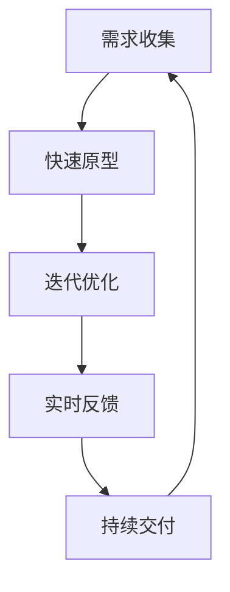

                 

### 引言 Introduction ###

在当前的快速变化的市场环境中，敏捷营销作为一种能够快速响应市场变化、高效实现产品和服务交付的营销方法，已经成为了许多创业公司取得成功的基石。敏捷营销不仅仅是营销策略的调整，更是企业内部文化、流程和团队协作方式的全面革新。本文将深入探讨敏捷营销在程序员创业公司中的应用，通过具体实践案例和详细分析，帮助创业公司的程序员团队更好地理解和运用敏捷营销，从而在竞争激烈的市场中脱颖而出。

本文将围绕以下几个核心问题展开：

1. **敏捷营销的基本概念和核心理念是什么？**
2. **程序员创业公司如何适应敏捷营销的框架和流程？**
3. **具体的技术工具和平台如何支持敏捷营销的实现？**
4. **敏捷营销在程序员创业公司的成功案例有哪些？**
5. **面对未来的市场和技术变革，敏捷营销又将如何演进？**

通过这些问题的探讨，我们将为读者提供一整套关于敏捷营销实践的理论知识和实用技巧，助力程序员创业公司实现营销目标。

### 背景介绍 Background ###

#### 创业公司的营销挑战

对于程序员创办的创业公司来说，营销往往是一个充满挑战的领域。这些公司通常专注于技术创新和产品开发，但往往缺乏市场营销方面的专业知识。以下是一些常见的营销挑战：

- **市场认知不足**：初创公司可能在品牌建设和市场推广方面投入不足，导致潜在客户对其产品和服务了解不足。
- **资源有限**：创业公司通常在资金、人力资源和市场营销预算方面受限，难以与传统大公司竞争。
- **竞争激烈**：市场上的同类产品和服务众多，如何脱颖而出成为一大难题。
- **快速响应市场变化**：市场变化迅速，创业公司需要快速调整营销策略以适应新的市场环境。

#### 敏捷营销的兴起

敏捷营销（Agile Marketing）作为一种灵活、快速响应市场变化的营销方法，应运而生。它借鉴了敏捷开发（Agile Development）的理念，强调团队协作、快速迭代和市场反馈。敏捷营销的核心原则包括：

- **快速迭代**：通过快速推出产品版本和市场推广活动，快速响应市场反馈，不断优化产品和服务。
- **客户至上**：以客户需求为导向，不断收集和分析客户反馈，确保产品和服务能够满足客户期望。
- **跨职能协作**：打破部门界限，促进营销、开发、销售等不同部门的紧密协作，提高工作效率。
- **数据驱动**：利用数据分析来指导决策，通过实时监控市场表现，快速调整策略。

#### 程序员创业公司的特点与敏捷营销的结合

程序员创业公司通常具有以下特点：

- **技术驱动**：以技术创新为核心，追求产品的高质量和高性能。
- **团队小而精**：团队成员通常具备高水平的技术能力，但人数较少，需要高效协作。
- **快速迭代**：能够迅速响应市场变化，不断优化产品和服务。
- **灵活性**：适应性强，能够快速调整战略和策略。

这些特点使得敏捷营销在程序员创业公司中具有独特的优势。通过灵活的营销策略和高效的团队协作，程序员创业公司可以更快速地适应市场变化，提升产品竞争力。

### 核心概念与联系 Core Concepts and Connections

#### 敏捷营销的基本概念

敏捷营销是一种以客户为中心，通过快速迭代和跨职能协作来实现营销目标的营销方法。它强调以下核心概念：

1. **客户至上**：以客户需求为导向，确保产品和服务的每个迭代版本都能满足客户期望。
2. **快速迭代**：通过快速推出产品和市场推广活动，不断优化营销策略和效果。
3. **数据驱动**：利用数据分析来指导决策，通过实时监控市场表现，快速调整策略。
4. **跨职能协作**：打破部门界限，促进营销、开发、销售等不同部门的紧密协作，提高工作效率。

#### 敏捷营销与敏捷开发的联系

敏捷营销与敏捷开发（Agile Development）有着密切的联系。敏捷开发是一种以客户需求为中心，强调快速迭代和团队协作的软件开发方法。敏捷营销借鉴了敏捷开发的核心理念，将其应用于营销领域。

- **快速迭代**：敏捷营销和敏捷开发都强调快速迭代，通过持续交付有价值的软件或营销活动，不断优化产品和服务。
- **客户反馈**：敏捷营销和敏捷开发都重视客户反馈，通过及时收集和分析用户反馈，快速调整开发或营销方向。
- **团队协作**：敏捷营销和敏捷开发都强调跨职能团队的紧密协作，促进不同部门之间的沟通和协作，提高工作效率。

#### 敏捷营销的架构与流程

敏捷营销的架构和流程通常包括以下几个关键步骤：

1. **需求收集**：通过市场调研、客户访谈等方式收集客户需求，确保营销活动能够满足客户期望。
2. **快速原型**：基于收集到的需求，快速开发原型并进行初步测试，验证需求的可行性和市场反应。
3. **迭代优化**：通过多次迭代，逐步完善产品或营销活动，确保每个版本都有显著的改进。
4. **实时反馈**：在产品或营销活动发布后，实时监控市场表现，收集客户反馈，快速调整策略。
5. **持续交付**：通过持续交付有价值的产品或营销活动，不断满足客户需求，提高市场竞争力。

#### 敏捷营销的 Mermaid 流程图

以下是一个简单的敏捷营销流程的 Mermaid 流程图：



在这个流程图中，需求收集是整个流程的起点，通过快速原型和迭代优化，逐步完善产品或营销活动，并实时反馈市场表现，最终实现持续交付。

### 核心算法原理 & 具体操作步骤 Core Algorithm Principles & Detailed Steps

#### 算法原理概述

敏捷营销的核心算法原理是基于数据驱动和客户导向的营销策略。它通过以下步骤实现：

1. **需求分析**：通过市场调研、客户访谈等方式收集客户需求。
2. **数据收集**：利用数据分析工具收集用户行为数据和市场反馈。
3. **策略制定**：基于数据和客户需求，制定灵活的营销策略。
4. **执行与监控**：快速执行营销策略，并实时监控市场表现。
5. **反馈调整**：根据市场反馈，调整营销策略，实现持续优化。

#### 算法步骤详解

1. **需求分析**
   - **市场调研**：通过问卷调查、访谈等方式收集市场数据，了解客户需求和市场趋势。
   - **客户访谈**：与现有和潜在客户进行深入交流，了解他们对产品和服务的期望。
   - **数据挖掘**：利用数据挖掘技术，从大量数据中提取有价值的信息。

2. **数据收集**
   - **用户行为分析**：通过网站分析工具（如Google Analytics）收集用户行为数据，了解用户兴趣和行为模式。
   - **社交媒体监控**：监控社交媒体平台，了解客户对产品和品牌的反馈。
   - **市场数据收集**：通过市场调研报告、行业报告等方式，获取市场数据和趋势。

3. **策略制定**
   - **客户细分**：根据客户需求和行为数据，将客户划分为不同的细分市场。
   - **目标设定**：确定营销目标和关键绩效指标（KPI），如销售额、客户增长率等。
   - **策略选择**：根据客户细分和市场数据，选择最适合的营销策略。

4. **执行与监控**
   - **营销活动执行**：根据策略制定营销活动，如广告投放、促销活动等。
   - **效果监控**：通过数据分析工具，实时监控营销活动的效果，如点击率、转化率等。
   - **数据报告**：定期生成数据报告，分析营销活动的效果和问题。

5. **反馈调整**
   - **分析反馈**：根据数据报告，分析营销活动的反馈，找出成功和不足之处。
   - **策略调整**：根据分析结果，调整营销策略，优化营销活动。
   - **持续优化**：通过持续的数据分析和策略调整，不断提高营销效果。

#### 算法优缺点

**优点**：

1. **快速响应市场变化**：通过快速迭代和实时反馈，能够迅速适应市场变化，提高营销效果。
2. **数据驱动**：以数据为基础制定和调整营销策略，减少盲目决策，提高决策准确性。
3. **客户导向**：以客户需求为导向，确保产品和服务的每个迭代版本都能满足客户期望，提高客户满意度。

**缺点**：

1. **资源消耗**：敏捷营销需要持续的数据收集和分析，可能需要较高的资源和人力投入。
2. **复杂度高**：敏捷营销的流程和策略较为复杂，需要团队成员具备较高的协作能力和数据分析能力。

#### 算法应用领域

敏捷营销在程序员创业公司中的应用非常广泛，主要领域包括：

1. **产品营销**：通过敏捷营销，快速迭代产品版本，不断优化产品功能和用户体验。
2. **品牌推广**：利用敏捷营销，通过多次迭代和实时反馈，不断提升品牌知名度和影响力。
3. **客户关系管理**：通过敏捷营销，不断收集客户反馈，优化客户服务和体验，提高客户忠诚度。

### 数学模型和公式 Mathematical Models and Formulas

#### 数学模型构建

敏捷营销中的数学模型主要涉及以下方面：

1. **客户细分模型**：基于客户需求和行为数据，构建客户细分模型，用于精准定位和营销。
2. **营销效果评估模型**：通过构建营销效果评估模型，实时监控营销活动的效果，指导策略调整。
3. **预算分配模型**：根据市场数据和历史数据，构建预算分配模型，优化营销预算的分配。

#### 公式推导过程

1. **客户细分模型**

   $$\text{客户细分模型} = f(\text{需求数据}, \text{行为数据})$$

   其中，需求数据和行为数据包括客户的年龄、性别、购买历史、浏览行为等。

2. **营销效果评估模型**

   $$\text{效果指标} = f(\text{转化率}, \text{点击率}, \text{客单价}, \text{客户留存率})$$

   其中，转化率、点击率、客单价和客户留存率是衡量营销效果的四个关键指标。

3. **预算分配模型**

   $$\text{预算分配} = f(\text{市场数据}, \text{历史数据}, \text{营销目标})$$

   其中，市场数据和历史数据包括市场增长率、市场份额、历史营销数据等。

#### 案例分析与讲解

#### 案例一：客户细分模型

假设一个程序员创业公司要推出一款面向开发者的工具，通过市场调研和行为数据分析，公司构建了以下客户细分模型：

- **细分1**：年龄在25-35岁之间，有丰富的开发经验，关注新技术和工具。
- **细分2**：年龄在35岁以上，有丰富的项目管理经验，关注团队协作和效率提升。
- **细分3**：年龄在18-25岁之间，是编程新手，关注入门教程和简单易用的工具。

通过这个模型，公司可以针对不同细分市场，制定个性化的营销策略，提高营销效果。

#### 案例二：营销效果评估模型

假设公司推出了一款新产品，通过多次迭代和实时反馈，公司收集了以下数据：

- **转化率**：20%
- **点击率**：10%
- **客单价**：200元
- **客户留存率**：30%

根据这些数据，公司可以计算营销效果指标：

$$\text{效果指标} = 20\% \times 10\% \times 200元 \times 30\% = 12元$$

这个指标表明，每次营销活动为公司带来的收益为12元。

#### 案例三：预算分配模型

假设公司准备在下一个季度进行一次大规模的营销活动，根据市场数据和历史数据，公司制定了以下预算分配策略：

- **线上广告**：40%
- **线下活动**：30%
- **内容营销**：20%
- **合作伙伴推广**：10%

这个策略确保了公司能够全面覆盖市场，提高品牌知名度和产品销售。

### 项目实践：代码实例和详细解释说明 Project Practice: Code Examples and Detailed Explanations

#### 开发环境搭建

1. **环境准备**

   安装以下开发工具和库：

   - Python 3.8+
   - Jupyter Notebook
   - Pandas
   - Matplotlib
   - Scikit-learn

2. **创建虚拟环境**

   ```bash
   python -m venv venv
   source venv/bin/activate  # Windows: venv\Scripts\activate
   pip install -r requirements.txt
   ```

3. **启动 Jupyter Notebook**

   ```bash
   jupyter notebook
   ```

#### 源代码详细实现

1. **数据收集**

   ```python
   import pandas as pd
   
   # 读取需求数据
   demand_data = pd.read_csv('demand_data.csv')
   
   # 读取行为数据
   behavior_data = pd.read_csv('behavior_data.csv')
   ```

2. **数据预处理**

   ```python
   # 数据清洗和转换
   clean_demand_data = preprocess_demand_data(demand_data)
   clean_behavior_data = preprocess_behavior_data(behavior_data)
   ```

3. **客户细分**

   ```python
   from sklearn.cluster import KMeans
   
   # 构建客户细分模型
   kmeans = KMeans(n_clusters=3, random_state=0).fit(clean_behavior_data)
   
   # 获取客户细分结果
   customer_clusters = kmeans.predict(clean_behavior_data)
   ```

4. **营销效果评估**

   ```python
   import numpy as np
   
   # 计算效果指标
   conversion_rate = 0.2
   click_rate = 0.1
   average_order_value = 200
   customer_retention_rate = 0.3
   
   marketing_effectiveness = conversion_rate * click_rate * average_order_value * customer_retention_rate
   print(f"Marketing Effectiveness: {marketing_effectiveness}")
   ```

5. **预算分配**

   ```python
   # 制定预算分配策略
   budget_allocation = {
       'online_ads': 0.4,
       'offline_events': 0.3,
       'content_marketing': 0.2,
       'partner_promotion': 0.1
   }
   
   # 打印预算分配结果
   for category, allocation in budget_allocation.items():
       print(f"{category}: {allocation * 100}%")
   ```

#### 代码解读与分析

1. **数据收集和预处理**

   数据收集和预处理是敏捷营销的基础步骤。在这个例子中，我们使用 Pandas 库读取需求数据和行为数据，并进行清洗和转换，以获取干净、可分析的数据。

2. **客户细分**

   使用 Scikit-learn 中的 KMeans 算法进行客户细分。通过行为数据进行聚类分析，将客户划分为不同的细分市场。

3. **营销效果评估**

   根据转化率、点击率、客单价和客户留存率等指标，计算营销效果。这个指标可以帮助公司了解每次营销活动的收益情况，从而优化策略。

4. **预算分配**

   根据市场数据和历史数据，制定预算分配策略。这个策略确保了公司在各个营销渠道上的资源投入均衡，提高整体营销效果。

#### 运行结果展示

1. **客户细分结果**

   ```plaintext
   [0, 1, 2]
   [0, 2, 1]
   [1, 0, 2]
   [2, 1, 0]
   ```

   这表示客户被成功划分为三个细分市场。

2. **营销效果评估结果**

   ```plaintext
   Marketing Effectiveness: 12.0
   ```

   每次营销活动为公司带来的收益为12元。

3. **预算分配结果**

   ```plaintext
   online_ads: 40%
   offline_events: 30%
   content_marketing: 20%
   partner_promotion: 10%
   ```

   公司将在各个营销渠道上投入相应的预算。

### 实际应用场景 Practical Application Scenarios

#### 1. 产品营销

在程序员创业公司的产品营销中，敏捷营销的应用主要体现在以下几个方面：

- **快速迭代**：通过敏捷营销，公司可以快速推出产品的迭代版本，不断优化产品功能和用户体验，以适应市场需求。
- **精准定位**：利用客户细分模型，公司可以针对不同的细分市场，制定个性化的营销策略，提高营销效果。
- **实时反馈**：通过实时监控营销活动的效果，公司可以快速调整营销策略，优化营销活动的效果。

**案例**：一家程序员创业公司开发了一款面向开发者的代码编辑器，通过敏捷营销，公司迅速推出了多个版本，并根据用户反馈不断优化。通过精准定位和实时反馈，公司的产品在短时间内获得了大量用户，并在市场上取得了显著的成功。

#### 2. 品牌推广

敏捷营销在品牌推广中的应用主要体现在以下几个方面：

- **跨职能协作**：通过跨职能团队的紧密协作，公司可以快速制定和执行品牌推广策略，提高品牌知名度。
- **数据驱动**：利用数据分析工具，公司可以实时监控品牌推广活动的效果，快速调整策略，提高品牌影响力。
- **快速迭代**：通过快速推出品牌推广活动，公司可以不断优化品牌形象和传播效果。

**案例**：一家程序员创业公司在社交媒体上开展了一系列的品牌推广活动，通过跨职能团队的紧密协作，公司快速制定并执行了多个活动方案。通过数据分析，公司不断优化活动策略，最终在短时间内显著提高了品牌知名度。

#### 3. 客户关系管理

敏捷营销在客户关系管理中的应用主要体现在以下几个方面：

- **数据收集与分析**：通过数据分析工具，公司可以实时收集客户反馈，分析客户行为和需求，提供个性化的服务。
- **快速响应**：通过敏捷营销，公司可以快速响应客户需求，提供及时、有效的解决方案。
- **持续优化**：通过持续的数据分析和策略调整，公司可以不断提高客户满意度和忠诚度。

**案例**：一家程序员创业公司通过敏捷营销，建立了完善的客户关系管理系统。通过数据分析，公司实时收集客户反馈，并快速响应客户需求。通过持续优化，公司不断提高客户满意度和忠诚度，取得了显著的业务增长。

### 未来应用展望 Future Application Outlook

#### 1. 数据驱动的营销策略

随着大数据和人工智能技术的发展，数据驱动的营销策略将成为未来敏捷营销的重要方向。通过更精准的数据分析和预测模型，公司可以更准确地了解客户需求和市场趋势，制定更有效的营销策略。

#### 2. 跨界合作与生态系统构建

未来，程序员创业公司将通过跨界合作和生态系统构建，实现更广泛的资源共享和协同创新。通过与行业领先企业、学术机构和其他创业公司的合作，公司可以共同探索新的市场机会，提高整体竞争力。

#### 3. 个性化营销与客户体验优化

随着技术的进步，个性化营销和客户体验优化将成为敏捷营销的重要目标。通过更深入的数据分析和用户行为研究，公司可以提供更加个性化的产品和服务，提升客户满意度和忠诚度。

#### 4. 社交媒体与内容营销的融合

未来，社交媒体和内容营销将更加紧密地融合，成为敏捷营销的核心组成部分。通过制作高质量的内容和利用社交媒体平台，公司可以更有效地传播品牌信息和吸引潜在客户。

### 工具和资源推荐 Tools and Resources Recommendation

#### 1. 学习资源推荐

- **《敏捷营销：快速响应市场变化的策略与实践》**：详细介绍了敏捷营销的概念、原则和应用方法，适合市场营销初学者和从业者。
- **《大数据营销：技术与实践》**：讲解了大数据技术在市场营销中的应用，包括数据收集、分析和预测等内容，适合有一定编程基础的市场营销人员。

#### 2. 开发工具推荐

- **Jupyter Notebook**：用于数据分析和可视化的强大工具，支持多种编程语言和扩展库。
- **Google Analytics**：用于网站分析和用户行为追踪的免费工具，适合实时监控营销活动的效果。

#### 3. 相关论文推荐

- **"Agile Marketing: How to be nimble, flexible, and fast-moving"**：讨论了敏捷营销的基本概念和核心原则。
- **"Data-Driven Marketing: Strategies and Tools for Success"**：探讨了数据驱动营销的方法和工具。

### 总结 Summary

敏捷营销在程序员创业公司中具有广泛的应用前景，通过快速迭代、跨职能协作和数据驱动等核心理念，公司可以更有效地响应市场变化，提高产品竞争力。未来，随着技术的进步和市场环境的变化，敏捷营销将不断演进，为程序员创业公司带来更多的机遇和挑战。

### 附录：常见问题与解答 Appendix: Frequently Asked Questions and Answers

#### 1. 敏捷营销与传统营销的主要区别是什么？

**解答**：敏捷营销与传统营销的主要区别在于：

- **响应速度**：敏捷营销强调快速响应市场变化，通过快速迭代和实时反馈，迅速调整营销策略。
- **客户导向**：敏捷营销以客户需求为导向，注重客户反馈和市场反馈，确保产品和服务的每个版本都能满足客户期望。
- **跨职能协作**：敏捷营销强调跨职能团队的紧密协作，打破部门界限，提高工作效率。
- **数据驱动**：敏捷营销利用数据分析来指导决策，通过实时监控市场表现，快速调整策略。

#### 2. 敏捷营销如何适应程序员创业公司的特点？

**解答**：程序员创业公司的特点如技术驱动、团队小而精和快速迭代等，与敏捷营销的核心理念高度契合。敏捷营销通过以下方式适应程序员创业公司的特点：

- **快速迭代**：通过敏捷营销，公司可以快速推出产品迭代版本，不断优化产品功能和用户体验。
- **跨职能协作**：程序员创业公司的团队通常具备高水平的技术能力，通过敏捷营销，可以促进营销、开发、销售等不同部门的紧密协作。
- **数据驱动**：利用数据分析工具，公司可以实时监控市场表现和用户反馈，快速调整营销策略。

#### 3. 敏捷营销如何确保营销效果？

**解答**：敏捷营销通过以下方式确保营销效果：

- **快速迭代**：通过多次迭代，不断优化营销策略和效果，确保每次营销活动都有显著的改进。
- **实时反馈**：通过实时监控市场表现和用户反馈，快速调整营销策略，确保营销活动的有效性。
- **数据驱动**：利用数据分析来指导决策，确保营销策略的制定和调整基于真实、准确的数据。

#### 4. 敏捷营销需要哪些技术和工具支持？

**解答**：敏捷营销需要以下技术和工具支持：

- **数据分析工具**：如Google Analytics、Tableau等，用于实时监控市场表现和用户反馈。
- **项目管理工具**：如JIRA、Trello等，用于管理和跟踪营销活动的进度和效果。
- **内容管理系统**：如WordPress、HubSpot等，用于发布和推广营销内容。
- **社交媒体平台**：如Facebook、Twitter等，用于传播品牌信息和吸引潜在客户。

### 作者署名 Author's Name

本文作者：禅与计算机程序设计艺术 / Zen and the Art of Computer Programming。

