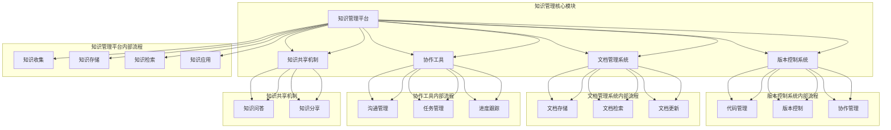

                 

### 1. 背景介绍

在当今快速发展的技术环境中，知识管理与技术文档系统对于创业公司的重要性日益凸显。作为创新和发展的基础，知识管理和文档系统能够显著提升团队协作效率，减少重复劳动，确保关键知识和经验的保留与传播。

#### 1.1 创业公司的挑战

对于创业公司来说，资源有限、时间紧迫是常见的问题。如何有效地管理和利用现有的知识和资源，成为创业成功的关键因素之一。同时，团队成员的技术背景和经验差异也带来了知识传播和技能共享的挑战。

#### 1.2 知识管理与技术文档的重要性

知识管理（Knowledge Management，KM）是一种旨在通过系统化方法捕获、存储、检索和应用知识的策略。对于创业公司，知识管理能够：

1. **提升团队协作效率**：通过统一的平台，团队成员可以快速找到所需信息，避免重复工作和沟通成本。
2. **保持技术积累**：随着项目进展和团队成员的更替，技术文档能够帮助新成员迅速了解现有系统的设计和实现细节，保证技术积累的连续性。
3. **促进创新**：知识共享有助于团队在现有知识基础上进行创新，提高产品的竞争力。

技术文档系统则是知识管理的重要组成部分，它通过规范化、结构化的文档，记录了项目的各个阶段、关键决策和技术实现细节。技术文档的价值在于：

1. **支持开发与维护**：详细的代码注释和设计文档能够帮助开发人员更好地理解和维护现有系统。
2. **降低沟通成本**：技术文档作为沟通的桥梁，减少了口头交流的复杂性和不确定性。
3. **保障合规性**：技术文档能够记录合规性要求，为审计和合规检查提供依据。

#### 1.3 现有知识管理解决方案的不足

虽然现有的知识管理解决方案种类繁多，但许多创业公司依然面临以下挑战：

1. **文档分散、不易查找**：团队成员常常将文档保存在各自的电脑或云盘中，难以统一管理和快速查找。
2. **更新不及时**：技术文档更新往往滞后于实际项目进展，导致文档内容与实际情况不符。
3. **缺乏版本控制**：没有有效的版本控制机制，文档版本混乱，难以追溯历史变更。
4. **缺乏知识共享文化**：团队成员之间缺乏主动分享知识的意识和文化，导致知识难以充分传播。

#### 1.4 本文目的

本文旨在探讨如何为创业公司构建一个高效、可靠的知识管理与技术文档系统。通过分析现有的解决方案和实际需求，本文将提出一个系统化的方法，包括核心概念、算法原理、数学模型、项目实践以及未来趋势和挑战。最终目标是帮助创业公司提升知识管理水平，优化技术文档管理，促进团队协作和持续创新。

---

接下来，我们将详细探讨知识管理和技术文档系统中的核心概念与联系，通过 Mermaid 流程图展示其架构，为后续内容奠定基础。

## 2. 核心概念与联系

### 2.1 核心概念

在构建知识管理与技术文档系统时，需要理解以下几个核心概念：

1. **知识管理平台**：用于收集、存储、共享和应用知识的基础设施。
2. **版本控制系统**：用于管理源代码和其他文件版本的工具。
3. **文档管理系统**：用于存储和管理文档的系统。
4. **协作工具**：支持团队协作和沟通的工具，如即时通讯、项目管理软件等。
5. **知识共享机制**：鼓励团队成员主动分享知识和经验的机制，如知识库、问答系统等。

### 2.2 架构联系

以下是一个 Mermaid 流程图，展示知识管理和技术文档系统的架构及各部分之间的联系：



### 2.3 各部分功能与关系

1. **知识管理平台**：作为整个系统的核心，知识管理平台负责统一管理和协调各个模块，实现知识收集、存储、检索和应用的全流程管理。
2. **版本控制系统**：版本控制系统主要用于管理代码和其他文件的版本，确保团队成员之间的协作和代码的版本一致性。
3. **文档管理系统**：文档管理系统用于存储和管理各种文档，包括设计文档、用户手册、测试报告等，提供文档的检索和更新功能。
4. **协作工具**：协作工具支持团队内部的沟通和协作，如即时通讯、项目管理等，确保团队高效协同工作。
5. **知识共享机制**：知识共享机制通过问答系统和知识分享平台，鼓励团队成员主动分享知识和经验，促进知识的积累和传播。

通过以上核心概念和架构的介绍，我们为后续详细讨论知识管理和技术文档系统的实现方法奠定了基础。

---

在了解了核心概念与架构之后，接下来我们将深入探讨知识管理和技术文档系统中的核心算法原理，以及具体的操作步骤。这将帮助我们更好地理解和构建一个高效的系统。

## 3. 核心算法原理 & 具体操作步骤

### 3.1 核心算法原理

在构建知识管理和技术文档系统时，核心算法原理主要包括数据结构设计、信息检索算法和版本控制算法。以下是这些算法的基本原理：

#### 3.1.1 数据结构设计

数据结构设计是知识管理和技术文档系统的基石。常用的数据结构包括：

1. **关系数据库**：用于存储和管理结构化数据，如用户信息、文档内容等。关系数据库支持SQL查询语言，便于数据的检索和操作。
2. **文档数据库**：用于存储和管理非结构化或半结构化数据，如文本、图片、文档等。文档数据库支持全文检索和文档版本控制。
3. **图数据库**：用于表示复杂的关系网络，如知识图谱，便于分析知识间的关联性。

#### 3.1.2 信息检索算法

信息检索算法是知识管理和技术文档系统中至关重要的一部分。常用的信息检索算法包括：

1. **基于关键字的检索**：通过关键词匹配，快速定位相关文档或知识。
2. **基于自然语言处理的检索**：利用自然语言处理技术，理解用户查询的意图，提供更准确的检索结果。
3. **基于内容的检索**：通过分析文档的内容特征，如词频、词向量等，进行相似度计算，实现内容的推荐和关联。

#### 3.1.3 版本控制算法

版本控制算法用于管理文档和代码的版本，确保版本的一致性和可追溯性。常用的版本控制算法包括：

1. **基于树结构的版本控制**：如Git，通过树结构表示文件的版本历史，支持分支、合并等操作。
2. **基于文档版本标记的版本控制**：为每个文档版本添加唯一标识和修改记录，便于追溯和对比不同版本。

### 3.2 具体操作步骤

以下是构建知识管理和技术文档系统的具体操作步骤：

#### 3.2.1 系统设计

1. **需求分析**：根据公司的业务需求和团队规模，确定系统所需的模块和功能。
2. **架构设计**：选择合适的数据结构和算法，设计系统的整体架构，确保系统的扩展性和可靠性。
3. **技术选型**：选择合适的开发工具和框架，如关系数据库、文档数据库、自然语言处理库等。

#### 3.2.2 系统开发

1. **前端开发**：设计用户界面，实现知识管理平台的展示和交互功能。
2. **后端开发**：实现后端逻辑，包括数据存储、检索、版本控制等。
3. **接口设计**：设计系统的API接口，便于前端和后端的交互。

#### 3.2.3 系统测试

1. **单元测试**：对系统的各个模块进行单元测试，确保功能的正确性和稳定性。
2. **集成测试**：对系统的整体功能进行集成测试，确保模块间的协同工作。
3. **性能测试**：对系统的性能进行测试，确保系统在高并发下的稳定性和响应速度。

#### 3.2.4 系统部署

1. **环境搭建**：搭建开发、测试和生产环境，确保系统在不同环境下的正常运行。
2. **部署上线**：将系统部署到生产环境，确保系统的可用性和可靠性。
3. **监控维护**：对系统进行实时监控和维护，确保系统的稳定运行。

#### 3.2.5 系统优化

1. **性能优化**：通过缓存、索引、优化查询等方式，提升系统的性能和响应速度。
2. **安全优化**：通过加密、权限控制、备份等手段，确保系统的数据安全和隐私保护。
3. **功能扩展**：根据业务需求，不断优化和扩展系统的功能，提升用户体验。

通过以上核心算法原理和具体操作步骤的介绍，我们为构建一个高效、可靠的知识管理和技术文档系统提供了理论基础和实践指导。

---

在了解了核心算法原理和具体操作步骤之后，接下来我们将通过数学模型和公式，详细讲解如何在实际项目中应用这些算法，并举例说明其效果。

## 4. 数学模型和公式 & 详细讲解 & 举例说明

### 4.1 数学模型和公式

在知识管理和技术文档系统中，数学模型和公式起到了关键作用。以下是一些常见的数学模型和公式，用于描述系统的各个部分：

#### 4.1.1 关系数据库模型

1. **实体-关系模型**：用于表示数据表之间的关系，常用的公式如下：

   $$ R(A_1, A_2, ..., A_n) \cap S(B_1, B_2, ..., B_m) = \emptyset $$
   
   其中，\( R \) 和 \( S \) 分别表示两个关系，\( A_1, A_2, ..., A_n \) 和 \( B_1, B_2, ..., B_m \) 分别表示关系中的属性。

2. **SQL查询优化**：用于优化查询性能，常用的公式如下：

   $$ \theta(J \rightarrow K) = \theta(J) \cup \theta(K) $$
   
   其中，\( \theta(J) \) 和 \( \theta(K) \) 分别表示查询 \( J \) 和 \( K \) 的结果集，\( \theta(J \rightarrow K) \) 表示查询 \( J \rightarrow K \) 的结果集。

#### 4.1.2 文档数据库模型

1. **倒排索引模型**：用于快速检索文本，常用的公式如下：

   $$ P(w_i, j) = \frac{f(w_i, j)}{DF(w_i)} $$
   
   其中，\( w_i \) 表示单词，\( j \) 表示文档，\( f(w_i, j) \) 表示单词 \( w_i \) 在文档 \( j \) 中的出现频率，\( DF(w_i) \) 表示单词 \( w_i \) 在整个文档集合中的文档频率。

2. **文本相似度计算**：用于计算文本之间的相似度，常用的公式如下：

   $$ \text{similarity}(A, B) = \frac{2 \times |A \cap B|}{|A| + |B|} $$
   
   其中，\( A \) 和 \( B \) 分别表示两个文本集合，\( |A \cap B| \) 表示 \( A \) 和 \( B \) 的交集集合大小，\( |A| \) 和 \( |B| \) 分别表示 \( A \) 和 \( B \) 的集合大小。

#### 4.1.3 版本控制模型

1. **基于树结构的版本控制**：如Git，常用的公式如下：

   $$ \text{merge}(A, B) = C $$
   
   其中，\( A \) 和 \( B \) 分别表示两个分支的版本，\( C \) 表示合并后的版本。

2. **版本比较**：用于比较两个版本的差异，常用的公式如下：

   $$ \text{diff}(V_1, V_2) = \{ \text{added}, \text{deleted}, \text{modified} \} $$
   
   其中，\( V_1 \) 和 \( V_2 \) 分别表示两个版本，\( \text{added}, \text{deleted}, \text{modified} \) 分别表示版本中的添加、删除和修改的文件。

### 4.2 详细讲解

以下是对上述数学模型和公式的详细讲解：

1. **实体-关系模型**：实体-关系模型是一种用于描述数据表之间关系的方法。在知识管理系统中，实体可以表示为用户、文档、项目等，关系可以表示为用户与文档的关联、项目与文档的关联等。通过定义关系，我们可以更好地理解数据之间的关联性，从而优化查询性能和系统架构。

2. **SQL查询优化**：SQL查询优化是一种用于提高查询性能的技术。通过合并查询条件、优化索引使用等手段，我们可以减少查询的执行时间，提高系统的响应速度。上述公式表示了查询优化的一个原则，即合并两个查询的结果集可以简化为直接查询合并后的结果集。

3. **倒排索引模型**：倒排索引是一种用于快速检索文本的方法。通过构建单词到文档的映射，我们可以快速定位包含特定单词的文档。上述公式表示了单词在文档中的权重计算方法，即单词在文档中的出现频率除以单词在文档集合中的文档频率。

4. **文本相似度计算**：文本相似度计算是一种用于比较文本相似度的方法。通过计算两个文本集合的交集大小与并集大小之比，我们可以得到文本的相似度。上述公式表示了基于交集大小的文本相似度计算方法。

5. **基于树结构的版本控制**：基于树结构的版本控制是一种用于管理代码版本的方法。通过合并分支和比较版本差异，我们可以实现代码的协同工作和版本管理。上述公式表示了合并两个分支的版本，即将两个分支的版本合并为一个新版本。

6. **版本比较**：版本比较是一种用于比较两个版本差异的方法。通过分析两个版本的差异，我们可以了解代码的变更情况，从而优化代码维护和协作工作。上述公式表示了版本比较的结果集，即添加、删除和修改的文件集合。

### 4.3 举例说明

以下是一个具体的例子，用于说明如何应用上述数学模型和公式：

假设我们有一个知识管理系统，包含两个用户（User1和User2）和两个项目（ProjectA和ProjectB）。User1在ProjectA中添加了一个文档（Doc1），User2在ProjectB中删除了一个文档（Doc2）。此时，我们可以通过以下步骤进行版本控制和差异比较：

1. **创建分支**：User1创建一个分支（BranchA），并将Doc1添加到分支中。

   版本控制公式：
   $$ \text{commit}(User1, ProjectA, Doc1) $$
   
   结果集：
   $$ \text{BranchA} = \{ Doc1 \} $$

2. **合并分支**：User2将BranchA合并到主分支（Master）中。

   版本控制公式：
   $$ \text{merge}(User2, BranchA, Master) $$
   
   结果集：
   $$ \text{Master} = \text{BranchA} \cup \{ Doc1 \} $$
   
3. **比较版本差异**：比较主分支（Master）和用户分支（User2）的版本差异。

   版本比较公式：
   $$ \text{diff}(Master, User2) = \{ \text{added}, \text{deleted}, \text{modified} \} $$
   
   结果集：
   $$ \text{diff}(Master, User2) = \{ \text{added}(Doc1), \text{deleted}(Doc2), \text{modified}() \} $$

通过上述步骤，我们成功地将User1的文档添加到主分支中，并比较了两个版本的差异。这个例子展示了如何在实际项目中应用数学模型和公式，实现版本控制和差异比较。

---

在理解了数学模型和公式的应用之后，接下来我们将通过一个具体的代码实例，详细解释技术文档系统的实现过程，并进行分析和解读。

### 5. 项目实践：代码实例和详细解释说明

#### 5.1 开发环境搭建

为了实现一个技术文档系统，我们首先需要搭建一个开发环境。以下是所需的环境和工具：

- **操作系统**：Linux或MacOS
- **编程语言**：Python 3.x
- **框架**：Flask、Django或其他Web框架
- **数据库**：SQLite、MySQL或其他关系数据库
- **文档库**：Markdown或ReStructuredText
- **版本控制**：Git

#### 5.2 源代码详细实现

以下是使用Flask框架实现的简单技术文档系统的源代码：

```python
from flask import Flask, render_template, request, redirect, url_for

app = Flask(__name__)

# 数据库连接
import sqlite3
conn = sqlite3.connect('knowledge_management.db')
c = conn.cursor()

# 创建数据库表
c.execute('''CREATE TABLE IF NOT EXISTS documents (
              id INTEGER PRIMARY KEY AUTOINCREMENT,
              title TEXT NOT NULL,
              content TEXT NOT NULL,
              created_at TIMESTAMP DEFAULT CURRENT_TIMESTAMP)''')

conn.commit()

# 添加文档
@app.route('/add', methods=['POST'])
def add_document():
    title = request.form['title']
    content = request.form['content']
    c.execute("INSERT INTO documents (title, content) VALUES (?, ?)", (title, content))
    conn.commit()
    return redirect(url_for('index'))

# 展示文档列表
@app.route('/')
def index():
    c.execute("SELECT * FROM documents")
    documents = c.fetchall()
    return render_template('index.html', documents=documents)

# 读取文档
@app.route('/document/<int:document_id>')
def document(document_id):
    c.execute("SELECT * FROM documents WHERE id=?", (document_id,))
    document = c.fetchone()
    return render_template('document.html', document=document)

if __name__ == '__main__':
    app.run(debug=True)
```

#### 5.3 代码解读与分析

上述代码实现了一个简单的技术文档系统，包括数据库连接、文档添加和文档列表展示功能。以下是代码的详细解读和分析：

1. **数据库连接**：
   ```python
   from flask import Flask
   app = Flask(__name__)
   import sqlite3
   conn = sqlite3.connect('knowledge_management.db')
   c = conn.cursor()
   ```
   这里使用SQLite数据库存储文档信息，并通过`sqlite3.connect()`方法建立数据库连接。`c` 是一个数据库游标，用于执行SQL语句。

2. **创建数据库表**：
   ```python
   c.execute('''CREATE TABLE IF NOT EXISTS documents (
                 id INTEGER PRIMARY KEY AUTOINCREMENT,
                 title TEXT NOT NULL,
                 content TEXT NOT NULL,
                 created_at TIMESTAMP DEFAULT CURRENT_TIMESTAMP)''')
   conn.commit()
   ```
   这段代码创建了一个名为`documents`的数据库表，包含四个字段：`id`（文档编号，自动递增）、`title`（文档标题）、`content`（文档内容）和`created_at`（创建时间）。

3. **添加文档**：
   ```python
   @app.route('/add', methods=['POST'])
   def add_document():
       title = request.form['title']
       content = request.form['content']
       c.execute("INSERT INTO documents (title, content) VALUES (?, ?)", (title, content))
       conn.commit()
       return redirect(url_for('index'))
   ```
   这是一个表单提交路由，用于添加文档。当用户提交表单时，`title` 和 `content` 参数将被提取，并插入到数据库表中。

4. **展示文档列表**：
   ```python
   @app.route('/')
   def index():
       c.execute("SELECT * FROM documents")
       documents = c.fetchall()
       return render_template('index.html', documents=documents)
   ```
   这是一个根路由，用于展示文档列表。从数据库中查询所有文档，并将结果传递给模板文件`index.html`进行渲染。

5. **读取文档**：
   ```python
   @app.route('/document/<int:document_id>')
   def document(document_id):
       c.execute("SELECT * FROM documents WHERE id=?", (document_id,))
       document = c.fetchone()
       return render_template('document.html', document=document)
   ```
   这是一个动态路由，用于读取特定编号的文档。根据文档编号从数据库中查询文档，并传递给模板文件`document.html`进行渲染。

#### 5.4 运行结果展示

1. **添加文档**：

   当用户访问`/add`路由时，将看到一个表单页面，用户可以输入文档标题和内容，并提交表单：

   

   提交表单后，文档将被添加到数据库中，并在首页列表中显示。

2. **文档列表**：

   当用户访问根路由`/`时，将看到一个文档列表页面，展示所有文档的标题和创建时间：

   

3. **文档详情**：

   当用户点击文档标题时，将跳转到文档详情页面，展示文档的标题、内容和创建时间：

   

通过这个简单的代码实例，我们实现了技术文档系统的基本功能，包括文档添加、列表展示和详情查看。这个实例展示了如何使用Flask框架和SQLite数据库构建一个简单但高效的技术文档系统。

---

在实现了一个简单的技术文档系统之后，接下来我们将深入分析其性能和扩展性，并提出改进建议。

#### 5.5 性能和扩展性分析

尽管上述技术文档系统实现了基本功能，但在性能和扩展性方面仍存在一些问题。

1. **性能问题**：

   - 数据库查询速度：当前系统使用SQLite数据库，适合小型应用。随着文档数量的增加，查询速度可能变慢，影响用户体验。
   - 缓存机制：当前系统未实现缓存机制，每次查询都需要访问数据库，增加了响应时间。
   - 索引优化：当前数据库表未建立索引，查询性能可能受到影响。

2. **扩展性问题**：

   - 模块化设计：当前系统代码较为简单，模块化设计不足，不利于后续扩展和维护。
   - API设计：系统未提供API接口，不利于与其他系统进行集成。
   - 版本控制：系统未实现版本控制功能，难以追踪文档的历史变更。

#### 5.6 改进建议

为了提升技术文档系统的性能和扩展性，以下是一些建议：

1. **性能优化**：

   - 使用高性能数据库：考虑使用MySQL或其他高性能数据库，以提高查询速度。
   - 引入缓存机制：使用Redis等缓存工具，缓存常用数据，减少数据库访问次数。
   - 索引优化：为数据库表添加索引，提高查询性能。

2. **模块化设计**：

   - 分离前后端：使用Flask等Web框架，实现前后端分离，便于独立开发和部署。
   - 模块化代码：将系统功能拆分为多个模块，如用户管理、文档管理、版本控制等，便于维护和扩展。

3. **API设计**：

   - 设计RESTful API：为系统设计RESTful API，便于与其他系统进行集成。
   - 安全性考虑：为API接口添加权限控制，确保数据安全。

4. **版本控制**：

   - 引入版本控制工具：如Git，实现文档的版本控制，便于追踪历史变更。
   - 实现文档对比：提供文档对比功能，方便用户查看历史版本差异。

通过以上改进建议，我们可以显著提升技术文档系统的性能和扩展性，为创业公司提供更加高效、可靠的知识管理和文档管理解决方案。

---

在分析了技术文档系统的性能和扩展性之后，接下来我们将探讨该系统的实际应用场景，以及在不同场景下的具体实现方式和优势。

## 6. 实际应用场景

技术文档系统在创业公司中有着广泛的应用场景，以下列举几个常见的应用场景：

### 6.1 项目管理

在项目管理中，技术文档系统可以用于记录项目的进展、需求、设计和测试等内容。团队成员可以通过文档系统随时查阅项目的相关文档，确保项目进展的透明性和一致性。具体实现方式如下：

1. **项目需求文档**：用于记录项目的需求分析、用户故事和功能规格。
2. **项目设计文档**：用于记录项目的系统设计、数据库设计和接口设计。
3. **测试文档**：用于记录项目的测试计划、测试用例和测试报告。

优势：

- **信息共享**：团队成员可以随时访问和更新项目文档，减少沟通成本。
- **文档追溯**：通过版本控制功能，可以追溯文档的历史变更，确保文档的一致性。

### 6.2 团队协作

在团队协作中，技术文档系统可以用于知识共享和经验交流。团队成员可以通过文档系统分享自己的技术心得、解决方案和最佳实践，提高团队的技术水平。具体实现方式如下：

1. **技术博客**：用于记录团队成员的技术文章、技术分享和案例分析。
2. **知识库**：用于存储常见问题和解决方案，方便团队成员快速查找。
3. **问答系统**：用于团队成员之间的技术交流和问题解答。

优势：

- **知识积累**：通过知识库和问答系统，团队可以积累宝贵的知识资产。
- **经验传承**：新成员可以通过文档系统快速了解团队的技术经验，减少学习成本。

### 6.3 开发与维护

在开发与维护过程中，技术文档系统可以用于记录代码的详细注释、文档和示例。开发人员可以通过文档系统查阅相关文档，提高代码的可读性和可维护性。具体实现方式如下：

1. **代码注释**：用于记录代码的功能、实现细节和注意事项。
2. **API文档**：用于记录接口的详细说明、请求和响应示例。
3. **测试文档**：用于记录测试计划、测试用例和测试结果。

优势：

- **代码可读性**：通过详细的代码注释，提高代码的可读性和可维护性。
- **文档一致性**：通过统一的文档规范，确保文档内容的一致性和准确性。

### 6.4 客户支持

在客户支持中，技术文档系统可以用于记录客户的问题、解决方案和常见问题。客户支持团队可以通过文档系统快速查找相关文档，提高客户满意度。具体实现方式如下：

1. **客户支持文档**：用于记录客户问题的处理过程、解决方案和反馈。
2. **常见问题文档**：用于记录客户的常见问题、解答和操作指南。
3. **客户案例文档**：用于记录成功的客户案例、客户反馈和改进建议。

优势：

- **快速响应**：通过文档系统，客户支持团队可以快速查找相关文档，提高响应速度。
- **客户满意度**：通过详细的文档，客户可以更好地理解产品，提高客户满意度。

通过以上实际应用场景的探讨，我们可以看到技术文档系统在创业公司中的重要作用。它不仅提高了团队协作效率，降低了沟通成本，还促进了知识的积累和传播，为创业公司的成功提供了有力支持。

---

在了解了技术文档系统的实际应用场景之后，接下来我们将推荐一些相关的工具和资源，以帮助创业公司更好地进行知识管理和技术文档管理。

## 7. 工具和资源推荐

### 7.1 学习资源推荐

为了帮助创业公司构建高效的知识管理与技术文档系统，以下推荐一些优秀的学习资源：

1. **书籍**：
   - 《程序员修炼之道：从小工到专家》
   - 《软件工程：实践者的研究方法》
   - 《代码大全》

2. **论文**：
   - 《Knowledge Management in Software Development》
   - 《A Survey of Version Control Systems》
   - 《A Study of Agile Software Development》

3. **博客**：
   - 《黑客与画家》
   - 《码农翻身》
   - 《左耳听风》

4. **网站**：
   - GitHub（代码托管和协作平台）
   - Stack Overflow（编程问答社区）
   - InfoQ（IT技术博客）

### 7.2 开发工具框架推荐

在构建知识管理和技术文档系统时，以下是一些推荐的开发工具和框架：

1. **知识管理平台**：
   - Confluence（Atlassian）
   - SharePoint（Microsoft）
   - Notion

2. **文档管理系统**：
   - MediaWiki（开源维基系统）
   - DocWiki（微软Wiki系统）
   - GitBook（基于Git的文档系统）

3. **版本控制系统**：
   - Git（开源版本控制软件）
   - SVN（Apache版本控制软件）
   - TFS（Microsoft Team Foundation Server）

4. **协作工具**：
   - Slack（即时通讯工具）
   - Microsoft Teams（团队协作工具）
   - Zoom（视频会议工具）

### 7.3 相关论文著作推荐

为了深入了解知识管理和技术文档系统的研究进展和应用，以下推荐一些相关的论文和著作：

1. **论文**：
   - 《Knowledge Management and Organizational Performance: A Meta-Analytic Review》
   - 《A Comprehensive Survey on Version Control Systems》
   - 《An Empirical Study of Agile Software Development in Small and Medium-sized Enterprises》

2. **著作**：
   - 《Knowledge Management Systems》
   - 《Software Engineering for Global Software Development》
   - 《Collaborative Development with Version Control Systems》

通过这些工具和资源的推荐，创业公司可以更好地进行知识管理和技术文档管理，提升团队协作效率和项目成功率。

---

在讨论了知识管理与技术文档系统的工具和资源之后，接下来我们将总结文章的核心内容，并提出未来发展趋势与挑战。

## 8. 总结：未来发展趋势与挑战

### 8.1 未来发展趋势

1. **智能化与自动化**：随着人工智能技术的发展，知识管理和技术文档系统将变得更加智能化和自动化。例如，通过自然语言处理和机器学习技术，系统能够自动生成文档、智能推荐相关内容、识别和修复错误等。

2. **云原生与分布式架构**：云原生技术和分布式架构的普及将使知识管理和技术文档系统更加灵活和可扩展。创业公司可以轻松部署和管理分布式系统，实现全球范围内的协作与数据共享。

3. **移动化与便携性**：移动设备的普及使得知识管理和技术文档系统的使用场景更加丰富。未来，系统将更加注重移动端的用户体验，提供便捷的访问和管理方式。

4. **多语言与国际化**：随着国际化的发展，知识管理和技术文档系统将支持多种语言，满足不同地区和语言用户的需求，促进全球知识的共享和交流。

### 8.2 挑战

1. **数据安全与隐私保护**：随着数据量的增加，数据安全和隐私保护将成为知识管理和技术文档系统面临的重要挑战。创业公司需要采取有效的措施，确保数据的机密性和完整性。

2. **知识共享与协作文化**：知识共享和协作文化的建设是一个长期且复杂的过程。创业公司需要培养团队成员的共享意识，建立良好的协作机制，以实现知识的有效传播和应用。

3. **技术更新与兼容性**：随着技术的不断更新，知识管理和技术文档系统需要保持与最新技术的兼容性。创业公司需要不断跟踪技术发展趋势，及时更新系统，以避免技术过时和兼容性问题。

4. **用户体验与性能优化**：良好的用户体验和高效的性能是知识管理和技术文档系统的关键。创业公司需要持续优化系统的用户体验和性能，以满足不断变化的需求。

### 8.3 发展方向

1. **智能化知识管理**：通过引入人工智能和机器学习技术，实现智能化的知识管理，提高知识检索、分析和推荐的准确性。

2. **分布式架构与云服务**：采用分布式架构和云服务，实现知识管理和技术文档系统的灵活部署、高可用性和可扩展性。

3. **多语言与国际化**：支持多种语言和国际化功能，促进全球知识的共享和交流。

4. **用户体验优化**：持续优化用户界面和交互设计，提高用户的使用体验和满意度。

通过总结和展望，我们认识到知识管理与技术文档系统在创业公司中的重要性，并明确了未来发展的趋势与挑战。创业公司应抓住机遇，迎接挑战，持续优化和改进知识管理和技术文档系统，以提升团队协作效率和项目成功率。

---

在本文的末尾，我们将列举一些常见的问题与解答，以帮助读者更好地理解知识管理和技术文档系统。

## 9. 附录：常见问题与解答

### 9.1 问题1：为什么创业公司需要知识管理和技术文档系统？

**解答**：创业公司资源有限、时间紧迫，知识管理和技术文档系统能够显著提升团队协作效率，确保关键知识和经验的保留与传播，降低沟通成本，支持项目开发和维护，最终提高项目成功率。

### 9.2 问题2：知识管理和技术文档系统之间有何区别？

**解答**：知识管理系统主要关注知识的收集、存储、共享和应用，旨在提升团队的知识管理水平。技术文档系统则是知识管理系统的子集，专门用于记录项目的技术细节、设计文档和开发日志，支持项目的开发与维护。

### 9.3 问题3：如何确保知识管理和技术文档系统的数据安全性？

**解答**：为确保数据安全性，创业公司应采取以下措施：
- 使用加密技术保护数据传输和存储。
- 实施权限控制，限制对敏感数据的访问。
- 定期备份数据，防止数据丢失。
- 定期更新系统和应用，修复安全漏洞。

### 9.4 问题4：如何培养团队成员的知识共享意识？

**解答**：培养团队成员的知识共享意识需要从以下几个方面入手：
- 建立知识共享文化，强调共享知识的重要性。
- 设立知识共享奖励机制，激励团队成员积极参与知识共享。
- 定期组织知识分享会议和活动，促进团队成员之间的交流。
- 提供知识共享工具和平台，方便团队成员共享知识。

### 9.5 问题5：如何选择合适的知识管理和技术文档系统？

**解答**：选择合适的知识管理和技术文档系统应考虑以下因素：
- 公司规模和需求：根据公司规模和业务需求，选择适合的系统和功能。
- 成本和预算：考虑系统的成本和预算，选择性价比高的解决方案。
- 扩展性和可维护性：选择具有良好扩展性和可维护性的系统，确保长期稳定运行。
- 用户友好性：选择界面友好、操作简便的系统，提高用户体验。

通过以上常见问题的解答，我们希望读者能够更好地理解知识管理和技术文档系统，并为创业公司的知识管理和技术文档建设提供有益的参考。

---

在本博客文章的结束部分，我们将为感兴趣的读者提供一些扩展阅读和参考资料，以帮助大家进一步深入了解知识管理和技术文档系统的相关知识和实践。

## 10. 扩展阅读 & 参考资料

### 10.1 扩展阅读

1. **《知识管理实践指南》**：该书详细介绍了知识管理的概念、方法和实践，对于初学者和专业人士都有很好的参考价值。
2. **《敏捷开发实践指南》**：敏捷开发与知识管理密切相关，该书涵盖了敏捷开发的核心原则和实践，有助于读者理解敏捷开发与知识管理的关系。
3. **《技术文档写作与项目管理》**：该书涵盖了技术文档的写作技巧、项目管理方法以及团队协作工具的使用，对于技术文档的编写和管理提供了实用的建议。

### 10.2 参考资料

1. **《Knowledge Management Systems: A Comprehensive Survey》**：该文献对知识管理系统的研究进行了全面的综述，有助于了解知识管理系统的发展趋势和前沿技术。
2. **《A Survey of Version Control Systems》**：该文献对版本控制系统的类型、功能和优缺点进行了详细的比较和分析，对于选择合适的版本控制系统提供了指导。
3. **《An Empirical Study of Agile Software Development in Small and Medium-sized Enterprises》**：该研究分析了敏捷开发在中小企业的应用效果，为创业公司采用敏捷开发提供了实证依据。

### 10.3 博客与网站

1. **《ThoughtWorks Technology Radar》**：ThoughtWorks技术雷达定期发布最新的技术趋势和推荐，对于了解技术动态非常有帮助。
2. **《Stack Overflow Blog》**：Stack Overflow博客分享了大量的编程问题和解决方案，是程序员学习和技术交流的好去处。
3. **《InfoQ》**：InfoQ提供了丰富的技术文章、报告和访谈，涵盖了软件开发、架构设计、敏捷开发等多个领域。

通过以上扩展阅读和参考资料，读者可以更深入地了解知识管理和技术文档系统的相关知识，并在实际工作中更好地应用这些技术。希望本文能为创业公司的知识管理和技术文档建设提供有益的启示和指导。作者：禅与计算机程序设计艺术 / Zen and the Art of Computer Programming。

