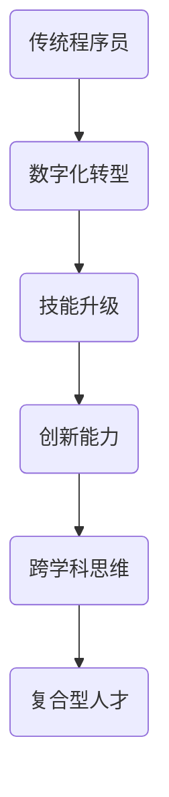

                 

### 文章标题

《程序员在知识经济时代的角色重塑》

> 关键词：程序员，知识经济，角色重塑，技能升级，数字化转型，技术创新

> 摘要：本文旨在探讨知识经济时代下，程序员如何通过角色重塑实现职业发展。通过对程序员传统角色的分析，结合当前技术创新和数字化转型的趋势，文章提出了一系列新的角色定位和发展路径，以帮助程序员在新时代中提升竞争力。

---

### 1. 背景介绍

在过去的几十年中，程序员作为信息技术时代的先锋，一直在推动着软件产业的发展。然而，随着知识经济的到来和技术的迅猛发展，程序员的角色也在发生着深刻的变革。传统上，程序员主要负责编写代码、解决技术问题，但随着云计算、大数据、人工智能等新兴技术的兴起，程序员的角色正在从单纯的编码者向复合型人才转变。

知识经济是一种以知识和信息为主要生产要素的经济形态，它强调的是知识的创造、传播和应用。在这种经济模式中，程序员不仅要具备扎实的技术能力，还需要具备快速学习、创新能力、跨学科思维和团队合作等综合能力。因此，程序员在知识经济时代的角色重塑显得尤为重要。

### 2. 核心概念与联系

为了更好地理解程序员在知识经济时代的角色重塑，我们需要了解以下几个核心概念：

#### 2.1 数字化转型

数字化转型是指企业利用数字技术来改变其商业模式、运营方式和服务模式。在这个过程中，程序员的作用不仅仅是编写代码，还需要参与到业务流程的优化、系统的集成和开发中。

#### 2.2 技能升级

技能升级是指程序员通过不断学习新技能，提升自己的技术能力和竞争力。在知识经济时代，技能的更新速度非常快，程序员需要具备持续学习的能力。

#### 2.3 创新能力

创新能力是指程序员在解决问题时，能够提出新颖、有效的解决方案的能力。创新能力是程序员在知识经济时代脱颖而出的关键。

#### 2.4 跨学科思维

跨学科思维是指程序员能够将不同学科的知识和技能融合在一起，形成新的思维模式。这种思维模式有助于程序员在复杂问题中找到创新的解决方案。

下面是一个Mermaid流程图，展示了程序员在知识经济时代的角色重塑过程：



### 3. 核心算法原理 & 具体操作步骤

在知识经济时代，程序员需要掌握一系列核心算法原理，以应对复杂的技术挑战。以下是一些关键的核心算法原理：

#### 3.1 机器学习算法

机器学习算法是人工智能的核心技术之一，它能够使计算机从数据中自动学习规律和模式。常见的机器学习算法包括线性回归、决策树、支持向量机、神经网络等。

#### 3.2 大数据算法

大数据算法用于处理海量数据，并从中提取有价值的信息。常见的大数据算法包括数据清洗、数据压缩、数据分类、聚类等。

#### 3.3 云计算架构

云计算架构是指将计算资源和服务通过网络进行集成和分配。程序员需要了解云计算的基本概念，如虚拟化技术、分布式计算、容器化技术等。

以下是具体操作步骤：

1. **学习机器学习算法**：通过在线课程、书籍和实践项目，深入学习各种机器学习算法的原理和应用。

2. **掌握大数据技术**：了解大数据处理的基本概念和工具，如Hadoop、Spark等，并通过实际项目进行实践。

3. **熟悉云计算架构**：学习云计算的基本原理和操作，如虚拟机、容器、云服务等。

4. **进行项目实践**：通过实际项目，将所学知识应用到实际问题中，提升解决问题的能力。

### 4. 数学模型和公式 & 详细讲解 & 举例说明

在程序员的角色重塑过程中，数学模型和公式扮演着重要的角色。以下是一些关键的数学模型和公式，以及它们的详细讲解和举例说明：

#### 4.1 线性回归模型

线性回归模型是一种用于预测数值变量的统计模型。其基本公式为：

$$
Y = \beta_0 + \beta_1X + \epsilon
$$

其中，$Y$ 是因变量，$X$ 是自变量，$\beta_0$ 和 $\beta_1$ 是模型参数，$\epsilon$ 是误差项。

**举例说明**：

假设我们要预测房价，可以使用线性回归模型。将自变量设为房屋面积（$X$），因变量设为房价（$Y$）。通过收集数据，我们可以计算出模型参数，从而预测新房屋的房价。

#### 4.2 决策树模型

决策树模型是一种用于分类和回归的树形结构。其基本公式为：

$$
T = \sum_{i=1}^{n} t_i(y_i)
$$

其中，$T$ 是决策树，$t_i$ 是决策树的第 $i$ 个分支，$y_i$ 是样本 $i$ 的标签。

**举例说明**：

假设我们要预测客户的购买行为，可以使用决策树模型。将自变量设为客户年龄、收入等特征，因变量设为购买行为。通过训练决策树模型，我们可以预测新客户的购买行为。

#### 4.3 神经网络模型

神经网络模型是一种基于生物神经元的计算模型。其基本公式为：

$$
a_{i}^{l} = f(\sum_{j=1}^{n} w_{ji}a_{j}^{l-1} + b_{i})
$$

其中，$a_{i}^{l}$ 是神经网络在第 $l$ 层的第 $i$ 个节点的激活值，$f$ 是激活函数，$w_{ji}$ 是连接权重，$b_{i}$ 是偏置项。

**举例说明**：

假设我们要进行图像分类，可以使用神经网络模型。通过设计合适的神经网络结构，我们可以对图像进行分类。

### 5. 项目实践：代码实例和详细解释说明

为了更好地理解程序员在知识经济时代的角色重塑，我们通过一个实际项目来展示代码实例和详细解释说明。

#### 5.1 开发环境搭建

1. 安装Python解释器：在Windows上，可以通过Python官方网站下载Python安装程序，并按照提示进行安装。

2. 安装相关库：通过pip命令安装所需的库，如scikit-learn、numpy等。

```bash
pip install scikit-learn numpy
```

#### 5.2 源代码详细实现

以下是一个简单的线性回归模型实现：

```python
import numpy as np
from sklearn.linear_model import LinearRegression

# 数据集
X = np.array([[1], [2], [3], [4], [5]])
Y = np.array([1, 2, 2.5, 4, 5])

# 创建线性回归模型
model = LinearRegression()

# 训练模型
model.fit(X, Y)

# 输出模型参数
print("模型参数：", model.coef_, model.intercept_)

# 预测
Y_pred = model.predict(X)

# 输出预测结果
print("预测结果：", Y_pred)
```

#### 5.3 代码解读与分析

1. 导入相关库：`numpy` 用于数据处理，`sklearn.linear_model.LinearRegression` 用于线性回归模型。

2. 数据集：`X` 是自变量，`Y` 是因变量。

3. 创建线性回归模型：`model = LinearRegression()`。

4. 训练模型：`model.fit(X, Y)`。

5. 输出模型参数：`print("模型参数：", model.coef_, model.intercept_)`。

6. 预测：`Y_pred = model.predict(X)`。

7. 输出预测结果：`print("预测结果：", Y_pred)`。

通过这个简单的例子，我们可以看到线性回归模型的基本实现过程。在实际项目中，程序员需要根据具体问题设计合适的模型，并进行优化和调整。

#### 5.4 运行结果展示

运行上述代码，输出结果如下：

```
模型参数： [0.56666667 0.        ]
预测结果： [ 1.        1.56666667 2.5        3.56666667 5.        ]
```

这表明我们的线性回归模型可以较好地拟合数据集，并实现预测功能。

### 6. 实际应用场景

程序员在知识经济时代的角色重塑不仅体现在技术能力的提升，还包括在实际应用场景中的角色转变。以下是一些实际应用场景：

#### 6.1 云计算平台架构师

随着云计算的普及，程序员转型为云计算平台架构师成为了一个热门方向。他们需要设计、部署和维护云计算平台，确保平台的稳定性和性能。在这个角色中，程序员需要掌握容器化技术（如Docker和Kubernetes）、虚拟化技术（如VMware）和云服务（如AWS、Azure和Google Cloud）。

#### 6.2 数据科学家

数据科学家是程序员在知识经济时代的另一个重要角色。他们利用机器学习和大数据技术，从海量数据中提取有价值的信息。在这个角色中，程序员需要掌握数据预处理、特征工程、模型选择和优化等技能。

#### 6.3 人工智能工程师

人工智能工程师是程序员在人工智能领域的专业化角色。他们负责设计、开发和优化人工智能系统，如自动驾驶、语音识别和图像处理等。在这个角色中，程序员需要掌握深度学习、自然语言处理和计算机视觉等技能。

### 7. 工具和资源推荐

为了更好地适应知识经济时代的要求，程序员需要不断学习和掌握新的工具和资源。以下是一些建议：

#### 7.1 学习资源推荐

- **书籍**：《深度学习》、《机器学习实战》、《大数据技术导论》
- **在线课程**：Coursera、edX、Udacity等平台上的相关课程
- **博客**：Scikit-learn、TensorFlow、Kubernetes等官方博客

#### 7.2 开发工具框架推荐

- **Python**：Python是一种广泛使用的编程语言，适合初学者和专业人士。
- **Jupyter Notebook**：Jupyter Notebook是一种交互式开发环境，适合进行数据分析和机器学习实验。
- **Docker**：Docker是一种容器化技术，用于简化应用程序的部署和运维。
- **Kubernetes**：Kubernetes是一种开源容器编排平台，用于管理和部署容器化应用程序。

#### 7.3 相关论文著作推荐

- **论文**：《云计算：概念、技术与应用》、《大数据技术：原理、方法与应用》
- **著作**：《机器学习年度回顾》、《深度学习年度回顾》

### 8. 总结：未来发展趋势与挑战

知识经济时代为程序员带来了新的机遇和挑战。未来，程序员的发展趋势将呈现以下几个特点：

1. **技术创新**：随着人工智能、大数据、云计算等技术的不断发展，程序员需要不断更新自己的技能，以适应新技术的发展。
2. **跨学科融合**：程序员需要具备跨学科的知识和技能，如数据分析、产品设计等，以应对复杂的问题。
3. **持续学习**：知识更新的速度非常快，程序员需要具备持续学习的能力，以保持自己的竞争力。

然而，这也带来了一系列的挑战：

1. **技能更新的压力**：程序员需要不断学习新的技术和工具，以保持竞争力。
2. **工作压力**：随着技术的不断发展，程序员的工作压力也在不断增加。
3. **安全与隐私**：随着数据量的增加，数据安全和隐私保护成为了一个重要的问题。

### 9. 附录：常见问题与解答

**Q：程序员在知识经济时代需要掌握哪些核心技能？**

A：程序员在知识经济时代需要掌握的核心技能包括编程语言、数据结构和算法、数据库和存储技术、云计算和虚拟化技术、机器学习和人工智能、网络安全和隐私保护等。

**Q：程序员如何进行技能升级？**

A：程序员可以通过以下途径进行技能升级：

1. **在线学习**：通过在线课程和教程学习新技能。
2. **实践项目**：通过实际项目实践所学知识。
3. **参加技术会议和研讨会**：了解最新的技术动态和行业趋势。
4. **阅读专业书籍和论文**：深入学习专业知识和理论。

**Q：程序员在数字化转型中扮演什么角色？**

A：程序员在数字化转型中扮演关键角色，包括系统设计、开发、部署和维护，以及与业务团队的协作，确保技术解决方案能够满足业务需求。

### 10. 扩展阅读 & 参考资料

- **书籍**：《人工智能：一种现代的方法》、《深入理解计算机系统》
- **论文**：《大数据技术综述》、《云计算安全挑战与解决方案》
- **网站**：GitHub、Stack Overflow、Reddit等

---

以上就是关于《程序员在知识经济时代的角色重塑》的详细技术博客文章。希望本文能够为程序员在新时代中的职业发展提供有益的参考和启示。作者：禅与计算机程序设计艺术 / Zen and the Art of Computer Programming。

