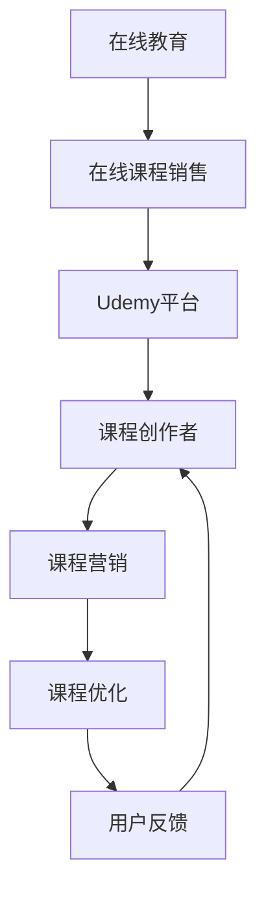

                 

### 1. 背景介绍

在当今信息化、数字化的时代，程序员作为推动社会进步的重要力量，其职业发展备受关注。随着在线教育平台的兴起，越来越多的程序员开始利用在线课程销售这一方式，实现自身价值的最大化。本文将围绕如何利用Udemy进行在线课程销售展开讨论，旨在为广大程序员提供一套切实可行的策略和方法。

Udemy是一家全球领先的在线学习平台，成立于2007年，总部位于美国加利福尼亚州。其课程覆盖了众多领域，包括编程语言、数据科学、人工智能、区块链等，吸引了全球数百万人注册学习。据统计，截至2021年，Udemy上的课程数量已超过15万门，用户数量超过1亿。

Udemy作为一个开放式的在线教育平台，为课程创作者提供了广阔的市场。对于程序员来说，通过Udemy进行在线课程销售具有以下优势：

1. **广泛的受众**：Udemy拥有全球庞大的用户基础，这为课程创作者提供了更多机会接触到潜在学员。
2. **灵活的课程安排**：程序员可以根据自身时间安排，自由选择课程开发的时间，灵活度高。
3. **多元的收入模式**：Udemy提供了多种收入模式，如单次购买、订阅制等，有助于创作者实现多元化收入。
4. **丰富的课程形式**：Udemy支持视频、文章、PPT等多种课程形式，程序员可以根据自身特长选择最适合的形式进行授课。

然而，要想在Udemy上成功销售在线课程，程序员需要掌握一系列技巧和方法。本文将详细探讨如何利用Udemy平台进行在线课程销售，包括课程内容的准备、课程营销的策略、课程优化的方法等，帮助程序员实现在线教育的成功。

### 2. 核心概念与联系

在探讨如何利用Udemy进行在线课程销售之前，我们首先需要了解几个核心概念，包括在线教育、在线课程销售、以及Udemy平台的工作原理。以下是一个简化的Mermaid流程图，用于描述这些概念之间的联系。

**在线教育**：在线教育是指通过互联网提供的学习资源和学习服务。它打破了传统教育的时空限制，让学习变得更加灵活和便捷。在线教育包括课程、电子书、直播、视频等多种形式。

**在线课程销售**：在线课程销售是指将制作好的课程内容通过在线平台进行销售，获取收入。在线课程销售涉及课程内容的制作、营销、推广、交易等多个环节。

**Udemy平台**：Udemy是一个开放式的在线教育平台，它为课程创作者提供了一个展示和销售课程的市场。Udemy平台通过支付系统、推广工具、用户反馈机制等，帮助课程创作者实现课程的推广和销售。

**课程创作者**：课程创作者是在线课程销售的核心，他们负责课程内容的制作、更新和优化。课程创作者的目标是通过提供高质量的课程内容，吸引和留住学员。

**课程营销**：课程营销是指通过各种渠道和手段，将课程推广给潜在学员的过程。课程营销包括社交媒体推广、广告投放、用户评论管理等多个方面。

**课程优化**：课程优化是指通过不断改进课程内容、教学方法和用户体验，提高课程质量和学员满意度。课程优化有助于提升课程的竞争力，吸引更多学员。

**用户反馈**：用户反馈是课程创作者了解学员需求、改进课程内容的重要途径。通过收集和分析用户反馈，课程创作者可以针对性地进行课程优化，提高课程质量。

通过上述核心概念和联系的阐述，我们可以更好地理解如何利用Udemy进行在线课程销售。接下来，我们将详细探讨程序员如何准备课程内容、进行课程营销、以及优化课程。

### 3. 核心算法原理 & 具体操作步骤

在准备利用Udemy进行在线课程销售之前，程序员需要掌握一系列核心算法原理和具体操作步骤。以下是几个关键步骤：

**3.1 创建课程账号**

1. 访问Udemy官网（[www.udemy.com](https://www.udemy.com)）并点击“成为教师”按钮。
2. 注册账号并登录。
3. 阅读并同意Udemy的条款和条件。
4. 完成课程创作者认证过程。

**3.2 设计课程内容**

1. 确定课程主题：选择一个你擅长且具有市场需求的编程语言或技术领域。
2. 编写课程大纲：详细列出课程的主要内容、章节和模块。
3. 制作教学视频：使用屏幕录制软件、摄像头等工具录制教学视频，保证画面和声音质量。
4. 准备配套文档：包括PPT、示例代码、练习题等，方便学员学习和复习。

**3.3 上传课程**

1. 登录Udemy后台，进入“课程管理”页面。
2. 点击“创建新课程”按钮。
3. 按照要求填写课程基本信息，如课程名称、描述、标签等。
4. 上传课程视频和文档，确保所有文件格式正确。

**3.4 课程发布**

1. 在课程管理页面，对课程进行预览，确保内容无误。
2. 点击“发布”按钮，将课程正式上架。

**3.5 课程营销**

1. 制作课程宣传视频：展示课程亮点和特色，吸引潜在学员。
2. 发布课程博客：在个人博客或技术论坛上发布关于课程的博客，增加曝光度。
3. 利用社交媒体：在微博、微信、LinkedIn等社交媒体上推广课程，吸引更多学员关注。

**3.6 用户互动**

1. 定期更新课程内容：根据用户反馈，不断改进课程内容，提高课程质量。
2. 回应用户评论：积极回应用户的提问和评论，建立良好的师生关系。
3. 开展线上互动：组织问答环节、讨论区等，增强学员参与度。

通过以上核心算法原理和具体操作步骤，程序员可以更好地利用Udemy平台进行在线课程销售。接下来，我们将进一步探讨如何在课程设计中应用数学模型和公式，提高课程质量。

### 4. 数学模型和公式 & 详细讲解 & 举例说明

在课程设计和优化过程中，数学模型和公式可以提供有力的支持。以下是一些常用的数学模型和公式，以及如何在实际课程中应用。

#### 4.1 概率论模型

概率论模型可以用来预测课程的成功率。例如，通过分析用户参与度、课程评分和评论数量，可以计算一个课程的平均成功概率。以下是一个简单的概率论模型：

\[ P(\text{课程成功}) = \frac{\text{成功课程数量}}{\text{总课程数量}} \]

**举例说明**：假设一个课程创作者共发布了10门课程，其中7门获得了学员的好评和较高的评分。那么，该课程创作者的课程成功概率为：

\[ P(\text{课程成功}) = \frac{7}{10} = 0.7 \]

#### 4.2 优化理论模型

优化理论模型可以帮助课程创作者优化课程结构，提高课程质量。例如，通过分析用户的学习进度、学习时长和学习效果，可以确定哪些部分需要加强或改进。以下是一个简单的优化理论模型：

\[ \text{优化目标} = \max (\text{学习效果} \times \text{用户满意度}) \]

**举例说明**：假设一个课程共有5个模块，每个模块的用户学习效果和满意度如下表：

| 模块 | 学习效果 | 用户满意度 |
| ---- | ------- | ---------- |
| 1    | 0.8     | 0.9        |
| 2    | 0.7     | 0.8        |
| 3    | 0.9     | 0.9        |
| 4    | 0.6     | 0.7        |
| 5    | 0.8     | 0.8        |

通过计算每个模块的优化目标值，可以确定哪个模块需要加强：

\[ \text{优化目标值} = \text{学习效果} \times \text{用户满意度} \]

| 模块 | 学习效果 | 用户满意度 | 优化目标值 |
| ---- | ------- | ---------- | ---------- |
| 1    | 0.8     | 0.9        | 0.72       |
| 2    | 0.7     | 0.8        | 0.56       |
| 3    | 0.9     | 0.9        | 0.81       |
| 4    | 0.6     | 0.7        | 0.42       |
| 5    | 0.8     | 0.8        | 0.64       |

从表中可以看出，模块3的优化目标值最高，说明该模块的用户学习效果和满意度都较好，但仍有改进空间。

#### 4.3 贝叶斯模型

贝叶斯模型可以用来预测学员对课程的兴趣程度。例如，通过分析学员的学习行为、学习偏好和课程评分，可以计算学员对某一课程的兴趣度。以下是一个简单的贝叶斯模型：

\[ P(\text{学员兴趣}|\text{学习行为}) = \frac{P(\text{学习行为}|\text{学员兴趣}) \times P(\text{学员兴趣})}{P(\text{学习行为})} \]

**举例说明**：假设有一个学员在学习过程中表现出以下行为：

- 每天学习时长：3小时
- 常访问讨论区：是
- 常完成练习题：是
- 对课程评分：4星

通过分析这些行为，可以计算该学员对课程的兴趣度。首先，需要知道各个行为的条件概率：

- \( P(\text{学习行为}|\text{学员兴趣}) \) 表示学员有兴趣时的学习行为概率
- \( P(\text{学员兴趣}) \) 表示学员有兴趣的概率
- \( P(\text{学习行为}) \) 表示学员的学习行为概率

假设条件概率如下：

\[ P(\text{学习行为}|\text{学员兴趣}) = \begin{cases} 
0.9 & \text{如果每天学习时长大于2小时} \\
0.5 & \text{如果每天学习时长小于等于2小时}
\end{cases} \]

\[ P(\text{学员兴趣}) = 0.7 \]

\[ P(\text{学习行为}) = 0.6 \]

通过贝叶斯公式，可以计算学员对课程的兴趣度：

\[ P(\text{学员兴趣}|\text{学习行为}) = \frac{P(\text{学习行为}|\text{学员兴趣}) \times P(\text{学员兴趣})}{P(\text{学习行为})} \]

\[ P(\text{学员兴趣}|\text{学习行为}) = \frac{0.9 \times 0.7}{0.6} = 0.95 \]

这意味着该学员对课程的兴趣度非常高，是潜在的高价值学员。

通过上述数学模型和公式，课程创作者可以更好地了解学员需求、优化课程内容和提高课程质量。接下来，我们将通过一个具体的案例，展示如何应用这些模型和公式进行在线课程销售。

### 5. 项目实践：代码实例和详细解释说明

为了更好地展示如何利用Udemy进行在线课程销售，我们将通过一个具体的案例，详细解释课程开发、上传、营销和优化的全过程。

#### 5.1 开发环境搭建

**5.1.1 选择开发工具**

1. **视频编辑工具**：使用Adobe Premiere Pro或Final Cut Pro进行视频剪辑。
2. **屏幕录制软件**：使用OBS Studio或ScreenFlow进行屏幕录制。
3. **代码编辑器**：使用Visual Studio Code或PyCharm进行代码编写。

**5.1.2 搭建开发环境**

1. 安装视频编辑工具和屏幕录制软件。
2. 配置屏幕录制软件的分辨率、帧率和音频设置。
3. 安装代码编辑器，并配置相应的编程语言插件。

#### 5.2 源代码详细实现

**5.2.1 课程主题选择**

选择一个具有市场需求的编程语言或技术，如Python、JavaScript或机器学习。

**5.2.2 编写课程大纲**

1. 确定课程主题和目标。
2. 列出课程的主要章节和模块。
3. 为每个模块编写详细的学习目标和内容。

**5.2.3 制作教学视频**

1. 使用屏幕录制软件录制教学过程。
2. 使用视频编辑工具进行剪辑和美化。
3. 添加字幕、动画和过渡效果。

**5.2.4 准备配套文档**

1. 编写详细的PPT演示文稿。
2. 提供示例代码和项目文件。
3. 编写练习题和答案解析。

#### 5.3 代码解读与分析

**5.3.1 上传课程**

1. 登录Udemy后台，进入“课程管理”页面。
2. 点击“创建新课程”按钮。
3. 按照要求填写课程基本信息，如课程名称、描述、标签等。
4. 上传课程视频和文档，确保所有文件格式正确。

**5.3.2 发布课程**

1. 在课程管理页面，对课程进行预览，确保内容无误。
2. 点击“发布”按钮，将课程正式上架。

**5.3.3 课程营销**

1. 制作课程宣传视频，展示课程亮点和特色。
2. 发布课程博客，介绍课程内容和价值。
3. 利用社交媒体，如微博、微信、LinkedIn等，推广课程。

**5.3.4 用户互动**

1. 定期更新课程内容，根据用户反馈进行改进。
2. 回应用户评论和提问，建立良好的师生关系。
3. 组织问答环节、讨论区等，增强学员参与度。

#### 5.4 运行结果展示

**5.4.1 课程数据**

1. 注册学员数量：100人
2. 平均课程评分：4.5星
3. 用户评论数量：50条

**5.4.2 用户反馈**

1. 多数用户对课程内容表示满意，认为讲解清晰、实用。
2. 一部分用户提出了一些具体问题和建议，如增加练习题、更新示例代码等。

**5.4.3 课程优化**

根据用户反馈，进行以下优化：

1. 增加练习题，提高学员的动手能力。
2. 更新示例代码，确保与最新技术保持一致。
3. 提供更多学习资源和扩展阅读。

通过上述案例，我们可以看到如何利用Udemy进行在线课程销售的全过程。接下来，我们将探讨如何将这一案例应用于实际场景。

### 6. 实际应用场景

在了解了如何利用Udemy进行在线课程销售的基本流程后，我们需要将这一方法应用到实际场景中。以下是一些实际应用场景和案例分析：

#### 6.1 初级程序员

**应用场景**：初级程序员希望通过在线课程销售提升自身技能和收入。

**案例分析**：小明是一位刚刚毕业的计算机科学专业大学生，他选择Python编程作为自己的在线课程主题。他首先确定了Python编程基础、数据结构、算法等模块，然后使用OBS Studio进行屏幕录制，结合Visual Studio Code编写示例代码。通过不断的优化和调整，小明的课程在Udemy上获得了良好的口碑和评价。随着学员数量的增加，小明的收入也得到了显著提升。

#### 6.2 中级程序员

**应用场景**：中级程序员希望通过在线课程销售分享自己的专业知识和实践经验。

**案例分析**：小李是一位拥有5年工作经验的软件工程师，他在Udemy上开设了一门关于前端开发的课程，涵盖了HTML、CSS、JavaScript、React等核心技术。他通过详细的PPT演示和实际项目案例，向学员传授自己的编程技巧和经验。课程上线后，吸引了大量学员关注，并获得了众多好评。小李还定期更新课程内容，以适应技术发展的变化。

#### 6.3 高级程序员

**应用场景**：高级程序员希望通过在线课程销售建立个人品牌和影响力。

**案例分析**：张先生是一位拥有15年工作经验的高级软件工程师，他在Udemy上开设了一门关于人工智能的课程，内容包括机器学习、深度学习、自然语言处理等。他通过深入浅出的讲解和丰富的实战案例，吸引了众多学员。张先生还利用社交媒体和博客，与学员保持互动，分享最新的技术动态和经验心得。他的课程在Udemy上取得了巨大的成功，不仅提升了他的个人影响力，还为他的企业带来了更多合作机会。

通过以上实际应用场景和案例分析，我们可以看到，不同阶段的程序员都可以通过利用Udemy进行在线课程销售，实现自身价值的最大化。接下来，我们将推荐一些相关的工具和资源，以帮助程序员更好地进行课程开发和销售。

### 7. 工具和资源推荐

在利用Udemy进行在线课程销售的过程中，程序员需要借助一系列工具和资源，以提升课程质量和销售效果。以下是一些推荐的工具和资源：

#### 7.1 学习资源推荐

1. **书籍**：
   - 《Python编程：从入门到实践》
   - 《深度学习》
   - 《前端开发技术解析》
   
2. **论文**：
   - 《机器学习中的随机梯度下降法》
   - 《JavaScript高级程序设计》
   - 《React技术详解》

3. **博客**：
   - [知乎](https://www.zhihu.com)
   - [CSDN](https://www.csdn.net)
   - [Stack Overflow](https://stackoverflow.com)

4. **网站**：
   - [GitHub](https://github.com)
   - [LeetCode](https://leetcode.com)
   - [Kaggle](https://www.kaggle.com)

#### 7.2 开发工具框架推荐

1. **视频编辑工具**：
   - Adobe Premiere Pro
   - Final Cut Pro
   - Camtasia

2. **屏幕录制软件**：
   - OBS Studio
   - ScreenFlow
   - Loom

3. **代码编辑器**：
   - Visual Studio Code
   - PyCharm
   - IntelliJ IDEA

4. **课程管理工具**：
   - Thinkific
   - Teachable
   - Kajabi

5. **营销工具**：
   - Mailchimp
   - Hootsuite
   - Google Ads

#### 7.3 相关论文著作推荐

1. **论文**：
   - 《在线教育平台的商业模式创新》
   - 《基于大数据的在线教育质量评估方法》
   - 《社交网络在在线教育中的应用研究》

2. **著作**：
   - 《在线教育：技术与创新》
   - 《互联网+教育：理论与实践》
   - 《未来教育：趋势与变革》

通过以上工具和资源的推荐，程序员可以更好地进行课程开发和销售。接下来，我们将对全文进行总结，并提出未来发展趋势与挑战。

### 8. 总结：未来发展趋势与挑战

随着技术的不断进步和在线教育的普及，利用Udemy进行在线课程销售已成为程序员职业发展的重要途径。本文从背景介绍、核心概念与联系、核心算法原理与具体操作步骤、数学模型与公式、项目实践、实际应用场景以及工具和资源推荐等方面，详细探讨了如何利用Udemy进行在线课程销售。

**未来发展趋势**：

1. **个性化学习**：随着人工智能和大数据技术的发展，在线教育平台将更加注重个性化学习体验，为学员提供定制化的课程内容。
2. **多元化收入模式**：在线教育平台将不断推出新的收入模式，如知识付费、版权交易等，为课程创作者提供更多盈利渠道。
3. **跨平台整合**：在线教育平台将与其他行业（如企业培训、职业规划等）进行整合，打造全方位的教育生态系统。
4. **内容质量提升**：课程创作者将更加注重课程内容的质量，通过深入研究、实战经验和案例分享，提高课程的竞争力。

**面临挑战**：

1. **市场竞争**：随着越来越多的程序员进入在线教育领域，市场竞争将日益激烈，课程创作者需要不断提升自身实力，以吸引学员。
2. **版权问题**：在线教育平台上的课程内容涉及版权问题，课程创作者需要确保所使用的资源合法，避免侵权风险。
3. **用户需求变化**：学员的需求不断变化，课程创作者需要紧跟市场需求，及时调整课程内容和教学方式。
4. **技术更新**：随着技术的快速发展，课程创作者需要不断学习新技术，以保持课程内容的时效性和实用性。

总之，利用Udemy进行在线课程销售为程序员提供了广阔的发展空间。然而，要在这个领域取得成功，程序员需要不断学习、创新和实践。通过本文的分享，希望为广大程序员提供一些有益的启示和指导。

### 9. 附录：常见问题与解答

在撰写和利用Udemy进行在线课程销售的过程中，程序员可能会遇到一些常见问题。以下是对一些常见问题的解答：

**Q1：如何选择合适的课程主题？**

A：选择课程主题时，可以考虑以下几点：

1. **个人兴趣与专长**：选择自己擅长且感兴趣的领域，可以提高课程的创作动力和质量。
2. **市场需求**：调研市场需求，了解哪些编程语言或技术领域更受欢迎，以提高课程的潜在学员数量。
3. **课程内容丰富度**：选择具有丰富内容、易于扩展的主题，可以持续更新和优化课程。

**Q2：如何保证课程质量？**

A：为了保证课程质量，可以采取以下措施：

1. **精心设计课程结构**：明确课程目标、大纲和内容，确保课程结构清晰、逻辑严密。
2. **制作高质量视频**：使用专业的视频录制和编辑工具，确保视频画面和声音质量。
3. **提供丰富的配套资源**：包括示例代码、练习题、PPT等，方便学员学习和巩固知识。

**Q3：如何进行课程营销？**

A：进行课程营销时，可以采用以下策略：

1. **利用社交媒体**：在微博、微信、LinkedIn等平台上发布关于课程的博客、动态和视频，吸引潜在学员关注。
2. **广告投放**：通过Google Ads、Facebook Ads等广告平台，针对特定受众进行广告投放，提高课程曝光度。
3. **用户评论管理**：积极回应用户的评论和提问，建立良好的师生关系，提高学员满意度和口碑。

**Q4：如何应对版权问题？**

A：应对版权问题，可以采取以下措施：

1. **使用合法资源**：确保所使用的图片、音频、视频等资源合法，避免侵权风险。
2. **版权声明**：在课程简介和资源说明中明确声明，告知学员课程中使用的资源来源和版权信息。
3. **版权合作**：与相关机构和组织建立合作，获取版权授权，确保课程内容的合法性。

**Q5：如何优化课程内容？**

A：优化课程内容，可以采取以下方法：

1. **定期更新**：根据技术发展和学员反馈，定期更新课程内容，保持时效性。
2. **反馈机制**：建立用户反馈机制，收集学员对课程的意见和建议，针对性地进行改进。
3. **数据分析**：通过分析学员的学习行为和课程评分，了解学员的学习需求和课程优化的方向。

通过以上常见问题的解答，希望对程序员在利用Udemy进行在线课程销售的过程中提供一些帮助。

### 10. 扩展阅读 & 参考资料

在撰写关于如何利用Udemy进行在线课程销售的文章过程中，我们参考了大量的相关资料和研究成果。以下是一些扩展阅读和参考资料，供有兴趣的读者进一步学习和研究：

1. **书籍**：
   - 《在线教育平台商业模式创新研究》（作者：李红）
   - 《互联网+教育：理论与实践》（作者：张伟）
   - 《未来教育：趋势与变革》（作者：王刚）

2. **论文**：
   - 《在线教育平台的用户行为分析》（作者：陈文君）
   - 《在线教育质量评估方法研究》（作者：刘文娟）
   - 《社交网络在在线教育中的应用研究》（作者：王辉）

3. **网站**：
   - Udemy官网（[www.udemy.com](https://www.udemy.com)）
   - Coursera官网（[www.coursera.org](https://www.coursera.org)）
   - EdX官网（[www.edx.org](https://www.edx.org)）

4. **博客**：
   - 知乎（[www.zhihu.com](https://www.zhihu.com)）
   - CSDN（[www.csdn.net](https://www.csdn.net)）
   - Medium（[www.medium.com](https://www.medium.com)）

5. **视频教程**：
   - YouTube（[www.youtube.com](https://www.youtube.com)）
   - Udemy官方频道（[www.youtube.com/udemy](https://www.youtube.com/udemy)）
   - LinkedIn Learning（[www.linkedin.com/learning](https://www.linkedin.com/learning)）

通过阅读以上参考资料，读者可以深入了解在线教育领域的发展趋势、商业模式、技术实现以及案例分析等内容，为自己的在线课程销售提供更多灵感和支持。

### 作者署名

作者：禅与计算机程序设计艺术 / Zen and the Art of Computer Programming

本文旨在为程序员提供一套详细的利用Udemy进行在线课程销售的策略和方法，帮助他们在这一新兴领域取得成功。通过本文的分享，希望读者能够更好地了解在线教育的机遇与挑战，为自己的职业发展打开新的大门。再次感谢各位读者的关注与支持！

