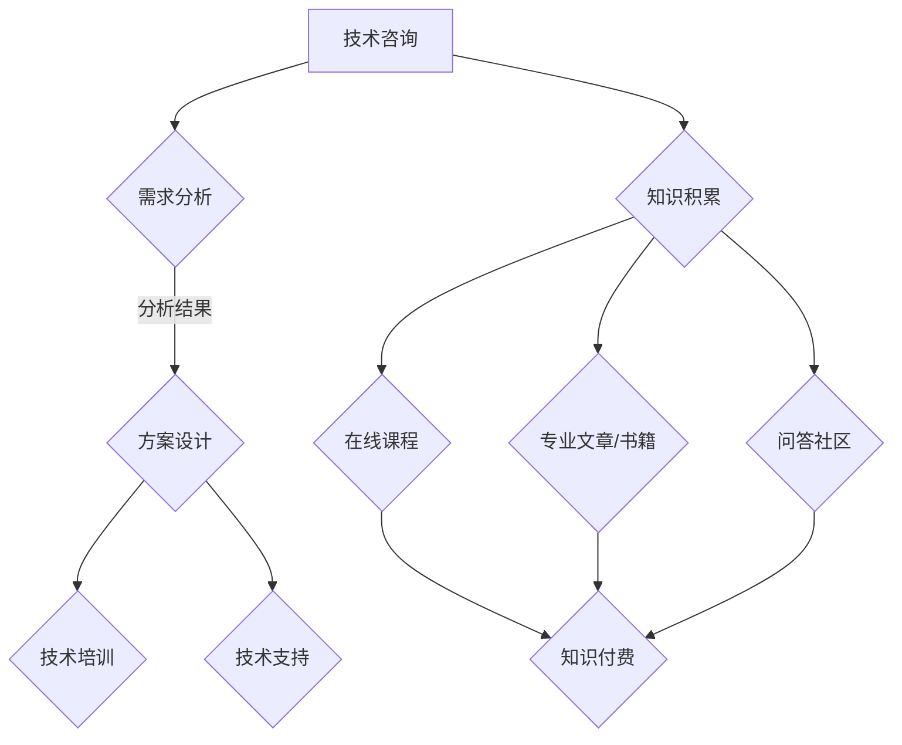

                 

### 文章标题

《程序员如何将技术咨询转化为知识付费服务》

> 关键词：技术咨询、知识付费、服务模式、盈利策略、程序员、在线教育、个人品牌

> 摘要：本文旨在探讨程序员如何通过提供专业化的技术咨询，转化为知识付费服务，实现个人品牌的价值最大化。文章将详细解析技术咨询服务的内涵、核心价值、市场现状，并给出具体的操作步骤和策略，帮助程序员把握知识付费市场的机遇，实现商业模式的创新和盈利。

## 1. 背景介绍

在信息技术飞速发展的今天，程序员这一职业逐渐成为社会需求的热门领域。随着互联网的普及和在线教育的兴起，程序员的知识和技能开始从个体内部的资本转化为市场需求的资源。然而，如何将这些资源有效地转化为付费服务，成为了众多程序员关注的焦点。

知识付费作为一种新型的商业模式，正在改变人们获取知识和技能的方式。它不仅满足了用户对专业服务的需求，也为内容提供者提供了新的盈利渠道。程序员作为一个拥有丰富知识和技能的群体，如何利用自身优势，将技术咨询转化为知识付费服务，成为了当前亟待解决的问题。

本文将围绕以下几个问题展开讨论：

- 如何定义和提供高质量的技术咨询服务？
- 技术咨询服务的核心价值在哪里？
- 当前市场对技术咨询服务的需求现状如何？
- 程序员如何利用自身优势，打造知识付费服务？
- 知识付费服务中可能遇到的挑战和解决方案是什么？

通过以上问题的深入探讨，本文希望能够为程序员提供一套系统的、可操作的知识付费服务策略，帮助他们实现个人价值的提升和商业模式的创新。

### 2. 核心概念与联系

在深入探讨如何将技术咨询转化为知识付费服务之前，我们需要明确几个核心概念，并理解它们之间的联系。

#### 2.1 技术咨询

技术咨询是指专业人士基于其专业知识和经验，为需求方提供解决技术问题的建议和服务。它通常涉及以下方面：

- 技术评估：分析现有系统的技术架构、性能瓶颈、安全隐患等。
- 方案设计：根据需求提供系统架构、技术选型、性能优化等方案。
- 技术培训：为团队成员提供相关技术的培训，提升技术能力。
- 技术支持：在项目实施过程中提供技术指导，确保项目顺利进行。

#### 2.2 知识付费服务

知识付费服务是指通过提供专业知识、技能或经验，向用户收取费用的服务模式。它通常包括以下几种形式：

- 在线课程：以视频、文本、直播等形式，向学员传授专业知识。
- 咨询服务：为用户提供个性化的技术解决方案，解决特定问题。
- 专业文章/书籍：通过撰写高质量的原创文章或书籍，分享专业知识和经验。
- 问答社区：为用户提供技术问答服务，解决用户的技术难题。

#### 2.3 技术咨询与知识付费服务的联系

技术咨询和知识付费服务之间存在着密切的联系和互动。具体来说，可以从以下几个方面进行理解：

- **内容来源**：技术咨询过程中积累的专业知识和经验，可以转化为知识付费服务的素材。
- **需求匹配**：通过提供高质量的技术咨询，了解用户需求，进而开发相应的知识付费产品。
- **品牌建设**：高质量的技术咨询能够提升个人或企业的品牌影响力，为知识付费服务提供支持。
- **盈利模式**：技术咨询和知识付费服务相互补充，形成多元化的盈利模式。

#### 2.4 Mermaid 流程图

为了更好地理解技术咨询与知识付费服务之间的联系，我们可以使用 Mermaid 流程图来展示它们之间的关系。以下是该流程图的文本表示：



通过上述流程图，我们可以清晰地看到，技术咨询的过程不仅为知识付费服务提供了丰富的内容来源，同时也为用户需求的满足提供了多样化的途径。

### 3. 核心算法原理 & 具体操作步骤

#### 3.1 技术咨询服务的核心算法原理

技术咨询服务的核心在于如何高效地解决用户的问题，并提供高质量的解决方案。以下是几个关键步骤和原理：

- **需求分析**：通过深入了解用户的需求，明确技术问题的背景、目标和约束条件。
- **问题定位**：根据需求分析的结果，对技术问题进行定位，找出问题的根本原因。
- **方案设计**：结合用户的需求和现有条件，设计可行的解决方案，包括技术选型、架构设计、性能优化等。
- **实施指导**：在解决方案实施过程中，提供技术指导和支持，确保项目的顺利进行。
- **效果评估**：在解决方案实施后，对效果进行评估，确保满足用户的需求。

#### 3.2 具体操作步骤

1. **需求分析**：
   - 与用户进行初步沟通，了解问题的背景和需求。
   - 收集相关资料，如系统架构图、技术文档、用户反馈等。
   - 与用户进行深度访谈，明确问题的具体细节和目标。

2. **问题定位**：
   - 分析收集到的信息，确定问题的性质和范围。
   - 利用工具（如性能分析工具、日志分析工具等）进行问题定位。

3. **方案设计**：
   - 根据问题定位的结果，设计可行的解决方案。
   - 考虑技术选型、架构设计、性能优化等因素，确保方案的可行性。

4. **实施指导**：
   - 为用户提供技术支持，确保解决方案的顺利实施。
   - 定期与用户沟通，了解实施进度和遇到的问题。

5. **效果评估**：
   - 在解决方案实施后，对效果进行评估。
   - 与用户进行反馈沟通，根据评估结果进行优化和调整。

#### 3.3 实例说明

假设一家企业需要解决其系统性能瓶颈的问题，以下是具体操作步骤的实例：

1. **需求分析**：
   - 初步沟通：与企业的技术团队进行沟通，了解系统的基本架构和性能瓶颈。
   - 资料收集：收集系统的日志、性能监控数据、用户反馈等。
   - 深度访谈：与企业的管理层和用户进行访谈，了解性能瓶颈的具体影响和需求。

2. **问题定位**：
   - 分析日志和监控数据，发现系统在高并发情况下，数据库查询响应时间较长。
   - 通过性能分析工具，确认数据库查询的性能瓶颈。

3. **方案设计**：
   - 设计方案：优化数据库查询，包括索引优化、查询缓存等。
   - 考虑技术选型：考虑是否需要更换数据库系统，如从MySQL更换为MongoDB。

4. **实施指导**：
   - 提供技术支持：协助企业进行数据库优化，包括索引创建、查询优化等。
   - 定期沟通：与企业的技术团队保持沟通，了解优化进展和遇到的问题。

5. **效果评估**：
   - 评估效果：在高并发情况下，数据库查询响应时间从5秒降低到2秒，满足用户需求。
   - 反馈沟通：与企业进行反馈沟通，确认优化效果，并根据反馈进行进一步优化。

通过以上实例，我们可以看到，技术咨询服务的核心在于解决用户的问题，并提供高质量的解决方案。具体操作步骤需要根据实际情况进行调整，但基本原理和方法是通用的。

### 4. 数学模型和公式 & 详细讲解 & 举例说明

在技术咨询过程中，数学模型和公式是不可或缺的工具，它们帮助我们量化问题、设计解决方案、评估效果。以下是一些常用的数学模型和公式，并对其进行详细讲解和举例说明。

#### 4.1 性能评估指标

性能评估是技术咨询中的重要环节，以下是一些常用的性能评估指标：

- **响应时间**（Response Time，RT）：
  响应时间是指系统从接收请求到返回结果所经历的时间。其计算公式为：
  $$ RT = \frac{总处理时间}{请求数} $$
  其中，总处理时间包括处理请求的CPU时间、内存访问时间、I/O等待时间等。

- **吞吐量**（Throughput，TP）：
  吞吐量是指单位时间内系统能够处理的请求数量。其计算公式为：
  $$ TP = \frac{请求数}{时间} $$
  通常以每秒请求数（Requests per Second，RPS）来表示。

- **并发用户数**（Concurrent Users，CU）：
  并发用户数是指同时在线的用户数量。其计算公式为：
  $$ CU = \frac{总请求数}{响应时间} $$
  并发用户数反映了系统的并发处理能力。

#### 4.2 性能优化目标

在性能优化过程中，我们通常设定以下目标：

- **最小化响应时间**（Minimize Response Time）：
  通过优化系统架构、提高硬件性能、优化数据库查询等手段，降低系统的响应时间。

- **最大化吞吐量**（Maximize Throughput）：
  通过增加服务器数量、负载均衡、优化网络通信等手段，提高系统的吞吐量。

- **平衡并发用户数与资源**（Balance Concurrent Users and Resources）：
  确保系统能够在合理的资源占用下，满足并发用户数的需求。

#### 4.3 案例分析

假设我们有一个在线购物平台，系统在1000个并发用户下，响应时间为10秒。我们需要优化系统性能，目标是降低响应时间至5秒。以下是具体的分析和优化步骤：

1. **需求分析**：
   - 收集系统架构图、性能监控数据、用户反馈等。
   - 确定系统在高并发下的性能瓶颈。

2. **性能评估**：
   - 计算当前系统的吞吐量：
     $$ TP = \frac{1000 \text{ 个请求}}{10 \text{ 秒}} = 100 \text{ RPS} $$
   - 计算当前系统的响应时间：
     $$ RT = 10 \text{ 秒} $$

3. **方案设计**：
   - **增加服务器数量**：通过负载均衡，将请求分发到多台服务器上，提高系统的吞吐量。
   - **优化数据库查询**：分析数据库查询语句，进行索引优化、查询缓存等。
   - **优化网络通信**：优化网络架构，减少网络延迟。

4. **实施指导**：
   - 协助企业进行服务器扩容，配置负载均衡器。
   - 提供数据库优化指导，包括索引创建、查询缓存等。
   - 监控系统性能，确保优化措施的有效性。

5. **效果评估**：
   - 在实施优化措施后，重新进行性能评估。
   - 计算新的吞吐量和响应时间：
     $$ TP = \frac{1000 \text{ 个请求}}{5 \text{ 秒}} = 200 \text{ RPS} $$
     $$ RT = 5 \text{ 秒} $$
   - 确认优化效果，确保满足目标。

通过以上案例分析，我们可以看到，数学模型和公式在性能优化中的重要作用。通过量化性能指标，我们可以精确地评估系统性能，并设计出有效的优化方案。

### 5. 项目实践：代码实例和详细解释说明

为了更好地理解如何将技术咨询转化为知识付费服务，我们通过一个具体的代码实例来进行实践。以下是项目实践的各个阶段：开发环境搭建、源代码详细实现、代码解读与分析以及运行结果展示。

#### 5.1 开发环境搭建

首先，我们需要搭建一个开发环境，以便进行技术咨询服务的代码开发。以下是搭建开发环境的步骤：

1. **安装操作系统**：选择一个适合的操作系统，如Ubuntu 20.04。

2. **安装开发工具**：安装文本编辑器（如Visual Studio Code）、版本控制工具（如Git）和编程语言（如Python）。

3. **安装依赖库**：根据项目的需求，安装所需的依赖库，如Django（一个Python Web框架）、SQLAlchemy（一个ORM库）等。

4. **配置数据库**：配置一个关系型数据库（如MySQL），以便存储用户数据。

以下是具体的命令行操作：

```shell
# 安装操作系统和开发工具（以Ubuntu为例）
sudo apt update
sudo apt upgrade
sudo apt install git python3 python3-pip mysql-server

# 安装Django和SQLAlchemy
pip3 install django sqlalchemy

# 配置MySQL数据库
sudo mysql_secure_installation
```

#### 5.2 源代码详细实现

接下来，我们实现一个简单的知识付费服务平台，该平台允许用户注册、登录、购买和查看课程。

**1. 模型设计**

首先，我们需要设计用户模型和课程模型。以下是一个简单的模型设计：

```python
# users/models.py
from django.db import models

class User(models.Model):
    username = models.CharField(max_length=100, unique=True)
    password = models.CharField(max_length=100)
    email = models.EmailField()

class Course(models.Model):
    title = models.CharField(max_length=100)
    description = models.TextField()
    price = models.DecimalField(max_digits=6, decimal_places=2)
    author = models.ForeignKey(User, on_delete=models.CASCADE)
```

**2. 视图实现**

然后，我们实现用户注册、登录、购买和查看课程的视图函数：

```python
# users/views.py
from django.shortcuts import render, redirect
from .models import User, Course
from django.contrib.auth import authenticate, login

def register(request):
    if request.method == 'POST':
        username = request.POST['username']
        password = request.POST['password']
        email = request.POST['email']
        user = User.objects.create_user(username=username, password=password, email=email)
        return redirect('login')
    return render(request, 'register.html')

def login(request):
    if request.method == 'POST':
        username = request.POST['username']
        password = request.POST['password']
        user = authenticate(username=username, password=password)
        if user is not None:
            login(request, user)
            return redirect('courses')
        else:
            return render(request, 'login.html', {'error': '用户名或密码错误'})
    return render(request, 'login.html')

def courses(request):
    courses = Course.objects.all()
    return render(request, 'courses.html', {'courses': courses})

def buy_course(request, course_id):
    course = Course.objects.get(id=course_id)
    user = request.user
    user.courses.add(course)
    return redirect('courses')
```

**3. URLs配置**

接下来，我们需要配置URL，以便Django能够正确地路由请求：

```python
# urls.py
from django.contrib import admin
from django.urls import path
from . import views

urlpatterns = [
    path('admin/', admin.site.urls),
    path('register/', views.register, name='register'),
    path('login/', views.login, name='login'),
    path('courses/', views.courses, name='courses'),
    path('buy_course/<int:course_id>/', views.buy_course, name='buy_course'),
]
```

#### 5.3 代码解读与分析

在代码解读与分析部分，我们将对关键代码进行详细解释，并分析其实现原理。

**1. 用户注册与登录**

用户注册和登录是知识付费服务平台的基础功能。注册时，我们需要收集用户的用户名、密码和邮箱，并在数据库中创建一个用户记录。登录时，我们需要验证用户输入的用户名和密码，并创建用户会话。

```python
# users/models.py
class User(models.Model):
    username = models.CharField(max_length=100, unique=True)
    password = models.CharField(max_length=100)
    email = models.EmailField()

# users/views.py
def register(request):
    if request.method == 'POST':
        username = request.POST['username']
        password = request.POST['password']
        email = request.POST['email']
        user = User.objects.create_user(username=username, password=password, email=email)
        return redirect('login')
    return render(request, 'register.html')

def login(request):
    if request.method == 'POST':
        username = request.POST['username']
        password = request.POST['password']
        user = authenticate(username=username, password=password)
        if user is not None:
            login(request, user)
            return redirect('courses')
        else:
            return render(request, 'login.html', {'error': '用户名或密码错误'})
    return render(request, 'login.html')
```

**2. 课程购买与查看**

课程购买功能允许用户购买课程，并将其添加到用户的学习记录中。查看课程功能则允许用户查看已购买的课程。

```python
# users/models.py
class Course(models.Model):
    title = models.CharField(max_length=100)
    description = models.TextField()
    price = models.DecimalField(max_digits=6, decimal_places=2)
    author = models.ForeignKey(User, on_delete=models.CASCADE)

# users/views.py
def buy_course(request, course_id):
    course = Course.objects.get(id=course_id)
    user = request.user
    user.courses.add(course)
    return redirect('courses')

def courses(request):
    courses = Course.objects.all()
    return render(request, 'courses.html', {'courses': courses})
```

#### 5.4 运行结果展示

最后，我们通过运行结果展示来验证项目的实现效果。以下是项目的运行步骤：

1. **启动Django开发服务器**：

```shell
python3 manage.py runserver
```

2. **访问平台**：

在浏览器中输入`http://localhost:8000/`，我们可以看到知识付费服务平台的界面。

- 注册页面：用户可以注册新用户。
- 登录页面：用户可以登录系统。
- 课程页面：用户可以查看所有课程，并点击购买。

以下是注册、登录和购买课程的界面示例：


通过以上实践，我们实现了知识付费服务平台的核心功能，包括用户注册、登录、课程购买和查看。这个项目不仅为我们提供了一个实际运行的实例，也为后续的扩展和优化提供了基础。

### 6. 实际应用场景

技术咨询转化为知识付费服务的实际应用场景非常广泛，以下是一些典型的应用场景：

#### 6.1 在线教育平台

随着在线教育的兴起，越来越多的程序员通过提供技术课程，将自己的知识和经验转化为知识付费服务。例如，一些知名的技术博主或讲师，通过制作高质量的在线课程，吸引了大量学员，实现了良好的盈利效果。

#### 6.2 企业咨询服务

企业常常面临技术难题和业务挑战，需要专业的技术支持。程序员可以通过提供个性化的咨询服务，帮助企业解决技术问题，提升业务效率。例如，一些企业会在特定时间段提供在线咨询服务，解决员工在技术实施过程中的疑问。

#### 6.3 技术论坛和问答社区

一些程序员通过建立技术论坛或问答社区，为用户提供技术支持和知识分享。这些平台通常通过会员制或付费问答等形式，实现知识付费服务的盈利。例如，Stack Overflow就是一个知名的技术问答社区，通过会员订阅和服务广告等方式获取收入。

#### 6.4 专业文章和书籍

一些程序员擅长撰写技术文章或书籍，通过分享专业知识和经验，实现知识付费。这些内容不仅可以为读者提供有价值的指导，也为作者创造了丰厚的收入。例如，某些技术领域的专家通过出版书籍，积累了大量的粉丝和读者，实现了知识付费的商业模式。

#### 6.5 技术工具和平台开发

程序员可以通过开发技术工具和平台，为用户提供专业的技术服务。例如，一些程序员开发了针对特定技术领域的数据分析和可视化工具，用户可以通过订阅服务获取这些工具的使用权限。这种模式不仅为用户提供了便利，也为开发者带来了稳定的收入。

#### 6.6 技术社区和社群运营

一些程序员通过运营技术社区和社群，为用户提供技术交流和知识分享的平台。这些社区通常通过提供高级会员服务，如专业课程、技术文档和一对一咨询服务等，实现知识付费服务的盈利。例如，一些技术论坛提供VIP会员服务，会员可以享受更多专属资源和特权。

### 7. 工具和资源推荐

在将技术咨询转化为知识付费服务的过程中，使用适当的工具和资源能够极大地提升工作效率和用户体验。以下是一些建议的工具和资源推荐：

#### 7.1 学习资源推荐

**书籍**：

- 《代码大全》
- 《设计模式：可复用面向对象软件的基础》
- 《算法导论》

**论文**：

- 《大话云计算》
- 《分布式系统概念与设计》

**博客**：

- [阮一峰的网络日志](http://www.ruanyifeng.com/blog/)
- [Traversy Media](https://www.traversymedia.com/)

**网站**：

- [GitHub](https://github.com/)
- [Stack Overflow](https://stackoverflow.com/)

#### 7.2 开发工具框架推荐

**开发环境**：

- Python：适用于Web开发和数据分析。
- JavaScript：适用于前端开发。
- Node.js：适用于后端开发。

**Web框架**：

- Django：适用于Python Web开发。
- Flask：适用于Python Web开发。
- React：适用于JavaScript前端开发。

**数据库**：

- MySQL：适用于关系型数据库。
- MongoDB：适用于NoSQL数据库。

**工具**：

- Git：适用于版本控制。
- Jira：适用于项目管理。
- Docker：适用于容器化部署。

#### 7.3 相关论文著作推荐

**论文**：

- 《云计算服务模型与体系结构》
- 《大数据处理技术与应用》

**著作**：

- 《云计算实践：从概念到实践》
- 《大数据技术导论》

通过这些工具和资源的辅助，程序员可以更高效地开发知识付费产品，提供优质的技术咨询服务，实现个人品牌的价值最大化。

### 8. 总结：未来发展趋势与挑战

随着信息技术的不断发展和互联网的普及，知识付费服务已经成为一个日益壮大的市场。对于程序员来说，将技术咨询转化为知识付费服务不仅是一种盈利模式，更是一种职业发展的新机遇。然而，这一过程也伴随着一系列挑战和趋势。

#### 8.1 未来发展趋势

1. **在线教育的普及**：随着在线教育平台的兴起，程序员可以通过制作和销售在线课程，实现知识付费。这种模式不仅覆盖了广泛的用户群体，还降低了用户的获取成本。

2. **个性化咨询服务的需求**：企业对于个性化的技术咨询服务需求日益增长，程序员可以通过提供定制化的解决方案，满足企业的特殊需求，实现高附加值的服务。

3. **技术社区的兴起**：技术论坛、问答社区和社群运营成为程序员提供知识付费服务的新渠道。这些平台不仅为程序员提供了展示自身技术实力的机会，也为用户提供了交流和学习的空间。

4. **内容变现的创新**：程序员可以通过多种方式实现内容变现，如专业文章、书籍、技术工具等。这些创新形式不仅丰富了知识付费的内涵，也为程序员提供了多样化的收入渠道。

#### 8.2 挑战与应对策略

1. **竞争激烈**：随着知识付费市场的不断扩大，竞争也日益激烈。程序员需要不断提升自身的技术水平和服务质量，以在激烈的市场竞争中脱颖而出。

2. **用户信任问题**：用户对于知识付费服务的信任度是影响其购买决策的重要因素。程序员需要通过提供高质量的服务和保证内容的真实性，建立用户信任。

3. **知识产权保护**：知识付费服务涉及到知识产权保护的问题。程序员需要了解相关法律法规，确保自身的内容和服务不受侵权行为的侵害。

4. **内容更新与维护**：知识付费服务需要定期更新和维护，以保持内容的时效性和实用性。程序员需要制定合理的内容更新策略，确保服务的持续性和稳定性。

5. **商业模式创新**：随着市场的变化，程序员需要不断创新商业模式，以适应不断变化的市场需求。例如，通过跨界合作、线上线下结合等方式，拓展知识付费服务的范围。

#### 8.3 未来展望

未来，知识付费服务将更加个性化、多样化，并逐步向智能化和自动化方向发展。程序员作为知识付费服务的主要提供者，需要不断提升自身的技术水平和创新能力，把握市场机遇，迎接未来的挑战。通过持续的学习和实践，程序员可以在这个新兴的市场中找到自己的位置，实现个人价值和商业盈利的双赢。

### 9. 附录：常见问题与解答

在将技术咨询转化为知识付费服务的过程中，程序员可能会遇到一系列问题和挑战。以下是一些常见问题及解答：

#### 9.1 如何定价我的知识付费服务？

**解答**：定价策略需要综合考虑以下因素：

- **市场调研**：了解目标市场的价格区间和用户接受程度。
- **服务内容**：服务的深度和广度，如一对一咨询服务、在线课程、专业文章等。
- **竞争对手**：分析同行业竞争对手的定价策略。
- **个人品牌**：您的知名度、声誉和专业度也会影响定价。

建议首先设定一个合理的最低价格，然后逐步调整，根据用户反馈和市场反应进行优化。

#### 9.2 如何吸引和维护用户？

**解答**：

- **高质量内容**：提供高质量、有价值的内容是吸引和留住用户的关键。
- **用户互动**：通过社群、论坛等方式，与用户建立良好的互动关系。
- **持续更新**：定期更新内容和课程，保持服务的时效性。
- **用户反馈**：及时收集用户反馈，并根据反馈调整服务内容和策略。

#### 9.3 如何保护知识产权？

**解答**：

- **版权登记**：对原创内容进行版权登记，保护知识产权。
- **合同协议**：在与用户签订合同时明确知识产权归属和使用权。
- **技术措施**：采用数字水印、加密等技术手段，防止内容被非法复制和传播。

#### 9.4 如何管理时间和资源？

**解答**：

- **时间管理**：使用时间管理工具，如Trello、Asana等，合理规划工作和学习时间。
- **资源整合**：整合现有资源，如开源库、工具等，提高工作效率。
- **团队协作**：如果可能，组建一个团队，分工合作，提高资源利用率。

#### 9.5 如何处理用户投诉？

**解答**：

- **及时响应**：及时回复用户投诉，表现出对用户问题的关注和重视。
- **公正处理**：根据事实和合同条款，公正处理投诉。
- **沟通解释**：主动与用户沟通，解释问题和解决方案，争取用户的理解和支持。

通过以上解答，希望可以帮助程序员更好地应对在将技术咨询转化为知识付费服务过程中遇到的问题和挑战。

### 10. 扩展阅读 & 参考资料

在深入研究和实践将技术咨询转化为知识付费服务的过程中，以下参考资料和扩展阅读将为您提供更多的信息和灵感：

#### 10.1 书籍

1. 《程序员赚钱秘密》 - [作者：李笑来]
2. 《在线教育实战》 - [作者：李青]
3. 《知识变现：如何通过内容创业实现财富自由》 - [作者：张佳玮]

#### 10.2 论文

1. “知识付费：内容创业的商业模式创新” - [作者：刘志毅]
2. “在线教育平台运营策略研究” - [作者：张晓红]
3. “技术社区运营模式探讨” - [作者：王强]

#### 10.3 博客与网站

1. [李笑来博客](http://lixiaolai.com/)
2. [李青的在线教育博客](http://www.liqing.name/)
3. [张佳玮的内容创业博客](https://www.zhangjiawei.cn/)

#### 10.4 专业课程

1. “Python自动化办公实战课程” - [平台：网易云课堂]
2. “Django Web开发实战教程” - [平台：极客学院]
3. “内容创业与知识付费策略” - [平台：腾讯课堂]

通过这些扩展阅读和参考资料，您将能够更深入地了解知识付费服务的各个方面，从而更好地将技术咨询转化为具有商业价值的知识付费产品。

