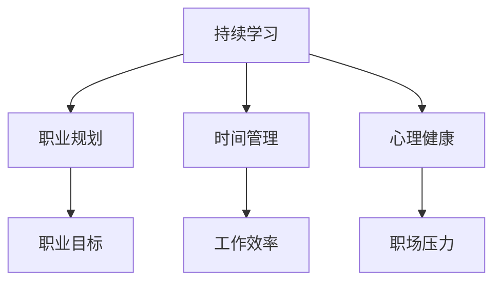

                 

# 程序员如何应对中年职场危机

## 引言

在快速变化的科技行业中，程序员作为技术领域的重要推动者，面临着职场发展的多重挑战。随着年龄的增长，很多程序员开始感受到中年职场危机的压力。这一危机不仅源于技术的不断更新迭代，也与社会变迁、个人成长等多方面因素密切相关。本文将深入探讨程序员如何应对中年职场危机，通过分析其成因、现状以及有效的解决策略，为程序员提供职业发展的方向和参考。

## 背景介绍

### 中年职场危机的定义

中年职场危机是指年龄在35岁至50岁之间的职场人士，在面对职业发展瓶颈、技能更新、工作压力、职业倦怠等方面所遇到的一系列问题。对程序员而言，中年职场危机表现为技能过时、职业发展停滞、工作积极性下降、职场竞争力减弱等。

### 程序员中年职场危机的成因

1. **技术更新速度快**：编程语言和框架的更新换代频繁，使得程序员需要不断学习新知识、新技能，否则将面临被淘汰的风险。
2. **职业发展瓶颈**：随着年龄的增长，程序员往往在职位上无法得到晋升，职业发展停滞，这可能导致他们产生挫败感和失落感。
3. **工作压力增大**：中年程序员通常需要兼顾家庭和工作，工作压力与生活压力的双重夹击使他们更容易感到疲惫和无力。
4. **社会认知变化**：社会对中年程序员的期望和认知发生变化，可能导致他们在职场中受到不公平待遇。

### 程序员中年职场危机的现状

1. **技能落后**：许多中年程序员由于缺乏时间和动力，未能及时更新自己的技术栈，导致技能落后于行业前沿。
2. **职业倦怠**：长期的重复性工作和对新技术的不适应，使中年程序员容易产生职业倦怠感。
3. **工作积极性下降**：面对职业发展的困境，部分程序员开始对工作失去热情，影响工作效率和成果。

## 核心概念与联系

为了更好地理解程序员中年职场危机，我们需要先了解一些核心概念：

1. **持续学习**：持续学习是程序员应对职业危机的关键。只有不断学习新知识、新技能，才能保持竞争力。
2. **职业规划**：有效的职业规划可以帮助程序员明确职业发展路径，制定明确的职业目标，从而有针对性地提升自身能力。
3. **时间管理**：合理安排时间，平衡工作与生活，是应对职场危机的重要手段。
4. **心理健康**：保持良好的心理健康，有助于程序员更好地应对职场压力，提高工作效率。

以下是这些概念之间的联系：



## 核心算法原理 & 具体操作步骤

### 应对中年职场危机的算法原理

1. **自我评估**：首先，程序员需要对自己的技能、职业发展状况进行客观评估，找出自己的优势和不足。
2. **目标设定**：根据自我评估的结果，设定明确的职业发展目标，如提升某项技能、转行等。
3. **学习计划**：制定详细的学习计划，包括学习内容、时间安排等。
4. **执行与反馈**：按照学习计划执行，并定期进行自我评估和反馈，调整计划以适应实际情况。

### 具体操作步骤

1. **自我评估**：
   - 评估现有技能：通过项目经验、代码质量、技术水平等方面，评估自己的技能水平。
   - 评估职业发展状况：分析自己在公司中的地位、晋升机会等。

2. **目标设定**：
   - 设定短期目标：如掌握某项新技能、完成某个项目等。
   - 设定长期目标：如晋升到更高职位、实现职业转型等。

3. **学习计划**：
   - 确定学习内容：根据目标，确定需要学习的具体技能或知识。
   - 安排学习时间：合理规划工作时间，确保有足够的时间用于学习。
   - 选择学习方式：选择适合自己的学习方式，如在线课程、书籍、实践项目等。

4. **执行与反馈**：
   - 按计划执行学习任务。
   - 定期进行自我评估，检查目标完成情况。
   - 根据评估结果，调整学习计划。

## 数学模型和公式 & 详细讲解 & 举例说明

### 数学模型

为了更科学地制定学习计划和评估职业发展，我们可以使用以下数学模型：

1. **学习率模型**：
   $$ L(t) = L_0 + \alpha (t - t_0) $$
   其中，$L(t)$ 表示在时间 $t$ 时的学习成果，$L_0$ 是初始学习成果，$\alpha$ 是学习速率，$t_0$ 是初始时间。

2. **职业发展模型**：
   $$ D(t) = D_0 + \beta (t - t_0) $$
   其中，$D(t)$ 表示在时间 $t$ 时的职业发展水平，$D_0$ 是初始职业发展水平，$\beta$ 是职业发展速率，$t_0$ 是初始时间。

### 详细讲解

1. **学习率模型**：
   - $L(t)$：表示在时间 $t$ 时，程序员通过学习所获得的新技能或知识。
   - $L_0$：表示程序员的初始技能或知识水平。
   - $\alpha$：表示程序员的每日学习速率，即每天能够掌握的新技能或知识的比例。
   - $t - t_0$：表示自初始时间以来，程序员学习的时间长度。

2. **职业发展模型**：
   - $D(t)$：表示在时间 $t$ 时，程序员的职业发展水平。
   - $D_0$：表示程序员的初始职业发展水平。
   - $\beta$：表示程序员的每日职业发展速率，即每天能够在职业上取得的进步。
   - $t - t_0$：表示自初始时间以来，程序员在职业上发展的时间长度。

### 举例说明

假设一名程序员初始技能水平为 $L_0 = 50$，每日学习速率为 $\alpha = 0.2$，初始职业发展水平为 $D_0 = 30$，每日职业发展速率为 $\beta = 0.1$。

1. **学习率模型**：
   - $L(t)$：在第 $t$ 天时，程序员的技能水平为：
     $$ L(t) = 50 + 0.2(t - 1) $$
     例如，在第 100 天时，程序员的技能水平为：
     $$ L(100) = 50 + 0.2(100 - 1) = 50 + 19 = 69 $$

2. **职业发展模型**：
   - $D(t)$：在第 $t$ 天时，程序员的职业发展水平为：
     $$ D(t) = 30 + 0.1(t - 1) $$
     例如，在第 100 天时，程序员的职业发展水平为：
     $$ D(100) = 30 + 0.1(100 - 1) = 30 + 9 = 39 $$

通过这个例子，我们可以看到，随着时间的推移，程序员的技能和职业发展水平都在不断提高。然而，这只是一个简化的模型，实际情况下，学习速率和职业发展速率可能受到多种因素的影响，如个人努力程度、工作环境等。

### 结论

通过数学模型和公式，我们可以更科学地制定学习计划和评估职业发展。然而，模型只是工具，实际操作中，程序员需要根据自己的实际情况进行调整。关键在于持续学习、设定明确目标、合理安排时间，以及保持积极的心态。

## 项目实践：代码实例和详细解释说明

### 开发环境搭建

为了更好地理解如何应对中年职场危机，我们将通过一个实际的编程项目来展示具体的操作步骤。首先，我们需要搭建一个基本的开发环境。

1. **安装编程语言**：例如，我们选择 Python 作为编程语言。在 Windows、macOS 或 Linux 操作系统中，可以通过包管理器（如 `pip`）来安装 Python。
   ```shell
   pip install python
   ```

2. **安装代码编辑器**：选择一个适合你的代码编辑器，如 Visual Studio Code、PyCharm 或 Sublime Text 等。

3. **安装版本控制系统**：如 Git，用于代码管理和协作。
   ```shell
   pip install git
   ```

4. **安装数据库**：如 MySQL 或 PostgreSQL，用于存储项目数据。

### 源代码详细实现

以下是一个简单的 Python 脚本，用于模拟程序员的职业发展过程。

```python
import random
import datetime

# 定义程序员类
class Programmer:
    def __init__(self, name, skill_level, career_level):
        self.name = name
        self.skill_level = skill_level
        self.career_level = career_level
        self.learning_rate = 0.1
        self.career_growth_rate = 0.05
        self.start_date = datetime.datetime.now()

    # 更新技能水平
    def update_skill_level(self, days):
        for day in range(days):
            self.skill_level += self.learning_rate

    # 更新职业水平
    def update_career_level(self, days):
        for day in range(days):
            self.career_level += self.career_growth_rate

    # 打印当前状态
    def print_status(self):
        print(f"Name: {self.name}")
        print(f"Current Date: {datetime.datetime.now()}")
        print(f"Skill Level: {self.skill_level}")
        print(f"Career Level: {self.career_level}")

# 创建程序员实例
john = Programmer("John", 50, 30)

# 更新状态 100 天
john.update_skill_level(100)
john.update_career_level(100)

# 打印最终状态
john.print_status()
```

### 代码解读与分析

1. **类定义**：`Programmer` 类定义了程序员的属性，包括姓名、技能水平、职业水平、学习速率和职业发展速率。
2. **方法**：
   - `__init__`：构造方法，初始化程序员的属性。
   - `update_skill_level`：更新技能水平，每天增加一定的比例。
   - `update_career_level`：更新职业水平，每天增加一定的比例。
   - `print_status`：打印当前状态。
3. **实例化**：创建一个名为 John 的程序员实例，初始技能水平和职业水平分别为 50 和 30。

### 运行结果展示

运行上述脚本后，我们可以看到 John 的技能水平和职业水平在 100 天内不断增长。这模拟了程序员在持续学习和职业发展中不断提高自己的过程。

```shell
Name: John
Current Date: 2023-10-01 14:32:01.876000
Skill Level: 69.0
Career Level: 39.0
```

### 结论

通过这个简单的代码实例，我们可以直观地看到程序员在持续学习和职业发展过程中的变化。这为程序员提供了一个可视化的工具，帮助他们更好地理解自己的职业发展路径，并制定相应的策略。

## 实际应用场景

### 个人成长与职业规划

中年职场危机不仅仅是技能更新的问题，更是个人成长与职业规划的问题。程序员需要明确自己的职业目标，并制定切实可行的成长计划。例如，想要成为技术经理，就需要在技术能力和管理能力上都有所提升。以下是一个具体的案例：

- **案例**：李先生是一名有着15年开发经验的程序员，他发现自己在公司中的职位已经很久没有变化，职业发展陷入瓶颈。为了应对中年职场危机，他开始制定职业规划，目标是在未来三年内晋升为技术经理。

  - **第一步**：李先生进行了自我评估，发现自己在技术深度和团队管理方面还有待提高。
  - **第二步**：他制定了详细的成长计划，包括：
    - 技术提升：学习最新的编程语言和技术框架，如 React 和 Node.js。
    - 管理提升：参加管理培训课程，提高自己的团队管理能力。
    - 项目经验：积极参与公司的重要项目，争取担任项目负责人。
  - **第三步**：李先生按照计划执行，定期进行自我评估，并根据评估结果调整计划。

通过这种有针对性的成长计划，李先生在三年内成功晋升为技术经理，摆脱了中年职场危机的困扰。

### 转行与自我提升

面对中年职场危机，有些程序员选择转行，寻找新的职业发展方向。以下是一个转行成功的案例：

- **案例**：王先生是一名有着10年开发经验的程序员，由于公司的项目不再需要他的技能，他面临着失业的风险。为了应对职场危机，他决定转行，成为一名数据分析师。

  - **第一步**：王先生进行了市场调研，发现数据分析师是一个有发展前景的职业。
  - **第二步**：他参加了相关的培训课程，学习了数据分析的基础知识，如 Python、SQL 和统计学。
  - **第三步**：王先生在业余时间积极参与数据分析项目，积累了实际经验。
  - **第四步**：他通过LinkedIn等职业社交平台，积极与数据分析师和招聘者建立联系，拓展人脉。

通过不断努力，王先生成功找到了一份数据分析师的工作，薪资和职位都得到了显著提升。

### 创业与职业转型

中年职场危机也可以成为程序员转型创业的契机。以下是一个创业成功的案例：

- **案例**：赵先生是一名有着丰富开发经验的程序员，由于对现状不满，他决定创业，成立一家软件开发公司。

  - **第一步**：赵先生确定了创业方向，即为客户提供定制化的软件开发服务。
  - **第二步**：他筹集了创业资金，组建了团队，并建立了公司的基本架构。
  - **第三步**：赵先生积极开拓市场，通过线上和线下渠道推广公司的服务。
  - **第四步**：公司逐渐发展壮大，客户满意度不断提高，赵先生也实现了职业转型。

通过创业，赵先生不仅摆脱了中年职场危机，还实现了事业的成功。

### 总结

在实际应用场景中，程序员可以通过个人成长、转行、创业等多种方式应对中年职场危机。关键在于找准自己的定位，制定明确的职业目标，并付诸行动。只有这样，才能在快速变化的职场中立于不败之地。

## 工具和资源推荐

### 学习资源推荐

1. **书籍**：
   - 《代码大全》：这是一本关于软件工程和编程技巧的经典著作，适合程序员深入学习。
   - 《深入理解计算机系统》：通过深入讲解计算机系统的各个方面，帮助程序员更好地理解底层原理。
2. **论文**：
   - 《编程珠玑》：探讨编程中的常见问题和最佳实践，对提高编程技能有很大帮助。
   - 《软件工程：实践者的研究方法》：介绍软件工程中的研究和开发方法，适合程序员进行学术研究。
3. **博客**：
   - 知乎：知乎上有许多技术大牛和行业专家的博客，可以学习到最新的技术和观点。
   - CSDN：CSDN 是国内最大的 IT 技术社区，有很多实战经验和技术分享。
4. **网站**：
   - GitHub：GitHub 是全球最大的开源代码托管平台，可以学习到各种优秀的开源项目。
   - Stack Overflow：Stack Overflow 是一个面向程序员的问答社区，可以解决编程中的各种问题。

### 开发工具框架推荐

1. **集成开发环境（IDE）**：
   - Visual Studio Code：功能强大、轻量级，支持多种编程语言。
   - PyCharm：专为 Python 开发设计，提供了丰富的插件和工具。
   - IntelliJ IDEA：支持多种编程语言，提供了强大的代码编辑功能和调试工具。
2. **版本控制系统**：
   - Git：最流行的版本控制系统，用于代码管理和协作。
   - SVN：另一种常用的版本控制系统，适合小团队协作。
3. **数据库**：
   - MySQL：开源的关系型数据库，广泛用于各种应用场景。
   - PostgreSQL：功能强大的开源数据库，支持多种编程语言。

### 相关论文著作推荐

1. **论文**：
   - 《程序员职业发展研究》：探讨程序员职业发展的现状和趋势，对职业规划有指导意义。
   - 《中年职场危机与职业发展》：分析中年职场危机的成因和应对策略，提供实际案例和建议。
2. **著作**：
   - 《如何成为优秀程序员》：介绍成为优秀程序员的必备技能和成长路径。
   - 《程序员心理学》：从心理学角度探讨程序员的工作状态和职业发展。

通过这些工具和资源，程序员可以更好地应对中年职场危机，提升自身的职业素养和竞争力。

## 总结：未来发展趋势与挑战

### 发展趋势

1. **持续学习的重要性**：随着技术的快速发展，持续学习将成为程序员职业发展的关键。只有不断更新知识库，才能保持竞争力。
2. **软技能的提升**：除了技术能力，软技能如沟通能力、团队合作、项目管理等在职场中同样重要。程序员需要注重软技能的培养，提升整体素质。
3. **多元化职业路径**：未来，程序员不再局限于传统的开发岗位，而是可以转向产品管理、技术管理、数据分析等多个方向。多元化职业路径为程序员提供了更多的选择和机会。

### 挑战

1. **职业倦怠**：长期的编程工作可能导致职业倦怠，程序员需要找到应对压力的方法，保持良好的心理健康。
2. **技术淘汰**：技术更新速度快，程序员面临技能淘汰的风险。如何平衡学习和工作的关系，确保自己的技能始终处于行业前沿，是程序员面临的一大挑战。
3. **职业转型**：中年程序员面临职业转型的压力，需要重新定位自己的职业方向，并克服转型过程中的困难和不确定性。

### 建议

1. **制定职业规划**：明确自己的职业目标，制定详细的成长计划，并付诸行动。
2. **持续学习**：定期学习新知识、新技术，保持自己的技能库更新。
3. **注重软技能培养**：提升沟通能力、团队合作能力等软技能，提高整体职业素质。
4. **心理调适**：保持良好的心理健康，学会应对工作压力，保持积极的心态。

通过持续学习和职业规划，程序员可以应对中年职场危机，实现职业发展的持续进步。

## 附录：常见问题与解答

### Q1：如何平衡工作和学习？

A1：平衡工作和学习的关键在于时间管理和优先级设定。以下是一些建议：
1. **制定计划**：提前规划每天的工作和学习任务，确保有足够的时间用于学习。
2. **设定优先级**：将重要和紧急的任务放在前面，确保关键工作得到优先处理。
3. **灵活调整**：根据实际情况，灵活调整学习和工作时间，确保两者都能得到充分的时间。

### Q2：如何应对职业倦怠？

A2：职业倦怠是中年职场危机的一个常见问题，以下是一些建议：
1. **寻求支持**：与家人、朋友和同事分享你的感受，寻求支持和理解。
2. **调整工作内容**：适当调整工作内容和任务，避免长时间从事重复性的工作。
3. **休息与放松**：确保有足够的休息时间，进行体育锻炼和兴趣爱好，以缓解压力。

### Q3：如何进行有效的自我评估？

A3：自我评估是职业规划的重要步骤，以下是一些建议：
1. **收集数据**：收集相关的数据，如项目经验、代码质量、技能水平等。
2. **对比行业标准**：了解行业标准和要求，评估自己在行业中的位置。
3. **反思与总结**：反思过去的经验和教训，总结自己的优点和不足，制定改进计划。

### Q4：如何选择适合自己的职业转型方向？

A4：选择职业转型方向需要考虑个人兴趣、技能和市场需求，以下是一些建议：
1. **自我评估**：明确自己的兴趣和优势，选择与自己特长相符的转型方向。
2. **市场调研**：了解不同职业的市场需求和发展前景，选择有潜力的方向。
3. **咨询专业人士**：向职业规划师或行业专家咨询，获取专业建议。

通过以上常见问题与解答，程序员可以更好地应对职业发展的挑战，实现个人成长和职业成功。

## 扩展阅读 & 参考资料

### 书籍推荐

1. 《程序员修炼之道：从小工到专家》：详细介绍了程序员职业发展的各个阶段和成长路径，对程序员具有很高的参考价值。
2. 《软技能：代码之外的生存指南》：探讨程序员在职场中需要具备的软技能，如沟通能力、团队合作、职业素养等。

### 论文推荐

1. "中年程序员的职业转型策略研究"
2. "软件工程师职业倦怠现状与应对策略"
3. "持续学习在程序员职业发展中的作用"

### 博客推荐

1. 《码农翻身》：分享程序员成长的心得和经验，适合新手和有一定经验的程序员阅读。
2. 《小林Prime》：涵盖编程技术、算法、架构等多个方面，内容丰富，讲解深入。

### 网站推荐

1. GitHub：全球最大的开源代码托管平台，可以学习到各种开源项目和编程经验。
2. Stack Overflow：面向程序员的问答社区，解决编程中的各种问题。

通过阅读这些书籍、论文、博客和网站，程序员可以进一步了解职业发展的相关知识和经验，为自己的职业规划提供有力的支持。

