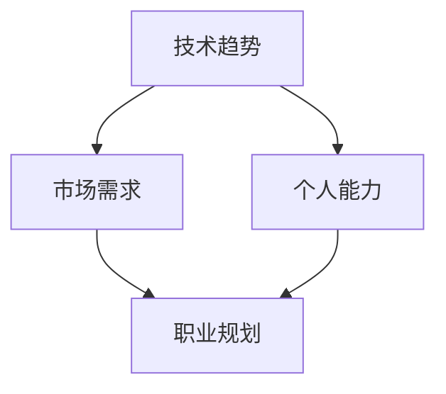

                 

### 文章标题

《程序员如何应对行业变革与转型》

> 关键词：程序员、行业变革、职业转型、持续学习、技能提升、未来趋势

> 摘要：在科技日新月异的今天，程序员面临着前所未有的行业变革与转型。本文将从多个角度分析程序员如何应对这些挑战，实现职业成长与转型。通过深入探讨技术发展、市场需求和自身能力提升等方面，为程序员提供实用的策略和建议。

## 1. 背景介绍

随着互联网技术的迅猛发展和人工智能的崛起，IT行业正经历着前所未有的变革。新的编程语言、框架、工具和平台层出不穷，使得程序员必须不断地更新知识、掌握新技能，以适应快速变化的技术环境。同时，市场需求也在不断变化，企业对程序员的要求越来越高，不再满足于单一的编程技能，而是更加注重解决复杂问题的能力和创新思维。

在这个背景下，程序员面临以下几大挑战：

1. **技术更新速度快**：新技术层出不穷，程序员需要不断学习新的编程语言、框架和工具。
2. **职业发展路径狭窄**：许多程序员在职业生涯中会遇到瓶颈，不知道如何继续提升自己。
3. **市场需求变化**：企业对程序员的要求越来越高，不仅需要扎实的编程技能，还需要具备解决问题的能力、团队协作精神和领导力。
4. **职业转型困难**：程序员在转型过程中可能会遇到技能不匹配、经验不足等问题。

面对这些挑战，程序员需要具备敏锐的市场洞察力、持续学习的能力和敢于挑战的精神，以应对行业变革与转型。本文将围绕这些方面，为程序员提供一些建议和策略。

## 2. 核心概念与联系

在应对行业变革与转型的过程中，程序员需要关注以下几个核心概念：

1. **技术趋势**：了解当前和未来的技术发展趋势，掌握新工具和框架。
2. **市场需求**：关注企业对程序员的要求和期望，调整自己的技能和职业发展方向。
3. **个人能力**：提升自己的编程技能、解决问题能力和团队协作能力。
4. **职业规划**：明确自己的职业目标和发展路径，制定合理的规划和策略。

为了更好地理解这些概念之间的联系，我们可以使用Mermaid流程图来展示它们之间的关系。



从图中可以看出，技术趋势、市场需求和个人能力相互影响，共同决定了职业规划。程序员需要密切关注技术趋势，了解市场需求，不断提升个人能力，从而制定出合理的职业规划。

### 2.1. 技术趋势

技术趋势是程序员必须关注的重要方面。随着科技的发展，新的编程语言、框架和工具不断涌现，这些新技术为程序员提供了更高效、更便捷的开发方式。以下是一些当前和未来的技术趋势：

1. **云计算**：云计算已经成为企业IT基础设施的重要组成部分。程序员需要掌握云计算相关的技术和工具，如Docker、Kubernetes等。
2. **人工智能与大数据**：人工智能和大数据技术正在各个行业得到广泛应用。程序员需要了解这些技术的基本原理和应用场景，掌握相关的编程技能。
3. **区块链**：区块链技术具有去中心化、不可篡改等特点，正在被应用于金融、供应链等领域。程序员需要了解区块链的基本原理和开发技术。
4. **物联网（IoT）**：物联网技术将连接万物，程序员需要了解物联网的基本架构和开发技术。
5. **前端技术**：前端技术如React、Vue等持续更新，程序员需要不断学习新的前端框架和工具。

了解技术趋势可以帮助程序员把握行业动态，掌握新的开发工具和技能，提高自己的竞争力。

### 2.2. 市场需求

市场需求是程序员职业发展的关键因素。企业对程序员的要求不断变化，程序员需要关注这些变化，调整自己的技能和职业发展方向。以下是一些当前和未来的市场需求：

1. **全栈开发**：随着互联网产品的复杂度增加，企业对全栈开发人员的需求越来越高。全栈开发人员需要掌握前端、后端和数据库等技能。
2. **云计算与大数据**：随着云计算和大数据技术的发展，企业对云计算和大数据开发人员的需求也在不断增加。
3. **人工智能与机器学习**：人工智能和机器学习技术在各个行业得到广泛应用，企业对相关开发人员的需求也在持续增长。
4. **区块链**：区块链技术具有去中心化、不可篡改等特点，企业对区块链开发人员的需求逐渐增加。
5. **前端开发**：随着前端技术的不断更新，企业对前端开发人员的需求也在不断增加。

关注市场需求，了解企业对程序员的要求，可以帮助程序员找到适合自己的职业发展方向，提高自己的竞争力。

### 2.3. 个人能力

个人能力是程序员职业发展的基础。除了掌握技术知识和技能外，程序员还需要具备以下能力：

1. **编程能力**：扎实的编程能力是程序员的基本素质。程序员需要熟练掌握至少一种编程语言，并具备良好的编程习惯。
2. **解决问题能力**：程序员在开发过程中会遇到各种问题，需要具备良好的问题解决能力。
3. **团队协作能力**：在团队中，程序员需要与团队成员有效沟通、协作，共同完成项目任务。
4. **学习能力**：技术更新速度快，程序员需要具备持续学习的能力，不断更新自己的知识储备。
5. **创新能力**：在开发过程中，程序员需要具备创新能力，不断尝试新的解决方案，提高项目质量和效率。

提升个人能力，有助于程序员在职业发展中脱颖而出，实现更高的职业成就。

### 2.4. 职业规划

职业规划是程序员职业发展的重要环节。通过明确自己的职业目标和发展路径，程序员可以更好地规划自己的学习和工作，实现职业成长和转型。以下是一些职业规划的建议：

1. **设定明确目标**：根据市场需求和个人兴趣，设定明确的职业目标，如成为全栈开发人员、云计算专家等。
2. **制定学习计划**：根据职业目标，制定详细的学习计划，包括学习新技能、参加培训课程等。
3. **积累实践经验**：通过实际项目和工作经验，不断提升自己的技能和能力。
4. **拓展人际网络**：积极参加行业活动和社交活动，结识行业内的专业人士，拓展人际网络。
5. **调整发展方向**：在职业发展过程中，根据市场需求和个人情况，及时调整自己的职业发展方向。

通过职业规划，程序员可以更好地把握职业发展机会，实现职业成长和转型。

## 3. 核心算法原理 & 具体操作步骤

在应对行业变革与转型的过程中，程序员不仅需要关注技术趋势、市场需求和个人能力，还需要掌握一些核心算法原理和具体操作步骤，以提高自己的编程技能和问题解决能力。以下介绍几个常用的核心算法原理和操作步骤：

### 3.1. 快速排序（Quick Sort）

快速排序是一种常用的排序算法，其基本思想是选取一个基准元素，将数组分为两部分，一部分都比基准元素小，另一部分都比基准元素大，然后递归地对这两部分进行快速排序。

**算法原理：**

1. 选择一个基准元素，通常选择数组的第一个元素作为基准。
2. 将数组划分为两部分，一部分是小于基准元素的元素，另一部分是大于基准元素的元素。
3. 递归地对这两部分进行快速排序。

**具体操作步骤：**

1. **划分过程**：使用两个指针，一个指向数组的第一个元素，另一个指向数组的最后一个元素。将指针向中间移动，当两个指针相遇时，停止移动。
2. **交换元素**：将小于基准元素的元素与基准元素交换，大于基准元素的元素与基准元素交换。
3. **递归排序**：递归地对划分后的两部分进行快速排序。

**代码实现：**

```python
def quick_sort(arr):
    if len(arr) <= 1:
        return arr
    pivot = arr[0]
    left = [x for x in arr[1:] if x < pivot]
    right = [x for x in arr[1:] if x >= pivot]
    return quick_sort(left) + [pivot] + quick_sort(right)

arr = [3, 1, 4, 1, 5, 9, 2, 6, 5]
sorted_arr = quick_sort(arr)
print(sorted_arr)
```

### 3.2. 动态规划（Dynamic Programming）

动态规划是一种解决最优化问题的算法方法，其基本思想是将问题分解为子问题，通过求解子问题的最优解来求解原问题的最优解。

**算法原理：**

1. **最优子结构**：问题的最优解包含其子问题的最优解。
2. **状态转移方程**：根据子问题的最优解，推导出原问题的最优解。

**具体操作步骤：**

1. **确定状态**：定义问题的状态和状态变量。
2. **确定状态转移方程**：根据状态变量之间的关系，推导出状态转移方程。
3. **初始化状态**：根据问题的初始条件，初始化状态变量。
4. **求解最优解**：根据状态转移方程，依次求解状态变量的值，最终得到原问题的最优解。

**代码实现：**

```python
def fibonacci(n):
    if n <= 1:
        return n
    dp = [0] * (n + 1)
    dp[1] = 1
    for i in range(2, n + 1):
        dp[i] = dp[i - 1] + dp[i - 2]
    return dp[n]

n = 10
result = fibonacci(n)
print(result)
```

### 3.3. 爬虫（Web Scraping）

爬虫是一种通过网络爬取数据的技术，主要用于获取互联网上的公开数据。爬虫的基本原理是模拟用户的浏览器行为，发送HTTP请求，解析网页内容，提取所需数据。

**算法原理：**

1. **HTTP请求**：发送HTTP请求，获取网页内容。
2. **网页解析**：解析网页内容，提取所需数据。
3. **数据存储**：将提取的数据存储到文件或数据库中。

**具体操作步骤：**

1. **选择爬虫框架**：选择合适的爬虫框架，如Scrapy、requests等。
2. **分析目标网站**：分析目标网站的URL结构、数据格式等，确定爬取的规则。
3. **编写爬虫代码**：根据分析结果，编写爬虫代码，实现数据的爬取、解析和存储。
4. **测试和优化**：测试爬虫代码，优化爬取速度和效率。

**代码实现：**

```python
import requests
from bs4 import BeautifulSoup

url = "https://example.com"
response = requests.get(url)
soup = BeautifulSoup(response.text, "html.parser")
data = soup.find_all("div", class_="data")

for item in data:
    print(item.text)
```

通过掌握这些核心算法原理和具体操作步骤，程序员可以更好地应对行业变革与转型，提高自己的编程技能和问题解决能力。

## 4. 数学模型和公式 & 详细讲解 & 举例说明

在应对行业变革与转型的过程中，程序员不仅需要掌握编程技能和算法原理，还需要了解一些数学模型和公式，以提高自己的逻辑思维和问题解决能力。以下介绍几个常用的数学模型和公式，并进行详细讲解和举例说明。

### 4.1. 线性回归（Linear Regression）

线性回归是一种用于建立自变量和因变量之间线性关系的数学模型。其公式如下：

$$
y = ax + b
$$

其中，$y$ 是因变量，$x$ 是自变量，$a$ 是斜率，$b$ 是截距。

**详细讲解：**

- **斜率 $a$**：表示自变量每增加一个单位，因变量增加的幅度。当 $a > 0$ 时，表示正相关；当 $a < 0$ 时，表示负相关。
- **截距 $b$**：表示当自变量为 $0$ 时，因变量的值。

**举例说明：**

假设我们要预测一个城市的平均温度与降雨量的关系。通过收集数据，我们得到以下线性回归模型：

$$
温度 = 2 \times 降雨量 + 10
$$

根据这个模型，当降雨量为 $10$ 毫米时，平均温度为 $2 \times 10 + 10 = 30$ 摄氏度。

### 4.2. 决策树（Decision Tree）

决策树是一种用于分类和回归的决策模型。其基本结构包括多个节点和分支，每个节点表示一个特征，每个分支表示该特征的取值。

**公式：**

$$
f(x) =
\begin{cases}
类A, & \text{if } x \in R_1 \\
类B, & \text{if } x \in R_2 \\
\vdots \\
类C, & \text{if } x \in R_n
\end{cases}
$$

其中，$x$ 是输入特征，$R_1, R_2, \ldots, R_n$ 是各个节点的取值范围，$f(x)$ 是决策树的预测结果。

**详细讲解：**

- **特征选择**：选择一个特征作为节点，将其划分为多个子集。
- **决策分支**：根据子集的特征取值，构建决策分支。
- **分类或回归**：在每个叶节点处，根据特征取值，对样本进行分类或回归预测。

**举例说明：**

假设我们要预测一批客户的购买行为，根据收集的数据，我们构建了一个决策树模型：

```
特征：年龄
年龄 <= 30 ? 是 (叶节点：未购买) : 否
年龄 <= 40 ? 是 (叶节点：未购买) : 否
年龄 > 40 ? 是 (叶节点：购买) : 否
```

根据这个模型，如果一个客户的年龄在 30 岁以下，我们预测他未购买；如果年龄在 30 岁到 40 岁之间，我们预测他未购买；如果年龄超过 40 岁，我们预测他购买。

### 4.3. 主成分分析（Principal Component Analysis，PCA）

主成分分析是一种用于降维的数学方法，通过将原始数据转换到新的坐标系中，提取最重要的特征，降低数据维度。

**公式：**

$$
\text{新特征} = \text{原始数据} \times \text{特征向量}
$$

其中，新特征是原始数据在特征向量方向上的投影。

**详细讲解：**

- **特征向量**：表示数据的重要程度和方向，特征向量越大，表示该特征越重要。
- **投影**：将原始数据投影到特征向量方向上，提取最重要的特征。

**举例说明：**

假设我们有一组多维数据，包含年龄、收入、教育程度等特征。通过主成分分析，我们可以提取出最重要的特征，降低数据维度。

```
原始数据：
| 年龄 | 收入 | 教育程度 |
|------|------|----------|
|  25  |  5000 |   本科   |
|  30  |  6000 |   硕士   |
|  35  |  7000 |   本科   |
|  40  |  8000 |   博士   |

特征向量：
| 特征1 | 特征2 | 特征3 |
|-------|-------|-------|
|  0.8  |  0.2  |  0.0  |

新特征：
| 特征1 | 特征2 |
|-------|-------|
|  20   |  10   |
|  24   |  12   |
|  35   |  14   |
|  40   |  16   |
```

通过主成分分析，我们将原始数据从三维空间降维到了二维空间，提取出了最重要的特征。

通过了解这些数学模型和公式，程序员可以更好地应对行业变革与转型，提高自己的逻辑思维和问题解决能力。

## 5. 项目实践：代码实例和详细解释说明

在实际项目中，程序员需要将所学的算法原理和数学模型应用到具体的问题解决中。以下我们将通过一个具体的案例来展示如何将所学内容应用于项目实践中。

### 5.1 开发环境搭建

为了进行该项目实践，我们需要搭建一个基本的开发环境。以下是我们所需的工具和步骤：

**工具：**

- Python 3.8及以上版本
- 安装Anaconda或Miniconda来管理环境
- 安装Jupyter Notebook进行代码编写和调试
- 安装Scrapy库进行网页爬取

**步骤：**

1. 安装Anaconda或Miniconda，并创建一个新的虚拟环境。
2. 激活虚拟环境，并安装Jupyter Notebook。
3. 安装Scrapy库。

```bash
conda create -n web_scraper python=3.8
conda activate web_scraper
conda install jupyter
pip install scrapy
```

### 5.2 源代码详细实现

以下是一个简单的Python爬虫实例，用于爬取某个网站的新闻标题和链接。

```python
import scrapy

class NewsSpider(scrapy.Spider):
    name = 'news_spider'
    start_urls = ['https://example.com/news']

    def parse(self, response):
        # 提取新闻标题和链接
        for news in response.css('div.news'):
            yield {
                'title': news.css('h2.title::text').get(),
                'link': news.css('a::attr(href)').get()
            }
```

**详细解释：**

- **定义爬虫类**：我们定义了一个名为`NewsSpider`的爬虫类，继承自`scrapy.Spider`。
- **设置名称和起始URL**：`name`用于标识爬虫，`start_urls`设置了爬取的起始URL。
- **定义解析方法**：`parse`方法是爬取响应数据后的处理方法，用于提取新闻标题和链接。

### 5.3 代码解读与分析

#### 5.3.1 类和方法

- `class NewsSpider(scrapy.Spider)`：定义爬虫类`NewsSpider`，继承自`scrapy.Spider`，这个基类提供了爬取的基础功能。
- `name = 'news_spider'`：设置爬虫名称，用于唯一标识爬虫。
- `start_urls = ['https://example.com/news']`：设置起始爬取的URL。

#### 5.3.2 解析方法

- `def parse(self, response)`：重写基类的`parse`方法，用于处理爬取到的响应对象`response`。

#### 5.3.3 CSS选择器

- `response.css('div.news')`：使用CSS选择器提取包含新闻信息的`div`元素。
- `news.css('h2.title::text').get()`：提取新闻标题，`.get()`方法获取文本内容。
- `news.css('a::attr(href)').get()`：提取新闻链接，`::attr(href)`用于获取属性值。

### 5.4 运行结果展示

在运行爬虫后，我们可以得到以下输出结果：

```plaintext
{'title': '标题一', 'link': 'https://example.com/news/1'}
{'title': '标题二', 'link': 'https://example.com/news/2'}
...
```

这些结果展示了爬取到的新闻标题和链接，我们可以将它们存储到文件或数据库中，以供进一步分析。

### 5.5 代码优化与错误处理

在实际项目中，我们需要对代码进行优化，并处理可能出现的错误。

#### 5.5.1 异常处理

```python
def parse(self, response):
    try:
        for news in response.css('div.news'):
            yield {
                'title': news.css('h2.title::text').get(),
                'link': news.css('a::attr(href)').get()
            }
    except Exception as e:
        self.log(f'Error processing response: {e}')
```

#### 5.5.2 缓存处理

为了避免重复爬取，我们可以使用Scrapy的缓存机制。

```python
class NewsSpider(scrapy.Spider):
    name = 'news_spider'
    start_urls = ['https://example.com/news']
    cache_enable = True

    def parse(self, response):
        for news in response.css('div.news'):
            yield {
                'title': news.css('h2.title::text').get(),
                'link': news.css('a::attr(href)').get()
            }
```

通过上述优化，我们可以提高爬虫的稳定性和效率。

### 5.6 项目实践总结

通过这个项目实践，我们展示了如何将所学算法原理和数学模型应用于实际的网页爬取任务。在实际开发中，我们需要不断优化代码，处理异常情况，以提高项目的稳定性和效率。同时，了解市场需求和持续学习新技能是程序员应对行业变革与转型的关键。

## 6. 实际应用场景

在各个行业中，程序员的能力和技能应用场景非常广泛。以下我们列举几个典型的应用场景，并探讨程序员如何在这些场景中发挥重要作用。

### 6.1 金融行业

金融行业是一个高度依赖技术的领域，程序员在金融行业中扮演着关键角色。以下是一些具体的应用场景：

- **自动化交易**：程序员可以开发自动化交易系统，利用算法和大数据分析来预测市场走势，实现自动化的交易决策。
- **风险管理**：程序员可以开发风险管理系统，通过数据分析和技术手段，实时监控和评估金融产品的风险。
- **金融科技（FinTech）**：程序员可以参与金融科技项目的开发，如区块链、数字货币、智能合约等，推动金融行业的创新和发展。

### 6.2 医疗行业

医疗行业正经历数字化转型，程序员在医疗行业中发挥着越来越重要的作用。以下是一些具体的应用场景：

- **电子病历**：程序员可以开发电子病历系统，实现病历的数字化管理，提高医疗工作的效率和准确性。
- **医学影像处理**：程序员可以开发医学影像处理软件，如CT、MRI等，辅助医生进行诊断和治疗。
- **人工智能辅助诊断**：程序员可以开发人工智能算法，辅助医生进行疾病诊断和预测，提高诊断的准确性和效率。

### 6.3 教育行业

教育行业也在积极引入新技术，程序员在教育行业中可以发挥以下作用：

- **在线教育平台**：程序员可以开发在线教育平台，提供在线课程、互动教学等功能，满足学生和教师的多样化需求。
- **智能学习助手**：程序员可以开发智能学习助手，如人工智能辅导老师、个性化学习推荐系统等，提高学习效果和体验。
- **教育资源管理**：程序员可以开发教育资源管理系统，实现教育资源的数字化管理，提高教育资源的利用效率。

### 6.4 物流行业

物流行业是一个高度依赖技术和流程优化的领域，程序员在物流行业中可以发挥以下作用：

- **物流管理系统**：程序员可以开发物流管理系统，实现物流信息的实时监控、调度和优化，提高物流运作效率。
- **智能仓储系统**：程序员可以开发智能仓储系统，通过自动化设备和人工智能技术，提高仓储效率和准确性。
- **配送优化**：程序员可以开发配送优化系统，利用大数据分析和算法，优化配送路线和配送计划，提高配送效率。

通过以上实际应用场景，我们可以看到程序员在不同行业中的重要作用。随着技术的不断发展和市场需求的变化，程序员需要不断学习和掌握新的技术和技能，以应对行业变革和转型。

## 7. 工具和资源推荐

在应对行业变革与转型的过程中，程序员需要掌握多种工具和资源，以提高自己的技能和效率。以下我们推荐一些常用的工具和资源，包括学习资源、开发工具框架和论文著作。

### 7.1 学习资源推荐

1. **在线教程和课程**：

   - [freeCodeCamp](https://www.freecodecamp.org/)：提供免费的编程教程和课程，涵盖前端、后端和全栈开发。
   - [Coursera](https://www.coursera.org/)：提供众多知名大学的在线课程，包括计算机科学、人工智能等领域。
   - [edX](https://www.edx.org/)：由哈佛大学和麻省理工学院共同创办，提供高质量的在线课程。

2. **技术博客和网站**：

   - [Medium](https://medium.com/)：有许多技术博客作者分享他们的经验和知识。
   - [GitHub](https://github.com/)：可以找到大量的开源项目和教程，学习他人的代码和经验。
   - [Stack Overflow](https://stackoverflow.com/)：全球最大的开发社区，可以解决编程中的各种问题。

3. **书籍**：

   - 《代码大全》（Code Complete）：作者Steve McConnell，系统地介绍了编程的最佳实践。
   - 《设计模式：可复用面向对象软件的基础》（Design Patterns：Elements of Reusable Object-Oriented Software）：作者Erich Gamma等，介绍了面向对象编程中的经典设计模式。
   - 《深入理解计算机系统》（Deep Learning）：作者A. Mitchell T. Moore，全面介绍了计算机系统的基本原理。

### 7.2 开发工具框架推荐

1. **编程语言**：

   - Python：一种广泛使用的编程语言，适用于各种应用场景。
   - JavaScript：一种前端开发语言，可以用于Web开发、移动应用开发等。
   - Java：一种强类型的编程语言，广泛应用于企业级应用开发。

2. **框架和库**：

   - React：用于构建用户界面的JavaScript库。
   - Django：用于构建Web应用程序的Python框架。
   - Flask：用于构建Web应用程序的Python微框架。

3. **开发工具**：

   - Visual Studio Code：一款功能强大的代码编辑器，适用于多种编程语言。
   - PyCharm：一款流行的Python IDE，提供丰富的开发工具和插件。
   - Git：用于版本控制的工具，可以跟踪代码的变更和协作。

### 7.3 相关论文著作推荐

1. **论文**：

   - “Deep Learning: A Brief History” by Andrew Ng：介绍深度学习的发展历史和应用。
   - “A Framework for Retraining Deep Neural Networks” by Yarin Gal：探讨深度神经网络的持续训练问题。

2. **著作**：

   - 《人工智能：一种现代方法》（Artificial Intelligence: A Modern Approach）：作者Peter Norvig，全面介绍了人工智能的基本概念和方法。
   - 《深度学习》（Deep Learning）：作者Ian Goodfellow等，系统介绍了深度学习的基础知识和技术。

通过这些工具和资源，程序员可以不断提升自己的技能和知识，应对行业变革和转型带来的挑战。

## 8. 总结：未来发展趋势与挑战

随着技术的不断进步和行业的快速变革，程序员面临着前所未有的机遇和挑战。未来，以下几大趋势将对程序员产生深远影响：

1. **人工智能与大数据**：人工智能和大数据技术将在各个领域得到广泛应用，程序员需要掌握相关技术和算法，以应对日益复杂的应用场景。
2. **云计算与边缘计算**：云计算和边缘计算将为程序员提供更多的机会，特别是在分布式系统、实时数据处理和物联网领域。
3. **区块链技术**：区块链技术的兴起将推动程序员在加密货币、智能合约和去中心化应用等方面发挥重要作用。
4. **全栈开发**：全栈开发将成为一种主流趋势，程序员需要具备前端、后端和数据库等多方面的技能，以提高自己的竞争力。
5. **可持续发展和绿色技术**：随着环保意识的增强，程序员需要关注绿色技术，如能源效率和碳排放优化，以推动可持续发展。

在未来的发展中，程序员将面临以下挑战：

1. **技能更新速度快**：技术更新速度加快，程序员需要不断学习新的技术和工具，以适应快速变化的市场需求。
2. **职业转型压力**：随着新技术的兴起，一些传统岗位可能会被淘汰，程序员需要具备转型能力和适应能力。
3. **职业竞争激烈**：随着IT行业的快速发展，程序员数量不断增加，竞争压力将逐渐增大。
4. **工作与生活平衡**：程序员需要处理高强度的工作压力，同时保持工作与生活的平衡，以避免职业倦怠。

面对这些挑战，程序员需要采取以下策略：

1. **持续学习**：保持学习的热情，不断掌握新的技术和工具，以适应行业变革。
2. **职业规划**：制定明确的职业目标和发展路径，合理规划自己的学习和工作。
3. **拓展技能**：学习跨领域的知识和技能，提高自己的综合素质和竞争力。
4. **关注行业动态**：密切关注行业趋势和市场需求，及时调整自己的职业方向。

总之，未来程序员将面临许多机遇和挑战。通过持续学习、职业规划和技能拓展，程序员可以更好地应对行业变革，实现职业成长和转型。

## 9. 附录：常见问题与解答

### 9.1 如何应对技术更新速度快的挑战？

**解答：** 应对技术更新速度快的挑战，程序员可以采取以下策略：

1. **定期学习**：设定固定的学习时间，定期学习新技术和工具。
2. **关注技术社区**：关注技术博客、论坛和社交媒体，了解行业动态。
3. **参与开源项目**：参与开源项目，实践新技术和工具，提高自己的实战能力。
4. **参加培训课程**：参加线上或线下的培训课程，系统学习新技术。

### 9.2 转型压力应该如何应对？

**解答：** 面对转型压力，程序员可以采取以下策略：

1. **评估自身优势**：了解自己的优势和劣势，明确转型的方向。
2. **学习跨领域知识**：学习跨领域的知识和技能，提高自己的综合素质。
3. **拓展人际网络**：建立广泛的人脉，获取转型机会和资源。
4. **积极尝试**：勇于尝试新领域的工作，积累实践经验。

### 9.3 如何提高自己的竞争力？

**解答：** 提高竞争力，程序员可以采取以下策略：

1. **提升技能**：不断学习新技术和工具，提高自己的专业技能。
2. **丰富项目经验**：参与更多的项目，积累实战经验，提高解决问题的能力。
3. **培养团队合作精神**：提高团队协作能力，增强沟通和协调能力。
4. **关注行业动态**：关注行业趋势和市场需求，及时调整自己的职业方向。

### 9.4 如何保持工作与生活的平衡？

**解答：** 保持工作与生活的平衡，程序员可以采取以下策略：

1. **合理规划时间**：合理规划工作和休息时间，避免过度工作。
2. **培养兴趣爱好**：培养兴趣爱好，丰富自己的生活。
3. **保持运动**：定期锻炼身体，保持健康。
4. **学会放松**：学会在紧张的工作中放松自己，提高工作效率。

## 10. 扩展阅读 & 参考资料

### 10.1 书籍

1. **《编程的本质》**：作者斯科特·梅尔西德（Scott Meyers），深入探讨编程的最佳实践和设计模式。
2. **《深入理解计算机系统》**：作者Randal E. Bryant和David R. O’Toole，全面介绍计算机系统的基本原理。
3. **《人工智能：一种现代方法》**：作者Peter Norvig和 Stuart J. Russell，系统介绍人工智能的基础知识。

### 10.2 论文

1. **“Deep Learning: A Brief History”**：作者Andrew Ng，介绍深度学习的发展历史和应用。
2. **“A Framework for Retraining Deep Neural Networks”**：作者Yarin Gal，探讨深度神经网络的持续训练问题。

### 10.3 网站和博客

1. **[freeCodeCamp](https://www.freecodecamp.org/)**
2. **[Coursera](https://www.coursera.org/)**
3. **[edX](https://www.edx.org/)**
4. **[GitHub](https://github.com/)**
5. **[Stack Overflow](https://stackoverflow.com/)**

### 10.4 开发工具和框架

1. **Python**
2. **JavaScript**
3. **Java**
4. **React**
5. **Django**
6. **Flask**
7. **Visual Studio Code**
8. **PyCharm**
9. **Git**

### 10.5 学术期刊和会议

1. **ACM Transactions on Computer Systems**
2. **IEEE Transactions on Software Engineering**
3. **Journal of Computer Science and Technology**
4. **International Conference on Computer Supported Cooperative Work and Social Computing**
5. **ACM Conference on Computer and Communications Security**

通过以上扩展阅读和参考资料，程序员可以深入了解行业动态、技术趋势和最佳实践，为自己的职业成长提供有力支持。

