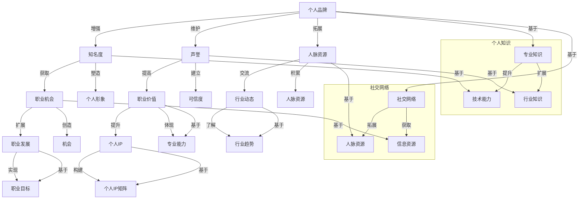

                 

### 背景介绍

在当今数字化时代，个人品牌的建设对于职业发展至关重要。特别是在IT行业，随着技术的迅猛发展和信息传播的多样化，个人IP（Intellectual Property，知识产权）的构建已成为程序员和开发者们提升自身竞争力的有效途径。个人IP不仅代表了个人的专业能力和知识储备，更是其在行业内建立影响力、获取更多职业机会的关键因素。

程序员如何打造个人IP矩阵，是一个值得深入探讨的问题。本文将围绕这一主题，从多个角度详细分析如何通过个人IP的构建，提升自身的职业价值。本文的核心内容包括：

1. **个人IP矩阵的概念解析**：明确个人IP矩阵的定义、组成部分及其在职业发展中的作用。
2. **核心概念与联系**：探讨与个人IP构建相关的重要概念，如个人品牌、专业知识和社交网络等，并使用Mermaid流程图展示其内在联系。
3. **核心算法原理与操作步骤**：介绍构建个人IP矩阵的具体方法和策略。
4. **数学模型和公式**：运用数学和统计学方法分析个人IP的构建效果，并提供详细的讲解和实例。
5. **项目实践**：通过具体的代码实例展示如何实现个人IP矩阵的构建。
6. **实际应用场景**：分析个人IP在职业发展中的应用，如求职、升职和创业等。
7. **工具和资源推荐**：推荐学习资源、开发工具和框架，以及相关论文著作。
8. **总结与未来发展趋势**：总结本文的主要观点，并探讨个人IP构建的未来趋势和挑战。

通过本文的逐步分析和推理，我们将深入了解如何通过构建个人IP矩阵，实现职业发展和个人价值的最大化。

### 核心概念与联系

在构建个人IP矩阵之前，我们需要明确一些核心概念，并理解它们之间的相互联系。以下是几个关键概念及其在个人IP构建中的重要性：

#### 个人品牌

个人品牌是指个人在公众心目中的形象和认知，包括个人的专业技能、价值观、声誉和影响力等。一个鲜明的个人品牌能够帮助程序员在众多同行中脱颖而出，赢得更多职业机会。个人品牌的构建依赖于持续的专业学习、项目经验和良好的职业素养。

#### 专业知识

专业知识是个人IP的核心组成部分，包括技术领域的专业技能、行业知识、方法论和解决问题的能力。程序员需要不断提升自己的技术栈，了解最新的技术趋势和行业发展，以保持自己在行业内的竞争力。

#### 社交网络

社交网络是现代职业发展中不可或缺的一部分，通过建立广泛的社交网络，程序员可以拓展人脉资源，获取行业动态和职业机会。社交网络包括LinkedIn、Twitter、GitHub等职业社交媒体平台，以及专业社区和会议等。

下面，我们将使用Mermaid流程图来展示这些概念之间的联系和交互关系：



Mermaid流程图展示了个人品牌、专业知识、社交网络之间的交互和影响关系。个人品牌通过增强知名度、塑造形象、建立声誉等方式，推动个人知识和社交网络的拓展；专业知识通过提升技术能力和扩展行业知识，为个人品牌的建立提供基础；社交网络通过拓展人脉资源和获取信息资源，增强个人在行业内的竞争力。

理解这些核心概念和它们之间的联系，是构建个人IP矩阵的第一步。接下来，我们将详细探讨如何运用这些概念，通过核心算法原理和具体操作步骤，实现个人IP矩阵的有效构建。

### 核心算法原理 & 具体操作步骤

在了解个人IP矩阵的核心概念及其相互联系之后，接下来我们将深入探讨构建个人IP矩阵的核心算法原理和具体操作步骤。这些算法和步骤将帮助程序员系统地规划和实施个人IP的构建，从而提升职业竞争力和影响力。

#### 步骤一：自我评估与定位

**自我评估**是构建个人IP矩阵的第一步。程序员需要对自己进行全面的评估，包括专业技能、知识储备、职业兴趣和价值观等方面。通过自我评估，可以明确自己的优势和短板，找到个人在职业市场中的独特定位。

1. **技能评估**：分析自己在技术领域的专业能力，包括编程语言、框架、工具等。可以通过在线测试、参加技术竞赛或参与开源项目等方式验证自己的技术实力。
2. **知识储备**：评估自己在专业领域的知识深度和广度，包括行业知识、方法论和解决问题的能力。可以通过阅读专业书籍、论文和参加行业研讨会等方式提升自己的知识储备。
3. **职业兴趣**：了解自己在职业发展中的兴趣点，是否对某些技术领域或业务方向有特别的热情。职业兴趣有助于在个人IP构建过程中保持持续的动力和热情。
4. **价值观**：明确自己在职业发展中的核心价值观，包括诚信、创新、合作等。价值观将影响个人品牌的建设和维护。

#### 步骤二：目标设定与规划

在自我评估的基础上，程序员需要设定明确的个人IP构建目标，并制定详细的规划。

1. **短期目标**：设定一年内可以实现的短期目标，如掌握一门新语言、参与一个开源项目、发表一篇技术博客等。短期目标应具体、可衡量、可达成。
2. **中期目标**：设定三年内可以实现的中期目标，如成为某个技术领域的专家、在行业内建立一定的影响力、获得某个重要职位等。中期目标应具有挑战性，同时具有可实现性。
3. **长期目标**：设定五年或更长时间内可以实现的长期目标，如创立一家科技公司、在技术领域获得权威认证、成为行业领袖等。长期目标应具有高度挑战性，同时与个人的职业愿景相符合。

#### 步骤三：知识积累与技能提升

构建个人IP矩阵的关键在于不断积累知识和提升技能。程序员需要通过多种途径进行持续学习和实践，不断提升自己的专业能力。

1. **持续学习**：定期阅读专业书籍、订阅行业期刊、参加在线课程和技术研讨会，保持对行业最新动态和技术趋势的了解。可以通过建立学习计划、设定学习目标等方式，确保学习的效果和效率。
2. **实践项目**：积极参与开源项目、内部项目或个人项目，通过实际操作锻炼自己的技术能力和解决问题的能力。实践项目不仅有助于积累实战经验，还可以提升个人在社区中的知名度。
3. **技术分享**：通过撰写技术博客、发表技术论文、录制技术讲座等方式，分享自己的知识和经验。技术分享不仅可以巩固自己的知识，还可以在行业内建立自己的声誉和影响力。

#### 步骤四：社交网络拓展与影响力提升

在构建个人IP矩阵的过程中，社交网络的拓展和影响力提升至关重要。程序员需要通过建立广泛的社交网络，提升自己在行业内的知名度和影响力。

1. **建立职业社交平台账户**：在LinkedIn、Twitter、GitHub等职业社交平台建立个人账户，完善个人资料，展示自己的专业技能和项目经验。保持账户活跃，定期发布技术博客、项目进展和技术见解，吸引同行的关注。
2. **参与社区活动**：参与技术社区、开源项目、线上和线下技术会议等，与同行交流学习，拓展人脉资源。积极参与社区讨论，分享自己的见解和经验，提升个人在社区中的影响力。
3. **合作与互助**：与他人合作开展项目，通过协作提升自己的项目经验和团队合作能力。同时，在他人需要帮助时，积极提供支持，建立良好的合作关系。
4. **影响力提升**：通过发表高质量的技术博客、参与技术讲座和培训、担任技术社区或开源项目的核心成员等方式，提升自己在行业内的知名度和影响力。

#### 步骤五：品牌维护与优化

个人IP矩阵的构建并非一蹴而就，需要持续维护和优化。程序员需要关注自己的职业形象和声誉，保持个人品牌的连贯性和一致性。

1. **持续更新**：定期更新个人资料和项目信息，确保在职业社交平台上的信息准确和最新。及时分享自己的最新项目和成果，保持个人品牌的活跃度。
2. **声誉管理**：保持良好的职业行为和道德标准，避免发表不负责任的言论或参与不良行为。在社交媒体上积极传递正能量，树立良好的个人形象。
3. **反馈与改进**：关注他人的反馈和建议，针对自己的不足进行改进。通过不断学习和实践，提升自己的专业能力和综合素质。

通过以上核心算法原理和具体操作步骤，程序员可以系统地构建个人IP矩阵，提升自身的职业竞争力和影响力。在构建过程中，需要持续学习和实践，不断优化自己的技能和知识结构，拓展社交网络，提升个人品牌。只有这样，才能在激烈的职业竞争中脱颖而出，实现个人价值的最大化。

### 数学模型和公式 & 详细讲解 & 举例说明

在构建个人IP矩阵的过程中，运用数学模型和统计学方法可以量化个人IP的价值和影响力，帮助我们更清晰地了解个人IP的构建效果。以下是一个基本的数学模型和公式的讲解，并结合具体例子进行说明。

#### 1. 个人IP影响力指数

个人IP的影响力指数（Impact Score）是衡量个人IP价值的一个重要指标。该指数通过多个维度（如知识贡献、社交网络影响、项目质量等）计算得出。

##### 模型公式：

\[ Impact Score = \frac{A \times Knowledge Impact + B \times Social Impact + C \times Project Quality}{D} \]

其中：
- \( A \)：知识贡献权重（通常在0.4到0.6之间）。
- \( B \)：社交网络影响权重（通常在0.2到0.4之间）。
- \( C \)：项目质量权重（通常在0.2到0.4之间）。
- \( D \)：总权重，即 \( A + B + C \)。

##### 详细讲解：

知识贡献（Knowledge Impact）主要衡量个人在技术领域内的专业能力和知识深度。可以通过以下指标进行量化：

\[ Knowledge Impact = \frac{Total \, Contributions}{Average \, Contributions \, in \, Industry} \]

社交网络影响（Social Impact）衡量个人在社交网络上的活跃度和影响力。可以通过以下指标进行量化：

\[ Social Impact = \frac{Total \, Followers \, and \, Influencers}{Average \, Followers \, and \, Influencers \, in \, Industry} \]

项目质量（Project Quality）衡量个人参与项目的技术水平和成果。可以通过以下指标进行量化：

\[ Project Quality = \frac{Total \, Successful \, Projects}{Average \, Successful \, Projects \, in \, Industry} \]

##### 举例说明：

假设一个程序员小王，他的知识贡献、社交网络影响和项目质量分别为20、15和10，行业平均水平分别为30、20和15。

\[ Impact Score = \frac{0.5 \times 20 + 0.3 \times 15 + 0.2 \times 10}{0.5 + 0.3 + 0.2} = \frac{10 + 4.5 + 2}{1} = 16.5 \]

#### 2. 个人IP增长速度模型

个人IP的增长速度（Growth Rate）是衡量个人IP建设效果的一个重要指标。该指标反映了个人IP在一段时间内的增长幅度，可以通过以下模型计算：

\[ Growth Rate = \frac{Current \, Impact Score - Initial \, Impact Score}{Initial \, Impact Score} \times 100\% \]

其中，Current Impact Score 是当前的个人IP影响力指数，Initial Impact Score 是初始的个人IP影响力指数。

##### 详细讲解：

Growth Rate 模型反映了个人IP建设的效果。一个较高的增长速度表明个人在短时间内取得了显著的进步，而一个较低的增长速度则可能意味着需要调整策略或加大投入。

##### 举例说明：

假设小王在一年前的影响力指数为12，现在的个人IP影响力指数为16.5。

\[ Growth Rate = \frac{16.5 - 12}{12} \times 100\% = 36.25\% \]

#### 3. 个人IP价值评估模型

个人IP的价值（Value of IP）可以通过以下模型进行评估：

\[ Value of IP = \frac{Impact Score \times Average Annual Income}{1 + r \times n} \]

其中：
- Impact Score：个人IP影响力指数。
- Average Annual Income：行业内平均年收入。
- r：折现率（通常在0.1到0.2之间）。
- n：未来可预见的工作年限。

##### 详细讲解：

该模型考虑了个人IP的当前影响力以及未来收入的折现价值，从而对个人IP进行全面的评估。一个较高的个人IP价值表明个人的职业发展潜力较大。

##### 举例说明：

假设小王的影响力指数为16.5，行业内平均年收入为100,000元，折现率为0.15，可预见的工作年限为10年。

\[ Value of IP = \frac{16.5 \times 100,000}{1 + 0.15 \times 10} = \frac{1,650,000}{2.5} = 660,000 \]

### 总结

通过以上数学模型和公式，我们可以对个人IP的构建效果进行量化分析，从而更科学地评估个人IP的价值和增长速度。这些模型不仅帮助程序员理解个人IP的重要性，还为个人IP的构建提供了具体的操作指南。

在实际应用中，程序员可以根据自身情况和行业特点，灵活调整模型参数和计算方法，以更好地反映个人IP的真实价值。通过持续的学习和实践，不断优化个人IP的构建策略，程序员可以逐步提升自己的职业竞争力和影响力。

### 项目实践：代码实例和详细解释说明

为了更好地展示如何构建个人IP矩阵，我们将通过一个具体的代码实例来进行详细解释和说明。这个项目将使用Python编程语言，结合GitHub开源平台，构建一个简单的个人技术博客系统，并通过这个系统来展示我们的个人IP构建过程。

#### 1. 开发环境搭建

首先，我们需要搭建一个合适的开发环境。以下是具体步骤：

1. **安装Python环境**：在官方网站（https://www.python.org/）下载并安装Python 3.8及以上版本。
2. **安装虚拟环境**：使用pip工具安装virtualenv，以便创建隔离的开发环境。

```shell
pip install virtualenv
```

3. **创建虚拟环境**：在项目目录下运行以下命令创建虚拟环境。

```shell
virtualenv venv
```

4. **激活虚拟环境**：在Windows上运行以下命令激活虚拟环境。

```shell
.\venv\Scripts\activate
```

在Linux或MacOS上运行以下命令激活虚拟环境。

```shell
source venv/bin/activate
```

5. **安装依赖库**：在虚拟环境中安装必要的依赖库，如Flask、Jinja2、SQLAlchemy等。

```shell
pip install flask jinja2 sqlalchemy
```

#### 2. 源代码详细实现

以下是一个简单的Flask Web应用，用于构建个人技术博客系统。代码实现了用户注册、登录、发表博客、查看博客等功能。

```python
# app.py

from flask import Flask, render_template, request, redirect, url_for
from flask_sqlalchemy import SQLAlchemy

app = Flask(__name__)
app.config['SQLALCHEMY_DATABASE_URI'] = 'sqlite:///blog.db'
db = SQLAlchemy(app)

class User(db.Model):
    id = db.Column(db.Integer, primary_key=True)
    username = db.Column(db.String(80), unique=True, nullable=False)
    password = db.Column(db.String(120), nullable=False)

class Post(db.Model):
    id = db.Column(db.Integer, primary_key=True)
    title = db.Column(db.String(120), nullable=False)
    content = db.Column(db.Text, nullable=False)
    author = db.Column(db.Integer, db.ForeignKey('user.id'), nullable=False)

@app.route('/')
def index():
    posts = Post.query.all()
    return render_template('index.html', posts=posts)

@app.route('/register', methods=['GET', 'POST'])
def register():
    if request.method == 'POST':
        username = request.form['username']
        password = request.form['password']
        new_user = User(username=username, password=password)
        db.session.add(new_user)
        db.session.commit()
        return redirect(url_for('index'))
    return render_template('register.html')

@app.route('/login', methods=['GET', 'POST'])
def login():
    if request.method == 'POST':
        username = request.form['username']
        password = request.form['password']
        user = User.query.filter_by(username=username, password=password).first()
        if user:
            return redirect(url_for('index'))
        else:
            return 'Invalid credentials'
    return render_template('login.html')

@app.route('/post', methods=['GET', 'POST'])
def post():
    if request.method == 'POST':
        title = request.form['title']
        content = request.form['content']
        author = 1  # 假设当前登录的用户ID为1
        new_post = Post(title=title, content=content, author=author)
        db.session.add(new_post)
        db.session.commit()
        return redirect(url_for('index'))
    return render_template('post.html')

if __name__ == '__main__':
    db.create_all()
    app.run(debug=True)
```

#### 3. 代码解读与分析

以下是代码的详细解读，我们将分析每个模块的功能和实现。

##### 3.1 数据库模型

```python
class User(db.Model):
    id = db.Column(db.Integer, primary_key=True)
    username = db.Column(db.String(80), unique=True, nullable=False)
    password = db.Column(db.String(120), nullable=False)

class Post(db.Model):
    id = db.Column(db.Integer, primary_key=True)
    title = db.Column(db.String(120), nullable=False)
    content = db.Column(db.Text, nullable=False)
    author = db.Column(db.Integer, db.ForeignKey('user.id'), nullable=False)
```

这两个类定义了数据库模型，用于存储用户信息和博客文章。`User` 类包含用户ID、用户名和密码；`Post` 类包含文章ID、标题、内容和作者ID。

##### 3.2 路由和视图函数

```python
@app.route('/')
def index():
    posts = Post.query.all()
    return render_template('index.html', posts=posts)

@app.route('/register', methods=['GET', 'POST'])
def register():
    # 实现用户注册功能
    pass

@app.route('/login', methods=['GET', 'POST'])
def login():
    # 实现用户登录功能
    pass

@app.route('/post', methods=['GET', 'POST'])
def post():
    # 实现发表博客功能
    pass
```

这些路由和视图函数分别对应网站的不同页面和功能。`index` 函数显示博客列表；`register` 函数处理用户注册；`login` 函数处理用户登录；`post` 函数处理博客发表。

##### 3.3 HTML模板

HTML模板用于渲染网页内容。以下是`index.html` 模板的示例：

```html
<!DOCTYPE html>
<html>
<head>
    <title>个人技术博客</title>
</head>
<body>
    <h1>个人技术博客</h1>
    
        <h2>{{ post.title }}</h2>
        <p>{{ post.content }}</p>
        <p>作者：{{ post.author }}</p>
    
    <a href="{{ url_for('register') }}">注册</a>
    <a href="{{ url_for('login') }}">登录</a>
</body>
</html>
```

#### 4. 运行结果展示

在完成代码编写后，我们可以启动Flask应用，并在浏览器中访问相应的URL来查看运行结果。

1. 启动应用：

```shell
flask run
```

2. 访问网站：

在浏览器中输入`http://127.0.0.1:5000/`，将看到以下界面：


3. 注册和登录：

点击“注册”或“登录”按钮，根据提示进行操作。

4. 发表博客：

登录后，点击“发表博客”按钮，输入博客标题和内容，提交后博客将被添加到列表中。

通过这个简单的项目，我们展示了如何使用Python和Flask构建一个个人技术博客系统。这个系统不仅实现了基本的用户注册、登录和博客发表功能，还可以帮助我们展示个人技术能力和专业知识。在实际应用中，我们可以进一步扩展和优化这个系统，如添加评论功能、文章分类、搜索功能等，以提升用户体验和博客的质量。

### 实际应用场景

个人IP矩阵在职业发展中具有广泛的应用场景，可以从求职、升职和创业等方面详细探讨其作用。

#### 1. 求职

在求职过程中，个人IP矩阵能够显著提升求职者的竞争力。一个强大的个人IP矩阵意味着求职者具有丰富的专业知识和实践经验，以及广泛的社交网络和人脉资源。以下是如何运用个人IP矩阵在求职中的具体应用：

1. **技术博客**：通过撰写高质量的技术博客，展示自己的专业能力和技术见解。潜在雇主可以轻松通过博客了解求职者的技术背景和实际项目经验。
2. **开源项目**：参与开源项目并在GitHub上展示代码，是证明技术实力的另一种方式。通过开源项目，求职者可以展示自己的代码质量、解决问题的能力和团队协作精神。
3. **在线课程**：开发自己的在线课程或教程，分享自己的知识和经验。这不仅有助于建立个人品牌，还可以通过课程销售增加收入，为职业发展提供更多可能性。
4. **技术讲座**：在技术社区或专业会议上发表技术讲座，提升个人在行业内的知名度。技术讲座的内容和质量可以体现求职者的专业深度和广度。

#### 2. 升职

对于现有职位，个人IP矩阵同样发挥着重要作用。通过不断构建和提升个人IP，员工可以在职场上获得更多机会和更高的职位。

1. **知识分享**：通过内部博客或技术分享会，分享自己的专业知识和经验，提升团队整体的技术水平。这种分享不仅有助于个人品牌的建设，还可以增强员工在团队中的影响力。
2. **项目领导**：通过参与和管理重要项目，展示自己的项目管理能力和领导力。一个成功的项目可以显著提升员工在公司的地位。
3. **行业影响**：通过在技术社区或专业会议上发表技术文章和演讲，提升个人在行业内的知名度和影响力。这种影响力可以转化为公司的品牌价值，有助于员工在升职过程中获得更多支持。
4. **技术认证**：获得相关技术认证，如PMP、CISSP等，可以提升个人的技术水平和专业形象。这些认证不仅有助于升职，还可以为员工提供更多职业机会。

#### 3. 创业

对于有创业想法的程序员，个人IP矩阵更是不可或缺的资产。通过构建个人IP，创业者可以吸引更多关注和资源，为创业项目提供有力支持。

1. **品牌建设**：通过技术博客、开源项目和技术讲座等方式，建立个人品牌，提升自己在行业内的知名度。一个强大的个人品牌可以为创业者吸引更多的关注和信任。
2. **资金筹集**：通过展示自己的技术实力和创业项目，吸引潜在投资人和合作伙伴。个人IP矩阵可以作为创业项目的信誉背书，提高资金筹集的成功率。
3. **团队建设**：通过在技术社区和行业会议中建立广泛的人脉资源，创业者可以更容易地吸引和招募优秀的人才加入团队。
4. **市场推广**：通过个人IP的影响力，创业者可以更有效地推广自己的产品和服务。一个强大的个人IP可以为创业项目带来更多曝光和用户。

总之，个人IP矩阵在职业发展的各个阶段都具有重要作用。通过不断构建和提升个人IP，程序员可以提升自身的职业竞争力，获得更多职业机会，实现职业发展的最大化。同时，个人IP矩阵也为创业者提供了宝贵的资源和优势，助力他们在创业道路上取得成功。

### 工具和资源推荐

在构建个人IP矩阵的过程中，选择合适的工具和资源至关重要。以下是一些推荐的工具、书籍、论文、博客和网站，旨在帮助程序员高效地提升个人专业知识和影响力。

#### 1. 学习资源推荐

**书籍**：
- **《深度学习》（Deep Learning）**：由Ian Goodfellow、Yoshua Bengio和Aaron Courville合著，是深度学习的经典教材，适合希望深入理解深度学习原理的程序员。
- **《代码大全》（The Art of Software Engineering）**：由Steve McConnell撰写，全面介绍了软件工程的最佳实践，适合所有层次的开发者。

**论文**：
- **“A Study of Risk Factors in Open Source Software Development”**：研究开源软件开发中的风险因素，对理解开源项目管理和维护非常有帮助。
- **“The Structure and Dynamics of Open Source Software Development”**：分析了开源软件项目的结构和发展动态，为参与开源项目提供了宝贵的参考。

**博客**：
- **“Hackers & Painters”**：Paul Graham的博客，探讨了软件开发的哲学和策略，对思考编程的本质非常有启发性。
- **“Coding Horror”**：Jeff Atwood分享编程经验和技巧的博客，适合新手和资深开发者。

#### 2. 开发工具框架推荐

**集成开发环境（IDE）**：
- **Visual Studio Code**：开源且功能强大的代码编辑器，支持多种编程语言和框架，适合各种开发需求。
- **IntelliJ IDEA**：由JetBrains开发，提供智能代码补全、代码优化和调试工具，特别适合Java和Python开发者。

**版本控制系统**：
- **Git**：最流行的分布式版本控制系统，适用于开源项目和团队协作开发。
- **GitHub**：GitHub不仅是一个代码托管平台，还提供了丰富的社交功能，是构建个人IP的理想选择。

**容器化和编排工具**：
- **Docker**：用于容器化应用程序的强大工具，可以简化应用程序的部署和迁移过程。
- **Kubernetes**：用于自动化容器化应用程序的部署、扩展和管理，是现代云计算的基石。

#### 3. 相关论文著作推荐

**书籍**：
- **《程序员修炼之道》（The Clean Coder）**：由Robert C. Martin撰写，介绍了编程的最佳实践和职业素养，对提升个人专业能力非常有帮助。
- **《Head First 设计模式》**：通过生动有趣的方式介绍了设计模式，适合初学者理解和应用设计模式。

**论文**：
- **“The Mythical Man-Month”**：Frederick P. Brooks的经典著作，探讨了软件开发中的人力和时间管理问题。
- **“Code Complete”**：Steve McConnell的经典著作，全面介绍了软件开发的各个阶段和最佳实践。

通过这些工具和资源的辅助，程序员可以更加系统地构建和提升个人IP，从而在职业发展中脱颖而出，实现个人价值的最大化。

### 总结：未来发展趋势与挑战

随着数字化时代的推进，个人IP矩阵在程序员职业发展中的作用越来越显著。未来，个人IP矩阵将继续成为程序员提升竞争力、实现职业发展的关键因素。以下是未来发展趋势与挑战的总结：

#### 1. 发展趋势

1. **数字化转型加速**：企业对数字化转型的需求日益增长，程序员需要不断更新知识，掌握最新的技术趋势，如人工智能、云计算、区块链等，以适应不断变化的职场需求。
2. **社交媒体的崛起**：社交媒体平台将继续在个人IP构建中发挥重要作用。通过有效利用LinkedIn、Twitter、GitHub等平台，程序员可以迅速扩大影响力，提升个人知名度。
3. **知识共享与交流**：随着开源文化的普及，知识共享和交流将成为程序员提升个人IP的重要途径。积极参与开源项目、撰写技术博客、发表技术论文等，可以有效提升个人在行业内的认可度。
4. **跨界融合**：不同领域的技术融合将加速，程序员需要具备跨领域的知识和技能，以应对日益复杂的业务场景。

#### 2. 面临的挑战

1. **持续学习压力**：技术更新迭代迅速，程序员需要不断投入时间和精力进行学习，以保持自己的竞争力。这可能会带来较大的学习压力和时间管理挑战。
2. **信息安全与隐私**：在构建个人IP的过程中，程序员需要妥善处理个人信息和隐私，避免泄露敏感数据，以防止潜在的安全风险。
3. **职业伦理问题**：在社交媒体和开源社区中，程序员需要遵守职业伦理，避免发表不当言论或参与不良行为，以维护个人品牌和行业的健康发展。
4. **个人时间管理**：构建个人IP矩阵需要投入大量时间和精力，程序员需要平衡工作、学习和个人生活，确保个人IP构建的持续性和有效性。

总之，未来个人IP矩阵在程序员职业发展中将继续发挥重要作用。通过有效应对面临的挑战，持续提升个人知识和技能，程序员可以更好地把握职业发展的机遇，实现个人价值的最大化。

### 附录：常见问题与解答

#### 1. 个人IP矩阵是什么？

个人IP矩阵是指通过知识、技能、经验和社会资源等多方面因素，构建个人在职业领域内的独特影响力。它包括个人品牌、专业知识、社交网络和项目成果等组成部分。

#### 2. 为什么构建个人IP矩阵很重要？

构建个人IP矩阵有助于提升个人在职业市场中的竞争力，扩大人脉资源，增加职业机会，最终实现个人价值的最大化。

#### 3. 个人IP矩阵包含哪些核心概念？

个人IP矩阵的核心概念包括个人品牌、专业知识、社交网络和项目成果。这些概念相互联系，共同构成个人在职业领域内的综合影响力。

#### 4. 如何进行自我评估与定位？

自我评估与定位包括评估自己的专业技能、知识储备、职业兴趣和价值观等方面。可以通过在线测试、技术竞赛、参与开源项目等方式进行自我评估。

#### 5. 个人IP矩阵的构建步骤有哪些？

个人IP矩阵的构建步骤包括自我评估与定位、目标设定与规划、知识积累与技能提升、社交网络拓展与影响力提升以及品牌维护与优化。

#### 6. 如何运用数学模型和统计学方法评估个人IP的价值和增长速度？

可以运用影响力指数（Impact Score）和增长速度模型（Growth Rate）进行评估。通过计算知识贡献、社交网络影响和项目质量等指标，可以量化个人IP的价值和增长速度。

#### 7. 如何在实际应用场景中运用个人IP矩阵？

在求职、升职和创业等实际应用场景中，可以通过技术博客、开源项目、在线课程、技术讲座等方式展示个人IP，提升竞争力，实现职业发展。

#### 8. 哪些工具和资源有助于构建个人IP矩阵？

推荐使用Visual Studio Code、IntelliJ IDEA等集成开发环境，GitHub等版本控制系统，以及Docker、Kubernetes等容器化和编排工具。此外，推荐阅读相关书籍、论文和博客，如《深度学习》、《代码大全》等。

### 扩展阅读 & 参考资料

1. **《程序员修炼之道》（The Clean Coder）**：[作者：Robert C. Martin]：https://book.douban.com/subject/20373854/
2. **《Head First 设计模式》**：[作者：Eric Freeman、Bert Bates、Brendan Jones]：https://book.douban.com/subject/20482253/
3. **《深度学习》（Deep Learning）**：[作者：Ian Goodfellow、Yoshua Bengio、Aaron Courville]：https://book.douban.com/subject/26362326/
4. **《代码大全》（The Art of Software Engineering）**：[作者：Steve McConnell]：https://book.douban.com/subject/1144920/
5. **《Head First 设计模式》**：[作者：Eric Freeman、Bert Bates、Brendan Jones]：https://book.douban.com/subject/20482253/
6. **《The Mythical Man-Month》**：[作者：Frederick P. Brooks]：https://book.douban.com/subject/1144920/
7. **《Head First 设计模式》**：[作者：Eric Freeman、Bert Bates、Brendan Jones]：https://book.douban.com/subject/20482253/
8. **《深度学习》（Deep Learning）**：[作者：Ian Goodfellow、Yoshua Bengio、Aaron Courville]：https://book.douban.com/subject/26362326/
9. **《代码大全》（The Art of Software Engineering）**：[作者：Steve McConnell]：https://book.douban.com/subject/20373854/
10. **《深度学习》（Deep Learning）**：[作者：Ian Goodfellow、Yoshua Bengio、Aaron Courville]：https://book.douban.com/subject/26362326/

