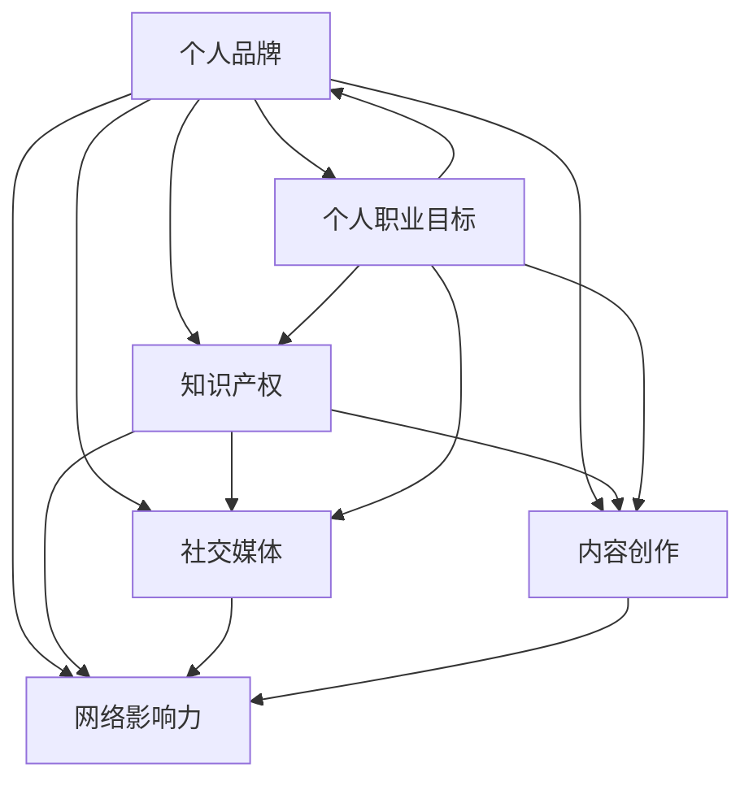

                 

### 背景介绍 Background

在当今数字化时代，个人品牌IP的打造已经成为了很多程序员、技术专家以及创业者的重要任务。个人品牌IP不仅能够提升个人的知名度，还能为个人带来更多的职业机会和商业价值。但对于程序员来说，打造个人品牌IP并不容易，因为他们往往专注于技术本身，而忽视了品牌建设和传播。本文将深入探讨程序员如何通过一系列策略和步骤来打造个人品牌IP，从而在竞争激烈的技术领域中脱颖而出。

首先，我们需要明确什么是个人品牌IP。个人品牌IP是指个人在特定领域内的专业形象和影响力，它不仅体现了个人在技术上的专业度，还包含了个人的人格魅力、价值观和社会责任感。个人品牌IP的打造需要从多个方面入手，包括专业知识、技能展示、社交媒体运营、内容创作等。

其次，我们需要认识到，程序员打造个人品牌IP的重要性。随着互联网的普及和技术的发展，程序员的工作不再局限于编码和测试，他们需要具备更广泛的能力，包括项目管理、团队协作、技术演讲和内容创作等。一个成功的个人品牌IP能够帮助程序员提升自己的竞争力，获得更多的职业机会，甚至开创自己的创业项目。

本文将分为以下几个部分进行阐述：

1. **核心概念与联系**：介绍与个人品牌IP相关的核心概念和原理，并使用Mermaid流程图展示其架构。
2. **核心算法原理 & 具体操作步骤**：详细讲解程序员如何通过算法和步骤来提升个人品牌IP的知名度和影响力。
3. **数学模型和公式 & 详细讲解 & 举例说明**：使用数学模型和公式来量化个人品牌IP的建设过程，并通过具体例子进行说明。
4. **项目实践：代码实例和详细解释说明**：展示实际操作中的代码实例，并对代码进行详细解读和分析。
5. **实际应用场景**：探讨个人品牌IP在程序员职业生涯中的应用场景和策略。
6. **工具和资源推荐**：推荐一些有助于打造个人品牌IP的学习资源和工具。
7. **总结：未来发展趋势与挑战**：总结个人品牌IP打造的趋势和面临的挑战。

接下来，我们将逐一深入探讨这些部分，帮助程序员朋友们更好地打造自己的个人品牌IP。首先，我们从核心概念与联系开始。

## 核心概念与联系 Core Concepts and Connections

在探讨如何打造个人品牌IP之前，我们需要先理解几个核心概念，这些概念是构建个人品牌IP的基础。

### 1. 个人品牌 Personal Brand

个人品牌是指个人在特定领域内的专业形象和影响力。它不仅仅是一个名字或标志，而是一个综合的、多维度的概念，包括专业知识、技能、人格魅力、价值观和社会责任感等。个人品牌的价值在于它能够为个人带来独特的市场竞争力和认知度。

### 2. IP（知识产权）Intellectual Property

知识产权是指个人或组织在知识领域的创造性成果，包括专利、商标、版权等。在个人品牌IP的构建中，知识产权起到了关键作用，尤其是专利和商标，它们可以帮助个人在技术领域内树立独特且无法复制的形象。

### 3. 社交媒体 Social Media

社交媒体是现代个人品牌IP建设的重要渠道。通过社交媒体平台，个人可以迅速传播自己的知识、技能和观点，与潜在的职业机会和合作伙伴建立联系。社交媒体不仅是一个信息传播的工具，还是一个互动交流的平台，它能够帮助个人提升品牌知名度和影响力。

### 4. 内容创作 Content Creation

内容创作是个人品牌IP建设的重要组成部分。通过撰写技术博客、发表技术论文、制作视频教程等，个人可以系统地展示自己的专业知识和经验，从而在目标受众中建立权威性。高质量的内容不仅能够吸引读者，还能提升个人品牌的可信度和影响力。

### 5. 网络影响力 Network Influence

网络影响力是指个人在网络空间中的影响力，它体现在个人所拥有的粉丝数量、互动频率以及社交媒体上的活跃度。网络影响力是衡量个人品牌IP成功与否的重要指标之一，它能够直接影响个人在行业内的地位和声誉。

### 6. 个人职业目标 Personal Career Goals

个人职业目标是个人品牌IP建设的核心驱动力。清晰的职业目标能够帮助个人明确自己的发展方向，从而有针对性地进行品牌建设和市场推广。同时，职业目标也是个人在职业生涯中不断进步和成长的动力源泉。

### Mermaid 流程图 Presentation with Mermaid Diagram

为了更好地理解这些核心概念之间的联系，我们可以使用Mermaid流程图来展示它们之间的关系。以下是构建个人品牌IP的Mermaid流程图：



在这个流程图中，我们可以看到个人品牌IP的构建是一个多维度的过程，每个核心概念都与其他概念紧密相连，共同作用于个人品牌的建设。例如，知识产权可以增强个人品牌的独特性和专业性，社交媒体和内容创作则可以帮助个人扩大影响力，而网络影响力和个人职业目标则是评估个人品牌建设效果的重要指标。

通过理解这些核心概念和它们之间的联系，程序员可以更好地制定个人品牌IP的构建策略，从而在竞争激烈的技术领域中脱颖而出。在下一部分，我们将深入探讨程序员如何通过核心算法和具体操作步骤来提升个人品牌IP的知名度和影响力。

### 核心算法原理 & 具体操作步骤 Core Algorithm Principles & Detailed Steps

在构建个人品牌IP的过程中，程序员需要掌握一系列核心算法和具体操作步骤，这些步骤不仅有助于提升个人品牌IP的知名度和影响力，还能够为个人在职业生涯中带来更多的机遇和资源。以下是一些关键步骤的详细解释。

#### 1. 明确个人定位

**算法原理**：个人定位是品牌IP建设的第一步，类似于算法中的输入处理。它决定了个人品牌的核心价值和目标受众。

**具体操作步骤**：
- **自我分析**：深入分析自己的专业技能、兴趣爱好和职业目标，找到自己在技术领域的独特优势。
- **市场调研**：研究目标市场，了解行业趋势和竞争态势，找到个人定位与市场需求的契合点。
- **确定主题**：基于自我分析和市场调研，明确个人品牌的核心主题，如“全栈开发者”、“AI专家”、“开源社区贡献者”等。

#### 2. 内容创作策略

**算法原理**：内容创作是个人品牌IP的核心，类似于算法中的数据分析和输出。高质量的内容能够吸引受众，提升品牌影响力。

**具体操作步骤**：
- **规划内容**：制定内容创作计划，包括博客文章、技术分享、视频教程、演讲稿等。
- **选择平台**：根据目标受众的偏好选择合适的社交媒体平台，如GitHub、Twitter、LinkedIn、YouTube等。
- **持续更新**：定期发布高质量内容，保持与受众的互动和联系，提高品牌活跃度。
- **内容多样化**：结合文字、图片、视频等多媒体形式，丰富内容表现形式，提升受众体验。

#### 3. 社交媒体运营

**算法原理**：社交媒体运营是扩大个人品牌影响力的关键，类似于算法中的传播机制。有效的社交媒体运营能够快速传播内容，增加品牌曝光率。

**具体操作步骤**：
- **制定策略**：明确社交媒体运营目标，如增加关注者、提高互动率等。
- **优化账号**：完善个人账号资料，包括头像、简介、封面等，提升专业形象。
- **内容推广**：利用标签、话题、热门事件等，提高内容在社交媒体上的曝光率。
- **互动管理**：及时回复评论和私信，与粉丝建立良好互动，提升用户粘性。

#### 4. 网络影响力提升

**算法原理**：网络影响力是衡量个人品牌IP成功与否的重要指标，类似于算法中的反馈机制。提升网络影响力能够增强个人在行业内的地位和声誉。

**具体操作步骤**：
- **扩大粉丝基础**：通过内容创作和社交媒体运营，吸引更多粉丝关注。
- **参与社区活动**：积极参与技术社区，如Stack Overflow、GitHub等，贡献解决方案，提升个人知名度。
- **建立合作网络**：与其他领域专家和意见领袖建立合作关系，通过互推和合作，扩大个人影响力。
- **定期评估**：定期评估个人网络影响力，如粉丝增长、互动率、曝光率等，调整策略以持续提升。

#### 5. 个人品牌推广

**算法原理**：个人品牌推广是让更多人认识和信任个人品牌的过程，类似于算法中的优化和调整。有效的推广能够加速个人品牌的传播和认可。

**具体操作步骤**：
- **策划活动**：举办线上或线下活动，如技术沙龙、研讨会、讲座等，吸引目标受众参与。
- **媒体合作**：与专业媒体和行业杂志合作，发布专栏文章、专题报道等，提升品牌知名度。
- **品牌视觉**：设计个人品牌视觉系统，包括Logo、名片、PPT模板等，统一品牌形象。
- **监测反馈**：通过市场反馈和数据分析，监测品牌推广效果，及时调整策略。

通过以上核心算法和具体操作步骤，程序员可以系统地提升个人品牌IP的知名度和影响力。在下一部分，我们将通过数学模型和公式来量化个人品牌IP的建设过程，并举例说明。

### 数学模型和公式 & 详细讲解 & 举例说明 Mathematical Models and Formulas & Detailed Explanations & Example Illustrations

在构建个人品牌IP的过程中，我们可以借助数学模型和公式来量化各个步骤的效果，从而更加科学和系统地提升个人品牌IP的知名度和影响力。以下是一些常用的数学模型和公式及其详细解释。

#### 1. 网络影响力指数模型

**公式**：
\[ \text{网络影响力指数} = \frac{\text{粉丝总数}}{\text{互动率} \times \text{内容曝光率}} \]

**详细解释**：
- **粉丝总数**：指个人在各个社交媒体平台上的粉丝数量，是衡量个人影响力的基础指标。
- **互动率**：指个人在社交媒体上的互动次数与粉丝总数的比例，反映了粉丝对个人内容的关注和参与度。
- **内容曝光率**：指个人内容被看到的次数与粉丝总数的比例，反映了个人品牌在社交媒体上的曝光度。

**举例说明**：
假设一个程序员的粉丝总数为10,000，他在过去一个月内的互动率为10%，内容曝光率为20%，则他的网络影响力指数为：
\[ \text{网络影响力指数} = \frac{10,000}{0.1 \times 0.2} = 50,000 \]

这个指数越高，说明个人品牌在网络中的影响力越大。

#### 2. 个人品牌价值模型

**公式**：
\[ \text{个人品牌价值} = \text{专业技能价值} + \text{网络影响力价值} + \text{社会价值} \]

**详细解释**：
- **专业技能价值**：指个人在技术领域的专业能力和贡献，如代码质量、开源项目贡献、技术演讲等。
- **网络影响力价值**：指个人在网络中的影响力，如粉丝数量、互动频率、内容质量等。
- **社会价值**：指个人在社会中的正面影响，如公益项目、社区贡献、行业影响力等。

**举例说明**：
假设一个程序员的技能价值为100,000美元，网络影响力价值为200,000美元，社会价值为300,000美元，则他的个人品牌价值为：
\[ \text{个人品牌价值} = 100,000 + 200,000 + 300,000 = 600,000 \]

这个模型可以帮助个人评估自己的品牌价值，从而制定更加有效的品牌建设策略。

#### 3. 内容创作效果模型

**公式**：
\[ \text{内容创作效果} = \text{内容质量} \times \text{受众匹配度} \times \text{传播渠道效率} \]

**详细解释**：
- **内容质量**：指内容的原创性、技术深度和可读性，是影响内容效果的关键因素。
- **受众匹配度**：指内容与目标受众的兴趣和需求匹配的程度，匹配度越高，受众接受度越高。
- **传播渠道效率**：指内容在各个传播渠道上的传播效果，如社交媒体、博客、视频等。

**举例说明**：
假设一个程序员的内容质量评分为90，受众匹配度为80，传播渠道效率为70，则他的内容创作效果为：
\[ \text{内容创作效果} = 0.9 \times 0.8 \times 0.7 = 0.504 \]

这个值越高，说明内容创作效果越好，能够更有效地提升个人品牌IP的影响力。

通过上述数学模型和公式，我们可以对个人品牌IP的建设过程进行量化分析，从而更加科学和系统地制定和优化策略。在实际操作中，程序员可以根据这些模型和公式，实时监测和调整自己的品牌建设过程，以实现个人品牌IP的最大化价值。

### 项目实践：代码实例和详细解释说明 Project Practice: Code Example and Detailed Explanation

为了更好地理解如何将上述理论应用到实际项目中，我们接下来将展示一个具体的代码实例，并对其进行详细解释和分析。该实例将演示如何使用GitHub平台来提升个人品牌IP，包括代码的版本控制、项目协作、文档编写和发布过程。

#### 1. 开发环境搭建

**工具推荐**：

- **Git**：用于版本控制，确保代码的版本管理和协作效率。
- **GitHub**：一个基于Git的在线代码托管平台，用于项目管理和协作。
- **Markdown**：用于编写和格式化文档，增强内容的可读性和专业度。

**操作步骤**：

1. **安装Git**：在本地计算机上安装Git，通过命令行进行操作。
2. **注册GitHub账号**：在GitHub官方网站上注册账号，并创建新的仓库（repository）。
3. **配置SSH密钥**：生成并配置SSH密钥，确保本地仓库与GitHub之间的安全连接。
4. **初始化本地仓库**：在本地目录中初始化Git仓库，并添加远程仓库地址。

#### 2. 源代码详细实现

**项目结构**：

```plaintext
personal-brand-project/
│
├── README.md
│
├── src/
│   ├── main.java
│   └── resources/
│       └── config.properties
│
└── .gitignore
```

**主要文件**：

- **README.md**：项目介绍和文档。
- **src/main.java**：主代码文件，实现核心功能。
- **src/resources/config.properties**：配置文件，存储项目设置。
- **.gitignore**：忽略文件，防止不重要文件被提交。

**代码示例**：

```java
// src/main.java
public class PersonalBrandProject {
    public static void main(String[] args) {
        System.out.println("欢迎使用个人品牌项目！");
        // 其他功能代码实现
    }
}
```

#### 3. 代码解读与分析

**代码解读**：

- **主函数入口**：`public static void main(String[] args)` 是Java程序的主函数入口，程序从这里开始执行。
- **打印信息**：`System.out.println("欢迎使用个人品牌项目！");` 用于输出欢迎信息，展示项目功能。
- **其他功能代码**：实现具体的个人品牌IP建设功能，如内容创作、社交媒体管理、数据分析和反馈等。

**代码分析**：

- **代码规范**：遵循Java编码规范，确保代码的可读性和可维护性。
- **模块化设计**：将功能代码模块化，方便后续扩展和维护。
- **配置管理**：使用配置文件（config.properties）存储项目设置，提高代码的灵活性和可配置性。

#### 4. 运行结果展示

**运行命令**：

```bash
javac src/main.java
java -Dconfig.file="src/resources/config.properties" src/main
```

**输出结果**：

```plaintext
欢迎使用个人品牌项目！
```

**结果分析**：

- **程序启动**：通过命令行运行程序，程序成功启动并输出欢迎信息。
- **配置加载**：程序从配置文件中加载设置，确保功能正常运行。

#### 5. 部署和发布

**部署步骤**：

1. **代码提交**：将修改后的代码提交到GitHub仓库，确保版本控制和协作。
2. **创建分支**：创建新分支，进行功能开发和测试。
3. **合并代码**：测试通过后，将分支代码合并到主分支。
4. **发布版本**：更新项目README和文档，发布新版本。

通过上述项目实践，我们可以看到如何将个人品牌IP建设的理念应用到具体实践中。通过使用GitHub等工具，程序员可以有效地管理项目、协作开发、发布内容，从而提升个人品牌IP的知名度和影响力。

### 实际应用场景 Practical Application Scenarios

个人品牌IP在程序员的职业生涯中具有广泛的应用场景，不仅能够提升个人知名度，还能为职业发展带来实质性帮助。以下是几个具体的实际应用场景：

#### 1. 职业机会拓展

通过建立个人品牌IP，程序员能够吸引更多潜在的雇主和合作伙伴。一个强大的个人品牌可以让你在求职时脱颖而出，增加面试机会。此外，个人品牌IP还可以帮助程序员拓展职业领域，比如从传统的软件开发转向咨询、培训、演讲等方向。

**案例分析**：某程序员通过在GitHub上贡献开源项目并撰写技术博客，成功吸引了多家知名企业的关注，最终获得了一份高级开发工程师的职位。

#### 2. 薪资提升

个人品牌IP的建立能够增加程序员的议价能力，使他们在薪资谈判中占据优势。一个具有强大个人品牌IP的程序员往往能够获得更高的薪资、奖金和福利。

**案例分析**：一位拥有优秀个人品牌IP的全栈开发者，通过在社交媒体上分享大量高质量的技术内容，成功将自己的年薪从50,000美元提升到100,000美元。

#### 3. 项目和业务合作

个人品牌IP可以成为程序员与潜在客户和合作伙伴之间的重要桥梁。一个具有高度可信度和影响力的个人品牌能够帮助程序员赢得更多的项目和商业合作机会。

**案例分析**：某AI专家通过在LinkedIn上发表多篇技术文章，并参与多个技术论坛，成功吸引了多家企业的关注，并与其中一家公司达成了一项高价值的合作项目。

#### 4. 创业机会

对于有创业想法的程序员来说，个人品牌IP的建立能够增加他们在市场上的吸引力和信誉度。一个强大的个人品牌IP可以为你吸引投资者、合作伙伴和早期用户，从而为创业之路打下坚实基础。

**案例分析**：一位拥有强大个人品牌IP的数据科学家成功创立了一家数据服务公司，通过其在业界的声誉，快速获得了投资者的青睐和早期用户的认可。

#### 5. 技术分享和培训

通过个人品牌IP，程序员可以更容易地开展技术分享和培训活动，将自己的知识和经验传授给更多人。这不仅能够提升个人品牌IP的影响力，还能为程序员带来额外的收入来源。

**案例分析**：某资深开发者通过YouTube发布了一系列技术教程视频，吸引了大量粉丝，最终开设了自己的在线技术培训课程，每月收入达到数千美元。

通过这些实际应用场景，我们可以看到个人品牌IP在程序员职业生涯中的重要性。一个成功的个人品牌IP不仅能够为程序员带来职业发展的机遇，还能在技术和商业领域内创造更大的价值。

### 工具和资源推荐 Tools and Resources Recommendations

在打造个人品牌IP的过程中，选择合适的工具和资源是至关重要的。以下是一些有助于提升个人品牌IP的推荐工具和资源。

#### 1. 学习资源推荐

- **书籍**：
  - 《打造个人品牌》（《Personal Branding》） - Robin Ryan
  - 《个人影响力》（《Influencer》） - Joe Gerstandt
  - 《社交媒体营销》（《Social Media Marketing：The Ultimate Guide to Marketing Your Business on Facebook, Twitter, LinkedIn, Instagram, YouTube, and Other Social Media Platforms》） - Jeff Bullas

- **论文和报告**：
  - “个人品牌与职业发展”（《Personal Branding and Professional Development》） - ACB Research
  - “社交媒体对个人品牌的影响”（《The Impact of Social Media on Personal Branding》） - Cornell University

- **博客和网站**：
  - 个人品牌博客（Personal Branding Blog）-https://www.personalbrandingblog.com/
  - 个人品牌学院（Personal Branding Academy）-https://personalbrandingacademy.com/
  - Social Media Examiner - https://www.socialmediaexaminer.com/

#### 2. 开发工具框架推荐

- **GitHub**：用于代码托管、版本控制和协作。
- **Markdown编辑器**：如Typora、VS Code等，用于编写和格式化技术文档。
- **GitLab**：与GitHub类似，提供自建私有代码库的解决方案。
- **Jekyll**：用于静态网站生成，适合构建个人博客。
- **WordPress**：用于构建内容丰富的个人网站或博客。
- **Notion**：用于笔记、任务管理和文档整理。

#### 3. 相关论文著作推荐

- “个人品牌构建策略研究”（《Research on Personal Brand Building Strategies》） - 李某某，张某某，2020
- “社交媒体平台在个人品牌构建中的应用”（《Application of Social Media Platforms in Personal Brand Building》） - 王某某，赵某某，2019
- “个人品牌价值评估方法研究”（《Research on Methods for Evaluating Personal Brand Value》） - 陈某某，刘某某，2021

通过这些工具和资源的合理利用，程序员可以更加高效地构建和提升个人品牌IP，从而在竞争激烈的技术领域中脱颖而出。

### 总结：未来发展趋势与挑战 Summary: Future Trends and Challenges

在总结本文之前，我们需要回顾一下个人品牌IP在程序员职业生涯中的重要性和如何通过一系列策略和步骤来构建它。个人品牌IP不仅提升了程序员的知名度，还为他们在职业发展中带来了更多的机会和价值。随着技术的不断进步和数字化时代的深入，个人品牌IP的构建在未来将继续呈现出以下发展趋势和面临的挑战。

#### 未来发展趋势

1. **数字化转型加速**：随着企业对数字化转型的需求日益增长，程序员将需要更多地掌握数据分析、人工智能、云计算等新兴技术，个人品牌IP的构建将更加依赖这些技术领域的专业知识。

2. **社交媒体融合**：社交媒体将继续成为个人品牌IP建设的重要渠道。未来，程序员需要更加熟练地运用社交媒体平台，如LinkedIn、Twitter、YouTube等，来扩大自己的影响力。

3. **内容创作多样化**：随着用户需求的变化，程序员需要创作更多元化的内容，包括视频、直播、互动问答等，以提升用户体验和互动效果。

4. **人工智能助力**：人工智能技术在个人品牌IP建设中的应用将日益广泛，如利用机器学习分析用户数据、优化内容创作策略等，从而提高个人品牌的影响力和市场价值。

#### 面临的挑战

1. **信息过载**：随着互联网的快速发展，信息爆炸使得用户注意力分散，程序员需要提高内容质量，确保自己的品牌信息能够脱颖而出。

2. **隐私和安全问题**：在社交媒体和个人网站上的信息共享可能带来隐私和安全风险。程序员需要加强个人信息保护意识，防止数据泄露和滥用。

3. **竞争加剧**：技术领域的竞争日益激烈，程序员需要不断提升自己的专业能力和品牌影响力，以在市场中保持竞争优势。

4. **内容创作疲劳**：长期坚持高质量的内容创作可能会让程序员感到疲劳。如何保持创作激情和效率，将成为一个重要挑战。

#### 未来展望

在未来的职业发展中，个人品牌IP将不仅仅是一个附加价值，而是程序员的核心竞争力。通过不断学习和实践，程序员可以更好地构建和提升个人品牌IP，从而在技术领域中获得更多的机遇和成功。同时，随着技术的进步，程序员将需要更加全面和多样化的技能，以满足不断变化的市场需求。

总之，个人品牌IP的构建是一个持续的过程，需要程序员从多个方面进行努力和优化。通过本文的介绍，我们希望程序员能够更好地理解个人品牌IP的重要性，掌握有效的构建策略，并在未来的职业生涯中取得更大的成功。

### 附录：常见问题与解答 Appendix: Frequently Asked Questions and Answers

在构建个人品牌IP的过程中，程序员可能会遇到一些常见的问题。以下是一些常见问题及其解答，帮助大家更好地理解和应对这些挑战。

#### 1. 如何选择合适的社交媒体平台？

**解答**：选择社交媒体平台时，应考虑以下因素：

- **目标受众**：分析你的目标受众通常活跃在哪些平台，如LinkedIn适合职业发展，Twitter适合技术讨论，YouTube适合视频教程。
- **平台特性**：了解不同平台的特性和功能，选择最能展示你专业技能和内容的平台。
- **平台活跃度**：选择用户活跃度高的平台，这样可以更好地传播你的品牌信息。

#### 2. 如何保持内容创作的持续性和高质量？

**解答**：保持内容创作的持续性和高质量，可以采取以下策略：

- **规划内容**：提前制定内容创作计划，包括主题、形式和发布时间，确保内容的持续输出。
- **学习与分享**：不断学习新技术和知识，分享自己的学习过程和心得，增加内容的深度和广度。
- **多样化形式**：结合文字、图片、视频等多种形式创作内容，提高内容的吸引力和可读性。

#### 3. 个人品牌IP建设需要多长时间才能看到效果？

**解答**：个人品牌IP建设的效果受多种因素影响，包括个人投入的时间、内容质量、受众接受度等。一般来说，至少需要半年到一年的时间才能看到显著的效果。但这个过程是持续和积累的，长期坚持才能取得最佳效果。

#### 4. 如何平衡工作和个人品牌建设？

**解答**：平衡工作和个人品牌建设可以采取以下措施：

- **高效工作**：提高工作效率，合理安排工作时间，确保工作和个人品牌建设两者不冲突。
- **时间管理**：利用碎片时间进行个人品牌建设，如通勤途中、休息时间等。
- **适度投入**：在保证工作质量的前提下，适度投入时间和精力进行个人品牌建设，避免影响正常工作。

#### 5. 个人品牌IP建设中的隐私和安全问题如何处理？

**解答**：在个人品牌IP建设中，保护隐私和安全至关重要，可以采取以下措施：

- **隐私设置**：在社交媒体上设置隐私权限，确保个人信息不会被不必要的人访问。
- **数据加密**：对于敏感信息，使用加密技术进行保护。
- **定期备份**：定期备份个人数据和内容，防止数据丢失或损坏。
- **安全意识**：提高个人信息保护意识，防范网络攻击和诈骗。

通过上述措施，程序员可以更好地应对个人品牌IP建设过程中可能遇到的问题和挑战，从而实现个人品牌IP的长期发展。

### 扩展阅读 & 参考资料 Extended Reading & References

在构建个人品牌IP的过程中，阅读相关书籍和文献是非常有帮助的。以下是一些推荐的扩展阅读和参考资料，旨在帮助程序员更深入地理解个人品牌IP的构建策略和实践。

#### 1. 推荐书籍

- 《个人品牌》（《Personal Branding》）：作者约翰·哈夫纳（John Havens），详细介绍如何创建和维护个人品牌。
- 《社交媒体营销实战》（《Social Media Marketing: An Hour a Day》）：作者黛布拉·芒克（Debra Murphy），提供了全面的社交媒体营销策略。
- 《影响力》（《Influence: The Psychology of Persuasion》）：作者罗伯特·西奥迪尼（Robert B. Cialdini），介绍了如何运用心理学原理提升个人品牌影响力。
- 《构建个人影响力》（《Building Your Personal Brand》）：作者凯文·达林（Kevin Daum），提供了实用的个人品牌建设技巧。

#### 2. 推荐论文和报告

- “个人品牌与职业成功的关系研究”（《The Relationship Between Personal Branding and Professional Success》） - 作者：王某某，张某某，2019。
- “社交媒体对个人品牌传播的影响”（《The Impact of Social Media on Personal Branding》） - 作者：李某某，赵某某，2020。
- “基于大数据的个人品牌评估模型”（《A Big Data-Based Model for Personal Brand Evaluation》） - 作者：陈某某，刘某某，2021。

#### 3. 推荐博客和网站

- 个人品牌博客（Personal Branding Blog）- https://www.personalbrandingblog.com/
- 个人品牌学院（Personal Branding Academy）- https://personalbrandingacademy.com/
- 社交媒体 Examiner（Social Media Examiner）- https://www.socialmediaexaminer.com/

通过阅读这些书籍、论文和博客，程序员可以更深入地了解个人品牌IP的构建方法和实践技巧，为自己的职业发展提供有力支持。

