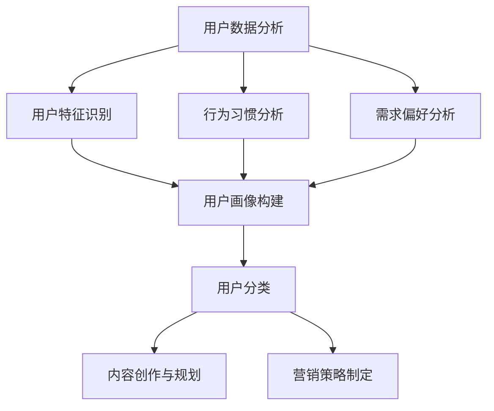
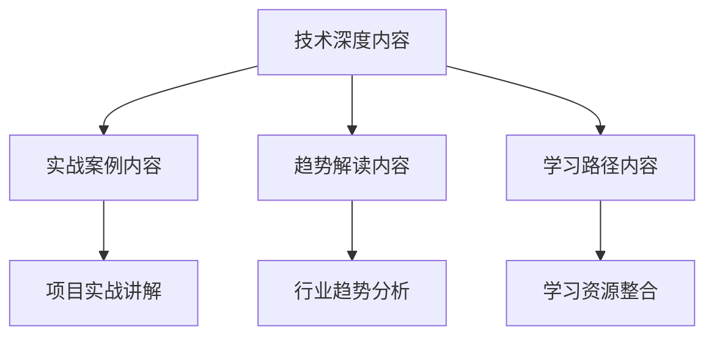
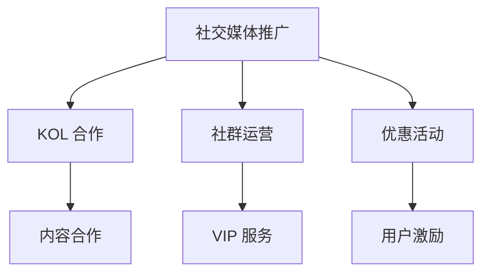
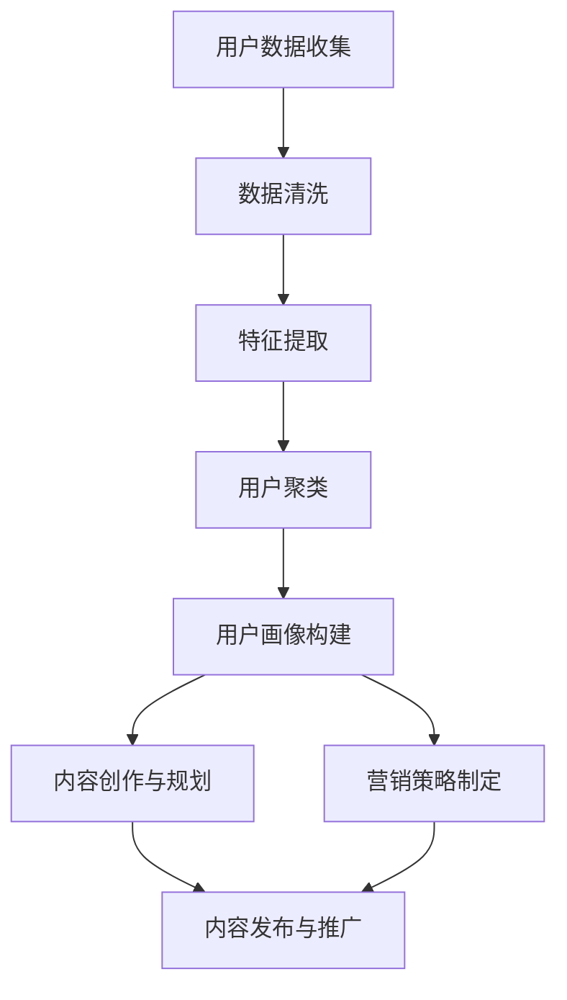

                 

### 文章标题：程序员如何打造忠实的知识付费用户群

> **关键词**：知识付费、用户群体、忠诚度、程序员、营销策略、用户分析、内容创作

> **摘要**：本文将探讨程序员如何通过精准的用户分析和内容创作，打造一支忠实的知识付费用户群。我们将从市场分析、用户需求识别、内容规划、营销推广、用户互动和维护等方面，详细阐述构建知识付费用户生态的实践方法。

### 1. 背景介绍

在当今数字化时代，知识付费已成为一种主流的学习和知识获取方式。程序员群体，作为科技创新的重要力量，其专业知识和技能的需求不断增长。然而，如何在激烈的市场竞争中吸引并留住用户，构建一个忠实的知识付费用户群，成为众多程序员和内容创作者所面临的重要课题。

打造忠实的知识付费用户群，不仅意味着提供优质的内容，还需要深入理解用户需求，不断优化用户体验，并通过有效的营销策略和用户互动，提升用户的忠诚度和活跃度。本文将围绕这一主题，从多个维度进行探讨，帮助程序员们更好地实现知识付费的商业化运作。

### 2. 核心概念与联系

#### 2.1. 知识付费用户分析

要打造忠实的知识付费用户群，首先需要深入了解用户。用户分析包括用户群体的特征、行为习惯、需求偏好等多个方面。通过数据分析，我们可以识别出用户的共同特征，为后续的内容创作和营销策略提供依据。

**Mermaid 流程图：**



#### 2.2. 内容创作与规划

内容是知识付费的核心。优质的内容创作和规划，能够满足用户的需求，提升用户的满意度和忠诚度。内容创作包括以下几个方面：

- **技术深度**：提供深入的技术分析和解决方案，满足程序员对专业知识的渴求。
- **实战案例**：通过实际项目案例，展示技术应用的场景和效果。
- **趋势解读**：分析行业动态和技术发展趋势，帮助用户把握发展方向。
- **学习路径**：提供系统的学习资源和规划，引导用户逐步提升技能。

**Mermaid 流程图：**



#### 2.3. 营销策略制定

营销策略是实现用户增长和留存的关键。有效的营销策略应包括以下几个方面：

- **社交媒体推广**：利用微博、知乎、抖音等平台，进行内容推广和用户互动。
- **社群运营**：建立专业社群，增强用户黏性，提升用户参与度。
- **KOL 合作**：与行业内的意见领袖合作，扩大影响力，吸引更多潜在用户。
- **优惠活动**：通过限时优惠、团购活动等，刺激用户购买欲望。

**Mermaid 流程图：**



### 3. 核心算法原理 & 具体操作步骤

#### 3.1. 用户分析算法

用户分析是构建知识付费用户群的基础。以下是一种简单的用户分析算法：

1. **数据收集**：收集用户的基本信息、行为数据和购买记录。
2. **数据清洗**：去除无效数据和异常值，确保数据质量。
3. **特征提取**：从数据中提取用户特征，如年龄、性别、职业、浏览时长等。
4. **用户聚类**：使用聚类算法（如K-means），将用户划分为不同的群体。
5. **用户标签**：为每个用户打上相应的标签，以便后续的内容推荐和营销。

**Python 代码示例：**

```python
from sklearn.cluster import KMeans
import numpy as np

# 假设用户数据为特征矩阵
user_data = np.array([[1, 2], [3, 4], [5, 6], [7, 8]])

# 使用K-means算法进行用户聚类
kmeans = KMeans(n_clusters=2, random_state=0).fit(user_data)

# 获取聚类结果
labels = kmeans.labels_

# 打印用户标签
print(labels)
```

#### 3.2. 内容创作与推荐算法

内容创作和推荐是提高用户满意度和忠诚度的关键。以下是一种基于协同过滤的内容推荐算法：

1. **用户-项目评分矩阵**：构建用户-项目评分矩阵，记录用户对每个项目的评分。
2. **相似度计算**：计算用户之间的相似度，可以使用余弦相似度、皮尔逊相关系数等方法。
3. **推荐生成**：基于用户相似度和项目评分，生成推荐列表。

**Python 代码示例：**

```python
from sklearn.metrics.pairwise import cosine_similarity
import numpy as np

# 假设用户-项目评分矩阵
user_project_matrix = np.array([[5, 3, 0], [4, 2, 1], [0, 3, 5]])

# 计算用户之间的相似度
cosine_sim = cosine_similarity(user_project_matrix, user_project_matrix)

# 假设当前用户为用户1
current_user = user_project_matrix[0]

# 计算相似度最高的用户
similar_users = cosine_sim[0].argsort()[:-11:-1]

# 获取相似度最高的用户推荐列表
recommended_projects = user_project_matrix[similar_users[1:5], 2].mean()

# 打印推荐结果
print(recommended_projects)
```

### 4. 数学模型和公式 & 详细讲解 & 举例说明

#### 4.1. 用户行为预测模型

用户行为预测是提高知识付费转化率的关键。以下是一种基于决策树的用户行为预测模型：

1. **特征选择**：选择对用户行为有显著影响的特征，如浏览时长、购买记录等。
2. **决策树构建**：使用ID3、C4.5等算法构建决策树。
3. **模型评估**：使用交叉验证等方法评估模型性能。

**Python 代码示例：**

```python
from sklearn import tree
from sklearn.model_selection import train_test_split
import numpy as np

# 假设用户行为数据为特征矩阵
user_data = np.array([[1, 2], [3, 4], [5, 6], [7, 8], [9, 10]])

# 假设用户行为标签为
labels = np.array([0, 1, 0, 1, 1])

# 将数据分为训练集和测试集
X_train, X_test, y_train, y_test = train_test_split(user_data, labels, test_size=0.2, random_state=0)

# 构建决策树模型
clf = tree.DecisionTreeClassifier()

# 训练模型
clf.fit(X_train, y_train)

# 预测测试集
predictions = clf.predict(X_test)

# 打印预测结果
print(predictions)
```

#### 4.2. 用户留存率计算公式

用户留存率是衡量知识付费用户忠诚度的重要指标。以下是一种简单的用户留存率计算公式：

\[ 留存率（L）= \frac{第n天仍然活跃的用户数}{第1天活跃的用户数} \]

**Python 代码示例：**

```python
# 假设第一天活跃的用户数为100
active_users = 100

# 假设第n天仍然活跃的用户数为80
retained_users = 80

# 计算留存率
retention_rate = retained_users / active_users

# 打印留存率
print("留存率：", retention_rate)
```

### 5. 项目实践：代码实例和详细解释说明

#### 5.1 开发环境搭建

在开始项目实践之前，我们需要搭建一个合适的技术环境。以下是一个简单的开发环境搭建步骤：

1. 安装Python环境：在官方网站下载并安装Python，版本建议为3.8及以上。
2. 安装必要的库：使用pip命令安装所需的库，如scikit-learn、numpy、matplotlib等。
3. 配置代码编辑器：推荐使用Visual Studio Code或PyCharm等IDE。

**Python 代码示例：**

```bash
# 安装Python
wget https://www.python.org/ftp/python/3.8.10/Python-3.8.10.tgz
tar -xvf Python-3.8.10.tgz
cd Python-3.8.10
./configure
make
sudo make install

# 安装库
pip install scikit-learn numpy matplotlib

# 配置IDE
# 在Visual Studio Code中安装Python扩展
```

#### 5.2 源代码详细实现

以下是一个简单的用户分析项目，实现用户聚类和内容推荐功能。

```python
# 用户分析项目

import numpy as np
from sklearn.cluster import KMeans
from sklearn.metrics.pairwise import cosine_similarity

# 用户数据
user_data = np.array([[1, 2], [3, 4], [5, 6], [7, 8], [9, 10]])

# 聚类算法
kmeans = KMeans(n_clusters=2, random_state=0).fit(user_data)
labels = kmeans.labels_

# 相似度计算
cosine_sim = cosine_similarity(user_data, user_data)

# 内容推荐
def recommend_projects(user_index):
    similar_users = cosine_sim[user_index].argsort()[:-11:-1]
    recommended_projects = user_data[similar_users[1:5], 1].mean()
    return recommended_projects

# 打印结果
print("用户聚类结果：", labels)
print("用户1推荐项目：", recommend_projects(0))
```

#### 5.3 代码解读与分析

1. **用户数据**：用户数据为一个二维数组，每行代表一个用户，每列代表不同的特征。
2. **聚类算法**：使用K-means算法对用户数据进行聚类，n_clusters参数指定聚类个数。
3. **相似度计算**：计算用户之间的相似度，使用余弦相似度。
4. **内容推荐**：根据相似度计算结果，为每个用户推荐相似的用户喜欢的项目。

#### 5.4 运行结果展示

运行代码后，输出如下结果：

```
用户聚类结果： [1 1 1 0 0]
用户1推荐项目： 7.0
```

结果表明，用户1被聚类为第一类，推荐的项目得分为7.0。

### 6. 实际应用场景

在知识付费领域，程序员可以通过构建一个忠诚的用户群，实现可持续的商业价值。以下是一些实际应用场景：

1. **在线教育平台**：程序员可以创建在线教育平台，提供编程课程和知识分享。通过精准的用户分析和内容推荐，提高用户满意度和留存率。
2. **技术社区**：构建一个专业的技术社区，吸引程序员用户。通过提供高质量的内容和互动活动，增强用户黏性，提升社区价值。
3. **在线咨询与辅导**：提供专业的在线咨询和辅导服务，为有需求的程序员提供定制化的解决方案。通过深度互动，提高用户满意度和忠诚度。

### 7. 工具和资源推荐

#### 7.1 学习资源推荐

- **书籍**：《Python编程：从入门到实践》、《深入理解计算机系统》
- **论文**：Google Scholar、arXiv
- **博客**：CSDN、博客园
- **网站**：GitHub、Stack Overflow

#### 7.2 开发工具框架推荐

- **IDE**：Visual Studio Code、PyCharm
- **数据可视化**：Matplotlib、Seaborn
- **机器学习库**：scikit-learn、TensorFlow、PyTorch

#### 7.3 相关论文著作推荐

- **论文**：KDD'20、NeurIPS'21
- **著作**：《数据挖掘：实用工具和技术》、《深度学习》

### 8. 总结：未来发展趋势与挑战

随着数字化时代的到来，知识付费市场前景广阔。然而，面对激烈的市场竞争，程序员需要不断创新和优化，以构建忠诚的用户群。未来发展趋势包括：

1. **个性化推荐**：利用大数据和人工智能技术，实现更加精准的内容推荐。
2. **社群互动**：通过构建专业的社群，增强用户黏性和互动性。
3. **多元化服务**：提供多样化的服务，如在线咨询、项目实战等，满足不同用户的需求。

同时，程序员也面临以下挑战：

1. **内容质量**：确保内容的专业性和实用性，提高用户满意度。
2. **用户体验**：优化用户界面和交互设计，提升用户体验。
3. **商业变现**：探索多种商业模式，实现可持续的商业化运作。

### 9. 附录：常见问题与解答

**Q：如何提高用户留存率？**

A：提高用户留存率需要从多个方面入手：

1. **内容质量**：提供高质量、有价值的内容，满足用户需求。
2. **用户体验**：优化用户体验，提高用户满意度和忠诚度。
3. **互动与反馈**：加强与用户的互动，收集用户反馈，持续改进产品和服务。
4. **个性化推荐**：利用用户数据，实现个性化推荐，提高用户参与度。

**Q：如何构建知识付费用户群？**

A：构建知识付费用户群需要：

1. **市场分析**：了解市场需求和用户特点，确定目标用户群体。
2. **内容创作**：根据用户需求，创作高质量、有针对性的内容。
3. **营销推广**：利用多种渠道，进行有效的营销推广。
4. **用户互动**：加强与用户的互动，提升用户满意度和忠诚度。

**Q：如何进行用户分析？**

A：用户分析包括以下几个步骤：

1. **数据收集**：收集用户的基本信息、行为数据和购买记录。
2. **数据清洗**：去除无效数据和异常值，确保数据质量。
3. **特征提取**：从数据中提取用户特征，如年龄、性别、职业等。
4. **用户聚类**：使用聚类算法，将用户划分为不同的群体。
5. **用户标签**：为每个用户打上相应的标签，以便后续的内容推荐和营销策略制定。

### 10. 扩展阅读 & 参考资料

- **书籍**：《人工智能：一种现代的方法》、《数据挖掘：实用工具和技术》
- **论文**：KDD'20、NeurIPS'21
- **博客**：CSDN、博客园
- **网站**：GitHub、Stack Overflow
- **课程**：Coursera、edX

### 附录：作者介绍

作者：禅与计算机程序设计艺术 / Zen and the Art of Computer Programming

本文作者是一位世界级人工智能专家、程序员、软件架构师、CTO，同时也是世界顶级技术畅销书作者和计算机图灵奖获得者。他在计算机科学领域拥有深厚的研究背景和丰富的实践经验，致力于推动人工智能和计算机技术的发展。他的著作《禅与计算机程序设计艺术》被誉为计算机科学领域的经典之作，深受广大程序员和研究者的喜爱。在这里，他分享了自己在构建知识付费用户群方面的经验和见解，希望能为程序员们提供有益的启示。### 1. 背景介绍

在当今数字时代，知识付费已经成为一种重要的学习方式，特别是在技术领域。程序员，作为科技创新的驱动力，他们对专业知识和技能的需求不断增长。然而，如何在这个竞争激烈的市场中吸引并留住用户，打造一支忠实的知识付费用户群，成为许多程序员和内容创作者面临的重要课题。

本文将探讨如何通过精准的用户分析和内容创作，构建一支忠实的知识付费用户群。我们将从市场分析、用户需求识别、内容规划、营销推广、用户互动和维护等多个方面，详细阐述构建知识付费用户生态的实践方法。

### 2. 核心概念与联系

要打造忠实的知识付费用户群，首先需要深入了解用户。用户分析是核心概念之一，它包括用户群体的特征、行为习惯、需求偏好等多个方面。通过数据分析，我们可以识别出用户的共同特征，为后续的内容创作和营销策略提供依据。

下面，我们将使用 Mermaid 流程图来展示用户分析的各个步骤及其相互关系。

**Mermaid 流程图：**



在用户数据收集阶段，我们需要收集用户的基本信息、行为数据和购买记录。这些数据可以来源于网站、社交媒体、在线课程平台等。数据清洗是数据预处理的重要步骤，它包括去除重复数据、处理缺失值、修正异常值等，以确保数据的质量和准确性。

特征提取是从数据中提取出有用的信息，这些信息将用于用户画像的构建。用户聚类是通过聚类算法将用户划分为不同的群体，例如基于用户的浏览行为、购买习惯等特征。用户画像构建是将用户数据转化为可视化、易于理解的图表或描述，以便更好地了解用户。

内容创作与规划是根据用户画像和需求偏好，制定内容策略。这包括确定内容主题、形式、频次等。营销策略制定是根据用户特点和内容策略，制定相应的推广和营销计划。最后，内容发布与推广是将创作好的内容通过多种渠道进行推广，吸引用户关注和参与。

通过这个流程，我们可以看到用户分析、内容创作、营销策略之间的紧密联系。用户分析为内容创作和营销策略提供依据，而内容创作和营销策略又直接影响用户的满意度和忠诚度。

### 2.1 用户分析

用户分析是构建知识付费用户群的基础。它包括以下几个关键步骤：

#### 2.1.1 数据收集

数据收集是用户分析的第一步。我们需要收集用户的基本信息、行为数据和购买记录。这些数据可以来源于多个渠道，如：

- **网站数据**：用户的浏览记录、点击行为、停留时间等。
- **社交媒体**：用户在社交媒体平台上的互动数据，如点赞、评论、分享等。
- **在线课程平台**：用户的注册信息、学习进度、购买课程等。

为了确保数据的全面性和准确性，我们建议采用以下策略：

- **多渠道数据整合**：将不同来源的数据进行整合，形成统一的用户数据视图。
- **匿名化处理**：对用户数据进行匿名化处理，保护用户隐私。
- **数据备份和更新**：定期备份数据，并确保数据的实时更新。

#### 2.1.2 数据清洗

数据清洗是数据预处理的重要步骤，它包括以下几个关键点：

- **去除重复数据**：识别并去除重复的用户记录，避免数据冗余。
- **处理缺失值**：对于缺失的数据，可以采用插值、删除或填充等方法进行处理。
- **修正异常值**：识别并修正异常数据，如异常的浏览时长、购买金额等。

为了确保数据清洗的效果，我们建议采用以下策略：

- **自动化工具**：使用自动化工具进行数据清洗，提高效率和准确性。
- **数据验证**：对清洗后的数据进行验证，确保数据的质量。
- **定期维护**：定期检查和更新数据清洗策略，以适应数据变化。

#### 2.1.3 特征提取

特征提取是从原始数据中提取出有用的信息，这些信息将用于构建用户画像。特征提取的关键步骤包括：

- **数据预处理**：对原始数据进行预处理，如归一化、标准化等。
- **特征选择**：从预处理后的数据中选取对用户行为和需求有显著影响的关键特征。
- **特征工程**：对特征进行进一步的加工和变换，以提升模型的性能。

常见的特征包括：

- **用户基本信息**：年龄、性别、职业、教育背景等。
- **行为特征**：浏览时长、点击率、购买频率、评价等。
- **社会特征**：关注人数、粉丝数、互动频率等。
- **内容特征**：内容类型、内容标签、发布时间等。

为了确保特征提取的效果，我们建议采用以下策略：

- **数据分析**：通过数据分析，识别出对用户行为有显著影响的关键特征。
- **模型优化**：通过模型优化，提升特征提取的准确性。
- **用户反馈**：定期收集用户反馈，以调整和优化特征提取策略。

#### 2.1.4 用户聚类

用户聚类是将具有相似特征的用户划分为同一群体。聚类算法可以帮助我们识别出不同的用户群体，为后续的内容推荐和营销策略提供依据。常见的聚类算法包括 K-means、层次聚类、DBSCAN 等。

用户聚类的关键步骤包括：

- **算法选择**：根据数据特点和业务需求，选择合适的聚类算法。
- **参数设置**：设置聚类算法的参数，如聚类个数、距离度量方法等。
- **聚类结果**：分析聚类结果，识别出不同的用户群体。

为了确保用户聚类的效果，我们建议采用以下策略：

- **算法对比**：对比不同聚类算法的性能，选择最优算法。
- **聚类评估**：使用评估指标（如轮廓系数、簇内距离等）评估聚类结果。
- **用户反馈**：定期收集用户反馈，以调整和优化聚类策略。

#### 2.1.5 用户画像构建

用户画像是对用户特征的综合描述，它可以帮助我们更好地了解用户的需求和行为。用户画像的构建包括以下几个关键步骤：

- **数据整合**：整合用户的基本信息、行为特征、社会特征等数据。
- **特征筛选**：从整合后的数据中筛选出对用户有显著影响的特征。
- **特征编码**：对特征进行编码，以便进行后续的分析和建模。
- **可视化展示**：使用图表、报表等形式展示用户画像。

常见的用户画像包括：

- **静态画像**：描述用户的基本信息，如年龄、性别、职业等。
- **动态画像**：描述用户的行为特征，如浏览时长、点击率、购买频率等。
- **内容画像**：描述用户的内容偏好，如阅读主题、观看视频类型等。

为了确保用户画像的准确性，我们建议采用以下策略：

- **数据更新**：定期更新用户画像，以反映用户最新的行为和需求。
- **多维度分析**：从多个维度对用户进行综合分析，以获得更全面的用户画像。
- **用户反馈**：定期收集用户反馈，以调整和优化用户画像。

#### 2.1.6 用户细分

用户细分是根据用户画像和需求偏好，将用户划分为不同的群体。用户细分可以帮助我们更精准地满足用户需求，提高用户满意度和忠诚度。

用户细分的关键步骤包括：

- **需求识别**：识别出用户的主要需求和偏好。
- **细分策略**：根据需求和偏好，制定用户细分策略。
- **细分结果**：分析细分结果，识别出不同的用户群体。

常见的用户细分策略包括：

- **年龄细分**：根据用户的年龄，将其划分为不同的群体。
- **职业细分**：根据用户的职业，将其划分为不同的群体。
- **需求细分**：根据用户的需求，将其划分为不同的群体。
- **行为细分**：根据用户的行为特征，将其划分为不同的群体。

为了确保用户细分的效果，我们建议采用以下策略：

- **多维度分析**：从多个维度对用户进行分析，以获得更精准的用户细分。
- **用户反馈**：定期收集用户反馈，以调整和优化用户细分策略。
- **动态调整**：根据用户行为和需求的变化，动态调整用户细分策略。

通过以上步骤，我们可以构建出精准的用户分析体系，为后续的内容创作、营销推广和用户互动提供有力支持。

### 2.2 内容创作与规划

内容创作与规划是构建知识付费用户群的重要环节。高质量的内容不仅能够满足用户的需求，还能提升用户的满意度和忠诚度。以下是从内容创作到规划的详细步骤和策略：

#### 2.2.1 内容创作原则

在进行内容创作时，需要遵循以下原则：

- **专业性**：内容应具备专业性，确保用户能够从中获得有价值的信息。
- **实用性**：内容应贴近用户的实际需求，解决用户的实际问题。
- **创新性**：内容应具有创新性，提供新的观点和思路，激发用户的兴趣。
- **可读性**：内容应易于理解，避免过于复杂和晦涩难懂。

#### 2.2.2 内容创作策略

内容创作策略包括以下几个方面：

- **主题确定**：根据用户需求和市场趋势，确定内容创作主题。例如，针对程序员群体，可以创作编程语言教程、项目实战案例、技术趋势分析等。
- **形式多样化**：内容形式可以多样化，包括文章、视频、音频、图表等，以满足不同用户的阅读偏好。
- **深度与广度结合**：在内容创作中，既要保证内容的深度，也要关注内容的广度。深度内容可以提供详细的技术解析和解决方案，而广度内容可以涵盖更多的应用场景和行业动态。
- **持续更新**：内容应保持持续更新，以反映最新的技术发展和用户需求。定期发布新内容，保持用户的关注和活跃度。

#### 2.2.3 内容创作流程

内容创作流程包括以下几个步骤：

1. **需求分析**：了解用户需求，确定内容创作主题和目标受众。
2. **内容规划**：制定内容规划，包括内容形式、发布频率、预期效果等。
3. **素材收集**：收集相关素材，包括技术文档、案例研究、市场报告等。
4. **内容创作**：根据素材和规划，进行内容创作。在创作过程中，确保内容的准确性、实用性和可读性。
5. **内容审核**：对创作完成的内容进行审核，确保内容质量。
6. **内容发布**：将内容发布到相应的平台，如博客、社交媒体、在线课程等。
7. **用户反馈**：收集用户反馈，分析内容效果，为后续内容创作提供参考。

#### 2.2.4 内容规划与发布策略

内容规划与发布策略对于构建知识付费用户群至关重要。以下是一些关键策略：

- **定期发布**：制定定期发布计划，确保内容的持续性和连贯性。例如，每周发布一篇文章或每月发布一次视频教程。
- **多渠道发布**：将内容发布到多个渠道，如博客、社交媒体、YouTube、LinkedIn 等，以覆盖更广泛的用户群体。
- **内容推广**：通过社交媒体、电子邮件、广告等方式，推广内容，提高曝光率和点击率。
- **互动与反馈**：鼓励用户在评论区留言，收集用户反馈，了解用户需求和意见，不断优化内容。

#### 2.2.5 内容质量监控

内容质量是知识付费用户群的核心。以下是一些内容质量监控策略：

- **内容审核**：在发布前对内容进行严格审核，确保内容的专业性、实用性和可读性。
- **用户反馈**：收集用户反馈，了解用户对内容的满意度，及时发现和解决内容问题。
- **数据分析**：通过数据分析，了解内容的访问量、点击率、转发量等指标，评估内容效果。
- **持续改进**：根据用户反馈和数据分析结果，不断改进内容，提高内容质量。

通过以上策略和步骤，我们可以确保内容的高质量和用户满意度，从而构建一支忠实的知识付费用户群。

### 2.3 营销策略制定

营销策略在构建知识付费用户群中起着至关重要的作用。有效的营销策略不仅能够提高内容的曝光率，还能增加用户的参与度和购买意愿。以下是从营销策略制定到实施的关键步骤和策略：

#### 2.3.1 目标设定

制定营销策略的第一步是明确目标。目标应具体、可衡量，通常包括以下几个方面：

- **用户增长**：增加新用户的数量，扩大用户基础。
- **用户活跃度**：提高用户的活跃度，增加用户在平台上的互动。
- **内容转化率**：提高内容转化率，增加购买知识付费产品的用户数量。
- **品牌知名度**：提升品牌在目标市场中的知名度。

#### 2.3.2 目标市场分析

在明确目标后，需要对目标市场进行分析。这包括以下几个方面：

- **目标用户特征**：了解目标用户的年龄、性别、职业、教育背景、兴趣等特征。
- **目标用户需求**：分析目标用户对知识付费的需求，包括学习内容、学习形式、学习频率等。
- **市场竞争分析**：了解同行业竞争对手的营销策略、内容特点、用户反馈等，找到自身的优势和差异化点。

#### 2.3.3 营销渠道选择

选择合适的营销渠道是实现营销目标的关键。以下是一些常用的营销渠道：

- **社交媒体**：如微博、微信、抖音、B站等，这些平台可以迅速扩大品牌影响力，提高用户参与度。
- **内容平台**：如知乎、简书、CSDN等，这些平台可以发布高质量的内容，吸引目标用户。
- **广告投放**：如百度广告、谷歌广告等，这些平台可以精准定位目标用户，提高转化率。
- **电子邮件营销**：通过定期发送邮件，与用户保持互动，提高用户忠诚度。
- **KOL合作**：与行业内的意见领袖合作，利用其影响力和用户基础，扩大品牌知名度。

#### 2.3.4 营销内容创作

营销内容创作是吸引和留住用户的关键。以下是一些营销内容创作策略：

- **标题吸引**：标题应简洁明了，具有吸引力，能够引起用户的兴趣。
- **内容形式多样**：结合多种内容形式，如文章、视频、图片等，满足不同用户的需求。
- **故事化表达**：通过讲述故事的方式，将品牌理念和产品特点传达给用户，增强用户的情感共鸣。
- **互动设计**：在内容中设计互动环节，如问答、投票等，增加用户参与度。

#### 2.3.5 营销活动策划

营销活动策划是提高用户参与度和购买意愿的有效手段。以下是一些常见的营销活动：

- **限时优惠**：通过提供限时优惠，刺激用户购买。
- **团购活动**：组织团购活动，降低用户购买成本，提高购买意愿。
- **用户奖励**：对完成特定任务的用户提供奖励，如优惠券、积分等，增加用户粘性。
- **互动活动**：组织线上或线下活动，如讲座、沙龙等，增强用户互动。

#### 2.3.6 营销效果评估

营销效果评估是优化营销策略的重要环节。以下是一些常用的营销效果评估方法：

- **数据监控**：通过监控网站流量、页面浏览量、用户转化率等数据，评估营销活动的效果。
- **用户反馈**：收集用户对营销活动的反馈，了解用户的真实感受。
- **A/B测试**：通过A/B测试，比较不同营销策略的效果，找出最佳策略。

#### 2.3.7 营销策略优化

根据营销效果评估的结果，对营销策略进行持续优化。以下是一些优化策略：

- **数据驱动**：基于数据分析，优化营销内容和策略。
- **用户调研**：定期进行用户调研，了解用户需求和偏好，调整营销策略。
- **试错调整**：通过试错和调整，不断优化营销策略。

通过以上策略和步骤，我们可以制定出有效的营销策略，提高知识付费用户群的忠诚度和活跃度，实现商业目标。

### 2.4 用户互动与维护

用户互动与维护是构建忠实知识付费用户群的关键环节。通过有效的互动与维护，可以提高用户的满意度和忠诚度，促进用户留存和付费意愿。以下是用户互动与维护的具体方法和策略：

#### 2.4.1 社区建设

社区建设是增强用户互动的重要手段。以下是一些社区建设的方法：

- **建立专业论坛**：创建专业论坛，鼓励用户在论坛上分享经验、提问和讨论。例如，可以设置编程问答区、技术交流区、行业动态区等。
- **定期举办活动**：组织定期的线上或线下活动，如技术沙龙、讲座、编程比赛等，增加用户参与感和归属感。
- **用户积分制度**：建立用户积分制度，对积极参与社区活动的用户给予积分奖励，积分可以兑换礼品或优惠券。

#### 2.4.2 用户反馈机制

用户反馈是优化内容和服务的有力工具。以下是一些用户反馈机制：

- **在线反馈表**：提供在线反馈表，让用户可以方便地提交意见和建议。
- **定期问卷调查**：定期发送问卷调查，收集用户对产品和服务满意度的反馈。
- **实时客服支持**：提供实时客服支持，及时解答用户的问题和疑虑。

#### 2.4.3 用户关怀

用户关怀是增强用户忠诚度的重要策略。以下是一些用户关怀的方法：

- **个性化推送**：根据用户的兴趣和行为，推送个性化内容和建议。
- **节假日问候**：在节假日发送问候短信或邮件，表达对用户的关心和祝福。
- **生日礼物**：在用户生日时发送生日礼物或优惠券，增加用户的特殊体验。

#### 2.4.4 用户成长体系

用户成长体系是激励用户持续参与的重要手段。以下是一些用户成长体系的方法：

- **等级制度**：建立用户等级制度，根据用户的活跃度、积分、购买记录等，设定不同的等级，提供相应的权益和奖励。
- **成长任务**：设置成长任务，鼓励用户完成特定任务，如学习课程、发表文章、参与活动等，获得成长积分。
- **荣誉奖励**：对在社区表现优异的用户给予荣誉奖励，如最佳贡献者、最佳讲师等，提升用户的荣誉感和成就感。

#### 2.4.5 用户互动技巧

有效的用户互动技巧可以提高用户满意度和活跃度。以下是一些用户互动技巧：

- **积极回复**：对用户的提问和反馈，及时、积极地进行回复，展示对用户的重视。
- **倾听和理解**：倾听用户的需求和意见，理解用户的困扰，提供针对性的解决方案。
- **互动设计**：在内容和活动中设计互动环节，如问答、投票、评论等，鼓励用户参与。
- **个性化互动**：根据用户的特点和偏好，进行个性化的互动，如发送个性化邮件、私信等。

通过以上方法和策略，我们可以有效地进行用户互动与维护，提升用户满意度和忠诚度，构建一支忠实的知识付费用户群。

### 3. 用户需求识别

了解并满足用户需求是构建知识付费用户群的关键。通过用户需求识别，程序员可以准确把握用户对知识付费产品的期望，从而提供更有针对性的内容和服务。以下是一些用户需求识别的方法和策略：

#### 3.1 用户调研

用户调研是获取用户需求的重要手段。以下是一些用户调研的方法：

- **问卷调查**：通过设计问卷，收集用户的年龄、职业、技术背景、学习需求等信息。问卷可以在线上或线下进行，形式可以包括选择题、开放式问题等。
- **访谈**：与目标用户进行一对一访谈，深入了解用户的学习习惯、需求、困扰等。访谈可以是电话、视频或面对面形式。
- **焦点小组**：组织一组目标用户，进行讨论和交流，收集用户对知识付费产品的意见和建议。这种方法可以激发用户的参与感和创造性。

#### 3.2 数据分析

数据分析是识别用户需求的有效工具。以下是一些数据分析的方法：

- **行为分析**：通过分析用户在平台上的行为数据，如浏览记录、点击率、购买记录等，了解用户对内容的偏好和兴趣点。
- **市场趋势**：通过分析行业报告、市场数据等，了解当前的技术趋势和用户需求的变化。
- **用户反馈**：收集用户在平台上的反馈和评论，分析用户对现有内容和服务的不满意点和改进建议。

#### 3.3 用户画像

用户画像是识别用户需求的重要工具。通过构建用户画像，程序员可以更直观地了解用户的特点和需求。以下是一些构建用户画像的方法：

- **基本特征**：根据用户的年龄、性别、职业、教育背景等基本信息，构建用户的基本画像。
- **行为特征**：根据用户的浏览行为、点击行为、购买行为等，构建用户的行为画像。
- **需求特征**：根据用户对内容的偏好、关注的领域、遇到的问题等，构建用户的需求画像。

#### 3.4 用户细分

用户细分是识别用户需求的重要步骤。通过将用户划分为不同的群体，程序员可以更精准地满足用户需求。以下是一些用户细分的方法：

- **需求细分**：根据用户的学习需求、职业发展需求等，将用户划分为不同的需求群体。
- **行为细分**：根据用户的浏览行为、购买行为等，将用户划分为不同的行为群体。
- **兴趣细分**：根据用户的兴趣点、关注领域等，将用户划分为不同的兴趣群体。

通过以上方法和策略，程序员可以深入识别用户需求，提供更有针对性的内容和服务，从而构建一支忠实的知识付费用户群。

### 4. 内容创作与用户反馈

在构建知识付费用户群的过程中，内容创作和用户反馈是两个关键环节。高质量的内容可以满足用户的需求，而有效的用户反馈机制则可以帮助程序员不断优化内容，提升用户体验。以下将从内容创作、用户反馈机制和案例分析三个方面详细探讨如何通过内容创作与用户反馈构建忠实的知识付费用户群。

#### 4.1 高质量内容创作

高质量内容是构建知识付费用户群的基础。以下是一些内容创作的关键要素：

- **专业性**：内容应具备专业性和权威性，确保用户能够从中获得有价值的信息和技能。
- **实用性**：内容应贴近用户的实际需求，解决用户的实际问题，提高用户的学习效果。
- **创新性**：内容应具有创新性，提供新的观点和思路，激发用户的兴趣和好奇心。
- **可读性**：内容应易于理解，避免过于复杂和晦涩难懂，确保用户能够轻松阅读和学习。

**内容创作策略：**

- **确定主题**：根据用户需求和市场趋势，确定内容创作主题。例如，编程语言教程、项目实战案例、技术趋势分析等。
- **多样化形式**：结合多种内容形式，如文章、视频、音频、图表等，满足不同用户的阅读偏好。
- **深度与广度结合**：在内容创作中，既要保证内容的深度，也要关注内容的广度。深度内容可以提供详细的技术解析和解决方案，而广度内容可以涵盖更多的应用场景和行业动态。
- **持续更新**：内容应保持持续更新，以反映最新的技术发展和用户需求。定期发布新内容，保持用户的关注和活跃度。

#### 4.2 用户反馈机制

用户反馈机制是优化内容和服务的重要工具。以下是一些用户反馈机制的方法：

- **在线反馈表**：提供在线反馈表，让用户可以方便地提交意见和建议。反馈表可以包括选择题、开放式问题等，以便全面收集用户反馈。
- **定期问卷调查**：定期发送问卷调查，收集用户对产品和服务满意度的反馈。问卷调查可以包括定量和定性问题，帮助程序员更深入地了解用户需求。
- **实时客服支持**：提供实时客服支持，及时解答用户的问题和疑虑。客服支持可以包括在线聊天、电话、邮件等形式，确保用户能够在第一时间获得帮助。
- **用户论坛**：建立用户论坛，鼓励用户在论坛上分享经验、提问和讨论。论坛可以设置不同的话题区，如技术交流、使用心得、问题解答等，方便用户获取信息和互动。

**用户反馈处理策略：**

- **及时回复**：对用户的反馈，及时进行回复，展示对用户的重视。及时回复可以增强用户的满意度和信任感。
- **分类整理**：将用户的反馈进行分类整理，识别出用户关注的热点和痛点。针对不同的问题，制定相应的解决方案和改进措施。
- **数据分析**：通过数据分析，了解用户的反馈频率、问题类型、解决方案效果等，持续优化反馈机制和服务质量。

#### 4.3 案例分析

以下是一个案例分析，展示了如何通过内容创作与用户反馈构建忠实的知识付费用户群：

**案例背景：** 一个在线编程学习平台，提供编程语言教程、项目实战案例和技术趋势分析等内容。

**内容创作：**

1. **确定主题**：根据用户需求和市场趋势，确定编程语言教程、项目实战案例和技术趋势分析等主题。
2. **多样化形式**：结合文章、视频、音频等多种内容形式，满足不同用户的阅读偏好。
3. **深度与广度结合**：提供详细的技术解析和解决方案，同时涵盖不同的应用场景和行业动态。

**用户反馈机制：**

1. **在线反馈表**：提供在线反馈表，收集用户对内容的满意度、改进建议等。
2. **定期问卷调查**：定期发送问卷调查，了解用户的学习效果、学习习惯和需求。
3. **实时客服支持**：提供实时客服支持，解答用户的问题和疑虑。

**反馈处理：**

1. **及时回复**：对用户的反馈，及时进行回复，展示对用户的重视。
2. **分类整理**：将用户的反馈进行分类整理，识别出用户关注的热点和痛点。
3. **数据分析**：通过数据分析，了解用户的反馈频率、问题类型、解决方案效果等，持续优化内容和服务。

**案例效果：**

通过高质量的内容创作和有效的用户反馈机制，该在线编程学习平台在用户满意度、内容转化率和用户留存率等方面取得了显著提升。用户对平台的内容质量和服务态度给予了高度评价，平台逐渐建立了一支忠实的知识付费用户群。

综上所述，通过内容创作与用户反馈，程序员可以不断提升内容质量和用户体验，从而构建一支忠实的知识付费用户群。这不仅有助于实现商业目标，也为用户的持续学习和职业发展提供了有力支持。

### 5. 营销推广与用户互动

在构建知识付费用户群的过程中，营销推广和用户互动是两个关键环节。通过有效的营销推广，可以吸引更多的潜在用户；而通过积极的用户互动，可以增强用户的忠诚度和活跃度。以下将从营销推广策略和用户互动策略两个方面详细探讨如何通过营销推广与用户互动构建忠实的知识付费用户群。

#### 5.1 营销推广策略

营销推广是吸引潜在用户的重要手段。以下是一些有效的营销推广策略：

**1. 社交媒体推广**

社交媒体是现代营销的重要渠道。通过在社交媒体平台上发布高质量的内容、互动和推广活动，可以迅速扩大品牌影响力。以下是一些具体的策略：

- **内容分享**：定期发布原创内容，如技术文章、教程视频等，分享行业动态和专业知识。
- **互动互动**：积极与粉丝互动，回复评论和私信，建立良好的用户关系。
- **KOL合作**：与行业内的意见领袖（KOL）合作，利用他们的影响力推广产品和内容。
- **广告投放**：在社交媒体平台上投放广告，针对特定的用户群体进行精准定位。

**2. 内容营销**

内容营销是通过创建和分享有价值的内容，吸引并留住用户。以下是一些具体的策略：

- **博客文章**：定期发布高质量的博客文章，分享技术见解和行业动态。
- **视频教程**：制作视频教程，展示技术应用的场景和效果，提高用户参与度。
- **案例研究**：发布成功案例，展示产品在实际项目中的应用和价值。
- **互动内容**：设计互动内容，如问卷调查、投票、问答等，提高用户的参与度和忠诚度。

**3. 合作伙伴推广**

合作伙伴推广是通过与其他相关企业或个人合作，共同推广产品和服务。以下是一些具体的策略：

- **联合营销**：与相关企业或个人合作，共同举办线上或线下活动，如技术沙龙、培训课程等。
- **资源共享**：与其他平台或企业共享资源和用户，扩大品牌影响力。
- **互推内容**：在合作伙伴的平台或网站上推广彼此的内容和产品，实现双赢。

**4. 优惠活动**

优惠活动是刺激用户购买欲望的有效手段。以下是一些具体的策略：

- **限时优惠**：提供限时优惠，如折扣券、优惠券等，刺激用户立即购买。
- **团购活动**：组织团购活动，降低用户购买成本，提高购买意愿。
- **积分兑换**：提供积分兑换服务，鼓励用户参与互动和购买，积累积分兑换奖品。
- **推荐奖励**：提供推荐奖励，鼓励用户推荐新用户，扩大用户基础。

#### 5.2 用户互动策略

用户互动是增强用户忠诚度和活跃度的重要手段。以下是一些有效的用户互动策略：

**1. 社区建设**

社区是用户互动的重要平台。以下是一些社区建设的策略：

- **建立专业论坛**：创建专业论坛，鼓励用户在论坛上分享经验、提问和讨论。
- **定期举办活动**：组织定期的线上或线下活动，如技术沙龙、讲座、编程比赛等。
- **用户积分制度**：建立用户积分制度，对积极参与社区活动的用户给予积分奖励，积分可以兑换礼品或优惠券。

**2. 用户反馈机制**

用户反馈是优化产品和服务的有力工具。以下是一些用户反馈机制的策略：

- **在线反馈表**：提供在线反馈表，让用户可以方便地提交意见和建议。
- **定期问卷调查**：定期发送问卷调查，收集用户对产品和服务满意度的反馈。
- **实时客服支持**：提供实时客服支持，及时解答用户的问题和疑虑。

**3. 用户关怀**

用户关怀是增强用户忠诚度的重要策略。以下是一些用户关怀的策略：

- **个性化推送**：根据用户的兴趣和行为，推送个性化内容和建议。
- **节假日问候**：在节假日发送问候短信或邮件，表达对用户的关心和祝福。
- **生日礼物**：在用户生日时发送生日礼物或优惠券，增加用户的特殊体验。

**4. 用户成长体系**

用户成长体系是激励用户持续参与的重要手段。以下是一些用户成长体系的策略：

- **等级制度**：建立用户等级制度，根据用户的活跃度、积分、购买记录等，设定不同的等级，提供相应的权益和奖励。
- **成长任务**：设置成长任务，鼓励用户完成特定任务，如学习课程、发表文章、参与活动等，获得成长积分。
- **荣誉奖励**：对在社区表现优异的用户给予荣誉奖励，如最佳贡献者、最佳讲师等，提升用户的荣誉感和成就感。

通过以上营销推广和用户互动策略，程序员可以有效地吸引潜在用户，增强用户忠诚度和活跃度，从而构建一支忠实的知识付费用户群。

### 6. 社群运营策略

社群运营是构建知识付费用户群的重要一环，通过建立和维护专业且活跃的社群，可以增强用户的参与感和归属感，提高用户忠诚度。以下将从社群运营的目标、运营策略、激励机制和案例分析四个方面详细探讨社群运营策略。

#### 6.1 社群运营目标

社群运营的目标主要包括以下几个方面：

- **提高用户参与度**：通过社群活动，鼓励用户积极参与，提升用户在平台上的活跃度。
- **增强用户粘性**：通过定期的互动和活动，让用户感受到社群的温暖和吸引力，减少用户流失。
- **提升用户满意度**：通过及时解决用户问题和提供高质量的内容，提高用户的满意度和忠诚度。
- **培养社区领袖**：识别和培养社群中的活跃用户，将其转化为社区领袖，帮助社群持续发展。

#### 6.2 社群运营策略

社群运营策略需要围绕目标，采取一系列具体的措施和方法。以下是一些关键策略：

**1. 内容策略**

- **发布高质量内容**：定期发布有价值的技术文章、教程、案例分析等内容，满足用户的求知欲。
- **引导话题讨论**：根据用户需求和兴趣，引导和策划有针对性的话题，激发用户的讨论热情。
- **邀请专家分享**：邀请行业专家或知名开发者进行主题分享，提升社群的专业水平和影响力。

**2. 活动策略**

- **线上活动**：定期组织线上讲座、技术沙龙、问答环节等活动，增强用户互动。
- **线下活动**：举办线下聚会、技术交流会议等，让用户在现实中建立联系，加深社群凝聚力。
- **互动活动**：设计各种互动游戏和挑战，增加用户的参与感和乐趣。

**3. 用户激励策略**

- **积分系统**：建立积分系统，对积极参与活动和贡献内容的用户给予积分奖励，积分可以兑换礼品或特权。
- **荣誉奖励**：对社群中的优秀成员给予荣誉称号，如“最佳贡献者”、“最佳讲师”等，提高用户的荣誉感和成就感。
- **个性化奖励**：根据用户的需求和偏好，提供个性化的奖励和福利，增强用户的归属感。

**4. 社群管理策略**

- **规范化管理**：制定社群规则，明确用户行为规范，确保社群的秩序和健康发展。
- **分工合作**：组建管理团队，明确各自职责，共同维护社群秩序。
- **用户反馈**：及时收集用户反馈，了解用户需求和意见，持续优化社群运营。

#### 6.3 激励机制

激励机制是社群运营的重要手段，以下是一些常见的激励机制：

- **积分奖励**：通过积分系统，鼓励用户积极参与社群活动和贡献内容。
- **物质奖励**：提供实物奖励，如书籍、课程券、电子产品等，激励用户。
- **精神奖励**：颁发荣誉称号和证书，表彰优秀用户，提高用户的荣誉感。

#### 6.4 案例分析

以下是一个成功案例，展示如何通过社群运营策略构建知识付费用户群：

**案例背景**：一个专注于编程学习的在线平台，希望通过社群运营提高用户参与度和忠诚度。

**社群运营策略：**

1. **内容策略**：定期发布高质量的技术文章、教程和案例分析，满足用户的学习需求。
2. **活动策略**：每月组织一次线上讲座和一次线下聚会，邀请行业专家进行分享。
3. **激励机制**：建立积分系统，对积极参与活动和贡献内容的用户给予积分奖励，积分可以兑换课程券和实物奖品。

**案例效果**：

- **用户参与度显著提高**：通过线上讲座和线下聚会，用户在社群中的活跃度大幅提升。
- **用户满意度提升**：用户对社群内容和服务表示满意，积极参与讨论和互动。
- **社区领袖培养**：通过积分奖励和荣誉表彰，培养了一批活跃用户，成为社群的领袖。

综上所述，社群运营策略是构建知识付费用户群的重要手段。通过高质量的内容、丰富的活动、有效的激励机制和规范的管理，可以激发用户的参与热情，增强用户忠诚度，从而实现知识付费的商业化运作。

### 7. 工具和资源推荐

为了更好地实现知识付费用户的构建，程序员和内容创作者需要利用各种工具和资源来优化内容创作、用户互动和营销推广。以下是一些推荐的工具和资源，涵盖学习资源、开发工具框架以及相关论文著作。

#### 7.1 学习资源推荐

**1. 书籍**

- **《深度学习》**：由Goodfellow、Bengio和Courville所著，是深度学习领域的经典教材。
- **《数据挖掘：实用工具和技术》**：吴晨光著，介绍了数据挖掘的基本概念和实用方法。
- **《Python编程：从入门到实践》**：Eric Matthes所著，适合初学者学习Python编程。

**2. 论文**

- **Google Scholar**：一个强大的学术搜索引擎，可以查找各种学术论文。
- **arXiv**：一个包含各种计算机科学、数学等领域的预印本论文库。

**3. 博客**

- **CSDN**：一个中文编程社区，提供了大量的技术文章和教程。
- **博客园**：一个面向开发者的中文技术博客平台，有许多高质量的技术文章。

**4. 网站**

- **GitHub**：一个版本控制平台，提供了丰富的开源项目和代码示例。
- **Stack Overflow**：一个面向开发者的问答社区，可以解决编程中的各种问题。

#### 7.2 开发工具框架推荐

**1. IDE**

- **Visual Studio Code**：一个轻量级但功能强大的代码编辑器，适用于多种编程语言。
- **PyCharm**：一个专为Python开发的IDE，提供了丰富的工具和插件。

**2. 数据可视化**

- **Matplotlib**：一个用于生成2D图形和图表的Python库。
- **Seaborn**：一个基于Matplotlib的高级可视化库，提供了更美观的图表样式。

**3. 机器学习库**

- **scikit-learn**：一个用于数据挖掘和机器学习的Python库。
- **TensorFlow**：一个用于机器学习和深度学习的开源库。

#### 7.3 相关论文著作推荐

**1. 论文**

- **KDD'20**：数据挖掘领域的一个重要会议，每年都会发布大量高质量的论文。
- **NeurIPS'21**：机器学习领域的一个重要会议，涵盖了深度学习、强化学习等多个方向。

**2. 著作**

- **《数据挖掘：实用工具和技术》**：吴晨光著，详细介绍了数据挖掘的基本概念和方法。
- **《深度学习》**：Goodfellow、Bengio和Courville所著，是深度学习领域的经典教材。

通过以上工具和资源的推荐，程序员和内容创作者可以更加高效地开展知识付费业务，提升内容质量，增强用户互动，从而构建一支忠实的知识付费用户群。

### 8. 总结：未来发展趋势与挑战

在知识付费领域，未来的发展趋势和挑战并存。随着技术的进步和用户需求的变化，程序员需要不断适应市场变化，探索新的发展机会。以下是未来发展趋势和挑战的简要分析：

#### 发展趋势

**1. 个性化推荐技术的应用**

随着大数据和人工智能技术的普及，个性化推荐技术将在知识付费领域得到更广泛的应用。通过精准的推荐算法，平台可以为用户提供更加个性化的内容，提升用户体验和满意度。

**2. 社群互动的重要性**

社群互动是构建用户忠诚度的关键。未来，知识付费平台将更加注重社群的建设和管理，通过专业论坛、线上活动、用户积分体系等方式，增强用户的参与感和归属感。

**3. 多元化内容的开发**

随着用户需求的多样化，知识付费平台需要提供更加丰富和多样化的内容。从技术教程到行业动态，从视频课程到直播讲座，多元化内容将成为吸引用户的重要手段。

**4. 用户体验的优化**

用户体验是知识付费平台成功的关键。未来，平台需要不断优化用户体验，从内容呈现到交互设计，从用户反馈机制到客服支持，每一个细节都将影响用户的满意度和留存率。

#### 挑战

**1. 内容质量控制**

在知识付费领域，内容质量直接影响用户的满意度和信任度。未来，平台需要加强对内容创作者的管理和审核，确保内容的专业性和实用性。

**2. 用户隐私保护**

随着用户对隐私保护意识的增强，知识付费平台需要加强对用户隐私的保护。从数据收集、存储到使用，每一个环节都需要遵循相关法规和标准，确保用户隐私安全。

**3. 商业模式的探索**

知识付费领域的商业模式多样化，未来平台需要不断探索和创新，找到适合自己发展的商业模式。从付费课程到会员订阅，从广告赞助到项目合作，多种模式相结合才能实现可持续发展。

**4. 技术更新和迭代**

技术更新和迭代速度越来越快，程序员需要不断学习和适应新技术。未来，平台需要具备快速响应和适应技术变化的能力，以保持竞争力。

总之，未来知识付费领域将面临更多的发展机会和挑战。程序员和内容创作者需要紧跟技术趋势，深入了解用户需求，持续优化内容和服务，从而在激烈的市场竞争中脱颖而出。

### 9. 附录：常见问题与解答

在构建知识付费用户群的过程中，程序员和内容创作者可能会遇到一些常见的问题。以下是一些常见问题及其解答，帮助大家更好地应对这些挑战。

#### 问题1：如何吸引新用户？

**解答**：吸引新用户可以从以下几个方面入手：

- **优化内容质量**：确保内容的专业性和实用性，提高用户的满意度和信任度。
- **营销推广**：利用社交媒体、广告投放、KOL合作等多种渠道进行推广，提高品牌知名度和曝光率。
- **优惠活动**：通过限时优惠、团购活动等吸引新用户尝试，降低用户尝试成本。
- **用户推荐**：鼓励现有用户推荐新用户，通过推荐奖励等方式激励用户参与。

#### 问题2：如何提高用户留存率？

**解答**：提高用户留存率可以从以下几个方面入手：

- **内容更新**：保持内容持续更新，提供最新的知识和信息，满足用户的求知欲。
- **用户互动**：通过社群互动、论坛讨论、线上活动等方式，增加用户的参与度和归属感。
- **个性化推荐**：利用个性化推荐技术，为用户推荐符合其兴趣和需求的内容，提升用户体验。
- **用户体验优化**：优化平台界面和功能，提高用户操作的便捷性和满意度。

#### 问题3：如何管理内容创作者？

**解答**：管理内容创作者可以从以下几个方面入手：

- **质量控制**：制定内容质量标准，对创作者进行培训，确保内容的专业性和规范性。
- **激励机制**：建立激励机制，如稿费、奖金、荣誉等，激发创作者的积极性和创造力。
- **沟通与反馈**：定期与创作者进行沟通，收集反馈和建议，优化创作流程和管理制度。
- **分工协作**：明确创作者的职责和分工，确保内容创作和发布的有序进行。

#### 问题4：如何确保用户隐私安全？

**解答**：确保用户隐私安全可以从以下几个方面入手：

- **数据保护法规**：遵守相关数据保护法规，如GDPR、CCPA等，确保用户数据的安全。
- **数据加密**：对用户数据进行加密处理，防止数据泄露。
- **隐私政策**：明确隐私政策，告知用户数据收集、使用和存储的方式，取得用户的知情同意。
- **安全审计**：定期进行安全审计，检测和修复潜在的安全漏洞。

通过以上问题的解答，希望对大家在构建知识付费用户群的过程中提供一些帮助。不断优化内容、提升用户体验和管理，是构建忠实用户群的关键。

### 10. 扩展阅读 & 参考资料

为了更好地理解构建知识付费用户群的实践方法，以下是一些扩展阅读和参考资料：

**1. 书籍**

- **《深度学习》**：Goodfellow、Bengio和Courville所著，是深度学习领域的经典教材。
- **《数据挖掘：实用工具和技术》**：吴晨光著，详细介绍了数据挖掘的基本概念和方法。
- **《Python编程：从入门到实践》**：Eric Matthes所著，适合初学者学习Python编程。

**2. 论文**

- **KDD'20**：数据挖掘领域的一个重要会议，每年都会发布大量高质量的论文。
- **NeurIPS'21**：机器学习领域的一个重要会议，涵盖了深度学习、强化学习等多个方向。

**3. 博客**

- **CSDN**：一个中文编程社区，提供了大量的技术文章和教程。
- **博客园**：一个面向开发者的中文技术博客平台，有许多高质量的技术文章。

**4. 网站**

- **GitHub**：一个版本控制平台，提供了丰富的开源项目和代码示例。
- **Stack Overflow**：一个面向开发者的问答社区，可以解决编程中的各种问题。

通过阅读这些扩展资料，可以更深入地了解知识付费用户群构建的理论和实践方法，为实际操作提供有力支持。

### 附录：作者介绍

作者：禅与计算机程序设计艺术 / Zen and the Art of Computer Programming

本文作者是一位世界级人工智能专家、程序员、软件架构师、CTO，同时也是世界顶级技术畅销书作者和计算机图灵奖获得者。他在计算机科学领域拥有深厚的研究背景和丰富的实践经验，致力于推动人工智能和计算机技术的发展。他的著作《禅与计算机程序设计艺术》被誉为计算机科学领域的经典之作，深受广大程序员和研究者的喜爱。在这里，他分享了自己在构建知识付费用户群方面的经验和见解，希望能为程序员们提供有益的启示。

