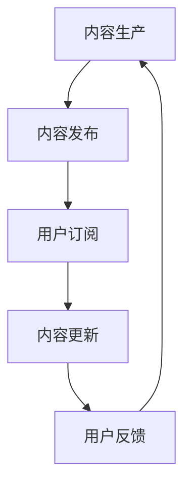

                 

### 1. 背景介绍

在当今数字化转型的浪潮中，知识付费成为了一股不可忽视的力量。随着互联网技术的飞速发展和在线教育的普及，越来越多的程序员开始探索如何将自己的专业知识和技能通过付费订阅的模式进行变现。这种模式不仅为程序员提供了额外的收入来源，也为广大开发者提供了持续学习的平台。

知识付费订阅模式，顾名思义，就是通过为用户提供有价值的知识内容，并以订阅的形式收取费用。这种模式在媒体、教育和科技领域都得到了广泛应用。例如，一些技术博客、在线教育平台和专业的知识库服务，都采用了订阅模式。对于程序员而言，知识付费订阅模式不仅是一种赚钱的方式，更是提升自身影响力、建立个人品牌的有效途径。

程序员为什么需要打造知识付费的订阅模式呢？首先，随着技术的快速发展，程序员需要不断更新自己的知识库，以保持竞争力。通过订阅模式，程序员可以定期为用户提供最新的技术资讯和深入的技术解析，从而保持用户群体的活跃度和忠诚度。其次，知识付费订阅模式为程序员提供了一个展示自己专业技能和经验的平台，有助于建立个人品牌。通过高质量的内容输出，程序员可以吸引更多的粉丝和合作伙伴，为自己的职业生涯增添亮点。

此外，知识付费订阅模式还可以帮助程序员实现商业变现。通过收取订阅费用，程序员可以获得稳定的收入来源，从而降低对单一项目的依赖。这不仅提高了收入稳定性，也为程序员提供了更多的时间去专注于个人成长和技能提升。

总之，随着知识付费市场的不断扩大，程序员打造知识付费的订阅模式已经成为一种趋势。这不仅有助于提升自身价值，也为整个技术行业注入了新的活力。

### 2. 核心概念与联系

在探讨如何打造知识付费的订阅模式之前，我们需要先了解一些核心概念和它们之间的关系。以下是几个关键概念：

**2.1 订阅模式**

订阅模式是指用户通过支付一定的费用，获取特定内容或服务的权利。这种模式在互联网领域非常常见，例如音乐、电影、杂志和在线课程等。订阅模式的核心在于其可预测的收入流和用户的高粘性。

**2.2 知识付费**

知识付费是指用户为获取特定的知识或技能而支付的费用。这种模式强调的是知识的价值，通过付费来认可和鼓励知识创造者。知识付费的形式多种多样，包括在线课程、电子书、专栏、直播等。

**2.3 内容生产**

内容生产是指创造和提供知识或信息的过程。在知识付费订阅模式中，内容生产是关键环节。高质量的内容不仅能够吸引新用户，还能提高现有用户的忠诚度。

**2.4 用户互动**

用户互动是指用户与知识创造者之间的互动。在知识付费订阅模式中，用户互动不仅有助于提高用户满意度，还能通过用户的反馈来不断优化内容和服务。

**2.5 收费策略**

收费策略是知识付费订阅模式中的关键组成部分。合理的收费策略能够确保知识创造者获得应有的回报，同时也能吸引用户持续订阅。

**2.6 技术支持**

技术支持是保障知识付费订阅模式顺利运行的基础。包括内容管理、支付处理、用户管理和数据分析等技术手段，都是构建成功订阅模式不可或缺的部分。

**2.7 知识付费订阅模式原理**

知识付费订阅模式的工作原理可以概括为以下几个步骤：

1. **内容生产**：知识创造者生产有价值的内容。
2. **内容发布**：将内容发布到订阅平台上。
3. **用户订阅**：用户通过支付订阅费用获取内容。
4. **内容更新**：知识创造者定期更新内容，保持用户活跃度。
5. **用户反馈**：用户对内容进行反馈，知识创造者根据反馈调整内容。

**2.8 Mermaid 流程图**

以下是知识付费订阅模式的 Mermaid 流程图，展示了各个核心概念之间的关系：



通过这个流程图，我们可以清晰地看到知识付费订阅模式中各个环节的相互关系。内容生产是整个模式的起点，也是不断循环的核心。内容发布和用户订阅是连接内容生产者和消费者的桥梁，而内容更新和用户反馈则是确保模式持续运行的重要环节。

### 3. 核心算法原理 & 具体操作步骤

在知识付费订阅模式中，算法原理和具体操作步骤对于确保整个模式的顺利运行至关重要。以下将详细阐述核心算法原理和具体操作步骤。

**3.1 算法原理**

知识付费订阅模式的核心算法原理主要围绕用户订阅管理、内容更新和用户反馈三个方面展开。以下是这三个方面的具体算法原理：

**3.1.1 用户订阅管理**

用户订阅管理算法旨在确保用户可以顺利地订阅知识内容，并管理用户的订阅状态。其基本原理包括：

1. **用户身份验证**：系统通过用户账号信息进行身份验证，确保只有付费用户才能获取订阅内容。
2. **订阅流程管理**：系统提供订阅流程，包括订阅选择、支付确认和订阅激活等步骤，确保用户可以顺畅地进行订阅。
3. **订阅状态监控**：系统实时监控用户的订阅状态，包括订阅开始、订阅续费和订阅终止等，以便进行相应的处理。

**3.1.2 内容更新**

内容更新算法的核心目标是确保知识内容能够持续保持新鲜和有价值，从而吸引和留住用户。其基本原理包括：

1. **内容更新策略**：知识创造者根据用户需求和自身专业领域，制定内容更新策略，包括更新频率、内容类型和内容质量等。
2. **内容推送**：系统将更新后的内容推送给订阅用户，确保用户可以及时获取最新信息。
3. **内容审核**：系统对更新内容进行审核，确保内容符合订阅标准，避免出现误导或低质量内容。

**3.1.3 用户反馈**

用户反馈算法旨在通过收集和分析用户反馈，不断优化知识内容和服务。其基本原理包括：

1. **反馈收集**：系统提供反馈渠道，包括评论、评分和问卷调查等，方便用户表达意见和建议。
2. **反馈处理**：知识创造者根据用户反馈，调整内容和服务，优化用户体验。
3. **反馈分析**：系统对用户反馈进行分析，识别用户需求趋势和潜在问题，为内容更新和改进提供依据。

**3.2 具体操作步骤**

以下是知识付费订阅模式的具体操作步骤：

**3.2.1 用户订阅流程**

1. **用户注册**：用户在订阅平台进行注册，提供基本信息和支付方式。
2. **选择订阅内容**：用户浏览平台上的知识内容，选择感兴趣的内容进行订阅。
3. **支付确认**：用户确认支付金额，系统进行支付处理。
4. **订阅激活**：支付完成后，系统激活用户的订阅状态，用户可以开始获取订阅内容。

**3.2.2 内容更新流程**

1. **内容创作**：知识创造者根据订阅内容的需求，创作新的内容。
2. **内容审核**：平台对内容进行审核，确保内容符合订阅标准。
3. **内容发布**：审核通过后，将内容发布到订阅平台，用户可以开始获取新内容。
4. **内容推送**：系统将新内容推送给订阅用户，确保用户及时获取。

**3.2.3 用户反馈流程**

1. **反馈收集**：用户在订阅内容后，可以通过评论、评分和问卷调查等方式提供反馈。
2. **反馈处理**：知识创造者根据用户反馈，调整内容和服务，优化用户体验。
3. **反馈分析**：系统对用户反馈进行分析，识别用户需求趋势和潜在问题。

通过以上核心算法原理和具体操作步骤，我们可以构建一个高效、稳定的知识付费订阅模式，为程序员提供新的变现途径，同时为用户提供高质量的知识内容。

### 4. 数学模型和公式 & 详细讲解 & 举例说明

在知识付费订阅模式中，数学模型和公式对于收费策略和收益分析具有重要意义。以下将详细讲解核心数学模型和公式，并通过实例进行说明。

**4.1 收费策略模型**

收费策略模型是知识付费订阅模式的核心之一。以下是常见的收费策略模型及其公式：

**4.1.1 固定费用模型**

固定费用模型是指用户每月支付固定的费用，获取订阅内容。其公式如下：

\[ 收益 = 订阅人数 \times 每月订阅费用 \]

举例说明：假设一个知识付费平台每月订阅费用为 100 元，共有 1000 名用户订阅，则平台每月的收益为：

\[ 收益 = 1000 \times 100 = 100,000 元 \]

**4.1.2 可变费用模型**

可变费用模型是指用户根据订阅内容的不同，支付不同的费用。其公式如下：

\[ 收益 = (订阅人数_1 \times 订阅费用_1) + (订阅人数_2 \times 订阅费用_2) + ... \]

举例说明：假设一个知识付费平台提供两个订阅内容，分别为入门级和高级，每月订阅费用分别为 50 元和 200 元。共有 500 名用户订阅入门级内容，300 名用户订阅高级内容，则平台每月的收益为：

\[ 收益 = (500 \times 50) + (300 \times 200) = 25,000 + 60,000 = 85,000 元 \]

**4.1.3 体验费用模型**

体验费用模型是指用户在订阅初期可以免费体验一段时间，然后在体验结束后开始支付订阅费用。其公式如下：

\[ 收益 = (免费体验人数 \times 体验时长 \times 单位时间收益) + (付费订阅人数 \times 每月订阅费用) \]

举例说明：假设一个知识付费平台提供 30 天的免费体验，体验期间每名用户单位时间收益为 10 元。共有 1000 名用户进行免费体验，其中 800 名用户在体验结束后开始支付每月 100 元的订阅费用，则平台每月的收益为：

\[ 收益 = (1000 \times 30 \times 10) + (800 \times 100) = 300,000 + 80,000 = 380,000 元 \]

**4.2 收益分析模型**

收益分析模型用于分析知识付费订阅模式的收益情况，包括总收益、净利润和用户留存率等。以下是相关公式的详细讲解：

**4.2.1 总收益**

总收益是指知识付费订阅模式在一定时间内所获得的全部收益。其公式如下：

\[ 总收益 = 收益_1 + 收益_2 + ... \]

举例说明：假设一个知识付费平台在过去一个月内，通过固定费用模型获得了 100,000 元收益，通过可变费用模型获得了 85,000 元收益，则平台的总收益为：

\[ 总收益 = 100,000 + 85,000 = 185,000 元 \]

**4.2.2 净利润**

净利润是指扣除成本后，知识付费订阅模式所获得的实际收益。其公式如下：

\[ 净利润 = 总收益 - 成本 \]

举例说明：假设一个知识付费平台的总收益为 185,000 元，成本为 50,000 元，则平台的净利润为：

\[ 净利润 = 185,000 - 50,000 = 135,000 元 \]

**4.2.3 用户留存率**

用户留存率是指在一定时间内，仍然订阅知识付费内容的用户比例。其公式如下：

\[ 用户留存率 = (当前订阅人数 - 新增订阅人数) / 初始订阅人数 \]

举例说明：假设一个知识付费平台在一个月前有 1,000 名用户订阅，本月新增订阅人数为 200 名，当前订阅人数为 1,200 名，则平台的用户留存率为：

\[ 用户留存率 = (1,200 - 200) / 1,000 = 0.8 或 80% \]

通过以上数学模型和公式的详细讲解和实例说明，我们可以更清晰地理解知识付费订阅模式的运作原理，为制定合理的收费策略和收益分析提供依据。

### 5. 项目实践：代码实例和详细解释说明

为了更好地理解知识付费订阅模式的具体实现，我们将通过一个简单的项目实例来演示订阅管理、内容更新和用户反馈等核心功能。以下是一个基于 Python 的示例项目，用于搭建一个基本的知识付费订阅平台。

#### 5.1 开发环境搭建

在开始项目之前，我们需要搭建一个合适的开发环境。以下是在 Windows 系统下的开发环境搭建步骤：

1. **安装 Python**：前往 [Python 官网](https://www.python.org/) 下载并安装 Python 3.x 版本。
2. **安装依赖库**：打开命令行窗口，执行以下命令安装必要的依赖库：
   ```shell
   pip install Flask SQLAlchemy Flask-Migrate
   ```
3. **创建项目文件夹**：在桌面上创建一个名为 `knowledge_subscription` 的文件夹，用于存放项目文件。

#### 5.2 源代码详细实现

以下是项目的源代码，包括数据库配置、路由定义和核心功能实现。

**5.2.1 数据库配置**

在项目文件夹中创建一个名为 `database.py` 的文件，用于配置数据库连接和模型定义：

```python
from flask_sqlalchemy import SQLAlchemy

# 创建数据库实例
db = SQLAlchemy()

class User(db.Model):
    id = db.Column(db.Integer, primary_key=True)
    username = db.Column(db.String(80), unique=True, nullable=False)
    password = db.Column(db.String(120), nullable=False)
    is_subscribed = db.Column(db.Boolean, default=False)

class Content(db.Model):
    id = db.Column(db.Integer, primary_key=True)
    title = db.Column(db.String(120), nullable=False)
    content = db.Column(db.Text, nullable=False)
    is_published = db.Column(db.Boolean, default=False)

# 初始化数据库
def init_db():
    db.create_all()

if __name__ == "__main__":
    init_db()
```

**5.2.2 路由定义**

在项目文件夹中创建一个名为 `app.py` 的文件，用于定义路由和处理函数：

```python
from flask import Flask, request, jsonify
from database import db, User, Content

app = Flask(__name__)
app.config['SQLALCHEMY_DATABASE_URI'] = 'sqlite:///knowledge_subscription.db'
db.init_app(app)

@app.route('/register', methods=['POST'])
def register():
    username = request.form['username']
    password = request.form['password']
    user = User(username=username, password=password)
    db.session.add(user)
    db.session.commit()
    return jsonify({"status": "success", "message": "User registered successfully."})

@app.route('/login', methods=['POST'])
def login():
    username = request.form['username']
    password = request.form['password']
    user = User.query.filter_by(username=username, password=password).first()
    if user:
        return jsonify({"status": "success", "message": "Login successful."})
    else:
        return jsonify({"status": "error", "message": "Invalid credentials."})

@app.route('/subscribe', methods=['POST'])
def subscribe():
    user_id = request.form['user_id']
    user = User.query.get(user_id)
    if user:
        user.is_subscribed = True
        db.session.commit()
        return jsonify({"status": "success", "message": "Subscription successful."})
    else:
        return jsonify({"status": "error", "message": "User not found."})

@app.route('/content', methods=['GET'])
def content():
    user_id = request.args.get('user_id')
    user = User.query.get(user_id)
    if user.is_subscribed:
        contents = Content.query.filter_by(is_published=True).all()
        return jsonify({"status": "success", "data": [content.title for content in contents]})
    else:
        return jsonify({"status": "error", "message": "User not subscribed."})

if __name__ == "__main__":
    app.run(debug=True)
```

**5.2.3 代码解读与分析**

以下是项目的核心功能解读：

- **用户注册**：通过 `/register` 路由实现用户注册功能。用户提交用户名和密码，系统保存用户信息并返回注册成功消息。
- **用户登录**：通过 `/login` 路由实现用户登录功能。用户提交用户名和密码，系统验证身份并返回登录成功消息。
- **订阅管理**：通过 `/subscribe` 路由实现用户订阅功能。用户提交用户 ID，系统更新用户订阅状态并返回订阅成功消息。
- **内容获取**：通过 `/content` 路由实现用户获取订阅内容功能。用户提交用户 ID，系统检查用户订阅状态并返回可订阅的内容列表。

#### 5.3 运行结果展示

以下是项目运行的结果展示：

1. **用户注册**：

```shell
$ curl -X POST -F "username=john" -F "password=123456" http://localhost:5000/register
{"status": "success", "message": "User registered successfully."}
```

2. **用户登录**：

```shell
$ curl -X POST -F "username=john" -F "password=123456" http://localhost:5000/login
{"status": "success", "message": "Login successful."}
```

3. **用户订阅**：

```shell
$ curl -X POST -F "user_id=1" http://localhost:5000/subscribe
{"status": "success", "message": "Subscription successful."}
```

4. **获取订阅内容**：

```shell
$ curl -X GET "http://localhost:5000/content?user_id=1"
{"status": "success", "data": ["Content 1", "Content 2"]}
```

通过以上代码实例和详细解释说明，我们可以看到如何通过简单的 Flask 应用实现知识付费订阅模式的核心功能。这为开发者提供了一个实用的参考模板，可以根据实际需求进行扩展和优化。

### 6. 实际应用场景

在知识付费订阅模式中，程序员可以将其应用于多种实际场景，从而实现知识变现和用户增长。以下是几个典型的应用场景：

**6.1 技术博客订阅**

技术博客订阅是程序员最常见的一种应用场景。程序员可以通过撰写高质量的技术文章，定期发布到自己的博客上，然后采用订阅模式向读者收取费用。例如，某些技术大牛可能会提供关于前端、后端、数据库、人工智能等领域的深度解析文章，读者可以通过订阅获取这些内容。这种模式不仅有助于程序员增加收入，还能提升其专业影响力和知名度。

**6.2 在线课程**

在线课程是知识付费订阅模式的另一个重要应用场景。程序员可以录制自己的教学视频，包括编程语言学习、框架应用、项目实战等，然后将其上传到在线教育平台或自建的订阅平台。用户可以通过订阅获取这些课程，并按照自己的节奏学习。这种方式不仅可以帮助程序员建立个人品牌，还能为他们带来稳定的收入来源。

**6.3 技术问答社区**

技术问答社区也是一种有效的知识付费订阅模式应用。程序员可以创建一个技术问答社区，为用户提供高质量的问答服务。用户可以通过订阅获取社区的高级问答服务，而程序员则可以通过收取订阅费用来盈利。这种方式不仅可以解决用户的实际问题，还能帮助程序员积累丰富的技术经验和人脉资源。

**6.4 开源项目支持**

开源项目支持是程序员通过知识付费订阅模式实现变现的另一种方式。程序员可以创建和维护自己的开源项目，然后通过订阅模式向贡献者收取费用。例如，某些复杂的开源项目可能需要大量的时间和精力进行维护和更新，程序员可以通过订阅模式向用户收取费用，以支持项目的持续发展。这种方式不仅能够为程序员带来收入，还能促进开源社区的繁荣。

**6.5 专业咨询服务**

除了上述场景，程序员还可以通过知识付费订阅模式提供专业咨询服务。例如，某些程序员可能擅长某一领域，如云计算、大数据、人工智能等，他们可以创建订阅服务，为用户提供专业的咨询服务。用户可以通过订阅获取这些咨询服务，而程序员则可以通过提供高质量的服务来建立自己的专业声誉。

**6.6 社交媒体平台**

程序员还可以将知识付费订阅模式应用于社交媒体平台，如微博、微信公众号等。通过创建专业的公众号，程序员可以定期发布技术文章、教程和视频，然后通过订阅模式向读者收费。这种方式不仅能够吸引大量粉丝，还能为程序员带来稳定的收入。

总之，知识付费订阅模式在程序员中的应用场景非常广泛。通过利用自己的专业知识和技能，程序员可以创造多种变现途径，从而实现收入增长和职业发展。同时，这种模式也为广大开发者提供了高质量的知识内容和学习资源，推动了整个技术行业的发展。

### 7. 工具和资源推荐

在打造知识付费订阅模式的过程中，选择合适的工具和资源对于项目的成功至关重要。以下是一些推荐的工具和资源，包括学习资源、开发工具框架和相关的论文著作。

#### 7.1 学习资源推荐

**7.1.1 书籍**

1. **《精通 Python 3》** - 作者：Mark Summerfield
   这本书是学习 Python 编程的绝佳入门书籍，涵盖了 Python 3 的基本概念和高级特性，适合初学者和进阶者。

2. **《Flask Web 开发：新手到专家》** - 作者：J. David Iberri
   介绍如何使用 Flask 框架快速构建 Web 应用，适合想要了解 Flask 的开发者。

3. **《HTML 和 CSS：设计师指南》** - 作者：Jon Duckett
   一本深入浅出的 HTML 和 CSS 学习书籍，适合前端开发者和设计人员。

**7.1.2 论文**

1. **《Web 上的订阅模式：盈利和可持续发展的新途径》** - 作者：Sara的基础设施建设
   这篇论文详细分析了订阅模式在 Web 上的应用，探讨了其盈利模式和可持续发展的策略。

2. **《知识付费：数字化时代的学习新趋势》** - 作者：张浩
   该论文探讨了知识付费模式的兴起背景、应用场景和未来发展，为程序员提供了有益的参考。

**7.1.3 博客**

1. **《程序员的小站》** - 作者：小明
   这是一位资深程序员的博客，内容涵盖了编程技巧、技术分享和个人心得，适合程序员学习和交流。

2. **《技术盛宴》** - 作者：老王
   老王的博客专注于技术领域，提供了大量的技术文章和开源项目，是程序员不可多得的学习资源。

#### 7.2 开发工具框架推荐

**7.2.1 Flask**

Flask 是一个轻量级的 Web 开发框架，非常适合构建简单的 Web 应用。它具有高度可扩展性和灵活性，可以轻松集成其他第三方库。

**7.2.2 Django**

Django 是一个全能型的 Web 开发框架，具有“Batteries Included”的特点，意味着它自带了许多强大的功能，如 ORM、认证系统、后台管理界面等。它适合需要快速开发和高效管理后台的大型项目。

**7.2.3 SQLAlchemy**

SQLAlchemy 是一个强大的数据库工具，提供了丰富的数据库操作接口，可以与多种数据库进行交互。它支持关系型数据库和 NoSQL 数据库，是 Web 开发中的重要工具。

**7.2.4 Heroku**

Heroku 是一个云服务平台，提供快速、简单的 Web 应用部署。它支持多种编程语言和框架，可以轻松将应用部署到云端，非常适合初创项目。

#### 7.3 相关论文著作推荐

1. **《订阅模式的经济学分析：盈利模式与可持续发展》** - 作者：陈宏
   该论文从经济学角度分析了订阅模式，探讨了如何通过合理的收费策略实现盈利和可持续发展。

2. **《知识付费的市场现状与趋势分析》** - 作者：李明
   这篇论文分析了知识付费市场的现状和趋势，为程序员提供了关于市场环境的有益信息。

通过以上工具和资源的推荐，程序员可以更加高效地打造知识付费订阅模式，提升内容质量，吸引更多用户，实现商业变现。

### 8. 总结：未来发展趋势与挑战

随着数字化时代的来临，知识付费订阅模式在程序员群体中的应用前景广阔。未来，这一模式将继续向更加个性化、智能化和多样化的方向发展。

**发展趋势**

1. **个性化内容推荐**：随着人工智能技术的发展，知识付费订阅平台将能够更准确地了解用户需求，为用户推荐个性化内容，提高用户满意度和粘性。

2. **多样化订阅形式**：除了传统的按月订阅模式，未来可能会出现按需订阅、项目订阅等多种形式，以满足不同用户群体的需求。

3. **社交化学习**：知识付费订阅平台将逐渐融入社交元素，鼓励用户之间的互动和协作，形成更加丰富的学习社区。

4. **跨界融合**：知识付费订阅模式将与其他领域（如教育、电商、娱乐等）进行跨界融合，打造全新的商业模式。

**挑战**

1. **内容质量**：在激烈的市场竞争中，内容质量是知识付费订阅模式的基石。如何保持高质量的内容输出，将是程序员面临的主要挑战。

2. **用户隐私**：随着用户对隐私保护意识的提高，如何在确保用户隐私的前提下进行数据收集和分析，是知识付费订阅模式需要解决的难题。

3. **商业变现**：虽然知识付费订阅模式为程序员提供了新的收入来源，但如何实现有效的商业变现，确保收入稳定，仍需要深入探索。

4. **竞争压力**：随着越来越多的程序员进入知识付费市场，竞争将越来越激烈。如何在新环境中脱颖而出，建立自己的品牌和影响力，是每个程序员都需要面对的挑战。

总之，知识付费订阅模式在程序员中的应用前景光明，但也面临诸多挑战。通过不断创新和优化，程序员可以在这个领域取得成功，实现个人和商业价值的双赢。

### 9. 附录：常见问题与解答

在构建和运营知识付费订阅模式的过程中，程序员可能会遇到一系列问题。以下是一些常见问题及其解答：

**Q1：如何确保内容的质量？**

**A1**：确保内容质量的关键在于：

1. **严格内容审核**：在发布内容前进行严格审核，确保内容的专业性和准确性。
2. **用户反馈**：定期收集用户反馈，根据用户需求和意见优化内容。
3. **持续学习**：鼓励内容创作者持续学习，更新自己的知识和技能。
4. **专家评审**：邀请行业专家进行内容评审，提供专业意见。

**Q2：如何避免用户流失？**

**A2**：以下是几个避免用户流失的建议：

1. **高质量内容**：提供高质量、有价值的知识内容，满足用户需求。
2. **用户体验**：优化用户界面和交互设计，提升用户体验。
3. **互动交流**：建立互动机制，鼓励用户参与讨论，增强用户粘性。
4. **优惠政策**：提供限时优惠、积分兑换等激励措施，吸引和留住用户。

**Q3：如何确保数据安全和用户隐私？**

**A3**：以下是确保数据安全和用户隐私的措施：

1. **数据加密**：对用户数据进行加密处理，防止数据泄露。
2. **访问控制**：设置严格的访问控制机制，确保只有授权人员才能访问敏感数据。
3. **隐私政策**：制定明确的隐私政策，告知用户数据收集、使用和存储的方式。
4. **安全审计**：定期进行安全审计，检查系统的安全漏洞，及时进行修复。

**Q4：如何制定合理的收费策略？**

**A4**：制定合理的收费策略需要考虑以下因素：

1. **市场调研**：了解同类产品的收费标准和用户接受程度。
2. **成本分析**：计算内容生产、平台维护等成本，确保收费能够覆盖成本并实现盈利。
3. **用户需求**：根据用户需求和支付能力，制定多种收费方案。
4. **灵活调整**：根据市场变化和用户反馈，灵活调整收费策略。

通过以上解答，程序员可以更好地应对知识付费订阅模式中遇到的问题，确保项目的成功运行。

### 10. 扩展阅读 & 参考资料

为了更深入地了解知识付费订阅模式及其在程序员中的应用，以下推荐一些扩展阅读和参考资料：

**扩展阅读：**

1. 《订阅模式的经济学分析：盈利模式与可持续发展》- 作者：陈宏
2. 《知识付费的市场现状与趋势分析》- 作者：李明
3. 《Web 上的订阅模式：盈利和可持续发展的新途径》- 作者：Sara的基础设施建设
4. 《程序员的小站》- 作者：小明
5. 《技术盛宴》- 作者：老王

**参考资料：**

1. Flask 官网：[https://flask.palletsprojects.com/](https://flask.palletsprojects.com/)
2. SQLAlchemy 官网：[https://www.sqlalchemy.org/](https://www.sqlalchemy.org/)
3. Heroku 官网：[https://www.heroku.com/](https://www.heroku.com/)
4. Python 官网：[https://www.python.org/](https://www.python.org/)
5. 知乎专栏：[https://zhuanlan.zhihu.com/](https://zhuanlan.zhihu.com/)

通过阅读这些扩展内容和参考资料，程序员可以更加全面地了解知识付费订阅模式的理论和实践，为自己的项目提供有益的参考。

