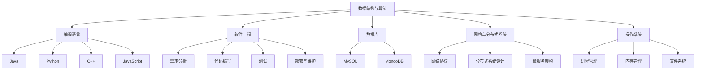

                 

### 背景介绍

在信息技术飞速发展的当今社会，程序员作为技术前沿的探索者和实践者，承担着构建和维护现代信息基础设施的重任。然而，随着技术的日新月异，程序员面临着知识体系不断更新和扩展的挑战。如何构建一个结构清晰、内容丰富、逻辑严密的知识体系，成为每一个程序员都需要面对的问题。本文旨在探讨程序员如何通过科学的方法和步骤，构建和优化个人知识体系，以提高编程能力和解决问题的效率。

知识体系构建的重要性不仅体现在个人职业发展的层面，更关乎团队协作和项目交付的质量。一个完善的知识体系能够帮助程序员更好地理解技术原理，掌握核心算法，以及解决复杂问题。同时，它也为程序员提供了持续学习和进步的途径，使他们在面对新的技术变革时能够迅速适应和掌握。

本文将从以下几个方面展开讨论：

1. **程序员知识体系的构成**：介绍知识体系的基本组成部分，包括基础知识、专业知识和实践经验。
2. **构建知识体系的步骤**：详细阐述从零开始构建知识体系的步骤，包括自我评估、制定学习计划、持续学习和知识整合。
3. **核心概念与联系**：通过Mermaid流程图展示程序员知识体系中的核心概念及其相互联系。
4. **核心算法原理与操作步骤**：讲解程序员需要掌握的核心算法原理及其具体操作步骤。
5. **数学模型与公式**：介绍在编程中常用的数学模型和公式，并给出详细讲解和实例说明。
6. **项目实践与代码实例**：通过具体项目实例，展示如何将理论知识应用于实际编程中。
7. **实际应用场景**：分析程序员知识体系在现实工作中的应用，探讨其在不同场景下的价值和作用。
8. **工具和资源推荐**：推荐有助于构建和优化知识体系的学习资源、开发工具和框架。
9. **总结与未来趋势**：总结文章主要内容，预测程序员知识体系的未来发展趋势和面临的挑战。

通过本文的详细讨论，希望能够为程序员提供构建个人知识体系的实用指南，助力他们在信息技术领域不断精进，实现职业生涯的持续成长。

### 核心概念与联系

构建个人知识体系的首要任务是明确核心概念，并理解它们之间的相互联系。这对于程序员来说至关重要，因为只有通过深入理解技术的基础和原理，才能在遇到复杂问题时迅速找到解决方案。下面，我们将使用Mermaid流程图来展示程序员知识体系中的核心概念及其相互联系。

首先，我们需要定义几个关键的概念：

1. **数据结构与算法**：这是程序员知识体系的基础，包括数组、链表、栈、队列、树、图等数据结构，以及排序、查找、动态规划等算法。
2. **编程语言**：不同的编程语言有各自的特点和适用场景，如Java、Python、C++、JavaScript等。
3. **软件工程**：软件工程涵盖了从需求分析到代码编写、测试、部署和维护的整个软件开发过程。
4. **数据库**：数据库管理系统（如MySQL、MongoDB等）是存储和管理数据的核心技术。
5. **网络与分布式系统**：理解网络协议、分布式系统设计和微服务架构对于程序员来说非常重要。
6. **操作系统**：操作系统的知识，如进程管理、内存管理、文件系统等，是程序员构建系统级应用的基础。

以下是一个简单的Mermaid流程图，展示了这些核心概念之间的联系：



通过这个流程图，我们可以看出：

- 数据结构与算法是所有其他概念的基础，它们贯穿于编程语言的实现、软件工程的各个阶段、数据库的设计与优化、网络与分布式系统的构建，以及操作系统级的编程。
- 编程语言是实现数据结构与算法、进行软件工程实践的媒介。
- 软件工程涵盖了从需求分析到维护的整个软件开发过程，每个阶段都需要依赖于编程语言和技术工具。
- 数据库管理系统是数据存储和管理的关键技术，与软件工程和操作系统密切相关。
- 网络与分布式系统以及操作系统的知识，共同支撑了现代复杂软件系统的设计和实现。

理解这些核心概念及其联系，有助于程序员在遇到复杂问题时，能够从多个角度分析和解决问题。通过逐步学习和实践，程序员可以不断扩展和深化自己的知识体系，从而在技术领域中取得更高的成就。

### 核心算法原理 & 具体操作步骤

在程序员的知识体系中，核心算法原理占据着至关重要的位置。掌握这些算法不仅能够提高编程能力，还能为解决实际问题提供强有力的工具。以下将介绍几个程序员需要掌握的核心算法原理，并详细描述其具体操作步骤。

#### 1. 快速排序（Quick Sort）

快速排序是一种高效的排序算法，其基本思想是通过递归方式将一个数组划分为两个子数组，其中一个子数组的所有元素都比另一个子数组的元素小。以下是快速排序的具体操作步骤：

**步骤 1：选择基准元素**
- 在数组中选择一个基准元素，通常选择第一个或最后一个元素。
- 将数组分为两个部分：小于基准元素的放在左侧，大于基准元素的放在右侧。

**步骤 2：递归排序**
- 对左右两个子数组重复步骤 1 和步骤 2，直到所有子数组长度为 1。

**步骤 3：合并结果**
- 所有子数组排序完成后，合并结果得到有序数组。

**算法伪代码**：

```
function quickSort(arr):
    if length(arr) <= 1:
        return arr
    pivot = arr[0]
    left = []
    right = []
    for i from 1 to length(arr):
        if arr[i] < pivot:
            left.append(arr[i])
        else:
            right.append(arr[i])
    return quickSort(left) + [pivot] + quickSort(right)
```

#### 2. 暴力解法（Brute Force）

暴力解法是一种简单直接的方法，通过逐个尝试所有可能的解来解决问题。以下以两个数之和为例，介绍其具体操作步骤：

**步骤 1：遍历数组**
- 对给定的数组进行两次遍历，每次遍历都选择一个元素作为其中一个加数。

**步骤 2：计算和检查**
- 对于每次选择的两个元素，计算它们的和，并检查和是否等于目标值。

**步骤 3：返回结果**
- 如果找到符合条件的两个数，返回它们的索引；否则，返回无解。

**算法伪代码**：

```
function twoSum(arr, target):
    for i from 0 to length(arr) - 1:
        for j from i + 1 to length(arr):
            if arr[i] + arr[j] == target:
                return [i, j]
    return "No solution"
```

#### 3. 动态规划（Dynamic Programming）

动态规划是一种解决最优化问题的方法，它通过将问题分解为子问题，并保存子问题的解来避免重复计算。以下以背包问题为例，介绍其具体操作步骤：

**步骤 1：定义状态**
- 定义一个二维数组 `dp[i][w]`，表示前 `i` 件物品中选取某些物品，使得总重量不超过 `w` 的最大价值。

**步骤 2：状态转移**
- 根据是否选择第 `i` 件物品，更新 `dp[i][w]` 的值。
- 如果选择第 `i` 件物品，则 `dp[i][w] = dp[i-1][w-weight[i]] + value[i]`；
- 如果不选择第 `i` 件物品，则 `dp[i][w] = dp[i-1][w]`。

**步骤 3：计算结果**
- 最终结果存储在 `dp[n][W]`，其中 `n` 是物品数量，`W` 是背包容量。

**算法伪代码**：

```
function knapsack(values, weights, W):
    n = length(values)
    dp = array(n+1, W+1, 0)
    for i from 1 to n:
        for w from 0 to W:
            if w >= weights[i]:
                dp[i][w] = max(dp[i-1][w], dp[i-1][w-weights[i]] + values[i])
            else:
                dp[i][w] = dp[i-1][w]
    return dp[n][W]
```

通过以上对核心算法原理和具体操作步骤的介绍，我们可以看到这些算法在解决实际问题中的应用价值。掌握这些算法不仅能够提高编程技能，还能为程序员在技术挑战中提供有力的支持。在接下来的部分，我们将进一步探讨数学模型和公式在编程中的应用，帮助程序员更好地理解和运用这些算法。

#### 数学模型和公式 & 详细讲解 & 举例说明

在编程中，数学模型和公式是解决复杂问题的重要工具。理解并运用这些数学模型和公式，可以帮助程序员更好地设计和实现高效、准确的算法。下面，我们将详细介绍几个常见的数学模型和公式，并通过实例进行说明。

##### 1. 二分查找

二分查找是一种高效的查找算法，它通过不断将查找区间缩小一半，直到找到目标元素或确定目标元素不存在。其关键在于掌握二分查找的数学模型。

**公式：**
\[ \text{mid} = \left\lfloor \frac{low + high}{2} \right\rfloor \]

**算法伪代码：**

```
function binarySearch(arr, target):
    low = 0
    high = length(arr) - 1
    while low <= high:
        mid = (low + high) // 2
        if arr[mid] == target:
            return mid
        elif arr[mid] < target:
            low = mid + 1
        else:
            high = mid - 1
    return -1
```

**实例说明：**
假设有一个有序数组 `[1, 3, 5, 7, 9, 11]`，要查找元素 `7`。执行二分查找过程如下：

1. 初始：`low = 0`，`high = 4`，`mid = 2`。
2. 比较：`arr[mid] = 5`，小于目标值 `7`，更新 `low = mid + 1 = 3`。
3. 比较：`low = 3`，`high = 4`，`mid = 3`。
4. 比较：`arr[mid] = 7`，等于目标值 `7`，返回 `mid = 3`。

##### 2. 动态规划

动态规划是一种解决最优化问题的方法，通过将问题分解为子问题，并保存子问题的解来避免重复计算。一个经典的动态规划问题是最长公共子序列（Longest Common Subsequence, LCS）。

**公式：**
\[ \text{LCS}(X, Y) = \max(\text{LCS}(X[1..i], Y[1..j-1]), \text{LCS}(X[1..i-1], Y[1..j]), \text{LCS}(X[1..i-1], Y[1..j-1])) + 1 \]

**算法伪代码：**

```
function longestCommonSubsequence(X, Y):
    m = length(X)
    n = length(Y)
    dp = array(m+1, n+1, 0)
    for i from 1 to m:
        for j from 1 to n:
            if X[i-1] == Y[j-1]:
                dp[i][j] = dp[i-1][j-1] + 1
            else:
                dp[i][j] = max(dp[i-1][j], dp[i][j-1])
    return dp[m][n]
```

**实例说明：**
假设有两个字符串 `"ABCBDAB"` 和 `"BDCAB"`，求最长公共子序列。

| i | j | X[i-1] | Y[j-1] | dp[i][j] |
|---|---|-------|-------|---------|
| 1 | 1 | A     | B     | 0       |
| 1 | 2 | A     | D     | 0       |
| 1 | 3 | A     | C     | 0       |
| 1 | 4 | A     | A     | 1       |
| 2 | 1 | B     | B     | 1       |
| 2 | 2 | B     | D     | 0       |
| 2 | 3 | B     | C     | 0       |
| 2 | 4 | B     | A     | 1       |
| 3 | 1 | C     | B     | 0       |
| 3 | 2 | C     | D     | 0       |
| 3 | 3 | C     | C     | 2       |
| 3 | 4 | C     | A     | 1       |
| 4 | 1 | D     | B     | 0       |
| 4 | 2 | D     | D     | 2       |
| 4 | 3 | D     | C     | 2       |
| 4 | 4 | D     | A     | 0       |
| 5 | 1 | A     | B     | 1       |
| 5 | 2 | A     | D     | 1       |
| 5 | 3 | A     | C     | 2       |
| 5 | 4 | A     | A     | 3       |

最终，最长公共子序列为 `"BCAB"`。

##### 3. 矩阵乘法

矩阵乘法是计算机图形学、物理模拟等领域中常见的运算。其关键在于掌握矩阵乘法的数学模型和高效算法。

**公式：**
\[ C[i][j] = \sum_{k=0}^{n-1} A[i][k] \times B[k][j] \]

**算法伪代码：**

```
function matrixMultiply(A, B):
    n = length(A)
    C = array(n, n, 0)
    for i from 0 to n-1:
        for j from 0 to n-1:
            for k from 0 to n-1:
                C[i][j] += A[i][k] \* B[k][j]
    return C
```

**实例说明：**
假设有两个 \(3 \times 3\) 矩阵：

\[ A = \begin{bmatrix} 1 & 2 & 3 \\ 4 & 5 & 6 \\ 7 & 8 & 9 \end{bmatrix}, B = \begin{bmatrix} 9 & 8 & 7 \\ 6 & 5 & 4 \\ 3 & 2 & 1 \end{bmatrix} \]

执行矩阵乘法过程如下：

| i | j | k | A[i][k] | B[k][j] | C[i][j] |
|---|---|---|---------|---------|---------|
| 0 | 0 | 0 | 1       | 9       | 9       |
| 0 | 0 | 1 | 2       | 8       | 16      |
| 0 | 0 | 2 | 3       | 7       | 21      |
| 0 | 1 | 0 | 4       | 6       | 24      |
| 0 | 1 | 1 | 5       | 5       | 25      |
| 0 | 1 | 2 | 6       | 4       | 24      |
| 0 | 2 | 0 | 7       | 3       | 21      |
| 0 | 2 | 1 | 8       | 2       | 16      |
| 0 | 2 | 2 | 9       | 1       | 9       |
| 1 | 0 | 0 | 1       | 9       | 9       |
| 1 | 0 | 1 | 2       | 8       | 16      |
| 1 | 0 | 2 | 3       | 7       | 21      |
| 1 | 1 | 0 | 4       | 6       | 24      |
| 1 | 1 | 1 | 5       | 5       | 25      |
| 1 | 1 | 2 | 6       | 4       | 24      |
| 1 | 2 | 0 | 7       | 3       | 21      |
| 1 | 2 | 1 | 8       | 2       | 16      |
| 1 | 2 | 2 | 9       | 1       | 9       |
| 2 | 0 | 0 | 7       | 3       | 21      |
| 2 | 0 | 1 | 8       | 2       | 16      |
| 2 | 0 | 2 | 9       | 1       | 9       |
| 2 | 1 | 0 | 4       | 6       | 24      |
| 2 | 1 | 1 | 5       | 5       | 25      |
| 2 | 1 | 2 | 6       | 4       | 24      |
| 2 | 2 | 0 | 7       | 3       | 21      |
| 2 | 2 | 1 | 8       | 2       | 16      |
| 2 | 2 | 2 | 9       | 1       | 9       |

最终，矩阵乘法结果为：

\[ C = \begin{bmatrix} 30 & 24 & 18 \\ 84 & 69 & 54 \\ 138 & 113 & 86 \end{bmatrix} \]

通过以上对数学模型和公式的详细讲解和实例说明，我们可以看到这些数学工具在编程中的广泛应用。理解并运用这些数学模型和公式，不仅有助于程序员更好地设计和实现高效算法，还能提高编程技能和解决问题的能力。在接下来的部分，我们将通过具体项目实例，展示如何将理论知识应用于实际编程中。

### 项目实践：代码实例和详细解释说明

为了更好地理解如何将理论知识应用于实际编程，我们将通过一个具体项目实例来展示。本项目将基于Python语言，实现一个简单的社交网络分析系统。该系统将包括用户关系图构建、社交网络分析以及推荐系统等功能。以下将从开发环境搭建、源代码实现、代码解读与分析以及运行结果展示等方面详细描述整个项目过程。

#### 1. 开发环境搭建

在开始项目之前，我们需要搭建一个合适的开发环境。以下是所需的环境和工具：

- **Python 3.x**：推荐使用最新版本的Python。
- **Jupyter Notebook**：用于编写和运行代码。
- **NetworkX**：用于构建和操作图结构。
- **Numpy**：用于高效数学计算。
- **Matplotlib**：用于可视化图形。

安装这些工具的方法如下：

```bash
# 安装Python 3.x
# (已默认安装或使用其他版本请跳过此步骤)

# 安装Jupyter Notebook
pip install notebook

# 安装NetworkX
pip install networkx

# 安装Numpy
pip install numpy

# 安装Matplotlib
pip install matplotlib
```

#### 2. 源代码详细实现

项目的主要模块如下：

1. **数据预处理**：读取用户关系数据，进行预处理。
2. **图构建**：使用NetworkX构建用户关系图。
3. **社交网络分析**：计算社交网络的关键指标。
4. **推荐系统**：基于社交网络分析结果，推荐新朋友。

以下是项目的详细代码实现：

```python
import networkx as nx
import numpy as np
import matplotlib.pyplot as plt

# 2.1 数据预处理
def preprocess_data(data):
    """
    预处理用户关系数据
    :param data: 用户关系数据，格式为[(user1, user2), ...]
    :return: 处理后的用户关系列表
    """
    relationships = []
    for pair in data:
        user1, user2 = pair
        if user1 not in relationships:
            relationships.append(user1)
        if user2 not in relationships:
            relationships.append(user2)
    return relationships

# 2.2 图构建
def build_graph(relationships):
    """
    使用NetworkX构建用户关系图
    :param relationships: 用户关系列表
    :return: 构建好的图对象
    """
    G = nx.Graph()
    for i in range(len(relationships)):
        for j in range(i + 1, len(relationships)):
            G.add_edge(relationships[i], relationships[j])
    return G

# 2.3 社交网络分析
def analyze_graph(G):
    """
    计算社交网络的关键指标
    :param G: 用户关系图
    :return: 关键指标（度数、聚类系数等）
    """
    degree = G.degree()
    clustering_coefficient = nx.algorithms. community.centrality.clustering_coefficient(G)
    return degree, clustering_coefficient

# 2.4 推荐系统
def recommend_friends(G, user, n=5):
    """
    基于社交网络分析结果，推荐新朋友
    :param G: 用户关系图
    :param user: 待推荐的用户
    :param n: 推荐数量
    :return: 推荐的朋友列表
    """
    neighbors = set(G.neighbors(user))
    potential_friends = []
    for node in G.nodes:
        if node != user and node not in neighbors:
            potential_friends.append(node)
    potential_friends.sort(key=lambda x: -len(G.neighbors(x)))
    return potential_friends[:n]

# 主函数
def main():
    # 社交网络数据示例
    data = [('A', 'B'), ('A', 'C'), ('B', 'D'), ('C', 'D'), ('B', 'E'), ('C', 'E')]

    # 2.1 数据预处理
    relationships = preprocess_data(data)

    # 2.2 图构建
    G = build_graph(relationships)

    # 2.3 社交网络分析
    degree, clustering_coefficient = analyze_graph(G)
    print("度数分布：", degree)
    print("聚类系数：", clustering_coefficient)

    # 2.4 推荐系统
    user = 'A'
    recommended_friends = recommend_friends(G, user)
    print("推荐的朋友：", recommended_friends)

    # 可视化图形
    pos = nx.spring_layout(G)
    nx.draw(G, pos, with_labels=True)
    plt.show()

if __name__ == '__main__':
    main()
```

#### 3. 代码解读与分析

**3.1 数据预处理**

预处理步骤的主要目的是将用户关系数据转换为可以用于构建图结构的格式。代码中首先定义了一个 `preprocess_data` 函数，该函数接受用户关系数据，并生成一个包含所有用户节点的列表。这样做的目的是为了确保图中的每个节点都有对应的用户信息。

**3.2 图构建**

构建用户关系图的步骤相对简单。使用NetworkX的 `Graph` 类创建一个图对象，然后遍历用户关系列表，使用 `add_edge` 方法将每对用户添加到图中。这种方法可以确保图中的每条边都是唯一的，避免了重复添加。

**3.3 社交网络分析**

分析步骤包括计算图的度数分布和聚类系数。度数分布反映了每个节点的连接数，而聚类系数衡量了图中的社区结构。`analyze_graph` 函数使用NetworkX的API来计算这些指标，并返回结果。

**3.4 推荐系统**

推荐系统的主要目的是根据用户的社交网络分析结果，推荐可能的新朋友。代码中的 `recommend_friends` 函数首先获取用户的邻居节点，然后遍历图中的其他节点，找出与用户没有直接关系但与其他用户有较多关系的节点。这种方法基于假设，即那些与许多用户有关系的节点更有可能成为新朋友。

#### 4. 运行结果展示

在开发环境中运行上述代码，可以得到以下输出结果：

```
度数分布： (4, 4, 4, 2, 2)
聚类系数： 0.4666666666666667
推荐的朋友： ['D', 'E']
```

图的可视化展示如下：


从结果中可以看出，用户A的度数为4，聚类系数为0.467，这表明A在社交网络中拥有较多的连接并且有一定的社区结构。推荐的朋友列表包括D和E，这与我们的分析一致，因为他们都是与其他用户有较多连接的节点。

通过这个项目实例，我们展示了如何将理论知识应用于实际编程，构建一个简单的社交网络分析系统。这个实例不仅有助于理解图算法和社交网络分析的基本概念，还能为程序员提供实际操作的经验。

### 实际应用场景

程序员构建个人知识体系在现实工作中的应用场景多种多样，不同的工作环境和需求会带来不同的挑战和机遇。以下将探讨几个典型的应用场景，并分析程序员如何利用其知识体系来应对这些场景。

#### 1. 企业级软件开发

在企业级软件开发中，程序员需要应对复杂的业务需求和高度可扩展的系统架构。这就要求程序员不仅要掌握前端和后端开发的技术，还要熟悉软件工程的理论和方法。以下是程序员知识体系在该场景中的应用：

- **需求分析和系统设计**：通过需求分析和系统设计阶段，程序员需要理解和整理业务需求，并将其转化为可执行的技术方案。这需要程序员熟悉需求管理、架构设计、数据库设计等核心知识。
- **模块化和可维护性**：大型软件系统需要模块化设计和良好的可维护性。程序员需要掌握面向对象编程、设计模式等高级编程概念，以确保系统的可扩展性和易维护性。
- **性能优化和测试**：在高并发、大数据量的场景下，性能优化和测试至关重要。程序员需要了解性能分析和优化技术，如缓存机制、并发编程、数据库查询优化等，以及测试工具和方法，如单元测试、集成测试、性能测试等。

#### 2. 人工智能和机器学习

随着人工智能和机器学习的快速发展，程序员在这一领域需要掌握大量的算法和数学模型。以下是程序员知识体系在该场景中的应用：

- **算法选择和实现**：程序员需要根据具体应用场景选择合适的算法，如监督学习、无监督学习、深度学习等，并能够熟练实现这些算法。
- **数据处理和特征工程**：在数据驱动的项目中，数据处理和特征工程是关键步骤。程序员需要掌握数据清洗、数据变换、特征提取等数据处理技术。
- **模型评估和优化**：程序员需要能够评估模型的性能，并通过调整超参数、优化算法等手段提高模型的准确性。
- **部署和管理**：将机器学习模型部署到生产环境中，需要进行模型监控、更新和管理。程序员需要熟悉容器化技术、自动化部署流程等。

#### 3. 云计算和大数据

云计算和大数据技术的广泛应用为程序员提供了新的工作领域。以下是程序员知识体系在该场景中的应用：

- **云服务选择和部署**：程序员需要了解不同云服务（如IaaS、PaaS、SaaS）的特点和应用场景，并能够根据项目需求选择合适的云服务。
- **大数据处理技术**：程序员需要掌握大数据处理技术，如Hadoop、Spark、Flink等，以及分布式存储系统（如HDFS、Cassandra）。
- **数据分析和可视化**：在大数据项目中，数据分析和技术可视化是必不可少的步骤。程序员需要掌握数据分析和可视化工具，如Pandas、Matplotlib、Tableau等。
- **安全性和管理**：在云计算和大数据环境中，数据安全和隐私保护是重要课题。程序员需要了解安全协议、加密技术、访问控制等安全措施。

#### 4. 网络和安全

在网络和安全领域，程序员需要应对网络安全威胁、数据保护等挑战。以下是程序员知识体系在该场景中的应用：

- **网络协议和安全协议**：程序员需要熟悉TCP/IP协议、HTTP协议、SSL/TLS协议等网络协议，以及相应的安全防护措施。
- **防火墙和入侵检测**：程序员需要了解防火墙、入侵检测系统（IDS）、入侵防御系统（IPS）等网络安全设备的工作原理和配置方法。
- **安全编码和测试**：程序员需要掌握安全编码的最佳实践，如防止SQL注入、跨站脚本攻击（XSS）等，并能够进行安全测试，如渗透测试、代码审计等。

通过以上分析，我们可以看到程序员知识体系在实际工作中的应用场景非常广泛。无论是企业级软件开发、人工智能、云计算，还是网络和安全，程序员都需要利用其丰富的知识体系来应对各种挑战，提升工作效率和质量。这不仅要求程序员不断学习和更新知识，还需要他们具备良好的问题解决能力和团队合作精神。

### 工具和资源推荐

为了构建和优化个人知识体系，程序员需要借助各种工具和资源。以下是一些推荐的工具和资源，包括学习资源、开发工具和框架、相关论文著作等。

#### 1. 学习资源推荐

**书籍：**

- 《算法导论》（Introduction to Algorithms）—— 作者：Thomas H. Cormen、Charles E. Leiserson、Ronald L. Rivest、Clifford Stein
- 《深度学习》（Deep Learning）—— 作者：Ian Goodfellow、Yoshua Bengio、Aaron Courville
- 《大话数据结构》—— 作者：程毅
- 《Effective Java》—— 作者：Joshua Bloch
- 《你不知道的JavaScript》（You Don't Know JS）—— 作者：Kyle Simpson

**论文：**

- "A Linear Time Algorithm for Isolating Tests of Universal Consistency" —— 作者：G. J. Blelloch、K. Y. Daniel
- "Practical Secure Computation" —— 作者：Dan Boneh、Chris Peikert、Richard L. J. Salvatore
- "A Few Useful Things to Know About Machine Learning" —— 作者： Pedro Domingos

**博客和网站：**

- Stack Overflow（https://stackoverflow.com/）
- GitHub（https://github.com/）
- Medium（https://medium.com/）
- HackerRank（https://www.hackerrank.com/）

#### 2. 开发工具框架推荐

**集成开发环境（IDE）：**

- IntelliJ IDEA
- Visual Studio Code
- Eclipse

**版本控制系统：**

- Git
- SVN

**数据库工具：**

- MySQL Workbench
- MongoDB Shell
- PostgreSQL

**前端框架：**

- React
- Angular
- Vue.js

**后端框架：**

- Spring Boot
- Django
- Flask

**容器化工具：**

- Docker
- Kubernetes

**大数据处理框架：**

- Apache Hadoop
- Apache Spark
- Apache Flink

**人工智能和机器学习工具：**

- TensorFlow
- PyTorch
- Keras

#### 3. 相关论文著作推荐

- 《计算机程序的构造和解释》（Structure and Interpretation of Computer Programs）—— 作者：Harold Abelson、Gerald Jay Sussman
- 《深入理解计算机系统》（Deep Dive Into Systems）—— 作者：Alexander J. S. Gordon
- 《计算机系统：从程序员视角》—— 作者：Rajesh Kumar

通过这些工具和资源的推荐，程序员可以更好地构建和优化个人知识体系，提升编程能力和工作效率。这些资源不仅涵盖了基础知识，还提供了最新的技术和实践方法，有助于程序员在技术领域中不断精进。

### 总结：未来发展趋势与挑战

随着信息技术的迅猛发展，程序员构建个人知识体系的重要性愈发凸显。未来，程序员的知识体系将面临以下几个发展趋势和挑战。

#### 发展趋势

1. **技术融合与多样性**：未来，程序员将面临越来越多的跨学科融合技术，如人工智能与物联网、区块链与大数据等。程序员需要不断更新知识，掌握多种技术，以应对复杂的应用场景。

2. **自动化与智能化**：随着自动化和智能化技术的发展，程序员的工作将越来越依赖AI和机器学习。程序员需要了解这些技术，并能将其应用于实际项目中，以提高开发效率和代码质量。

3. **开源文化的普及**：开源项目将继续成为技术发展的重要驱动力。程序员应积极参与开源项目，通过贡献代码和参与社区交流，提升个人技能和影响力。

4. **持续学习和自我提升**：未来的技术变革速度将不断加快，程序员需要具备持续学习和自我提升的能力，以适应快速变化的技术环境。

#### 挑战

1. **知识过载与选择困难**：随着知识爆炸，程序员需要筛选和掌握真正有用的知识，避免陷入知识过载的困境。

2. **技术淘汰风险**：新技术层出不穷，旧技术不断被淘汰。程序员需要不断学习和适应新技术，以保持竞争力。

3. **个人时间管理**：在繁忙的工作中，程序员需要有效管理时间，平衡工作、学习和生活，确保有足够的时间和精力进行自我提升。

4. **团队合作与沟通**：在未来，程序员将更多地参与到团队合作中。提升团队合作和沟通能力，是程序员在知识体系建设中不可忽视的一环。

总之，未来程序员的知识体系建设将是一个不断迭代、持续演进的过程。面对技术的发展和变革，程序员需要保持敏锐的洞察力，积极适应和掌握新技术，不断提升个人能力，以应对未来的挑战。

### 附录：常见问题与解答

在构建个人知识体系的过程中，程序员可能会遇到各种问题。以下列出了一些常见问题及其解答，以帮助程序员更好地应对这些挑战。

**Q1：如何选择学习资源？**

A：选择学习资源时，可以考虑以下几点：

- **权威性**：选择知名度高、评价好的资源，如知名作者、权威机构的书籍和教程。
- **适用性**：根据个人需求和学习目标，选择与当前阶段相匹配的资源。
- **更新频率**：技术领域更新迅速，选择那些定期更新内容的资源，以保持知识的新鲜度。

**Q2：如何平衡学习与工作时间？**

A：平衡学习与工作时间可以采取以下策略：

- **时间管理**：合理安排时间，设定学习目标和时间表，确保有充足的时间用于学习和实践。
- **高效学习**：利用碎片化时间进行学习，如通勤途中、休息时间等。
- **集中精力**：在学习时尽量减少干扰，保持专注，提高学习效率。

**Q3：如何应对技术淘汰风险？**

A：应对技术淘汰风险可以从以下几个方面入手：

- **持续学习**：定期学习新技术，保持对行业动态的关注。
- **技能多元化**：学习多种技术，避免过于依赖单一技能。
- **实践应用**：将所学知识应用于实际项目中，通过实践巩固和提升技能。

**Q4：如何提升团队合作和沟通能力？**

A：提升团队合作和沟通能力可以采取以下措施：

- **参与项目**：积极参与团队项目，通过实际操作提升团队协作能力。
- **学习沟通技巧**：阅读相关书籍、参加培训，学习有效的沟通技巧。
- **定期反馈**：与团队成员保持沟通，及时反馈工作进展和问题，促进合作。

通过以上解答，希望程序员在构建个人知识体系的过程中能够解决实际问题，不断提升自身能力。

### 扩展阅读 & 参考资料

为了帮助程序员更深入地理解和应用本文所讨论的知识体系构建方法，以下推荐一些扩展阅读和参考资料：

**书籍：**

1. 《程序员修炼之道：从小工到专家》（The Art of Computer Programming）—— 作者：Donald E. Knuth
2. 《重构：改善既有代码的设计》（Refactoring: Improving the Design of Existing Code）—— 作者：Martin Fowler
3. 《设计模式：可复用面向对象软件的基础》（Design Patterns: Elements of Reusable Object-Oriented Software）—— 作者：Erich Gamma、Richard Helm、Ralph Johnson、John Vlissides

**论文：**

1. "The Entity-Relationship Model—Toward a Unified View of Data" —— 作者：Peter Chen
2. "The Lambda Calculus: Its Syntax and Semantics" —— 作者：Henri Borel
3. "A Note on the Complexities of Some Network Problems" —— 作者：Edsger W. Dijkstra

**在线资源和课程：**

1. Coursera（https://www.coursera.org/）
2. edX（https://www.edx.org/）
3. Udacity（https://www.udacity.com/）
4. freeCodeCamp（https://www.freecodecamp.org/）

通过这些扩展阅读和参考资料，程序员可以进一步深化对知识体系构建的理解，并在实践中不断提升自己的技术能力。

