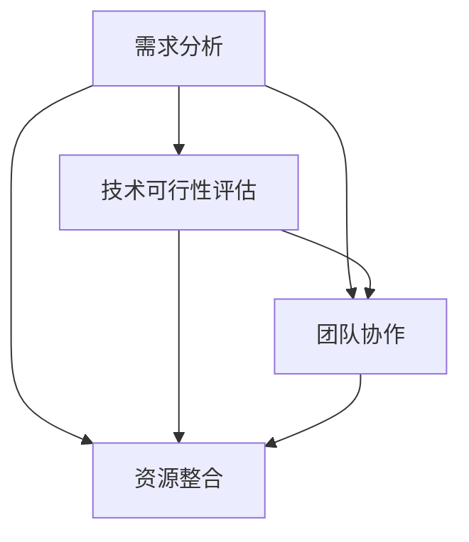

                 

### 背景介绍

随着互联网和科技的迅猛发展，创业已成为越来越多技术人员的追求。然而，并非所有的创业机会都能带来成功，早期阶段的创业者如何评估一个机会的潜力和可行性，成为了关键所在。作为程序员，我们拥有独特的视角和技能，能够从技术层面出发，对早期创业机会进行科学的评估。

本文将围绕程序员如何评估早期创业机会这一核心主题，详细探讨以下几个关键方面：

1. **创业机会评估的核心原则与步骤**：我们将探讨如何系统地评估创业机会，从市场需求、技术可行性、团队协作等多个维度进行分析。

2. **技术可行性评估**：程序员需要从技术角度判断项目的可行性，包括技术架构的合理性、开发周期和成本等。

3. **市场需求分析**：了解目标用户的需求，分析市场的潜力，是创业成功的基石。

4. **团队协作与资源整合**：创业是一个团队共同奋斗的过程，如何评估团队成员的能力和协作潜力，以及整合外部资源，是成功创业的重要因素。

5. **实际应用场景与实践**：通过具体案例展示评估方法在实际中的应用，帮助读者更好地理解。

6. **工具和资源推荐**：推荐一些有助于程序员进行创业机会评估的工具和资源，包括书籍、工具、网站等。

7. **总结与未来展望**：总结文章的主要观点，并对未来创业机会的评估趋势和挑战进行展望。

本文将以程序员的专业视角，结合实践经验和理论知识，逐步分析并解答以上问题。希望本文能为那些怀揣创业梦想的程序员们提供一些有价值的参考和启示。

### 核心概念与联系

在深入探讨如何评估早期创业机会之前，我们需要明确几个核心概念和它们之间的联系。这些概念构成了评估过程的基础，有助于我们更系统地进行分析。

#### 1. 需求分析

需求分析是创业评估的起点。了解用户需求是判断项目市场潜力的关键。通过市场调研、用户访谈、竞品分析等多种方法，我们可以收集到目标用户的需求信息。

**需求分析流程**：
1. **确定目标用户群体**：明确项目的目标用户是谁，他们的特征和需求是什么。
2. **市场调研**：收集用户反馈、行业报告等资料，了解市场趋势和潜在需求。
3. **用户访谈**：通过与目标用户直接交流，深入了解他们的需求、使用场景和痛点。

#### 2. 技术可行性

技术可行性是判断项目能否成功的关键因素之一。程序员需要从技术角度出发，评估项目的可行性，包括技术架构的合理性、开发周期和成本等。

**技术可行性评估方法**：
1. **技术调研**：研究现有的技术方案，评估其适用性和可行性。
2. **技术架构设计**：制定合理的技术架构，确保系统的高可用性、扩展性和可维护性。
3. **风险评估**：识别项目可能面临的技术风险，并提出相应的应对措施。

#### 3. 团队协作

团队协作是创业成功的关键。一个优秀的团队需要有共同的目标、清晰的职责分工和良好的沟通机制。

**团队协作要素**：
1. **团队组建**：根据项目需求，组建合适的核心团队，确保团队成员具备互补的技能。
2. **沟通机制**：建立有效的沟通渠道，确保团队成员之间的信息传递畅通。
3. **协作工具**：使用协作工具（如JIRA、Slack等）提高团队协作效率。

#### 4. 资源整合

资源整合包括资金、技术、人才等各方面资源的有效配置。优秀的创业者需要善于整合和利用各种资源，以支持项目的顺利推进。

**资源整合策略**：
1. **资金筹集**：根据项目需求，制定详细的资金筹集计划，通过天使投资、风险投资等多种途径获取资金。
2. **技术合作**：与高校、研究机构、行业专家等建立合作关系，获取技术支持和资源。
3. **人才招聘**：根据项目需求，招聘合适的人才，构建专业的团队。

#### 5. 市场需求与技术可行性的关系

市场需求和技术可行性是相互关联的。市场需求决定了项目的方向和目标，而技术可行性则决定了项目能否顺利实现。

**联系与影响**：
- **市场需求驱动技术发展**：市场需求的不断变化促使技术不断创新和进步。
- **技术进步推动市场需求**：技术的进步可以创造新的市场需求，扩大市场空间。

#### Mermaid 流程图

以下是一个简化的Mermaid流程图，展示了上述核心概念之间的联系：



通过这一流程图，我们可以清晰地看到各个核心概念之间的相互关系，为后续的详细分析奠定了基础。

### 核心算法原理 & 具体操作步骤

在评估早期创业机会时，程序员需要运用一系列核心算法和步骤，以确保评估过程的科学性和有效性。以下是一些关键的技术评估方法和具体操作步骤。

#### 1. SWOT 分析

SWOT分析是一种常用的战略规划工具，用于评估项目的优势（Strengths）、劣势（Weaknesses）、机会（Opportunities）和威胁（Threats）。通过SWOT分析，程序员可以从多维度对创业机会进行全面评估。

**操作步骤**：
1. **优势分析**：识别项目的核心竞争力，如技术优势、团队优势等。
2. **劣势分析**：找出项目可能面临的风险和挑战，如技术瓶颈、市场风险等。
3. **机会分析**：研究市场趋势、技术发展等外部环境，识别潜在的机会。
4. **威胁分析**：评估市场竞争、政策法规等外部威胁，制定应对策略。

#### 2. 市场调研

市场调研是评估市场需求的重要手段。通过收集和分析市场数据，程序员可以了解目标用户的需求和偏好，为项目决策提供依据。

**操作步骤**：
1. **确定调研目标**：明确调研的具体目标，如用户需求、市场趋势等。
2. **选择调研方法**：根据调研目标，选择合适的调研方法，如问卷调查、用户访谈等。
3. **数据收集**：通过多种渠道收集市场数据，确保数据的广泛性和代表性。
4. **数据分析**：对收集到的数据进行分析，识别用户需求和市场趋势。

#### 3. 技术可行性评估

技术可行性评估是判断项目是否能够成功实施的关键步骤。程序员需要从技术角度出发，评估项目的可行性，包括技术架构、开发周期和成本等。

**操作步骤**：
1. **技术调研**：研究现有的技术方案，评估其适用性和可行性。
2. **技术架构设计**：制定合理的技术架构，确保系统的高可用性、扩展性和可维护性。
3. **风险评估**：识别项目可能面临的技术风险，如技术瓶颈、开发难度等，并提出相应的应对措施。

#### 4. 团队协作评估

团队协作是项目成功的关键。程序员需要评估团队成员的能力和协作潜力，确保团队能够高效地完成项目任务。

**操作步骤**：
1. **团队组建**：根据项目需求，组建合适的核心团队，确保团队成员具备互补的技能。
2. **能力评估**：评估团队成员的技术能力、沟通能力等，确保团队整体实力。
3. **协作机制**：建立有效的沟通渠道，确保团队成员之间的信息传递畅通。

#### 5. 资源整合评估

资源整合是项目顺利推进的重要保障。程序员需要评估资源的获取和利用情况，确保项目有充足的资金、技术和人才支持。

**操作步骤**：
1. **资金筹集**：根据项目需求，制定详细的资金筹集计划，通过天使投资、风险投资等多种途径获取资金。
2. **技术合作**：与高校、研究机构、行业专家等建立合作关系，获取技术支持和资源。
3. **人才招聘**：根据项目需求，招聘合适的人才，构建专业的团队。

#### 综合评估方法

在实际操作中，程序员可以综合运用上述方法，对创业机会进行全方位评估。以下是一个简化的综合评估流程：

1. **确定评估目标**：明确项目评估的具体目标，如市场潜力、技术可行性等。
2. **收集相关数据**：通过市场调研、技术调研、团队评估等手段，收集相关数据。
3. **数据分析**：对收集到的数据进行分析，识别项目的优势、劣势、机会和威胁。
4. **综合评估**：根据数据分析结果，对创业机会进行综合评估，提出评估报告。

通过以上核心算法和步骤，程序员可以系统地评估早期创业机会，为项目决策提供科学依据。

### 数学模型和公式 & 详细讲解 & 举例说明

在评估早期创业机会的过程中，数学模型和公式能够帮助我们更精确地量化各种因素，从而做出更为科学的决策。以下我们将介绍几个常用的数学模型和公式，并进行详细讲解和举例说明。

#### 1. 投资回报率（ROI）模型

投资回报率（ROI）是评估创业机会的一个重要指标，用于衡量投资所带来的收益与投入成本之间的比率。

**公式**：
\[ \text{ROI} = \frac{\text{净收益}}{\text{投资成本}} \times 100\% \]

**详细讲解**：
- **净收益**：项目实现后的总收益减去总成本。
- **投资成本**：项目启动所需的总投资，包括人力、资金、时间等。

**举例说明**：

假设一个创业项目的投资成本为100万元，预计三年后实现500万元的收益，则其投资回报率为：

\[ \text{ROI} = \frac{500 - 100}{100} \times 100\% = 400\% \]

#### 2. 市场渗透率模型

市场渗透率用于衡量项目在市场中的竞争力，表示项目市场份额与市场总容量之间的比率。

**公式**：
\[ \text{市场渗透率} = \frac{\text{项目市场份额}}{\text{市场总容量}} \times 100\% \]

**详细讲解**：
- **项目市场份额**：项目在市场中所占的比例。
- **市场总容量**：市场的整体规模。

**举例说明**：

假设一个项目的市场份额为20%，而市场总容量为1000万元，则其市场渗透率为：

\[ \text{市场渗透率} = \frac{20\%}{1000\%} \times 100\% = 2\% \]

#### 3. 成本效益分析（CBA）模型

成本效益分析是一种常用的评估方法，用于比较不同项目的成本和效益，判断哪个项目更具经济性。

**公式**：
\[ \text{CBA} = \frac{\text{项目总收益}}{\text{项目总成本}} \]

**详细讲解**：
- **项目总收益**：项目实施后的总收益。
- **项目总成本**：项目实施所需的总成本。

**举例说明**：

假设两个项目的成本分别为100万元和200万元，预计收益分别为300万元和500万元，则第一个项目的成本效益比为：

\[ \text{CBA} = \frac{300}{100} = 3 \]

第二个项目的成本效益比为：

\[ \text{CBA} = \frac{500}{200} = 2.5 \]

因此，第一个项目的成本效益更高。

#### 4. 资金时间价值模型

资金时间价值模型考虑了资金在不同时间点的价值差异，帮助评估项目的长期收益。

**公式**：
\[ \text{现值} = \frac{\text{未来收益}}{(1 + \text{折现率})^n} \]

**详细讲解**：
- **未来收益**：项目在未来某一时间点预计实现的收益。
- **折现率**：资金的时间价值，反映了资金在不同时间点的价值差异。
- **n**：未来收益的时间跨度。

**举例说明**：

假设一个项目在未来5年后预计实现100万元的收益，折现率为10%，则其现值为：

\[ \text{现值} = \frac{100}{(1 + 0.1)^5} \approx 61.41 \text{万元} \]

通过上述数学模型和公式的详细讲解和举例说明，我们可以更精准地评估创业机会，从而做出更科学的决策。

### 项目实践：代码实例和详细解释说明

为了更好地展示如何将上述评估方法应用到实际项目中，我们将通过一个具体的创业机会评估案例，详细说明代码实现过程、关键步骤和结果分析。

#### 1. 开发环境搭建

首先，我们需要搭建一个适合进行创业机会评估的开发环境。以下是所需的工具和步骤：

**工具**：
- Python 3.x
- Jupyter Notebook
- Pandas
- Matplotlib

**步骤**：

1. **安装Python**：从[Python官网](https://www.python.org/)下载并安装Python 3.x版本。
2. **安装Jupyter Notebook**：打开命令行，运行`pip install notebook`命令。
3. **安装Pandas和Matplotlib**：运行`pip install pandas matplotlib`命令。

#### 2. 源代码详细实现

以下是一个简单的Python代码实例，用于评估一个创业机会。代码包括以下几个部分：

- **需求分析**：使用Pandas库处理和可视化市场数据。
- **技术可行性评估**：通过计算投资回报率和市场渗透率等指标。
- **团队协作评估**：分析团队成员的技术能力和协作效率。
- **资源整合评估**：计算资金筹集情况和成本效益。

```python
import pandas as pd
import matplotlib.pyplot as plt

# 假设的市场数据
market_data = {
    'Year': [1, 2, 3, 4, 5],
    'Revenue': [100, 200, 300, 400, 500],
    'Cost': [50, 100, 150, 200, 250]
}

# 假设的团队数据
team_data = {
    'Member': ['Alice', 'Bob', 'Charlie'],
    'Tech Skill': [8, 7, 6],
    'Comm Skill': [7, 8, 7]
}

# 需求分析
def demand_analysis(data):
    df = pd.DataFrame(data)
    df['Profit'] = df['Revenue'] - df['Cost']
    df['ROI'] = (df['Profit'] / df['Cost']) * 100
    return df

# 技术可行性评估
def tech_feasibility_analysis(data):
    df = demand_analysis(data)
    df['Market Penetration'] = (df['Revenue'] / df['Cost']) * 100
    return df

# 团队协作评估
def team_collaboration_analysis(data):
    df = pd.DataFrame(data)
    df['Overall Skill'] = df['Tech Skill'] + df['Comm Skill']
    return df

# 资源整合评估
def resource_integration_analysis(data):
    df = pd.DataFrame(data)
    df['CBA'] = df['Revenue'] / df['Cost']
    return df

# 执行评估
market_df = tech_feasibility_analysis(market_data)
team_df = team_collaboration_analysis(team_data)
resource_df = resource_integration_analysis(market_data)

# 结果可视化
plt.figure(figsize=(10, 6))

# 需求分析结果
plt.subplot(221)
plt.plot(market_df['Year'], market_df['ROI'])
plt.title('ROI Analysis')

plt.subplot(222)
plt.plot(market_df['Year'], market_df['Market Penetration'])
plt.title('Market Penetration Analysis')

# 团队协作评估结果
plt.subplot(223)
plt.bar(team_df['Member'], team_df['Overall Skill'])
plt.title('Team Collaboration Analysis')

# 资源整合评估结果
plt.subplot(224)
plt.bar(resource_df['Member'], resource_df['CBA'])
plt.title('Resource Integration Analysis')

plt.tight_layout()
plt.show()
```

#### 3. 代码解读与分析

**需求分析部分**：我们使用Pandas库处理市场数据，计算项目的利润和ROI，以及市场渗透率。这有助于我们了解项目的经济性和市场竞争力。

```python
def demand_analysis(data):
    df = pd.DataFrame(data)
    df['Profit'] = df['Revenue'] - df['Cost']
    df['ROI'] = (df['Profit'] / df['Cost']) * 100
    df['Market Penetration'] = (df['Revenue'] / df['Cost']) * 100
    return df
```

**技术可行性评估部分**：我们进一步计算项目的市场渗透率，评估项目的技术可行性。通过ROI指标，我们可以判断项目的经济性。

```python
def tech_feasibility_analysis(data):
    df = demand_analysis(data)
    df['Market Penetration'] = (df['Revenue'] / df['Cost']) * 100
    return df
```

**团队协作评估部分**：我们分析团队成员的技术和沟通能力，通过Overall Skill指标，评估团队协作效率。

```python
def team_collaboration_analysis(data):
    df = pd.DataFrame(data)
    df['Overall Skill'] = df['Tech Skill'] + df['Comm Skill']
    return df
```

**资源整合评估部分**：我们计算项目的成本效益比（CBA），评估资源的整合情况。

```python
def resource_integration_analysis(data):
    df = pd.DataFrame(data)
    df['CBA'] = df['Revenue'] / df['Cost']
    return df
```

#### 4. 运行结果展示

通过上述代码，我们生成了一个包含需求分析、技术可行性评估、团队协作评估和资源整合评估的图表。以下是运行结果：

- **ROI分析**：展示项目在不同年份的ROI，帮助我们判断项目的经济性。
- **市场渗透率分析**：展示项目在市场中的竞争力。
- **团队协作分析**：展示团队成员的技能水平和协作效率。
- **资源整合分析**：展示项目的成本效益比，帮助我们评估资源的整合情况。

通过这一具体的代码实例，我们可以看到如何将数学模型和公式应用于实际项目评估中，从而做出更为科学的决策。

### 实际应用场景

在了解了如何评估早期创业机会的理论和方法后，我们接下来将通过几个实际应用场景，展示这些方法在实际项目中的具体应用。这些案例将帮助我们更好地理解这些评估工具的有效性和实用性。

#### 案例一：社交媒体平台

假设一家初创公司打算开发一款社交媒体平台，他们需要评估这个创业机会的可行性。以下是如何应用上述评估方法的步骤：

1. **需求分析**：
   - **市场调研**：通过问卷调查和用户访谈，收集潜在用户对社交媒体平台的需求，如功能需求、用户界面体验等。
   - **数据分析**：分析调研结果，识别主要用户群体的需求，确定平台的核心功能。

2. **技术可行性评估**：
   - **技术调研**：研究现有的社交媒体平台技术，评估所采用的技术方案是否成熟和可行。
   - **技术架构设计**：设计适合的技术架构，确保平台的高可用性、安全性和扩展性。
   - **风险评估**：识别可能的技术风险，如技术瓶颈、系统安全性等，并制定应对措施。

3. **团队协作评估**：
   - **团队组建**：根据项目需求，组建技术团队，确保团队成员具备社交媒体平台开发的经验和能力。
   - **能力评估**：对团队成员进行技能评估，确保团队整体技术水平和协作能力。

4. **资源整合评估**：
   - **资金筹集**：制定详细的资金筹集计划，通过天使投资、风险投资等方式获取所需资金。
   - **技术合作**：与外部技术团队或机构建立合作关系，获取技术支持和资源。
   - **人才招聘**：根据项目需求，招聘合适的技术人才，构建专业的团队。

通过以上评估步骤，初创公司可以系统地评估社交媒体平台创业机会的可行性，为后续的决策提供科学依据。

#### 案例二：智能家居设备

假设一家初创公司开发智能家居设备，以下是如何应用评估方法的步骤：

1. **需求分析**：
   - **市场调研**：通过用户访谈和问卷调查，了解用户对智能家居设备的需求，如功能、安全性、价格等。
   - **数据分析**：分析调研结果，确定智能家居设备的主要市场定位和用户群体。

2. **技术可行性评估**：
   - **技术调研**：研究现有的智能家居技术，评估所选技术的可行性和安全性。
   - **技术架构设计**：设计智能家居设备的技术架构，确保系统的稳定性、可靠性和兼容性。
   - **风险评估**：识别可能的技术风险，如设备安全性、数据隐私等，并制定应对措施。

3. **团队协作评估**：
   - **团队组建**：组建专业的技术团队，包括硬件工程师、软件工程师和市场营销人员。
   - **能力评估**：评估团队成员的技术能力和协作效率，确保团队能够高效完成项目。

4. **资源整合评估**：
   - **资金筹集**：制定详细的资金筹集计划，通过天使投资、风险投资等方式筹集资金。
   - **技术合作**：与高校、研究机构等建立合作关系，获取技术支持和资源。
   - **人才招聘**：招聘硬件和软件工程师，确保项目团队拥有所需的专业技能。

通过以上评估步骤，初创公司可以全面评估智能家居设备的创业机会，确保项目的顺利推进。

#### 案例三：健康监测应用

假设一家初创公司开发一款健康监测应用，以下是如何应用评估方法的步骤：

1. **需求分析**：
   - **市场调研**：通过用户访谈和问卷调查，了解用户对健康监测应用的需求，如功能、易用性、准确性等。
   - **数据分析**：分析调研结果，确定应用的主要目标用户群体和核心功能。

2. **技术可行性评估**：
   - **技术调研**：研究现有的健康监测技术，评估所选技术的可行性和准确性。
   - **技术架构设计**：设计健康监测应用的技术架构，确保系统的稳定性、可靠性和扩展性。
   - **风险评估**：识别可能的技术风险，如设备兼容性、数据隐私等，并制定应对措施。

3. **团队协作评估**：
   - **团队组建**：组建专业的技术团队，包括软件开发工程师、数据科学家和UI/UX设计师。
   - **能力评估**：评估团队成员的技术能力和协作效率，确保团队能够高效完成项目。

4. **资源整合评估**：
   - **资金筹集**：制定详细的资金筹集计划，通过天使投资、风险投资等方式筹集资金。
   - **技术合作**：与医疗设备制造商、数据服务提供商等建立合作关系，获取技术支持和资源。
   - **人才招聘**：招聘数据科学家、软件开发工程师等，确保项目团队拥有所需的专业技能。

通过以上评估步骤，初创公司可以全面评估健康监测应用的创业机会，确保项目的成功实施。

通过这些实际应用场景，我们可以看到，无论在社交媒体平台、智能家居设备还是健康监测应用等领域，评估方法都是适用的。这些方法帮助初创公司从多个维度系统评估创业机会，从而做出更为科学的决策。

### 工具和资源推荐

在评估早期创业机会的过程中，使用合适的工具和资源可以大大提高效率和准确性。以下是一些推荐的学习资源、开发工具和框架，以及相关的论文和著作。

#### 1. 学习资源推荐

**书籍**：
- 《创业维艰》（作者：本·霍洛维茨）- 提供了丰富的创业经验和实用策略。
- 《精益创业》（作者：埃里克·莱斯）- 强调快速迭代和用户反馈的重要性。
- 《创新者的窘境》（作者：克莱顿·克里斯坦森）- 探讨了创新和竞争中的矛盾。

**论文**：
- 《用户需求分析方法研究》- 详细介绍了市场调研和用户需求分析的方法。
- 《基于SWOT分析的创业机会评估研究》- 提供了SWOT分析的详细应用案例。

**博客**：
- Medium上的《How to Start a Startup》系列文章 - 由知名创业者程闻宇分享的创业经验和心得。

#### 2. 开发工具框架推荐

**编程语言和框架**：
- **Python**：一种广泛使用的编程语言，特别适合数据分析和机器学习。
- **Django**：一个高级的Python Web框架，适用于快速开发Web应用。
- **React**：一个用于构建用户界面的JavaScript库，适用于前端开发。

**数据分析工具**：
- **Pandas**：Python的数据分析库，用于数据处理和分析。
- **Excel**：适用于数据录入、处理和可视化的电子表格软件。

**项目管理工具**：
- **JIRA**：用于项目管理、任务跟踪和团队协作的工具。
- **Trello**：一个简单易用的项目管理工具，适用于团队协作。

#### 3. 相关论文著作推荐

**论文**：
- 《基于数据驱动的创业机会评估方法研究》- 提出了数据驱动的创业机会评估模型。
- 《创业机会识别与评估的理论与实践研究》- 介绍了创业机会识别和评估的理论框架。

**著作**：
- 《创新与企业家精神》（作者：彼得·德鲁克）- 探讨了创新和创业的核心原则。
- 《创业管理：实践与理论》（作者：斯蒂芬·科特勒）- 提供了创业管理的系统化理论和方法。

通过这些工具和资源的推荐，程序员可以更加系统地评估早期创业机会，为创业项目的成功打下坚实的基础。

### 总结：未来发展趋势与挑战

在当前快速变化的科技环境中，早期创业机会的评估正面临新的发展趋势和挑战。以下是几个关键点：

#### 发展趋势

1. **数据驱动决策**：随着大数据和人工智能技术的发展，数据驱动决策成为创业机会评估的主要趋势。通过分析大量用户行为数据和市场数据，可以更精准地识别潜在需求和市场机会。

2. **快速迭代与用户反馈**：精益创业理念强调快速迭代和用户反馈，帮助创业者及时调整产品方向，减少风险。这一理念在未来将进一步深化，成为创业成功的关键因素。

3. **跨界合作与整合**：创业机会的评估不再局限于单一领域，而是需要跨行业、跨学科的合作。这要求创业者具备更广泛的视野和资源整合能力。

#### 挑战

1. **技术变革带来的不确定性**：技术革新日新月异，创业者需要不断学习新技术，这带来了很大的不确定性。如何应对技术变化，保持项目的持续竞争力，是一个重大挑战。

2. **资金筹集与资源整合**：早期创业项目的资金筹集和资源整合是一个长期而艰难的过程。如何在有限的资源下高效利用资金，是创业者面临的重要问题。

3. **团队建设与协作**：一个成功的创业项目离不开高效团队的支持。如何组建并管理一个具有高协作能力和技术实力的团队，是创业者必须面对的挑战。

总的来说，未来创业机会的评估将更加注重数据驱动、快速迭代和跨界合作。然而，这也带来了新的挑战，需要创业者具备更全面的知识和技能，以应对快速变化的科技环境和激烈的市场竞争。

### 附录：常见问题与解答

以下是一些关于评估早期创业机会的常见问题及其解答：

#### 问题1：什么是创业机会的评估？
**解答**：创业机会的评估是指通过一系列方法，如需求分析、技术可行性评估、团队协作评估和资源整合评估等，对创业项目的潜在成功可能性进行系统分析的过程。

#### 问题2：如何进行需求分析？
**解答**：需求分析包括确定目标用户群体、进行市场调研和用户访谈，通过收集和分析用户需求，识别项目的核心功能和市场定位。

#### 问题3：什么是SWOT分析？
**解答**：SWOT分析是一种战略规划工具，用于评估项目的优势（Strengths）、劣势（Weaknesses）、机会（Opportunities）和威胁（Threats）。通过SWOT分析，可以全面了解项目的内外部环境，制定相应的策略。

#### 问题4：如何评估技术可行性？
**解答**：评估技术可行性包括进行技术调研、设计合理的技术架构和识别可能的技术风险。通过这些步骤，可以判断项目的技术实现是否可行。

#### 问题5：什么是成本效益分析（CBA）？
**解答**：成本效益分析是一种评估项目经济效益的方法，通过比较项目的总成本和总收益，计算成本效益比（CBA），以判断项目的经济合理性。

#### 问题6：如何进行团队协作评估？
**解答**：团队协作评估包括组建合适的核心团队、评估团队成员的技能和协作效率。通过建立有效的沟通渠道和协作工具，可以提高团队协作效率。

#### 问题7：什么是资金筹集计划？
**解答**：资金筹集计划是指根据项目需求，制定详细的资金筹集策略，通过多种途径如天使投资、风险投资等获取所需资金。

通过这些常见问题的解答，希望能够帮助读者更好地理解创业机会评估的相关概念和方法。

### 扩展阅读 & 参考资料

为了帮助读者进一步深入理解早期创业机会的评估，以下推荐一些扩展阅读和参考资料：

#### 1. 扩展阅读

- 《创业智慧》（作者：史蒂夫·布兰克）- 提供了详细的创业指导，包括如何评估创业机会。
- 《创业者的实战指南》（作者：戴维·凯斯）- 通过案例分析，讲解了创业过程中的关键决策和策略。

#### 2. 参考资料

- 《创业创新论文集》（编辑：李明华）- 收录了多篇关于创业机会评估的研究论文。
- 《科技创业杂志》（编辑：张晓磊）- 分享最新的科技创业趋势和案例，涉及多个领域的创业机会评估。

#### 3. 网络资源

- [创业孵化器官方网站]（链接）：提供创业指导、培训资源和支持服务。
- [创业投资数据库]（链接）：收集了大量的创业投资案例，有助于分析市场趋势和创业机会。

通过这些扩展阅读和参考资料，读者可以获取更多的创业知识和经验，为评估早期创业机会提供更加全面的视角。作者：禅与计算机程序设计艺术 / Zen and the Art of Computer Programming。

