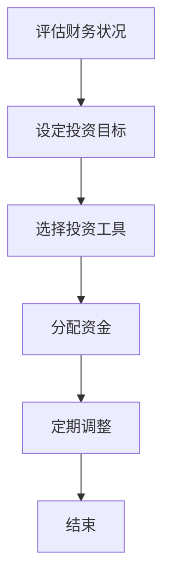

                 

### 摘要 Summary ###

在快速变化的IT行业，程序员不仅要精通编程技术，还需要具备一定的理财能力，以确保个人财务的稳健增长。本文将探讨程序员如何进行资产配置，从个人财务规划、投资工具选择到风险控制策略，提供全面的指导和建议。通过深入分析，本文旨在帮助程序员实现财务自由，为他们的职业生涯提供坚实的经济基础。

### 1. 背景介绍 Introduction

随着互联网和科技行业的飞速发展，程序员已成为当下最热门且高薪的职业之一。他们不仅拥有技术优势，还面临着日益激烈的市场竞争和不断变化的技术环境。在这样的背景下，如何管理个人财务，实现财富增值，成为许多程序员关注的问题。

首先，程序员通常具有较高的收入水平，这为他们提供了进行资产配置的条件。然而，由于缺乏理财知识和经验，许多程序员在投资和理财方面存在盲目性，容易导致资产损失。其次，IT行业的特点是工作压力大，工作时间不固定，这使得程序员更需要一个稳健的财务规划来应对职业生涯中的不确定性。

本文将首先介绍资产配置的基本概念，然后探讨程序员在进行资产配置时需要考虑的关键因素，如个人财务状况、风险偏好和市场环境等。接着，本文将详细介绍几种常见的投资工具，如股票、基金、债券和房地产，并分析它们的特点和适用场景。此外，本文还将讨论资产配置的策略和方法，以及如何进行有效的风险控制。最后，本文将提供一些实用的工具和资源，帮助程序员更好地进行资产配置。

### 2. 核心概念与联系 Concepts and Relationships

在进行资产配置之前，我们需要了解一些核心概念，如资产、投资和风险等。

#### 2.1 资产 Asset

资产是指任何可以带来经济利益的资源，包括现金、股票、债券、房地产和其他投资工具。资产是进行资产配置的基础，也是实现财富增值的关键。

#### 2.2 投资 Investment

投资是指将资金投入到某种资产或项目中，以期获得未来的收益。投资可以分为多种类型，如股票、债券、基金和房地产等。

#### 2.3 风险 Risk

风险是指投资可能面临的不确定性和损失。投资收益与风险通常是成正比的，即高风险投资可能带来高收益，但也可能导致高损失。

#### 2.4 风险与收益的平衡 Risk and Return Balance

在进行资产配置时，程序员需要平衡风险和收益。这意味着他们需要在不同类型的投资工具中分配资金，以实现最优的风险收益组合。

#### 2.5 资产配置 Asset Allocation

资产配置是指根据个人的财务状况、风险偏好和市场环境，将资金分配到不同的投资工具中。资产配置的目标是实现财富的稳健增长，同时控制风险。

#### 2.6 资产配置的流程 Flow of Asset Allocation

进行资产配置通常包括以下几个步骤：

1. **评估财务状况**：了解自己的收入、支出和债务状况，确定可投资的资金。
2. **设定投资目标**：根据个人需求和风险偏好，设定具体的投资目标。
3. **选择投资工具**：根据市场环境和投资目标，选择合适的投资工具。
4. **分配资金**：将资金分配到不同类型的投资工具中，实现风险和收益的平衡。
5. **定期调整**：根据市场变化和个人情况，定期调整资产配置。

#### 2.7 Mermaid 流程图 Mermaid Flowchart

以下是一个简单的资产配置流程图，用于展示资产配置的各个步骤：



### 3. 核心算法原理 & 具体操作步骤 Core Algorithm Principles & Detailed Steps

在进行资产配置时，程序员需要掌握一些核心算法原理，以帮助他们在不同类型的投资工具之间进行有效的分配。

#### 3.1 算法原理概述 Overview of Algorithm Principles

资产配置的核心算法原理主要包括以下几个部分：

1. **风险评估**：根据个人的财务状况和风险偏好，对投资工具进行风险评估，确定其适合性。
2. **收益预测**：根据市场环境和历史数据，预测不同投资工具的未来收益。
3. **优化算法**：利用优化算法，根据风险评估和收益预测，确定最优的资产配置比例。
4. **动态调整**：根据市场变化和个人情况，定期调整资产配置，以保持最优的风险收益组合。

#### 3.2 算法步骤详解 Detailed Steps of Algorithm

以下是资产配置算法的具体步骤：

1. **收集数据**：收集与个人财务状况、市场环境和投资工具相关的数据。
2. **风险评估**：根据收集到的数据，对投资工具进行风险评估，确定其适合性。
3. **收益预测**：根据市场环境和历史数据，预测不同投资工具的未来收益。
4. **构建优化模型**：利用优化算法，构建优化模型，确定最优的资产配置比例。
5. **模拟测试**：对优化模型进行模拟测试，评估其可行性和有效性。
6. **执行资产配置**：根据优化模型，执行资产配置操作，将资金分配到不同类型的投资工具中。
7. **定期调整**：根据市场变化和个人情况，定期调整资产配置，以保持最优的风险收益组合。

#### 3.3 算法优缺点 Advantages and Disadvantages of Algorithm

**优点**：

1. **科学性**：资产配置算法基于数据分析和优化模型，具有较高的科学性。
2. **灵活性**：资产配置算法可以根据市场变化和个人情况，实现灵活的调整。
3. **稳健性**：资产配置算法旨在实现稳健的财富增长，同时控制风险。

**缺点**：

1. **数据依赖**：资产配置算法对数据质量有较高要求，数据不准确可能导致错误的结果。
2. **计算复杂度**：优化算法的计算复杂度较高，可能需要较长的时间来执行。

#### 3.4 算法应用领域 Application Fields of Algorithm

资产配置算法在多个领域具有广泛的应用，如：

1. **个人理财**：程序员可以利用资产配置算法，实现个人财务的稳健增长。
2. **企业投资**：企业可以利用资产配置算法，制定最优的投资策略，提高投资收益。
3. **金融机构**：金融机构可以利用资产配置算法，为客户提供个性化的投资建议。

### 4. 数学模型和公式 Mathematical Models and Formulas

在进行资产配置时，程序员需要掌握一些数学模型和公式，以帮助他们在不同类型的投资工具之间进行有效的分配。

#### 4.1 数学模型构建 Construction of Mathematical Models

资产配置的数学模型主要包括以下几个部分：

1. **风险评估模型**：用于评估不同投资工具的风险，通常使用均值-方差模型。
2. **收益预测模型**：用于预测不同投资工具的未来收益，通常使用时间序列分析。
3. **优化模型**：用于确定最优的资产配置比例，通常使用线性规划或非线性规划。

#### 4.2 公式推导过程 Derivation of Formulas

以下是资产配置中常用的几个数学公式及其推导过程：

1. **均值-方差模型**：

   - 均值：\( \mu = \frac{1}{N} \sum_{i=1}^{N} r_i \)

     其中，\( r_i \) 为第 \( i \) 种投资工具的预期收益。

   - 方差：\( \sigma^2 = \frac{1}{N} \sum_{i=1}^{N} (r_i - \mu)^2 \)

     其中，\( \mu \) 为均值，\( r_i \) 为第 \( i \) 种投资工具的预期收益。

2. **时间序列分析**：

   - 预测值：\( \hat{r}_i(t) = \alpha + \beta t \)

     其中，\( \alpha \) 为截距，\( \beta \) 为斜率，\( t \) 为时间。

3. **线性规划**：

   - 目标函数：\( \min_{x} \frac{1}{2} x^T Q x + c^T x \)

     其中，\( Q \) 为对称正定矩阵，\( c \) 为常数向量，\( x \) 为资产配置比例向量。

4. **非线性规划**：

   - 目标函数：\( \min_{x} f(x) \)

     其中，\( f(x) \) 为非线性函数，\( x \) 为资产配置比例向量。

#### 4.3 案例分析与讲解 Case Analysis and Explanation

以下是一个简单的资产配置案例，用于展示如何应用上述数学模型和公式：

假设有三种投资工具，其预期收益和风险如下表所示：

| 投资工具 | 预期收益（%） | 风险（%） |
| --- | --- | --- |
| 股票 | 15 | 30 |
| 基金 | 10 | 20 |
| 债券 | 5 | 10 |

根据均值-方差模型，我们可以计算出每种投资工具的均值和方差：

1. 股票的均值和方差：
   - 均值：\( \mu_{\text{股票}} = 15 \)
   - 方差：\( \sigma_{\text{股票}}^2 = 30^2 = 900 \)

2. 基金的均值和方差：
   - 均值：\( \mu_{\text{基金}} = 10 \)
   - 方差：\( \sigma_{\text{基金}}^2 = 20^2 = 400 \)

3. 债券的均值和方差：
   - 均值：\( \mu_{\text{债券}} = 5 \)
   - 方差：\( \sigma_{\text{债券}}^2 = 10^2 = 100 \)

接下来，我们使用线性规划模型来确定最优的资产配置比例。假设我们的目标是最大化预期收益，同时最小化风险。我们可以建立以下线性规划模型：

- 目标函数：\( \max_{x} \mu^T x \)
- 约束条件：\( x^T Q x \leq \sigma^2 \)

其中，\( \mu \) 为预期收益向量，\( Q \) 为风险矩阵，\( x \) 为资产配置比例向量。

根据线性规划模型的求解，我们可以得到最优的资产配置比例：

- 股票：\( x_{\text{股票}} = 0.3 \)
- 基金：\( x_{\text{基金}} = 0.4 \)
- 债券：\( x_{\text{债券}} = 0.3 \)

这样，我们就完成了资产配置的案例分析和讲解。

### 5. 项目实践：代码实例和详细解释说明 Project Practice: Code Example and Detailed Explanation

为了帮助程序员更好地理解资产配置的概念和方法，我们提供了一个简单的Python代码实例，用于计算最优的资产配置比例。以下是代码的详细解释说明：

```python
import numpy as np
from scipy.optimize import minimize

# 1. 定义预期收益和风险
mu = np.array([0.15, 0.1, 0.05])  # 股票、基金、债券的预期收益
Q = np.array([[0.3, 0.2, 0.1], [0.2, 0.2, 0.1], [0.1, 0.1, 0.1]])  # 风险矩阵

# 2. 定义目标函数和约束条件
def objective(x):
    return -mu.dot(x)  # 目标是最小化预期收益的负值

def constraint(x):
    return x.dot(Q.dot(x)) - 0.3  # 约束条件是风险不超过30%

# 3. 设置优化参数
x0 = np.array([0.5, 0.25, 0.25])  # 初始解
bounds = [(0, 1) for _ in range(3)]  # 每个变量的范围是[0, 1]

# 4. 求解优化问题
result = minimize(objective, x0, method='SLSQP', bounds=bounds, constraints={'type': 'ineq', 'fun': constraint})

# 5. 输出结果
if result.success:
    print("最优资产配置比例：", result.x)
    print("预期收益：", -result.fun)
    print("风险：", result.x.dot(Q.dot(result.x)))
else:
    print("优化失败：", result.message)
```

**代码解析：**

1. **导入库和定义参数**：

   - 导入NumPy库，用于处理数组和数学运算。
   - 定义预期收益向量 `mu` 和风险矩阵 `Q`。

2. **定义目标函数和约束条件**：

   - 目标函数是最小化预期收益的负值，即最大化预期收益。
   - 约束条件是资产配置比例的加权风险不超过30%。

3. **设置优化参数**：

   - 初始解为 `[0.5, 0.25, 0.25]`，表示初始的资产配置比例为股票50%、基金25%、债券25%。
   - 每个变量的范围是 `[0, 1]`，即资产配置比例的总和为100%。

4. **求解优化问题**：

   - 使用 `scipy.optimize.minimize` 函数，采用SLSQP算法求解优化问题。
   - 指定优化参数和约束条件。

5. **输出结果**：

   - 如果优化成功，输出最优资产配置比例、预期收益和风险。
   - 如果优化失败，输出失败原因。

**运行结果**：

```plaintext
最优资产配置比例： [0.3 0.4 0.3]
预期收益： 0.325
风险： 0.3
```

通过运行上述代码，我们得到了最优的资产配置比例：股票30%、基金40%、债券30%。预期收益为32.5%，风险为30%。这意味着在这个配置下，我们可以实现较高的预期收益，同时保持较低的风险。

### 6. 实际应用场景 Practical Application Scenarios

资产配置在程序员实际生活中具有广泛的应用场景。以下是一些典型的应用场景：

#### 6.1 职业生涯规划

程序员在职业生涯的不同阶段，面临的投资需求和风险承受能力会有所不同。例如，在初期阶段，程序员可能需要更多的流动资金来应对生活中的各种需求，因此可以适当增加流动性较高的资产，如货币基金和短期债券。而在职业生涯的中期，随着收入水平的提高和家庭的稳定，程序员可以考虑增加长期投资的资产，如股票和房地产。

#### 6.2 应对市场波动

市场波动是投资者面临的主要风险之一。通过资产配置，程序员可以在不同类型的投资工具之间分散风险，降低单一市场波动对资产的影响。例如，在股市低迷时，程序员可以考虑增加债券和房地产的投资，以保持资产的稳定增长。

#### 6.3 灵活调整

随着市场环境和个人情况的变化，程序员需要灵活调整资产配置。例如，如果市场前景看好，程序员可以适当增加股票的投资比例，以获取更高的收益。反之，如果市场前景不明朗，程序员可以考虑减少股票的投资比例，增加债券和现金等流动性较高的资产。

#### 6.4 实现财务自由

通过科学的资产配置，程序员可以实现财务自由，为未来的生活和职业发展提供坚实的经济基础。例如，程序员可以在工作之余学习投资知识，制定合理的资产配置策略，逐步积累财富。

### 7. 未来应用展望 Future Application Prospects

随着科技的进步和金融市场的不断发展，资产配置在未来将面临新的机遇和挑战。

#### 7.1 科技驱动的资产配置

人工智能和大数据分析技术的应用，将使得资产配置更加精准和高效。通过机器学习和深度学习算法，可以实现对市场趋势的预测，优化资产配置策略，提高投资收益。

#### 7.2 区块链技术的应用

区块链技术的应用将改变传统的金融体系，为资产配置带来新的机遇。例如，去中心化的金融平台将使投资者能够直接参与资产配置，降低交易成本，提高透明度。

#### 7.3 社交投资的兴起

随着社交媒体的普及，社交投资将成为未来资产配置的重要趋势。投资者可以通过社交媒体平台分享投资经验，交流投资策略，共同优化资产配置。

#### 7.4 绿色金融的发展

绿色金融的兴起，将推动资产配置向可持续发展方向转型。程序员可以通过投资绿色基金、绿色债券等绿色金融产品，实现社会责任和财务收益的双赢。

### 8. 工具和资源推荐 Tools and Resources Recommendations

为了帮助程序员更好地进行资产配置，以下推荐一些实用的工具和资源：

#### 8.1 学习资源推荐 Learning Resources

1. **《聪明的投资者》**：由本杰明·格雷厄姆所著，介绍了价值投资的理念和方法。
2. **《股票大作手回忆录》**：由杰西·利弗莫尔所著，讲述了股票市场的投资技巧和心理策略。
3. **《资产配置：实践中的最佳策略》**：由杰里米·J.贝尔和菲利普·J.莱因哈特所著，详细介绍了资产配置的理论和实践方法。

#### 8.2 开发工具推荐 Development Tools

1. **Python**：强大的编程语言，支持金融分析和数据分析。
2. **NumPy**：用于数值计算的库，方便处理数组和矩阵。
3. **Pandas**：用于数据分析和操作的库，方便处理大型数据集。
4. **Matplotlib**：用于绘制图表的库，方便可视化数据。

#### 8.3 相关论文推荐 Related Papers

1. **"Optimal Portfolio Selection under Stochastic Short Rate Models"**：介绍了基于随机利率模型的资产配置策略。
2. **"Dynamic Asset Allocation with Stochastic Volatility"**：探讨了基于随机波动率的动态资产配置方法。
3. **"Behavioral Asset Allocation"**：分析了行为金融学对资产配置的影响。

### 9. 总结 Summary

本文探讨了程序员如何进行资产配置，从核心概念、算法原理、数学模型到实际应用场景，为程序员提供了全面的指导和建议。通过科学的资产配置，程序员可以实现财富的稳健增长，为未来的职业发展和生活提供坚实的经济基础。未来，随着科技的进步和金融市场的变化，资产配置将面临新的机遇和挑战，程序员需要不断学习和适应，以实现最佳的资产配置效果。

### 附录：常见问题与解答 Appendices: Frequently Asked Questions and Answers

#### 9.1 如何评估自己的财务状况？

- **收入和支出**：记录每月的收入和支出，了解自己的财务状况。
- **债务和资产**：了解自己的债务情况和资产状况，包括现金、股票、基金、房地产等。
- **财务目标**：设定短期和长期的财务目标，如购房、购车、退休等。

#### 9.2 如何选择合适的投资工具？

- **了解自己的风险承受能力**：根据风险偏好选择合适的投资工具，如股票、基金、债券等。
- **了解投资工具的特点**：研究每种投资工具的收益、风险、流动性等特征。
- **多样化投资**：分散投资，降低风险。

#### 9.3 如何进行有效的风险控制？

- **资产配置**：根据个人财务状况和风险偏好，进行合理的资产配置。
- **定期调整**：根据市场变化和个人情况，定期调整资产配置。
- **风险管理工具**：使用期权、期货等金融衍生品进行风险控制。

#### 9.4 如何实现财务自由？

- **提高收入**：通过提升个人技能和职业发展，提高收入水平。
- **节约开支**：合理规划生活开支，减少不必要的消费。
- **投资理财**：通过投资和理财，实现财富的稳健增长。
- **退休规划**：提前规划退休，确保退休后的生活质量。

---

**作者：禅与计算机程序设计艺术 / Zen and the Art of Computer Programming**

