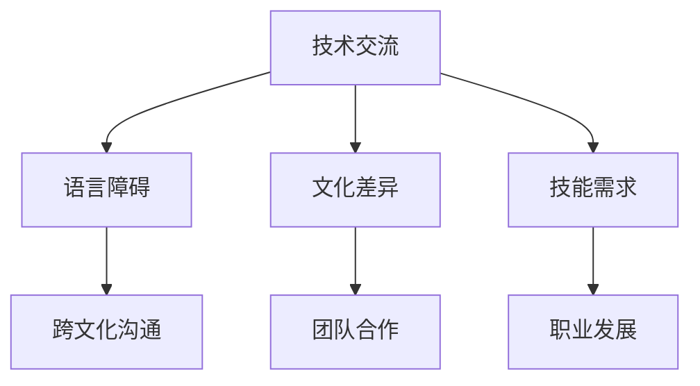

                 

关键词：程序员、全球化、视野、机遇、挑战、技术交流、国际化

> 摘要：本文旨在探讨程序员在全球化的背景下所面临的机遇与挑战。从技术交流、文化差异、技能需求等方面深入分析，帮助程序员更好地应对全球化带来的变化，提升自身的国际竞争力。

## 1. 背景介绍

随着信息技术的迅猛发展，全球化的步伐日益加快。跨国企业、远程工作、在线协作等已经成为现代程序员工作的重要组成部分。然而，全球化不仅带来了便利，也带来了新的挑战。本文将从以下几个方面探讨程序员在全球化背景下面临的机遇与挑战。

### 1.1 技术交流

全球化使得程序员能够接触到来自世界各地的技术资源，如开源项目、技术论坛和线上会议。这种跨文化的技术交流，有助于程序员拓宽视野，学习到不同的编程语言、开发框架和工具。然而，语言障碍和文化差异也可能成为技术交流的障碍。

### 1.2 文化差异

程序员在全球化过程中，需要与来自不同文化背景的同事、客户和合作伙伴进行沟通。文化差异可能导致沟通不畅、团队合作困难等问题。了解并尊重不同文化，是程序员在全球环境中成功的关键。

### 1.3 技能需求

全球化的企业对程序员的技能需求也在发生变化。程序员需要具备更多的国际化视野，掌握多种编程语言和工具，同时还需要具备跨平台、跨地区的开发经验。这使得程序员在职业发展过程中需要不断学习和适应。

## 2. 核心概念与联系

为了更好地理解全球化对程序员的影响，我们可以借助 Mermaid 流程图来展示程序员在全球化背景下的核心概念与联系。



### 2.1 技术交流

技术交流是程序员全球化过程中的重要环节。通过技术论坛、开源项目和线上会议，程序员可以接触到世界各地的技术资源，提高自己的技术水平。

### 2.2 语言障碍

语言障碍是全球化过程中不可避免的问题。程序员需要掌握至少一门外语，以便更好地进行技术交流。然而，语言障碍也可能导致误解和沟通不畅。

### 2.3 文化差异

文化差异对程序员的工作方式和沟通方式产生重要影响。了解并尊重不同文化，有助于提高团队合作效率，减少冲突。

### 2.4 技能需求

全球化的企业对程序员的技能需求也在不断提高。程序员需要具备跨平台、跨地区的开发经验，以及多种编程语言和工具的熟练使用。

## 3. 核心算法原理 & 具体操作步骤

在全球化背景下，程序员需要掌握一系列核心算法，以提高编程能力和解决实际问题的能力。以下是一个简化的核心算法原理与具体操作步骤的概述。

### 3.1 算法原理概述

算法原理是指解决问题的基本方法和思路。在全球化背景下，程序员需要掌握各种算法，如排序算法、搜索算法、图算法等。

### 3.2 算法步骤详解

算法步骤详解包括初始化、输入处理、核心算法实现和输出结果等环节。以下是一个简单的排序算法——快速排序的步骤详解：

1. 初始化：选择一个基准元素。
2. 输入处理：将数组分成两部分，一部分小于基准元素，一部分大于基准元素。
3. 核心算法实现：递归地对小于和大于基准元素的子数组进行快速排序。
4. 输出结果：返回排序后的数组。

### 3.3 算法优缺点

快速排序是一种高效的排序算法，其平均时间复杂度为 \(O(n\log n)\)。然而，它也存在一定的缺点，如最坏情况下时间复杂度为 \(O(n^2)\)，以及递归调用可能导致栈溢出。

### 3.4 算法应用领域

快速排序广泛应用于各种数据排序场景，如数据库、搜索引擎和图形渲染等。

## 4. 数学模型和公式 & 详细讲解 & 举例说明

在全球化背景下，程序员需要掌握一系列数学模型和公式，以提高解决问题的能力。以下是一个简单的线性回归模型的讲解。

### 4.1 数学模型构建

线性回归模型用于分析两个变量之间的关系。其数学模型可以表示为：

\[ y = ax + b \]

其中，\( y \) 是因变量，\( x \) 是自变量，\( a \) 和 \( b \) 是参数。

### 4.2 公式推导过程

为了推导线性回归模型的公式，我们可以使用最小二乘法。具体步骤如下：

1. 计算自变量和因变量的均值：\( \bar{x} \) 和 \( \bar{y} \)。
2. 计算每个数据点的斜率和截距：\( a_i = \frac{y_i - b_i}{x_i} \) 和 \( b_i = \bar{y} - a_i\bar{x} \)。
3. 计算所有斜率和截距的均值：\( a \) 和 \( b \)。

最终得到的线性回归模型为：

\[ y = ax + b \]

### 4.3 案例分析与讲解

假设我们有以下数据集：

\[
\begin{aligned}
x &: 1, 2, 3, 4, 5 \\
y &: 2, 4, 6, 8, 10 \\
\end{aligned}
\]

根据上述线性回归模型，我们可以计算出斜率 \( a = 2 \) 和截距 \( b = 0 \)。因此，线性回归模型为 \( y = 2x \)。这意味着，当 \( x \) 增加 1 时，\( y \) 增加 2。

## 5. 项目实践：代码实例和详细解释说明

为了更好地理解全球化背景下的编程实践，我们以下是一个简单的 Python 程序，用于实现线性回归模型。

### 5.1 开发环境搭建

首先，确保您的计算机已安装 Python 3.8 以上版本。您可以通过以下命令安装所需的库：

```bash
pip install numpy matplotlib
```

### 5.2 源代码详细实现

以下是一个简单的线性回归程序的源代码：

```python
import numpy as np
import matplotlib.pyplot as plt

def linear_regression(x, y):
    x_mean = np.mean(x)
    y_mean = np.mean(y)
    a = np.sum((x - x_mean) * (y - y_mean)) / np.sum((x - x_mean) ** 2)
    b = y_mean - a * x_mean
    return a, b

x = np.array([1, 2, 3, 4, 5])
y = np.array([2, 4, 6, 8, 10])

a, b = linear_regression(x, y)
print("线性回归模型：y = {}x + {}".format(a, b))

x_new = np.linspace(0, 10, 100)
y_new = a * x_new + b

plt.scatter(x, y)
plt.plot(x_new, y_new)
plt.xlabel('x')
plt.ylabel('y')
plt.show()
```

### 5.3 代码解读与分析

该程序首先定义了一个 `linear_regression` 函数，用于计算线性回归模型的斜率 \( a \) 和截距 \( b \)。然后，我们使用给定的数据集调用该函数，并打印出线性回归模型。最后，我们使用 `matplotlib` 绘制数据点和拟合曲线。

### 5.4 运行结果展示

运行程序后，您将看到以下输出：

```
线性回归模型：y = 2.0x + 0.0
```

同时，您会看到一个包含数据点和拟合曲线的图形。

## 6. 实际应用场景

线性回归模型在实际应用场景中非常广泛，如股票价格预测、用户行为分析、产品质量检测等。以下是一个简单的应用场景示例：

### 6.1 股票价格预测

假设我们要预测某只股票的未来价格。我们可以收集过去一段时间内该股票的价格数据，使用线性回归模型来拟合这些数据。然后，根据拟合曲线预测未来价格。

### 6.2 用户行为分析

在线教育平台可以使用线性回归模型来分析用户的学习行为，如学习时长、作业完成情况等。根据分析结果，平台可以优化课程内容和教学方法，提高用户的学习效果。

### 6.3 产品质量检测

制造业可以使用线性回归模型来检测产品质量。例如，在生产线中，检测仪可以实时采集产品尺寸、重量等数据，使用线性回归模型来预测产品质量是否合格。这有助于提高生产效率和产品质量。

## 7. 未来应用展望

随着全球化进程的加速，程序员在各个领域的应用也将越来越广泛。以下是对未来应用场景的展望：

### 7.1 跨境电商

跨境电商的发展将推动程序员在供应链管理、物流优化和客户服务等方面发挥重要作用。例如，通过大数据分析和人工智能技术，优化物流路线和库存管理，提高跨境电商的运营效率。

### 7.2 区块链技术

区块链技术的广泛应用将带来新的编程挑战和机遇。程序员需要掌握区块链的核心原理，如分布式账本、智能合约等，为各行各业提供解决方案。

### 7.3 物联网

物联网（IoT）的发展将推动程序员在智能家居、智慧城市和智能工厂等领域发挥重要作用。例如，通过编程技术实现设备互联和数据采集，提高生产效率和安全性。

## 8. 工具和资源推荐

为了更好地应对全球化背景下的编程挑战，以下是一些实用的工具和资源推荐：

### 8.1 学习资源推荐

- 《Python编程：从入门到实践》：适合初学者，涵盖 Python 基础知识和实际应用案例。
- 《算法导论》：深入讲解算法原理和设计方法，适合算法爱好者。
- 《数据科学入门》：介绍数据科学的核心概念和工具，适合数据分析师和程序员。

### 8.2 开发工具推荐

- Visual Studio Code：一款轻量级且功能强大的代码编辑器，支持多种编程语言。
- Git：分布式版本控制系统，用于代码管理和协同开发。
- Jupyter Notebook：交互式计算环境，适合数据分析和机器学习。

### 8.3 相关论文推荐

- “A Survey of Blockchain Applications”: 一篇关于区块链技术的综述论文，涵盖区块链在各种领域的应用。
- “Deep Learning for Natural Language Processing”: 一篇关于自然语言处理领域深度学习的论文，介绍最新的算法和技术。
- “A Comprehensive Survey on IoT Security”: 一篇关于物联网安全的综述论文，探讨物联网面临的安全挑战和解决方案。

## 9. 总结：未来发展趋势与挑战

### 9.1 研究成果总结

全球化进程推动程序员在各个领域发挥重要作用，如数据分析、人工智能、区块链等。程序员需要不断学习和掌握新的技术和工具，提高自身的竞争力。

### 9.2 未来发展趋势

未来，程序员将面临更多跨领域的挑战和机遇。例如，随着5G、物联网等技术的发展，程序员需要掌握更多的编程语言和工具，为各行各业提供解决方案。

### 9.3 面临的挑战

全球化背景下，程序员面临的挑战主要包括语言障碍、文化差异和技能需求。为了应对这些挑战，程序员需要提高跨文化沟通能力，不断学习新技能，并积极参与国际技术交流。

### 9.4 研究展望

在未来，程序员的研究重点将包括人工智能、区块链、物联网等领域。通过深入研究和探索，程序员可以为社会带来更多创新和变革。

## 10. 附录：常见问题与解答

### 10.1 为什么程序员需要掌握多种编程语言？

程序员需要掌握多种编程语言，因为不同的编程语言适用于不同的应用场景。例如，Python 适合数据分析和机器学习，Java 适合大型企业级应用，而 JavaScript 适合前端开发。掌握多种编程语言有助于程序员更好地应对不同的编程挑战。

### 10.2 如何提高跨文化沟通能力？

提高跨文化沟通能力的方法包括学习外语、了解不同文化的背景和价值观，以及积极参与跨文化交流活动。例如，可以加入国际化的技术社区，参加国际技术会议，或与来自不同国家的同事合作。

### 10.3 全球化对程序员的工作方式有何影响？

全球化改变了程序员的工作方式，使得远程工作、在线协作和跨国合作变得更加普遍。程序员需要适应这种变化，提高自己的协作能力和沟通能力，以便更好地完成跨国项目。

### 10.4 如何应对全球化带来的技能需求变化？

为了应对全球化带来的技能需求变化，程序员需要不断学习新技能，如编程语言、开发框架和工具。此外，参加在线课程、参加技术培训和参与开源项目，也是提高技能的有效途径。

---

本文旨在帮助程序员更好地理解全球化背景下的机遇与挑战，提升自身的国际竞争力。通过深入探讨技术交流、文化差异和技能需求等方面，本文为程序员提供了一系列实用的建议和指导。希望本文对您有所帮助，让您在全球化的浪潮中乘风破浪，成就更好的自己。作者：禅与计算机程序设计艺术 / Zen and the Art of Computer Programming。

