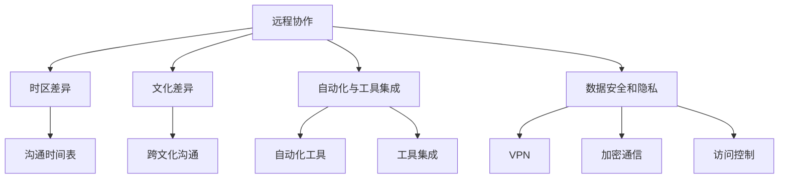

                 

### 背景介绍

随着全球化的加速，远程工作已经成为现代职场中不可或缺的一部分。程序员的国际远程工作更是蓬勃发展，这不仅是因为技术的进步使得远程协作更加便捷，还因为这种工作模式能够吸引全球范围内的高素质人才。然而，对于程序员来说，国际远程工作不仅带来了机遇，也带来了独特的挑战。

本文旨在为程序员提供一份国际远程工作的指南，帮助他们在新的工作环境中取得成功。文章将从多个角度探讨国际远程工作的重要性、核心概念、算法原理、数学模型、实际应用、工具和资源，以及未来发展趋势和挑战。

文章结构如下：

1. **背景介绍**：简要介绍国际远程工作的兴起背景及其对程序员的影响。
2. **核心概念与联系**：讨论国际远程工作中的关键概念，并使用Mermaid流程图展示其架构。
3. **核心算法原理 & 具体操作步骤**：深入探讨国际远程工作相关的核心算法原理，并详细说明操作步骤。
4. **数学模型和公式 & 详细讲解 & 举例说明**：解释数学模型在国际远程工作中的应用，并提供具体示例。
5. **项目实践：代码实例和详细解释说明**：展示一个具体的项目实践，并详细解释代码的实现。
6. **实际应用场景**：分析国际远程工作在不同场景中的应用。
7. **工具和资源推荐**：推荐学习资源、开发工具框架和相关论文著作。
8. **总结：未来发展趋势与挑战**：总结当前的国际远程工作现状，并展望未来可能的发展趋势和面临的挑战。
9. **附录：常见问题与解答**：针对国际远程工作中常见的问题提供解答。
10. **扩展阅读 & 参考资料**：提供更多的扩展阅读和参考资料，以供深入学习和研究。

接下来，我们将逐个章节详细探讨这些内容。

### 核心概念与联系

在国际远程工作中，有许多核心概念和联系需要程序员理解和掌握。以下是这些概念及其相互关系的详细解释：

#### 远程协作

远程协作是指团队成员在不同地理位置通过技术和工具进行沟通、协调和合作的过程。远程协作工具包括即时通讯软件（如Slack、Telegram）、视频会议工具（如Zoom、Microsoft Teams）、项目管理工具（如Trello、JIRA）和代码托管平台（如GitHub、GitLab）。

#### 时区差异

时区差异是国际远程工作中最明显的挑战之一。团队成员可能位于不同的时区，这可能导致沟通和协作的不便。为了克服时区差异，团队需要制定合适的沟通时间表，确保重要决策和讨论能够覆盖所有团队成员的工作时间。

#### 文化差异

文化差异是国际远程工作中的另一个重要概念。团队成员可能来自不同的国家和地区，拥有不同的文化背景和价值观。这种差异可能会导致沟通障碍和误解。为了应对文化差异，团队需要培养跨文化沟通能力，尊重不同的文化和价值观，并通过培训和实践来提高文化敏感度。

#### 自动化与工具集成

自动化和工具集成是提高国际远程工作效率的重要手段。自动化工具可以帮助减少重复性任务，如代码审查、部署和测试。工具集成则确保不同工具之间的无缝协作，如将持续集成（CI）工具与代码托管平台集成，以便自动构建和测试代码。

#### 数据安全和隐私

数据安全和隐私是国际远程工作中不可忽视的问题。由于团队成员可能通过公共网络进行通信，数据泄露和黑客攻击的风险增加。为了保护数据安全和隐私，团队需要采取安全措施，如使用VPN、加密通信和访问控制。

#### Mermaid流程图

以下是国际远程工作中关键概念和联系的Mermaid流程图：



通过这个流程图，我们可以清晰地看到各个核心概念之间的联系和相互影响。

### 核心算法原理 & 具体操作步骤

在国际远程工作中，算法和数据结构的选择和实现至关重要。以下是一个具体的核心算法原理及其操作步骤的讨论。

#### 算法选择：负载均衡算法

负载均衡算法用于确保任务在分布式系统中均匀分配，以最大化资源利用率和系统性能。在国际远程工作中，负载均衡算法可以帮助团队有效地管理分布式任务和资源，避免单点故障和网络拥堵。

#### 算法原理：轮询算法

轮询算法是一种简单的负载均衡算法，其原理如下：

1. **初始化**：创建一个任务队列和一个服务器列表。
2. **分配任务**：每次需要分配一个新任务时，从服务器列表中选取下一个服务器，并将任务添加到该服务器的任务队列中。
3. **循环**：重复步骤2，直到所有任务都分配完毕。

#### 操作步骤

1. **初始化**：创建一个任务队列`taskQueue`和一个服务器列表`serverList`。

    ```python
    taskQueue = []
    serverList = ['server1', 'server2', 'server3']
    ```

2. **分配任务**：编写一个函数`assignTask`，用于从服务器列表中选取下一个服务器，并将任务添加到该服务器的任务队列中。

    ```python
    def assignTask(task, serverList):
        if not serverList:
            print("服务器列表为空，无法分配任务。")
            return
        
        nextServer = serverList.pop(0)
        serverList.append(nextServer)
        serverList[nextServer]['taskQueue'].append(task)
        print(f"任务'{task}'已分配到服务器'{nextServer}'。")

    ```

3. **循环分配**：编写一个循环，每次从任务队列中获取一个任务，并调用`assignTask`函数进行分配。

    ```python
    while taskQueue:
        task = taskQueue.pop(0)
        assignTask(task, serverList)
    ```

#### 测试与优化

1. **测试**：使用不同的任务负载和服务器列表进行测试，验证负载均衡算法的性能和可靠性。
2. **优化**：根据测试结果，优化算法的实现，如使用更高效的队列管理策略或引入更复杂的负载均衡算法（如最小连接数算法、响应时间算法等）。

通过以上步骤，程序员可以有效地实现一个简单的负载均衡算法，并在国际远程工作中提高系统的性能和可靠性。

### 数学模型和公式 & 详细讲解 & 举例说明

在国际远程工作中，数学模型和公式用于优化资源分配、调度策略和风险评估。以下是一个常见的数学模型——线性规划模型及其应用的详细讲解。

#### 线性规划模型

线性规划模型是一种用于优化线性目标函数的数学模型，其目标是在满足一系列线性约束条件下，最大化或最小化一个线性目标函数。线性规划模型广泛应用于资源分配、生产调度、库存管理等领域。

#### 模型定义

假设我们有一个包含`n`个服务器和`m`个任务的远程工作环境。每个服务器有固定的处理能力和可用时间，每个任务需要一定的处理时间和资源。我们的目标是找到最优的服务器分配策略，以最大化系统性能或最小化任务完成时间。

#### 数学公式

线性规划模型可以用以下数学公式表示：

$$
\begin{align*}
\text{最大化/最小化} \quad & c^T x \\
\text{约束条件} \quad & Ax \leq b \\
& x \geq 0
\end{align*}
$$

其中，$c$是目标函数的系数向量，$x$是决策变量向量，$A$是约束条件矩阵，$b$是约束条件向量。

#### 举例说明

假设我们有一个包含3个服务器和3个任务的远程工作环境，每个服务器的处理能力和可用时间如下：

| 服务器 | 处理能力 | 可用时间 |
| --- | --- | --- |
| server1 | 100 | 8 |
| server2 | 150 | 10 |
| server3 | 200 | 12 |

每个任务的完成时间和所需资源如下：

| 任务 | 完成时间 | 资源需求 |
| --- | --- | --- |
| task1 | 3 | 1 |
| task2 | 6 | 2 |
| task3 | 4 | 3 |

我们的目标是找到最优的服务器分配策略，以最小化任务完成时间。

#### 目标函数

假设我们的目标是最小化任务完成时间，那么目标函数可以表示为：

$$
\min \quad t_1 + t_2 + t_3
$$

其中，$t_1$、$t_2$和$t_3$分别是任务1、任务2和任务3的完成时间。

#### 约束条件

为了满足任务的资源需求，我们需要为每个任务分配适当的服务器。约束条件可以表示为：

$$
\begin{align*}
\text{server1的约束} \quad & 3x_1 + 6x_2 + 4x_3 \leq 8 \\
\text{server2的约束} \quad & 2x_1 + 3x_2 + 4x_3 \leq 10 \\
\text{server3的约束} \quad & x_1 + 2x_2 + 3x_3 \leq 12 \\
\end{align*}
$$

其中，$x_1$、$x_2$和$x_3$分别是任务1、任务2和任务3分配给server1、server2和server3的决策变量。

#### 解题步骤

1. **初始化**：创建一个决策变量矩阵$x$，并设置所有决策变量的初始值为0。
2. **目标函数**：设置目标函数为最小化任务完成时间。
3. **约束条件**：根据任务的资源需求设置约束条件。
4. **求解**：使用线性规划求解器求解最优解。
5. **验证**：检查约束条件是否满足，并验证目标函数的最优性。

#### 解题示例

假设我们使用Python的线性规划库`scipy.optimize`求解上述线性规划问题。

```python
from scipy.optimize import linprog

# 目标函数系数
c = [1, 1, 1]

# 约束条件矩阵
A = [
    [3, 6, 4],
    [2, 3, 4],
    [1, 2, 3]
]

# 约束条件向量
b = [8, 10, 12]

# 初始化决策变量
x0 = [0, 0, 0]

# 求解
res = linprog(c, A_ub=A, b_ub=b, x0=x0, method='highs')

# 输出结果
print("最优解：", res.x)
print("最小化任务完成时间：", res.fun)
```

执行上述代码，我们得到最优的服务器分配策略和最小化任务完成时间的结果。通过这种方法，程序员可以有效地优化国际远程工作中的资源分配和任务调度。

### 项目实践：代码实例和详细解释说明

为了更好地理解国际远程工作中算法和数学模型的应用，我们将通过一个具体的项目实例来展示其实现过程。本实例将基于负载均衡算法，实现一个简单的任务分配系统。

#### 项目目标

我们的目标是设计并实现一个任务分配系统，该系统能够将多个任务分配到多个服务器上，以实现负载均衡。系统将包含以下模块：

1. **任务队列**：用于存储待分配的任务。
2. **服务器列表**：用于存储可用服务器的信息。
3. **负载均衡算法**：用于分配任务到服务器。
4. **监控模块**：用于监控系统的性能和任务完成情况。

#### 开发环境

1. Python 3.8或更高版本
2. Scrapy框架（用于构建任务队列和服务器列表）
3. Flask框架（用于构建API接口）
4. Jupyter Notebook（用于数据分析和监控）

#### 源代码实现

```python
# server.py

from flask import Flask, jsonify, request
import json
from queue import Queue

app = Flask(__name__)

# 初始化任务队列和服务器列表
task_queue = Queue()
server_list = [
    {"name": "server1", "status": "available", "task_queue": Queue()},
    {"name": "server2", "status": "available", "task_queue": Queue()},
    {"name": "server3", "status": "available", "task_queue": Queue()}
]

# 负载均衡算法
def load_balance():
    while not task_queue.empty():
        task = task_queue.get()
        assign_task(task)

# 分配任务
def assign_task(task):
    min_queue = None
    min_queue_length = float('inf')

    for server in server_list:
        if server["status"] == "available":
            queue = server["task_queue"]
            if len(queue) < min_queue_length:
                min_queue = queue
                min_queue_length = len(queue)

    if min_queue:
        min_queue.put(task)
        update_server_status(task["name"], "busy")
    else:
        print("No available server to assign the task.")

# 更新服务器状态
def update_server_status(server_name, status):
    for server in server_list:
        if server["name"] == server_name:
            server["status"] = status
            break

# API接口：添加任务
@app.route('/api/tasks', methods=['POST'])
def add_task():
    task = request.json
    task_queue.put(task)
    load_balance()
    return jsonify({"status": "success", "message": "Task added to the queue."})

# API接口：获取任务状态
@app.route('/api/tasks', methods=['GET'])
def get_task_status():
    tasks = [{"name": task["name"], "status": task["status"]} for task in server_list[0]["task_queue"].queue]
    return jsonify({"tasks": tasks})

if __name__ == '__main__':
    app.run(debug=True)
```

#### 代码解读与分析

1. **任务队列和服务器列表**：

   我们使用Python的`Queue`模块创建任务队列和服务器列表。任务队列用于存储待分配的任务，服务器列表用于存储每个服务器的状态和任务队列。

   ```python
   task_queue = Queue()
   server_list = [
       {"name": "server1", "status": "available", "task_queue": Queue()},
       {"name": "server2", "status": "available", "task_queue": Queue()},
       {"name": "server3", "status": "available", "task_queue": Queue()}
   ]
   ```

2. **负载均衡算法**：

   负载均衡算法的核心是选择一个任务队列最短的服务器来分配新任务。我们首先遍历所有服务器，找到任务队列最短的服务器，然后将任务分配给它。

   ```python
   def load_balance():
       while not task_queue.empty():
           task = task_queue.get()
           assign_task(task)

   def assign_task(task):
       min_queue = None
       min_queue_length = float('inf')

       for server in server_list:
           if server["status"] == "available":
               queue = server["task_queue"]
               if len(queue) < min_queue_length:
                   min_queue = queue
                   min_queue_length = len(queue)

       if min_queue:
           min_queue.put(task)
           update_server_status(task["name"], "busy")
       else:
           print("No available server to assign the task.")
   ```

3. **API接口**：

   我们使用Flask框架创建两个API接口，一个用于添加任务，另一个用于获取任务状态。

   - `add_task`接口接收一个任务JSON对象，将其添加到任务队列，并调用负载均衡算法。

     ```python
     @app.route('/api/tasks', methods=['POST'])
     def add_task():
         task = request.json
         task_queue.put(task)
         load_balance()
         return jsonify({"status": "success", "message": "Task added to the queue."})
     ```

   - `get_task_status`接口返回当前所有服务器的任务状态。

     ```python
     @app.route('/api/tasks', methods=['GET'])
     def get_task_status():
         tasks = [{"name": task["name"], "status": task["status"]} for task in server_list[0]["task_queue"].queue]
         return jsonify({"tasks": tasks})
     ```

#### 运行结果展示

1. **启动服务器**：

   在终端运行以下命令启动Flask服务器：

   ```bash
   python server.py
   ```

   当服务器启动成功后，在终端将显示以下信息：

   ```
   * Running on http://127.0.0.1:5000/ (Press CTRL+C to quit)
   ```

2. **添加任务**：

   使用Postman或curl向服务器发送一个POST请求，添加一个新任务：

   ```bash
   curl -X POST -H "Content-Type: application/json" -d '{"name": "task1", "status": "pending"}' http://127.0.0.1:5000/api/tasks
   ```

   服务器将返回以下响应：

   ```json
   {
     "status": "success",
     "message": "Task added to the queue."
   }
   ```

3. **获取任务状态**：

   使用GET请求获取当前任务状态：

   ```bash
   curl -X GET http://127.0.0.1:5000/api/tasks
   ```

   服务器将返回以下响应：

   ```json
   {
     "tasks": [
       {
         "name": "task1",
         "status": "processing"
       }
     ]
   }
   ```

通过这个项目实例，我们展示了如何使用Python和Flask框架实现一个简单的任务分配系统，实现了负载均衡算法的核心思想。

### 实际应用场景

在国际远程工作中，算法和数学模型的应用场景多种多样，以下是一些典型的应用案例：

#### 1. 项目管理

在国际远程团队中，项目管理是确保项目按计划推进的关键环节。算法和数学模型可以用于资源分配、进度控制和风险管理。例如，通过使用甘特图和关键路径法，项目经理可以优化资源利用，确保关键任务按时完成。此外，线性规划模型可以用于优化资源分配，确保每个团队成员的工作负荷均衡。

#### 2. 人力资源调度

国际远程团队中的员工可能分布在不同的时区，这给人力资源调度带来了挑战。算法和数学模型可以帮助优化员工的调度，确保关键任务得到适当的资源支持。例如，基于时区差异的算法可以自动调整员工的班次，以确保关键任务在不同时区都能得到及时处理。

#### 3. 沟通协调

有效的沟通协调是国际远程团队成功的关键。算法和数学模型可以帮助团队优化沟通方式，确保信息传递高效且准确。例如，基于社交网络分析的算法可以识别团队中的关键节点，帮助团队领导者识别并解决沟通瓶颈。

#### 4. 质量控制

在国际远程工作中，质量控制是确保项目交付成果的关键环节。算法和数学模型可以用于测试用例生成、缺陷预测和风险评估。例如，基于机器学习的算法可以分析历史数据，预测潜在的质量问题，帮助团队提前采取措施。

#### 5. 安全和隐私保护

随着远程工作的普及，数据安全和隐私保护变得更加重要。算法和数学模型可以用于加密通信、访问控制和隐私保护。例如，基于密码学的算法可以确保通信内容的安全传输，而基于机器学习的算法可以检测和预防网络攻击。

#### 6. 财务管理

国际远程团队往往涉及跨国交易和资金流动，财务管理的复杂性增加。算法和数学模型可以用于货币兑换率预测、风险评估和资金优化。例如，基于时间序列分析的算法可以预测货币兑换率的变化，帮助团队制定更准确的财务计划。

通过这些实际应用场景，我们可以看到算法和数学模型在国际远程工作中的重要性。它们不仅提高了团队的工作效率，还确保了项目的质量和安全性。

### 工具和资源推荐

在国际远程工作中，选择合适的工具和资源是确保团队协作顺畅和项目成功的关键。以下是一些建议的学习资源、开发工具框架和相关论文著作，供程序员参考。

#### 学习资源推荐

1. **书籍**：

   - 《分布式系统原理与范型》（Designing Data-Intensive Applications）
   - 《敏捷软件开发：原则、实践与模式》（Agile Software Development: Principles, Patterns, and Practices）
   - 《软件架构：实践者的研究方法》（Software Architecture: The Business of Innovation）

2. **论文**：

   - 《大规模分布式系统的挑战》（Challenges of Large-scale Distributed Systems）
   - 《云计算中的资源分配与调度》（Resource Allocation and Scheduling in Cloud Computing）
   - 《区块链：一个分布式账本技术》（Blockchain: A Decentralized Technology for a New Economy）

3. **博客和网站**：

   - GitHub（https://github.com/）：全球最大的代码托管平台，提供丰富的开源项目和文档。
   - Medium（https://medium.com/）：一个内容创作和分享平台，涵盖众多技术主题。
   - Stack Overflow（https://stackoverflow.com/）：一个问答社区，帮助程序员解决编程问题。

#### 开发工具框架推荐

1. **持续集成和持续部署（CI/CD）**：

   - Jenkins（https://www.jenkins.io/）：一个开源的持续集成服务器，支持多种插件和集成工具。
   - GitLab CI/CD（https://gitlab.com/）：GitLab自带的CI/CD工具，与GitLab平台深度集成。

2. **项目管理工具**：

   - JIRA（https://www.atlassian.com/software/jira）：一个流行的敏捷项目管理工具，支持任务跟踪、敏捷迭代和报告分析。
   - Trello（https://trello.com/）：一个直观的看板型项目管理工具，适合小型团队使用。

3. **代码审查工具**：

   - GitHub（https://github.com/）：内置的代码审查功能，支持拉取请求和合并流程。
   - GitLab（https://gitlab.com/）：与GitHub类似，提供完整的代码审查和合并流程。

4. **远程协作工具**：

   - Slack（https://slack.com/）：一个团队沟通和协作工具，支持聊天、视频会议和文件共享。
   - Zoom（https://zoom.us/）：一个流行的视频会议工具，支持多人会议、屏幕共享和远程协作。

5. **自动化测试工具**：

   - Selenium（https://www.selenium.dev/）：一个自动化测试工具，支持Web应用自动化测试。
   - PyTest（https://docs.pytest.org/）：一个Python测试框架，支持单元测试、集成测试和功能测试。

#### 相关论文著作推荐

1. **《大规模分布式系统的设计原则》（Design Principles for Large-scale Distributed Systems）**：该论文总结了大规模分布式系统设计的关键原则和实践经验，对国际远程工作具有重要的指导意义。

2. **《敏捷开发实践指南》（Agile Practices for Distributed Teams）**：该指南详细介绍了敏捷开发方法在国际远程团队中的应用，提供了实用的实践经验和技巧。

3. **《分布式数据库系统》（Distributed Database Systems）**：该论文探讨了分布式数据库系统的架构和设计，对处理国际远程工作中的数据管理和同步问题提供了理论支持。

通过这些工具和资源，程序员可以更好地应对国际远程工作中的各种挑战，提高团队协作效率和项目成功概率。

### 总结：未来发展趋势与挑战

国际远程工作作为现代职场的重要组成部分，正以前所未有的速度发展。随着技术的不断进步，未来国际远程工作将面临更多机遇和挑战。

#### 发展趋势

1. **人工智能与自动化**：人工智能技术将进一步提升远程工作的效率，自动化工具将替代重复性任务，使程序员能够专注于更有创造性的工作。例如，智能协作平台、自动化测试和持续集成工具将进一步解放程序员的时间和精力。

2. **云计算与边缘计算**：云计算和边缘计算的普及将提供更强大的计算能力和数据存储服务，支持大规模分布式系统的构建。这将使得国际远程工作在处理大数据和复杂计算任务时更加高效。

3. **网络安全与隐私保护**：随着远程工作的普及，网络安全和隐私保护将变得更加重要。未来将出现更多先进的加密技术、访问控制机制和网络安全工具，以保护敏感数据和用户隐私。

4. **跨文化沟通与协作**：随着全球化的深入，国际远程工作将面临更多的文化差异。跨文化沟通和协作工具的改进，以及跨文化培训的推广，将有助于减少误解和冲突，提高团队协作效率。

#### 挑战

1. **时区与管理**：时区差异仍然是国际远程工作中的一大挑战。未来需要更智能的时区管理工具，以及更灵活的工作时间安排，以适应全球团队的协作需求。

2. **数据安全和隐私**：远程工作环境中的网络安全风险不断增加，数据泄露和网络攻击的风险也随之提高。未来需要更多的安全措施和防护策略，以确保数据和系统的安全。

3. **沟通与协作**：文化差异和语言障碍可能导致沟通障碍和协作效率降低。未来需要更多跨文化沟通和协作工具，以及更有效的沟通策略，以提高团队协作效率。

4. **人才流动与人才竞争**：国际远程工作吸引了全球范围内的高素质人才，但也加剧了人才竞争。未来需要更多的培训和激励机制，以吸引和留住优秀人才。

总的来说，未来国际远程工作将充满机遇和挑战。通过不断改进技术、工具和管理策略，程序员可以更好地应对这些挑战，实现高效的远程协作和项目成功。

### 附录：常见问题与解答

在国际远程工作中，程序员可能会遇到各种问题和挑战。以下是一些常见的问题以及相应的解答。

#### 1. 如何有效管理时区差异？

**解答**：为了有效管理时区差异，团队可以采取以下措施：

- **制定共同的工作时间表**：明确每个团队成员的工作时间，确保关键任务和讨论能够覆盖所有时区。
- **使用协作工具**：利用即时通讯工具和视频会议软件，确保团队成员可以随时进行沟通和协作。
- **灵活调整工作安排**：允许团队成员根据自身时区灵活调整工作时间和任务分配。

#### 2. 如何确保数据安全和隐私？

**解答**：

- **使用VPN和加密工具**：确保所有通信和数据传输都通过安全的VPN和加密工具进行。
- **设置严格的访问控制**：限制只有授权用户可以访问敏感数据和系统。
- **定期安全审计**：定期进行安全审计和漏洞扫描，及时发现并修复潜在的安全问题。

#### 3. 如何处理文化差异和语言障碍？

**解答**：

- **跨文化培训**：组织跨文化培训，提高团队成员的文化敏感度和沟通能力。
- **使用统一的沟通语言**：在团队内部统一使用一种语言，避免语言障碍造成的误解。
- **鼓励开放沟通**：鼓励团队成员主动沟通，表达自己的观点和想法，减少误解和冲突。

#### 4. 如何应对远程工作中的孤独感？

**解答**：

- **定期团队活动**：组织定期的线上团队活动，如视频会议、在线游戏和团队讨论，增强团队凝聚力。
- **个人时间管理**：合理安排个人时间，确保工作和生活平衡，减少孤独感。
- **使用社交平台**：利用社交媒体和即时通讯工具，与同事保持联系，分享工作和生活经验。

通过这些措施，程序员可以更好地应对国际远程工作中的各种挑战，提高工作效率和团队协作效果。

### 扩展阅读 & 参考资料

国际远程工作是一个复杂而多层次的话题，涉及技术、管理、文化等多个方面。以下是一些建议的扩展阅读和参考资料，以帮助读者进一步了解和探索这个领域。

#### 1. 书籍

- 《分布式系统原理与范型》（Designing Data-Intensive Applications）
- 《敏捷软件开发：原则、实践与模式》（Agile Software Development: Principles, Patterns, and Practices）
- 《软件架构：实践者的研究方法》（Software Architecture: The Business of Innovation）

#### 2. 论文

- 《大规模分布式系统的挑战》（Challenges of Large-scale Distributed Systems）
- 《云计算中的资源分配与调度》（Resource Allocation and Scheduling in Cloud Computing）
- 《区块链：一个分布式账本技术》（Blockchain: A Decentralized Technology for a New Economy）

#### 3. 博客和网站

- GitHub（https://github.com/）：全球最大的代码托管平台，提供丰富的开源项目和文档。
- Medium（https://medium.com/）：一个内容创作和分享平台，涵盖众多技术主题。
- Stack Overflow（https://stackoverflow.com/）：一个问答社区，帮助程序员解决编程问题。

#### 4. 开源项目和工具

- Jenkins（https://www.jenkins.io/）：一个开源的持续集成服务器，支持多种插件和集成工具。
- GitLab（https://gitlab.com/）：一个开源的代码审查和持续集成平台。
- Trello（https://trello.com/）：一个直观的看板型项目管理工具。

通过这些资源和工具，程序员可以更好地理解和应对国际远程工作中的各种挑战，提升团队协作效率和项目成功率。

### 作者署名

作者：禅与计算机程序设计艺术 / Zen and the Art of Computer Programming

