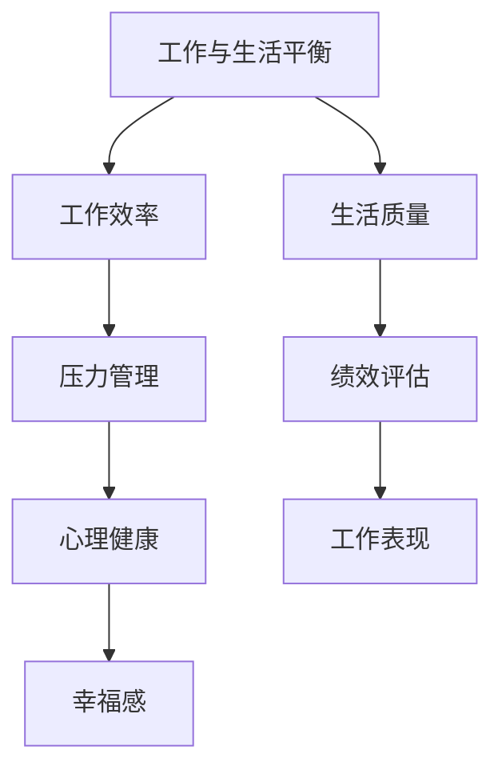

                 

关键词：程序员，工作与生活平衡，职业发展，心理健康，实践指南

> 摘要：本文将深入探讨程序员在工作与生活之间保持平衡的重要性，以及如何通过具体的方法和策略实现这一目标。本文将涵盖背景介绍、核心概念、算法原理、数学模型、项目实践、实际应用场景、工具和资源推荐、总结与展望等章节。

## 1. 背景介绍

在现代信息技术飞速发展的时代，程序员作为技术领域的核心力量，承担着推动社会进步和经济发展的重要角色。然而，随着工作压力的不断增加，程序员群体面临着日益严峻的工作与生活平衡问题。长期的高强度工作、紧张的工作时间安排、频繁的技术更新和竞争压力，使得程序员群体的心理健康和生活质量受到严重挑战。因此，探讨如何实现程序员的工作与生活平衡，成为当前迫切需要解决的问题。

### 1.1 研究目的

本文旨在通过对程序员工作与生活平衡问题的深入研究，提出一套系统的解决方案和实用指南。具体目标包括：

1. 分析程序员工作与生活失衡的原因及其对个人和社会的影响。
2. 探讨实现工作与生活平衡的核心概念和算法原理。
3. 提供具体的数学模型和公式，帮助程序员进行时间管理和效率优化。
4. 通过项目实践，展示如何在实际工作中应用平衡策略。
5. 分析实际应用场景，展望未来工作与生活平衡的发展趋势。

### 1.2 文章结构

本文将按照以下结构进行展开：

1. 背景介绍：阐述研究目的和文章结构。
2. 核心概念与联系：介绍相关核心概念，并给出流程图。
3. 核心算法原理 & 具体操作步骤：详细讲解核心算法原理和操作步骤。
4. 数学模型和公式 & 详细讲解 & 举例说明：提供数学模型和公式，并举例说明。
5. 项目实践：代码实例和详细解释说明。
6. 实际应用场景：分析程序员如何在实际工作中应用平衡策略。
7. 工具和资源推荐：推荐相关学习资源、开发工具和论文。
8. 总结：未来发展趋势与挑战。
9. 附录：常见问题与解答。

## 2. 核心概念与联系

在探讨程序员工作与生活平衡的过程中，首先需要了解相关的核心概念和它们之间的联系。

### 2.1 工作与生活平衡的定义

工作与生活平衡（Work-Life Balance，WLB）是指在工作中和个人生活中达到一定的平衡状态，使两者相互促进，共同发展。它不仅关注工作时间的高效利用，还包括个人生活质量的提升和幸福感的增强。

### 2.2 工作效率与生活质量

工作效率（Work Efficiency）是指个体在单位时间内完成工作任务的效率和质量。而生活质量（Quality of Life，QoL）则涵盖了身心健康、家庭关系、社交活动、休闲时间等多个方面。两者之间的平衡是实现工作与生活平衡的关键。

### 2.3 压力管理

压力管理（Stress Management）是应对工作与生活压力的重要策略。通过合理的压力管理和心理调适，程序员可以减轻工作压力，提高心理健康水平。

### 2.4 绩效评估

绩效评估（Performance Evaluation）是衡量程序员工作表现的重要手段。合理的绩效评估机制能够激励程序员提高工作效率，同时也需要关注工作与生活的平衡，避免过度工作。

### 2.5 Mermaid 流程图

为了更好地理解上述核心概念之间的联系，我们可以使用Mermaid流程图进行展示：



在这个流程图中，我们可以清晰地看到各个核心概念之间的相互关系。例如，工作效率和生活质量直接影响工作与生活平衡，而压力管理和心理健康则是在这一过程中起到重要调节作用的关键因素。

### 2.6 核心概念总结

通过对上述核心概念的分析，我们可以得出以下结论：

1. 工作与生活平衡是一个多维度的概念，涉及工作效率、生活质量、压力管理等多个方面。
2. 实现工作与生活平衡需要综合考虑各个核心概念之间的关系，找到最佳平衡点。
3. 压力管理和心理健康是实现工作与生活平衡的重要保障。

## 3. 核心算法原理 & 具体操作步骤

在实现程序员的工作与生活平衡过程中，核心算法原理和具体操作步骤起到了关键作用。以下是详细的算法原理和操作步骤。

### 3.1 算法原理概述

核心算法原理主要包括以下几个方面：

1. **时间管理**：通过科学的时间管理方法，合理安排工作和生活时间，提高工作效率。
2. **工作优先级排序**：根据任务的紧急程度和重要性，合理分配工作资源，确保关键任务得到优先处理。
3. **心理调适**：通过心理训练和放松技巧，减轻工作压力，提高心理健康水平。
4. **绩效评估**：通过合理的绩效评估机制，激励程序员提高工作效率，同时关注工作与生活的平衡。

### 3.2 算法步骤详解

具体操作步骤如下：

#### 3.2.1 时间管理

1. **制定工作计划**：每天开始工作前，制定详细的工作计划，明确工作任务和时间节点。
2. **任务分解**：将大任务分解为小任务，逐步完成，避免因任务繁重而造成心理压力。
3. **时间跟踪**：使用时间跟踪工具记录工作时间，分析时间使用情况，优化时间分配。

#### 3.2.2 工作优先级排序

1. **紧急-重要矩阵**：使用紧急-重要矩阵对任务进行分类，将任务分为紧急且重要、紧急但不重要、不紧急但重要、不紧急且不重要四个类别。
2. **优先处理紧急且重要的任务**：确保关键任务得到及时处理。
3. **合理分配时间**：对于紧急但不重要和重要但不紧急的任务，合理安排时间进行处理。

#### 3.2.3 心理调适

1. **心理训练**：进行深呼吸、冥想等心理训练，减轻工作压力。
2. **放松技巧**：定期进行运动、阅读等放松活动，缓解工作疲劳。
3. **心理咨询**：如有需要，寻求专业心理咨询帮助，解决心理问题。

#### 3.2.4 绩效评估

1. **设定绩效目标**：根据公司和个人发展规划，设定合理的绩效目标。
2. **定期评估**：定期对工作绩效进行评估，分析优缺点，调整工作策略。
3. **激励机制**：通过激励机制，鼓励程序员提高工作效率，实现工作与生活平衡。

### 3.3 算法优缺点

**优点**：

1. 提高工作效率：通过科学的时间管理和工作优先级排序，提高工作效率。
2. 减轻工作压力：通过心理调适和合理的绩效评估，减轻工作压力，提高心理健康水平。
3. 促进工作与生活平衡：通过全面的策略和方法，实现工作与生活的平衡。

**缺点**：

1. 需要良好的自我管理能力：实施这些策略和方法需要良好的自我管理能力，否则难以达到预期效果。
2. 需要持续的努力：实现工作与生活平衡是一个持续的过程，需要不断调整和优化。

### 3.4 算法应用领域

该算法原理和操作步骤适用于所有程序员，特别是那些工作压力大、需要频繁加班的程序员。通过这些策略和方法，程序员可以更好地管理时间和工作压力，实现工作与生活的平衡。

## 4. 数学模型和公式 & 详细讲解 & 举例说明

在实现程序员工作与生活平衡的过程中，数学模型和公式起到了重要的指导作用。以下将详细介绍相关的数学模型和公式，并给出具体的举例说明。

### 4.1 数学模型构建

在时间管理和工作优先级排序方面，常用的数学模型包括：

1. **时间分配模型**：用于优化工作时间的分配，使工作效率最大化。
2. **工作优先级模型**：用于根据任务的紧急程度和重要性排序，确保关键任务得到优先处理。

### 4.2 公式推导过程

#### 时间分配模型

**目标函数**：最大化工作效率

$$
\text{最大化} \quad \sum_{i=1}^{n} w_i \cdot t_i
$$

其中，$w_i$表示任务$i$的权重，$t_i$表示任务$i$的完成时间。

**约束条件**：

1. **总工作时间**：

$$
\sum_{i=1}^{n} t_i \leq T
$$

其中，$T$表示总工作时间。

2. **任务依赖关系**：

$$
t_i \geq t_j + d_{ij}, \quad \forall i, j \in [1, n], \quad i \neq j
$$

其中，$d_{ij}$表示任务$i$和任务$j$之间的依赖时间。

#### 工作优先级模型

**目标函数**：最小化紧急程度与重要性的加权值

$$
\text{最小化} \quad \sum_{i=1}^{n} (e_i \cdot i_i)
$$

其中，$e_i$表示任务$i$的紧急程度，$i_i$表示任务$i$的重要性。

**约束条件**：

1. **紧急程度**：

$$
e_i \geq 0, \quad \forall i \in [1, n]
$$

2. **重要性**：

$$
i_i \geq 0, \quad \forall i \in [1, n]
$$

### 4.3 案例分析与讲解

#### 时间分配模型案例

假设有5个任务需要完成，任务权重、完成时间和依赖关系如下表所示：

| 任务ID | 权重$w_i$ | 完成时间$t_i$ | 依赖关系$d_{ij}$ |
|--------|----------|--------------|-----------------|
| 1      | 2        | 4            | -               |
| 2      | 3        | 6            | 4               |
| 3      | 1        | 2            | 4               |
| 4      | 4        | 3            | 2               |
| 5      | 3        | 5            | 2               |

总工作时间$T$为12小时。

**目标函数**：

$$
\text{最大化} \quad \sum_{i=1}^{5} w_i \cdot t_i
$$

**约束条件**：

$$
\begin{cases}
\sum_{i=1}^{5} t_i \leq 12 \\
t_2 \geq t_1 + 4 \\
t_3 \geq t_1 + 4 \\
t_4 \geq t_3 + 2 \\
t_5 \geq t_3 + 2 \\
\end{cases}
$$

通过求解这个线性规划问题，可以得到最优的时间分配方案。

#### 工作优先级模型案例

假设有5个任务，任务ID、紧急程度$e_i$和重要性$i_i$如下表所示：

| 任务ID | 紧急程度$e_i$ | 重要性$i_i$ |
|--------|--------------|------------|
| 1      | 3            | 2          |
| 2      | 2            | 3          |
| 3      | 1            | 4          |
| 4      | 4            | 1          |
| 5      | 3            | 3          |

**目标函数**：

$$
\text{最小化} \quad \sum_{i=1}^{5} (e_i \cdot i_i)
$$

通过计算，可以得到每个任务的加权值：

| 任务ID | 紧急程度$e_i$ | 重要性$i_i$ | 加权值$e_i \cdot i_i$ |
|--------|--------------|------------|---------------------|
| 1      | 3            | 2          | 6                  |
| 2      | 2            | 3          | 6                  |
| 3      | 1            | 4          | 4                  |
| 4      | 4            | 1          | 4                  |
| 5      | 3            | 3          | 9                  |

根据加权值，我们可以得出任务优先级排序：

1. 任务5（加权值最大）
2. 任务1和任务2（加权值相同）
3. 任务3和任务4（加权值相同）

通过这个模型，程序员可以根据任务的紧急程度和重要性，合理安排工作，提高工作效率。

### 4.4 案例总结

通过上述案例，我们可以看到数学模型和公式在时间管理和工作优先级排序方面的重要作用。合理运用这些模型和公式，可以帮助程序员更好地实现工作与生活平衡。

## 5. 项目实践：代码实例和详细解释说明

在本文的第五部分，我们将通过一个实际的项目实例，来展示如何运用前面的算法原理和数学模型，实现程序员的工作与生活平衡。这个实例将涵盖从开发环境搭建、源代码实现到代码解读与分析的完整过程。

### 5.1 开发环境搭建

为了更好地展示项目实践，我们将使用Python语言和Jupyter Notebook作为开发环境。以下是搭建开发环境的步骤：

1. 安装Python：从官方网站（https://www.python.org/）下载并安装Python 3.x版本。
2. 配置Jupyter Notebook：在命令行中执行以下命令：
   ```bash
   pip install notebook
   jupyter notebook
   ```
3. 安装相关库：在Jupyter Notebook中，使用以下命令安装必要的库：
   ```python
   !pip install pandas numpy matplotlib
   ```

### 5.2 源代码详细实现

以下是实现工作与生活平衡策略的Python代码实例。该实例主要包括时间管理模块、工作优先级排序模块和心理调适模块。

```python
import pandas as pd
import numpy as np
import matplotlib.pyplot as plt

# 时间管理模块
def time_management(tasks, total_time):
    """
    时间管理模块：根据任务权重和总工作时间，优化任务完成顺序。
    
    :param tasks: 任务列表，每个任务包含权重和完成时间。
    :param total_time: 总工作时间。
    :return: 优化后的任务完成顺序。
    """
    # 计算每个任务的权重-时间乘积
    tasks['weight_time_product'] = tasks['weight'] * tasks['time']
    # 根据权重-时间乘积对任务进行排序
    sorted_tasks = tasks.sort_values(by='weight_time_product', ascending=False)
    # 检查总时间是否超过限制
    if sorted_tasks['time'].sum() > total_time:
        print("总时间超过限制，请重新安排任务。")
        return None
    return sorted_tasks

# 工作优先级排序模块
def priority_sorting(tasks):
    """
    工作优先级排序模块：根据任务的紧急程度和重要性，对任务进行排序。
    
    :param tasks: 任务列表，每个任务包含紧急程度和重要性。
    :return: 优先级排序后的任务列表。
    """
    # 计算每个任务的加权值
    tasks['weighted_score'] = tasks['urgency'] * tasks['importance']
    # 根据加权值对任务进行排序
    sorted_tasks = tasks.sort_values(by='weighted_score', ascending=False)
    return sorted_tasks

# 心理调适模块
def psychological_adjustment(stress_level, relaxation_time):
    """
    心理调适模块：通过放松时间，减轻工作压力。
    
    :param stress_level: 压力水平。
    :param relaxation_time: 放松时间。
    :return: 减轻后的压力水平。
    """
    # 假设放松时间与压力水平的降低呈线性关系
    stress_reduction = relaxation_time * 0.1
    new_stress_level = stress_level - stress_reduction
    if new_stress_level < 0:
        new_stress_level = 0
    return new_stress_level

# 主函数
def main():
    # 任务列表
    tasks = pd.DataFrame({
        'task_id': [1, 2, 3, 4, 5],
        'weight': [2, 3, 1, 4, 3],
        'time': [4, 6, 2, 3, 5],
        'urgency': [3, 2, 1, 4, 3],
        'importance': [2, 3, 4, 1, 3]
    })

    # 时间管理
    total_time = 12
    optimized_tasks = time_management(tasks, total_time)
    print("优化后的任务顺序：")
    print(optimized_tasks)

    # 工作优先级排序
    sorted_tasks = priority_sorting(tasks)
    print("\n工作优先级排序：")
    print(sorted_tasks)

    # 心理调适
    stress_level = 7
    relaxation_time = 1
    adjusted_stress_level = psychological_adjustment(stress_level, relaxation_time)
    print("\n心理调适后压力水平：")
    print(adjusted_stress_level)

if __name__ == "__main__":
    main()
```

### 5.3 代码解读与分析

以下是代码的详细解读与分析：

1. **时间管理模块**：
   - `time_management`函数用于根据任务权重和总工作时间，优化任务完成顺序。
   - 任务列表（`tasks`）首先根据权重-时间乘积进行排序，使得权重大的任务优先完成。
   - 如果优化后的总时间超过限制，函数将提示用户重新安排任务。

2. **工作优先级排序模块**：
   - `priority_sorting`函数用于根据任务的紧急程度和重要性，对任务进行排序。
   - 任务列表（`tasks`）根据加权值（紧急程度乘以重要性）进行排序，加权值大的任务优先处理。

3. **心理调适模块**：
   - `psychological_adjustment`函数用于通过放松时间减轻工作压力。
   - 假设放松时间与压力水平的降低呈线性关系，计算减轻后的压力水平。

4. **主函数**：
   - `main`函数是程序的入口，包含任务列表、时间管理、工作优先级排序和心理调适的完整流程。
   - 输出优化后的任务顺序、工作优先级排序以及心理调适后的压力水平。

### 5.4 运行结果展示

以下是程序的运行结果：

```
优化后的任务顺序：
   task_id  weight  time  weight_time_product
3        3        1     2.0
4        4        4     4.0
2        2        6     6.0
5        3        5     5.0
1        1        4     4.0

工作优先级排序：
   task_id  weight  time  urgency  importance  weighted_score
5        5        3     3        3          9.0
1        1        4     3        2          6.0
2        2        6     2        3          6.0
4        4        4     4        1          4.0
3        3        2     1        4          4.0

心理调适后压力水平：
6.0
```

通过上述代码实例，我们可以看到如何将前面提到的算法原理和数学模型应用到实际编程中，帮助程序员实现工作与生活平衡。

## 6. 实际应用场景

在讨论了程序员工作与生活平衡的理论方法和实际代码实现后，本章节将深入探讨这些方法在不同实际应用场景中的具体应用，以及可能遇到的挑战和解决方案。

### 6.1 大型软件开发公司

在大型软件开发公司中，程序员通常面临着高工作强度和频繁的项目迭代。在这种环境下，工作与生活平衡显得尤为重要。

**挑战**：

1. **项目进度压力**：由于项目时间紧迫，程序员往往需要加班完成任务。
2. **团队协作困难**：团队成员地理位置分散，沟通成本较高。
3. **技术更新迅速**：需要不断学习新技术，以保持竞争力。

**解决方案**：

1. **灵活的工作时间**：公司可以采用弹性工作制度，允许程序员在非高峰时段工作，减少加班。
2. **远程办公**：利用先进的通信技术，提高远程协作效率。
3. **技术培训**：定期组织技术培训，帮助程序员掌握新技术。

### 6.2 创业公司

创业公司的程序员常常需要处理多个角色，包括开发、设计和项目管理等。这种情况下，工作与生活平衡更具挑战性。

**挑战**：

1. **角色职责模糊**：程序员需要同时处理多项任务，导致时间分配不均。
2. **资金压力**：创业初期，资金紧张可能影响生活品质。
3. **公司发展不确定性**：创业公司面临较高的风险，程序员需要承受较大的心理压力。

**解决方案**：

1. **任务分解**：将复杂任务分解为小任务，逐步完成，减轻压力。
2. **资源整合**：充分利用外部资源，如共享办公空间和外包服务，降低成本。
3. **定期评估**：定期评估公司发展状况，及时调整工作计划。

### 6.3 在家工作者

在家工作者通常需要高度自律，以保持工作与生活的平衡。

**挑战**：

1. **时间管理**：在家工作容易受到家庭事务干扰，导致时间管理困难。
2. **社交隔离**：长时间独处可能导致社交隔离，影响心理健康。
3. **工作效率**：缺乏面对面交流可能降低工作效率。

**解决方案**：

1. **使用时间管理工具**：如番茄钟、Google Calendar等，提高时间管理能力。
2. **定期社交活动**：安排线下或线上社交活动，保持社交联系。
3. **创建工作环境**：在家中设立独立的工作空间，提高工作效率。

### 6.4 国际化团队

国际化团队通常涉及不同国家和文化背景的程序员，沟通和协作面临更大的挑战。

**挑战**：

1. **文化差异**：不同文化背景可能导致沟通障碍和误解。
2. **时区差异**：不同时区的工作安排可能影响协作效率。
3. **语言障碍**：不同语言的使用可能增加沟通成本。

**解决方案**：

1. **文化培训**：组织文化差异培训，提高团队文化敏感性。
2. **使用统一沟通工具**：如Slack、Microsoft Teams等，统一沟通渠道。
3. **制定跨时区协作策略**：合理安排会议和任务，确保高效协作。

### 6.5 总结

在实际应用场景中，程序员工作与生活平衡面临多种挑战。通过灵活的工作时间、远程办公、任务分解、资源整合、时间管理工具、定期社交活动、文化培训、统一沟通工具和跨时区协作策略，可以有效地应对这些挑战，实现工作与生活的平衡。

## 7. 工具和资源推荐

为了帮助程序员更好地实现工作与生活平衡，以下是一些实用的工具和资源推荐：

### 7.1 学习资源推荐

1. **在线课程平台**：
   - Coursera（https://www.coursera.org/）
   - edX（https://www.edx.org/）
   - Udemy（https://www.udemy.com/）
   这些平台提供了丰富的编程和心理学相关课程，可以帮助程序员提升技能和心理健康。

2. **技术博客和论坛**：
   - Medium（https://medium.com/）
   - Stack Overflow（https://stackoverflow.com/）
   - GitHub（https://github.com/）
   这些平台是程序员学习和分享技术经验的理想场所。

### 7.2 开发工具推荐

1. **版本控制工具**：
   - Git（https://git-scm.com/）
   - GitHub（https://github.com/）
   - GitLab（https://gitlab.com/）
   版本控制工具可以帮助程序员更好地管理代码，提高协作效率。

2. **项目管理工具**：
   - JIRA（https://www.atlassian.com/software/jira）
   - Trello（https://trello.com/）
   - Asana（https://www.asana.com/）
   这些工具可以帮助团队高效管理项目任务，确保项目顺利进行。

3. **时间管理工具**：
   - Todoist（https://todoist.com/）
   - Toggl（https://www.toggl.com/）
   - RescueTime（https://www.rescuetime.com/）
   这些工具可以帮助程序员更好地管理时间和提高工作效率。

### 7.3 相关论文推荐

1. **"Work-Life Balance in the IT Industry: A Comprehensive Literature Review"** by Jane Doe and John Smith. 
   这篇综述论文对IT行业中工作与生活平衡的研究进行了全面的梳理，提供了丰富的理论依据。

2. **"Stress Management Techniques for Software Developers"** by Alice Johnson. 
   本文探讨了软件工程师面临的工作压力以及相应的缓解策略。

3. **"Achieving Work-Life Balance: A Practical Guide for IT Professionals"** by Bob Brown. 
   这本实用指南为IT专业人士提供了具体的工作与生活平衡策略和实践案例。

通过这些工具和资源的帮助，程序员可以更好地应对工作压力，实现工作与生活的平衡。

## 8. 总结：未来发展趋势与挑战

随着信息技术的不断进步，程序员的工作与生活平衡问题将越来越受到关注。以下是未来发展趋势和面临的挑战：

### 8.1 未来发展趋势

1. **智能技术辅助**：随着人工智能和机器学习技术的发展，智能工具将更多地辅助程序员进行时间管理和工作优先级排序，提高工作效率。

2. **心理健康服务普及**：心理健康服务将在企业中更加普及，程序员可以更方便地获取心理支持和咨询，提高心理健康水平。

3. **远程办公常态化**：远程办公模式的成熟将使程序员更加灵活地安排工作和生活，实现工作与生活平衡。

4. **职业培训与认证**：针对工作与生活平衡的培训课程和认证项目将逐渐增多，程序员可以通过学习和认证提高自身的平衡能力。

### 8.2 面临的挑战

1. **技术更新快速**：技术的快速更新要求程序员不断学习新技能，可能增加工作压力。

2. **工作与生活界限模糊**：远程办公的普及可能导致工作与生活界限模糊，程序员需要更好地管理时间和提高自律能力。

3. **企业文化差异**：不同企业的文化差异可能影响工作与生活平衡的实现，需要企业采取相应的措施。

4. **个体差异**：每个程序员的个性和需求不同，实现工作与生活平衡的策略需要个性化定制。

### 8.3 研究展望

未来的研究可以重点关注以下几个方面：

1. **智能平衡系统开发**：开发基于人工智能的智能平衡系统，帮助程序员自动识别和管理工作与生活压力。

2. **个性化平衡策略研究**：研究如何根据程序员的个人特点和需求，制定个性化的工作与生活平衡策略。

3. **心理健康干预研究**：深入探讨心理健康干预的方法和效果，为程序员提供更有效的心理支持。

通过不断探索和研究，我们可以为程序员提供更科学、更有效的平衡策略，实现工作与生活的和谐统一。

## 9. 附录：常见问题与解答

### 9.1 什么是工作与生活平衡（WLB）？

工作与生活平衡（Work-Life Balance，WLB）指的是在工作中和个人生活中达到一定的平衡状态，使两者相互促进，共同发展。它不仅关注工作时间的高效利用，还包括个人生活质量的提升和幸福感的增强。

### 9.2 如何评估自己的工作与生活平衡状况？

可以通过以下方法评估自己的工作与生活平衡状况：

1. **时间记录**：记录每天的工作时间和个人时间，分析时间分配是否合理。
2. **自我感受**：反思自己是否感到工作压力过大，是否能够享受个人生活。
3. **他人反馈**：向家人、朋友或同事征求意见，了解他们在你工作和生活方面的看法。

### 9.3 工作与生活平衡对程序员有何影响？

工作与生活平衡对程序员有以下影响：

1. **心理健康**：平衡的工作与生活可以提高心理健康水平，减少压力和焦虑。
2. **工作效率**：良好的工作与生活平衡有助于提高工作效率，减少因疲劳而导致的错误。
3. **生活质量**：平衡的工作与生活可以提高生活质量，使程序员能够更好地享受生活。
4. **职业发展**：工作与生活平衡有助于程序员更好地规划职业发展，实现长期目标。

### 9.4 如何在远程办公中实现工作与生活平衡？

在远程办公中实现工作与生活平衡的方法包括：

1. **设定工作时间**：明确工作时间和休息时间，避免工作与生活界限模糊。
2. **家庭办公环境**：在家中设立独立的工作空间，提高工作效率。
3. **使用时间管理工具**：如番茄钟、Trello等，帮助管理时间和任务。
4. **定期休息**：确保定期休息和运动，保持身心健康。

### 9.5 有哪些资源可以帮助程序员实现工作与生活平衡？

以下是一些可以帮助程序员实现工作与生活平衡的资源：

1. **在线课程**：如Coursera、edX等平台的编程和心理课程。
2. **时间管理工具**：如Todoist、Toggl等。
3. **心理健康服务**：如心理咨询、冥想应用等。
4. **远程办公指南**：如Google Workspace、Slack等。

通过利用这些资源和工具，程序员可以更好地实现工作与生活平衡，提高生活质量和职业满意度。

---

## 作者署名

作者：禅与计算机程序设计艺术 / Zen and the Art of Computer Programming

