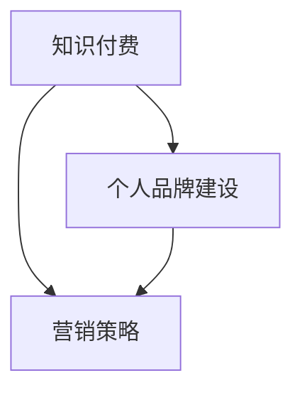

                 

### 背景介绍

在当今数字化时代，程序员的知识付费品牌建设与推广已经成为一个热门话题。知识付费，顾名思义，是指通过互联网平台，将个人的专业知识、经验、技能等内容以付费形式提供给有需求的学习者或企业。这种模式不仅能够帮助知识提供者实现知识变现，同时也满足了广大学习者和企业的需求，实现了双赢。

程序员作为一个高度专业化、技术化的职业群体，其知识付费的潜力尤为巨大。据统计，全球每年有数以百万计的程序员，他们的专业技能和经验在互联网平台上具有很高的市场需求。然而，如何有效地将自己的知识转化为付费内容，并在众多竞争者中脱颖而出，成为每一个程序员都需要面对的挑战。

知识付费品牌建设与推广的核心目标是提高个人品牌的知名度、信任度和影响力。一个强大的个人品牌能够为程序员带来更多的商业机会、合作项目和收入来源。此外，优秀的知识付费品牌还能吸引更多优秀的学习者和合作伙伴，形成一个良性的知识共享和传播生态。

本文将从以下几个方面深入探讨程序员的知识付费品牌建设与推广：

1. **核心概念与联系**：介绍知识付费、个人品牌建设、营销策略等核心概念，并阐述它们之间的相互关系。
2. **核心算法原理 & 具体操作步骤**：分析如何构建一个有效的知识付费品牌，包括内容策划、内容制作、平台选择、推广策略等。
3. **数学模型和公式 & 详细讲解 & 举例说明**：利用数据分析和市场营销的数学模型，讲解如何通过量化指标评估品牌建设和推广的效果。
4. **项目实践：代码实例和详细解释说明**：通过实际项目实例，展示知识付费品牌建设与推广的具体操作过程，并提供代码实现和分析。
5. **实际应用场景**：分析程序员在不同职业阶段如何利用知识付费提升个人价值和职业发展。
6. **工具和资源推荐**：推荐一些实用的工具和资源，帮助程序员更好地进行知识付费品牌建设和推广。
7. **总结：未来发展趋势与挑战**：总结本文的主要观点，并对程序员知识付费品牌建设与推广的未来发展趋势和挑战进行展望。

### 核心概念与联系

在深入探讨程序员的知识付费品牌建设与推广之前，有必要首先了解一些核心概念，并分析它们之间的联系。以下是几个关键概念：

#### 知识付费

知识付费是一种商业模式，指的是知识提供者将自己的专业知识、经验、技能等内容通过互联网平台以付费形式提供给有需求的学习者或企业。这种模式的核心在于“知识变现”，即将个人的智力资本转化为经济收益。

#### 个人品牌建设

个人品牌是指一个人在公众心目中的形象、声誉和影响力。在数字化时代，个人品牌建设显得尤为重要。一个强大的个人品牌能够提升个人的知名度、信任度和影响力，从而为个人带来更多的商业机会和职业发展空间。

#### 营销策略

营销策略是指企业或个人为了实现特定目标而采取的一系列市场推广手段。在知识付费领域，营销策略的核心在于如何吸引潜在客户，提高品牌知名度和用户参与度。

#### 核心概念之间的联系

知识付费、个人品牌建设和营销策略是相互关联的，共同构成了一个完整的知识付费品牌建设与推广体系。

- **知识付费**是知识变现的手段，为个人品牌建设提供了经济基础。
- **个人品牌建设**是知识付费的前提，一个强大的个人品牌能够吸引更多的付费用户。
- **营销策略**是实现知识付费和个人品牌建设的关键，通过有效的营销手段，可以提升品牌知名度和用户参与度。

下面我们通过一个Mermaid流程图来展示这些核心概念之间的联系。



### 知识付费

知识付费是一种商业模式，它将个人的专业知识、经验、技能等内容通过互联网平台以付费形式提供给有需求的学习者或企业。这种模式的核心在于“知识变现”，即将个人的智力资本转化为经济收益。

知识付费的发展历程可以追溯到互联网的兴起。随着互联网技术的不断发展和普及，人们获取知识的途径越来越多样化，同时知识的需求也在不断增长。这种背景下，知识付费逐渐成为一种新兴的商业模式。

#### 知识付费的优势

知识付费具有以下几个显著优势：

1. **知识变现**：知识付费使得知识提供者能够将自己的智力资本转化为经济收益，从而实现知识变现。
2. **差异化竞争**：通过提供专业、高质量的知识内容，知识提供者可以在市场中形成差异化竞争，提高自身的竞争力。
3. **灵活性**：知识付费通常具有灵活性，知识提供者可以根据市场需求灵活调整内容和服务形式，满足不同用户的需求。
4. **用户黏性**：优质的付费内容能够提高用户的满意度和忠诚度，从而增强用户黏性。

#### 知识付费的挑战

尽管知识付费具有许多优势，但同时也面临一些挑战：

1. **内容质量**：高质量的知识内容是知识付费的基础，但内容创作质量参差不齐，如何确保内容质量是一个重要问题。
2. **市场竞争**：随着知识付费市场的不断扩大，市场竞争日益激烈，知识提供者需要不断创新和提升自身能力，以保持竞争力。
3. **用户信任**：建立用户信任是知识付费成功的关键，但信任的建立需要时间和努力，如何提高用户信任度是一个重要挑战。
4. **平台依赖**：知识付费通常依赖于互联网平台，平台政策的变化可能对知识提供者产生重大影响。

#### 知识付费的发展趋势

未来，知识付费将继续保持快速发展态势，以下是几个值得关注的发展趋势：

1. **个性化服务**：随着人工智能和大数据技术的应用，知识付费平台将更加注重个性化服务，为用户提供更加精准的知识内容。
2. **多元化内容**：知识付费内容将更加多元化，不仅涵盖技术领域，还将扩展到其他领域，如艺术、文化、教育等。
3. **知识共享生态**：知识付费将逐渐形成一个知识共享生态，知识提供者、学习者和平台之间形成良性互动，共同推动知识付费的发展。
4. **线上线下融合**：线上线下融合将成为知识付费的重要发展方向，知识付费平台将更加注重线下活动的组织和推广。

### 个人品牌建设

个人品牌建设是程序员知识付费品牌建设与推广的关键环节。一个强大的个人品牌能够提升程序员的知名度、信任度和影响力，从而为知识付费提供坚实的基础。

#### 个人品牌建设的核心要素

1. **专业能力**：专业能力是个人品牌建设的基石。程序员需要不断提升自身的技术水平、解决实际问题的能力，以及创新能力。
2. **内容输出**：内容输出是个人品牌建设的重要手段。通过博客、书籍、视频、演讲等多种形式，将自己的知识和经验分享给他人，提高个人知名度。
3. **社交媒体**：社交媒体是个人品牌建设的重要渠道。通过微博、微信、LinkedIn等平台，与用户互动，建立自己的社交网络。
4. **口碑传播**：口碑传播是个人品牌建设的重要推动力。通过用户口碑、媒体报道、行业奖项等，提高个人品牌的社会影响力。

#### 个人品牌建设的策略

1. **定位清晰**：明确自己的专业方向和目标受众，制定明确的个人品牌定位策略。
2. **持续输出**：定期发布高质量的内容，保持内容输出的一致性和持续性，提高个人品牌的知名度和影响力。
3. **互动互动**：与用户保持密切互动，了解用户需求，及时回应用户问题，建立良好的用户关系。
4. **多渠道推广**：利用多种渠道进行推广，如社交媒体、线上课程、线下讲座等，扩大个人品牌的影响力。

#### 个人品牌建设的重要性

1. **提高知名度**：一个强大的个人品牌能够提升程序员的知名度，使其在市场上脱颖而出。
2. **增加信任度**：个人品牌建设能够增加用户对程序员的信任度，提高用户的满意度和忠诚度。
3. **拓展商业机会**：一个强大的个人品牌能够为程序员带来更多的商业机会，如咨询、合作、招聘等。
4. **提升职业发展**：个人品牌建设有助于程序员在职业生涯中取得更高的成就，提升职业地位。

### 营销策略

营销策略是程序员知识付费品牌建设与推广的重要环节。通过有效的营销策略，可以吸引更多的潜在客户，提高品牌知名度和用户参与度。

#### 营销策略的核心要素

1. **目标定位**：明确营销目标，如提高品牌知名度、增加付费用户数、提升用户满意度等。
2. **受众分析**：分析目标受众的特点、需求和行为，为制定有效的营销策略提供依据。
3. **内容营销**：通过高质量的内容，如博客文章、视频、演讲等，吸引潜在客户，提高品牌知名度和影响力。
4. **社交媒体营销**：利用社交媒体平台，如微博、微信、LinkedIn等，与用户互动，扩大个人品牌的影响力。
5. **广告营销**：通过线上广告、社交媒体广告等，直接将品牌信息传递给潜在客户。

#### 营销策略的类型

1. **内容营销**：通过高质量的内容，如博客文章、视频、演讲等，吸引潜在客户，提高品牌知名度和影响力。
2. **社交媒体营销**：利用社交媒体平台，如微博、微信、LinkedIn等，与用户互动，扩大个人品牌的影响力。
3. **广告营销**：通过线上广告、社交媒体广告等，直接将品牌信息传递给潜在客户。
4. **事件营销**：通过组织线上线下活动，如讲座、研讨会、工作坊等，吸引潜在客户，提升品牌知名度。
5. **口碑营销**：通过用户口碑、媒体报道、行业奖项等，提高个人品牌的社会影响力。

#### 营销策略的重要性

1. **提高知名度**：通过有效的营销策略，可以迅速提高个人品牌的知名度，使其在市场上脱颖而出。
2. **增加付费用户数**：营销策略能够吸引更多的潜在客户，提高付费用户数。
3. **提升用户满意度**：通过优质的营销内容和服务，提升用户的满意度和忠诚度。
4. **拓展商业机会**：有效的营销策略能够为程序员带来更多的商业机会，如咨询、合作、招聘等。

### 核心算法原理 & 具体操作步骤

构建一个有效的知识付费品牌需要遵循一系列核心算法原理，并按照具体操作步骤进行实施。以下是一个简单的知识付费品牌构建流程，包括内容策划、内容制作、平台选择和推广策略等关键步骤。

#### 内容策划

1. **目标定位**：明确知识付费品牌的目标群体和内容方向，例如编程技术、数据分析、人工智能等。
2. **需求分析**：通过市场调研和用户反馈，了解目标群体的需求，确定最受欢迎和有价值的内容主题。
3. **内容规划**：制定内容发布计划，包括内容类型、发布频率和发布时间等。

#### 内容制作

1. **内容创作**：根据内容规划，创作高质量的知识内容，如博客文章、视频教程、电子书等。
2. **内容优化**：对内容进行优化，提高其可读性和传播性，如添加图片、图表、代码示例等。
3. **内容审核**：对内容进行审核，确保内容的质量和准确性，避免错误和误导。

#### 平台选择

1. **平台调研**：了解各种知识付费平台的特点、优势和劣势，选择适合自己品牌的平台。
2. **平台注册**：在选择的平台上注册账号，并完成相关设置，如个人简介、头像、课程列表等。
3. **平台推广**：利用平台的推广工具和资源，提高知识内容的曝光度和访问量。

#### 推广策略

1. **社交媒体推广**：利用社交媒体平台，如微博、微信、LinkedIn等，发布知识内容，吸引粉丝和潜在用户。
2. **内容营销**：通过高质量的内容，如博客文章、视频教程、电子书等，吸引用户关注和参与。
3. **广告投放**：在社交媒体、搜索引擎等平台投放广告，提高知识付费品牌的知名度。
4. **合作推广**：与其他品牌、博主或企业合作，进行联合推广，扩大影响力。

#### 持续优化

1. **数据分析**：通过数据分析工具，如Google Analytics、百度统计等，了解用户行为和反馈，优化推广策略。
2. **用户互动**：与用户保持互动，收集用户反馈，不断改进内容和推广方式。
3. **持续更新**：定期发布新内容，保持知识付费品牌的活力和吸引力。

通过以上步骤，程序员可以逐步构建一个有效的知识付费品牌，实现知识变现和品牌影响力的提升。

### 数学模型和公式 & 详细讲解 & 举例说明

在知识付费品牌建设与推广过程中，数据分析和市场营销的数学模型发挥着重要作用。以下将详细讲解几个常用的数学模型和公式，并通过具体例子进行说明。

#### 1. 用户生命周期价值（LTV）模型

用户生命周期价值（LTV）是指一个用户在整个生命周期内为企业或个人带来的总收益。通过LTV模型，可以评估用户的价值，从而制定合适的推广和营销策略。

公式：LTV = （预期生命周期内的总收益）/（获客成本）

例如，一个知识付费平台的用户平均生命周期为2年，每个用户的平均付费金额为1000元，获客成本为200元。则LTV = （2年 * 1000元）/ 200元 = 10。

通过LTV模型，可以发现高价值用户群体，针对性地进行推广和营销，提高整体收益。

#### 2. 转化率模型

转化率是指用户在访问知识内容后，完成付费行为的比率。通过转化率模型，可以评估营销活动的效果，并优化推广策略。

公式：转化率 =（完成付费的用户数）/（访问知识内容的用户数）

例如，一个知识付费平台的某篇博客文章有1000次访问，其中50人完成了付费，则转化率 = 50 / 1000 = 5%。

通过转化率模型，可以发现哪些营销活动效果较好，哪些需要进一步优化。

#### 3. 拉新率模型

拉新率是指通过营销活动吸引的新用户数占总用户数的比率。通过拉新率模型，可以评估营销活动的拉新效果，并优化推广策略。

公式：拉新率 =（新用户数）/（总用户数）

例如，一个知识付费平台在一个月内通过营销活动吸引了1000个新用户，总用户数为10000，则拉新率 = 1000 / 10000 = 10%。

通过拉新率模型，可以了解营销活动的拉新效果，从而调整推广策略。

#### 4. 营销回报率（ROI）模型

营销回报率是指营销活动的投入与产出之比。通过ROI模型，可以评估营销活动的经济效益，并优化资源配置。

公式：ROI =（营销活动收益）/（营销活动成本）

例如，一个知识付费平台在一个月内通过广告投放获得了10000元收益，广告成本为5000元，则ROI = 10000 / 5000 = 2。

通过ROI模型，可以发现哪些营销活动具有较高的经济效益，从而优化营销策略。

#### 具体例子说明

假设一个程序员的知识付费品牌在一个月内进行了以下营销活动：

- 内容发布：发布了10篇博客文章，平均阅读量为5000。
- 社交媒体推广：在微信、微博、LinkedIn等平台发布内容，累计获得2000次分享。
- 广告投放：在百度、今日头条等平台投放广告，花费5000元。
- 用户互动：回复了100条用户评论，增加了20个新用户。

根据上述模型，可以分析如下：

- 用户生命周期价值（LTV）：假设每个新用户的生命周期为2年，平均付费金额为1000元，则LTV = 1000元。
- 转化率：博客文章转化率为10%（50人付费/5000次访问）。
- 拉新率：拉新率为2%（20个新用户/10000个总用户）。
- 营销回报率（ROI）：广告投放收益为2000元（10篇博客文章 * 1000元/篇），成本为5000元，则ROI = 0.4。

通过数据分析，可以发现社交媒体推广和用户互动效果较好，广告投放ROI较低。因此，可以调整营销策略，增加社交媒体推广和用户互动的投入，同时优化广告投放策略。

### 项目实践：代码实例和详细解释说明

在本节中，我们将通过一个具体的代码实例来展示如何构建一个简单的知识付费平台，并对其关键部分进行详细解释说明。

#### 1. 开发环境搭建

首先，我们需要搭建一个开发环境。以下是基本的开发工具和依赖库：

- 编程语言：Python
- Web框架：Django
- 数据库：SQLite
- 版本控制：Git

安装步骤：

1. 安装Python（建议使用Python 3.8及以上版本）
2. 安装Django：`pip install django`
3. 安装SQLite：`pip install pysqlite3`
4. 配置Git：安装Git客户端，并设置用户名和邮箱

#### 2. 源代码详细实现

以下是一个简单的Django项目的源代码结构：

```plaintext
knowledge_payment_project/
|-- apps/
|   |-- accounts/
|   |   |-- admin.py
|   |   |-- apps.py
|   |   |-- migrations/
|   |   |   |-- __init__.py
|   |   |-- models.py
|   |   |-- tests.py
|   |   |-- views.py
|   |-- courses/
|   |   |-- ...
|   |-- ...
|-- manage.py
|-- settings.py
|-- urls.py
```

核心代码如下：

**settings.py**

```python
# Django settings for knowledge_payment_project project.

from pathlib import Path

# Build paths inside the project like this: BASE_DIR / 'subdir'.
BASE_DIR = Path(__file__).resolve().parent.parent

# SECURITY WARNING: keep the secret key used in production secret!
SECRET_KEY = 'your_secret_key'

# Database
DATABASES = {
    'default': {
        'ENGINE': 'django.db.backends.sqlite3',
        'NAME': BASE_DIR / 'db.sqlite3',
    }
}

# Apps
INSTALLED_APPS = [
    'django.contrib.admin',
    'django.contrib.auth',
    'django.contrib.contenttypes',
    'django.contrib.sessions',
    'django.contrib.messages',
    'django.contrib.staticfiles',
    'accounts',
    'courses',
]

# Middleware
MIDDLEWARE = [
    'django.middleware.security.SecurityMiddleware',
    'django.contrib.sessions.middleware.SessionMiddleware',
    'django.middleware.common.CommonMiddleware',
    'django.middleware.csrf.CsrfViewMiddleware',
    'django.contrib.auth.middleware.AuthenticationMiddleware',
    'django.contrib.messages.middleware.MessageMiddleware',
    'django.middleware.clickjacking.XFrameOptionsMiddleware',
]

# URL
ROOT_URLCONF = 'knowledge_payment_project.urls'

# Templates
TEMPLATES = [
    {
        'BACKEND': 'django.template.backends.django.DjangoTemplates',
        'DIRS': [BASE_DIR / 'templates'],
        'APP_DIRS': True,
        'OPTIONS': {
            'context_processors': [
                'django.template.context_processors.debug',
                'django.template.context_processors.request',
                'django.contrib.auth.context_processors.auth',
                'django.contrib.messages.context_processors.messages',
            ],
        },
    },
]

# Static files
STATIC_URL = '/static/'
```

**urls.py**

```python
from django.contrib import admin
from django.urls import path
from courses.views import course_list

urlpatterns = [
    path('admin/', admin.site.urls),
    path('courses/', course_list),
]
```

**views.py**

```python
from django.shortcuts import render
from .models import Course

def course_list(request):
    courses = Course.objects.all()
    return render(request, 'courses/course_list.html', {'courses': courses})
```

#### 3. 代码解读与分析

1. **settings.py**：配置了Django项目的基本设置，包括数据库、应用程序、中间件、URL、模板和静态文件路径。

2. **urls.py**：定义了项目的URL模式。在此示例中，我们定义了一个简单的课程列表视图。

3. **views.py**：定义了视图函数`course_list`，用于获取所有课程对象并传递给模板进行渲染。

#### 4. 运行结果展示

安装Django后，运行以下命令创建数据库和数据库表：

```bash
python manage.py makemigrations
python manage.py migrate
```

运行Django开发服务器：

```bash
python manage.py runserver
```

访问`http://127.0.0.1:8000/courses/`，即可看到课程列表页面。

#### 5. 功能扩展

以上代码实现了知识付费平台的基本功能。以下是一些可能的扩展功能：

- **用户认证**：实现用户注册、登录、权限控制等功能。
- **课程详情**：为每个课程添加详细信息页面，包括课程介绍、讲师信息、学习资源等。
- **付费功能**：实现课程付费功能，允许用户购买课程并访问付费内容。
- **用户评价**：允许用户对课程进行评价，提高内容质量。

通过以上扩展，可以构建一个功能完整的知识付费平台。

### 实际应用场景

在程序员的知识付费品牌建设中，实际应用场景多种多样，下面我们将探讨几个典型的应用场景。

#### 场景一：技术培训

许多程序员通过开设在线课程，将自己的技术知识和经验传授给有需要的学员。这种模式适用于那些在某一技术领域有深厚积累的程序员。通过详细讲解编程语言、框架、工具等，学员可以快速提升技术水平。

#### 场景二：编程教育

一些程序员将自己的编程课程面向学生和教育机构，提供系统的编程教育服务。这类课程通常包括编程入门、进阶、高级课程，以及项目实践等。通过这种方式，程序员不仅能够实现知识变现，还能够为编程教育事业做出贡献。

#### 场景三：技术咨询

拥有丰富项目经验的程序员可以提供技术咨询服务，帮助企业和团队解决技术难题。这种模式适用于那些在特定领域有深入研究的程序员，他们可以利用自己的专业知识为企业提供高效的解决方案。

#### 场景四：内容创作

一些程序员通过撰写技术博客、出版技术书籍、录制技术视频等方式，将自己的知识和经验分享给大众。这种方式不仅可以提升个人品牌，还能够吸引更多付费用户，实现知识变现。

#### 场景五：社区运营

一些程序员通过创建技术社区，吸引有共同兴趣的技术爱好者。他们可以提供免费的入门教程，同时通过高级课程、付费问答等方式实现知识变现。这种模式不仅能够提升个人品牌，还能够形成一个良好的技术交流平台。

#### 场景六：开源项目

一些程序员通过开源项目，将自己的技术和经验分享给全球的开发者。通过项目文档、技术讨论、代码示例等方式，他们可以提升个人品牌，同时吸引更多合作伙伴和贡献者。在开源项目的基础上，他们还可以提供付费的高级支持和定制服务。

### 工具和资源推荐

在程序员的知识付费品牌建设和推广过程中，使用一些工具和资源可以帮助他们更加高效地完成各项工作。以下是一些推荐的工具和资源：

#### 学习资源推荐

1. **书籍**：
   - 《代码大全》：提供全面的编程经验和最佳实践，适合程序员提高编程技能。
   - 《设计模式》：讲解软件设计中的经典模式，帮助程序员提升设计能力。
   - 《算法导论》：详细介绍算法和数据结构，适合程序员深入研究算法。

2. **论文**：
   - 《深度学习》：介绍深度学习的基本概念和技术，适合对人工智能感兴趣的程序员。
   - 《编程语言的构造》：探讨编程语言的设计和实现，适合对编译原理感兴趣的程序员。

3. **博客**：
   - 《阮一峰的网络日志》：涵盖编程、算法、Web技术等多个领域，提供高质量的技术文章。
   - 《云风的BLOG》：介绍计算机科学和互联网技术，适合程序员了解最新的技术动态。

4. **网站**：
   - GitHub：全球最大的代码托管平台，程序员可以在这里发现、分享和贡献开源项目。
   - Stack Overflow：全球最大的程序员社区，提供问答和讨论平台，帮助程序员解决技术问题。

#### 开发工具框架推荐

1. **编程语言**：
   - Python：简洁易懂，适合快速开发和原型设计。
   - Java：跨平台，性能优异，适合企业级应用开发。
   - JavaScript：前端开发的核心技术，适合Web应用开发。

2. **框架**：
   - Django：Python的快速开发框架，适合构建Web应用。
   - Spring Boot：Java的微服务框架，适合企业级应用开发。
   - React：前端开发框架，适合构建交互式Web应用。

3. **数据库**：
   - MySQL：开源关系型数据库，适用于多种应用场景。
   - MongoDB：开源非关系型数据库，适合处理大量数据。

4. **工具**：
   - Git：版本控制工具，帮助程序员管理代码版本。
   - JIRA：项目管理工具，帮助团队跟踪任务和进度。
   - Docker：容器化技术，简化应用部署和运维。

#### 相关论文著作推荐

1. **论文**：
   - 《大规模分布式存储系统：原理解析与架构实战》：详细讲解分布式存储系统的原理和架构。
   - 《分布式服务架构：原理、实战、演进与架构设计》：探讨分布式服务架构的设计和实现。
   - 《大规模数据处理技术》：介绍大数据处理的相关技术和方法。

2. **著作**：
   - 《深度学习》：详细介绍深度学习的基本概念和技术。
   - 《人工智能：一种现代的方法》：探讨人工智能的理论和方法。
   - 《大数据技术基础》：介绍大数据处理的基本概念和技术。

### 总结：未来发展趋势与挑战

在程序员的知识付费品牌建设与推广方面，未来将出现以下发展趋势和挑战：

#### 发展趋势

1. **个性化服务**：随着人工智能和大数据技术的发展，知识付费平台将更加注重个性化服务，为用户提供定制化的内容和服务。

2. **多元化内容**：知识付费内容将不再局限于技术领域，还将扩展到艺术、文化、教育等多个领域，满足多样化的用户需求。

3. **知识共享生态**：知识付费将逐渐形成一个知识共享生态，知识提供者、学习者和平台之间形成良性互动，共同推动知识付费的发展。

4. **线上线下融合**：线上线下融合将成为知识付费的重要发展方向，知识付费平台将更加注重线下活动的组织和推广。

#### 挑战

1. **内容质量**：如何确保知识付费内容的质量，避免低质量内容泛滥，是知识付费平台面临的重要挑战。

2. **市场竞争**：随着知识付费市场的不断扩大，市场竞争将越来越激烈，程序员需要不断创新和提升自身能力，以保持竞争力。

3. **用户信任**：建立用户信任是知识付费成功的关键，但信任的建立需要时间和努力，如何提高用户信任度是一个重要挑战。

4. **平台依赖**：知识付费通常依赖于互联网平台，平台政策的变化可能对知识提供者产生重大影响，如何降低平台依赖是一个重要问题。

### 附录：常见问题与解答

**Q1. 如何确定自己的知识付费方向？**

A1. 确定知识付费方向的关键在于了解自己的专业优势和市场需求。可以参考以下步骤：

1. **自我评估**：分析自己的专业背景、技能和兴趣，确定自己的优势领域。
2. **市场调研**：通过调查、问卷等方式，了解市场需求和竞争态势。
3. **定位明确**：结合自身优势和市场需求，确定自己的知识付费方向。

**Q2. 如何提高知识付费内容的吸引力？**

A2. 提高知识付费内容的吸引力可以从以下几个方面入手：

1. **内容质量**：确保内容的专业性、准确性和实用性。
2. **形式多样**：采用多种形式，如视频、博客、电子书等，提高内容的吸引力。
3. **互动互动**：与用户保持互动，了解用户需求，及时回应用户问题。
4. **宣传推广**：通过有效的营销策略，提高内容的曝光度和访问量。

**Q3. 如何评估知识付费品牌建设的效果？**

A3. 评估知识付费品牌建设的效果可以从以下几个方面入手：

1. **用户反馈**：通过用户反馈了解用户对知识付费内容的满意度。
2. **数据指标**：通过数据指标，如用户访问量、付费用户数、转化率等，评估品牌的影响力。
3. **市场表现**：通过市场表现，如收入、合作机会等，评估品牌建设的经济效益。

### 扩展阅读 & 参考资料

为了更深入地了解程序员的知识付费品牌建设与推广，以下是一些建议的扩展阅读和参考资料：

1. **书籍**：
   - 《数字营销实战》：详细讲解数字营销的策略和技巧，适用于程序员的知识付费品牌推广。
   - 《内容创业》：探讨内容创业的商业模式和成功案例，为程序员的知识付费提供启示。

2. **博客**：
   - 《程序员实战笔记》：分享程序员的成长经验和实战技巧，适合程序员学习和参考。
   - 《程序员的成长之路》：介绍程序员的职业发展路径和技能提升方法，帮助程序员规划职业生涯。

3. **网站**：
   - 知乎：平台上有很多优秀的程序员分享自己的知识和经验，适合程序员学习和交流。
   - Medium：一个高质量的内容分享平台，有很多程序员分享技术文章和心得。

4. **论文和报告**：
   - 《知识付费行业研究报告》：分析知识付费行业的发展趋势和现状，为程序员的知识付费提供参考。
   - 《数字经济报告》：探讨数字经济发展对知识付费的影响，为程序员的知识付费提供背景知识。

通过以上扩展阅读和参考资料，程序员可以更好地了解知识付费领域的发展趋势和最佳实践，为自己的知识付费品牌建设提供有力支持。

