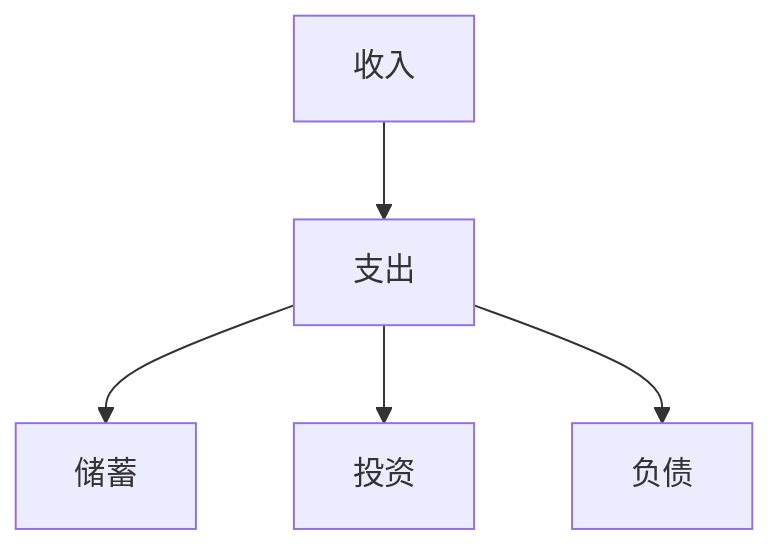
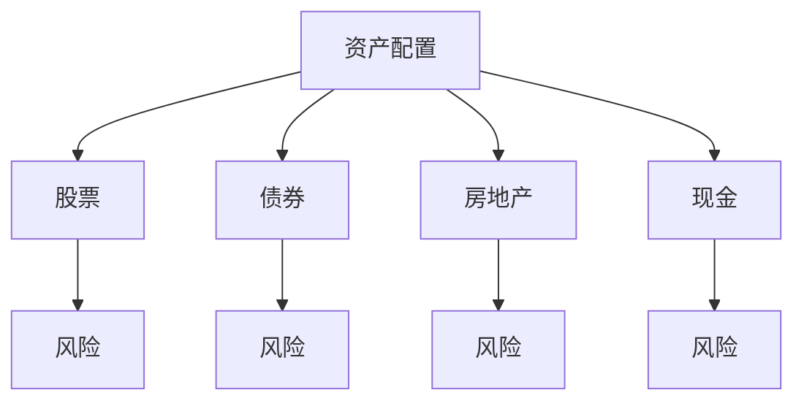
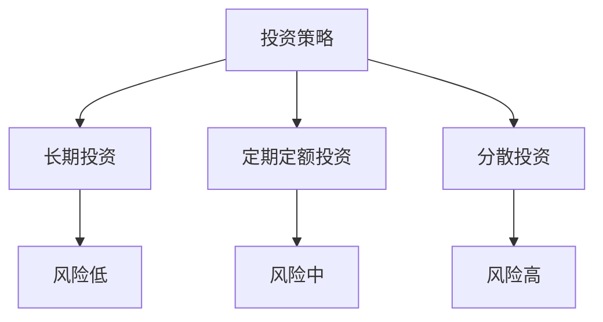
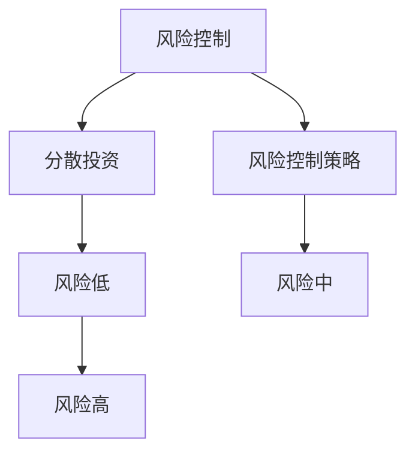

                 

### 文章标题

《程序员的财务规划：从入门到精通》

> 关键词：财务规划、程序员、理财、投资、资产配置

> 摘要：本文将深入探讨程序员的财务规划之道，从入门到精通，涵盖理财基础、投资策略、风险控制以及资产配置等方面，帮助程序员建立科学、系统的财务管理体系，实现财务自由。

---

### 1. 背景介绍

在快节奏、高压力的IT行业，程序员们往往面临着较高的收入和职业发展潜力。然而，随着职场的竞争加剧，如何合理规划财务、实现财富增值成为每一个程序员都需要面对的重要课题。本文旨在为程序员提供一套系统、全面的财务规划方案，帮助他们在职场中更好地管理个人财务，迈向财务自由。

#### 1.1 程序员财务规划的重要性

1. **收入与支出平衡**：合理安排收入和支出，确保财务稳定。
2. **财富增值**：通过科学的投资策略，实现资产增值。
3. **风险管理**：规避财务风险，降低生活压力。
4. **退休规划**：为未来的退休生活做好财务储备。
5. **职业发展**：良好的财务状况有助于职业发展和生活质量提升。

#### 1.2 文章结构

本文将按照以下结构进行阐述：

1. **核心概念与联系**：介绍财务规划中的核心概念，如现金流量、资产配置、投资策略等，并通过Mermaid流程图展示其关联关系。
2. **核心算法原理 & 具体操作步骤**：详细解析财务规划的具体算法和步骤。
3. **数学模型和公式 & 详细讲解 & 举例说明**：运用数学模型和公式，深入分析财务规划中的关键问题。
4. **项目实践：代码实例和详细解释说明**：通过实际案例，展示财务规划的具体应用。
5. **实际应用场景**：探讨财务规划在不同场景下的应用。
6. **工具和资源推荐**：推荐学习资源、开发工具和框架。
7. **总结：未来发展趋势与挑战**：总结财务规划的发展趋势和面临的挑战。
8. **附录：常见问题与解答**：解答读者可能遇到的问题。
9. **扩展阅读 & 参考资料**：推荐进一步阅读的资料。

---

### 2. 核心概念与联系

财务规划是一个复杂的系统，涉及到多个核心概念。以下将详细介绍这些概念，并通过Mermaid流程图展示它们之间的关联。

#### 2.1 现金流量

现金流量是指一定时间内现金的流入和流出。对于程序员来说，了解自己的现金流量对于财务规划至关重要。



#### 2.2 资产配置

资产配置是指根据个人风险承受能力和投资目标，将资金分配到不同类型的资产中，以实现投资组合的多样化。



#### 2.3 投资策略

投资策略是指根据投资目标和风险承受能力，选择合适的投资方法和工具。常见的投资策略包括长期投资、定期定额投资、分散投资等。



#### 2.4 风险控制

风险控制是指通过合理分散投资、制定风险控制策略等方式，降低投资风险。有效的风险控制是财务规划的重要组成部分。



---

### 3. 核心算法原理 & 具体操作步骤

在了解了财务规划的核心概念之后，接下来我们将详细解析财务规划的核心算法原理和具体操作步骤。

#### 3.1 收入与支出管理

收入与支出管理是财务规划的基础。具体步骤如下：

1. **记录收入与支出**：详细记录每一笔收入和支出，包括工资、奖金、投资收益、日常开销等。
2. **分析收入与支出结构**：对收入和支出进行分类，分析主要支出项和收入项，找出可以节省开支的领域。
3. **制定预算**：根据收入和支出结构，制定合理的月度或年度预算，确保收支平衡。
4. **跟踪预算执行**：定期检查预算执行情况，及时调整预算，确保财务稳定。

#### 3.2 资产配置

资产配置的核心在于合理分配资金，以实现风险和收益的平衡。具体步骤如下：

1. **确定投资目标**：根据个人风险承受能力和投资期限，确定投资目标。
2. **评估资产类别**：分析不同资产类别的风险和收益特征，如股票、债券、房地产、现金等。
3. **制定资产配置方案**：根据投资目标和资产类别特征，制定合理的资产配置方案。
4. **动态调整**：根据市场环境和投资目标的变化，定期调整资产配置。

#### 3.3 投资策略

投资策略的选择取决于个人的投资目标和风险承受能力。具体步骤如下：

1. **确定投资策略**：根据投资目标，选择适合的投资策略，如长期投资、定期定额投资、分散投资等。
2. **选择投资工具**：根据投资策略，选择合适的投资工具，如股票、基金、债券等。
3. **执行投资计划**：按照投资策略，定期执行投资计划，实现投资目标。
4. **监控与调整**：定期监控投资组合的表现，根据市场变化和投资目标，及时调整投资策略。

---

### 4. 数学模型和公式 & 详细讲解 & 举例说明

在财务规划中，数学模型和公式是不可或缺的工具。以下将介绍几个关键模型和公式，并详细讲解其应用。

#### 4.1 投资回报率

投资回报率（ROI）是衡量投资收益的重要指标。其计算公式为：

$$
ROI = \frac{投资收益}{投资成本} \times 100\%
$$

#### 4.2 资产配置效率

资产配置效率（Efficiency）反映了资产配置的效果。其计算公式为：

$$
Efficiency = \frac{实际收益}{预期收益}
$$

#### 4.3 股票投资风险

股票投资风险（Beta）是衡量股票波动性的指标。其计算公式为：

$$
Beta = \frac{股票收益率 - 市场平均收益率}{市场收益率 - 市场平均收益率}
$$

#### 4.4 债券投资收益

债券投资收益（Yield to Maturity, YTM）是衡量债券投资回报的指标。其计算公式为：

$$
YTM = \frac{票面利息}{购买价格} \times 100\%
$$

#### 4.5 实例说明

假设某程序员A计划投资10万元，目标是获得10%的年化收益。我们可以通过以下步骤进行财务规划：

1. **确定投资目标**：根据A的预期收益，确定投资目标和资产配置方案。
2. **选择投资工具**：根据投资目标和风险承受能力，选择合适的投资工具，如股票、基金、债券等。
3. **计算投资回报率**：根据投资工具的预期收益，计算投资回报率，确保达到目标收益。
4. **动态调整**：根据市场变化和投资目标，定期调整投资组合，确保投资组合的效率。

---

### 5. 项目实践：代码实例和详细解释说明

为了更好地理解财务规划，以下将提供一个实际案例，并通过代码实例进行详细解释说明。

#### 5.1 开发环境搭建

在本案例中，我们将使用Python进行财务规划。首先，需要安装Python和相关的库，如pandas、numpy等。

```bash
pip install python
pip install pandas
pip install numpy
```

#### 5.2 源代码详细实现

以下是一个简单的财务规划代码实例：

```python
import pandas as pd
import numpy as np

# 5.2.1 数据准备
income_data = pd.DataFrame({
    'source': ['工资', '奖金', '投资收益'],
    'amount': [30000, 5000, 2000]
})

expense_data = pd.DataFrame({
    'category': ['住房', '餐饮', '交通', '娱乐'],
    'amount': [2000, 1500, 500, 1000]
})

# 5.2.2 收入与支出分析
total_income = income_data['amount'].sum()
total_expense = expense_data['amount'].sum()

income_by_source = income_data.groupby('source')['amount'].sum()
expense_by_category = expense_data.groupby('category')['amount'].sum()

# 5.2.3 预算制定
budget = pd.DataFrame({
    'category': ['住房', '餐饮', '交通', '娱乐', '其他'],
    'amount': [1500, 1000, 300, 300, 200]
})

# 5.2.4 预算执行
actual_expense = expense_data['amount'].sum()
budget_difference = budget['amount'] - actual_expense

# 5.2.5 投资规划
investment_amount = total_income - total_expense
investment_return = 0.1 * investment_amount
investment_portfolio = pd.DataFrame({
    'investment': ['股票', '基金', '债券'],
    'amount': [0.5 * investment_amount, 0.3 * investment_amount, 0.2 * investment_amount]
})

# 5.2.6 输出结果
print("总收入：", total_income)
print("总支出：", total_expense)
print("预算：", budget)
print("实际支出：", actual_expense)
print("预算差异：", budget_difference)
print("投资金额：", investment_amount)
print("投资回报：", investment_return)
print("投资组合：", investment_portfolio)
```

#### 5.3 代码解读与分析

1. **数据准备**：首先，我们需要准备收入和支出数据。这里使用pandas DataFrame结构进行数据存储。
2. **收入与支出分析**：计算总收入和总支出，分析收入来源和支出类别。
3. **预算制定**：根据实际支出情况，制定合理的预算。
4. **预算执行**：计算实际支出与预算的差异。
5. **投资规划**：根据总收入和支出，制定投资规划，计算投资回报。
6. **输出结果**：将计算结果输出，便于分析。

通过以上代码实例，我们可以看到如何使用Python进行简单的财务规划。在实际应用中，可以根据具体情况进行扩展和优化。

---

### 6. 实际应用场景

财务规划在程序员的实际工作中具有重要意义，以下列举几个实际应用场景：

#### 6.1 职业发展

在职业发展的过程中，财务规划可以帮助程序员合理安排收入和支出，确保生活质量。同时，通过投资规划，为未来的职业发展提供财务支持。

#### 6.2 购房与购车

购房和购车是许多程序员的重大开支。通过科学的财务规划，可以提前筹备资金，降低购房和购车压力。

#### 6.3 教育与医疗

教育和医疗是人生的重要开支。通过财务规划，可以为子女的教育和家庭的健康提供稳定的财务保障。

#### 6.4 退休规划

退休规划是财务规划的重要组成部分。通过科学的投资和资产配置，可以为未来的退休生活提供充足的资金支持。

---

### 7. 工具和资源推荐

#### 7.1 学习资源推荐

- 《穷爸爸富爸爸》（罗伯特·清崎著）：介绍理财和投资的基本知识。
- 《聪明的投资者》（本杰明·格雷厄姆著）：介绍价值投资的理念和方法。
- 《股市真规则》（威廉·O.奥尼尔著）：介绍股票投资的基本策略。

#### 7.2 开发工具框架推荐

- Python：作为一门通用编程语言，Python广泛应用于数据分析和财务规划。
- Pandas：Python的数据分析库，适用于处理财务数据。
- NumPy：Python的数学库，适用于计算数学模型和公式。

#### 7.3 相关论文著作推荐

- 《现代投资组合理论》（哈里·马科维茨著）：介绍资产配置和投资组合理论。
- 《金融市场技术分析》（约翰·墨菲著）：介绍金融市场分析和技术分析。
- 《行为金融学》（安德烈·谢林著）：介绍金融市场的行为特征和投资心理。

---

### 8. 总结：未来发展趋势与挑战

随着科技的进步和金融市场的变化，财务规划也在不断演进。以下总结未来财务规划的发展趋势和挑战：

#### 8.1 发展趋势

1. **数字化与智能化**：财务规划将更加依赖数字化工具和人工智能技术。
2. **个性化**：根据个人情况和风险偏好，提供定制化的财务规划方案。
3. **全球化**：随着全球金融市场的一体化，财务规划将更加关注全球市场的变化。
4. **可持续发展**：注重环境保护和社会责任，实现财务与社会的可持续发展。

#### 8.2 挑战

1. **金融市场波动**：全球经济不确定性增加，金融市场波动加大，对财务规划提出了更高要求。
2. **投资风险**：新兴市场的投资风险增加，需要更加谨慎地进行投资决策。
3. **信息泄露**：网络安全问题日益突出，个人信息泄露可能对财务规划造成严重影响。
4. **政策法规**：全球政策法规的变化，对财务规划的影响日益显著。

---

### 9. 附录：常见问题与解答

#### 9.1 财务规划的重要性

财务规划可以帮助程序员合理安排收入和支出，实现财务自由，为未来的生活提供保障。

#### 9.2 如何选择投资工具

根据投资目标和风险承受能力，选择合适的投资工具，如股票、基金、债券等。长期投资适合风险承受能力较高的投资者，而定期定额投资适合风险承受能力较低的投资者。

#### 9.3 如何进行资产配置

资产配置应根据个人风险承受能力和投资目标进行。分散投资可以降低风险，提高收益。

#### 9.4 如何进行风险控制

通过分散投资、制定风险控制策略、定期监控投资组合等方式进行风险控制。

---

### 10. 扩展阅读 & 参考资料

- 《理财从入门到精通》（李笑来著）：详细介绍理财的基本知识和技巧。
- 《Python数据分析与可视化实战》（张亮著）：介绍Python在数据分析中的应用。
- 《行为金融学：投资者行为与市场波动》（安德烈·谢林著）：探讨投资者行为和市场波动的关系。

---

作者：禅与计算机程序设计艺术 / Zen and the Art of Computer Programming

