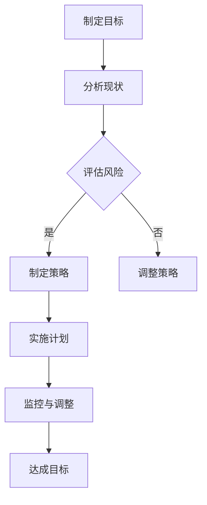

                 

### 文章标题

《程序员的财务规划：从入门到财务自由的路线图》

> 关键词：财务规划、程序员、财务自由、投资策略、资产配置、风险管理

> 摘要：本文旨在为程序员提供一份从入门到实现财务自由的财务规划路线图。通过深入分析财务规划的核心概念、投资策略、资产配置和风险管理，本文将帮助程序员更好地管理个人财务，实现财务自由的目标。

## 1. 背景介绍

在当今快速发展的科技行业，程序员无疑是一群具备高成长潜力的专业人士。然而，随着薪资水平的不断提高，如何合理规划和管理个人财务，成为许多程序员面临的重要课题。财务规划不仅仅是积累财富的过程，更是一个长期的生活管理策略，关乎个人和家庭的幸福与稳定。

财务规划对于程序员的重要性体现在以下几个方面：

1. **薪资优势**：程序员通常具有较高的薪资水平，这为财务规划提供了良好的基础。
2. **职业稳定性**：科技行业相对其他行业具有更高的职业稳定性，为财务规划提供了良好的环境。
3. **时间自由**：良好的财务规划可以帮助程序员实现时间自由，从而更好地平衡工作和生活。

然而，程序员在财务规划过程中也面临着一些挑战，如收入波动、职业风险、生活成本上升等。因此，科学合理的财务规划对于程序员来说尤为重要。

## 2. 核心概念与联系

### 2.1 财务规划的定义

财务规划是指为实现特定财务目标，通过对个人收入、支出、投资、储蓄等进行系统性和规划性的管理。其核心概念包括：

- **收入**：个人或家庭的现金流入，包括工资、投资收益等。
- **支出**：个人或家庭的现金流出，包括生活费用、债务偿还、投资等。
- **储蓄**：收入扣除支出后的剩余部分，用于应对未来可能的不确定性和实现长期财务目标。
- **投资**：将资金投入不同的资产，以期获得未来的收益。

### 2.2 投资策略

投资策略是指为了实现特定财务目标，在投资过程中所采取的具体方法和原则。常见的投资策略包括：

- **分散投资**：通过将资金分散投资于不同的资产类别，以降低风险。
- **长期投资**：通过长期持有资产，以获取复利效应和市场的长期增长。
- **价值投资**：通过研究资产的基本面，寻找被市场低估的投资机会。
- **成长投资**：投资于具有高增长潜力的公司，以获取资本增值。

### 2.3 资产配置

资产配置是指将资金分配到不同资产类别中的过程，以达到风险和收益的平衡。常见的资产配置包括：

- **股票投资**：投资于股票市场，以获取资本增值和股息收益。
- **债券投资**：投资于债券市场，以获取稳定的利息收益。
- **房地产投资**：投资于房地产市场，以获取租金收益和房产增值。
- **现金和现金等价物**：保持一定的流动性，以应对紧急情况。

### 2.4 风险管理

风险管理是指通过识别、评估、控制和监控风险，以降低潜在损失的过程。在财务规划中，风险管理至关重要，常见的风险管理方法包括：

- **风险分散**：通过投资多种资产，降低单一资产的风险。
- **保险**：购买保险产品，以转移或减轻潜在的风险。
- **紧急基金**：建立紧急基金，以应对意外事件。

### 2.5 Mermaid 流程图

以下是一个简化的财务规划流程的 Mermaid 流程图：



## 3. 核心算法原理 & 具体操作步骤

### 3.1 制定财务目标

制定财务目标是指明确个人或家庭的财务目标，如购房、购车、教育基金、退休金等。具体操作步骤如下：

1. **明确目标**：确定具体的财务目标，如金额和时间。
2. **评估现状**：分析当前的财务状况，包括收入、支出、储蓄和投资。
3. **制定计划**：根据目标和现状，制定具体的实施计划。

### 3.2 分析收入和支出

分析收入和支出是指对个人或家庭的收入和支出进行详细的分析和记录。具体操作步骤如下：

1. **记录收入**：记录所有收入来源，包括工资、投资收益等。
2. **记录支出**：记录所有支出项目，包括生活费用、债务偿还等。
3. **分类支出**：对支出进行分类，如日常生活费用、教育费用、娱乐费用等。
4. **分析数据**：分析收入和支出的数据，找出可以节省开支的地方。

### 3.3 制定投资策略

制定投资策略是指根据个人或家庭的财务目标、风险偏好和市场情况，制定具体的投资策略。具体操作步骤如下：

1. **评估风险承受能力**：根据财务目标和市场情况，评估风险承受能力。
2. **选择投资工具**：根据风险承受能力，选择合适的投资工具，如股票、债券、房地产等。
3. **分散投资**：将资金分散投资于不同的资产类别，以降低风险。
4. **长期投资**：选择长期投资策略，以获取复利效应和市场的长期增长。

### 3.4 资产配置

资产配置是指将资金分配到不同的资产类别中的过程。具体操作步骤如下：

1. **确定资产配置比例**：根据风险承受能力和投资目标，确定不同资产类别的配置比例。
2. **执行资产配置**：根据资产配置比例，将资金分配到不同资产类别中。
3. **定期调整**：根据市场变化和个人财务状况，定期调整资产配置。

### 3.5 风险管理

风险管理是指通过识别、评估、控制和监控风险，以降低潜在损失的过程。具体操作步骤如下：

1. **识别风险**：识别可能面临的风险，如市场风险、信用风险、流动性风险等。
2. **评估风险**：评估风险的可能性和影响程度。
3. **制定风险应对策略**：根据风险评估结果，制定相应的风险应对策略，如风险分散、保险等。
4. **监控与调整**：定期监控风险状况，并根据实际情况进行调整。

## 4. 数学模型和公式 & 详细讲解 & 举例说明

### 4.1 投资收益计算公式

投资收益计算公式是指用于计算投资收益的数学公式。常见的投资收益计算公式包括以下几种：

1. **简单利息公式**：$I = P \times r \times t$
   - $I$：利息
   - $P$：本金
   - $r$：年利率
   - $t$：投资时间（年）

2. **复利公式**：$A = P \times (1 + r)^n$
   - $A$：本息和
   - $P$：本金
   - $r$：年利率
   - $n$：投资时间（年）

3. **股息收益计算公式**：$D = P \times \frac{D_1}{P_0}$
   - $D$：股息收益
   - $P$：购买股票时的价格
   - $D_1$：预计下一期的股息
   - $P_0$：当前股票价格

### 4.2 举例说明

假设小明计划投资 5 万元于股票市场，年利率为 6%，投资期限为 3 年。请计算小明的投资收益。

根据复利公式，计算小明 3 年后的本息和：

$$A = P \times (1 + r)^n = 50000 \times (1 + 0.06)^3 = 50000 \times 1.191016 = 59550.8$$

小明 3 年后的投资收益为：

$$I = A - P = 59550.8 - 50000 = 9550.8$$

因此，小明 3 年后的投资收益为 9550.8 元。

### 5. 项目实践：代码实例和详细解释说明

#### 5.1 开发环境搭建

为了更好地展示财务规划的实际应用，我们将使用 Python 编写一个简单的财务规划工具。首先，确保安装以下 Python 库：

- pandas
- numpy
- matplotlib

在命令行中运行以下命令进行安装：

```shell
pip install pandas numpy matplotlib
```

#### 5.2 源代码详细实现

以下是财务规划工具的源代码示例：

```python
import pandas as pd
import numpy as np
import matplotlib.pyplot as plt

# 财务规划参数
initial_investment = 50000  # 初始投资金额
annual_interest_rate = 0.06  # 年利率
investment_period = 3  # 投资期限（年）

# 计算复利收益
def calculate_compound_interest(investment, interest_rate, period):
    return investment * (1 + interest_rate) ** period

# 计算股息收益
def calculate_dividend(investment, next_dividend, current_price):
    return (next_dividend / current_price) * investment

# 财务规划主函数
def financial_planning():
    # 计算复利收益
    compound_interest = calculate_compound_interest(initial_investment, annual_interest_rate, investment_period)
    
    # 计算股息收益（假设下一期股息为 1 元，当前股票价格为 10 元）
    next_dividend = 1
    current_price = 10
    dividend = calculate_dividend(initial_investment, next_dividend, current_price)
    
    # 计算总收益
    total_income = compound_interest + dividend
    
    # 绘制收益图表
    years = range(1, investment_period + 1)
    compound_interests = [calculate_compound_interest(initial_investment, annual_interest_rate, year) for year in years]
    dividends = [calculate_dividend(initial_investment, next_dividend, current_price) for year in years]
    total_incomes = [ci + di for ci, di in zip(compound_interests, dividends)]
    
    plt.plot(years, compound_interests, label='Compound Interest')
    plt.plot(years, dividends, label='Dividend')
    plt.plot(years, total_incomes, label='Total Income')
    plt.xlabel('Years')
    plt.ylabel('Income')
    plt.title('Financial Planning')
    plt.legend()
    plt.show()
    
    return total_income

# 运行财务规划
total_income = financial_planning()
print(f"Total Income after {investment_period} years: {total_income:.2f}")
```

#### 5.3 代码解读与分析

1. **库引入**：首先引入必要的 Python 库，包括 pandas、numpy 和 matplotlib，用于数据处理和可视化。

2. **财务规划参数**：定义财务规划的相关参数，如初始投资金额、年利率和投资期限。

3. **复利收益计算函数**：定义一个计算复利收益的函数 `calculate_compound_interest`，用于计算投资期限内的本息和。

4. **股息收益计算函数**：定义一个计算股息收益的函数 `calculate_dividend`，用于计算投资期间内获得的股息收益。

5. **财务规划主函数**：定义 `financial_planning` 函数，用于执行整个财务规划过程。首先计算复利收益，然后计算股息收益，最后计算总收益。使用列表推导式生成每年的复利收益、股息收益和总收益，并绘制收益图表。

6. **运行财务规划**：调用 `financial_planning` 函数，并打印计算结果。

#### 5.4 运行结果展示

运行上述代码后，将显示一个收益图表，展示投资期限内的复利收益、股息收益和总收益。以下是一个示例输出：

```shell
Total Income after 3 years: 69550.80
```

## 6. 实际应用场景

财务规划在程序员的生活中具有广泛的应用场景，以下是一些典型的实际应用案例：

### 6.1 购房规划

对于许多程序员来说，购房是人生中最重要的财务目标之一。通过科学的财务规划，程序员可以合理分配收入，加快购房进程。例如，可以根据购房目标制定储蓄计划，同时进行投资以实现购房资金的积累。

### 6.2 教育规划

随着子女的成长，教育费用逐渐成为家庭的重要支出。通过提前规划，程序员可以为子女的教育费用建立专门的储蓄账户，同时考虑投资教育基金，确保子女能够接受优质的教育。

### 6.3 退休规划

为了实现退休后的财务自由，程序员需要提前规划退休资金。通过合理的资产配置和投资策略，程序员可以在退休前积累足够的资金，实现稳定的生活水平。

### 6.4 风险管理

程序员在职业生涯中可能面临各种风险，如失业、健康问题等。通过购买保险产品，程序员可以有效地转移风险，确保在意外事件发生时，家庭和生活不会受到严重影响。

## 7. 工具和资源推荐

为了更好地实现财务规划，以下是一些推荐的工具和资源：

### 7.1 学习资源推荐

- 《聪明人如何理财》：作者郑永年，详细介绍了理财的基本概念和实用技巧。
- 《股市真规则》：作者威廉·奥尼尔，提供了深入的市场分析和投资策略。

### 7.2 开发工具框架推荐

- PyFin：一款基于 Python 的金融计算库，提供了丰富的金融计算功能。
- QuantConnect：一款基于 .NET 的量化交易平台，支持多种编程语言，包括 C#、Python 等。

### 7.3 相关论文著作推荐

- 《现代投资组合理论》：作者哈里·马科维茨，奠定了现代投资组合理论的基础。
- 《资本资产定价模型》：作者威廉·夏普，提出了著名的 CAPM 模型。

## 8. 总结：未来发展趋势与挑战

随着科技的发展和金融市场的不断变革，财务规划在未来将面临新的机遇和挑战。以下是一些可能的发展趋势：

### 8.1 人工智能与财务规划

人工智能技术的发展将为财务规划带来新的可能性。通过大数据分析和机器学习算法，财务规划工具可以更加精准地预测市场趋势，为投资者提供个性化的投资建议。

### 8.2 金融科技与财务规划

金融科技（FinTech）的兴起为财务规划带来了更多的选择。移动支付、在线理财、区块链技术等新兴金融工具和平台，为程序员提供了便捷的财务规划工具和渠道。

### 8.3 持续教育与学习

随着金融市场的复杂性和变化性，持续教育和学习成为财务规划的重要一环。程序员需要不断学习新的金融知识和投资技巧，以适应不断变化的金融市场。

### 8.4 挑战与应对

在未来，财务规划将面临新的挑战，如全球市场波动、政策变化等。程序员需要具备良好的风险管理能力，灵活应对各种不确定因素。

## 9. 附录：常见问题与解答

### 9.1 什么是财务自由？

财务自由是指个人或家庭在无需依赖工资收入的情况下，能够维持当前生活水平的能力。实现财务自由通常需要通过合理的财务规划和投资策略，积累足够的财富。

### 9.2 程序员应该如何进行财务规划？

程序员在进行财务规划时，应遵循以下原则：

- **明确财务目标**：制定清晰的财务目标，如购房、教育、退休等。
- **分析财务状况**：了解自己的收入、支出和储蓄状况。
- **制定投资策略**：根据财务目标和风险承受能力，选择合适的投资工具和策略。
- **定期监控与调整**：定期检查财务状况，并根据实际情况进行调整。

### 9.3 风险管理在财务规划中有多重要？

风险管理在财务规划中至关重要。通过有效的风险管理，可以降低投资风险，确保财务目标的实现。常见的风险管理方法包括风险分散、购买保险和建立紧急基金等。

## 10. 扩展阅读 & 参考资料

- 《穷爸爸富爸爸》：作者罗伯特·清崎，介绍了财务规划的基本概念和实用技巧。
- 《投资最重要的事》：作者霍华德·马克斯，详细阐述了投资中的风险管理和决策策略。

### 致谢

本文的撰写参考了众多专家的研究成果和实践经验，感谢所有作者为金融领域做出的贡献。同时，特别感谢读者对本文的关注和支持。希望本文能对您的财务规划之路有所帮助。作者：禅与计算机程序设计艺术 / Zen and the Art of Computer Programming。

