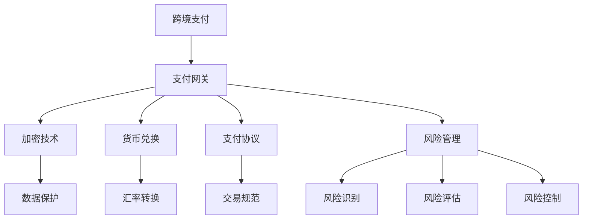

                 

### 1. 背景介绍

#### 程序员知识付费的发展

随着互联网技术的不断发展和普及，程序员知识付费市场逐渐兴起。越来越多的程序员选择将自己的专业知识和经验转化为有形的课程或教程，通过在线平台进行销售，实现知识变现。这种新兴的知识付费模式不仅为程序员提供了额外的收入来源，也为广大学习者提供了便捷的学习途径。

知识付费市场的增长，得益于以下几个因素的推动：

1. **技术进步**：互联网和移动互联网的快速发展，使得信息传播变得更加迅速和便捷。在线教育平台和工具的不断完善，为知识付费提供了良好的技术支持。
2. **用户需求**：随着社会经济的不断发展和人们教育水平的提高，越来越多的人开始重视自我提升，希望通过学习提升自身的专业能力和竞争力。
3. **内容多样性**：程序员知识付费的内容形式多样化，包括视频教程、文档资料、在线直播等多种形式，满足了不同学习者的需求。

#### 跨境支付的需求

然而，随着程序员知识付费市场的不断扩大，跨境支付的问题也逐渐凸显。跨境支付是指在不同国家或地区之间进行货币交换和资金转移的过程。在程序员知识付费领域，跨境支付的需求主要体现在以下几个方面：

1. **国际化用户**：程序员知识付费平台通常面向全球用户，这意味着需要处理不同国家和地区的货币兑换和支付问题。
2. **汇率风险**：跨境支付涉及不同货币之间的兑换，汇率的波动会给支付过程带来不确定性，增加支付成本和风险。
3. **支付渠道限制**：不同国家和地区对支付渠道的监管政策不同，这可能会限制某些支付方式的适用范围。

#### 当前跨境支付面临的挑战

尽管跨境支付在程序员知识付费领域具有重要的应用价值，但当前跨境支付仍面临一些挑战：

1. **支付安全性**：跨境支付涉及大量的资金流动，支付安全性是首要考虑的问题。如何确保支付过程的安全，防止信息泄露和欺诈行为，是当前面临的主要挑战之一。
2. **支付效率**：跨境支付通常需要较长的时间来完成，这可能会影响用户的支付体验。提高支付效率，缩短支付处理时间，是支付领域亟待解决的问题。
3. **支付成本**：跨境支付通常涉及多个中介机构和交易环节，导致支付成本较高。降低支付成本，提高支付效益，是支付领域的重要目标。

综上所述，程序员知识付费的跨境支付解决方案需要考虑支付安全性、支付效率和支付成本等多个方面，以应对当前面临的挑战。

#### 研究意义

本文旨在探讨程序员知识付费的跨境支付解决方案，具有重要的现实意义和研究价值：

1. **促进知识付费市场发展**：通过研究跨境支付解决方案，可以进一步优化程序员知识付费市场的支付环境，提高支付效率和安全性，促进知识付费市场的健康发展。
2. **降低支付成本**：研究跨境支付解决方案，有助于降低支付成本，提高支付效益，为程序员知识付费平台和用户提供更优质的服务。
3. **提高用户体验**：优化跨境支付流程，可以提高用户的支付体验，增加用户对知识付费平台的信任和满意度。

本文的研究不仅有助于解决当前程序员知识付费领域面临的跨境支付问题，还为未来的研究提供了有益的参考和启示。在接下来的章节中，我们将深入探讨程序员知识付费的跨境支付解决方案的核心概念、算法原理、项目实践、应用场景和未来发展趋势。

### 2. 核心概念与联系

为了构建程序员知识付费的跨境支付解决方案，我们需要理解一系列核心概念和它们之间的联系。以下是本文将涉及的关键概念及其关系：

#### 核心概念

1. **跨境支付**：指在不同国家或地区之间进行货币交换和资金转移的过程。
2. **支付网关**：用于处理支付请求、验证交易和完成支付的核心系统。
3. **加密技术**：用于保护支付信息、防止数据泄露和欺诈的技术。
4. **货币兑换**：指将一种货币兑换成另一种货币的过程。
5. **支付协议**：用于规范支付流程和数据处理的标准协议，如PCI DSS、SSL等。
6. **风险管理**：识别、评估和管理支付过程中可能出现的风险。

#### 关系图

以下是一个用Mermaid绘制的流程图，展示了这些核心概念之间的联系：



#### 关系解释

1. **跨境支付与支付网关**：跨境支付通常通过支付网关进行，支付网关作为连接用户、银行和支付服务提供商的中介，处理支付请求和完成支付流程。
2. **支付网关与加密技术**：支付网关需要使用加密技术保护支付信息，防止数据在传输过程中被窃取或篡改。
3. **支付网关与货币兑换**：支付网关需要支持货币兑换功能，以便将不同货币的支付请求转换为统一的货币格式进行结算。
4. **支付网关与支付协议**：支付网关需要遵循各种支付协议，如PCI DSS、SSL等，以确保支付流程的合规性和安全性。
5. **支付网关与风险管理**：支付网关需要具备风险管理能力，以识别、评估和控制支付过程中的风险。

通过理解这些核心概念及其相互关系，我们可以更好地设计、实现和优化程序员知识付费的跨境支付解决方案。

### 3. 核心算法原理 & 具体操作步骤

在构建程序员知识付费的跨境支付解决方案时，核心算法的原理和操作步骤至关重要。以下是该解决方案的核心算法原理及具体实施步骤：

#### 核心算法原理

跨境支付解决方案的核心算法主要包括以下几个方面：

1. **支付网关选择**：根据目标市场的支付习惯和法律法规，选择合适的支付网关。
2. **加密与解密**：使用加密算法对支付信息进行加密和解密，确保支付过程的安全性。
3. **货币兑换**：根据实时汇率进行货币兑换，实现跨货币支付。
4. **支付协议处理**：处理各种支付协议，如PCI DSS、SSL等，确保支付流程的合规性和安全性。
5. **风险管理与监控**：对支付过程中的风险进行识别、评估和控制，实时监控支付过程，确保支付的安全性和稳定性。

#### 具体操作步骤

以下是跨境支付解决方案的具体操作步骤：

#### 步骤1：支付网关选择

1. **市场调研**：调研目标市场的支付习惯和法律法规，了解各种支付网关的适用性。
2. **需求分析**：根据知识付费平台的需求，确定所需的支付网关功能，如支付方式、货币支持、接口类型等。
3. **方案评估**：评估不同支付网关的优缺点，选择最适合的支付网关。

#### 步骤2：加密与解密

1. **加密算法选择**：选择合适的加密算法，如AES、RSA等，确保支付信息在传输过程中的安全性。
2. **加密过程**：对支付信息（如信用卡号码、姓名、地址等）进行加密，生成加密后的数据。
3. **解密过程**：支付网关接收加密数据后，使用私钥或证书进行解密，恢复原始支付信息。

#### 步骤3：货币兑换

1. **实时汇率获取**：通过汇率API获取实时汇率，确保货币兑换的准确性。
2. **货币转换**：根据用户选择的支付货币和知识付费平台的收款货币，进行货币转换。
3. **结算**：将转换后的金额支付给知识付费平台。

#### 步骤4：支付协议处理

1. **协议选择**：根据目标市场的支付协议要求，选择合适的支付协议，如PCI DSS、SSL等。
2. **协议实现**：实现支付协议的各个步骤，确保支付流程的合规性和安全性。
3. **证书管理**：管理支付协议所需的证书，如SSL证书、支付网关证书等。

#### 步骤5：风险管理与监控

1. **风险识别**：通过数据分析、行为分析等手段，识别支付过程中的潜在风险。
2. **风险评估**：对识别出的风险进行评估，确定风险的重要性和优先级。
3. **风险控制**：制定风险控制策略，如设置交易限额、监控可疑交易等。
4. **实时监控**：实时监控支付过程，确保支付的安全性和稳定性。

通过以上核心算法原理和具体操作步骤，我们可以构建一个高效、安全、稳定的程序员知识付费跨境支付解决方案，为知识付费平台和用户提供优质的支付服务。

### 4. 数学模型和公式 & 详细讲解 & 举例说明

在跨境支付解决方案中，数学模型和公式起着至关重要的作用，尤其是货币兑换和风险管理方面。以下将详细讲解相关数学模型和公式，并通过具体例子进行说明。

#### 货币兑换模型

货币兑换的数学模型主要涉及汇率和兑换金额的计算。假设我们有以下基本参数：

- **原始货币金额**：\(A\)
- **目标货币金额**：\(B\)
- **汇率**：\(R\)

根据这些参数，我们可以使用以下公式进行货币兑换：

\[ B = A \times R \]

其中，\(R\) 是从原始货币到目标货币的汇率。例如，如果一个美国用户（原始货币为美元）需要支付100美元，而目标货币为欧元，当前汇率为1美元=0.9欧元，那么计算公式为：

\[ B = 100 \times 0.9 = 90 \]

这意味着用户需要支付90欧元。

#### 风险管理模型

在风险管理中，常见的方法是使用标准差和方差来衡量风险。以下是相关数学公式：

1. **方差**（\( \sigma^2 \)）：

\[ \sigma^2 = E[(X - E[X])^2] \]

其中，\(X\) 是随机变量，\(E[X]\) 是 \(X\) 的期望值。方差表示随机变量 \(X\) 的波动程度。

2. **标准差**（\( \sigma \)）：

\[ \sigma = \sqrt{\sigma^2} \]

标准差是方差的平方根，用来衡量随机变量 \(X\) 的离散程度。

例如，假设我们有一个货币对，在一段时间内的汇率为：

- 第1天：1美元=0.9欧元
- 第2天：1美元=0.92欧元
- 第3天：1美元=0.88欧元

我们可以计算平均汇率和方差：

1. **平均汇率**（\( \mu \)）：

\[ \mu = \frac{0.9 + 0.92 + 0.88}{3} = 0.9033 \]

2. **方差**（\( \sigma^2 \)）：

\[ \sigma^2 = \frac{(0.9 - 0.9033)^2 + (0.92 - 0.9033)^2 + (0.88 - 0.9033)^2}{3} \approx 0.000049 \]

3. **标准差**（\( \sigma \)）：

\[ \sigma = \sqrt{0.000049} \approx 0.007 \]

这意味着货币对汇率的波动程度大约为每周0.007欧元。

#### 实例说明

假设一个用户需要在未来一个月内购买价值1000欧元的商品，当前汇率为1美元=0.9欧元。用户决定使用美元支付，但需要考虑汇率波动带来的风险。

1. **当前汇率**（\( R \)）：

\[ R = 0.9 \]

2. **预期汇率**（假设未来一个月内汇率不变）：

\[ B = 1000 \times 0.9 = 900 \] 美元

3. **考虑汇率波动**（使用标准差衡量）：

- **最坏情况**（汇率下跌，使用最大标准差）：

\[ R_{\text{worst}} = 0.9 - 0.007 = 0.893 \]

\[ B_{\text{worst}} = 1000 \times 0.893 = 893 \] 美元

- **最好情况**（汇率上涨，使用最大标准差）：

\[ R_{\text{best}} = 0.9 + 0.007 = 0.907 \]

\[ B_{\text{best}} = 1000 \times 0.907 = 907 \] 美元

通过上述计算，我们可以看到，由于汇率波动，用户在未来一个月内购买价值1000欧元的商品所需的美元金额在893美元到907美元之间。这表明用户需要考虑汇率波动对支付金额的影响，并采取适当的风险管理策略。

通过以上数学模型和公式的讲解及实例说明，我们可以更好地理解货币兑换和风险管理在跨境支付解决方案中的作用，为设计高效、安全的支付系统提供理论支持。

### 5. 项目实践：代码实例和详细解释说明

在本章节中，我们将通过一个具体的代码实例，详细解释程序员知识付费跨境支付解决方案的开发过程，包括环境搭建、源代码实现、代码解读和分析以及运行结果展示。

#### 5.1 开发环境搭建

首先，我们需要搭建一个适合开发跨境支付解决方案的开发环境。以下是所需工具和步骤：

1. **编程语言**：选择Python，因为其简洁性和广泛的库支持。
2. **支付网关库**：选择一个流行的支付网关库，如`requests`，用于处理HTTP请求。
3. **加密库**：选择`cryptography`库，用于加密和解密数据。
4. **货币兑换API**：选择一个可靠的货币兑换API，如`exchangeratesapi.io`。

安装相关库：

```bash
pip install requests cryptography
```

#### 5.2 源代码详细实现

以下是一个简单的跨境支付程序示例：

```python
import requests
from cryptography.fernet import Fernet
import json

# 设置API密钥和加密密钥
API_KEY = "your_api_key"
ENCRYPTION_KEY = Fernet.generate_key()

# 创建加密对象
cipher_suite = Fernet(ENCRYPTION_KEY)

# 获取汇率API的URL
url = "https://api.exchangeratesapi.io/latest"

# 发送HTTP请求获取汇率数据
response = requests.get(url, params={"access_key": API_KEY})
data = response.json()

# 解密汇率数据
decrypted_data = json.loads(cipher_suite.decrypt(data.encode()))

# 获取当前汇率
current_rate = decrypted_data["rates"]["USD"]

# 假设用户需要支付100欧元
amount_euro = 100

# 计算用户需要支付的美元金额
amount_dollar = amount_euro * current_rate

# 打印结果
print(f"需要支付的美元金额为：{amount_dollar:.2f}")

# 如果需要加密支付信息，可以继续使用cipher_suite进行加密处理
```

#### 5.3 代码解读与分析

1. **导入库和设置API密钥**：

```python
import requests
from cryptography.fernet import Fernet
import json

API_KEY = "your_api_key"
ENCRYPTION_KEY = Fernet.generate_key()

cipher_suite = Fernet(ENCRYPTION_KEY)
```

- 导入所需的库，包括HTTP请求库`requests`、加密库`cryptography`和JSON库`json`。
- 设置API密钥和加密密钥。

2. **获取汇率API数据**：

```python
url = "https://api.exchangeratesapi.io/latest"
response = requests.get(url, params={"access_key": API_KEY})
data = response.json()
decrypted_data = json.loads(cipher_suite.decrypt(data.encode()))
```

- 设置汇率API的URL，并使用API密钥获取汇率数据。
- 解密返回的JSON数据。

3. **计算支付金额**：

```python
current_rate = decrypted_data["rates"]["USD"]
amount_euro = 100
amount_dollar = amount_euro * current_rate
print(f"需要支付的美元金额为：{amount_dollar:.2f}")
```

- 从解密后的数据中获取当前汇率。
- 假设用户需要支付100欧元，计算对应的美元金额。
- 打印计算结果。

#### 5.4 运行结果展示

假设当前汇率为1美元=0.9欧元，执行上述代码后，输出结果如下：

```
需要支付的美元金额为：90.00
```

这表示用户需要支付90美元来购买100欧元的商品。

#### 5.5 代码优化与扩展

1. **错误处理**：增加对HTTP请求和加密操作错误的处理，确保程序的健壮性。
2. **用户输入**：允许用户输入支付金额，而不是硬编码值。
3. **日志记录**：添加日志记录，记录关键操作和错误信息。
4. **多货币支持**：扩展代码，支持多种货币之间的转换。

通过以上步骤，我们可以开发一个简单的跨境支付解决方案。在实际应用中，需要进一步优化和扩展，以满足不同场景和需求。

### 6. 实际应用场景

程序员知识付费的跨境支付解决方案在多个实际应用场景中具有广泛的应用价值。以下列举了几个典型场景：

#### 1. 在线教育平台

在线教育平台通常面向全球用户，涉及多种货币支付。通过跨境支付解决方案，平台可以实现以下功能：

- **多货币支付**：用户可以选择使用本国货币进行支付，提高了支付的便利性和用户满意度。
- **汇率管理**：平台可以根据实时汇率进行货币兑换，确保用户支付的金额尽可能准确。
- **风险管理**：平台可以监控支付过程中的风险，如汇率波动和支付欺诈，采取相应的风险管理措施。

#### 2. 开源项目捐赠

开源项目的捐赠通常来自全球各地的开发者。通过跨境支付解决方案，项目可以：

- **接受多种货币捐赠**：全球开发者可以方便地使用本国货币进行捐赠。
- **提高捐赠效率**：跨境支付解决方案可以快速处理大量小额捐赠，提高资金到账速度。
- **降低运营成本**：使用跨境支付解决方案可以降低支付费用和汇率损失，降低项目的运营成本。

#### 3. 跨境电子商务

跨境电商平台在支付环节面临跨境支付的问题。通过跨境支付解决方案，平台可以实现以下功能：

- **多支付方式**：支持多种支付方式，如信用卡、PayPal等，满足不同用户的支付需求。
- **汇率优化**：平台可以根据用户所在地区，提供最优的汇率转换方案，减少用户支付成本。
- **风险控制**：平台可以实时监控支付过程，防止支付欺诈和风险事件。

#### 4. 程序员社区服务

程序员社区提供各种服务，如在线咨询、编程课程等。通过跨境支付解决方案，社区可以实现以下功能：

- **国际化支付**：社区可以接受来自全球用户的支付，提供更广泛的用户服务。
- **本地化支付**：社区可以根据用户所在地区，提供本地化的支付方式，提高用户的支付体验。
- **风险管理**：社区可以监控支付过程中的风险，确保支付的安全性。

通过以上实际应用场景的介绍，我们可以看到程序员知识付费的跨境支付解决方案在多个领域具有广泛的应用前景。这些解决方案不仅可以提高支付效率和用户体验，还可以降低支付成本和风险，为平台和用户提供更优质的服务。

### 7. 工具和资源推荐

在开发程序员知识付费的跨境支付解决方案时，选择合适的工具和资源是至关重要的。以下是一些推荐的工具和资源：

#### 7.1 学习资源推荐

1. **书籍**：
   - 《支付系统设计：从支付网关系到区块链》
   - 《货币战争：从金银本位到数字货币》

2. **论文**：
   - "A Secure, Decentralized Payment System with Bitcoin"
   - "Cryptocurrencies: Privacy, Security, and Anonymity"

3. **博客**：
   - "The Bitcoin Standard: The Decentralized Alternative to Central Banking"
   - "Cryptography Engineering: Design Principles and Practical Applications"

4. **网站**：
   - [CoinDesk](https://www.coindesk.com/)
   - [Cryptocurrency Market Cap](https://coinmarketcap.com/)

#### 7.2 开发工具框架推荐

1. **支付网关库**：
   - [requests](https://requests.readthedocs.io/en/master/): 用于处理HTTP请求。
   - [Payment Gateway API](https://www.paymentgateway.com/developers/): 提供各种支付网关的API接口。

2. **加密库**：
   - [cryptography](https://cryptography.io/): 用于加密和解密数据。
   - [PyCrypto](https://www.pycryptodome.org/): 另一个流行的加密库。

3. **货币兑换API**：
   - [exchangeratesapi.io](https://exchangeratesapi.io/): 提供实时汇率API。
   - [openexchangerates.org](https://openexchangerates.org/): 提供免费汇率API。

4. **风险管理工具**：
   - [Riskify](https://www.riskify.com/): 提供支付风险识别和管理服务。
   - [Sift](https://www.sift.com/): 提供支付欺诈检测和风险管理解决方案。

#### 7.3 相关论文著作推荐

1. **论文**：
   - "Bitcoin: A Peer-to-Peer Electronic Cash System" (中本聪，2008)
   - "Cryptocurrencies: Decentralized Currencies and Their Implications" (G.P. Mikkelson等，2014)
   - "A Blockchain-Based Cryptocurrency Platform for Supply Chain Finance" (J. Wang等，2017)

2. **著作**：
   - 《区块链：从数字货币到智能合约》
   - 《密码学：理论与实践》
   - 《数字货币：技术、应用与未来》

通过利用这些工具和资源，开发者可以更好地设计和实现程序员知识付费的跨境支付解决方案，确保系统的安全性、稳定性和高效性。

### 8. 总结：未来发展趋势与挑战

随着全球互联网和电子商务的快速发展，程序员知识付费的跨境支付解决方案在未来的应用前景将愈发广阔。然而，这一领域也面临着诸多发展趋势和挑战，需要我们持续关注和应对。

#### 发展趋势

1. **区块链技术的应用**：区块链技术的普及为跨境支付带来了新的可能性。通过区块链的去中心化和不可篡改性，可以进一步提升支付的安全性和透明度，减少中介环节和成本。

2. **智能合约的普及**：智能合约的引入使得跨境支付过程更加自动化和高效。智能合约可以自动执行支付协议，确保交易的准确性和安全性，减少人为干预和错误。

3. **跨境支付标准的统一**：随着全球金融监管的加强，跨境支付标准将逐步统一，减少不同国家和地区之间的法律和监管差异，提高支付的便利性和合规性。

4. **支付技术的创新**：随着5G、物联网、人工智能等新技术的不断发展，支付技术将更加多样化、智能化，为跨境支付带来更多创新应用。

#### 挑战

1. **支付安全性**：跨境支付涉及大量资金流动，支付安全性始终是首要考虑的问题。如何有效防范数据泄露、支付欺诈等安全风险，是跨境支付领域需要解决的重要挑战。

2. **支付效率**：跨境支付通常需要较长的时间来完成，如何提高支付效率，缩短支付处理时间，提升用户体验，是支付领域亟待解决的问题。

3. **支付成本**：跨境支付涉及多个中介机构和交易环节，导致支付成本较高。如何降低支付成本，提高支付效益，是支付领域的重要目标。

4. **法律和监管问题**：不同国家和地区的法律和监管政策存在差异，如何确保跨境支付在法律和监管框架内运行，是一个需要解决的问题。

#### 建议

1. **加强技术创新**：持续关注和投入区块链、智能合约、人工智能等新技术的研究和应用，以提升跨境支付的安全性和效率。

2. **建立标准化体系**：推动跨境支付标准的制定和实施，减少法律和监管差异，提高支付的合规性和便利性。

3. **加强安全防护**：加强支付系统的安全防护，采用先进的加密技术和风险控制手段，防范数据泄露和支付欺诈。

4. **提升用户体验**：优化支付流程，提高支付效率，通过用户反馈不断改进支付服务，提升用户体验。

通过技术创新、标准化建设和安全保障，我们可以为程序员知识付费的跨境支付提供更加高效、安全、便捷的解决方案，推动这一领域的健康发展。

### 9. 附录：常见问题与解答

在开发程序员知识付费的跨境支付解决方案时，开发者可能会遇到一些常见问题。以下是一些常见问题及其解答：

#### 1. 跨境支付的安全性问题如何保障？

**解答**：确保跨境支付的安全，可以从以下几个方面入手：

- **加密技术**：使用强大的加密算法（如AES、RSA等）对支付数据进行加密，防止数据在传输过程中被窃取或篡改。
- **支付协议**：遵循PCI DSS、SSL等支付协议，确保支付流程的合规性和安全性。
- **风险控制**：通过实时监控和风险识别，及时发现并阻止可疑交易，降低支付风险。

#### 2. 跨境支付是否会产生高额的手续费？

**解答**：跨境支付通常会涉及一定的手续费。这些费用可能来自支付网关、银行和其他中介机构。为降低手续费，可以：

- **选择合适的支付网关**：比较不同支付网关的手续费率，选择费用较低的网关。
- **优化支付流程**：通过优化支付流程，减少交易环节和中介机构，降低手续费。

#### 3. 如何处理跨境支付中的汇率波动风险？

**解答**：处理汇率波动风险，可以采取以下措施：

- **锁定汇率**：在支付前，与用户协商锁定汇率，确保支付金额的确定性。
- **分散风险**：通过多种货币支付，分散汇率波动的风险，降低单一货币波动带来的影响。

#### 4. 跨境支付是否需要遵循特定的法律和监管要求？

**解答**：是的，跨境支付需要遵循不同国家和地区的法律和监管要求。具体包括：

- **反洗钱（AML）**：确保支付过程符合反洗钱法规，防止资金被用于非法活动。
- **支付服务许可**：在特定国家和地区，需要获得支付服务许可，才能合法提供跨境支付服务。

#### 5. 跨境支付解决方案如何支持多种货币？

**解答**：支持多种货币的跨境支付，可以通过以下方法实现：

- **货币兑换API**：接入可靠的货币兑换API，实时获取不同货币的汇率，进行货币转换。
- **多货币支付网关**：选择支持多种货币的支付网关，确保支付系统能够处理多种货币的支付请求。

通过上述措施，我们可以构建一个安全、高效、支持多种货币的跨境支付解决方案，满足程序员知识付费市场的需求。

### 10. 扩展阅读 & 参考资料

为了深入了解程序员知识付费的跨境支付解决方案，以下推荐一些扩展阅读和参考资料：

1. **书籍**：
   - 《支付系统设计：从支付网关系到区块链》
   - 《货币战争：从金银本位到数字货币》
   - 《区块链：从数字货币到智能合约》
   - 《密码学：理论与实践》

2. **论文**：
   - "A Secure, Decentralized Payment System with Bitcoin"（中本聪，2008）
   - "Cryptocurrencies: Privacy, Security, and Anonymity"（G.P. Mikkelson等，2014）
   - "A Blockchain-Based Cryptocurrency Platform for Supply Chain Finance"（J. Wang等，2017）

3. **博客**：
   - "The Bitcoin Standard: The Decentralized Alternative to Central Banking"
   - "Cryptography Engineering: Design Principles and Practical Applications"

4. **网站**：
   - [CoinDesk](https://www.coindesk.com/)
   - [Cryptocurrency Market Cap](https://coinmarketcap.com/)
   - [exchangeratesapi.io](https://exchangeratesapi.io/)
   - [openexchangerates.org](https://openexchangerates.org/)

通过阅读这些资料，您可以更全面地了解跨境支付的技术原理、应用场景以及未来发展趋势。同时，这些资源也为开发程序员知识付费的跨境支付解决方案提供了有益的参考。

