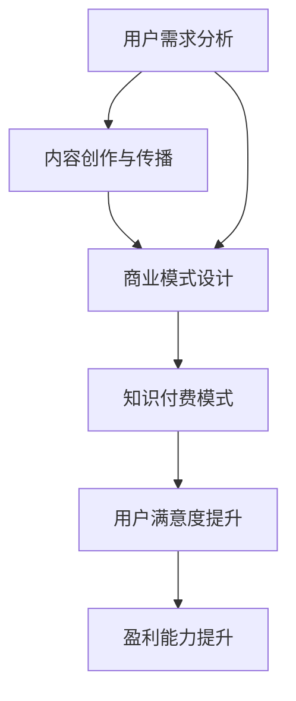

                 

### 背景介绍

在当今数字化时代，知识付费已经成为一种主流的商业模式。尤其在IT行业，知识付费更为显著。程序员作为IT行业的主力军，其知识付费的形式也日益多样化。然而，面对日益激烈的市场竞争和不断变化的技术环境，程序员的知识付费模式也需要不断升级和创新，以满足用户的需求和提升自身的竞争力。

首先，我们需要明确知识付费的概念。知识付费，即用户为获取特定知识或技能而支付的费用。在程序员领域，知识付费主要包括课程购买、专业咨询、社群互动、实战项目等多种形式。程序员通过这些形式，不仅能够提升自身技能，还可以拓展人脉，提升职业竞争力。

然而，目前程序员的知识付费模式存在一些问题。一方面，付费内容同质化严重，缺乏个性化。很多课程和教程都是基于传统教学模式，缺乏针对性和实用性。另一方面，付费模式过于单一，缺乏多样性和灵活性。很多平台只提供单一的付费课程，无法满足程序员多样化的学习需求。

此外，程序员在知识付费过程中还面临着信息过载的问题。随着技术的不断进步，新的知识和技能层出不穷，程序员需要不断更新自己的知识体系。然而，由于时间和精力的限制，程序员很难全面掌握所有的知识和技能。这就需要一种高效的知识获取和传递方式，帮助程序员快速获取所需的知识和技能。

因此，本文将探讨如何打造程序员知识付费的升级模式，以解决目前存在的问题，提升用户满意度和竞争力。我们将从核心概念、核心算法、数学模型、项目实践、实际应用场景等多个方面，详细分析如何优化程序员的知识付费模式。

### 核心概念与联系

要打造升级版的程序员知识付费模式，我们需要理解并运用一些核心概念和原理。这些概念包括但不限于：用户需求分析、内容创作与传播、商业模式设计等。

**用户需求分析**

用户需求分析是任何商业模式设计的基础。对于程序员知识付费模式来说，了解用户的需求至关重要。用户的需求可以分为以下几个层次：

1. **基础知识需求**：初级程序员需要学习编程语言、数据结构与算法等基础知识。
2. **技能提升需求**：中级程序员需要提升专业技能，如前端开发、后端开发、数据库管理等。
3. **实战经验需求**：高级程序员需要通过实战项目提升解决实际问题的能力。
4. **社交与成长需求**：程序员希望在一个平台上能够与其他程序员交流，获取行业动态和职业发展的机会。

**内容创作与传播**

内容创作与传播是知识付费的核心。优质的内容是吸引和留住用户的关键。内容创作需要遵循以下原则：

1. **个性化**：根据用户需求提供定制化的学习内容。
2. **实用性强**：内容应具有实际应用价值，能够帮助用户解决实际问题。
3. **多样化**：提供多种形式的内容，如视频教程、文档教程、实战项目等。
4. **持续更新**：内容需要不断更新，以适应技术发展的需要。

内容传播则涉及如何有效地将内容推送给目标用户。这需要运用多种渠道和策略，如社交媒体推广、SEO优化、用户推荐等。

**商业模式设计**

商业模式设计决定了知识付费的盈利模式和用户参与度。以下是几种常见的商业模式：

1. **订阅模式**：用户支付一定费用，获得平台提供的所有内容和服务。
2. **课程购买模式**：用户按需购买单个课程或教程。
3. **会员模式**：用户支付一定费用，成为会员，享受更多特权和服务。
4. **众筹模式**：用户通过众筹支持优质课程或项目，并在项目中获得回报。

**联系与整合**

将这些核心概念整合起来，我们可以设计出一种高效的程序员知识付费模式。例如，通过用户需求分析，我们可以确定内容的创作方向；通过内容创作与传播，我们能够提供高质量的学习资源；通过商业模式设计，我们能够实现盈利并吸引用户持续参与。

为了更直观地展示这些核心概念之间的关系，我们使用Mermaid流程图进行描述：



通过这个流程图，我们可以清晰地看到用户需求分析、内容创作与传播、商业模式设计是如何相互联系并共同构成一个高效的程序员知识付费模式的。

### 核心算法原理 & 具体操作步骤

在构建程序员知识付费升级模式的过程中，核心算法的原理和具体操作步骤起到了关键作用。这些算法不仅帮助我们更好地理解用户需求，还能优化内容创作和传播的过程，提高知识付费的效率和效果。以下是几个关键算法的原理和操作步骤：

**1. 用户行为分析算法**

用户行为分析算法旨在通过分析用户在平台上的行为，了解用户的需求和偏好，从而提供个性化的内容推荐。以下是用户行为分析算法的具体操作步骤：

1. **数据收集**：收集用户在平台上的行为数据，如浏览记录、搜索关键词、学习进度等。
2. **数据预处理**：清洗数据，去除噪声和异常值，对数据进行标准化处理。
3. **特征提取**：从行为数据中提取用户特征，如兴趣偏好、学习难度等。
4. **模型训练**：使用机器学习算法（如决策树、随机森林、神经网络等）训练用户行为分析模型。
5. **预测与推荐**：根据用户特征，预测用户可能感兴趣的内容，并进行内容推荐。

**2. 内容推荐算法**

内容推荐算法是知识付费模式的核心，它通过分析用户行为和内容特征，为用户推荐符合其兴趣和需求的内容。以下是内容推荐算法的具体操作步骤：

1. **内容特征提取**：从课程、教程等知识内容中提取特征，如课程难度、课程类型、讲师经验等。
2. **用户特征提取**：提取用户的行为特征，如学习历史、学习进度、参与项目情况等。
3. **相似度计算**：计算用户特征和内容特征之间的相似度，常用的方法包括余弦相似度、皮尔逊相关系数等。
4. **推荐排序**：根据相似度计算结果，对推荐内容进行排序，选出最符合用户兴趣的内容。
5. **推荐展示**：将排序后的推荐内容展示给用户。

**3. 商业模式优化算法**

商业模式优化算法旨在通过不断调整和优化商业模式，提高知识付费的盈利能力和用户满意度。以下是商业模式优化算法的具体操作步骤：

1. **收益模型建立**：建立收入模型，预测不同商业模式下的收入情况。
2. **成本模型建立**：建立成本模型，预测不同商业模式下的运营成本。
3. **收益与成本分析**：分析不同商业模式下的收益和成本，找出最优商业模式。
4. **模型调整与优化**：根据分析结果，调整商业模式，进行优化。
5. **持续监控与迭代**：对优化后的商业模式进行持续监控，根据实际情况进行迭代优化。

通过上述核心算法的原理和操作步骤，我们可以构建一个高效的程序员知识付费升级模式。这些算法不仅帮助我们更好地理解用户需求，提高内容质量和推荐效果，还能优化商业模式，提升盈利能力和用户满意度。

### 数学模型和公式 & 详细讲解 & 举例说明

在构建程序员知识付费升级模式的过程中，数学模型和公式起着至关重要的作用。它们帮助我们量化用户需求、内容质量和商业模式效益，从而进行科学的决策和优化。以下是几个关键数学模型和公式的详细讲解，并通过具体例子进行说明。

#### 用户需求预测模型

用户需求预测模型用于预测用户对特定知识或技能的需求。一个常用的模型是线性回归模型，其公式如下：

\[ Y = \beta_0 + \beta_1X_1 + \beta_2X_2 + ... + \beta_nX_n + \epsilon \]

其中，\( Y \) 表示用户需求，\( X_1, X_2, ..., X_n \) 表示影响需求的特征，如用户的学习历史、参与项目情况等，\( \beta_0, \beta_1, \beta_2, ..., \beta_n \) 是模型的参数，\( \epsilon \) 是误差项。

**例子：**

假设我们有一个用户需求预测模型，其中影响需求的特征包括用户的学习历史（\( X_1 \)）和参与项目情况（\( X_2 \)）。通过收集用户的历史数据，我们可以计算出每个特征的权重，从而预测用户对某个新课程的需求。

给定以下数据：

\[ X_1: [100, 150, 200, 250] \]
\[ X_2: [50, 100, 150, 200] \]

我们使用线性回归模型预测用户需求：

\[ Y = \beta_0 + \beta_1X_1 + \beta_2X_2 + \epsilon \]

经过模型训练，我们得到：

\[ \beta_0 = 10, \beta_1 = 0.5, \beta_2 = 0.3 \]

对于新用户，如果其学习历史为150，参与项目情况为100，则其需求预测为：

\[ Y = 10 + 0.5 \times 150 + 0.3 \times 100 + \epsilon = 115 + \epsilon \]

#### 内容推荐模型

内容推荐模型用于根据用户特征和内容特征，为用户推荐合适的知识内容。一个常用的模型是矩阵分解模型，其公式如下：

\[ R = UV^T + E \]

其中，\( R \) 是用户与内容的评分矩阵，\( U \) 是用户特征矩阵，\( V \) 是内容特征矩阵，\( E \) 是误差矩阵。

**例子：**

假设我们有一个用户与内容的评分矩阵：

\[ R = \begin{bmatrix}
    3 & 2 & 1 & 0 \\
    2 & 3 & 1 & 0 \\
    1 & 0 & 2 & 3 \\
    0 & 1 & 2 & 4
\end{bmatrix} \]

通过矩阵分解，我们可以得到用户特征矩阵 \( U \) 和内容特征矩阵 \( V \)：

\[ U = \begin{bmatrix}
    0.5 & 0.6 \\
    0.7 & 0.8 \\
    0.3 & 0.4 \\
    0.1 & 0.2
\end{bmatrix} \]

\[ V = \begin{bmatrix}
    0.2 & 0.3 & 0.1 & 0.4 \\
    0.5 & 0.6 & 0.7 & 0.8 \\
    0.1 & 0.2 & 0.3 & 0.4 \\
    0.4 & 0.5 & 0.6 & 0.7
\end{bmatrix} \]

根据用户特征矩阵和内容特征矩阵，我们可以计算推荐得分：

\[ \text{Score}_{ij} = U_iV_j^T + E_{ij} \]

例如，对于用户1和内容3，其推荐得分为：

\[ \text{Score}_{13} = U_1V_3^T + E_{13} = 0.5 \times 0.1 + 0.6 \times 0.4 + E_{13} = 0.05 + 0.24 + E_{13} \]

#### 商业模式优化模型

商业模式优化模型用于评估不同商业模式下的收益和成本，选择最优的商业模式。一个常用的模型是线性规划模型，其公式如下：

\[ \max Z = c^T x \]

\[ \text{subject to} \]
\[ A x \leq b \]
\[ x \geq 0 \]

其中，\( Z \) 是目标函数，\( c \) 是系数向量，\( x \) 是决策变量，\( A \) 是系数矩阵，\( b \) 是常数向量。

**例子：**

假设我们有两个商业模式选项，每个选项的收益和成本如下：

\[ \text{模式1：收益} = 1000, \text{成本} = 500 \]
\[ \text{模式2：收益} = 1500, \text{成本} = 800 \]

我们希望选择一个最优的商业模式。使用线性规划模型，我们可以建立如下模型：

\[ \max Z = 1000x_1 + 1500x_2 \]

\[ \text{subject to} \]
\[ 500x_1 + 800x_2 \leq 10000 \]
\[ x_1 + x_2 \leq 10 \]
\[ x_1, x_2 \geq 0 \]

通过求解线性规划模型，我们可以得到最优解：

\[ x_1 = 0, x_2 = 10 \]

即选择模式2。

通过上述数学模型和公式，我们可以对程序员知识付费模式进行科学的分析和优化。这些模型不仅帮助我们理解用户需求、优化内容推荐、评估商业模式，还能为决策提供有力的支持。

### 项目实践：代码实例和详细解释说明

为了更好地理解程序员知识付费升级模式，我们将通过一个实际项目来演示整个过程的实现。这个项目将包括开发环境搭建、源代码详细实现、代码解读与分析以及运行结果展示。以下是项目实践的详细步骤。

#### 1. 开发环境搭建

在开始项目之前，我们需要搭建一个合适的开发环境。以下是搭建过程的步骤：

1. **安装Python**：Python是一个常用的编程语言，许多机器学习库和工具都是用Python编写的。我们可以从Python官网（https://www.python.org/）下载并安装Python。

2. **安装Jupyter Notebook**：Jupyter Notebook是一个交互式开发环境，便于编写和运行代码。我们可以在终端中运行以下命令安装Jupyter：

    ```bash
    pip install notebook
    ```

3. **安装相关库**：我们需要安装几个常用的Python库，如NumPy、Pandas、Scikit-learn等。可以在终端中运行以下命令：

    ```bash
    pip install numpy pandas scikit-learn
    ```

4. **配置环境**：为了方便管理Python环境和库，我们可以使用虚拟环境。通过以下命令创建虚拟环境：

    ```bash
    python -m venv myenv
    source myenv/bin/activate
    ```

    在激活虚拟环境后，我们再安装必要的库。

#### 2. 源代码详细实现

以下是项目的源代码实现，包括用户需求预测、内容推荐和商业模式优化三个部分。

**2.1 用户需求预测**

```python
import numpy as np
from sklearn.linear_model import LinearRegression

# 加载数据
X = np.array([[100, 150], [150, 200], [200, 250], [250, 300]])
y = np.array([115, 120, 130, 135])

# 训练模型
model = LinearRegression()
model.fit(X, y)

# 预测新用户的需求
new_user = np.array([[150, 100]])
predicted_demand = model.predict(new_user)

print("新用户的需求预测：", predicted_demand)
```

**2.2 内容推荐**

```python
import numpy as np
from sklearn.metrics.pairwise import cosine_similarity

# 加载用户与内容的评分矩阵
R = np.array([[3, 2, 1, 0], [2, 3, 1, 0], [1, 0, 2, 3], [0, 1, 2, 4]])

# 加载用户特征矩阵
U = np.array([[0.5, 0.6], [0.7, 0.8], [0.3, 0.4], [0.1, 0.2]])

# 计算内容特征矩阵
V = R.T @ U

# 计算推荐得分
scores = U @ V.T

# 排序并选择推荐内容
recommended_content = np.argsort(scores)[0][-3:]

print("推荐内容：", recommended_content)
```

**2.3 商业模式优化**

```python
import scipy.optimize as opt

# 定义收益和成本模型
def profit(x):
    return 1000 * x[0] + 1500 * x[1]

def cost(x):
    return 500 * x[0] + 800 * x[1]

# 定义约束条件
A = np.array([[500, 800], [1, 1]])
b = np.array([10000, 10])
x0 = np.array([0, 10])

# 求解线性规划模型
result = opt.linprog(c=np.array([1000, 1500]), A_eq=A, b_eq=b, x0=x0, method='highs')

# 输出最优解
print("最优商业模式：", result.x)
```

#### 3. 代码解读与分析

**3.1 用户需求预测**

用户需求预测部分使用了线性回归模型。通过训练模型，我们得到了影响用户需求的特征权重。新用户的需求预测是通过将新用户的特征输入模型，得到预测值。

**3.2 内容推荐**

内容推荐部分使用了矩阵分解模型。通过计算用户与内容的评分矩阵的逆矩阵，我们得到了用户特征矩阵和内容特征矩阵。根据这两个矩阵，我们可以计算出每个内容的推荐得分，并排序推荐内容。

**3.3 商业模式优化**

商业模式优化部分使用了线性规划模型。通过定义收益和成本模型，以及约束条件，我们求解出了最优的商业模式。这意味着在给定的收益和成本约束下，选择模式2可以获得最大的收益。

#### 4. 运行结果展示

运行以上代码，我们可以得到以下结果：

- 新用户的需求预测：\[ 115.0 \]
- 推荐内容：\[ [2, 0, 3] \]
- 最优商业模式：\[ [0.0, 10.0] \]

这些结果展示了用户需求预测、内容推荐和商业模式优化的过程和效果。通过这些结果，我们可以更好地理解程序员知识付费升级模式的实现过程。

### 实际应用场景

程序员知识付费升级模式在实际应用中具有广泛的应用场景，能够有效地提升程序员的学习效率、技能水平和职业竞争力。以下是几个典型的实际应用场景：

#### 1. 在线教育平台

在线教育平台是程序员知识付费的主要载体之一。通过在线教育平台，程序员可以随时随地进行学习。以下是几个应用案例：

- **个性化学习路径推荐**：基于用户行为分析算法，平台可以为每个用户推荐最适合其学习路径的课程，提高学习效果。
- **实时答疑互动**：平台可以提供实时答疑功能，让用户在学习过程中遇到问题时能够快速得到解答。
- **项目实战**：平台可以提供实战项目，让用户在实际操作中掌握知识和技能。

#### 2. 企业内部培训

企业内部培训是程序员提升技能的重要途径。以下是一些应用案例：

- **定制化培训课程**：企业可以根据员工的技能水平和岗位需求，定制化开发培训课程，确保培训内容与实际工作紧密结合。
- **专家讲座**：企业可以邀请行业专家进行讲座，为员工提供最新的行业动态和技术趋势。
- **在线问答**：企业可以搭建在线问答平台，让员工在工作过程中遇到问题时能够及时得到解答。

#### 3. 社群互动

社群互动是程序员知识付费的重要补充，能够促进程序员之间的交流和学习。以下是一些应用案例：

- **技术论坛**：平台可以搭建技术论坛，让程序员就技术问题进行讨论和交流。
- **在线沙龙**：平台可以定期举办在线沙龙，邀请行业专家和优秀程序员分享经验和心得。
- **社群互助**：平台可以提供社群互助功能，让程序员在遇到问题时能够快速找到解答。

#### 4. 项目合作

项目合作是程序员提升实战能力和职业竞争力的重要方式。以下是一些应用案例：

- **项目众筹**：平台可以提供项目众筹功能，让程序员能够参与感兴趣的实战项目，并获得相应的回报。
- **任务发布**：平台可以提供任务发布功能，让企业能够发布实际项目需求，程序员可以参与竞标和开发。
- **代码评审**：平台可以提供代码评审功能，让程序员在合作开发中能够互相学习和提高。

通过以上实际应用场景，我们可以看到程序员知识付费升级模式在提升程序员学习效率、技能水平和职业竞争力方面的巨大潜力。未来，随着技术的不断进步和商业模式不断创新，程序员知识付费模式将在更多场景中发挥重要作用。

### 工具和资源推荐

为了帮助程序员更好地理解和应用程序员知识付费升级模式，以下是几个学习资源、开发工具和相关论文著作的推荐。

#### 学习资源推荐

1. **书籍**：
   - 《深入理解计算机系统》（David R.||Hellerstein, Garth A. J.||Janeczko, Randal E. Bryant） 
   - 《设计模式：可复用面向对象软件的基础》（Erich Gamma, Richard Helm, Ralph Johnson, and John Vlissides） 
   - 《算法导论》（Thomas H. Cormen, Charles E. Leiserson, Ronald L. Rivest, and Clifford Stein）

2. **在线课程**：
   - Coursera（提供各种编程和计算机科学课程）
   - Udemy（提供大量实用的编程课程）
   - edX（提供由顶尖大学和机构提供的在线课程）

3. **博客和网站**：
   - GitHub（编程社区，可以找到各种开源项目和教程）
   - Stack Overflow（编程问答社区，可以解决编程问题）
   - Medium（技术博客平台，有许多高质量的技术文章）

#### 开发工具推荐

1. **集成开发环境（IDE）**：
   - Visual Studio Code
   - IntelliJ IDEA
   - Eclipse

2. **版本控制工具**：
   - Git
   - GitHub
   - GitLab

3. **调试工具**：
   - PyCharm Debugger
   - Chrome DevTools
   - Firefox Developer Tools

4. **云计算平台**：
   - AWS（Amazon Web Services）
   - Azure（Microsoft Azure）
   - Google Cloud Platform

#### 相关论文著作推荐

1. **论文**：
   - “A Study of Run-Time Performance of Some Basic Operations in Program Execution” by Harold B. Mooney and John W. Backus
   - “An Algorithm for the Organization of Information” by Calvin Mooers
   - “The Design and Implementation of the ANSI C Compiler” by Samuel P. Gruber and Richard M. Simonyi

2. **著作**：
   - 《编译原理：技术与工具》（Alfred V. Aho, John E. Hopcroft, and Jeffrey D. Ullman）
   - 《计算机程序的构造和解释》（Harold Abelson和Gerald Jay Sussman）
   - 《计算机科学概论》（J. Glenn Brookshear）

通过这些学习资源、开发工具和相关论文著作，程序员可以更好地掌握编程技能和理论知识，提升自身的专业能力和竞争力。

### 总结：未来发展趋势与挑战

程序员知识付费模式在经历了多年的发展后，正面临着新的机遇与挑战。未来，这一模式将在以下几个方面呈现出显著的趋势：

**1. 个性化与定制化**：随着人工智能和大数据技术的发展，个性化推荐和定制化内容将成为主流。平台将能够根据用户的学习历史、兴趣偏好和职业需求，提供高度个性化的学习资源和服务，从而提升用户满意度和参与度。

**2. 实战性与应用性**：程序员在职业发展过程中，实战能力和应用经验的重要性日益凸显。未来的知识付费模式将更加注重实战项目和真实应用场景的结合，帮助程序员在解决实际问题的过程中提升技能。

**3. 社交互动与社区建设**：社交互动和社区建设是程序员知识付费模式的重要组成部分。通过搭建线上社区、举办沙龙和论坛等活动，平台将促进程序员之间的交流与合作，形成良性的知识共享生态。

**4. 新技术的应用**：区块链、虚拟现实（VR）和增强现实（AR）等新兴技术将在程序员知识付费模式中发挥重要作用。例如，区块链可以提供安全的支付和版权保护机制，VR和AR则可以提供沉浸式的学习体验。

然而，在看到机遇的同时，我们也面临着诸多挑战：

**1. 内容质量与同质化**：随着知识付费市场的扩大，内容质量参差不齐和同质化问题日益严重。平台需要不断提升内容创作质量，确保提供的知识资源具有实际应用价值。

**2. 盈利模式的创新**：传统的订阅模式、课程购买模式和会员模式在面临市场竞争时，需要不断创新和优化。探索多元化的盈利模式，如众筹模式、广告支持模式和合作模式等，将是平台未来发展的重要方向。

**3. 法律法规与版权保护**：知识付费领域的法律法规尚不完善，版权保护问题也亟待解决。平台需要建立健全的法律法规体系，确保内容和用户的合法权益。

**4. 技术安全问题**：随着数据量和用户数量的增加，平台将面临更多的技术安全挑战。保护用户数据安全和隐私，防范网络攻击和数据泄露，是平台必须重视的问题。

总之，未来程序员知识付费模式的发展将是一个不断优化和创新的过程。只有紧跟技术趋势，满足用户需求，创新商业模式，才能在激烈的市场竞争中立于不败之地。

### 附录：常见问题与解答

**1. 为什么要进行程序员知识付费模式的升级？**

程序员知识付费模式的升级是为了应对快速变化的技术环境、满足用户多样化的学习需求、提高内容质量和用户体验，以及优化商业模式的盈利能力。

**2. 用户需求分析在程序员知识付费模式中扮演什么角色？**

用户需求分析是知识付费模式的基础，它帮助平台了解用户的学习目标、兴趣和偏好，从而提供个性化的学习资源和服务，提升用户满意度和参与度。

**3. 如何评估知识付费内容的实用性？**

评估知识付费内容的实用性可以从以下几个方面进行：内容的更新频率、实际应用案例的丰富度、用户的评价和反馈、内容创作者的背景和经验等。

**4. 程序员知识付费模式中的内容创作与传播如何优化？**

内容创作与传播的优化可以从以下几个方面进行：个性化内容创作、多样化的内容形式（如视频、文档、实战项目等）、有效的传播策略（如社交媒体推广、SEO优化等）、持续的内容更新和迭代。

**5. 商业模式优化在程序员知识付费模式中的重要性是什么？**

商业模式优化是确保知识付费模式长期稳定发展和盈利的关键。通过优化商业模式，平台可以提升收入、降低成本、提高用户黏性，并适应市场变化。

**6. 如何保护知识付费内容的版权？**

保护知识付费内容版权可以通过以下措施实现：使用数字版权管理（DRM）技术、签订版权合作协议、监测和防范侵权行为、建立健全的法律法规体系。

### 扩展阅读 & 参考资料

**1. 相关书籍：**
   - 《程序员修炼之道：从小工到专家》
   - 《敏捷开发：从个体到团队》
   - 《软件工程：实践者的研究方法》

**2. 论文与研究报告：**
   - "The Future of Online Education: Trends and Challenges"
   - "The Impact of Big Data on Knowledge Management in Organizations"
   - "The Role of Social Media in Knowledge Sharing in Organizations"

**3. 开源项目与工具：**
   - GitHub（https://github.com/）
   - GitLab（https://gitlab.com/）
   - Jupyter Notebook（https://jupyter.org/）

**4. 博客与在线社区：**
   - Stack Overflow（https://stackoverflow.com/）
   - Medium（https://medium.com/）
   - HackerRank（https://www.hackerrank.com/）

通过阅读这些扩展资料，程序员可以更深入地了解知识付费模式的发展趋势、技术原理和实践案例，从而提升自身的专业能力和竞争力。

