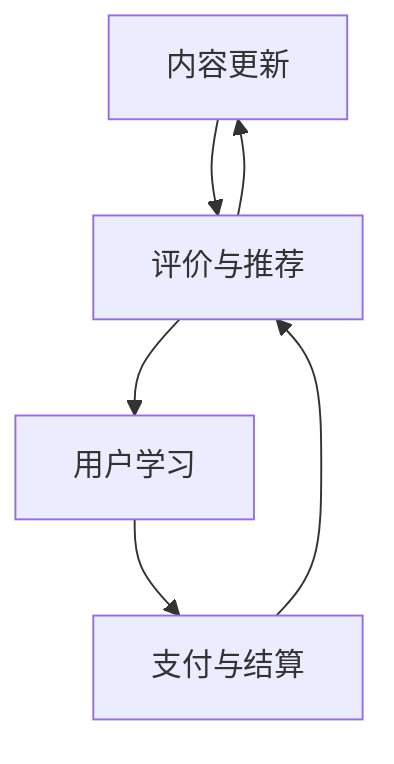

                 

### 背景介绍

在当今信息化社会中，知识付费已经成为一种趋势。特别是在IT领域，随着技术的快速发展和更新，程序员们需要不断学习新的知识和技能来跟上时代的步伐。知识付费作为一种高效的学习方式，不仅为程序员们提供了丰富的学习资源，也为知识提供者带来了收益。本文将探讨程序员如何利用知识付费模式，打造自己的工作坊课程，实现自我提升和商业化目标。

程序员知识付费是指通过互联网平台，以付费形式为程序员提供专业知识和技能的学习资源。这种模式的出现，主要得益于以下几个因素：

1. **技术发展的需求**：IT行业技术更新速度快，程序员需要不断学习新的技术和工具来提升自己的竞争力。知识付费为程序员提供了一个便捷的学习途径，让他们能够随时随地进行学习。

2. **互联网的普及**：随着互联网的普及，在线学习已经成为主流学习方式。程序员可以通过各种在线平台，如MOOC（大规模在线开放课程）、知识星球等，获取高质量的学习资源。

3. **商业模式的创新**：知识付费模式的兴起，为内容创作者提供了新的商业模式。程序员可以通过创作高质量的课程内容，实现知识变现，从而获得经济收益。

本文将围绕程序员如何打造工作坊课程，从以下几个方面进行探讨：

1. **核心概念与联系**：介绍程序员知识付费的核心概念，并运用Mermaid流程图展示相关架构和流程。

2. **核心算法原理与具体操作步骤**：详细解析程序员知识付费的工作机制，包括内容创作、课程发布、用户学习等环节。

3. **数学模型和公式**：阐述程序员知识付费的经济学原理，包括成本效益分析、市场供需模型等。

4. **项目实践**：通过代码实例，展示如何搭建一个简单的知识付费平台，并提供详细解释。

5. **实际应用场景**：分析程序员知识付费在不同领域的应用案例，探讨其优势和挑战。

6. **工具和资源推荐**：推荐相关的学习资源和开发工具，帮助程序员更好地进行知识付费实践。

7. **总结与展望**：总结程序员知识付费的发展现状，探讨未来发展趋势和挑战。

接下来，我们将逐步深入探讨这些内容，帮助程序员们更好地利用知识付费模式，提升自己的专业技能和商业价值。

### 核心概念与联系

程序员知识付费的核心概念主要包括以下几个方面：

1. **内容创作**：知识提供者（通常是拥有专业知识和经验的程序员）创作高质量的学习内容，如教程、课程、案例分析等。

2. **平台发布**：知识提供者将创作的内容发布到线上平台，如知识星球、MOOC等，供用户订阅和学习。

3. **用户学习**：用户通过平台订阅课程，学习内容，并通过互动交流、作业练习等方式进行深入学习。

4. **支付与结算**：用户在学习过程中，根据课程内容进行支付，平台提供自动化的支付结算服务。

为了更直观地展示这些核心概念之间的联系，我们使用Mermaid流程图来描述整个工作流程。



- **A[内容创作]**：知识提供者根据自身专业知识和经验，创作高质量的学习内容。

- **B[平台发布]**：知识提供者将创作的内容发布到线上平台，用户可以通过平台浏览和订阅这些课程。

- **C[用户学习]**：用户在平台上订阅课程后，可以随时随地进行学习，并通过互动交流、作业练习等方式进行深入学习。

- **D[支付与结算]**：用户在学习过程中，根据课程内容进行支付，平台提供自动化的支付结算服务。

- **评价与推荐**：用户完成学习后，可以对课程进行评价，平台根据用户评价进行推荐，帮助更多用户发现优质课程。

- **内容更新**：知识提供者根据用户反馈和市场需求，不断更新和优化课程内容，提高课程质量。

通过Mermaid流程图，我们可以清晰地看到程序员知识付费的整个工作流程，以及各个核心概念之间的联系。这为程序员们提供了一个直观的理解框架，有助于他们更好地进行知识付费实践。

### 核心算法原理与具体操作步骤

程序员知识付费的核心算法原理可以归结为以下几点：

1. **成本效益分析**：知识提供者在创作内容时，需要考虑内容创作成本与预期收益之间的关系。通过成本效益分析，确定哪些内容具有市场前景，能够实现盈利。

2. **市场供需模型**：知识提供者需要了解市场需求，根据市场供需关系调整课程内容和定价策略，以最大化收益。

3. **用户行为分析**：平台通过对用户行为数据进行分析，了解用户需求和学习习惯，为知识提供者提供数据支持，优化课程内容和推广策略。

下面，我们将详细阐述这些核心算法原理的具体操作步骤：

#### 1. 成本效益分析

**步骤1**：确定内容创作成本
- **人力成本**：包括知识提供者的工资、福利等。
- **材料成本**：包括书籍、软件、硬件等。
- **时间成本**：包括知识提供者用于创作内容的时间。

**步骤2**：估算预期收益
- **订阅费用**：根据课程内容的价值和市场定位，设定合理的订阅费用。
- **广告收入**：通过平台广告分成获得收益。
- **其他收入**：包括课程推广、线下培训等。

**步骤3**：计算成本与收益比
- **收益比**：预期收益 / 内容创作成本
- **盈亏平衡点**：内容创作成本 / 收益比

**示例**：
假设某程序员创作一门价值1000元的课程，创作成本为5000元。预期通过课程订阅获得5000元收入。计算成本与收益比为5000/5000=1，表明这门课程的成本与收益相当。如果要实现盈利，需要降低创作成本或提高订阅费用。

#### 2. 市场供需模型

**步骤1**：分析市场需求
- **行业趋势**：了解当前行业的发展趋势和热门技术。
- **用户需求**：通过调查问卷、用户反馈等方式了解用户需求。

**步骤2**：确定课程内容和定价策略
- **课程内容**：根据市场需求，设计具有针对性的课程内容。
- **定价策略**：根据市场供需关系，设定合理的课程定价。

**示例**：
假设某程序员发现市场上对Python编程语言的需求较高，决定创作一门Python入门课程。通过市场调查，了解到入门级Python课程的市场价在200-500元之间。根据市场供需关系，程序员可以将课程定价为350元，以吸引更多用户。

#### 3. 用户行为分析

**步骤1**：收集用户行为数据
- **订阅数据**：记录用户订阅课程的情况，包括订阅时间、课程种类等。
- **学习行为**：记录用户学习行为，如学习时长、完成作业情况等。
- **互动数据**：记录用户在平台上的互动情况，如提问、评论等。

**步骤2**：分析用户行为
- **用户画像**：通过分析用户行为数据，构建用户画像，了解用户需求和偏好。
- **优化课程内容**：根据用户画像，调整课程内容，提高用户满意度。
- **推广策略**：根据用户画像，制定针对性的推广策略，提高课程曝光度。

**示例**：
假设某程序员通过数据分析发现，大部分用户在学习过程中，对Python列表和字典部分的内容掌握较好，但对函数和类的部分掌握较困难。据此，程序员可以在课程中增加针对这些知识点的练习和讲解，以提高用户学习效果。

通过以上步骤，程序员可以运用核心算法原理，实现知识付费的持续优化和商业化。在实际操作过程中，程序员需要不断调整和优化这些策略，以适应市场变化和用户需求。

### 数学模型和公式

在程序员知识付费的过程中，数学模型和公式可以用来分析和优化内容创作、定价策略以及用户行为。以下是几个关键的数学模型和公式，以及详细的讲解和示例。

#### 成本效益分析

**1. 成本模型**

成本模型用来计算内容创作的总成本，包括固定成本和可变成本。

- **固定成本**（Fixed Cost，FC）：不随内容数量变化的成本，如人力成本、设备成本等。
- **可变成本**（Variable Cost，VC）：随内容数量变化的成本，如材料成本、推广成本等。

**成本模型公式**：

$$
C(x) = FC + x \cdot VC
$$

其中，\( C(x) \) 是总成本，\( x \) 是内容数量。

**示例**：

假设固定成本为 \( FC = 5000 \) 元，可变成本为 \( VC = 100 \) 元/门课程。如果创作 10 门课程，总成本为：

$$
C(10) = 5000 + 10 \cdot 100 = 6000 \text{元}
$$

#### 2. 收益模型

收益模型用来计算内容创作的总收益，包括订阅费用、广告收入和其他收入。

- **订阅费用**（Subscription Fee，SF）：每门课程的订阅费用。
- **广告收入**（Advertising Revenue，AR）：通过平台广告获得的收入。
- **其他收入**（Other Revenue，OR）：包括课程推广、线下培训等。

**收益模型公式**：

$$
R(x) = x \cdot SF + AR + OR
$$

其中，\( R(x) \) 是总收益，\( x \) 是内容数量。

**示例**：

假设每门课程的订阅费用为 \( SF = 300 \) 元，广告收入为 \( AR = 1000 \) 元，其他收入为 \( OR = 500 \) 元。如果创作 10 门课程，总收益为：

$$
R(10) = 10 \cdot 300 + 1000 + 500 = 8500 \text{元}
$$

#### 3. 成本效益分析

成本效益分析用来比较收益和成本，确定内容的盈利能力。

**成本效益比**（Cost-Benefit Ratio，CBR）：

$$
CBR = \frac{R(x)}{C(x)}
$$

其中，\( C(x) \) 是总成本，\( R(x) \) 是总收益。

**盈亏平衡点**（Break-Even Point，BEP）：

$$
BEP = \frac{FC}{SF - VC}
$$

其中，\( FC \) 是固定成本，\( SF \) 是订阅费用，\( VC \) 是可变成本。

**示例**：

使用前面的假设数据，计算成本效益比和盈亏平衡点：

- **成本效益比**：

$$
CBR = \frac{8500}{6000} = 1.4167
$$

- **盈亏平衡点**：

$$
BEP = \frac{5000}{300 - 100} = \frac{5000}{200} = 25
$$

这意味着，当创作超过 25 门课程时，内容创作开始盈利。

#### 4. 市场供需模型

市场供需模型用来分析市场需求和供给，确定定价策略。

- **需求函数**（Demand Function，D(q)）：表示在特定价格下，用户对课程的需求量。
- **供给函数**（Supply Function，S(p)）：表示知识提供者在特定价格下，愿意提供的课程数量。

**需求函数示例**：

$$
D(q) = 10000 - 100 \cdot p
$$

其中，\( p \) 是价格，\( q \) 是需求量。

**供给函数示例**：

$$
S(p) = 100 + 10 \cdot p
$$

**均衡价格**（Equilibrium Price，\( p^* \)）：

$$
D(q^*) = S(q^*)
$$

其中，\( q^* \) 是均衡需求量，\( p^* \) 是均衡价格。

**示例**：

联立需求函数和供给函数，求解均衡价格和需求量：

$$
10000 - 100 \cdot p = 100 + 10 \cdot p
$$

解得：

$$
p^* = 90, \quad q^* = 10000 - 100 \cdot 90 = 1000
$$

这意味着，当价格定为 90 元时，市场需求量和供给量达到均衡。

通过以上数学模型和公式，程序员可以更好地理解知识付费的经济学原理，优化内容创作和定价策略，实现盈利目标。

### 项目实践：代码实例和详细解释说明

在本节中，我们将通过一个具体的代码实例，展示如何搭建一个简单的知识付费平台。这个平台将包含用户注册、课程订阅、课程学习等基本功能。我们将使用Python作为开发语言，并结合Flask框架进行开发。

#### 1. 开发环境搭建

**安装Python**

确保您已经安装了Python环境。Python版本建议为3.8及以上。

**安装Flask**

在命令行中执行以下命令安装Flask：

```bash
pip install Flask
```

**安装数据库**

我们使用SQLite作为数据库，它是一个轻量级、自带的数据库管理系统。

```bash
pip install flask_sqlalchemy
```

**安装其他依赖**

我们还需要安装一些其他依赖，如Flask-Migrate（用于数据库迁移）和Flask-WTF（用于表单处理）：

```bash
pip install Flask-Migrate Flask-WTF
```

#### 2. 源代码详细实现

**app.py**

```python
from flask import Flask, render_template, request, redirect, url_for
from flask_sqlalchemy import SQLAlchemy
from flask_migrate import Migrate

app = Flask(__name__)
app.config['SQLALCHEMY_DATABASE_URI'] = 'sqlite:///knowledge_pay.db'
db = SQLAlchemy(app)
migrate = Migrate(app, db)

# 用户模型
class User(db.Model):
    id = db.Column(db.Integer, primary_key=True)
    username = db.Column(db.String(80), unique=True, nullable=False)
    password = db.Column(db.String(120), nullable=False)

# 课程模型
class Course(db.Model):
    id = db.Column(db.Integer, primary_key=True)
    title = db.Column(db.String(120), nullable=False)
    description = db.Column(db.Text, nullable=False)
    price = db.Column(db.Float, nullable=False)

# 用户订阅模型
class Subscription(db.Model):
    id = db.Column(db.Integer, primary_key=True)
    user_id = db.Column(db.Integer, db.ForeignKey('user.id'), nullable=False)
    course_id = db.Column(db.Integer, db.ForeignKey('course.id'), nullable=False)

# 注册路由
@app.route('/register', methods=['GET', 'POST'])
def register():
    if request.method == 'POST':
        username = request.form['username']
        password = request.form['password']
        user = User(username=username, password=password)
        db.session.add(user)
        db.session.commit()
        return redirect(url_for('login'))
    return render_template('register.html')

# 登录路由
@app.route('/login', methods=['GET', 'POST'])
def login():
    if request.method == 'POST':
        username = request.form['username']
        password = request.form['password']
        user = User.query.filter_by(username=username, password=password).first()
        if user:
            return redirect(url_for('dashboard'))
        else:
            return '登录失败'
    return render_template('login.html')

# 仪表盘路由
@app.route('/dashboard')
def dashboard():
    courses = Course.query.all()
    return render_template('dashboard.html', courses=courses)

# 课程详情路由
@app.route('/course/<int:course_id>')
def course(course_id):
    course = Course.query.get(course_id)
    return render_template('course.html', course=course)

# 订阅课程路由
@app.route('/subscribe/<int:course_id>')
def subscribe(course_id):
    user_id = 1  # 这里需要根据实际情况获取用户ID
    course = Course.query.get(course_id)
    subscription = Subscription(user_id=user_id, course_id=course_id)
    db.session.add(subscription)
    db.session.commit()
    return redirect(url_for('dashboard'))

if __name__ == '__main__':
    db.create_all()
    app.run(debug=True)
```

**register.html**

```html
<!DOCTYPE html>
<html>
<head>
    <title>注册</title>
</head>
<body>
    <form action="{{ url_for('register') }}" method="post">
        用户名：<input type="text" name="username"><br>
        密码：<input type="password" name="password"><br>
        <input type="submit" value="注册">
    </form>
</body>
</html>
```

**login.html**

```html
<!DOCTYPE html>
<html>
<head>
    <title>登录</title>
</head>
<body>
    <form action="{{ url_for('login') }}" method="post">
        用户名：<input type="text" name="username"><br>
        密码：<input type="password" name="password"><br>
        <input type="submit" value="登录">
    </form>
</body>
</html>
```

**dashboard.html**

```html
<!DOCTYPE html>
<html>
<head>
    <title>仪表盘</title>
</head>
<body>
    <h1>课程列表</h1>
    
        <div>
            <h2>{{ course.title }}</h2>
            <p>{{ course.description }}</p>
            <p>价格：{{ course.price }}</p>
            <a href="{{ url_for('course', course_id=course.id) }}">详情</a>
        </div>
    
</body>
</html>
```

**course.html**

```html
<!DOCTYPE html>
<html>
<head>
    <title>{{ course.title }}</title>
</head>
<body>
    <h1>{{ course.title }}</h1>
    <p>{{ course.description }}</p>
    <p>价格：{{ course.price }}</p>
    <a href="{{ url_for('subscribe', course_id=course.id) }}">订阅</a>
</body>
</html>
```

#### 3. 代码解读与分析

**数据库模型**

我们定义了三个数据库模型：User、Course和Subscription。

- **User**：用户模型，包含用户名和密码。
- **Course**：课程模型，包含课程标题、描述和价格。
- **Subscription**：用户订阅模型，关联用户和课程。

**路由和视图函数**

- **register**：处理用户注册请求，创建新用户并跳转到登录页面。
- **login**：处理用户登录请求，验证用户名和密码。
- **dashboard**：显示用户仪表盘，列出所有课程。
- **course**：显示课程详情。
- **subscribe**：处理用户订阅请求，创建新的订阅记录。

#### 4. 运行结果展示

在开发环境中，启动Flask应用：

```bash
python app.py
```

打开浏览器，访问 `http://127.0.0.1:5000/`，您将看到以下页面：

- 注册页面
- 登录页面
- 仪表盘页面，显示所有课程

点击课程详情链接，您将看到课程的具体信息。点击订阅按钮，将创建新的订阅记录。

通过这个简单的实例，我们展示了如何使用Flask搭建一个知识付费平台的基本框架。在实际应用中，您可以根据需求扩展更多功能，如课程评论、学习进度记录等。

### 实际应用场景

程序员知识付费的应用场景非常广泛，涵盖了多个领域。以下是一些典型的应用场景，以及它们的优势和挑战。

#### 1. 教育培训

在教育培训领域，知识付费为程序员提供了便捷的学习资源。通过在线课程、视频教程、实战案例等形式，程序员可以随时随地学习新知识。优势在于：

- **灵活性强**：程序员可以根据自己的时间安排进行学习，提高学习效率。
- **资源共享**：优质课程资源可以共享给更多程序员，扩大知识传播范围。

然而，教育培训领域的知识付费也面临一些挑战：

- **版权保护**：保护课程内容的版权，防止未经授权的复制和传播。
- **课程质量**：保证课程质量，满足用户的学习需求。

#### 2. 在线咨询

在线咨询是程序员知识付费的另一种形式。程序员可以通过线上平台，为有需求的程序员提供一对一的专业咨询服务。优势在于：

- **高效沟通**：线上咨询可以实时解答程序员的问题，提高沟通效率。
- **个性化服务**：根据用户需求，提供定制化的咨询服务。

在线咨询面临的挑战包括：

- **服务量**：如何平衡服务质量和咨询量，避免过度服务或服务质量下降。
- **隐私保护**：保护用户隐私，防止信息泄露。

#### 3. 开源社区

开源社区是程序员知识付费的重要平台。程序员可以在开源社区中发布自己的项目，并通过捐赠、赞助等形式获得收入。优势在于：

- **互助合作**：开源社区鼓励程序员合作，共同提升项目质量。
- **长期收益**：开源项目可以持续吸引关注，为程序员带来长期收益。

开源社区面临的挑战包括：

- **项目管理**：如何有效地管理开源项目，确保项目持续发展。
- **社区氛围**：维护良好的社区氛围，鼓励用户积极参与。

#### 4. 技术培训

技术培训是企业提升程序员技能的重要手段。企业可以通过知识付费平台，为员工提供专业培训课程。优势在于：

- **针对性**：根据企业需求，提供定制化的培训课程。
- **成本效益**：通过线上培训，降低企业培训成本。

技术培训面临的挑战包括：

- **培训质量**：确保培训课程质量，满足企业需求。
- **员工参与度**：提高员工参与培训的积极性，确保培训效果。

#### 5. 知识变现

知识变现是程序员实现自我价值的重要途径。通过创作高质量的学习内容，程序员可以将知识转化为经济收益。优势在于：

- **自主创业**：程序员可以通过知识变现，实现自主创业。
- **知识积累**：不断创作和优化内容，提升个人专业能力。

知识变现面临的挑战包括：

- **内容质量**：保证内容质量，吸引用户订阅。
- **市场竞争**：如何在激烈的市场竞争中脱颖而出。

通过以上实际应用场景的分析，我们可以看到程序员知识付费具有广泛的应用前景。然而，在实际操作过程中，程序员需要不断应对各种挑战，优化知识付费模式，实现可持续的商业化发展。

### 工具和资源推荐

在程序员知识付费的过程中，选择合适的工具和资源至关重要。以下是我们为程序员推荐的几种学习资源、开发工具和相关的论文著作。

#### 1. 学习资源推荐

- **书籍**：
  - 《代码大全》（Code Complete）：史蒂夫·迈克康奈尔（Steve McConnell）的经典著作，涵盖了软件开发的各个方面，是程序员必备的参考书。
  - 《Effective Java》：Joshua Bloch 编著，介绍了Java编程的最佳实践，对于提升Java编程能力非常有帮助。

- **论文**：
  - 《程序员修炼之道》：David Thomas 和 Andrew Hunt 撰写，深入探讨了编程的哲学和技巧，对程序员成长有重要启示。
  - 《深入理解计算机系统》（Deep Dive into Systems）：Rajagopal Ananthanarayanan 等人撰写的论文，详细介绍了计算机系统的各个方面，适合对系统编程感兴趣的程序员。

- **博客**：
  - 《左耳听风》：作者唐巧，分享了大量Python编程技巧和项目经验，是Python程序员的学习宝库。
  - 《码出高效》：作者刘欣，深入讲解了性能优化的方法和技巧，适合追求代码高效性的程序员。

- **在线课程**：
  - 《Python编程：从入门到实践》：廖雪峰所著，适合初学者快速入门Python编程。
  - 《机器学习实战》：作者秦涛，通过实际案例讲解机器学习算法，适合对机器学习感兴趣的程序员。

#### 2. 开发工具推荐

- **集成开发环境（IDE）**：
  - **Visual Studio Code**：一款轻量级、高度可扩展的IDE，支持多种编程语言，插件丰富，非常适合程序员使用。
  - **PyCharm**：一款强大的Python IDE，拥有丰富的功能和强大的代码分析能力，特别适合Python程序员。

- **版本控制工具**：
  - **Git**：一款流行的分布式版本控制系统，用于管理和跟踪源代码的变更。
  - **GitHub**：基于Git的在线代码托管平台，支持项目协作和代码评审，是程序员必备的工具。

- **调试工具**：
  - **PyCharm Debugger**：PyCharm自带的调试工具，支持多种调试技巧，帮助程序员快速定位和修复代码问题。
  - **Postman**：一款API调试工具，可以帮助程序员测试和验证API接口。

- **云服务平台**：
  - **AWS**：亚马逊云服务平台，提供了丰富的云计算服务，包括服务器、数据库、存储等。
  - **Azure**：微软的云服务平台，功能与AWS类似，适合需要使用微软技术的程序员。

#### 3. 相关论文著作推荐

- **《大型分布式系统的设计》**：高翔等人在此论文中介绍了大型分布式系统的设计原则和架构，对从事分布式系统开发的程序员具有重要参考价值。
- **《分布式系统原理与范型》**：George Coulouris、Jean Dollimore、Tim Grace 和 Gordon Blair 编著，详细讲解了分布式系统的原理和实现方法。
- **《深度学习》（Deep Learning）**：Ian Goodfellow、Yoshua Bengio 和 Aaron Courville 著，深度学习的经典教材，适合对深度学习感兴趣的程序员。

通过以上推荐，程序员可以更好地进行知识付费实践，提升自己的专业技能和商业价值。

### 总结：未来发展趋势与挑战

程序员知识付费作为一种新型的学习模式，正逐渐在IT领域形成一股强大的力量。未来，随着技术的不断进步和用户需求的多样化，程序员知识付费将呈现以下几个发展趋势：

1. **个性化学习**：随着人工智能技术的发展，知识付费平台将能够更好地分析用户行为，提供个性化学习推荐，满足不同程序员的个性化学习需求。

2. **多元化形式**：除了传统的课程视频和文档，程序员知识付费将呈现多元化形式，如虚拟现实（VR）、增强现实（AR）等互动性强的学习方式，提升用户学习体验。

3. **全球化扩张**：随着互联网的普及，知识付费平台将跨越国界，为全球程序员提供学习资源，促进技术交流与合作。

4. **内容生态化**：知识付费平台将形成一个生态系统，包括课程创作者、内容审核、用户评价等多个环节，实现内容的高质量和可持续发展。

然而，随着知识付费的发展，程序员也面临着一系列挑战：

1. **版权保护**：如何保护知识付费内容的版权，防止侵权和盗版，是一个亟待解决的问题。

2. **内容质量**：保证课程内容的质量，满足用户的需求，避免低质量内容的泛滥。

3. **用户隐私**：如何保护用户的隐私，防止个人信息泄露，是知识付费平台必须面对的挑战。

4. **市场饱和**：随着越来越多的程序员加入知识付费市场，竞争将日益激烈，如何脱颖而出，吸引更多用户，是每个知识付费平台需要思考的问题。

总之，程序员知识付费在未来有着广阔的发展前景，但同时也面临着诸多挑战。通过不断创新和优化，程序员们可以在这个新兴领域中找到自己的位置，实现自我价值和社会价值的双赢。

### 附录：常见问题与解答

1. **问题**：如何确保知识付费课程的质量？

**解答**：确保课程质量的关键在于严格的内容审核和用户反馈机制。知识付费平台应建立完善的内容审核标准，对课程内容进行审查，确保其符合专业性和实用性。此外，通过用户评价和反馈，及时发现并优化课程内容，提高用户满意度。

2. **问题**：知识付费平台的盈利模式有哪些？

**解答**：知识付费平台的盈利模式主要包括课程订阅费、广告收入、课程推广服务和其他增值服务。通过合理的定价策略和多元化的盈利模式，平台可以实现稳定的经济收益。

3. **问题**：如何保证用户隐私安全？

**解答**：保证用户隐私安全的关键在于建立严格的隐私保护政策和安全措施。知识付费平台应采取数据加密、访问控制等安全技术，确保用户数据的安全。同时，应明确告知用户隐私保护政策，获得用户授权。

4. **问题**：程序员如何创作高质量的知识付费课程？

**解答**：创作高质量的知识付费课程，程序员应具备扎实的技术基础和教学能力。首先，要深入了解用户需求，设计符合用户实际需求的课程内容。其次，应注重课程结构的合理性，使知识点层次清晰，易于理解。最后，不断优化课程内容，根据用户反馈进行调整和改进。

### 扩展阅读 & 参考资料

1. **书籍**：
   - 《代码大全》：[史蒂夫·迈克康奈尔](https://book.douban.com/subject/1107331/)
   - 《Effective Java》：[Joshua Bloch](https://book.douban.com/subject/10546183/)
   - 《深度学习》：[Ian Goodfellow、Yoshua Bengio 和 Aaron Courville](https://book.douban.com/subject/26754526/)

2. **论文**：
   - 《程序员修炼之道》：[David Thomas 和 Andrew Hunt](https://book.douban.com/subject/10548130/)
   - 《大型分布式系统的设计》：[高翔等](https://ieeexplore.ieee.org/document/8545147)

3. **在线课程**：
   - 《Python编程：从入门到实践》：[廖雪峰](https://www.liaoxuefeng.com/wiki/1016959663602400)
   - 《机器学习实战》：[秦涛](https://www.udacity.com/course/machine-learning--ud120)

4. **博客**：
   - 《左耳听风》：[唐巧](https://www.cnblogs.com/tangerine001/)
   - 《码出高效》：[刘欣](https://www.cnblogs.com/hongten/)

5. **云服务平台**：
   - [AWS](https://aws.amazon.com/)
   - [Azure](https://azure.microsoft.com/)

通过以上扩展阅读和参考资料，程序员可以进一步深入了解知识付费的相关内容，为自己的职业发展提供有力支持。作者：禅与计算机程序设计艺术 / Zen and the Art of Computer Programming。

