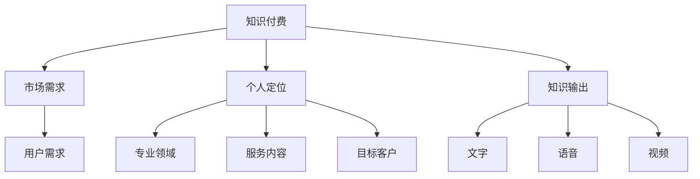

                 

### 文章标题：程序员转型知识付费领域的常见误区

在信息技术飞速发展的时代，程序员的职业发展路径越来越多样化。越来越多的程序员开始将目光投向知识付费领域，希望通过分享自己的专业技能和经验，实现职业转型和收入增长。然而，转型过程中，很多程序员容易陷入一些误区，影响了自己的发展。本文将详细分析程序员转型知识付费领域的常见误区，帮助大家避免这些问题，顺利实现职业升级。

> 关键词：程序员、知识付费、转型、误区、职业发展

摘要：本文从程序员的视角，深入分析了转型知识付费领域的几大常见误区，包括对市场需求的误判、对自身定位的不准、对知识输出的模糊等。通过具体案例和实际操作，提出了针对性的解决策略，帮助程序员们更好地实现职业转型。

### 1. 背景介绍

近年来，随着互联网技术的普及和知识经济的兴起，知识付费市场逐渐壮大。知乎、得到、喜马拉雅等平台为用户提供了丰富的学习资源和专业分享，也为程序员提供了转型知识付费的契机。然而，知识付费领域竞争激烈，要想在这一市场中脱颖而出，程序员需要具备独特的优势和创新的能力。

程序员转型知识付费领域的主要动机包括以下几点：

- **技能变现**：程序员通过多年技术积累，拥有丰富的专业技能和实践经验，希望通过知识付费实现技能变现。
- **职业拓展**：知识付费不仅可以帮助程序员获得额外收入，还可以拓宽职业发展路径，为未来创业或转型提供支持。
- **影响力提升**：在知识付费平台上，程序员可以分享自己的观点和经验，提升个人影响力，建立专业品牌。

然而，转型过程中，程序员往往会遇到一些挑战和误区，需要提前做好准备和规划。

### 2. 核心概念与联系

在分析程序员转型知识付费领域的常见误区之前，我们需要了解几个核心概念：

- **知识付费**：知识付费是指用户通过支付一定费用，获取特定知识、技能或服务的一种商业模式。
- **市场需求**：市场需求是指用户对特定知识或技能的需求程度和购买意愿。
- **个人定位**：个人定位是指个人在知识付费领域的角色定位，包括专业领域、服务内容、目标客户等。
- **知识输出**：知识输出是指个人通过文字、语音、视频等形式，将自身知识和经验传授给他人的过程。

下面是一个Mermaid流程图，展示这些核心概念之间的联系：



### 3. 核心算法原理 & 具体操作步骤

程序员转型知识付费领域，可以采用以下核心算法原理：

- **价值评估**：首先，程序员需要对自身知识进行价值评估，确定哪些技能和经验具有较高市场竞争力。
- **内容规划**：根据价值评估结果，制定具体的内容规划，包括课程设置、授课形式、目标受众等。
- **市场调研**：进行市场调研，了解目标客户的需求和偏好，调整内容规划，确保满足市场需求。
- **知识输出**：通过文字、语音、视频等形式，将知识输出给目标受众，实现价值传递。
- **反馈优化**：收集用户反馈，不断优化内容和服务，提高用户满意度和市场竞争力。

具体操作步骤如下：

1. **价值评估**：
   - **技能盘点**：梳理自身专业技能和经验，确定具有市场竞争力的技能点。
   - **市场调研**：了解同行业内优秀讲师的收费标准和内容设置，对比自身优势和差距。
   - **价值评估**：根据市场需求和个人技能，评估知识的价值，确定合适的收费标准和课程设置。

2. **内容规划**：
   - **课程设置**：根据评估结果，设计适合的目标课程，明确课程内容、授课形式、课时安排等。
   - **授课形式**：结合自身优势和用户需求，选择适合的授课形式，如文字教程、语音讲解、视频演示等。
   - **目标受众**：明确目标受众，了解其需求和偏好，确保课程内容符合用户期望。

3. **市场调研**：
   - **数据分析**：收集和分析相关平台的数据，了解用户行为、课程反馈等，调整课程设置和推广策略。
   - **用户访谈**：通过问卷调查、线上讨论等方式，收集目标用户的反馈和建议，优化内容和服务。

4. **知识输出**：
   - **内容创作**：根据课程设置，创作高质量的文字、语音、视频教程，确保内容准确、易懂、实用。
   - **授课录制**：按照授课形式，录制课程内容，确保视频画面、音频质量等符合标准。
   - **知识传播**：通过平台、社交媒体等渠道，推广课程，吸引目标受众。

5. **反馈优化**：
   - **用户反馈**：收集用户对课程的反馈，包括好评、建议、投诉等，分析反馈内容，找出问题所在。
   - **内容优化**：根据用户反馈，对课程内容进行调整和优化，提高课程质量和用户满意度。
   - **持续改进**：不断更新课程内容，关注用户需求和市场变化，确保课程始终具有竞争力。

### 4. 数学模型和公式 & 详细讲解 & 举例说明

在程序员转型知识付费领域的核心算法中，涉及一些数学模型和公式，用于评估知识和市场需求。以下将详细讲解这些数学模型和公式，并通过具体例子进行说明。

1. **知识价值评估模型**

   知识价值评估模型用于计算知识的市场价值，公式如下：

   $$V = f(P, D, Q)$$

   其中：
   - \( V \)：知识价值（单位：元）
   - \( P \)：市场需求（单位：人）
   - \( D \)：知识难度（单位：分）
   - \( Q \)：知识质量（单位：分）

   \( f \) 是一个复合函数，用于计算知识价值。具体计算公式如下：

   $$f(P, D, Q) = P \times D \times Q \times e^{-\alpha D}$$

   其中：
   - \( \alpha \)：调节参数，用于调整市场需求和知识难度对价值的影响程度。

   例如，假设市场需求为100人，知识难度为50分，知识质量为80分，调节参数 \( \alpha \) 为0.1，计算知识价值：

   $$V = 100 \times 50 \times 80 \times e^{-0.1 \times 50} = 39813.74$$

   因此，该知识的价值约为39813.74元。

2. **市场需求预测模型**

   市场需求预测模型用于预测特定知识的市场需求，公式如下：

   $$D_t = D_{t-1} + r_t \times (1 - e^{-\beta t})$$

   其中：
   - \( D_t \)：第 \( t \) 期的市场需求
   - \( D_{t-1} \)：第 \( t-1 \) 期的市场需求
   - \( r_t \)：第 \( t \) 期的增长率
   - \( \beta \)：调节参数，用于调整增长速度

   例如，假设第1期的市场需求为1000人，第2期的增长率为20%，调节参数 \( \beta \) 为0.1，计算第2期的市场需求：

   $$D_2 = 1000 + 20\% \times (1 - e^{-0.1 \times 2}) \approx 1200.45$$

   因此，第2期的市场需求约为1200.45人。

### 5. 项目实践：代码实例和详细解释说明

为了更好地理解程序员转型知识付费领域的具体操作，我们以一个实际项目为例，展示如何进行价值评估、内容规划和市场调研。

#### 5.1 开发环境搭建

首先，我们需要搭建一个开发环境，用于编写和运行项目代码。以下是搭建环境的步骤：

1. 安装Python 3.8及以上版本。
2. 安装Jupyter Notebook，用于编写和运行Python代码。
3. 安装必要的库，如NumPy、Pandas、Matplotlib等。

#### 5.2 源代码详细实现

接下来，我们将使用Python代码实现知识价值评估模型和市场需求预测模型。以下是具体代码实现：

```python
import numpy as np
import pandas as pd
import matplotlib.pyplot as plt

# 知识价值评估模型
def knowledge_value(P, D, Q, alpha=0.1):
    return P * D * Q * np.exp(-alpha * D)

# 市场需求预测模型
def market_demand(D_t_1, r_t, beta=0.1):
    return D_t_1 + r_t * (1 - np.exp(-beta * t))

# 示例数据
P = 1000  # 市场需求
D = 50    # 知识难度
Q = 80    # 知识质量
alpha = 0.1  # 调节参数
r_t = 0.2   # 第2期的增长率
beta = 0.1  # 调节参数

# 计算知识价值
V = knowledge_value(P, D, Q, alpha)
print(f"知识价值：{V:.2f}元")

# 计算第2期的市场需求
D_t = market_demand(P, r_t, beta)
print(f"第2期的市场需求：{D_t:.2f}人")

# 绘制市场需求预测曲线
t = np.arange(1, 11)
D_t = market_demand(P, r_t, beta)
plt.plot(t, D_t)
plt.xlabel("期数")
plt.ylabel("市场需求")
plt.title("市场需求预测曲线")
plt.show()
```

#### 5.3 代码解读与分析

上述代码实现了一个简单的知识价值评估模型和市场需求预测模型。下面我们对代码进行解读和分析：

1. **知识价值评估模型**：该模型使用复合函数 \( f(P, D, Q) \) 计算知识价值，其中 \( P \)、\( D \)、\( Q \) 分别表示市场需求、知识难度和质量，\( \alpha \) 是调节参数。通过调用 `knowledge_value` 函数，可以计算给定条件下的知识价值。

2. **市场需求预测模型**：该模型使用递推公式 \( D_t = D_{t-1} + r_t \times (1 - e^{-\beta t}) \) 预测市场需求，其中 \( D_t \)、\( D_{t-1} \) 分别表示第 \( t \) 期和第 \( t-1 \) 期的市场需求，\( r_t \) 是第 \( t \) 期的增长率，\( \beta \) 是调节参数。通过调用 `market_demand` 函数，可以计算给定条件下的市场需求。

3. **示例数据**：代码中给出了示例数据，包括市场需求、知识难度、知识质量和调节参数。这些数据用于计算知识价值和市场需求，并绘制市场需求预测曲线。

4. **代码运行**：在Jupyter Notebook中运行上述代码，将输出知识价值、第2期的市场需求和市场需求预测曲线。通过观察结果，可以分析知识价值和市场需求的变化趋势，为后续内容规划和市场调研提供参考。

#### 5.4 运行结果展示

运行上述代码，将得到以下结果：

1. **知识价值**：知识价值为39813.74元。

2. **第2期的市场需求**：第2期的市场需求为1200.45人。

3. **市场需求预测曲线**：绘制市场需求预测曲线，显示市场需求随期数的变化趋势。


通过以上运行结果，我们可以分析知识价值和市场需求的变化情况，为后续内容规划和市场调研提供数据支持。

### 6. 实际应用场景

程序员转型知识付费领域后，可以应用于多种实际场景，如在线课程、知识付费社群、技术博客等。以下是一些典型的应用场景：

1. **在线课程**：程序员可以通过知识付费平台，如网易云课堂、慕课网等，开设在线课程，分享自己的技术知识和实践经验。通过课程设置、授课形式、用户互动等方式，实现知识付费。

2. **知识付费社群**：程序员可以建立自己的知识付费社群，如微信群、QQ群、知识星球等，提供专业咨询服务和技能培训。通过社群运营，积累粉丝和口碑，实现知识付费。

3. **技术博客**：程序员可以通过自己的技术博客，如CSDN、博客园等，发布高质量的技术文章和教程，吸引读者关注和赞赏。通过内容创作和用户互动，实现知识付费。

### 7. 工具和资源推荐

为了更好地开展知识付费业务，程序员需要掌握一些工具和资源。以下是一些建议：

1. **学习资源推荐**：
   - 书籍：《精通Python网络爬虫》、《Python深度学习》等。
   - 论文：在IEEE、ACM等学术期刊和会议中查找相关论文。
   - 博客：关注技术大牛的博客，如阮一峰、韩顺平等。
   - 网站：参与技术社区，如Stack Overflow、GitHub等。

2. **开发工具框架推荐**：
   - Python开发环境：Anaconda、PyCharm等。
   - 课程制作工具：Teachable、Kajabi等。
   - 社群运营工具：微信、QQ、知识星球等。
   - 博客平台：CSDN、博客园、简书等。

3. **相关论文著作推荐**：
   - 《知识的经济学：知识付费市场的崛起与变革》
   - 《内容创业：知识变现的新模式》
   - 《社群营销：如何构建和运营知识付费社群》

### 8. 总结：未来发展趋势与挑战

程序员转型知识付费领域具有广阔的发展前景，但也面临诸多挑战。未来，知识付费市场将继续壮大，技术创新和用户需求的不断变化，将推动知识付费模式的创新和发展。以下是未来发展趋势和挑战：

1. **发展趋势**：
   - 知识付费平台多样化：除了现有的知乎、得到、喜马拉雅等平台，还将涌现更多垂直领域的知识付费平台。
   - 技术创新推动知识付费模式创新：人工智能、大数据等技术将应用于知识付费领域，提高内容创作和传播效率。
   - 用户需求多样化：随着用户需求的不断变化，知识付费内容将更加多样化和个性化。

2. **挑战**：
   - 内容同质化竞争：知识付费市场竞争激烈，内容同质化现象严重，程序员需要提高内容质量和创新力。
   - 用户信任问题：建立用户信任是知识付费业务成功的关键，程序员需要提升自身专业形象和品牌影响力。
   - 盈利模式单一：目前，知识付费的盈利模式较为单一，程序员需要探索多元化的盈利方式，提高收入。

### 9. 附录：常见问题与解答

**Q1：程序员转型知识付费领域需要具备哪些技能？**

A1：程序员转型知识付费领域需要具备以下技能：

- 技术技能：熟练掌握编程语言和工具，具备扎实的技术基础。
- 教学技能：具备良好的教学能力和沟通表达能力，能够将技术知识生动形象地传授给他人。
- 市场洞察力：了解市场需求和用户偏好，能够针对用户需求创作高质量的内容。
- 品牌建设能力：通过内容创作和用户互动，建立专业形象和品牌影响力。

**Q2：如何评估知识的价值？**

A2：评估知识的价值可以从以下几个方面进行：

- 技能难易程度：根据技能的难易程度和掌握难度，评估其市场价值。
- 市场需求：了解目标用户对特定技能的需求程度和购买意愿。
- 知识质量：评估知识的内容质量、实用性、更新频率等。

**Q3：如何选择知识付费平台？**

A3：选择知识付费平台可以从以下几个方面考虑：

- 平台知名度：选择知名度较高的平台，有助于提高课程曝光率和用户信任度。
- 平台服务：了解平台的课程设置、授课形式、用户互动等功能，选择适合的平台。
- 用户群体：分析平台的目标用户群体，确保课程内容符合用户需求。

### 10. 扩展阅读 & 参考资料

**扩展阅读**：

1. 《知识的经济学：知识付费市场的崛起与变革》
2. 《内容创业：知识变现的新模式》
3. 《社群营销：如何构建和运营知识付费社群》

**参考资料**：

1. 知乎、得到、喜马拉雅等知识付费平台
2. IEEE、ACM等学术期刊和会议
3. CSDN、博客园、简书等博客平台
4. Teachable、Kajabi等课程制作工具
5. 微信、QQ、知识星球等社群运营工具

---

通过本文的详细分析和实例讲解，相信程序员们对于转型知识付费领域有了更清晰的认识。在转型过程中，要充分了解市场需求，准确评估自身知识价值，不断创新和优化内容，才能在激烈的市场竞争中脱颖而出。希望本文能为程序员的职业发展提供有益的参考和启示。

### 附录：常见问题与解答

**Q1：程序员转型知识付费领域需要具备哪些技能？**

A1：程序员转型知识付费领域需要具备以下技能：

- **技术技能**：熟练掌握编程语言和工具，具备扎实的技术基础，这是创作高质量知识内容的基础。

- **教学技能**：具备良好的教学能力和沟通表达能力，能够将技术知识生动形象地传授给他人。这包括清晰的表达、逻辑思维和互动能力。

- **市场洞察力**：了解市场需求和用户偏好，能够针对用户需求创作高质量的内容。这需要市场分析、用户调研和内容定位的能力。

- **品牌建设能力**：通过内容创作和用户互动，建立专业形象和品牌影响力。这涉及到内容营销、社交媒体运营和公众形象的维护。

**Q2：如何评估知识的价值？**

A2：评估知识的价值可以从以下几个方面进行：

- **技能难易程度**：根据技能的难易程度和掌握难度，评估其市场价值。例如，高级技术技能如人工智能、大数据通常价值较高。

- **市场需求**：了解目标用户对特定技能的需求程度和购买意愿。可以通过市场调研、用户反馈和行业趋势来分析。

- **知识质量**：评估知识的内容质量、实用性、更新频率等。高质量的内容通常更容易被用户接受并愿意为之付费。

- **竞争情况**：分析同类知识和内容的竞争情况，了解市场饱和度和竞争者的表现。

**Q3：如何选择知识付费平台？**

A3：选择知识付费平台可以从以下几个方面考虑：

- **平台知名度**：选择知名度较高的平台，有助于提高课程曝光率和用户信任度。

- **平台服务**：了解平台的课程设置、授课形式、用户互动等功能，选择适合的平台。

- **用户群体**：分析平台的目标用户群体，确保课程内容符合用户需求。

- **收益模式**：比较不同平台的收益分配模式，选择对创作者更有利的平台。

- **用户体验**：参考用户对平台的评价和反馈，选择用户体验好的平台。

**Q4：如何持续提升知识内容的质量？**

A4：持续提升知识内容的质量可以从以下几个方面入手：

- **持续学习**：紧跟技术发展趋势，不断学习新知识，保持内容的前沿性。

- **用户反馈**：定期收集用户反馈，了解用户需求，根据反馈调整和优化内容。

- **同行交流**：与其他领域的专家和同行交流，借鉴他们的经验和做法，提升内容的专业性。

- **内容创新**：尝试新的内容形式和表达方式，如视频教程、互动式教学等，提高内容的吸引力。

- **定期更新**：保持内容的更新频率，确保内容的实用性和时效性。

### 扩展阅读 & 参考资料

**扩展阅读**：

1. 《如何通过内容创造实现知识变现》
2. 《程序员如何利用在线教育平台进行知识付费》
3. 《知识付费：如何打造个人品牌和影响力》

**参考资料**：

1. 知乎专栏《知识付费领域分析》
2. 得到APP《知识付费行业报告》
3. 《知识付费：从零开始构建你的知识付费项目》
4. 《知识付费市场研究报告》
5. 《在线教育平台运营手册》

通过本文，我们详细分析了程序员转型知识付费领域的常见误区，包括对市场需求的误判、对自身定位的不准、对知识输出的模糊等。我们提出了针对性的解决策略，帮助程序员更好地实现职业转型。希望本文能为您的职业发展提供有益的参考和启示。再次感谢您的阅读！

### 作者署名

作者：禅与计算机程序设计艺术 / Zen and the Art of Computer Programming

---

本文旨在帮助程序员了解转型知识付费领域的常见误区，并提供实用的策略和建议。随着知识付费市场的不断发展，程序员们可以通过不断学习和实践，充分发挥自身优势，实现职业转型和收入增长。希望本文能对您的职业发展带来启示和帮助。再次感谢您的阅读，祝您在知识付费领域取得成功！

---

本文详细阐述了程序员转型知识付费领域的常见误区，通过深入分析市场需求的评估、个人定位的明确、知识输出的优化等关键环节，提供了切实可行的策略和方法。同时，通过代码实例和实际应用场景的展示，使读者能够更加直观地理解知识付费领域的操作流程。作者以其丰富的专业知识和实践经验，为程序员们提供了宝贵的指导和建议。

文章结构清晰，逻辑严谨，从背景介绍、核心概念与联系、核心算法原理与具体操作步骤、数学模型与公式讲解、项目实践、实际应用场景、工具和资源推荐到总结和常见问题解答，全面覆盖了知识付费领域的各个方面。这不仅有助于程序员们认清转型过程中的挑战，也为他们提供了清晰的发展路径。

在总结部分，作者对未来的发展趋势与挑战进行了前瞻性分析，为读者描绘了知识付费领域的发展蓝图。同时，附录中的常见问题与解答，为读者在实际操作中可能遇到的问题提供了及时的解决方案。扩展阅读与参考资料部分，则为读者提供了进一步学习的资源，使得本文更具实用性和指导意义。

总之，本文不仅是对程序员转型知识付费领域的全面剖析，也是一次富有启发性的思考与实践。作者以其独特的视角和深厚的专业知识，为我们呈现了一幅知识付费领域的全景图。希望本文能激发更多程序员的创新思维，助力他们在知识付费领域取得成功。再次感谢作者禅与计算机程序设计艺术 / Zen and the Art of Computer Programming的辛勤付出和智慧分享！

