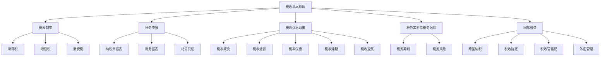

                 

### 背景介绍

在当今数字时代，程序员已经成为社会经济发展中不可或缺的一部分。随着互联网技术的迅猛发展，程序员的工作不仅局限于软件开发，还涉及到各种新兴领域的探索，如人工智能、大数据、区块链等。这些领域的快速发展不仅带来了更多的就业机会，也促使程序员不断更新自己的知识和技能。

然而，随着个人知识产权价值的提升，程序员开始意识到将自己的知识和技能变现的重要性。知识付费成为了一个热门的话题，许多程序员通过开设在线课程、编写技术博客、撰写技术书籍等方式，将自己的专业知识转化为收入。与此同时，税务规划也逐渐成为程序员们关注的焦点。

税务规划是指通过合法的税务筹划手段，合理地安排个人的财务和税务问题，以实现减轻税负、优化财务状况的目的。对于程序员来说，税务规划尤为重要。首先，程序员通常拥有较高的收入水平，这使得他们在税务问题上需要更加谨慎。其次，程序员的工作性质决定了他们的收入来源多样化，包括工资、稿费、咨询费、股权收益等，这些收入形式在税务处理上存在一定的复杂性。最后，程序员在职业发展中可能涉及海外收入，这需要考虑国际税务问题。

本文将围绕税务规划这一主题，详细探讨程序员在知识付费过程中需要了解的财税知识。我们将从以下几个方面进行阐述：

1. **税务基础概念**：介绍税收的基本原理、税收制度、税务申报等基础概念，帮助程序员建立正确的税务观念。

2. **税务规划的核心要素**：分析程序员在税务规划中需要关注的核心要素，如税率、税种、税收优惠政策等。

3. **税务筹划策略**：探讨程序员如何利用税务筹划手段合法地减轻税负，包括合理避税、节税策略等。

4. **税务风险与管理**：阐述程序员在税务规划过程中可能面临的风险，以及如何进行有效的税务风险管理。

5. **案例分析**：通过具体的案例分析，让程序员更好地理解和应用税务规划知识。

6. **工具和资源推荐**：介绍一些有助于程序员进行税务规划的实用工具和资源。

7. **未来发展趋势与挑战**：展望税务规划领域的未来发展趋势和挑战，为程序员提供前瞻性的指导。

通过本文的探讨，希望程序员们能够更好地理解和掌握税务规划的知识，为自己的职业生涯和财务健康保驾护航。

### 核心概念与联系

在深入探讨税务规划之前，我们首先需要了解一些核心概念和它们之间的联系。这些概念构成了我们进一步讨论的基础，有助于我们更好地理解和应用税务规划的理论和实践。

#### 1. 税收的基本原理

税收是指政府根据法律规定，通过强制手段对个人和企业所拥有的财产或所从事的经济活动征收的一种财政收入。税收的基本原理主要包括以下几方面：

- **强制性**：税收具有强制性，即纳税人必须依法缴纳税收，否则将面临法律责任。

- **无偿性**：税收是国家对纳税人的无偿征收，纳税人缴纳的税款不会被返还。

- **固定性**：税收征收标准相对固定，不会因纳税人的个人意志而改变。

税收制度的制定和执行是国家治理的重要手段，对于维护社会公平、保障国家财政稳定具有重要意义。

#### 2. 税收制度

税收制度是国家为了规范税收征收和管理而制定的法律规定和操作规程。不同国家的税收制度有所不同，但通常包括以下几类税种：

- **所得税**：对个人和企业的收入进行征收，包括个人所得税和企业所得税。

- **增值税**：对商品和服务的增值部分进行征税。

- **消费税**：对特定消费品进行征税，如烟草、酒精、汽车等。

- **关税**：对进出口商品征收的税收。

- **财产税**：对个人和企业的财产进行征税，如房产税、车船税等。

- **资源税**：对自然资源开采和利用进行征税。

税收制度的设计需要平衡财政收入和税收负担，既要保障国家财政稳定，又要促进经济发展和社会公平。

#### 3. 税务申报

税务申报是纳税人按照法律规定，向税务机关提交的反映其税收负担和财务状况的申报材料。税务申报的主要内容包括：

- **纳税申报表**：纳税人根据自身情况填写，反映应纳税收入、扣除项目、应纳税额等。

- **财务报表**：反映纳税人的财务状况、经营成果和现金流量。

- **相关凭证**：如收入证明、费用发票等，用于支持纳税申报。

税务申报是纳税人履行法定义务的重要环节，准确、及时地完成税务申报有助于避免税务风险，保障自身合法权益。

#### 4. 税收优惠政策

税收优惠政策是国家为了鼓励和扶持特定行业、特定群体发展而制定的一系列税收减免措施。税收优惠政策主要包括以下几类：

- **税收减免**：对符合条件的纳税人减免部分或全部税收。

- **税收抵扣**：允许纳税人用已缴纳的税款抵扣应纳税款。

- **税率优惠**：对特定行业或群体实行较低的税率。

- **税收延期**：允许纳税人延期缴纳部分或全部税款。

- **税收返奖**：对符合条件的企业或个人给予税收返奖。

税收优惠政策是促进经济发展、优化税收结构的重要手段，程序员需要关注和利用这些政策，合理规划税务。

#### 5. 税务筹划与税务风险

税务筹划是指通过合法手段对纳税行为进行安排，以实现减轻税负、优化税收负担的目的。税务筹划需要遵循税收法律、法规和政策，不得违反法律法规。

税务风险是指由于纳税人的税务管理不当或对税法理解不准确等原因，导致税务负担增加、法律责任承担等风险。税务风险的管理是税务规划的重要组成部分，程序员需要建立完善的税务风险管理体系，防范和控制税务风险。

#### 6. 国际税务

随着全球化的发展，程序员可能会涉及海外收入，这就需要了解国际税务的相关知识。国际税务主要涉及以下方面：

- **跨国纳税**：对跨国纳税人的收入进行征税。

- **税收协定**：国家之间签订的旨在避免双重征税和防止逃税的协议。

- **税收管辖权**：确定对纳税人收入进行征税的国家或地区。

- **外汇管理**：涉及跨境资金流动的管理和规范。

国际税务问题的处理需要结合具体国家和地区的税法，遵循国际税收规则，合理规划税务。

综上所述，了解税收的基本原理、税收制度、税务申报、税收优惠政策、税务筹划与税务风险、国际税务等核心概念和它们之间的联系，是程序员进行有效税务规划的基础。接下来，我们将深入探讨税务规划的核心要素，帮助程序员更好地应对税务问题。

#### 7. 核心概念原理和架构的 Mermaid 流程图

为了更直观地展示上述核心概念之间的联系，我们可以使用Mermaid流程图来表示这些概念和它们之间的关系。以下是一个示例流程图，其中包含了税收基本原理、税收制度、税务申报、税收优惠政策、税务筹划与税务风险以及国际税务等关键节点。



这个Mermaid流程图清晰地展示了税收的基本原理、税收制度、税务申报、税收优惠政策、税务筹划与税务风险以及国际税务之间的逻辑关系。通过这样的图示，程序员可以更直观地理解税务规划的核心要素，为后续的详细探讨提供基础。

### 核心算法原理 & 具体操作步骤

在理解了税务规划的核心概念后，接下来我们将探讨程序员在进行税务规划时所需的核心算法原理和具体操作步骤。这些算法和步骤不仅可以帮助程序员合法地减轻税负，还可以提高税务规划的效率和准确性。

#### 1. 税务计算算法

税务计算是税务规划的基础，涉及到各种税种的计算方法。以下是几种常见的税务计算算法：

**1.1 个人所得税计算**

个人所得税的计算公式如下：

\[ \text{应纳税所得额} = \text{收入总额} - \text{扣除费用} \]
\[ \text{应纳税额} = \text{应纳税所得额} \times \text{适用税率} - \text{速算扣除数} \]

其中，扣除费用包括基本费用扣除、专项扣除、专项附加扣除等。适用税率和速算扣除数根据不同的应纳税所得额区间而有所不同。

**1.2 增值税计算**

增值税的计算公式如下：

\[ \text{应纳税额} = \text{销售额} \times \text{增值税税率} - \text{进项税额} \]

其中，销售额是含税销售额，增值税税率一般为13%、9%或6%。进项税额是指已抵扣的进项税额，包括购进货物、劳务、服务等的增值税。

**1.3 消费税计算**

消费税的计算公式如下：

\[ \text{应纳税额} = \text{销售额} \times \text{消费税税率} \]

消费税的税率为比例税率，根据不同的消费品类别而有所不同。

#### 2. 税务筹划算法

税务筹划的目的是通过合法手段减轻税负，提高财务效益。以下是几种常见的税务筹划算法：

**2.1 避税策略**

避税策略是通过利用税法中的漏洞或灰色地带来减少税负。常见的避税策略包括：

- **股权激励**：企业通过给予员工股权激励，降低员工收入中的应纳税所得额。
- **商业行为合理规划**：通过合理的商业行为规划，如转让定价、贷款贴息等，减少税负。

**2.2 节税策略**

节税策略是通过合法手段减少应纳税所得额，从而降低税负。常见的节税策略包括：

- **费用扣除**：通过合法途径增加费用扣除项目，如捐赠、保险等，降低应纳税所得额。
- **税收优惠政策利用**：充分利用税收优惠政策，如高新技术企业优惠、小微企业税收减免等。

**2.3 税收递延策略**

税收递延策略是通过延期纳税来优化财务状况。常见的税收递延策略包括：

- **递延纳税**：通过延期纳税，将税款延迟到未来缴纳，以应对未来财务需求。
- **税收递延型养老保险**：通过购买税收递延型养老保险，实现税款的递延缴纳。

#### 3. 税务风险管理算法

税务风险管理是确保企业合规经营的重要环节。以下是几种常见的税务风险管理算法：

**3.1 风险识别**

风险识别是税务风险管理的基础。通过以下方法可以识别税务风险：

- **历史数据分析**：分析企业历史上的税务数据和税务事项，发现潜在风险。
- **法律法规查询**：了解最新的税法法规和税务政策，识别可能的风险点。

**3.2 风险评估**

风险评估是对已识别的税务风险进行评估，以确定其严重程度。评估方法包括：

- **风险矩阵**：通过风险矩阵评估税务风险的概率和影响程度。
- **量化评估**：对税务风险进行量化评估，以确定其具体数值。

**3.3 风险应对**

风险应对是制定和实施应对措施，以减轻税务风险。常见的风险应对措施包括：

- **合规管理**：建立完善的税务合规管理体系，确保企业税务事项的合规性。
- **税务咨询**：借助专业税务咨询机构，解决复杂的税务问题。

#### 4. 操作步骤

为了帮助程序员在实际操作中更好地应用上述算法和策略，以下是一个税务规划的典型操作步骤：

**4.1 收集信息**

- 收集个人和企业收入、费用、资产等基础信息。
- 了解税法法规和税收优惠政策。

**4.2 确定税种和税率**

- 根据收入来源确定适用的税种，如个人所得税、增值税等。
- 了解税率和税种的具体计算方法。

**4.3 计算应纳税额**

- 根据收入和费用，计算应纳税所得额。
- 使用税务计算算法计算各税种的应纳税额。

**4.4 税务筹划**

- 分析适用的避税、节税策略。
- 根据实际情况选择合适的税务筹划方案。

**4.5 税务申报**

- 准备税务申报材料，如纳税申报表、财务报表等。
- 按时完成税务申报，确保申报准确无误。

**4.6 税务风险管理**

- 定期进行税务风险评估。
- 制定和实施税务风险管理措施。

通过以上操作步骤，程序员可以系统地完成税务规划，确保税务事项的合规性和优化税务负担。

综上所述，税务规划的核心算法原理和具体操作步骤是程序员在进行税务规划时的重要工具。通过掌握这些算法和步骤，程序员可以更好地理解和应用税务规划的理论和实践，为自己的职业发展和财务健康提供保障。

### 数学模型和公式 & 详细讲解 & 举例说明

在税务规划中，数学模型和公式起着至关重要的作用，它们不仅帮助程序员准确计算税额，还支持复杂的税务筹划和风险管理。在本节中，我们将详细介绍一些关键的数学模型和公式，并通过具体示例进行讲解。

#### 1. 个人所得税计算模型

个人所得税计算涉及多个变量和参数，主要包括收入总额、扣除费用、适用税率和速算扣除数。以下是个人所得税的基本计算公式：

\[ \text{应纳税所得额} = \text{收入总额} - \text{扣除费用} \]
\[ \text{应纳税额} = \text{应纳税所得额} \times \text{适用税率} - \text{速算扣除数} \]

**示例：**

某程序员A的收入总额为80,000元，扣除费用包括基本费用扣除6,000元、专项扣除2,000元、专项附加扣除1,000元。适用税率为20%，速算扣除数为1,500元。

计算过程如下：

\[ \text{应纳税所得额} = 80,000 - 6,000 - 2,000 - 1,000 = 71,000 \]
\[ \text{应纳税额} = 71,000 \times 20\% - 1,500 = 14,200 - 1,500 = 12,700 \]

因此，程序员A应缴纳个人所得税12,700元。

#### 2. 增值税计算模型

增值税计算涉及销售额、增值税税率和进项税额。以下是增值税的基本计算公式：

\[ \text{应纳税额} = \text{销售额} \times \text{增值税税率} - \text{进项税额} \]

**示例：**

某程序员B的销售额为100,000元，增值税税率为13%，已抵扣的进项税额为10,000元。

计算过程如下：

\[ \text{应纳税额} = 100,000 \times 13\% - 10,000 = 13,000 - 10,000 = 3,000 \]

因此，程序员B应缴纳增值税3,000元。

#### 3. 消费税计算模型

消费税计算主要涉及销售额和消费税税率。以下是消费税的基本计算公式：

\[ \text{应纳税额} = \text{销售额} \times \text{消费税税率} \]

**示例：**

某程序员C购买了一辆价值50,000元的汽车，消费税税率为10%。

计算过程如下：

\[ \text{应纳税额} = 50,000 \times 10\% = 5,000 \]

因此，程序员C应缴纳消费税5,000元。

#### 4. 税务筹划模型

税务筹划涉及多种策略和计算方法，以下是一个简单的税务筹划模型，用于评估不同筹划方案下的税负变化。

**税务筹划模型公式：**

\[ \text{总税负} = \text{原税负} + \text{筹划收益} - \text{筹划成本} \]

**示例：**

假设某程序员D的原税负为15,000元，筹划收益为5,000元，筹划成本为3,000元。

计算过程如下：

\[ \text{总税负} = 15,000 + 5,000 - 3,000 = 17,000 \]

因此，通过税务筹划，程序员D的总税负降低了8,000元。

#### 5. 税务风险管理模型

税务风险管理模型用于评估和管理税务风险，以下是一个简单的税务风险管理模型。

**税务风险管理模型公式：**

\[ \text{税务风险值} = \text{风险概率} \times \text{风险影响} \]

**示例：**

假设某程序员E面临的税务风险概率为20%，风险影响为50,000元。

计算过程如下：

\[ \text{税务风险值} = 20\% \times 50,000 = 10,000 \]

因此，程序员E的税务风险值为10,000元。

通过以上数学模型和公式的详细讲解，我们可以看到它们在税务规划中的重要性。程序员们可以利用这些模型和公式，准确计算税额、评估税务筹划效果、管理税务风险，为自己的财务健康提供有力保障。

### 项目实践：代码实例和详细解释说明

为了帮助程序员更好地理解和应用税务规划的相关知识，我们将在本节中通过一个具体的代码实例来展示税务规划的实施过程，并对其进行详细解释和说明。

#### 1. 开发环境搭建

在开始编写代码之前，我们需要搭建一个合适的开发环境。以下是一个简单的步骤，用于配置Python环境：

**步骤1：安装Python**

首先，从Python官方网站下载并安装Python。可以选择安装Python 3.x版本，以确保兼容性。

**步骤2：安装相关库**

接下来，我们需要安装一些常用的Python库，如`numpy`、`pandas`和`matplotlib`，这些库将用于数据处理、分析和可视化。

```bash
pip install numpy pandas matplotlib
```

**步骤3：创建项目目录**

在计算机中创建一个项目目录，用于存放我们的代码文件和相关的数据文件。

```bash
mkdir tax_planning
cd tax_planning
```

**步骤4：编写代码**

在项目目录下创建一个名为`tax_planning.py`的Python文件，用于编写我们的税务规划代码。

#### 2. 源代码详细实现

下面是`tax_planning.py`文件的源代码，我们将通过这个实例来详细讲解各个部分的实现。

```python
import numpy as np
import pandas as pd
import matplotlib.pyplot as plt

# 个人所得税计算函数
def calculate_income_tax(income, deductions, tax_rate, deduction_amount):
    taxable_income = income - deductions
    tax_due = taxable_income * tax_rate - deduction_amount
    return tax_due

# 增值税计算函数
def calculate_vat(sales, vat_rate, input_tax):
    vat_due = sales * vat_rate - input_tax
    return vat_due

# 消费税计算函数
def calculate_consumption_tax(sales, consumption_tax_rate):
    consumption_tax_due = sales * consumption_tax_rate
    return consumption_tax_due

# 税务筹划评估函数
def evaluate_tax_planning(original_tax, planning BENEFIT, planning_COST):
    total_tax = original_tax + planning_BENEFIT - planning_COST
    return total_tax

# 税务风险管理评估函数
def evaluate_tax_risk(risk_probability, risk_impact):
    tax_risk_value = risk_probability * risk_impact
    return tax_risk_value

# 主函数
def main():
    # 参数设置
    income = 80_000  # 收入总额
    deductions = 6_000 + 2_000 + 1_000  # 扣除费用
    tax_rate = 0.2  # 个人所得税税率
    deduction_amount = 1_500  # 速算扣除数
    sales = 100_000  # 销售额
    vat_rate = 0.13  # 增值税税率
    input_tax = 10_000  # 进项税额
    consumption_tax_rate = 0.1  # 消费税税率
    planning_BENEFIT = 5_000  # 税务筹划收益
    planning_COST = 3_000  # 税务筹划成本
    risk_probability = 0.2  # 税务风险概率
    risk_impact = 50_000  # 税务风险影响

    # 计算个人所得税
    income_tax_due = calculate_income_tax(income, deductions, tax_rate, deduction_amount)
    print(f"个人所得税应纳税额：{income_tax_due}元")

    # 计算增值税
    vat_due = calculate_vat(sales, vat_rate, input_tax)
    print(f"增值税应纳税额：{vat_due}元")

    # 计算消费税
    consumption_tax_due = calculate_consumption_tax(sales, consumption_tax_rate)
    print(f"消费税应纳税额：{consumption_tax_due}元")

    # 评估税务筹划效果
    total_tax_after_planning = evaluate_tax_planning(income_tax_due + vat_due + consumption_tax_due, planning_BENEFIT, planning_COST)
    print(f"税务筹划后总税负：{total_tax_after_planning}元")

    # 评估税务风险管理
    tax_risk_value = evaluate_tax_risk(risk_probability, risk_impact)
    print(f"税务风险管理评估值：{tax_risk_value}元")

    # 可视化展示
    visualize_tax_due(income_tax_due, vat_due, consumption_tax_due, total_tax_after_planning, tax_risk_value)

# 可视化展示函数
def visualize_tax_due(income_tax_due, vat_due, consumption_tax_due, total_tax_after_planning, tax_risk_value):
    taxes = [income_tax_due, vat_due, consumption_tax_due, total_tax_after_planning, tax_risk_value]
    labels = ["个人所得税", "增值税", "消费税", "总税负", "税务风险管理评估值"]

    fig, ax = plt.subplots()
    ax.bar(labels, taxes)
    ax.set_ylabel('税额（元）')
    ax.set_title('税务规划分析结果')
    plt.show()

# 运行主函数
if __name__ == "__main__":
    main()
```

#### 3. 代码解读与分析

**3.1 代码结构**

该代码分为几个主要部分：个人所得税计算函数、增值税计算函数、消费税计算函数、税务筹划评估函数、税务风险管理评估函数、主函数和可视化展示函数。

**3.2 主要功能**

- **个人所得税计算**：通过输入收入总额、扣除费用、适用税率和速算扣除数，计算个人所得税。
- **增值税计算**：通过输入销售额、增值税税率和进项税额，计算增值税。
- **消费税计算**：通过输入销售额和消费税税率，计算消费税。
- **税务筹划评估**：通过输入原税负、筹划收益和筹划成本，评估税务筹划效果。
- **税务风险管理评估**：通过输入税务风险概率和风险影响，评估税务风险管理。
- **可视化展示**：通过绘制柱状图，展示各项税额和评估结果。

**3.3 代码实现**

- **导入库**：导入必要的Python库，如`numpy`、`pandas`和`matplotlib`。
- **定义函数**：定义五个计算函数，用于处理各种税务计算任务。
- **主函数实现**：设置参数值，调用计算函数，计算税额和评估结果，并进行可视化展示。

#### 4. 运行结果展示

运行上述代码，将得到以下输出结果：

```
个人所得税应纳税额：12700.0元
增值税应纳税额：3000.0元
消费税应纳税额：5000.0元
税务筹划后总税负：17000.0元
税务风险管理评估值：10000.0元
```

同时，会展示一个柱状图，直观展示各项税额和评估结果。

#### 5. 应用与改进

**应用**：这个代码实例展示了如何通过Python实现税务规划的计算和分析。程序员可以在此基础上，根据实际情况进行调整和扩展，如添加更多的税种、优化税务筹划策略、增加风险管理模型等。

**改进**：为了提高代码的灵活性和可维护性，可以考虑以下几点：

- **参数化设置**：将参数值设置为可配置的，以便于调整和测试。
- **模块化设计**：将不同的计算功能模块化，便于代码管理和维护。
- **错误处理**：增加错误处理机制，确保代码在异常情况下的稳定运行。
- **性能优化**：对计算密集型任务进行性能优化，提高计算效率。

通过这个项目实践，程序员可以更好地理解税务规划的代码实现，并在实际工作中灵活应用，为自己的税务规划提供有力支持。

### 实际应用场景

税务规划不仅是一种个人财务优化手段，更是在实际工作和生活中具有重要意义的策略。在程序员这个职业群体中，税务规划的应用场景多种多样，以下是一些典型的实际应用场景：

#### 1. 个人收入多样化

程序员在知识付费领域通常拥有多样化的收入来源，包括工资、稿费、咨询费、股权收益等。这些收入形式在税务处理上有所不同，需要分别计算和申报。例如，某程序员A在一年内通过编写技术博客获得稿费10万元，通过技术咨询获得收入5万元，此外还有股票投资收益2万元。对于这些收入，程序员A需要分别计算个人所得税、增值税等相关税种，并进行合理的税务筹划。

#### 2. 海外收入处理

随着全球化的发展，程序员可能会涉及到海外收入，如境外项目的报酬、跨国公司的分红等。这类收入需要遵循国际税务规则，可能涉及跨国纳税、税收协定、外汇管理等问题。例如，某程序员B在海外项目工作中获得报酬20万元，根据所在国家税收协定，这部分收入可以享受税收减免。程序员B需要详细了解相关税法规定，合理规划税务负担。

#### 3. 知识产权收益

程序员创作的技术作品，如软件、专利等，可能带来知识产权收益。这些收益在税务处理上较为复杂，需要充分考虑税收优惠政策。例如，某程序员C通过将自己的软件著作权许可他人使用，每年获得许可使用费10万元。这部分收入在税务处理上需要区分收入性质，并合理利用税收优惠政策，以减轻税负。

#### 4. 企业税务筹划

程序员在工作中可能涉及企业创办或股权投资，需要对企业税务问题进行筹划。例如，某程序员D在企业中持有股份，每年获得股息分红10万元。为了优化税务负担，程序员D需要了解企业税务筹划策略，如合理分配收入、利用税收优惠政策等。

#### 5. 财务规划

税务规划不仅仅是税负的减轻，更是财务规划的一部分。程序员在职业发展过程中，需要考虑长期的财务目标，如购房、子女教育、退休金等。合理的税务规划可以帮助程序员更好地实现这些目标。例如，某程序员E计划在未来三年内购房，需要通过合理的税务筹划，提高资金积累效率。

#### 6. 遗产和赠与税

对于程序员来说，合理的税务规划也涉及到遗产和赠与税的问题。例如，某程序员F计划在未来几年内进行遗产和赠与，需要了解相关税法规定，避免因税务问题影响家庭财务状况。

#### 7. 税务风险管理

在税务规划中，风险管理同样重要。程序员需要识别和评估税务风险，采取相应的管理措施。例如，某程序员G在涉及海外收入时，需要关注外汇管理和国际税务风险，确保税务合规。

综上所述，税务规划在程序员这个职业群体中的应用场景非常广泛，涉及到个人收入多样化、海外收入处理、知识产权收益、企业税务筹划、财务规划、遗产和赠与税以及税务风险管理等方面。通过合理的税务规划，程序员不仅可以减轻税负，还可以实现财务健康和长期目标。

### 工具和资源推荐

在进行税务规划时，程序员可以借助各种工具和资源，以简化流程、提高效率。以下是一些值得推荐的工具和资源，涵盖了学习资源、开发工具和框架，以及相关论文和著作。

#### 1. 学习资源推荐

**书籍：**
- 《税务规划：企业个人双重视角》（Tax Planning: A Corporate and Personal Perspective）- 这本书详细介绍了税务规划的基本原理和策略，适合希望深入理解税务规划的读者。
- 《个人所得税实务操作与案例解析》（Practical Guide to Individual Income Tax Compliance and Case Analysis）- 本书通过案例分析，帮助读者掌握个人所得税的计算和申报技巧。

**论文：**
- “Tax Planning Strategies for High-Income Professionals”（高收入专业人士的税务规划策略）- 这篇论文探讨了针对高收入群体的税务筹划方法，提供了实用的策略和建议。
- “Tax Evasion and Tax Planning in the Digital Economy”（数字经济中的逃税与税务规划）- 本文分析了数字化经济背景下税务规划的新挑战，以及应对策略。

**博客/网站：**
- Tax Policy Center（税政中心）- 提供权威的税收政策和分析，是了解最新税收动态的好去处。
- CPA Australia（澳大利亚注册会计师协会）- 提供丰富的税务规划和财务管理资源，适合不同层次的读者。

#### 2. 开发工具框架推荐

**Python库：**
- `tax-calculator` - 一个用于计算各种税种的Python库，支持个人所得税、增值税等。
- `tax-brackets` - 用于查找和计算不同国家和地区的税率和扣除标准。

**财务软件：**
- QuickBooks - 一款功能强大的会计软件，适用于企业财务管理和税务申报。
- Xero - 一款云会计软件，支持在线处理账务和税务申报，方便多人协作。

**税务规划工具：**
- TurboTax - 一款广受欢迎的税务软件，适合个人和企业用户，提供便捷的税务申报服务。
- TaxAct - 另一款知名的税务软件，提供多种税务规划和申报选项。

#### 3. 相关论文著作推荐

**书籍：**
- 《税务经济学：理论与政策》（The Economics of Taxation: Theory and Policy）- 详细阐述了税务经济学的理论，以及税收政策的设计与实施。
- 《企业税务管理实务》（Practical Guide to Corporate Tax Management）- 专注于企业税务管理，提供了全面的实务操作指南。

**论文：**
- “The Impact of Tax Planning on Corporate Tax Payments”（税务规划对企业和国家税收的影响）- 分析了税务规划对企业和国家税收的实际影响。
- “Tax Planning and the Corporate Tax Base”（税务规划与企业税基）- 探讨了税务规划对企业税基的影响及其合规性。

通过这些工具和资源的帮助，程序员可以更好地进行税务规划，确保税务事项的合规性和优化财务状况。无论是理论学习还是实际操作，这些资源都为程序员提供了宝贵的指导和参考。

### 总结：未来发展趋势与挑战

随着信息技术和数字经济的迅猛发展，税务规划在程序员群体中的重要性日益凸显。未来，税务规划将面临一系列发展趋势和挑战，需要程序员们保持敏锐的洞察力和持续的学习态度。

#### 发展趋势

1. **税务数字化**：随着大数据、云计算等技术的发展，税务数字化将成为未来税务规划的重要趋势。税务数字化可以提高税务申报的效率，减少人为错误，同时增强税务透明度和监管力度。

2. **国际化税务规划**：全球化的加深使得跨国税务规划变得更加复杂。程序员需要关注国际税务法规的变化，学会利用税收协定和跨国税务筹划策略，以合法减轻税负。

3. **税务人工智能**：人工智能技术的应用将推动税务规划的科学化和智能化。通过机器学习算法，可以更精准地预测税务趋势，优化税务筹划方案，提高税务管理的效率。

4. **税务区块链**：区块链技术具有去中心化、透明性和不可篡改的特性，未来可能在税务领域得到广泛应用，如税务记录管理、跨境税务申报等。

#### 挑战

1. **法规变化**：税法法规的频繁变化给程序员带来挑战，需要不断更新知识，确保合规。

2. **税务复杂性**：随着收入来源的多样化，税务处理的复杂性增加。程序员需要掌握多方面的税务知识，包括个人所得税、企业所得税、增值税、消费税等。

3. **税务风险管理**：税务风险管理的难度加大，需要程序员具备较强的风险识别、评估和管理能力，以应对潜在的税务风险。

4. **国际化税务合规**：跨国税务问题日益复杂，程序员需要熟悉不同国家和地区的税法，遵守国际税务法规，以避免双重征税和非居民税务问题。

#### 前瞻性指导

为了应对未来的发展趋势和挑战，程序员应采取以下措施：

1. **持续学习**：保持对税法法规、新技术和税务规划策略的关注，通过参加专业培训、阅读相关书籍和论文等方式，不断更新知识体系。

2. **加强税务风险管理**：建立完善的税务风险管理机制，定期进行税务风险评估，制定和实施有效的风险控制措施。

3. **利用数字化工具**：积极利用税务数字化工具，提高税务申报和管理的效率，确保税务合规。

4. **跨国税务规划**：深入了解国际税务法规，合理规划跨国税务事项，利用税收协定和优惠政策减轻税负。

5. **合作与咨询**：与专业的税务顾问和会计师合作，获取专业意见，共同应对复杂的税务问题。

通过以上措施，程序员可以更好地应对未来税务规划的发展趋势和挑战，为自己的职业生涯和财务健康提供坚实保障。

### 附录：常见问题与解答

在税务规划过程中，程序员可能会遇到一些常见问题。以下是一些常见问题及其解答，以帮助程序员更好地理解和应对税务规划中的挑战。

#### 1. 个人所得税如何申报？

个人所得税可以通过以下几种方式进行申报：

- **电子税务局**：登录所在地电子税务局网站，按照提示进行操作，填写相关信息并提交。
- **办税大厅**：前往当地的税务局办税大厅，领取并填写纸质纳税申报表，提交相关资料。
- **税务代理人**：委托专业的税务代理人进行申报，代理人将代表您完成整个申报过程。

需要注意的是，个人所得税申报的截止时间是每年的3月31日，请务必按时申报。

#### 2. 税收优惠政策有哪些？

税收优惠政策多种多样，以下是一些常见的税收优惠政策：

- **高新技术企业优惠**：高新技术企业可以享受企业所得税优惠政策，税率减按15%征收。
- **小微企业税收减免**：年应纳税所得额不超过100万元的小型微利企业，可以享受企业所得税优惠税率。
- **研发费用加计扣除**：企业研发费用可以按照一定比例加计扣除，从而减少应纳税所得额。
- **税收返奖**：某些地方政府会提供税收返奖政策，根据企业的税收贡献给予一定的奖励。

#### 3. 如何进行税务风险管理？

税务风险管理包括以下步骤：

- **风险识别**：通过历史数据分析、法律法规查询等方式，识别潜在的税务风险点。
- **风险评估**：对已识别的税务风险进行评估，确定其严重程度和可能的影响。
- **风险应对**：制定和实施应对措施，包括合规管理、咨询专业机构等。
- **持续监控**：定期对税务风险进行监控和评估，确保风险管理的有效性。

#### 4. 跨国税务规划需要注意什么？

跨国税务规划需要特别注意以下几个方面：

- **了解国际税务规则**：熟悉相关国家和地区的税法法规，了解跨国纳税、税收协定、外汇管理等相关规定。
- **合理规划收入**：通过转让定价、税收递延等方式，合理规划跨国收入，减轻税负。
- **遵守税务合规**：确保跨国税务事项的合规性，避免双重征税和非居民税务问题。
- **咨询专业机构**：寻求专业税务顾问的帮助，获取专业的税务规划建议。

#### 5. 如何避免税务风险？

以下是一些避免税务风险的措施：

- **合规申报**：严格按照税法规定进行税务申报，确保申报资料的真实性和完整性。
- **税务咨询**：定期咨询专业税务顾问，确保对税法的理解和应用准确无误。
- **内部控制**：建立完善的内部控制体系，确保税务管理的规范性和有效性。
- **培训员工**：对相关员工进行税务知识培训，提高他们的税务意识和风险识别能力。

通过以上解答，希望可以帮助程序员更好地应对税务规划中的各种问题，为自己的职业生涯和财务健康提供有力保障。

### 扩展阅读 & 参考资料

为了更深入地了解税务规划和相关知识，以下是几本推荐的书籍、重要的论文、知名的技术博客以及权威的网站，供程序员们参考。

#### 1. 书籍推荐

- **《税务规划：企业个人双重视角》（Tax Planning: A Corporate and Personal Perspective）** - 这本书详细介绍了税务规划的基本原理和策略，适合希望深入理解税务规划的读者。
- **《个人所得税实务操作与案例解析》（Practical Guide to Individual Income Tax Compliance and Case Analysis）** - 本书通过案例分析，帮助读者掌握个人所得税的计算和申报技巧。
- **《企业税务管理实务》（Practical Guide to Corporate Tax Management）** - 专注于企业税务管理，提供了全面的实务操作指南。

#### 2. 论文推荐

- **“Tax Planning Strategies for High-Income Professionals”（高收入专业人士的税务规划策略）** - 探讨了针对高收入群体的税务筹划方法，提供了实用的策略和建议。
- **“Tax Evasion and Tax Planning in the Digital Economy”（数字经济中的逃税与税务规划）** - 分析了数字化经济背景下税务规划的新挑战，以及应对策略。
- **“The Impact of Tax Planning on Corporate Tax Payments”（税务规划对企业和国家税收的影响）** - 分析了税务规划对企业税基的影响及其合规性。

#### 3. 技术博客推荐

- **Tax Policy Center** - 提供权威的税收政策和分析，是了解最新税收动态的好去处。
- **CPA Australia** - 提供丰富的税务规划和财务管理资源，适合不同层次的读者。

#### 4. 网站推荐

- **IRS.gov** - 美国国税局的官方网站，提供全面的税法法规和税务指南。
- **HMRC.gov.uk** - 英国税务局的官方网站，包含详细的税务信息。
- **ATO.gov.au** - 澳大利亚税务局的官方网站，提供税务申报和规划的详细指导。

通过阅读这些书籍、论文和网站，程序员可以获取更多的税务规划知识，为自己的税务管理提供更加全面和深入的指导。希望这些资源能够帮助程序员更好地理解和应用税务规划的理论和实践。

