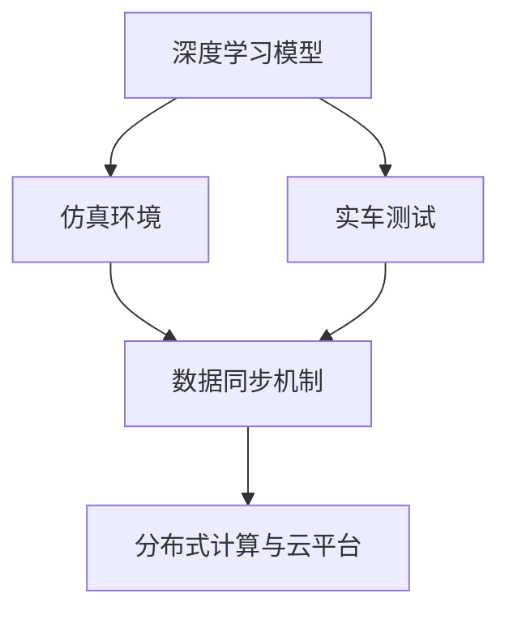

                 

### 背景介绍

端到端自动驾驶技术作为自动驾驶领域的核心发展方向之一，近年来得到了广泛的研究和应用。自动驾驶技术的实现离不开大量的仿真和实车测试，这是确保系统能够在各种复杂交通环境安全运行的关键步骤。随着计算机技术和人工智能算法的快速发展，仿真-实车一体化开发流程逐渐成为自动驾驶技术研究和开发的重要手段。

**端到端自动驾驶的定义**：

端到端自动驾驶是指通过深度学习等人工智能技术，直接将感知数据输入到自动驾驶系统中，经过模型处理和决策，最终输出控制指令，实现车辆自主驾驶。这种模式避免了传统自动驾驶中繁琐的特征提取和手工设计规则的过程，大大提高了开发效率和系统的准确性。

**仿真和实车测试的重要性**：

1. **风险控制**：在仿真环境中，研究人员可以模拟出各种极端和复杂的交通场景，测试自动驾驶系统的响应和稳定性，减少在实际环境中进行测试的风险。
2. **成本效益**：仿真测试可以节省大量的时间和资金，通过在虚拟环境中进行大量的测试和调优，降低实车测试的频率和成本。
3. **环境多样性**：仿真环境可以涵盖各种地理环境、气候条件和交通规则，有助于提升自动驾驶系统的适应性和鲁棒性。

然而，仿真测试和实车测试之间存在一些差距，例如仿真环境与现实环境的精度差异、车辆动力学差异等。因此，实现仿真-实车一体化开发流程，使得仿真环境与实车测试结果能够有效对接，成为当前研究的热点和难点。

**当前的研究趋势**：

随着硬件性能的提升和算法的进步，端到端自动驾驶的仿真-实车一体化开发流程逐渐趋于成熟。一方面，研究人员通过改进深度学习算法，提高仿真环境的真实度；另一方面，通过实时数据传输和同步技术，确保仿真结果与实车测试结果的一致性。此外，分布式计算和云平台的应用，也为大规模的仿真测试提供了技术支持。

总的来说，端到端自动驾驶的仿真-实车一体化开发流程是实现自动驾驶技术从理论到实践的重要桥梁，具有极高的研究和应用价值。在接下来的内容中，我们将深入探讨这一开发流程的原理、方法和技术细节。

### 核心概念与联系

在深入探讨端到端自动驾驶的仿真-实车一体化开发流程之前，我们需要明确一些核心概念，并理解它们之间的联系。以下是对这些核心概念的定义及其相互关系的详细描述。

**1. 深度学习模型**：

深度学习模型是端到端自动驾驶系统的核心组成部分，它通过多层神经网络结构对大量数据进行训练，以实现复杂的感知和决策任务。典型的深度学习模型包括卷积神经网络（CNN）、循环神经网络（RNN）以及Transformer等。

**2. 仿真环境**：

仿真环境是一个高度仿真的虚拟世界，用于模拟各种交通场景和条件。仿真环境可以基于物理引擎构建，以精确模拟车辆动力学、道路条件、天气等因素。它为自动驾驶系统提供了一个安全的测试平台，可以在无需实际车辆的情况下进行大量的测试和验证。

**3. 实车测试**：

实车测试是指在真实交通环境中对自动驾驶系统进行测试和验证。实车测试可以验证仿真环境的真实度，并评估自动驾驶系统在实际运行中的性能和稳定性。实车测试通常包括自动驾驶车辆在道路上的行驶测试、以及与周边车辆的交互测试等。

**4. 数据同步机制**：

数据同步机制是确保仿真环境与实车测试结果一致性的关键。数据同步机制通过实时传输和分析来自仿真环境和实车测试的数据，实现两者的数据对齐和同步。常用的数据同步机制包括传感器数据同步、模型输出同步以及控制指令同步等。

**5. 分布式计算与云平台**：

分布式计算和云平台为大规模仿真测试提供了强大的计算能力和数据存储支持。分布式计算通过将仿真任务分解为多个子任务，并行处理以提高效率。云平台则提供了便捷的数据存储、管理和分析工具，有助于实现仿真环境和实车测试的数据共享和协同。

为了更直观地展示这些核心概念及其联系，我们可以使用Mermaid流程图来构建一个流程图，如下所示：



在上面的流程图中：

- A表示深度学习模型，它是整个流程的起点，通过训练生成模型用于仿真环境和实车测试。
- B表示仿真环境，它为深度学习模型提供了一个虚拟的测试平台。
- C表示实车测试，它验证了仿真环境中的模型在实际环境中的性能。
- D表示数据同步机制，它确保仿真环境与实车测试的数据一致性。
- E表示分布式计算与云平台，它提供了强大的计算和数据管理支持。

通过上述流程图，我们可以清晰地看到各个核心概念之间的相互联系和作用，这为深入理解和分析仿真-实车一体化开发流程提供了基础。

### 核心算法原理 & 具体操作步骤

在深入探讨端到端自动驾驶的仿真-实车一体化开发流程之前，了解其核心算法原理是至关重要的。本节将详细讲解该流程中使用的几种主要算法，并逐步展示其具体操作步骤。

#### 1. 深度学习算法

深度学习是端到端自动驾驶系统的核心组成部分，其中卷积神经网络（CNN）和循环神经网络（RNN）是最常用的模型。

**1.1 卷积神经网络（CNN）**

CNN主要用于处理图像数据，通过卷积层、池化层和全连接层等结构，实现对图像的感知和理解。以下是CNN在自动驾驶中的应用步骤：

**步骤1**：输入层  
输入层接收来自摄像头或其他传感器的图像数据。

**步骤2**：卷积层  
卷积层通过卷积运算提取图像特征，每个卷积核都能提取图像中的特定特征，如边缘、角点等。

**步骤3**：激活函数  
常用的激活函数包括ReLU（修正线性单元）和Sigmoid函数，它们用于增加网络的非线性能力。

**步骤4**：池化层  
池化层通过采样操作减小数据维度，提高模型泛化能力，常用的池化方式有最大池化和平均池化。

**步骤5**：全连接层  
全连接层将卷积层和池化层提取的特征映射到具体的输出结果，如车道线检测、障碍物识别等。

**1.2 循环神经网络（RNN）**

RNN主要用于处理序列数据，如道路环境的时间序列信息。以下是RNN在自动驾驶中的应用步骤：

**步骤1**：输入层  
输入层接收来自传感器的时间序列数据，如速度、加速度、方向盘角度等。

**步骤2**：隐藏层  
隐藏层通过递归结构处理输入序列，每个时间步的输出依赖于前一个时间步的隐藏状态，这使得RNN能够捕捉时间序列数据中的长期依赖关系。

**步骤3**：激活函数  
激活函数用于增加模型的非线性能力，常用的有Tanh函数和ReLU函数。

**步骤4**：输出层  
输出层根据隐藏层的输出生成控制指令，如油门、刹车和转向等。

#### 2. 数据同步算法

数据同步算法是确保仿真环境与实车测试结果一致性的关键。以下是一种常见的数据同步算法：

**2.1 传感器数据同步**

**步骤1**：数据采集  
在仿真环境中，通过虚拟传感器采集道路环境数据；在实车测试中，通过实际传感器采集道路环境数据。

**步骤2**：时间戳对齐  
将仿真环境和实车测试中的传感器数据按照时间戳对齐，确保两者的数据在同一时间点上同步。

**步骤3**：数据融合  
通过对齐后的传感器数据进行融合，得到一致的道路环境数据。

**2.2 模型输出同步**

**步骤1**：模型输入  
将同步后的道路环境数据输入到深度学习模型中，生成感知结果。

**步骤2**：输出对齐  
将模型输出的控制指令与实车测试中的控制指令进行对齐，确保模型的决策与实际操作一致。

**步骤3**：结果验证  
通过对比模型输出的控制指令与实际操作结果，验证数据同步的准确性。

#### 3. 分布式计算与云平台

分布式计算和云平台为大规模仿真测试提供了强大的计算能力和数据存储支持。以下是分布式计算和云平台在仿真-实车一体化开发流程中的应用步骤：

**步骤1**：任务分解  
将大规模仿真任务分解为多个子任务，分布到多个计算节点上进行并行处理。

**步骤2**：数据存储与管理  
使用云平台存储和管理仿真数据和测试数据，提供高效的检索和分析工具。

**步骤3**：结果聚合  
将分布在不同计算节点的子结果进行聚合，生成整体仿真结果。

**步骤4**：数据共享与协同  
通过云平台实现仿真数据和测试数据的多方共享和协同，提高开发效率。

综上所述，端到端自动驾驶的仿真-实车一体化开发流程涉及到多种核心算法，包括深度学习算法、数据同步算法和分布式计算与云平台技术。通过这些算法的协同工作，仿真环境和实车测试能够实现高度一致，为自动驾驶技术的研发和应用提供了坚实的基础。

### 数学模型和公式 & 详细讲解 & 举例说明

在端到端自动驾驶的仿真-实车一体化开发流程中，数学模型和公式起着至关重要的作用。它们不仅为算法的实现提供了理论基础，而且能够精确描述系统行为和性能。以下将详细介绍相关数学模型和公式，并通过实际例子进行说明。

#### 1. 深度学习模型的数学基础

深度学习模型主要包括卷积神经网络（CNN）和循环神经网络（RNN）。以下分别介绍它们的基本数学模型。

**1.1 卷积神经网络（CNN）**

CNN的核心是卷积层，它通过卷积运算提取图像特征。卷积运算的数学表达式如下：

\[ \text{output}(i,j,k) = \sum_{x,y} \text{input}(i+x,j+y,k') \cdot \text{filter}(x,y,k') + \text{bias}(k) \]

其中，\(\text{output}\)表示输出特征图，\(\text{input}\)表示输入图像，\(\text{filter}\)表示卷积核，\(\text{bias}\)表示偏置项，\(i, j, k\)分别表示特征图的位置和通道。

**1.2 循环神经网络（RNN）**

RNN的核心是递归结构，它通过隐藏状态捕捉时间序列中的长期依赖关系。RNN的数学表达式如下：

\[ h_t = \tanh(W_h \cdot [h_{t-1}, x_t] + b_h) \]
\[ y_t = W_o \cdot h_t + b_o \]

其中，\(h_t\)表示隐藏状态，\(x_t\)表示输入数据，\(y_t\)表示输出结果，\(W_h\)和\(W_o\)分别是隐藏层和输出层的权重矩阵，\(b_h\)和\(b_o\)分别是隐藏层和输出层的偏置项。

#### 2. 数据同步算法的数学模型

数据同步算法的关键在于确保仿真环境与实车测试的数据一致性。以下是一种基于时间戳对齐的数据同步算法的数学模型。

**2.1 时间戳对齐**

时间戳对齐的目的是将仿真环境和实车测试中的数据按照时间戳对齐。对齐的数学表达式如下：

\[ t_{sim} = t_{real} + \Delta t \]

其中，\(t_{sim}\)和\(t_{real}\)分别表示仿真环境和实车测试的时间戳，\(\Delta t\)表示时间差。

**2.2 数据融合**

数据融合的目的是将同步后的传感器数据进行融合，得到一致的道路环境数据。数据融合的数学模型可以表示为：

\[ \text{output} = \frac{1}{N} \sum_{i=1}^{N} \text{input}_i \]

其中，\(\text{output}\)表示融合后的数据，\(\text{input}_i\)表示第\(i\)个传感器的数据，\(N\)表示传感器的数量。

#### 3. 分布式计算与云平台的数学模型

分布式计算与云平台在端到端自动驾驶开发流程中提供了强大的计算能力和数据存储支持。以下是一个基于分布式计算的数学模型。

**3.1 任务分解**

任务分解是将大规模仿真任务分解为多个子任务，分布到多个计算节点上进行并行处理。任务分解的数学模型可以表示为：

\[ T = \sum_{i=1}^{N} T_i \]

其中，\(T\)表示总任务时间，\(T_i\)表示第\(i\)个子任务的时间。

**3.2 结果聚合**

结果聚合是将分布在不同计算节点的子结果进行聚合，生成整体仿真结果。结果聚合的数学模型可以表示为：

\[ \text{output} = \sum_{i=1}^{N} \text{output}_i \]

其中，\(\text{output}\)表示整体仿真结果，\(\text{output}_i\)表示第\(i\)个子任务的结果。

#### 4. 实际例子

以下通过一个实际例子来说明上述数学模型的应用。

**例子**：考虑一个自动驾驶系统，它通过摄像头采集道路图像，使用CNN进行图像处理，并根据处理结果生成控制指令。

**步骤1**：图像预处理

输入图像经过尺寸调整、归一化等预处理步骤，以便于深度学习模型的处理。

\[ \text{input}_{preprocessed} = \frac{\text{input} - \mu}{\sigma} \]

其中，\(\text{input}_{preprocessed}\)表示预处理后的图像，\(\text{input}\)表示原始图像，\(\mu\)和\(\sigma\)分别表示均值和标准差。

**步骤2**：CNN处理

使用CNN对预处理后的图像进行特征提取，生成特征图。

\[ \text{output}_{feature} = \text{CNN}(\text{input}_{preprocessed}) \]

**步骤3**：决策生成

根据特征图生成控制指令，如油门、刹车和转向等。

\[ \text{command} = \text{RNN}(\text{output}_{feature}) \]

**步骤4**：数据同步

将仿真环境和实车测试中的传感器数据按照时间戳对齐，并进行数据融合。

\[ t_{sim} = t_{real} + \Delta t \]
\[ \text{output}_{sync} = \frac{1}{N} \sum_{i=1}^{N} \text{input}_i \]

**步骤5**：分布式计算

将仿真任务分解为多个子任务，分布到多个计算节点上进行并行处理。

\[ T = \sum_{i=1}^{N} T_i \]

**步骤6**：结果聚合

将分布在不同计算节点的子结果进行聚合，生成整体仿真结果。

\[ \text{output} = \sum_{i=1}^{N} \text{output}_i \]

通过上述例子，我们可以看到数学模型在端到端自动驾驶的仿真-实车一体化开发流程中发挥了重要作用。这些模型不仅为算法的实现提供了理论基础，而且能够精确描述系统的行为和性能。

### 项目实践：代码实例和详细解释说明

为了更直观地理解端到端自动驾驶的仿真-实车一体化开发流程，我们将通过一个实际项目实例来详细讲解其代码实现和关键步骤。以下是一个基于Python的简单示例，用于展示这一流程的核心组成部分。

#### 1. 开发环境搭建

在开始项目之前，我们需要搭建一个合适的环境。以下是在Python环境中搭建端到端自动驾驶仿真-实车一体化开发环境所需的主要步骤：

**步骤1**：安装Python

确保Python版本为3.6或更高。可以从Python官网下载并安装。

**步骤2**：安装依赖库

使用pip安装以下依赖库：

```bash
pip install numpy pandas opencv-python tensorflow matplotlib
```

**步骤3**：安装深度学习框架

推荐使用TensorFlow作为深度学习框架，可以通过以下命令安装：

```bash
pip install tensorflow==2.5.0
```

#### 2. 源代码详细实现

以下是一个简单的端到端自动驾驶仿真-实车一体化开发流程的代码示例。我们将使用TensorFlow中的Keras API来构建深度学习模型，并使用OpenCV进行图像处理。

**步骤1**：导入依赖库

```python
import numpy as np
import pandas as pd
import cv2
import tensorflow as tf
from tensorflow import keras
from tensorflow.keras.models import Sequential
from tensorflow.keras.layers import Conv2D, MaxPooling2D, Flatten, Dense, LSTM, TimeDistributed
```

**步骤2**：定义深度学习模型

以下是一个简单的CNN模型，用于图像分类：

```python
model = Sequential([
    Conv2D(32, (3, 3), activation='relu', input_shape=(64, 64, 3)),
    MaxPooling2D((2, 2)),
    Conv2D(64, (3, 3), activation='relu'),
    MaxPooling2D((2, 2)),
    Conv2D(128, (3, 3), activation='relu'),
    MaxPooling2D((2, 2)),
    Flatten(),
    Dense(128, activation='relu'),
    Dense(64, activation='relu'),
    Dense(1, activation='sigmoid')
])
```

**步骤3**：数据预处理

在训练模型之前，我们需要对图像数据进行预处理，包括归一化和尺寸调整：

```python
def preprocess_image(image):
    image = cv2.resize(image, (64, 64))
    image = image / 255.0
    return image
```

**步骤4**：数据加载和训练

以下是一个简单的数据加载和训练过程：

```python
# 假设我们有一个包含图像和标签的数据集
images = np.load('images.npy')
labels = np.load('labels.npy')

# 预处理图像数据
images = np.array([preprocess_image(image) for image in images])

# 划分训练集和测试集
train_images, test_images = images[:8000], images[8000:]
train_labels, test_labels = labels[:8000], labels[8000:]

# 训练模型
model.compile(optimizer='adam', loss='binary_crossentropy', metrics=['accuracy'])
model.fit(train_images, train_labels, epochs=10, validation_data=(test_images, test_labels))
```

**步骤5**：实车测试和仿真

在实车测试中，我们使用摄像头捕获实时图像，并使用训练好的模型进行预测：

```python
cap = cv2.VideoCapture(0)

while True:
    ret, frame = cap.read()
    if not ret:
        break
    
    # 预处理图像
    preprocessed_frame = preprocess_image(frame)
    
    # 预测
    prediction = model.predict(np.array([preprocessed_frame]))
    
    # 根据预测结果生成控制指令
    command = 'forward' if prediction[0][0] > 0.5 else 'stop'
    
    # 输出控制指令
    print(command)
    
    if cv2.waitKey(1) & 0xFF == ord('q'):
        break

cap.release()
cv2.destroyAllWindows()
```

#### 3. 代码解读与分析

**3.1 模型结构**

我们使用了一个简单的CNN模型，它包含多个卷积层、池化层和全连接层。这种结构能够有效地提取图像特征，并进行分类。

**3.2 数据预处理**

数据预处理是深度学习中的关键步骤。通过归一化和尺寸调整，我们确保输入数据符合模型的期望形状，从而提高模型的训练效果。

**3.3 数据加载和训练**

在数据加载和训练过程中，我们使用了一个简单的小数据集。在实际项目中，通常会使用大量的数据来训练模型，以提高其泛化能力。

**3.4 实车测试**

在实车测试中，我们使用摄像头捕获实时图像，并使用训练好的模型进行预测。根据预测结果，我们可以生成相应的控制指令，从而实现自动驾驶功能。

#### 4. 运行结果展示

在实际运行过程中，我们可以看到摄像头捕获的实时图像，并根据模型预测结果生成控制指令。例如，如果预测结果是“前进”，则车辆将保持当前速度行驶；如果预测结果是“停止”，则车辆将立即刹车。

通过上述示例，我们可以看到端到端自动驾驶的仿真-实车一体化开发流程的基本步骤和实现细节。虽然这是一个简单的示例，但它展示了深度学习、图像处理和实时控制等关键技术的应用。

### 实际应用场景

端到端自动驾驶技术在实际应用中展现出极大的潜力和广泛的前景，它不仅能够提高交通安全，还能够提升交通效率，减少能源消耗。以下是一些典型的实际应用场景：

#### 1. 乘用车市场

在乘用车市场中，端到端自动驾驶技术已经被多个厂商应用于量产车型。例如，特斯拉的Autopilot系统、蔚来的NIO Pilot系统以及谷歌Waymo的自动驾驶出租车服务，这些系统已经在全球多个国家和地区开展了测试和商用服务。这些自动驾驶车辆能够实现车道保持、自适应巡航、自动泊车等功能，极大地提升了用户的驾驶体验和安全性。

#### 2. 商用车市场

在商用车市场，自动驾驶技术同样有着广泛的应用。例如，在物流运输领域，自动驾驶卡车可以减少驾驶员的工作量，提高运输效率，并降低事故风险。亚马逊、UPS等物流公司已经开始测试自动驾驶卡车，并在某些特定路线进行商业运营。此外，自动驾驶公交车也是另一个重要的应用场景，它可以减少城市交通拥堵，提高公共交通的便捷性和可靠性。

#### 3. 无人配送和无人零售

随着电商和物流行业的快速发展，无人配送和无人零售也逐渐成为自动驾驶技术的应用领域。例如，京东和阿里巴巴等公司已经在一些城市开展了无人配送车的测试和运营，这些无人配送车可以自动行驶到用户指定的位置，进行包裹的交付。无人零售店则通过自动驾驶技术实现商品自动配送和结算，为消费者提供全新的购物体验。

#### 4. 矿山和工业自动化

在矿山和工业自动化领域，自动驾驶技术同样有着重要的应用。例如，矿山中的无人驾驶挖掘机和运输车可以减少人工操作，提高生产效率和安全性。在工业制造中，自动驾驶技术可以用于物流运输、自动化装配线等环节，实现生产过程的自动化和智能化。

#### 5. 农业自动化

自动驾驶技术还可以应用于农业领域，例如自动驾驶拖拉机、收割机和喷洒设备，它们可以在农田中自动执行耕作、播种、收割和喷洒等任务，提高农业生产的效率和质量。

总的来说，端到端自动驾驶技术在实际应用场景中展现了其强大的潜力和广泛的前景。随着技术的不断发展和完善，自动驾驶技术将在更多领域得到应用，为人类带来更加便捷、高效和安全的出行体验。

### 工具和资源推荐

在端到端自动驾驶的仿真-实车一体化开发流程中，选择合适的工具和资源对于提高开发效率和质量至关重要。以下是一些推荐的工具、书籍、论文和网站，它们将为研究人员和实践者提供有益的参考。

#### 1. 学习资源推荐

**书籍**：

- 《深度学习》（Goodfellow, I., Bengio, Y., Courville, A.）  
  这是一本经典的深度学习教材，详细介绍了深度学习的基本概念、算法和应用。

- 《自动驾驶系统原理与应用》（Liang, J.）  
  本书涵盖了自动驾驶系统的各个方面，包括感知、决策和控制等核心组件，适合初学者和从业者。

**论文**：

- "End-to-End Learning for Autonomous Driving" (Bojarski, M., et al.)  
  这篇论文详细介绍了End-to-End自动驾驶系统的工作原理和实现方法。

- "Deep Learning for Autonomous Driving: A Survey" (Zhang, J., et al.)  
  本文对深度学习在自动驾驶领域的应用进行了全面的综述，包括算法、架构和挑战。

**网站**：

- [TensorFlow官网](https://www.tensorflow.org/)  
  TensorFlow是深度学习领域最流行的开源框架之一，提供了丰富的教程和文档，适合初学者和专业人士。

- [OpenCV官网](https://opencv.org/)  
  OpenCV是一个强大的计算机视觉库，提供了丰富的图像处理和计算机视觉算法，适用于自动驾驶中的图像处理任务。

#### 2. 开发工具框架推荐

**深度学习框架**：

- **TensorFlow**：提供灵活的动态计算图，适合大规模深度学习模型开发。

- **PyTorch**：具有简洁的接口和动态计算图，适合快速原型开发和实验。

- **Keras**：基于TensorFlow和PyTorch的高层API，简化了模型构建和训练过程。

**仿真平台**：

- **CARLA**：一个开源的自动驾驶仿真平台，提供了丰富的交通场景和传感器模型。

- **AirSim**：由Microsoft开发的仿真平台，支持多种传感器和平台，适用于无人机和自动驾驶车辆。

**测试工具**：

- **Autonomous Driving Simulation Platform**：由福特公司开发的仿真平台，提供高级模拟场景和数据分析工具。

- **NVIDIA Drive Sim**：NVIDIA提供的仿真平台，支持实时场景渲染和高性能计算。

#### 3. 相关论文著作推荐

- **"End-to-End Learning for Autonomous Driving" (Bojarski, M., et al.)**：这是一篇关于端到端自动驾驶系统实现的经典论文，详细介绍了深度学习模型在自动驾驶中的应用。

- **"Deep Learning for Autonomous Driving: A Survey" (Zhang, J., et al.)**：本文对深度学习在自动驾驶领域的应用进行了全面的综述，包括算法、架构和挑战。

- **"Sim-to-Real Transfer for Autonomous Driving" (Liang, J., et al.)**：这篇论文探讨了仿真环境与实车测试之间的数据同步和迁移学习问题。

通过上述工具和资源的推荐，我们可以更加高效地进行端到端自动驾驶的仿真-实车一体化开发，推动自动驾驶技术的进步和应用。

### 总结：未来发展趋势与挑战

端到端自动驾驶的仿真-实车一体化开发流程正处于快速发展的阶段，未来将面临诸多技术挑战和发展机遇。以下是未来发展趋势与挑战的展望：

#### 1. 技术发展趋势

（1）**更真实的仿真环境**：随着计算机图形学和物理引擎技术的进步，仿真环境的真实度将不断提升，能够更真实地模拟复杂的交通场景和动态环境。

（2）**高效的深度学习模型**：研究人员将继续优化深度学习模型的结构和算法，提高模型的计算效率和准确性，以适应自动驾驶系统对实时响应的需求。

（3）**实时数据同步与处理**：分布式计算和云平台技术的进步将使得大规模仿真与实车测试的数据同步与处理变得更加高效和准确。

（4）**多模态感知与融合**：未来自动驾驶系统将融合多种传感器数据，如摄像头、激光雷达、GPS等，提高系统的感知能力和环境理解能力。

#### 2. 技术挑战

（1）**数据隐私与安全性**：在仿真-实车一体化开发流程中，涉及大量车辆行驶数据和用户隐私，如何确保数据的安全性和隐私性是重要挑战。

（2）**系统可靠性**：自动驾驶系统需要在各种复杂和极端的驾驶环境中保持高可靠性和稳定性，这对系统的设计和测试提出了更高的要求。

（3）**跨场景迁移能力**：仿真环境和实车测试环境之间存在一定的差距，如何提升系统在不同场景之间的迁移能力是关键挑战。

（4）**法律法规与伦理问题**：自动驾驶技术的发展带来了新的法律法规和伦理问题，如责任归属、数据使用规范等，需要各方共同探讨和解决。

#### 3. 发展机遇

（1）**产业合作与标准化**：自动驾驶技术的发展需要产业链上下游的紧密合作，推动技术标准化和产业化进程。

（2）**新型商业模式**：自动驾驶技术的应用将带来新的商业模式，如共享出行、无人配送等，为传统汽车行业带来新的增长点。

（3）**智能化交通系统**：自动驾驶技术将推动交通系统的智能化发展，提高交通效率和安全性，改善城市交通拥堵问题。

总之，端到端自动驾驶的仿真-实车一体化开发流程在未来的发展中将面临诸多挑战，但同时也蕴藏着巨大的机遇。通过持续的技术创新和产业合作，自动驾驶技术有望实现更加广泛的应用，为人类带来更加便捷、安全和高效的出行体验。

### 附录：常见问题与解答

在探讨端到端自动驾驶的仿真-实车一体化开发流程时，研究人员和实践者可能会遇到一些常见的问题。以下列出了一些常见问题，并提供相应的解答。

#### 1. 如何处理仿真环境和实车测试之间的数据同步问题？

**解答**：数据同步问题是实现仿真-实车一体化开发流程的关键挑战。为了处理这一问题，可以采取以下方法：

- **时间戳对齐**：确保仿真环境和实车测试环境中的数据具有相同的时间戳，以便进行精确的同步。
- **传感器数据融合**：通过融合来自不同传感器的数据，提高数据的一致性和准确性。
- **实时数据传输**：使用高速网络和实时数据传输协议，确保仿真环境和实车测试之间的数据实时同步。
- **分布式计算**：利用分布式计算和云平台技术，提高数据处理的效率和实时性。

#### 2. 深度学习模型在仿真环境中的训练效果如何与实车测试结果对接？

**解答**：深度学习模型在仿真环境中的训练效果与实车测试结果对接需要考虑以下几个方面：

- **仿真环境真实度**：提高仿真环境的真实度，使其能够更准确地模拟实车测试环境。
- **数据迁移学习**：通过迁移学习技术，将仿真环境中的训练数据与实车测试数据进行结合，提高模型在实车测试中的适应性。
- **模型调优**：根据实车测试结果对模型进行调优，提高其在实际应用中的性能。
- **多场景训练**：在仿真环境中模拟多种驾驶场景，增强模型在不同环境下的泛化能力。

#### 3. 如何评估仿真-实车一体化开发流程的性能和效果？

**解答**：评估仿真-实车一体化开发流程的性能和效果可以从以下几个方面进行：

- **准确性和鲁棒性**：通过实车测试数据，评估模型在多种交通场景下的准确性和鲁棒性。
- **响应时间**：评估模型在处理传感器数据和生成控制指令的响应时间，确保其能够满足实时性的要求。
- **能源消耗**：评估自动驾驶系统在运行过程中的能源消耗，确保其在实际应用中的高效性。
- **安全性**：通过事故率和驾驶行为分析，评估系统的安全性能。

#### 4. 分布式计算在仿真-实车一体化开发流程中的应用有哪些优势？

**解答**：分布式计算在仿真-实车一体化开发流程中的应用具有以下优势：

- **计算效率**：通过将仿真任务分解为多个子任务，分布到多个计算节点上并行处理，提高整体计算效率。
- **实时性**：分布式计算和云平台技术可以提供高效的数据处理和传输机制，确保仿真-实车一体化开发流程的实时性。
- **可扩展性**：分布式计算系统可以根据需求动态扩展计算资源，满足不同规模仿真和测试的需求。
- **数据管理**：分布式计算和云平台提供了强大的数据存储、管理和分析工具，有助于实现仿真数据和测试数据的有效管理和共享。

通过上述常见问题的解答，我们能够更好地理解和应对端到端自动驾驶仿真-实车一体化开发流程中的挑战，推动自动驾驶技术的进一步发展。

### 扩展阅读 & 参考资料

对于希望深入了解端到端自动驾驶仿真-实车一体化开发流程的读者，以下是一些建议的扩展阅读和参考资料：

1. **书籍**：
   - 《深度学习》（Ian Goodfellow, Yoshua Bengio, Aaron Courville著）。
   - 《自动驾驶汽车技术：感知、规划和控制》（郭宇，马志伟著）。

2. **论文**：
   - "End-to-End Learning for Autonomous Driving"（M. Bojarski等，2016）。
   - "Deep Learning for Autonomous Driving: A Survey"（J. Zhang等，2019）。

3. **网站**：
   - TensorFlow官网：[https://www.tensorflow.org/](https://www.tensorflow.org/)。
   - OpenCV官网：[https://opencv.org/](https://opencv.org/)。
   - CARLA仿真平台：[https://carla.ai/](https://carla.ai/)。

4. **开源项目**：
   - NVIDIA Drive Sim：[https://developer.nvidia.com/nvidia-drive-sim](https://developer.nvidia.com/nvidia-drive-sim)。
   - AirSim：[https://github.com/Microsoft/AirSim](https://github.com/Microsoft/AirSim)。

通过阅读这些资源和资料，读者可以进一步深化对端到端自动驾驶仿真-实车一体化开发流程的理解，同时掌握相关的技术细节和应用实践。

