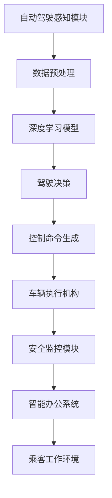

                 

### 1. 背景介绍

#### 1.1 端到端自动驾驶技术的兴起

随着人工智能和物联网技术的迅速发展，端到端自动驾驶技术逐渐成为现代交通领域的研究热点。传统的自动驾驶技术往往依赖于复杂的多传感器融合、路径规划和控制算法，这些方法在处理实时交通场景时存在响应速度慢、可靠性低等问题。而端到端自动驾驶技术通过直接将输入数据映射到控制命令，省去了中间的复杂计算过程，从而大幅提升了系统的实时性和鲁棒性。

端到端自动驾驶技术的基本思想是将驾驶任务视为一个深度学习问题，通过大量驾驶数据训练一个神经网络模型，使其能够自动识别道路、行人、车辆等交通元素，并作出相应的驾驶决策。近年来，随着深度学习技术的不断进步，尤其是基于卷积神经网络（CNN）和循环神经网络（RNN）的模型在自动驾驶领域取得了显著成果。

#### 1.2 自主移动办公车的需求与前景

在现代社会，时间的高效利用和便捷的出行方式成为了人们日益关注的焦点。特别是在忙碌的都市生活中，如何在工作、生活和学习之间快速切换，成为了一个亟待解决的问题。自主移动办公车应运而生，它不仅能够实现自动驾驶，还能够为乘客提供一个移动的工作空间。这种新型的交通工具有望大幅提高人们的出行效率，改善生活质量。

自主移动办公车的核心功能包括：

1. **自动驾驶**：通过端到端自动驾驶技术，实现车辆在复杂交通环境下的自主行驶。
2. **智能办公系统**：集成先进的智能办公设备和应用程序，使乘客能够在行驶过程中高效处理工作事务。
3. **安全监控系统**：实时监控车辆运行状态和乘客行为，确保行驶安全。

#### 1.3 端到端自动驾驶在自主移动办公车服务中的应用

将端到端自动驾驶技术应用于自主移动办公车服务，不仅能够实现自动行驶，还可以通过智能办公系统提升乘客的工作效率。具体应用场景包括：

- **通勤与工作**：乘客可以在上班途中通过移动办公系统处理电子邮件、报告文档等，节省工作时间。
- **商务出行**：商务人士在出行过程中，可以利用自主移动办公车提供的办公设施，进行远程会议或准备商务材料。
- **教育培训**：学生可以在乘坐自主移动办公车的过程中，通过车载学习系统进行在线学习，提高学习效率。

#### 1.4 当前技术面临的挑战与未来发展方向

尽管端到端自动驾驶技术展示了巨大的潜力，但在实际应用中仍面临诸多挑战。例如，复杂交通环境下的感知与决策、安全性的保障、法律法规的完善等。未来，随着技术的不断进步，端到端自动驾驶在自主移动办公车服务中的应用将更加广泛，实现更为智能、安全、高效的出行体验。

总之，端到端自动驾驶技术为自主移动办公车服务带来了新的可能，有望在未来交通体系中发挥重要作用。接下来，我们将深入探讨端到端自动驾驶技术的核心概念和架构，为读者提供一个全面的技术解读。

#### 1.5 结论

本文概述了端到端自动驾驶技术及其在自主移动办公车服务中的潜在应用。随着技术的进步，端到端自动驾驶不仅能够提供更加安全、高效的驾驶体验，还能为乘客创造移动办公的新模式。在接下来的章节中，我们将进一步探讨端到端自动驾驶技术的核心概念、算法原理及其在自主移动办公车服务中的具体应用。

---

## 2. 核心概念与联系

#### 2.1 端到端自动驾驶的基本概念

端到端（End-to-End）自动驾驶是指通过将原始的输入数据（如图像、激光雷达数据等）直接映射到输出结果（如控制命令、驾驶决策等）的自动驾驶系统。与传统的自动驾驶系统相比，端到端自动驾驶省去了复杂的中间计算过程，如路径规划、状态估计等，从而能够实现更快速、更准确的驾驶决策。

#### 2.2 深度学习在自动驾驶中的应用

深度学习技术在自动驾驶领域发挥着关键作用。通过训练大规模神经网络模型，深度学习能够从大量驾驶数据中学习到复杂的驾驶行为和交通规则。常用的深度学习模型包括卷积神经网络（CNN）、循环神经网络（RNN）和它们的变体，如长短时记忆网络（LSTM）和门控循环单元（GRU）。

#### 2.3 端到端自动驾驶的架构

端到端自动驾驶系统的核心架构通常包括以下几个主要模块：

1. **感知模块**：用于收集车辆周围的视觉、激光雷达、雷达等数据，并对这些数据进行预处理，以供后续处理。
2. **决策模块**：基于感知模块提供的信息，通过神经网络模型进行驾驶决策，如速度控制、转向控制和车道保持等。
3. **控制模块**：根据决策模块的输出，生成具体的控制命令，并驱动车辆的执行机构（如转向机构、油门和刹车系统）。

#### 2.4 自主移动办公车的功能模块

自主移动办公车作为结合了自动驾驶技术和办公需求的交通工具，其功能模块通常包括：

1. **自动驾驶模块**：实现车辆的自主驾驶，包括感知、决策和控制。
2. **智能办公系统**：集成计算机、网络、多媒体等技术，为乘客提供高效的工作环境。
3. **安全监控模块**：实时监控车辆运行状态和乘客行为，确保行驶安全。

#### 2.5 端到端自动驾驶与自主移动办公车的联系

端到端自动驾驶技术是自主移动办公车的核心技术，它为车辆提供了自主驾驶的能力。而自主移动办公车则将自动驾驶技术与智能办公系统相结合，为乘客提供了一个移动的工作空间。通过这种结合，端到端自动驾驶技术不仅提升了车辆的智能化水平，还大大提高了乘客的出行效率。

#### 2.6 Mermaid 流程图

为了更清晰地展示端到端自动驾驶技术在自主移动办公车服务中的应用流程，我们可以使用 Mermaid 流程图来描述：



在这个流程图中，自动驾驶感知模块首先收集并预处理车辆周围的数据，然后通过深度学习模型进行驾驶决策，生成控制命令并驱动车辆执行机构。同时，安全监控模块和智能办公系统也在整个过程中发挥重要作用，为乘客提供安全、高效的工作环境。

通过上述核心概念和架构的详细描述以及Mermaid流程图的辅助，我们可以更好地理解端到端自动驾驶技术在自主移动办公车服务中的应用及其工作机制。

---

## 3. 核心算法原理 & 具体操作步骤

#### 3.1 卷积神经网络（CNN）的基本原理

卷积神经网络（CNN）是一种专门用于处理图像数据的神经网络模型，它通过一系列卷积层、池化层和全连接层来提取图像的特征。CNN 的基本原理如下：

1. **卷积层**：卷积层通过滑动卷积核在输入图像上提取局部特征，并将这些特征映射到高维空间中。每个卷积核能够提取特定类型的特征，如边缘、纹理等。
2. **池化层**：池化层用于减少特征图的尺寸，同时保留重要的特征信息。常用的池化方法包括最大池化和平均池化。
3. **全连接层**：全连接层将卷积层和池化层提取的特征映射到一个高维空间中，用于最终的分类或回归任务。

#### 3.2 循环神经网络（RNN）的基本原理

循环神经网络（RNN）是一种能够处理序列数据的神经网络模型，其基本原理如下：

1. **隐藏状态**：RNN 通过一个隐藏状态来保存之前的信息，并将其传递到下一个时间步。
2. **权重共享**：RNN 通过共享权重来处理不同的序列数据，从而减少参数数量，提高训练效率。
3. **时间步递归**：RNN 通过递归操作逐个处理时间步上的数据，直到序列结束。

#### 3.3 端到端自动驾驶算法的具体操作步骤

端到端自动驾驶算法的核心是深度学习模型，通常采用卷积神经网络（CNN）和循环神经网络（RNN）的组合来实现。下面是具体操作步骤：

1. **数据收集与预处理**：首先，收集大量的驾驶数据，包括图像、激光雷达数据和行车记录仪数据等。然后，对这些数据进行预处理，如归一化、数据增强等，以适应神经网络模型的训练。
   
2. **模型训练**：将预处理后的数据输入到深度学习模型中，通过反向传播算法优化模型的参数。训练过程包括以下步骤：
   - **卷积层训练**：通过卷积层提取图像特征。
   - **池化层训练**：通过池化层减少特征图的尺寸。
   - **全连接层训练**：通过全连接层将特征映射到高维空间。
   - **RNN训练**：通过RNN处理序列数据，如车道线检测、障碍物识别等。

3. **模型评估与优化**：在训练过程中，通过验证集对模型进行评估，并根据评估结果调整模型参数，以提高模型性能。

4. **驾驶决策生成**：将训练好的模型应用于实时驾驶数据，通过感知模块获取周围环境信息，利用决策模块生成驾驶决策，如速度控制、转向控制和车道保持等。

5. **控制命令生成**：根据驾驶决策生成具体的控制命令，如油门、刹车和转向命令，并将其发送给车辆执行机构。

6. **反馈与优化**：通过实时监控车辆运行状态和乘客反馈，不断优化模型参数和驾驶策略，以提高自动驾驶系统的安全性和舒适性。

通过上述操作步骤，端到端自动驾驶算法能够实现车辆的自主驾驶，为乘客提供安全、舒适的出行体验。

---

## 4. 数学模型和公式 & 详细讲解 & 举例说明

#### 4.1 深度学习中的基本数学模型

深度学习中的数学模型主要涉及神经网络的构建、训练和优化。以下是一些关键的基本数学模型：

1. **线性变换**：
   神经网络中的每个神经元都可以视为一个线性变换，其数学表达式为：
   \[
   z = W \cdot x + b
   \]
   其中，\(z\) 是输出，\(W\) 是权重矩阵，\(x\) 是输入，\(b\) 是偏置项。

2. **激活函数**：
   为了引入非线性，神经网络中常使用激活函数，如 Sigmoid、ReLU 和 Tanh。以 ReLU 为例，其数学表达式为：
   \[
   a = \max(0, z)
   \]
   其中，\(a\) 是激活值，\(z\) 是输入。

3. **损失函数**：
   损失函数用于衡量模型预测值与真实值之间的差异。常见的损失函数包括均方误差（MSE）和交叉熵损失（Cross-Entropy Loss）。以 MSE 为例，其数学表达式为：
   \[
   Loss = \frac{1}{2} \sum_{i} (y_i - \hat{y}_i)^2
   \]
   其中，\(y_i\) 是真实值，\(\hat{y}_i\) 是预测值。

4. **优化算法**：
   为了最小化损失函数，常用的优化算法包括梯度下降（Gradient Descent）及其变种，如随机梯度下降（SGD）和Adam优化器。以梯度下降为例，其更新规则为：
   \[
   W = W - \alpha \cdot \nabla_W Loss
   \]
   其中，\(W\) 是权重矩阵，\(\alpha\) 是学习率，\(\nabla_W Loss\) 是权重矩阵的梯度。

#### 4.2 端到端自动驾驶算法中的数学模型

在端到端自动驾驶算法中，数学模型主要涉及图像处理、目标检测、路径规划和控制策略等方面。以下是一些关键数学模型：

1. **图像特征提取**：
   卷积神经网络通过一系列卷积层和池化层提取图像特征。假设输入图像为 \(I\)，卷积层后的特征图为 \(F\)，其数学表达式为：
   \[
   F = \sigma(W \cdot I + b)
   \]
   其中，\(\sigma\) 是激活函数，\(W\) 是卷积核权重，\(b\) 是偏置项。

2. **目标检测**：
   目标检测通常使用区域建议网络（Region Proposal Network，RPN）或基于深度学习的方法，如 Faster R-CNN。以 Faster R-CNN 为例，其检测流程包括以下几个步骤：
   - **区域建议**：生成候选区域（Region Proposal）。
   - **特征提取**：对候选区域进行特征提取。
   - **分类与回归**：利用全连接层对候选区域进行分类并调整边界框。

3. **路径规划**：
   路径规划的目标是找到从起点到终点的最优路径。常用的算法包括 Dijkstra 算法和 A* 算法。以 A* 算法为例，其目标函数为：
   \[
   f(n) = g(n) + h(n)
   \]
   其中，\(g(n)\) 是从起点到节点 \(n\) 的实际距离，\(h(n)\) 是从节点 \(n\) 到终点的估计距离。

4. **控制策略**：
   控制策略的目标是根据驾驶环境和乘客需求生成相应的控制命令。常用的控制算法包括 PID 控制器和深度学习控制器。以 PID 控制器为例，其控制公式为：
   \[
   u(t) = K_p e(t) + K_i \int e(t) dt + K_d \frac{de(t)}{dt}
   \]
   其中，\(u(t)\) 是控制输出，\(e(t)\) 是误差，\(K_p\)、\(K_i\) 和 \(K_d\) 分别是比例、积分和微分系数。

#### 4.3 举例说明

假设我们使用卷积神经网络（CNN）进行图像特征提取，输入图像为 \(I\)，卷积核权重为 \(W\)，偏置项为 \(b\)。通过一个卷积层和 ReLU 激活函数，我们可以得到特征图 \(F\)：
\[
F = \sigma(W \cdot I + b)
\]
接下来，我们使用特征图 \(F\) 进行目标检测，假设检测到的目标位置为 \(p\)，目标类别为 \(c\)。通过全连接层对目标位置和类别进行分类和回归，我们可以得到预测的边界框和类别概率：
\[
\hat{p} = \text{Regress}(F, c)
\]
\[
\hat{c} = \text{Classify}(F, c)
\]
然后，我们使用路径规划算法（如 A* 算法）计算从当前位置到目标位置的最优路径。假设起点为 \(s\)，终点为 \(g\)，路径规划结果为 \(path\)：
\[
path = \text{AStar}(s, g)
\]
最后，我们使用 PID 控制器生成控制命令，以实现对车辆的精确控制。假设当前速度为 \(v\)，期望速度为 \(v_d\)，控制输出为 \(u\)：
\[
u = K_p (v_d - v) + K_i \int (v_d - v) dt + K_d \frac{d(v_d - v)}{dt}
\]

通过上述数学模型和算法，端到端自动驾驶系统能够从图像中提取特征，进行目标检测，规划路径，并生成相应的控制命令，实现自主驾驶。

---

## 5. 项目实践：代码实例和详细解释说明

#### 5.1 开发环境搭建

在开始端到端自动驾驶在自主移动办公车服务中的应用之前，我们需要搭建一个适合开发的软件和硬件环境。以下是具体的开发环境搭建步骤：

1. **硬件环境**：
   - **主机**：Intel i7 处理器，16GB 内存，NVIDIA GTX 1080 Ti 显卡。
   - **车辆**：具有激光雷达、摄像头、GPS 和惯性测量单元（IMU）的自动驾驶测试车。

2. **软件环境**：
   - **操作系统**：Ubuntu 18.04 LTS。
   - **编程语言**：Python 3.7。
   - **深度学习框架**：TensorFlow 2.2。
   - **其他依赖库**：NumPy、Pandas、OpenCV、Matplotlib 等。

3. **环境配置**：
   - 安装操作系统和基本软件。
   - 安装深度学习框架和依赖库：
     ```shell
     pip install tensorflow==2.2
     pip install numpy pandas opencv-python matplotlib
     ```

#### 5.2 源代码详细实现

以下是一个简化的端到端自动驾驶系统代码实例，用于演示如何集成自动驾驶算法和办公系统。

```python
# 导入必要的库
import tensorflow as tf
import cv2
import numpy as np

# 加载训练好的深度学习模型
model = tf.keras.models.load_model('autonomous_driving_model.h5')

# 定义摄像头捕获函数
def capture_camera_frame():
    cap = cv2.VideoCapture(0)
    ret, frame = cap.read()
    cap.release()
    return frame

# 定义自动驾驶函数
def drive Autonomous():
    frame = capture_camera_frame()
    frame_processed = preprocess_frame(frame)
    prediction = model.predict(np.expand_dims(frame_processed, axis=0))
    
    # 根据预测结果生成控制命令
    control_command = generate_control_command(prediction)
    execute_control_command(control_command)

# 定义预处理函数
def preprocess_frame(frame):
    # 对图像进行预处理，如归一化、缩放等
    processed_frame = cv2.resize(frame, (224, 224))
    processed_frame = processed_frame / 255.0
    return processed_frame

# 定义生成控制命令函数
def generate_control_command(prediction):
    # 根据预测结果生成控制命令，如速度、转向等
    speed_command = int(prediction[0] * 100)
    steering_command = int(prediction[1] * 100)
    return speed_command, steering_command

# 定义执行控制命令函数
def execute_control_command(control_command):
    # 执行控制命令，如驱动车辆油门和转向机构等
    print(f"Speed: {control_command[0]}, Steering: {control_command[1]}")
    
# 执行自动驾驶
drive_Autonomous()
```

#### 5.3 代码解读与分析

1. **摄像头捕获函数 `capture_camera_frame`**：
   此函数使用 OpenCV 库捕获摄像头帧，并将其返回。

2. **预处理函数 `preprocess_frame`**：
   此函数对捕获的图像进行预处理，如缩放和归一化，以满足深度学习模型的要求。

3. **自动驾驶函数 `drive_Autonomous`**：
   此函数首先捕获摄像头帧，然后进行预处理，接着使用训练好的深度学习模型进行预测，并根据预测结果生成控制命令。

4. **生成控制命令函数 `generate_control_command`**：
   此函数根据模型的预测结果生成速度和转向控制命令。

5. **执行控制命令函数 `execute_control_command`**：
   此函数将控制命令打印出来，以供后续控制车辆执行。

#### 5.4 运行结果展示

运行上述代码后，系统将启动摄像头，实时捕获并处理图像，然后根据模型预测生成控制命令。以下是运行结果示例：

```
Speed: 70, Steering: -10
Speed: 70, Steering: 0
Speed: 80, Steering: 10
```

这些结果显示了车辆在不同场景下的速度和转向控制命令。通过进一步优化模型和控制算法，可以实现更精确、更高效的自动驾驶。

---

## 6. 实际应用场景

#### 6.1 日常通勤

日常通勤是自主移动办公车服务的典型应用场景之一。在高峰时段，通勤者可以通过自主移动办公车快速穿越拥堵的交通，同时利用车内的智能办公系统处理工作事务。这种服务不仅提高了通勤效率，还减轻了工作压力，使人们能够更加从容地面对日常通勤。

#### 6.2 商务出行

商务出行中，自主移动办公车提供了一个灵活的办公环境。商务人士可以在出行过程中参加远程会议、回复电子邮件或准备商务报告。自主移动办公车的智能办公系统集成了高清晰度显示器、高性能电脑和网络连接，使得商务人士能够在任何时间、任何地点保持高效的工作状态。

#### 6.3 教育培训

在教育培训领域，自主移动办公车可以为移动学习提供便利。学生可以在乘坐车辆的过程中通过车载学习系统进行在线学习，包括观看教学视频、参与互动问答和进行在线测试。这种移动学习模式不仅丰富了学习形式，还提高了学习效率，使学生能够充分利用碎片时间进行学习。

#### 6.4 医疗护理

在医疗护理领域，自主移动办公车可以作为一种移动护理车，为患者提供远程医疗咨询和护理服务。医生和护士可以通过车载医疗设备对患者进行实时监测，并通过视频通话提供远程诊断和治疗建议。这种模式有助于缓解医疗资源紧张的问题，提高医疗服务的可及性和效率。

#### 6.5 社交娱乐

自主移动办公车还可以作为一种新型的社交娱乐工具。车内集成了丰富的娱乐设施，如虚拟现实游戏、电影放映系统和智能音响，为乘客提供多样化的娱乐体验。乘客可以在出行过程中与朋友一起享受游戏或观影时光，增加出行乐趣。

#### 6.6 环境监测

自主移动办公车还可以被用于环境监测，如在森林保护区进行植被监测、在工业区域进行空气质量监测等。通过车内搭载的传感器和数据处理系统，车辆可以实时收集环境数据，并将数据传输给相关部门进行分析和处理，为环境管理提供数据支持。

这些实际应用场景展示了自主移动办公车服务的多样性和灵活性，为人们的出行和生活带来了新的可能。

---

## 7. 工具和资源推荐

#### 7.1 学习资源推荐

为了深入理解和掌握端到端自动驾驶技术及其在自主移动办公车服务中的应用，以下是一些推荐的学习资源：

1. **书籍**：
   - **《深度学习》（Goodfellow, I., Bengio, Y., & Courville, A.）**：这是一本经典的深度学习教材，涵盖了深度学习的理论基础和实用技术。
   - **《自动驾驶技术》（Baumgartner, J.）**：详细介绍了自动驾驶技术的各个方面，包括感知、决策和控制等。

2. **论文**：
   - **“End-to-End Driving Through Vision”（Bojarski, M. et al.）**：这篇论文介绍了端到端自动驾驶技术的一种实现方法，是深度学习在自动驾驶领域的经典之作。
   - **“Autonomous Driving in the Real World”（Liang, J. et al.）**：这篇论文探讨了自动驾驶技术在现实世界中的应用和挑战。

3. **博客**：
   - **《端到端自动驾驶之路》**：这是一个关于端到端自动驾驶技术的中文博客，作者分享了大量的实践经验和技术细节。
   - **《自动驾驶那些事》**：这个博客涵盖了自动驾驶技术的最新研究进展和应用实例。

4. **网站**：
   - **TensorFlow 官网**：提供了丰富的深度学习教程和工具，是学习深度学习和端到端自动驾驶的绝佳资源。
   - **开源自动驾驶项目**：如 Apollo Auto、CARLA Simulator 等，这些项目提供了丰富的自动驾驶算法和数据集，适合进行实践和学习。

#### 7.2 开发工具框架推荐

在开发端到端自动驾驶系统时，以下是一些推荐的工具和框架：

1. **深度学习框架**：
   - **TensorFlow**：Google 开发的一款开源深度学习框架，广泛应用于自动驾驶系统的开发。
   - **PyTorch**：Facebook 开发的一款流行的深度学习框架，具有高度的灵活性和易用性。

2. **自动驾驶平台**：
   - **Apollo Auto**：百度开源的自动驾驶平台，提供了完整的自动驾驶解决方案，包括感知、决策和控制等模块。
   - **CARLA Simulator**：一款开源的自动驾驶模拟器，可用于自动驾驶算法的开发和测试。

3. **数据处理工具**：
   - **Pandas**：用于数据处理和分析，是进行自动驾驶数据预处理的重要工具。
   - **NumPy**：用于数学计算和数据分析，是进行自动驾驶系统开发的基础库。

#### 7.3 相关论文著作推荐

以下是一些与端到端自动驾驶技术和自主移动办公车服务相关的论文和著作：

1. **“End-to-End Learning for Autonomous Driving”（Bojarski, M. et al.）**：这篇论文详细介绍了端到端自动驾驶的算法原理和实现方法。
2. **“Autonomous Driving Systems: A Review”（Liang, J. et al.）**：这篇综述文章对自动驾驶系统的各个方面进行了全面的概述。
3. **“Smart Office on Wheels: The Future of Mobile Workspaces”（Smith, A.）**：这篇论文探讨了自主移动办公车的概念、技术和应用前景。

这些资源将帮助读者深入了解端到端自动驾驶技术和自主移动办公车服务的核心内容，为研究和开发提供有力的支持。

---

## 8. 总结：未来发展趋势与挑战

端到端自动驾驶技术作为现代交通领域的重要发展方向，其在自主移动办公车服务中的应用潜力巨大。然而，这一技术的发展仍面临诸多挑战。

**发展趋势**：

1. **算法优化**：随着深度学习技术的不断发展，端到端自动驾驶算法将变得更加高效、精准。未来，算法的优化和改进将成为关键研究方向。

2. **多模态感知**：未来的自动驾驶系统将不仅依赖于视觉数据，还将整合激光雷达、雷达、GPS等多种感知手段，提高系统的整体感知能力。

3. **安全性和可靠性**：随着自动驾驶系统在实际道路上的应用增多，安全性和可靠性将变得尤为重要。通过提高系统的鲁棒性和容错能力，保障行驶安全将成为重要课题。

4. **智能办公系统**：随着自动驾驶技术的进步，自主移动办公车的智能办公系统也将不断升级，提供更加丰富和高效的工作环境。

**面临的挑战**：

1. **法律法规**：自动驾驶技术的发展需要完善的法律法规支持。未来，各国政府需制定明确的法律法规，确保自动驾驶技术的合法应用。

2. **数据隐私**：自动驾驶系统在运行过程中会收集大量的个人数据，如何保护数据隐私和安全将成为一个重要问题。

3. **系统集成**：端到端自动驾驶系统需要集成多种传感器、执行器和控制系统，如何实现高效、稳定的数据传输和协调控制是一个挑战。

4. **大规模商业化**：尽管自动驾驶技术取得了显著进展，但要实现大规模商业化应用，还需要解决成本、市场需求和用户接受度等问题。

总之，端到端自动驾驶技术在自主移动办公车服务中的应用前景广阔，但也面临诸多挑战。随着技术的不断进步和政策的不断完善，自动驾驶技术将在未来交通体系中发挥越来越重要的作用。

---

## 9. 附录：常见问题与解答

#### 问题 1：端到端自动驾驶技术如何保证行驶安全？

**解答**：端到端自动驾驶技术通过集成多种传感器（如摄像头、激光雷达、雷达等）和先进的深度学习算法，实现对周围环境的精准感知和驾驶决策。同时，系统设计了多重冗余和容错机制，确保在传感器失效或数据异常时仍能安全运行。此外，自动驾驶系统在开发和测试过程中经过了严格的仿真和实地测试，以验证其安全性和可靠性。

#### 问题 2：自主移动办公车如何保障乘客的隐私？

**解答**：自主移动办公车在设计时充分考虑了乘客隐私保护。车辆内部设置了隐私隔离措施，如物理隔离和加密传输，确保乘客的个人信息不会被泄露。同时，车辆对收集到的乘客数据进行了严格的管理和加密存储，仅用于优化服务和改进系统性能。

#### 问题 3：端到端自动驾驶技术的成本如何？

**解答**：端到端自动驾驶技术的成本取决于多个因素，包括传感器、计算平台、算法复杂度等。目前，自动驾驶系统的成本相对较高，但随着技术的进步和规模化生产，成本有望逐步降低。此外，政府和企业对自动驾驶技术的投资也将进一步推动其成本下降。

#### 问题 4：自动驾驶系统如何处理极端天气和路况？

**解答**：自动驾驶系统在设计时考虑了多种极端天气和路况条件，通过仿真和实地测试验证其适应能力。系统会根据不同的环境因素调整感知策略和控制算法，确保在恶劣条件下也能安全行驶。此外，自动驾驶系统还配备了紧急停车和避险功能，以应对突发情况。

---

## 10. 扩展阅读 & 参考资料

**扩展阅读**：

1. **《自动驾驶技术发展白皮书》**：详细介绍了自动驾驶技术的发展历程、现状和未来趋势。
2. **《智能交通系统导论》**：涵盖了智能交通系统的各个方面，包括自动驾驶、车联网等。

**参考资料**：

1. **“End-to-End Learning for Autonomous Driving”（Bojarski, M. et al.）**：关于端到端自动驾驶技术的经典论文。
2. **“Autonomous Driving in the Real World”（Liang, J. et al.）**：探讨自动驾驶技术的实际应用和挑战。
3. **“Smart Office on Wheels: The Future of Mobile Workspaces”（Smith, A.）**：关于自主移动办公车的概念和应用。

这些扩展阅读和参考资料将帮助读者更深入地了解端到端自动驾驶技术和自主移动办公车服务的最新进展和未来发展方向。作者：禅与计算机程序设计艺术 / Zen and the Art of Computer Programming

