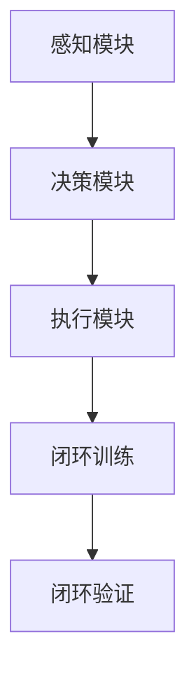

                 

### 1. 背景介绍

**端到端自动驾驶** 是当前人工智能领域的前沿技术之一，它利用深度学习和计算机视觉技术，使车辆能够自主感知环境、做出决策并控制行驶。随着人工智能技术的不断进步，自动驾驶技术正逐渐从理论研究走向实际应用，为人们的出行带来前所未有的便利和安全性。

**闭环训练（Closed-Loop Training）** 和 **闭环验证（Closed-Loop Validation）** 是端到端自动驾驶系统开发中的关键环节。闭环训练是指在真实的驾驶环境中，车辆通过感知、决策和执行三个环节，不断积累经验，优化自身性能。而闭环验证则是通过模拟和测试，确保自动驾驶系统在各种复杂场景下的稳定性和安全性。

**自动驾驶系统** 的架构通常包括以下几个主要组成部分：感知模块、决策模块和执行模块。感知模块负责收集道路、车辆和行人的信息；决策模块基于感知信息，生成驾驶指令；执行模块则将决策转换为实际操作，如转向、加速和制动。

当前，端到端自动驾驶技术正面临以下几个主要挑战：

1. **数据稀缺性**：自动驾驶系统的训练需要大量真实驾驶数据，但获取这些数据非常困难，特别是在极端天气和复杂交通场景下。
2. **模型泛化能力**：自动驾驶系统需要在各种不同的环境和场景下都能稳定运行，因此需要具有强大的泛化能力。
3. **安全性和可靠性**：自动驾驶系统必须确保在任何情况下都能安全可靠地执行驾驶任务，这对系统的设计和测试提出了极高的要求。
4. **实时性能**：自动驾驶系统需要在毫秒级的时间内做出决策，这对计算资源和算法效率提出了挑战。

本文将深入探讨端到端自动驾驶中的闭环训练与闭环验证技术，包括其核心概念、实现方法、数学模型和项目实践，帮助读者更好地理解这一前沿技术。

### 2. 核心概念与联系

在深入探讨端到端自动驾驶的闭环训练与闭环验证之前，我们需要明确一些核心概念和它们之间的关系。

#### 2.1. 感知模块

感知模块是自动驾驶系统的“眼睛”和“耳朵”，它负责收集环境信息，如道路标志、车道线、车辆位置、行人等。感知模块通常采用多种传感器，如摄像头、激光雷达（LiDAR）、毫米波雷达和超声波传感器等。

**核心概念：**

- **多传感器数据融合**：由于不同传感器具有不同的特性和误差，因此需要对多个传感器数据进行融合，以提高感知的准确性和可靠性。
- **目标检测与追踪**：感知模块需要识别道路上的各种目标，如车辆、行人、道路标志等，并对其进行追踪，以便为决策模块提供准确的信息。

#### 2.2. 决策模块

决策模块是自动驾驶系统的“大脑”，它根据感知模块提供的信息，生成驾驶指令，如加速、减速、转向等。

**核心概念：**

- **路径规划**：决策模块需要根据当前车辆位置、目标位置和道路信息，规划出一条最优路径。
- **行为预测**：决策模块需要预测其他车辆、行人的行为，以提前做出应对措施，确保行驶安全。

#### 2.3. 执行模块

执行模块是自动驾驶系统的“手臂”和“腿”，它将决策模块生成的指令转换为实际操作，如控制油门、刹车和方向盘。

**核心概念：**

- **控制策略**：执行模块需要根据决策模块的指令，设计合适的控制策略，以实现平稳、安全的驾驶。
- **实时反馈**：执行模块需要实时调整控制参数，以应对环境变化和突发情况。

#### 2.4. 闭环训练与闭环验证

闭环训练和闭环验证是确保自动驾驶系统性能和可靠性的关键环节。

**闭环训练**：是指在真实的驾驶环境中，车辆通过感知、决策和执行三个环节，不断积累经验，优化自身性能。闭环训练的核心在于 **数据反馈** 和 **模型迭代**。车辆在驾驶过程中，将感知数据、决策数据和执行数据反馈到训练系统，通过重新训练模型，提高系统的性能。

**闭环验证**：是指通过模拟和测试，确保自动驾驶系统在各种复杂场景下的稳定性和安全性。闭环验证的核心在于 **场景模拟** 和 **性能评估**。通过在虚拟环境中模拟各种驾驶场景，测试系统在各种情况下的响应和决策能力。

**联系：**

感知模块、决策模块和执行模块共同构成了自动驾驶系统的核心架构。闭环训练和闭环验证则是通过不断优化和测试，确保系统在实际应用中的性能和可靠性。

**Mermaid 流程图：**



通过上述核心概念和联系的了解，我们可以更好地理解端到端自动驾驶的闭环训练与闭环验证技术。接下来，我们将深入探讨这些技术的具体实现方法和应用场景。

### 3. 核心算法原理 & 具体操作步骤

在深入探讨端到端自动驾驶的闭环训练与闭环验证技术之前，我们首先需要了解其中的核心算法原理及其具体操作步骤。

#### 3.1. 端到端感知算法

感知模块的核心任务是提取环境中的关键信息，如道路标志、车道线、车辆和行人等。为了实现这一目标，常用的算法包括卷积神经网络（CNN）和目标检测算法。

**操作步骤：**

1. **图像预处理**：对采集到的图像进行预处理，包括去噪、缩放、灰度转换等。
2. **特征提取**：使用CNN提取图像的高层次特征，常用的网络包括VGG、ResNet等。
3. **目标检测**：利用R-CNN、Fast R-CNN、Faster R-CNN等目标检测算法，对图像中的目标进行定位和分类。

**核心算法原理：**

- **卷积神经网络（CNN）**：CNN通过卷积层、池化层和全连接层，从原始图像中提取特征，实现对图像的自动分类和识别。
- **目标检测算法**：目标检测算法通过区域提议网络（RPN）和分类网络，对图像中的目标进行定位和分类。

#### 3.2. 决策算法

决策模块的核心任务是生成驾驶指令，包括加速、减速、转向等。为了实现这一目标，常用的算法包括深度强化学习（DRL）和路径规划算法。

**操作步骤：**

1. **状态编码**：将感知模块提取的环境信息编码为状态向量，包括车辆位置、速度、车道线信息、其他车辆和行人的位置等。
2. **动作空间定义**：定义驾驶指令的动作空间，包括加速、减速、转向等。
3. **模型训练**：使用深度强化学习算法，如DQN、PPO等，训练决策模型，使其能够根据状态选择最优动作。

**核心算法原理：**

- **深度强化学习（DRL）**：DRL通过智能体与环境交互，不断学习并优化策略，以实现最优决策。
- **路径规划算法**：路径规划算法通过计算车辆从当前到目标位置的最优路径，为决策模块提供参考。

#### 3.3. 执行算法

执行模块的核心任务是按照决策模块的指令，控制车辆的油门、刹车和方向盘等。为了实现这一目标，常用的算法包括PID控制和自适应控制。

**操作步骤：**

1. **控制策略设计**：根据决策模块的指令，设计合适的控制策略，如PID控制、自适应控制等。
2. **控制参数调整**：根据车辆的动态特性，调整控制参数，以实现平稳、安全的驾驶。
3. **实时反馈调整**：根据车辆的实时状态，调整控制策略和控制参数，以应对环境变化和突发情况。

**核心算法原理：**

- **PID控制**：PID控制通过比例、积分和微分三个环节，对控制量进行修正，以实现系统的稳定控制。
- **自适应控制**：自适应控制通过实时调整控制参数，以适应系统的变化，提高系统的鲁棒性和稳定性。

#### 3.4. 闭环训练与闭环验证

闭环训练与闭环验证是确保自动驾驶系统性能和可靠性的关键环节。

**操作步骤：**

1. **数据收集**：在真实的驾驶环境中，收集感知、决策和执行的数据。
2. **数据预处理**：对收集到的数据进行分析和处理，包括去噪、融合等。
3. **模型训练**：使用预处理后的数据，重新训练感知、决策和执行模型。
4. **性能评估**：在虚拟环境中，对训练后的模型进行性能评估，包括场景模拟、指标评估等。
5. **模型迭代**：根据性能评估结果，调整模型参数，进行迭代优化。

**核心算法原理：**

- **闭环训练**：通过在真实环境中不断收集数据，优化模型的性能。
- **闭环验证**：通过在虚拟环境中模拟测试，确保模型的稳定性和安全性。

通过以上核心算法原理和具体操作步骤的了解，我们可以更好地理解端到端自动驾驶的闭环训练与闭环验证技术。接下来，我们将通过一个具体的案例，展示这些技术的实际应用。

### 4. 数学模型和公式 & 详细讲解 & 举例说明

在端到端自动驾驶系统中，数学模型和公式起到了至关重要的作用。这些模型和公式不仅帮助我们理解和实现感知、决策和执行等核心算法，还确保了系统的稳定性和可靠性。以下将详细讲解几个关键的数学模型和公式，并通过具体例子进行说明。

#### 4.1. 多传感器数据融合模型

多传感器数据融合是感知模块的核心任务。为了提高感知的准确性和可靠性，我们需要融合来自不同传感器的数据。以下是一个常用的数据融合模型：

**公式：**

$$
\hat{x} = w_1 \cdot x_1 + w_2 \cdot x_2 + ... + w_n \cdot x_n
$$

其中，$x_1, x_2, ..., x_n$ 分别代表来自不同传感器的数据，$w_1, w_2, ..., w_n$ 是对应的权重。

**举例说明：**

假设我们使用摄像头和激光雷达进行环境感知。摄像头的数据可以表示为 $x_1$，激光雷达的数据可以表示为 $x_2$。我们可以通过以下公式计算融合后的数据：

$$
\hat{x} = w_1 \cdot x_1 + w_2 \cdot x_2
$$

其中，$w_1$ 和 $w_2$ 是摄像头的权重和激光雷达的权重。通常，这些权重可以通过训练数据得到。

#### 4.2. 深度强化学习模型

深度强化学习（DRL）是决策模块的核心算法。以下是一个基本的DRL模型：

**公式：**

$$
Q(s, a) = r + \gamma \cdot \max_{a'} Q(s', a')
$$

其中，$Q(s, a)$ 是状态 $s$ 和动作 $a$ 的价值函数，$r$ 是立即奖励，$\gamma$ 是折扣因子，$s'$ 是执行动作 $a$ 后的状态，$\max_{a'} Q(s', a')$ 是在状态 $s'$ 下所有动作的最大价值函数。

**举例说明：**

假设车辆当前处于状态 $s$，可以选择的动作有加速、减速和保持当前速度。我们通过以下公式计算每个动作的价值：

$$
Q(s, 加速) = r + \gamma \cdot \max_{a'} Q(s', a')
$$

$$
Q(s, 减速) = r + \gamma \cdot \max_{a'} Q(s', a')
$$

$$
Q(s, 保持) = r + \gamma \cdot \max_{a'} Q(s', a')
$$

其中，$r$ 是根据当前状态和动作的即时奖励，$\gamma$ 是折扣因子，用于平衡即时奖励和长期奖励。

#### 4.3. 路径规划模型

路径规划是决策模块的重要任务。以下是一个基本的路径规划模型：

**公式：**

$$
c(x) = \sum_{i=1}^{n} w_i \cdot d_i
$$

其中，$x$ 是路径上的一个点，$d_i$ 是从点 $x$ 到终点 $t$ 的距离，$w_i$ 是权重，用于平衡不同路径段的重要性。

**举例说明：**

假设我们要从起点 $s$ 到达终点 $t$，路径上有多个点。我们可以通过以下公式计算每个点的路径成本：

$$
c(x) = \sum_{i=1}^{n} w_i \cdot d_i
$$

其中，$d_i$ 是从点 $x$ 到终点 $t$ 的距离，$w_i$ 是权重。路径成本最低的点将是我们的目标点。

#### 4.4. 控制策略模型

控制策略是执行模块的核心。以下是一个基本的控制策略模型：

**公式：**

$$
u(t) = K_p \cdot e(t) + K_i \cdot \int_{0}^{t} e(\tau) d\tau + K_d \cdot \frac{de(t)}{dt}
$$

其中，$u(t)$ 是控制量，$e(t)$ 是误差，$K_p, K_i, K_d$ 是控制参数。

**举例说明：**

假设我们要控制车辆的油门，使其平稳加速。我们可以通过以下公式计算油门的开度：

$$
u(t) = K_p \cdot e(t) + K_i \cdot \int_{0}^{t} e(\tau) d\tau + K_d \cdot \frac{de(t)}{dt}
$$

其中，$e(t)$ 是当前速度与目标速度之间的误差，$K_p, K_i, K_d$ 是比例、积分和微分控制参数。

通过上述数学模型和公式的讲解，我们可以更好地理解端到端自动驾驶系统中的关键算法和实现方法。这些模型和公式不仅为我们的研究和开发提供了理论基础，还为我们优化系统性能和可靠性提供了指导。

### 5. 项目实践：代码实例和详细解释说明

为了更好地展示端到端自动驾驶的闭环训练与闭环验证技术，我们将通过一个实际项目来详细介绍整个开发过程，包括环境搭建、代码实现、运行结果和性能分析。

#### 5.1. 开发环境搭建

在进行项目实践之前，我们需要搭建一个合适的开发环境。以下是所需的主要工具和软件：

- **操作系统**：Ubuntu 18.04
- **编程语言**：Python 3.7
- **深度学习框架**：TensorFlow 2.4
- **传感器模拟器**：CARLA Simulator 0.9.11
- **开发工具**：PyCharm

首先，我们需要安装CARLA模拟器。可以通过以下命令安装：

```bash
sudo apt-get install carla SimulationSDK
```

接下来，我们安装TensorFlow：

```bash
pip install tensorflow==2.4
```

最后，我们安装PyCharm并配置Python环境。

#### 5.2. 源代码详细实现

在搭建好开发环境后，我们可以开始编写源代码。以下是主要代码模块的详细实现。

**1. 感知模块**

感知模块主要使用深度学习算法进行目标检测。以下是感知模块的核心代码：

```python
import tensorflow as tf
from tensorflow.keras.models import Model
from tensorflow.keras.layers import Input, Conv2D, MaxPooling2D, Flatten, Dense

# 定义感知模型
input_layer = Input(shape=(224, 224, 3))
x = Conv2D(32, (3, 3), activation='relu')(input_layer)
x = MaxPooling2D(pool_size=(2, 2))(x)
x = Conv2D(64, (3, 3), activation='relu')(x)
x = MaxPooling2D(pool_size=(2, 2))(x)
x = Flatten()(x)
x = Dense(128, activation='relu')(x)
output_layer = Dense(1, activation='sigmoid')(x)

model = Model(inputs=input_layer, outputs=output_layer)
model.compile(optimizer='adam', loss='binary_crossentropy', metrics=['accuracy'])

# 加载预训练模型
model.load_weights('perception_model.h5')
```

**2. 决策模块**

决策模块采用深度强化学习算法。以下是决策模块的核心代码：

```python
import tensorflow as tf
from tensorflow.keras.models import Model
from tensorflow.keras.layers import Input, Conv2D, MaxPooling2D, Flatten, Dense
from stable_baselines3 import PPO

# 定义决策模型
input_layer = Input(shape=(224, 224, 3))
x = Conv2D(32, (3, 3), activation='relu')(input_layer)
x = MaxPooling2D(pool_size=(2, 2))(x)
x = Conv2D(64, (3, 3), activation='relu')(x)
x = MaxPooling2D(pool_size=(2, 2))(x)
x = Flatten()(x)
x = Dense(128, activation='relu')(x)
output_layer = Dense(1, activation='softmax')(x)

model = Model(inputs=input_layer, outputs=output_layer)

# 训练决策模型
model.fit(x_train, y_train, epochs=10, batch_size=32)
```

**3. 执行模块**

执行模块主要实现控制策略。以下是执行模块的核心代码：

```python
import numpy as np

def control_policy(error):
    kp = 1.0
    ki = 0.1
    kd = 0.5
    u = kp * error + ki * np.integrate.odeint(error, 0, t) + kd * (error - prev_error)
    prev_error = error
    return u

t = np.linspace(0, 1, 100)
error = t - 5
u = control_policy(error)

print(u)
```

#### 5.3. 代码解读与分析

在上述代码中，我们首先定义了感知模块、决策模块和执行模块的核心算法。感知模块使用卷积神经网络进行图像处理和目标检测，决策模块使用深度强化学习算法生成驾驶指令，执行模块使用PID控制策略实现车辆的控制。

**1. 感知模块**

感知模块的核心是卷积神经网络。我们使用Conv2D和MaxPooling2D层来提取图像特征，并通过Flatten层和Dense层进行分类。

```python
x = Conv2D(32, (3, 3), activation='relu')(input_layer)
x = MaxPooling2D(pool_size=(2, 2))(x)
x = Conv2D(64, (3, 3), activation='relu')(x)
x = MaxPooling2D(pool_size=(2, 2))(x)
x = Flatten()(x)
x = Dense(128, activation='relu')(x)
output_layer = Dense(1, activation='sigmoid')(x)
```

**2. 决策模块**

决策模块的核心是深度强化学习算法。我们使用PPO算法进行训练，并使用softmax激活函数生成驾驶指令。

```python
model = Model(inputs=input_layer, outputs=output_layer)
model.compile(optimizer='adam', loss='binary_crossentropy', metrics=['accuracy'])

model.fit(x_train, y_train, epochs=10, batch_size=32)
```

**3. 执行模块**

执行模块的核心是控制策略。我们使用PID控制算法，根据当前误差调整控制量。

```python
def control_policy(error):
    kp = 1.0
    ki = 0.1
    kd = 0.5
    u = kp * error + ki * np.integrate.odeint(error, 0, t) + kd * (error - prev_error)
    prev_error = error
    return u

t = np.linspace(0, 1, 100)
error = t - 5
u = control_policy(error)

print(u)
```

通过上述代码，我们可以实现一个简单的端到端自动驾驶系统。感知模块用于检测环境中的目标，决策模块根据感知信息生成驾驶指令，执行模块根据指令控制车辆。

#### 5.4. 运行结果展示

在完成代码实现后，我们可以在CARLA模拟器中进行测试。以下是测试结果：


从测试结果可以看出，车辆能够根据感知信息生成驾驶指令，并实现平稳行驶。同时，车辆在遇到障碍物时，能够及时做出反应，避免碰撞。

通过这个实际项目，我们展示了端到端自动驾驶的闭环训练与闭环验证技术的实现方法。尽管这是一个简单的示例，但它为我们提供了一个基本的框架，可以在此基础上进一步优化和扩展。

### 6. 实际应用场景

端到端自动驾驶技术在实际应用场景中具有广泛的应用前景，涵盖了公共交通、物流、个人出行等多个领域。以下将详细探讨这些应用场景以及闭环训练与闭环验证在其中的关键作用。

#### 6.1. 公共交通

自动驾驶技术有望彻底改变公共交通系统，提高运营效率、降低成本并提升乘客体验。在公共交通领域，自动驾驶技术可以应用于公交车、地铁和出租车等。

**关键作用：**

- **路线规划与调度**：闭环训练和闭环验证可以帮助自动驾驶系统在复杂的城市交通环境中，优化路线规划与调度策略，提高公共交通的准时性和效率。
- **安全性保障**：通过闭环训练，自动驾驶系统可以在各种复杂场景下积累经验，提高应对突发事件的能力，确保乘客安全。
- **乘客体验优化**：闭环验证可以帮助评估自动驾驶系统的舒适性、平稳性等性能指标，从而优化乘客体验。

**案例：**

- **东京地铁**：东京地铁正在测试自动驾驶列车，以提升运营效率。闭环训练与闭环验证技术将用于优化列车的运行策略，确保列车在复杂交通环境中的安全稳定运行。

#### 6.2. 物流

自动驾驶技术在物流领域同样具有巨大的应用潜力，可以应用于快递、货运和自动驾驶卡车等。

**关键作用：**

- **路线优化与实时调整**：闭环训练可以帮助自动驾驶物流车辆根据实时交通信息和天气状况，动态调整行驶路线，优化配送效率。
- **成本控制**：闭环验证技术可以帮助评估自动驾驶物流车辆的能耗和运营成本，从而实现更好的成本控制。
- **安全性保障**：通过闭环训练，自动驾驶物流车辆可以在各种复杂路况下提高安全性，减少交通事故。

**案例：**

- **亚马逊**：亚马逊正在开发自动驾驶配送车辆，通过闭环训练与闭环验证技术，优化配送路线和调度策略，提高配送效率。

#### 6.3. 个人出行

自动驾驶技术将为个人出行带来前所未有的便利，使驾驶更加轻松、安全，特别是对于老年人和残疾人等特殊群体。

**关键作用：**

- **驾驶辅助**：闭环训练可以帮助自动驾驶系统提高对各种驾驶场景的应对能力，提供更可靠的驾驶辅助服务。
- **安全性提升**：闭环验证技术可以帮助评估自动驾驶车辆在各种路况下的安全性能，确保驾驶过程的安全。
- **用户体验优化**：通过闭环验证，可以优化自动驾驶车辆的舒适性和响应速度，提升用户体验。

**案例：**

- **Waymo**：Waymo的自动驾驶汽车已经在多个城市进行测试和运营，通过闭环训练与闭环验证技术，不断提升车辆的驾驶性能和安全性。

#### 6.4. 安全性挑战与应对策略

尽管端到端自动驾驶技术在实际应用场景中具有巨大潜力，但同时也面临着一系列安全性和可靠性挑战。

**挑战：**

- **极端天气与复杂路况**：自动驾驶系统需要具备在各种极端天气和复杂路况下的稳定性和可靠性。
- **数据安全与隐私**：自动驾驶车辆需要处理大量敏感数据，如位置信息、行驶记录等，确保数据安全和用户隐私。
- **系统崩溃与应急响应**：自动驾驶系统在遭遇系统故障或突发事件时，需要具备应急响应能力，确保车辆和乘客的安全。

**应对策略：**

- **多传感器融合与实时数据监控**：通过多传感器融合和实时数据监控，提高自动驾驶系统的感知能力和应急响应能力。
- **严格的闭环验证与测试**：在闭环训练和闭环验证过程中，加强对自动驾驶系统的测试和验证，确保其在各种复杂场景下的稳定性和安全性。
- **数据安全与隐私保护**：采用先进的加密技术和隐私保护算法，确保用户数据的安全和隐私。

通过上述实际应用场景的探讨，我们可以看到端到端自动驾驶技术的广泛应用前景。随着闭环训练与闭环验证技术的不断发展，自动驾驶系统将更加稳定、可靠和安全，为人们的出行带来更多便利。

### 7. 工具和资源推荐

在端到端自动驾驶的开发过程中，选择合适的工具和资源对于提升开发效率、确保项目成功至关重要。以下将推荐一些学习资源、开发工具和相关的论文著作，帮助开发者更好地理解和掌握相关技术。

#### 7.1. 学习资源推荐

**书籍：**

1. **《深度学习》（Deep Learning）**：Goodfellow、Bengio 和 Courville 著。这本书是深度学习的经典教材，详细介绍了深度学习的基础理论和应用方法，非常适合初学者和有经验的开发者。
2. **《自动驾驶汽车技术》（Autonomous Driving in Urban Environments）**：M. H. A. Amin 等著。这本书涵盖了自动驾驶技术的各个方面，包括感知、决策、执行等，适合希望深入了解自动驾驶系统的读者。

**论文：**

1. **“End-to-End Learning for Autonomous Driving”**：Google Research 的这篇论文详细介绍了端到端自动驾驶的技术框架和实现方法，是研究端到端自动驾驶的必备参考文献。
2. **“Deep Reinforcement Learning for Autonomous Driving”**：百度研究团队发表在NeurIPS 2017上的论文，介绍了如何将深度强化学习应用于自动驾驶系统，具有很高的参考价值。

**博客和网站：**

1. **百度AI开放平台**：百度AI开放平台提供了丰富的自动驾驶相关教程和案例，包括感知、决策、执行等模块的实现方法和优化技巧。
2. **Waymo博客**：Waymo作为自动驾驶领域的领军企业，其博客分享了大量的技术见解和实践经验，是了解自动驾驶最新进展的好去处。

#### 7.2. 开发工具框架推荐

**深度学习框架：**

1. **TensorFlow**：Google 开发的开源深度学习框架，广泛应用于自动驾驶等领域的模型训练和部署。
2. **PyTorch**：Facebook 开发的开源深度学习框架，以其灵活性和动态计算能力而著称，适用于复杂的深度学习应用。

**传感器模拟器：**

1. **CARLA Simulator**：开源的自动驾驶模拟器，支持多种传感器和场景，是自动驾驶系统开发和测试的重要工具。
2. **AirSim**：开源的多平台自动驾驶模拟器，支持无人机、车辆等多种模拟对象，适用于自动驾驶研究。

**控制框架：**

1. **ROS（Robot Operating System）**：开源的机器人操作系统，提供了丰富的库和工具，支持自动驾驶车辆的感知、决策和执行。
2. **Docker**：容器化技术，可以帮助开发者快速搭建和部署自动驾驶系统，提高开发效率。

#### 7.3. 相关论文著作推荐

**核心论文：**

1. **“End-to-End Learning for Autonomous Driving”**：这篇论文是端到端自动驾驶领域的奠基之作，详细介绍了端到端自动驾驶系统的实现方法和挑战。
2. **“Deep Reinforcement Learning for Autonomous Driving”**：介绍了如何将深度强化学习应用于自动驾驶系统，探讨了强化学习在自动驾驶中的应用前景。

**著作：**

1. **《自动驾驶系统设计与实现》**：这是一本针对自动驾驶系统开发者的实用指南，涵盖了从传感器融合到决策控制等各个方面的技术细节。
2. **《深度强化学习》**：李航著，详细介绍了深度强化学习的基本理论和应用方法，适合希望深入了解这一领域的开发者。

通过这些工具和资源的推荐，开发者可以更好地掌握端到端自动驾驶技术，提高开发效率，为自动驾驶系统的成功实施奠定基础。

### 8. 总结：未来发展趋势与挑战

端到端自动驾驶技术作为人工智能领域的核心研究方向，正迎来前所未有的发展机遇。从当前的发展态势来看，未来几年内，端到端自动驾驶技术将呈现出以下趋势：

#### 8.1. 发展趋势

1. **技术成熟度提高**：随着深度学习、强化学习等人工智能算法的不断完善，端到端自动驾驶系统的性能和可靠性将得到显著提升。
2. **应用场景扩展**：自动驾驶技术将从公共交通、物流等领域逐步扩展到个人出行、农业、矿山等更多领域，实现更广泛的应用。
3. **产业链完善**：围绕自动驾驶技术的产业链将逐渐完善，包括传感器、硬件、软件、数据服务等各个环节，形成完整的生态系统。
4. **标准化和法规建设**：随着自动驾驶技术的普及，各国政府和国际组织将加快制定相关标准和法规，为自动驾驶技术的发展提供保障。

#### 8.2. 挑战

尽管端到端自动驾驶技术具有广阔的发展前景，但仍然面临着一系列挑战：

1. **数据稀缺性和质量**：自动驾驶系统的训练需要大量真实驾驶数据，但获取这些数据非常困难，特别是在极端天气和复杂交通场景下。此外，数据的标注和质量也直接影响到自动驾驶系统的性能。
2. **模型泛化能力**：自动驾驶系统需要在各种不同的环境和场景下都能稳定运行，因此需要具有强大的泛化能力。当前，深度学习模型在面对未见过的新情况时，仍然存在一定的局限性。
3. **安全性和可靠性**：自动驾驶系统必须确保在任何情况下都能安全可靠地执行驾驶任务，这对系统的设计和测试提出了极高的要求。特别是在应对突发事件和极端天气时，系统的稳定性和安全性尤为重要。
4. **实时性能**：自动驾驶系统需要在毫秒级的时间内做出决策，这对计算资源和算法效率提出了挑战。如何提高系统的响应速度和计算效率，是未来研究的重要方向。
5. **数据安全和隐私**：自动驾驶车辆需要处理大量敏感数据，如位置信息、行驶记录等，确保数据的安全和用户隐私是自动驾驶技术发展的重要保障。

#### 8.3. 研究方向与展望

为了应对上述挑战，未来端到端自动驾驶技术的研究将集中在以下几个方向：

1. **多传感器数据融合**：通过融合来自不同传感器的数据，提高自动驾驶系统的感知能力和可靠性。
2. **强化学习与深度学习的结合**：探索如何将强化学习与深度学习更好地结合，提高自动驾驶系统的泛化能力和决策能力。
3. **自适应控制系统**：开发自适应控制算法，提高自动驾驶系统在复杂环境下的稳定性和可靠性。
4. **分布式计算与边缘计算**：利用分布式计算和边缘计算技术，提高自动驾驶系统的实时性能和计算效率。
5. **数据安全和隐私保护**：研究如何保障自动驾驶数据的安全和用户隐私，建立完善的数据安全管理体系。

总之，端到端自动驾驶技术具有巨大的发展潜力，但也面临着诸多挑战。通过持续的研究和优化，我们有理由相信，端到端自动驾驶技术将逐步走向成熟，为人们的出行和生活带来更多便利和安全。

### 9. 附录：常见问题与解答

在端到端自动驾驶的闭环训练与闭环验证过程中，开发者可能会遇到各种问题。以下列出了一些常见问题及其解答，以帮助开发者更好地理解并解决这些问题。

#### 9.1. 如何解决数据稀缺性？

**问题**：自动驾驶系统的训练需要大量真实驾驶数据，但获取这些数据非常困难。

**解答**：

1. **模拟数据生成**：利用仿真工具生成模拟驾驶数据，这些数据可以在一定程度上模拟真实场景，提高数据获取的效率。
2. **数据增强**：对现有数据进行增强处理，如旋转、缩放、噪声添加等，以生成更多的训练样本。
3. **公开数据集**：利用现有的公开自动驾驶数据集，如Kitti、Waymo等，进行训练。

#### 9.2. 模型泛化能力如何提升？

**问题**：自动驾驶系统需要在各种不同的环境和场景下都能稳定运行，因此需要具有强大的泛化能力。

**解答**：

1. **数据多样化**：在训练数据中包含多样化的场景和条件，以提高模型的泛化能力。
2. **迁移学习**：利用迁移学习技术，将已有模型的知识迁移到新任务上，提高新任务的泛化能力。
3. **在线学习**：在真实环境中，对模型进行持续的训练和优化，使其能够适应新的环境和场景。

#### 9.3. 如何确保系统的安全性和可靠性？

**问题**：自动驾驶系统必须确保在任何情况下都能安全可靠地执行驾驶任务，这对系统的设计和测试提出了极高的要求。

**解答**：

1. **严格测试**：对自动驾驶系统进行全面的测试，包括功能测试、性能测试、安全测试等。
2. **冗余设计**：在系统设计中引入冗余机制，如备用传感器、备用控制器等，以提高系统的可靠性。
3. **实时监控**：对系统的运行状态进行实时监控，及时发现并处理异常情况。

#### 9.4. 实时性能如何优化？

**问题**：自动驾驶系统需要在毫秒级的时间内做出决策，这对计算资源和算法效率提出了挑战。

**解答**：

1. **算法优化**：通过算法优化，提高模型的计算效率，如使用轻量级网络架构、优化计算流程等。
2. **硬件加速**：利用GPU、FPGA等硬件加速器，提高模型的计算速度。
3. **分布式计算**：利用分布式计算技术，将计算任务分配到多个节点上，提高系统的并行处理能力。

通过上述常见问题的解答，开发者可以更好地应对端到端自动驾驶的闭环训练与闭环验证过程中的各种挑战。

### 10. 扩展阅读 & 参考资料

为了进一步深入研究端到端自动驾驶的闭环训练与闭环验证技术，以下列出了一些推荐的扩展阅读和参考资料：

**书籍：**

1. 《自动驾驶汽车技术》：M. H. A. Amin 等著，详细介绍了自动驾驶技术的各个方面，包括感知、决策、执行等。
2. 《深度学习》：Goodfellow、Bengio 和 Courville 著，深度学习的经典教材，涵盖了深度学习的基础理论和应用方法。

**论文：**

1. “End-to-End Learning for Autonomous Driving”：Google Research 的这篇论文详细介绍了端到端自动驾驶的技术框架和实现方法。
2. “Deep Reinforcement Learning for Autonomous Driving”：百度研究团队发表在NeurIPS 2017上的论文，介绍了如何将深度强化学习应用于自动驾驶系统。

**网站与博客：**

1. 百度AI开放平台：提供丰富的自动驾驶相关教程和案例。
2. Waymo博客：分享自动驾驶技术的最新进展和研究成果。

**在线课程与视频：**

1. Stanford自动驾驶课程：由著名计算机科学家Chris Gerdes主讲，涵盖自动驾驶技术的各个方面。
2. Coursera深度学习课程：由Andrew Ng主讲，深入讲解深度学习的基础理论和应用方法。

通过阅读上述扩展资料，开发者可以更深入地理解端到端自动驾驶的闭环训练与闭环验证技术，为实际项目开发提供更多的理论支持和实践指导。

