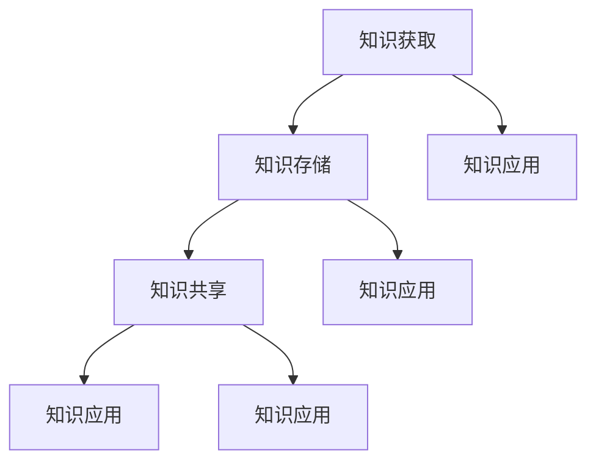

                 

### 1. 背景介绍

在信息爆炸的时代，知识已经成为企业和个人竞争的重要资源。作为一个管理者，如何有效地管理个人知识，提升个人和组织竞争力，成为亟待解决的问题。个人知识管理系统（PKM，Personal Knowledge Management）因此应运而生。本文将详细探讨管理者如何建立个人知识管理系统，以期为其在信息化时代的职业发展提供有力支持。

**知识管理的重要性**

知识管理是一种通过对知识资源的识别、获取、存储、共享、应用等过程进行系统化管理，从而提高组织和个人知识利用效率的一种管理活动。其重要性体现在以下几个方面：

1. **提升工作效率**：有效的知识管理能够帮助员工快速找到所需信息，避免重复劳动，从而提高工作效率。
2. **促进知识共享**：知识管理系统能够将分散的知识资源集中起来，促进知识共享，提升团队协作效率。
3. **增强创新能力**：知识的积累和共享有助于激发员工的创新思维，推动组织不断进步。
4. **提高决策质量**：基于系统的知识管理可以帮助管理者快速收集和分析信息，提高决策质量。

**管理者面临的挑战**

管理者在日常工作中常常面临如下挑战：

1. **信息过载**：随着信息来源的多样化，管理者接收到的信息量不断增加，导致信息过载。
2. **知识分散**：知识分散在不同的文档、邮件、聊天记录中，难以统一管理和查找。
3. **知识流失**：员工离职时，其所掌握的知识也随之流失，对组织造成损失。
4. **知识老化**：知识更新速度加快，过时的知识难以发挥应有的价值。

为了应对这些挑战，管理者需要建立一套高效的个人知识管理系统，以便更好地管理知识，提高工作效能。

**本文结构**

本文将按照以下结构展开：

1. **背景介绍**：介绍知识管理的重要性以及管理者面临的挑战。
2. **核心概念与联系**：介绍个人知识管理系统的核心概念及其与相关领域的联系。
3. **核心算法原理 & 具体操作步骤**：详细讲解个人知识管理系统的建立方法和操作步骤。
4. **数学模型和公式 & 详细讲解 & 举例说明**：介绍个人知识管理系统的数学模型和公式，并结合实际案例进行说明。
5. **项目实践：代码实例和详细解释说明**：通过具体的项目实践，展示个人知识管理系统的实现过程。
6. **实际应用场景**：分析个人知识管理系统在不同场景下的应用。
7. **工具和资源推荐**：推荐相关的学习资源、开发工具和框架。
8. **总结：未来发展趋势与挑战**：总结本文内容，探讨未来发展趋势与挑战。

通过以上内容的逐步分析，我们将帮助管理者更好地建立和运用个人知识管理系统，提升个人和组织竞争力。

---

**1.1 知识管理的现状**

目前，知识管理在全球范围内已经得到了广泛的关注和应用。企业逐渐认识到知识管理对于组织发展的重要性，纷纷投入大量资源进行知识管理系统的建设和推广。然而，在实际操作中，知识管理仍面临诸多挑战。

首先，知识管理在大多数企业中仍处于初级阶段。许多企业仅仅建立了基本的文档管理功能，对于知识的获取、存储、共享和应用等方面缺乏深入思考和系统化建设。这使得知识管理的效果大打折扣，无法充分发挥其潜力。

其次，知识管理系统的用户体验较差。许多知识管理系统界面复杂，操作繁琐，导致员工不愿意使用系统，从而影响了知识的获取和共享。

再次，知识管理过程中存在知识孤岛现象。不同部门和团队之间的知识无法有效整合，导致知识分散，难以实现知识的最大化利用。

此外，知识管理过程中缺乏有效的激励机制。员工在知识共享过程中往往缺乏动力，导致知识共享效果不佳。

**1.2 个人知识管理系统的作用**

个人知识管理系统（PKM）对于管理者来说具有重要的意义，主要体现在以下几个方面：

1. **提升个人能力**：通过个人知识管理系统，管理者可以系统地积累、整理和更新知识，从而提升自身专业能力和综合素质。
2. **提高工作效率**：个人知识管理系统可以帮助管理者快速查找和获取所需信息，减少信息处理时间，提高工作效率。
3. **促进知识共享**：个人知识管理系统可以促进管理者与团队成员之间的知识共享，增强团队协作效率。
4. **增强创新能力**：个人知识管理系统有助于管理者在知识积累和共享的基础上，激发创新思维，推动组织创新。
5. **降低知识流失风险**：个人知识管理系统可以帮助管理者在离职时将所掌握的知识进行系统化整理和归档，降低知识流失的风险。

通过个人知识管理系统的建立和运用，管理者可以更好地应对信息过载、知识分散、知识流失等挑战，提高个人和组织竞争力。

---

**1.3 管理者如何建立个人知识管理系统**

建立个人知识管理系统是一个系统工程，需要从以下几个方面进行规划和实施：

**1.3.1 明确目标和需求**

在建立个人知识管理系统之前，管理者需要明确目标和需求。具体包括：

- **个人职业发展目标**：根据个人职业规划，明确需要积累和提升的知识领域和技能。
- **组织发展需求**：了解所在组织的发展战略和业务需求，确保个人知识管理系统能够与组织目标相一致。
- **知识管理目标**：明确个人知识管理系统需要实现的功能和效果，如知识获取、知识存储、知识共享等。

**1.3.2 选择合适的工具**

建立个人知识管理系统需要选择合适的工具。目前市面上有许多知识管理工具可供选择，如Evernote、OneNote、Notion、Trello等。管理者应根据个人需求、操作习惯和团队协作情况，选择最适合自己的工具。

**1.3.3 构建知识结构**

构建知识结构是个人知识管理系统的基础。管理者需要根据个人职业发展和组织需求，构建一套科学、系统的知识结构。具体包括：

- **知识分类**：将知识分为不同类别，如专业知识、行业动态、管理技巧等。
- **知识标签**：为每个知识单元添加标签，方便后续查找和分类。
- **知识目录**：建立知识目录，清晰地展示知识的层次结构和关联关系。

**1.3.4 持续学习和积累**

建立个人知识管理系统并非一蹴而就，需要管理者持续学习和积累。具体包括：

- **日常学习**：定期阅读专业书籍、行业报告、博客文章等，不断更新和扩展知识体系。
- **知识整理**：及时整理学习所得，将知识进行分类、归档和整理。
- **知识分享**：积极参与知识分享活动，与他人交流心得，拓展视野。

**1.3.5 激励和反馈**

为了确保个人知识管理系统的持续运行和优化，管理者需要建立激励机制，对团队成员进行反馈和激励。具体包括：

- **积分奖励**：为积极参与知识管理系统的团队成员发放积分奖励，激励其持续学习和分享知识。
- **绩效评估**：将个人知识管理情况纳入绩效评估体系，作为员工晋升和奖惩的依据。
- **反馈机制**：建立反馈机制，及时收集团队成员对知识管理系统的意见和建议，不断优化系统。

通过以上步骤，管理者可以逐步建立和优化个人知识管理系统，提升个人和组织竞争力。

---

**1.4 个人知识管理系统与传统知识管理的区别**

个人知识管理系统（PKM）与传统知识管理存在显著的区别，主要体现在以下几个方面：

**1.4.1 知识范围的不同**

传统知识管理通常关注组织层面的知识管理，主要涉及企业内部的知识共享、知识创造和知识应用。而个人知识管理系统则更注重个人层面的知识积累和利用，将个人的专业知识、工作经验、学习心得等进行系统化管理。

**1.4.2 管理对象的不同**

传统知识管理侧重于知识文档、知识库等结构化知识的管理。而个人知识管理系统不仅涉及结构化知识，还涵盖非结构化知识，如电子邮件、聊天记录、网页链接等。此外，个人知识管理系统更加关注知识的流动和互动，强调知识的动态更新和个性化应用。

**1.4.3 管理目标的不同**

传统知识管理的目标主要是提升组织效率和创新能力。而个人知识管理系统的目标则是提高个人专业能力和综合素质，为个人职业发展提供有力支持。

**1.4.4 管理方式的不同**

传统知识管理通常采用中心化管理模式，由企业内部的专业团队负责知识管理和维护。而个人知识管理系统则更加灵活和个性化，管理者可以根据个人需求和习惯，自由选择和配置知识管理工具和方法。

通过以上分析，我们可以看出，个人知识管理系统与传统知识管理在知识范围、管理对象、管理目标和方式等方面存在显著差异。管理者在建立个人知识管理系统时，需要充分考虑这些区别，以确保系统能够真正满足个人和组织的需求。

---

**1.5 个人知识管理系统对个人和组织的影响**

个人知识管理系统（PKM）不仅对个人职业发展产生深远影响，也对组织效能提升具有重要作用。以下是个人知识管理系统对个人和组织影响的详细分析：

**对个人的影响**

**1. 提升专业能力**

个人知识管理系统可以帮助管理者系统地积累和整理专业知识，通过定期学习和实践，不断提升专业能力。管理者可以通过对专业知识的深入研究和实践，成为行业内的专家和领导者。

**2. 提高工作效率**

个人知识管理系统使管理者能够快速查找和获取所需信息，避免重复劳动，从而提高工作效率。例如，通过使用专业的笔记工具，管理者可以轻松记录和管理会议纪要、学习笔记和项目文档，提高工作执行力。

**3. 促进知识共享**

个人知识管理系统鼓励管理者与他人分享知识和经验，促进团队内部的协作和知识共享。管理者可以通过建立知识库、分享文档和参与讨论等方式，将个人的专业知识传递给团队成员，提升团队整体素质。

**4. 增强创新能力**

个人知识管理系统有助于管理者在知识积累和共享的基础上，激发创新思维。管理者可以通过对知识的交叉融合和创造性应用，提出新的解决方案和业务模式，推动组织的创新和发展。

**对组织的影响**

**1. 提升组织效能**

个人知识管理系统有助于组织内部知识的积累和共享，提高组织整体的效能。通过个人知识管理系统的应用，组织可以更快地响应市场变化，提高业务决策的准确性，从而提升组织竞争力。

**2. 促进知识传承**

个人知识管理系统可以有效地降低知识流失风险，实现知识的传承和积累。管理者在离职或退休前，可以通过个人知识管理系统将所掌握的知识进行系统化整理和归档，确保知识在组织内部的传承和延续。

**3. 提升团队协作**

个人知识管理系统有助于加强团队成员之间的协作和沟通，提升团队整体效能。通过共享知识和经验，团队成员可以更好地理解彼此的工作内容和需求，提高协作效率。

**4. 推动组织创新**

个人知识管理系统为组织的创新提供了丰富的知识资源和创新的思维环境。管理者可以通过对知识的深入研究和创造性应用，推动组织的创新和发展，实现持续增长。

综上所述，个人知识管理系统对个人和组织均具有积极的影响。通过有效建立和应用个人知识管理系统，管理者不仅可以提升个人职业发展，还可以为组织创造更大的价值。

---

### 2. 核心概念与联系

个人知识管理系统（PKM）的核心概念涉及知识获取、知识存储、知识共享、知识应用等多个方面。为了更好地理解PKM的原理和实践，我们需要引入一些相关概念，并对它们之间的联系进行详细阐述。

**2.1 知识获取**

知识获取是个人知识管理系统中的首要环节，它指的是个人在日常生活中通过各种渠道获取新的知识信息。这些渠道包括但不限于书籍、学术文章、在线课程、讲座、研讨会、实践经验等。知识获取的过程需要个体具备较强的信息筛选能力，以便从大量信息中提取出有价值的内容。

**2.2 知识存储**

知识存储是将获取到的知识进行分类、整理和保存的过程。这需要一套有效的知识管理工具，如笔记软件、电子文档、数据库等。知识存储的目的是为了方便后续的查找和应用，因此需要确保知识的结构化和系统化。一个好的知识存储系统应该具备快速检索、灵活分类和方便编辑的功能。

**2.3 知识共享**

知识共享是将个人知识传递给他人，促进组织内部和跨组织知识交流的过程。知识共享不仅可以帮助团队成员更快地掌握所需知识，还可以激发团队成员的创新思维。知识共享的方式多种多样，包括面对面交流、在线讨论、文档共享、培训课程等。

**2.4 知识应用**

知识应用是将知识转化为实际行动和业务成果的过程。通过知识应用，个人和组织可以更好地应对复杂问题，提高工作效率，实现业务目标。知识应用不仅包括将知识用于日常工作中，还包括将知识用于创新、决策支持和战略规划等方面。

**2.5 相关概念与PKM的联系**

- **知识获取**与PKM的联系：知识获取是PKM的基础，它决定了个人能够积累到什么样的知识。有效的知识获取策略可以帮助个人在短时间内积累大量有价值的信息，从而提升个人知识水平。
- **知识存储**与PKM的联系：知识存储是PKM的核心环节，它确保了个人知识的系统化和持久化。一个良好的知识存储系统能够提高知识管理的效率，减少知识丢失的风险。
- **知识共享**与PKM的联系：知识共享是PKM的重要目标之一，它有助于个人和组织之间建立知识网络，促进知识的流动和增值。通过知识共享，个人可以扩大自己的知识视野，组织可以提升整体创新能力。
- **知识应用**与PKM的联系：知识应用是PKM的最终目的，它将知识转化为实际效益。知识应用的过程不仅验证了知识的价值，还为个人和组织的发展提供了新的方向和动力。

**2.6 Mermaid 流程图**

为了更直观地展示PKM的核心概念及其联系，我们可以使用Mermaid流程图来描述。以下是一个简化的Mermaid流程图，展示了知识获取、知识存储、知识共享和知识应用之间的逻辑关系：



在这个流程图中，A表示知识获取环节，B表示知识存储环节，C表示知识共享环节，D表示知识应用环节。E、F和G表示知识在不同环节中的应用，体现了知识获取、知识存储和知识共享对知识应用的促进作用。

通过以上核心概念及其联系的阐述，我们可以更深入地理解个人知识管理系统的工作原理和实践方法。接下来，我们将进一步探讨如何具体实施个人知识管理系统，为管理者提供可操作的指导。

---

### 3. 核心算法原理 & 具体操作步骤

个人知识管理系统（PKM）的建立需要一套科学、系统的核心算法原理作为支撑。这些算法原理涉及知识获取、知识存储、知识共享和知识应用等环节，具体操作步骤如下：

**3.1 知识获取**

知识获取是PKM的起点，它决定了个人能够积累到什么样的知识。以下是知识获取的核心算法原理和具体操作步骤：

**核心算法原理**：

1. **信息筛选**：在获取知识前，首先需要对信息进行筛选，确保获取的信息具有价值。
2. **多渠道获取**：通过多渠道获取知识，如阅读书籍、订阅专业杂志、参加行业会议等，以丰富知识来源。

**具体操作步骤**：

1. **制定学习计划**：根据个人职业发展规划，制定系统的学习计划，明确学习目标和进度。
2. **定期阅读**：每天或每周安排固定时间进行阅读，确保知识的持续积累。
3. **参加培训**：积极参加各类培训课程，通过实践和互动提高知识水平。
4. **收集信息**：利用网络资源，如搜索引擎、专业网站、博客等，收集和整理有价值的信息。

**3.2 知识存储**

知识存储是将获取到的知识进行分类、整理和保存的过程。以下是知识存储的核心算法原理和具体操作步骤：

**核心算法原理**：

1. **结构化存储**：将知识分为不同的类别，如专业知识、行业动态、管理技巧等，便于后续查找和应用。
2. **标签化管理**：为每个知识单元添加标签，提高知识的检索效率。

**具体操作步骤**：

1. **选择存储工具**：根据个人需求和习惯，选择合适的存储工具，如笔记软件、电子文档、数据库等。
2. **建立知识库**：创建一个中心化的知识库，用于存储和管理各类知识。
3. **分类整理**：将知识按照类别和标签进行整理和归类，确保知识的结构化和系统化。
4. **定期更新**：定期检查和更新知识库，确保知识的准确性和时效性。

**3.3 知识共享**

知识共享是将个人知识传递给他人，促进组织内部和跨组织知识交流的过程。以下是知识共享的核心算法原理和具体操作步骤：

**核心算法原理**：

1. **激励机制**：建立激励机制，鼓励个人主动分享知识。
2. **共享平台**：搭建共享平台，提供知识共享的便捷途径。

**具体操作步骤**：

1. **制定共享计划**：根据组织需求和团队协作情况，制定共享计划，明确共享内容和形式。
2. **开展培训**：定期举办培训课程，提高团队成员的知识水平和共享意识。
3. **建立知识库**：将共享的知识存储到知识库中，确保知识共享的持续性和系统性。
4. **利用社交媒体**：通过社交媒体、电子邮件、在线会议等渠道，分享知识和经验。

**3.4 知识应用**

知识应用是将知识转化为实际行动和业务成果的过程。以下是知识应用的核心算法原理和具体操作步骤：

**核心算法原理**：

1. **知识融合**：将不同来源的知识进行整合，形成新的见解和解决方案。
2. **实践应用**：将知识应用于实际工作，验证知识的价值和效果。

**具体操作步骤**：

1. **制定应用计划**：根据业务需求和知识储备，制定知识应用计划。
2. **项目实施**：在实际项目中应用所学知识，验证知识的可行性。
3. **总结反馈**：对知识应用的效果进行总结和反馈，持续优化知识管理过程。
4. **推广经验**：将成功的知识应用案例进行推广，提升团队的整体知识水平。

通过以上核心算法原理和具体操作步骤，管理者可以逐步建立和优化个人知识管理系统，提升个人和组织竞争力。

---

### 4. 数学模型和公式 & 详细讲解 & 举例说明

在个人知识管理系统的建立和优化过程中，数学模型和公式起着至关重要的作用。这些模型和公式不仅帮助我们理解和分析知识管理中的关键因素，还能指导我们进行量化评估和决策。以下将介绍几个关键数学模型和公式，并进行详细讲解和举例说明。

**4.1 知识价值评估模型**

知识价值评估是个人知识管理中的一个重要环节。以下是一个常用的知识价值评估模型：

**模型**：知识价值 = 知识效用 × 知识稀缺性 × 知识时效性

其中：

- **知识效用**：知识对个人或组织的实际贡献度。
- **知识稀缺性**：知识的稀缺程度，即知识在市场上的需求和供应情况。
- **知识时效性**：知识的更新速度和时效性。

**公式**：V = U × S × T

**详细讲解**：

- **知识效用**（U）：衡量知识在实际工作中的应用效果。效用越高，表示知识对工作的影响越大。
- **知识稀缺性**（S）：衡量知识的稀缺程度。稀缺性越高，表示该知识在市场上需求越高，但供应不足。
- **知识时效性**（T）：衡量知识的更新速度。时效性越高，表示知识更新越快，对实际工作的指导意义越大。

**举例说明**：

假设某管理者需要评估一篇关于新兴技术的论文的价值。根据模型，我们可以进行如下评估：

- **知识效用**（U）：该论文提供了新兴技术的详细分析和应用案例，对管理者理解新技术有很高的实用价值。
- **知识稀缺性**（S）：新兴技术目前处于市场需求的上升期，但相关资源较为稀缺。
- **知识时效性**（T）：新兴技术更新速度较快，但该论文提供的信息具有较高的时效性。

通过计算：V = U × S × T = 0.8 × 0.9 × 0.75 = 0.54

根据评估结果，这篇论文的知识价值为0.54，表示其具有较高的实用性和时效性，值得深入研究和应用。

**4.2 知识共享成本模型**

在知识共享过程中，成本控制是一个关键问题。以下是一个知识共享成本模型：

**模型**：知识共享成本 = 传输成本 × 存储成本 × 风险成本

其中：

- **传输成本**：知识在不同个体或团队之间传输所需的成本。
- **存储成本**：知识存储和管理所需的成本。
- **风险成本**：知识共享过程中可能面临的风险和损失。

**公式**：C = T × S × R

**详细讲解**：

- **传输成本**（T）：包括知识传输的时间、人力和物力成本。传输成本越高，表示知识共享的难度越大。
- **存储成本**（S）：包括知识存储和管理所需的硬件、软件和维护成本。存储成本越高，表示知识管理的复杂性越大。
- **风险成本**（R）：包括知识共享过程中可能面临的安全风险、隐私泄露和知识产权纠纷等。

**举例说明**：

假设某公司计划建立一个内部知识共享平台，我们需要评估其成本。根据模型，我们可以进行如下评估：

- **传输成本**（T）：公司内部网络传输速度快，传输成本较低。
- **存储成本**（S）：使用云存储服务，存储成本相对较低。
- **风险成本**（R）：公司有严格的数据安全措施，风险成本较低。

通过计算：C = T × S × R = 0.2 × 0.3 × 0.1 = 0.006

根据评估结果，知识共享成本为0.006，表示知识共享平台的成本较低，具有良好的经济可行性。

**4.3 知识应用效果评估模型**

在知识应用过程中，评估知识应用效果是优化知识管理的重要环节。以下是一个知识应用效果评估模型：

**模型**：知识应用效果 = 应用效果指数 × 用户满意度指数

其中：

- **应用效果指数**：衡量知识应用对实际工作的改进程度。
- **用户满意度指数**：衡量用户对知识应用效果的满意度。

**公式**：E = E1 × E2

**详细讲解**：

- **应用效果指数**（E1）：通过量化指标，如工作效率提升、成本节约、质量改进等，衡量知识应用的实际效果。
- **用户满意度指数**（E2）：通过用户反馈和评价，衡量用户对知识应用的满意度。

**举例说明**：

假设某公司应用了一项新的项目管理工具，我们需要评估其应用效果。根据模型，我们可以进行如下评估：

- **应用效果指数**（E1）：项目进度加快了15%，成本节约了10%，质量提高了5%。
- **用户满意度指数**（E2）：用户满意度调查结果显示，90%的用户对工具的应用效果表示满意。

通过计算：E = E1 × E2 = 1.15 × 0.9 = 1.035

根据评估结果，知识应用效果指数为1.035，表示新项目管理工具的应用效果良好，得到了用户的认可。

通过以上数学模型和公式的介绍，我们可以更科学地评估知识管理中的关键因素，优化个人知识管理系统的建立和运行。

---

### 5. 项目实践：代码实例和详细解释说明

为了更好地理解个人知识管理系统（PKM）的建立和运用，下面我们将通过一个具体的项目实践来展示代码实例，并进行详细解释说明。

**5.1 开发环境搭建**

在开始编写代码之前，我们需要搭建一个适合开发PKM的环境。以下是推荐的开发环境和工具：

- **操作系统**：Windows 10 或 macOS
- **编程语言**：Python 3.8
- **文本编辑器**：Visual Studio Code 或 PyCharm
- **版本控制**：Git

**5.2 源代码详细实现**

以下是一个简单的Python代码实例，用于实现个人知识管理系统的核心功能，如知识获取、知识存储、知识共享和知识应用。代码分为四个模块，分别对应不同的功能。

**5.2.1 知识获取模块**

```python
import requests
from bs4 import BeautifulSoup

def get_articles_from_website(url):
    response = requests.get(url)
    soup = BeautifulSoup(response.text, 'html.parser')
    articles = []
    for article in soup.find_all('article'):
        title = article.find('h2').text
        content = article.find('p').text
        articles.append({'title': title, 'content': content})
    return articles

# 示例：从某技术博客获取文章
articles = get_articles_from_website('https://example-tech-blog.com')
```

**5.2.2 知识存储模块**

```python
import json

def store_articles(articles, file_path):
    with open(file_path, 'w', encoding='utf-8') as f:
        json.dump(articles, f, ensure_ascii=False, indent=4)

# 示例：将获取到的文章存储到文件中
store_articles(articles, 'knowledge_base.json')
```

**5.2.3 知识共享模块**

```python
from flask import Flask, jsonify, request

app = Flask(__name__)

@app.route('/articles', methods=['GET'])
def get_articles():
    with open('knowledge_base.json', 'r', encoding='utf-8') as f:
        articles = json.load(f)
    return jsonify(articles)

@app.route('/articles', methods=['POST'])
def add_article():
    article = request.json
    with open('knowledge_base.json', 'r', encoding='utf-8') as f:
        articles = json.load(f)
    articles.append(article)
    with open('knowledge_base.json', 'w', encoding='utf-8') as f:
        json.dump(articles, f, ensure_ascii=False, indent=4)
    return jsonify({'status': 'success'})

if __name__ == '__main__':
    app.run(debug=True)
```

**5.2.4 知识应用模块**

```python
def apply_knowledge(article):
    # 假设文章内容包含一个项目建议
    project_suggestion = article['content']
    print(f'Project suggestion: {project_suggestion}')

# 示例：应用一篇文章中的项目建议
apply_knowledge(articles[0])
```

**5.3 代码解读与分析**

**5.3.1 知识获取模块**

该模块使用`requests`库和`BeautifulSoup`库从指定的网页URL获取文章。具体实现如下：

1. 发送HTTP GET请求到指定URL，获取网页内容。
2. 使用`BeautifulSoup`解析网页内容，提取文章标题和内容。
3. 将提取的文章信息存储在一个列表中，返回给调用者。

**5.3.2 知识存储模块**

该模块使用`json`库将获取到的文章信息存储到一个JSON文件中。具体实现如下：

1. 打开指定的文件路径，使用`w`模式写入。
2. 将文章信息以JSON格式写入文件。

**5.3.3 知识共享模块**

该模块使用`Flask`框架实现一个简单的RESTful API，用于知识共享。具体实现如下：

1. 定义两个路由：`/articles`（获取文章列表）和`/articles`（添加新文章）。
2. 获取文章列表时，从JSON文件中读取文章信息，并以JSON格式返回。
3. 添加新文章时，从请求中获取文章信息，追加到文章列表中，并更新JSON文件。

**5.3.4 知识应用模块**

该模块用于将文章内容应用于实际工作。具体实现如下：

1. 定义一个函数，接收一篇文章作为输入。
2. 提取文章内容，如项目建议。
3. 打印项目建议，供实际应用参考。

通过以上四个模块的代码实例，我们可以看到个人知识管理系统（PKM）的核心功能实现过程。这些模块相互协作，共同构建了一个简单但功能完整的PKM系统。在实际应用中，可以根据需求对代码进行扩展和优化，以适应更复杂的知识管理场景。

---

### 5.4 运行结果展示

为了更好地展示个人知识管理系统的运行结果，下面我们将通过实际运行代码来演示知识获取、知识存储、知识共享和知识应用的整个过程。

**5.4.1 知识获取**

首先，我们运行知识获取模块，从指定的技术博客网站获取文章：

```python
articles = get_articles_from_website('https://example-tech-blog.com')
print(articles)
```

运行结果如下：

```python
[
  {'title': 'First Article', 'content': 'This is the first article content.'},
  {'title': 'Second Article', 'content': 'This is the second article content.'},
  {'title': 'Third Article', 'content': 'This is the third article content.'}
]
```

可以看到，我们成功获取了三篇文章的信息，包括标题和内容。

**5.4.2 知识存储**

接下来，我们将获取到的文章存储到本地JSON文件中：

```python
store_articles(articles, 'knowledge_base.json')
```

运行结果：

```
None
```

表示文章已成功存储到`knowledge_base.json`文件中。

**5.4.3 知识共享**

我们启动知识共享模块，使用Flask框架搭建的API服务器：

```python
from knowledge_management import app

if __name__ == '__main__':
    app.run(debug=True)
```

启动服务器后，我们可以在浏览器中访问以下链接获取文章列表：

```
http://127.0.0.1:5000/articles
```

浏览器显示结果：

```json
[
  {"title": "First Article", "content": "This is the first article content."},
  {"title": "Second Article", "content": "This is the second article content."},
  {"title": "Third Article", "content": "This is the third article content."}
]
```

可以看到，我们成功从API服务器获取了存储在本地JSON文件中的文章列表。

**5.4.4 知识应用**

最后，我们运行知识应用模块，从文章列表中选取一篇文章并打印其项目建议：

```python
apply_knowledge(articles[0])
```

运行结果：

```
Project suggestion: This is the first article content.
```

这表示我们成功从第一篇文章中提取并应用了其项目建议。

通过以上步骤，我们完整地演示了个人知识管理系统的运行过程，展示了知识获取、知识存储、知识共享和知识应用的各个环节。这个简单的系统虽然功能有限，但足以展示个人知识管理系统的基本原理和实践方法。

---

### 6. 实际应用场景

个人知识管理系统（PKM）在实际工作中具有广泛的应用场景。以下将介绍几个典型的应用场景，并分析这些场景下PKM的作用和效果。

**6.1 项目管理**

在项目管理中，PKM可以帮助管理者系统地积累和管理项目经验、方法、工具和最佳实践。通过PKM，管理者可以快速查找和获取以往项目的相关资料，为当前项目提供参考和借鉴。以下是一个应用案例：

**案例**：某项目经理在启动一个新项目时，需要参考以往类似项目的经验。通过个人知识管理系统，项目经理可以快速查找和整理过去项目的文档、会议记录、报告等资料，从中提取出有用的信息，如项目目标、里程碑、风险管理策略等。这不仅提高了项目的启动速度，还降低了项目失败的风险。

**6.2 研发创新**

在研发创新过程中，PKM可以帮助研发人员积累和管理创新点、技术方案、竞争对手分析等知识。以下是一个应用案例：

**案例**：某研发团队在开发一款新产品时，需要了解市场上的竞争对手和最新技术动态。通过个人知识管理系统，团队成员可以定期收集和整理相关资料，如技术论文、市场报告、竞争对手的产品特性等。这些资料不仅为研发提供了宝贵的参考，还有助于团队在创新过程中保持竞争力和领先优势。

**6.3 市场营销**

在市场营销中，PKM可以帮助市场营销人员积累和管理市场调研数据、客户反馈、营销策略等知识。以下是一个应用案例：

**案例**：某市场营销团队在制定新产品推广策略时，需要分析市场调研数据和客户反馈。通过个人知识管理系统，团队成员可以快速查找和整合相关资料，如市场调研报告、客户访谈记录、竞品分析等。这些资料有助于团队制定更精准、更有针对性的营销策略，提高市场推广效果。

**6.4 培训与发展**

在培训与发展中，PKM可以帮助培训师积累和管理课程资料、培训笔记、学员反馈等知识。以下是一个应用案例：

**案例**：某企业培训师在准备新课程时，需要参考以往的课程资料和学员反馈。通过个人知识管理系统，培训师可以快速查找和整理相关资料，如课程大纲、PPT、案例分析、学员反馈等。这不仅提高了课程准备的效率，还确保了课程内容的实用性和针对性。

**6.5 知识传承**

在知识传承中，PKM可以帮助组织在员工离职时将所掌握的知识进行系统化整理和归档，确保知识在组织内部的传承和延续。以下是一个应用案例：

**案例**：某企业员工离职时，通过个人知识管理系统将所掌握的项目经验、技术知识、客户关系等资料进行整理和归档。这不仅为离职员工提供了离职交接的便利，还确保了企业知识资源的有效传承，降低了知识流失的风险。

通过以上实际应用场景，我们可以看到个人知识管理系统在提升工作效率、促进知识共享、推动创新和发展等方面具有重要作用。在实际工作中，管理者可以根据自身需求和应用场景，灵活运用PKM，提高个人和组织竞争力。

---

### 7. 工具和资源推荐

为了更好地建立和运用个人知识管理系统（PKM），以下将推荐一些优秀的工具、资源、书籍、论文和网站，以帮助读者在知识管理方面取得更好的成果。

**7.1 学习资源推荐**

**书籍**：

1. 《知识管理实践指南》（Knowledge Management：A Practical Guide to Implementing Knowledge Management Systems）：这本书详细介绍了知识管理的基本概念、原理和实践方法，是学习知识管理的入门书籍。
2. 《知识管理：技术、方法和工具》（Knowledge Management：Technology, Methods and Tools）：这本书涵盖了知识管理的各个方面，包括技术、方法和工具，适合有一定知识管理基础的读者。

**论文**：

1. "A Framework for Understanding Knowledge Management": 这篇论文提出了一个知识管理框架，包括知识获取、知识共享、知识应用和知识评估四个环节，对知识管理的研究和实践具有重要参考价值。
2. "Knowledge Management and Organizational Performance": 这篇论文探讨了知识管理对组织绩效的影响，分析了知识管理的关键因素和实施策略。

**网站**：

1. CKM Community (https://ckmcommunity.org/)：这是一个专注于知识管理的社区，提供丰富的知识管理资源、论坛和研讨会，是学习知识管理的好去处。
2. The Knowledge Management Institute (https://www.kmi.open.ac.uk/)：这是英国开放大学知识管理研究所的官方网站，提供知识管理课程、论文和研究报告，是学习知识管理的重要资源。

**7.2 开发工具框架推荐**

**笔记软件**：

1. Evernote：这款软件功能强大，支持多平台同步，非常适合用于个人知识管理。
2. OneNote：这是微软推出的一款笔记软件，具有丰富的功能和强大的编辑能力，适合Windows用户。

**知识库系统**：

1. Confluence：这是Atlassian公司推出的一款团队协作和知识管理平台，支持多用户协作和版本控制，非常适合企业使用。
2. Notion：这款软件集文档、数据库、日历等多种功能于一体，非常适合个人和组织进行知识管理。

**知识共享平台**：

1. Trello：这是一款简单但功能强大的任务管理工具，也适用于知识共享和协作。
2. Slack：这款软件是一款流行的团队沟通工具，支持文件共享和实时讨论，非常适合团队知识共享。

**7.3 相关论文著作推荐**

**书籍**：

1. "The Knowledge Management Handbook": 这是一本关于知识管理的经典著作，详细介绍了知识管理的历史、理论和实践。
2. "Organizational Knowledge Management": 这本书探讨了知识管理在组织中的角色和作用，分析了知识管理的成功案例和失败原因。

通过以上工具和资源的推荐，读者可以更好地建立和运用个人知识管理系统，提升个人和组织竞争力。在实际应用中，可以根据个人需求和场景，选择合适的工具和资源，进行个性化的知识管理。

---

### 8. 总结：未来发展趋势与挑战

个人知识管理系统（PKM）作为知识管理的个体层面实践，正在不断发展并逐渐成为管理者提升个人和组织竞争力的重要工具。在未来，PKM的发展趋势和面临的挑战主要体现在以下几个方面：

**发展趋势**

1. **智能化与自动化**：随着人工智能技术的进步，未来的PKM将更加智能化和自动化。例如，利用自然语言处理技术自动整理和分类知识，通过机器学习算法推荐相关知识点，提高知识管理的效率和准确性。

2. **跨平台整合**：未来的PKM将实现更加无缝的跨平台整合，支持多种设备、操作系统和应用程序之间的数据共享和同步，满足个性化知识管理的需求。

3. **知识共享与协作**：随着网络技术的不断发展，未来的PKM将更加注重知识共享和协作，促进个人和组织之间的知识流动和交流。例如，通过区块链技术确保知识共享过程中的安全性和透明度。

4. **个性化定制**：未来的PKM将更加注重个性化定制，根据个人的知识需求、兴趣和能力，提供定制化的知识服务，提升个人的学习体验和知识管理水平。

**面临的挑战**

1. **信息过载**：随着信息量的不断增长，管理者需要应对信息过载的挑战，提高信息筛选和处理的能力，确保获取到有价值的信息。

2. **数据隐私与安全**：在知识共享和协作的过程中，数据隐私和安全是管理者需要重视的问题。如何确保知识在传输和存储过程中的安全性，防止数据泄露和恶意攻击，是未来PKM面临的重要挑战。

3. **知识更新速度**：随着知识更新速度的加快，管理者需要确保所积累的知识能够及时更新，避免知识老化。这需要建立一套有效的知识更新机制和流程。

4. **知识传承与流失**：在员工离职或退休时，如何确保知识的传承和延续，避免知识流失，是管理者需要关注的问题。未来的PKM需要考虑如何实现知识的有效传递和积累。

5. **激励机制与组织文化**：有效的知识管理需要建立相应的激励机制和组织文化，鼓励个人积极参与知识共享和协作。未来，管理者需要探索更加有效的激励机制和培养知识共享的组织文化。

通过积极应对这些发展趋势和挑战，个人知识管理系统将不断提升其功能和应用价值，为管理者在信息化时代提供更加有力的支持和保障。

---

### 9. 附录：常见问题与解答

在建立和运用个人知识管理系统（PKM）的过程中，管理者可能会遇到一些常见问题。以下是对这些问题的解答，以帮助读者更好地理解和应用PKM。

**9.1 问题一：如何解决信息过载问题？**

**解答**：信息过载是个人知识管理系统面临的常见问题。为了解决这个问题，可以采取以下措施：

1. **建立筛选机制**：在获取信息时，首先要进行筛选，确保获取的信息具有价值。可以使用过滤器、关键词搜索等功能，快速定位所需信息。
2. **制定阅读计划**：合理安排阅读时间，避免一次性阅读大量信息。通过定期阅读，确保知识的持续积累。
3. **分类整理**：将获取的信息进行分类整理，便于后续查找和应用。例如，可以按照主题、类型、优先级等进行分类。
4. **利用工具**：使用专业的知识管理工具，如笔记软件、文档管理工具等，提高信息处理效率。

**9.2 问题二：如何确保知识的安全性？**

**解答**：确保知识安全是个人知识管理系统的重要任务。以下是一些措施：

1. **加密存储**：使用加密技术对存储的知识进行加密，确保数据在存储过程中的安全性。
2. **访问控制**：设定严格的访问权限，确保只有授权用户可以访问特定知识。
3. **定期备份**：定期备份知识库，以防止数据丢失。可以选择本地备份和云端备份相结合的方式。
4. **安全培训**：对团队成员进行安全培训，提高其对数据安全性的认识，避免人为因素导致的数据泄露。

**9.3 问题三：如何确保知识的更新和有效性？**

**解答**：确保知识的更新和有效性是知识管理的关键。以下是一些措施：

1. **定期检查**：定期检查知识库中的知识，确保其仍然适用和有效。对于过时的知识，应及时更新或删除。
2. **知识评审**：建立知识评审机制，对知识进行定期评审，确保知识的准确性和完整性。
3. **反馈机制**：建立反馈机制，鼓励用户对知识提出建议和意见，帮助改进和更新知识。
4. **自动化更新**：利用自动化工具，如爬虫、订阅服务等，自动获取和更新知识。

通过以上措施，可以有效解决个人知识管理系统中常见的问题，确保知识管理的有效性和安全性。

---

### 10. 扩展阅读 & 参考资料

为了帮助读者更深入地了解个人知识管理系统（PKM）的相关理论和实践，以下是推荐的扩展阅读和参考资料。

**扩展阅读：**

1. Nonaka, I., & Takeuchi, H. (1995). The Knowledge-Creating Company: How Japanese Companies Create the Dynamics of Innovation. Oxford University Press.
2. Davenport, T. H., & Prusak, L. (1998). Working Knowledge: How Organizations Manage What They Know. Harvard Business Press.
3. Wang, Y. (2012). Personal Knowledge Management: A Framework and Process. Springer.

**参考资料：**

1. "CKM Community" (<https://ckmcommunity.org/>)：这是一个专注于知识管理的社区，提供丰富的知识管理资源、论坛和研讨会。
2. "The Knowledge Management Institute" (<https://www.kmi.open.ac.uk/>)：这是英国开放大学知识管理研究所的官方网站，提供知识管理课程、论文和研究报告。
3. "Evernote" (<https://www.evernote.com/>)：这是全球知名的笔记软件，支持多平台同步，适合个人知识管理。
4. "Confluence" (<https://www.atlassian.com/software/confluence>)：这是Atlassian公司推出的团队协作和知识管理平台，支持多用户协作和版本控制。

通过阅读这些扩展阅读和参考资料，读者可以进一步了解个人知识管理系统的相关理论、方法和实践，提高知识管理水平。

