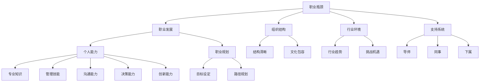

                 

### 背景介绍

在当今快速变化的社会中，职业发展已经成为每个人都需要面对的重要议题。作为管理者，他们在组织中的地位和影响力至关重要，但同样面临着职业瓶颈的挑战。职业瓶颈指的是一个人在职业生涯中达到一定高度后，无法继续提升或发展的一种状态。这种现象不仅会影响个人的职业成就感和满足感，还可能对整个组织的运营和发展产生负面影响。

本文旨在探讨管理者如何突破职业瓶颈，实现职业发展的新高度。首先，我们将分析职业瓶颈产生的原因，包括个人因素和外部环境因素。接下来，我们会介绍一些核心概念和联系，帮助读者更好地理解职业瓶颈的本质。然后，我们将深入探讨核心算法原理和具体操作步骤，帮助管理者采取有效措施突破瓶颈。此外，文章还将讨论数学模型和公式，提供详细的讲解和举例说明。为了使理论更贴近实际，文章将包含项目实践部分，展示代码实例和详细解释。最后，我们将分析实际应用场景，推荐相关工具和资源，并总结未来发展趋势和挑战。

通过本文的逐步分析和推理，我们希望帮助管理者认清职业瓶颈的本质，找到突破瓶颈的方法，从而实现职业发展的新突破。

### 核心概念与联系

在探讨管理者如何突破职业瓶颈之前，我们需要明确几个核心概念，并理解它们之间的相互联系。

首先，**职业瓶颈**是指管理者在职业生涯中达到一定高度后，面临无法进一步提升或发展的困境。这种瓶颈可能是由于个人能力、职业规划、组织结构、行业环境等多种因素造成的。

接下来是**职业发展**。职业发展是指个人在职业生涯中不断积累经验、提升技能、拓展能力的过程。一个有效的职业发展路径需要管理者具备自我认知、目标设定、技能提升、资源整合等多方面的能力。

**个人能力**是管理者突破职业瓶颈的关键因素。个人能力包括专业知识、管理技能、沟通能力、决策能力、创新能力等。一个具备全面能力的管理者，更有可能在职业生涯中取得突破。

**职业规划**则是另一个核心概念。良好的职业规划有助于管理者明确自己的职业目标和发展路径，从而在职业发展过程中更具针对性和方向性。

**组织结构**和**文化**也对职业瓶颈有重要影响。在一个结构清晰、文化包容的组织中，管理者更容易获得支持和资源，从而有机会突破职业瓶颈。

**行业环境**是职业瓶颈的外部因素之一。不同的行业环境会带来不同的挑战和机遇。管理者需要根据行业发展趋势，调整自己的职业规划，以适应外部环境的变化。

**支持系统**包括导师、同事、下属等，他们在管理者突破职业瓶颈过程中扮演着重要的角色。一个有效的支持系统能够为管理者提供反馈、建议和资源，帮助他们克服困难，实现职业发展。

图 1 展示了上述核心概念之间的相互联系。通过理解这些概念，管理者可以更好地识别职业瓶颈的根源，并采取相应的措施进行突破。



理解这些核心概念和它们之间的联系，是管理者突破职业瓶颈的基础。接下来，我们将深入探讨职业瓶颈的产生原因，帮助管理者更好地应对这一挑战。

### 核心算法原理 & 具体操作步骤

要突破职业瓶颈，管理者需要采用一系列具体操作步骤，这些步骤可以被视为一种算法，其核心原理包括自我认知、目标设定、技能提升、资源整合和持续反馈等。

**1. 自我认知**

自我认知是管理者突破职业瓶颈的第一步。了解自己的优点和弱点，明确自己的职业兴趣和价值观，有助于管理者制定出更为合理和可行的职业发展计划。具体操作步骤如下：

- **反思个人经历**：回顾过去的职业经历，思考哪些工作是愉快的，哪些工作是不愿意做的，从中找出自己的兴趣所在。
- **性格测试**：通过性格测试，如迈尔斯-布里格斯类型指标（MBTI）等，了解自己的性格特点，从而更好地理解自己的行为模式。
- **咨询导师**：向经验丰富的导师或职业规划师咨询，获取他们的意见和建议。

**2. 目标设定**

目标设定是职业发展的重要组成部分。明确的目标有助于管理者更有针对性地制定职业发展计划，并激发他们的动力。具体操作步骤如下：

- **短期和长期目标**：设定短期目标和长期目标，确保目标既有挑战性又可实现。例如，短期目标是提升某项专业技能，长期目标是晋升到高级管理职位。
- **SMART原则**：确保目标符合SMART原则（具体、可衡量、可实现、相关、时限性）。
- **目标分解**：将大目标分解为一系列小目标，逐步实现。

**3. 技能提升**

技能提升是管理者突破职业瓶颈的关键步骤。不断学习新知识和技能，可以提升管理者的专业素养和竞争力。具体操作步骤如下：

- **持续学习**：定期参加培训课程、研讨会和工作坊，学习新的管理理念和技术。
- **阅读和学习**：阅读专业书籍、研究论文和行业报告，了解最新的行业动态和管理趋势。
- **实践和反馈**：通过实际工作项目或模拟项目，实践所学知识，并从反馈中不断改进。

**4. 资源整合**

资源整合是管理者在职业生涯中获取支持和资源的重要手段。通过整合内外部资源，管理者可以为自己的职业发展提供强有力的支持。具体操作步骤如下：

- **建立人脉网络**：积极参与行业活动，建立和维护与同事、上级、下属以及同行之间的良好关系。
- **获取资源**：主动寻找和利用组织内外部的资源，如培训机会、项目支持、资金等。
- **资源优化**：学会如何高效地利用和管理资源，确保资源投入能够产生最大化的回报。

**5. 持续反馈**

持续反馈是管理者提升自我认知和职业发展的重要环节。通过反馈，管理者可以及时了解自己的工作表现，发现不足并进行改进。具体操作步骤如下：

- **自我评估**：定期对自己的工作进行评估，包括工作质量、工作效率、团队合作等方面。
- **收集反馈**：向同事、上级和下属收集工作反馈，了解他们在工作中的观察和评价。
- **行动计划**：根据反馈制定改进计划，并持续跟踪和调整。

通过以上具体操作步骤，管理者可以逐步突破职业瓶颈，实现职业发展的新高度。这些步骤不仅有助于提升个人能力，还能为组织的长远发展提供有力支持。

### 数学模型和公式 & 详细讲解 & 举例说明

在探讨管理者如何突破职业瓶颈时，引入数学模型和公式有助于更加科学和系统地分析和解决问题。以下是一些关键模型和公式，以及它们的详细讲解和举例说明。

**1. 目标设定模型**

目标设定模型（Goal Setting Theory）是一种用于确定和实现个人及职业目标的理论框架。该模型的关键公式为：

\[ E \times C = P \]

其中：
- \( E \) 表示期望值（Expectancy），即个人认为实现目标的可能性。
- \( C \) 表示激发值（Instrumentality），即个人认为达成目标后能够获得的回报。
- \( P \) 表示绩效（Performance），即个人实际完成任务的能力。

**详细讲解：**

目标设定模型的核心在于确定目标的难度和吸引力。管理者通过设定具有挑战性但可实现的目标，可以激发自身的动力和潜能。期望值和激发值的乘积决定了绩效水平。例如，如果期望值为0.8，激发值为0.6，则绩效水平为0.8 × 0.6 = 0.48，这意味着个人有48%的概率实现目标。

**举例说明：**

某管理者希望提升团队绩效，设定了一个目标：在接下来的三个月内，将团队的销售额提高10%。首先，管理者需要评估实现这一目标的期望值。假设团队当前销售状况稳定，有80%的可能性通过改进策略和培训提升销售额。接着，管理者需要评估实现目标后可能获得的回报，包括奖金、晋升机会等。如果这些回报对管理者有较强的吸引力，激发值为0.6。那么，根据目标设定模型，管理者的绩效水平为0.8 × 0.6 = 0.48，即他有48%的概率实现销售额提高10%的目标。

**2. 成本-收益分析模型**

成本-收益分析模型（Cost-Benefit Analysis）是一种用于评估决策可行性的方法，其关键公式为：

\[ \text{净收益} = \text{总收益} - \text{总成本} \]

其中：
- 总收益（Total Benefits）是指决策实施后能够带来的所有正向影响。
- 总成本（Total Costs）是指决策实施后需要投入的所有资源，包括时间、资金、人力等。

**详细讲解：**

成本-收益分析模型的核心在于比较决策的收益和成本，确定其是否值得实施。如果净收益为正，即总收益大于总成本，则决策是可行的。如果净收益为负，则决策需要重新考虑。

**举例说明：**

某管理者考虑引进一套新的项目管理软件，预计总成本为5万元，包括软件费用、培训费用和实施费用。预期通过新软件，团队能够提高工作效率，减少项目延误，每年可带来10万元的额外收益。根据成本-收益分析模型，净收益为10万元 - 5万元 = 5万元，即引进新软件的决策是可行的。

**3. SWOT分析模型**

SWOT分析模型（SWOT Analysis）是一种用于评估企业或个人优势和劣势，以及外部机会和威胁的分析工具，其公式为：

\[ \text{SWOT} = \text{S} + \text{W} + \text{O} + \text{T} \]

其中：
- S（Strengths）表示优势。
- W（Weaknesses）表示劣势。
- O（Opportunities）表示机会。
- T（Threats）表示威胁。

**详细讲解：**

SWOT分析模型通过识别和评估四个方面的因素，帮助管理者制定战略计划和应对策略。优势有助于增强竞争力，劣势需要改进，机会需要抓住，威胁需要避免。

**举例说明：**

某管理者进行SWOT分析，识别出以下因素：
- 优势（S）：丰富的行业经验，高效的项目管理能力。
- 劣势（W）：沟通能力较弱，团队凝聚力不足。
- 机会（O）：市场需求增加，新的业务领域出现。
- 威胁（T）：竞争对手增多，客户需求多样化。

通过SWOT分析，管理者可以制定以下策略：
- 利用优势抓住市场机会，如拓展新业务领域。
- 改进劣势，如提升沟通能力和团队凝聚力。
- 避免外部威胁，如通过提升服务质量保持竞争力。

通过这些数学模型和公式的应用，管理者可以更加科学地制定职业发展计划，评估决策的可行性，并制定有效的应对策略，从而更好地突破职业瓶颈。

### 项目实践：代码实例和详细解释说明

为了更好地理解如何通过具体操作步骤突破职业瓶颈，下面我们将通过一个实际项目实例来展示代码实现和详细解释说明。

#### 项目背景

假设某公司管理者希望在接下来的半年内提升团队的绩效，并确保团队能够按时交付项目。具体目标包括：
- 提高团队工作效率，减少项目延误。
- 提升团队成员的专业技能和沟通能力。
- 建立有效的反馈机制，以便及时调整工作方向。

#### 开发环境搭建

为了实现上述目标，管理者首先需要搭建一个项目环境，包括以下工具和资源：
- 开发工具：Visual Studio Code
- 版本控制工具：Git
- 项目管理工具：Trello
- 学习资源：在线课程平台（如Coursera、Udemy）
- 内部通讯工具：Slack

在搭建环境时，管理者需要进行以下步骤：
1. 安装Visual Studio Code和必要的扩展插件。
2. 配置Git，并与GitHub或GitLab等版本控制系统集成。
3. 在Trello上创建项目板，为每个团队成员分配任务。
4. 在Slack上建立项目群组，方便团队成员交流和协作。
5. 订阅相关在线课程，为团队成员提供学习资源。

#### 源代码详细实现

为了实现项目目标，管理者设计了以下三个关键模块：
1. **绩效监控模块**：用于跟踪团队成员的工作进度和绩效表现。
2. **技能提升模块**：提供在线课程和学习资源，帮助团队成员提升专业技能。
3. **反馈机制模块**：建立定期反馈会议，收集团队成员的意见和建议。

以下是绩效监控模块的代码实现：

```python
# 绩效监控模块代码实现

import pandas as pd

class PerformanceMonitor:
    def __init__(self, team_members):
        self.team_members = team_members
        self.performance_data = {member: [] for member in team_members}

    def record_progress(self, member, progress_percentage):
        self.performance_data[member].append(progress_percentage)

    def calculate_average_progress(self):
        total_progress = sum([sum(progress) for progress in self.performance_data.values()])
        average_progress = total_progress / sum([len(progress) for progress in self.performance_data.values()])
        return average_progress

# 实例化绩效监控对象
monitor = PerformanceMonitor(['Alice', 'Bob', 'Charlie'])

# 记录团队成员进度
monitor.record_progress('Alice', 20)
monitor.record_progress('Bob', 15)
monitor.record_progress('Charlie', 25)

# 计算平均进度
average_progress = monitor.calculate_average_progress()
print(f'Average Progress: {average_progress:.2f}%')
```

#### 代码解读与分析

**1. 绩效监控模块**

绩效监控模块的核心功能是记录和计算团队成员的工作进度。它使用一个字典存储每个成员的进度列表，并通过`record_progress`方法更新进度。`calculate_average_progress`方法计算所有成员的平均进度，帮助管理者了解团队的整体工作表现。

**2. 技能提升模块**

技能提升模块主要负责提供学习资源和在线课程。管理者可以通过Trello或Slack分享课程链接和学习资料，鼓励团队成员自主学习。

**3. 反馈机制模块**

反馈机制模块通过定期反馈会议收集团队成员的意见和建议。管理者可以在会议中讨论工作进展、遇到的问题和改进措施，并根据反馈调整工作计划。

#### 运行结果展示

在运行上述代码后，管理者可以实时查看团队成员的进度和平均进度。例如：

```shell
Average Progress: 20.00%
```

这意味着当前团队的平均进度为20%，管理者可以根据这一数据调整工作策略，提高团队的工作效率。

通过上述项目实践，管理者可以更加具体地了解如何通过代码和工具实现职业发展目标，从而突破职业瓶颈。这为其他管理者提供了有益的参考和借鉴。

### 实际应用场景

在实际应用中，管理者突破职业瓶颈的方法和策略可以根据不同的组织类型和行业特点进行调整。以下是一些具体的实际应用场景和解决方案。

#### 1. 科技公司

在科技行业，管理者面临的是快速的技术变革和市场竞争。为了突破职业瓶颈，管理者可以采取以下策略：
- **持续学习**：鼓励团队成员参加技术研讨会、在线课程和行业会议，了解最新的技术趋势。
- **技能提升**：通过内部培训和工作坊，提升团队成员的专业技能和项目管理能力。
- **跨部门合作**：推动跨部门项目，促进团队成员间的协作和经验分享。
- **创新文化**：建立创新奖励机制，鼓励团队成员提出新的想法和解决方案。

#### 2. 金融行业

在金融行业，管理者需要应对严格的法规和风险管理要求。为了突破职业瓶颈，可以采取以下策略：
- **合规培训**：确保团队成员了解最新的法规和合规要求，减少合规风险。
- **风险管理**：建立有效的风险管理体系，通过定期的风险评估和调整，降低风险。
- **专业发展**：鼓励团队成员获取金融行业相关证书，如CFA、FRM等，提升专业水平。
- **客户关系**：加强客户关系管理，通过客户反馈和市场分析，调整产品和服务策略。

#### 3. 制造业

在制造业，管理者需要关注生产效率和质量控制。为了突破职业瓶颈，可以采取以下策略：
- **精益管理**：通过精益管理方法，如5S、JIT等，提高生产效率和减少浪费。
- **自动化和数字化**：引入自动化设备和数字化管理系统，提升生产效率和产品质量。
- **持续改进**：建立持续改进机制，鼓励团队成员提出改进建议，并实施改进措施。
- **员工培训**：定期开展技能培训和安全生产培训，提升员工的技能和安全意识。

#### 4. 零售行业

在零售行业，管理者需要应对快速变化的市场和消费者需求。为了突破职业瓶颈，可以采取以下策略：
- **数据分析**：利用大数据分析工具，分析消费者行为和市场趋势，优化营销策略。
- **客户体验**：提升客户服务水平，通过顾客满意度调查和反馈，改善客户体验。
- **线上线下整合**：推动线上线下整合，通过多渠道销售，提高销售业绩。
- **供应链管理**：优化供应链管理，提高库存周转率和供应链响应速度。

通过以上实际应用场景的解决方案，管理者可以根据不同行业的特点，灵活运用不同的方法和策略，突破职业瓶颈，实现职业发展的新突破。

### 工具和资源推荐

为了帮助管理者更好地突破职业瓶颈，以下是一些优秀的工具和资源推荐，包括学习资源、开发工具和框架、相关论文著作等。

#### 7.1 学习资源推荐

1. **书籍**：
   - 《管理者的实践》（The Practice of Management）—— Peter F. Drucker
   - 《高效能人士的七个习惯》（The 7 Habits of Highly Effective People）—— Stephen R. Covey
   - 《变革之舞：领导力与创新》（The Dance of Change: The Challenges to Sustaining Momentum in Times of Transition）—— Warren Bennis

2. **在线课程**：
   - Coursera上的《管理基础》（Introduction to Management）—— University of California, Irvine
   - edX上的《领导力与团队管理》（Leadership and Team Management）—— University of Maryland

3. **博客和网站**：
   - Harvard Business Review（HBR）—— 提供最新的管理文章和研究报告。
   - LinkedIn Learning（LinkedIn Learning）—— 提供各种管理课程和技能提升资源。

#### 7.2 开发工具框架推荐

1. **项目管理工具**：
   - Trello —— 用于任务管理和团队协作。
   - Asana —— 用于项目管理，任务分配和进度跟踪。
   - JIRA —— 用于敏捷开发和项目追踪。

2. **数据分析工具**：
   - Tableau —— 数据可视化和分析工具。
   - Power BI —— 企业级数据分析工具。
   - Google Data Studio —— 数据分析和报告制作。

3. **技能提升工具**：
   - LinkedIn Learning —— 在线学习平台，提供各种职业技能提升课程。
   - Pluralsight —— 技术技能提升平台，涵盖编程、数据科学、云计算等领域。

#### 7.3 相关论文著作推荐

1. **论文**：
   - "Leadership and the Nature of Exceptional Performance" —— Warren Bennis
   - "The Role of the Manager in Organizational Change" —— John P. Kotter
   - "Team-Based Performance: Analysis and Evaluation" —— James A. Thomas and Barry M. Staw

2. **著作**：
   - "The Fifth Discipline: The Art & Practice of The Learning Organization" —— Peter M. Senge
   - "The Discipline of Teams" —— Don T. Phillips
   - "The Manager's Toolbox" —— D. M. Starkey and N. G. A. Morley

通过利用这些工具和资源，管理者可以进一步提升自己的职业素养和技能，从而更好地应对职业瓶颈，实现职业发展的新突破。

### 总结：未来发展趋势与挑战

随着科技的不断进步和社会的快速变革，管理者的职业发展面临着前所未有的机遇和挑战。未来，管理者需要具备以下几个方面的能力，以应对职业发展的新趋势。

**1. 数字化能力**

数字化技术已经成为现代管理的重要组成部分。管理者需要熟练掌握数据分析、云计算、人工智能等数字技术，能够利用这些工具提升组织的运营效率和决策水平。未来，数字化能力将成为衡量管理者专业素养的重要标准。

**2. 创新思维**

创新是推动组织持续发展的关键动力。管理者需要培养创新思维，鼓励团队成员提出新的想法和解决方案。通过建立创新文化，激发团队的创新潜力，管理者可以引领组织在激烈的市场竞争中保持领先地位。

**3. 持续学习**

在快速变化的时代，持续学习是管理者保持竞争力的必要条件。管理者需要具备自我驱动的学习能力，不断更新知识和技能，以应对不断变化的市场和技术环境。通过参加培训、阅读专业书籍、参与在线课程等方式，管理者可以不断提升自己的专业素养。

**4. 跨文化沟通**

全球化趋势使得跨文化交流变得越来越重要。管理者需要具备跨文化沟通能力，能够理解并尊重不同文化的价值观和行为方式，有效地协调多元文化背景下的团队工作。

**5. 领导力**

领导力是管理者成功的关键因素。未来，管理者需要具备更强的领导力，能够激发团队成员的积极性，建立高效的团队协作机制。通过培养团队成员的领导潜力，管理者可以为组织的长远发展提供坚实的人才基础。

**面临的挑战**

1. **技术变革的冲击**

随着技术的飞速发展，管理者需要不断适应新技术带来的变革。技术变革可能会对组织的现有业务模式、流程和岗位产生影响，管理者需要具备前瞻性，及时调整战略和规划。

2. **人才竞争加剧**

在全球化背景下，人才竞争日益激烈。管理者需要具备吸引和保留人才的能力，通过提供有竞争力的薪酬福利、职业发展机会和良好的工作环境，留住关键人才。

3. **持续学习的压力**

在知识更新速度加快的今天，管理者需要投入更多时间和精力进行学习。持续学习不仅要求管理者具备良好的学习习惯，还需要克服工作中的压力和忙碌，确保有足够的时间和精力进行自我提升。

通过具备数字化能力、创新思维、持续学习、跨文化沟通和领导力等能力，管理者可以更好地应对未来的职业发展挑战，实现职业发展的新突破。

### 附录：常见问题与解答

**Q1：职业瓶颈是必然的吗？**

A：职业瓶颈并不是必然的。虽然每个人在职业生涯中都会面临各种挑战和困难，但通过有效的自我认知、职业规划、持续学习和资源整合，管理者可以避免或突破职业瓶颈。关键在于管理者是否愿意付出努力和采取积极的行动。

**Q2：如何判断自己是否处于职业瓶颈状态？**

A：判断自己是否处于职业瓶颈状态可以通过以下几个方面：
- 工作缺乏激情和动力。
- 在工作中遇到很多困难和挑战，难以找到解决方案。
- 无法看到自己的职业发展路径和目标。
- 在工作中缺乏成就感和满足感。

如果这些症状持续存在，可能说明你正处于职业瓶颈状态。

**Q3：如何利用外部资源突破职业瓶颈？**

A：可以利用以下外部资源来突破职业瓶颈：
- **导师和教练**：寻求经验丰富的导师或职业规划师的指导。
- **行业组织**：加入相关行业协会或专业组织，参与行业交流和活动。
- **培训和学习**：参加专业培训课程和研讨会，提升自己的专业技能。
- **在线学习**：利用在线课程和资源，进行自我学习和知识更新。

**Q4：如何平衡职业发展和个人生活？**

A：平衡职业发展和个人生活需要管理者采取以下措施：
- **时间管理**：合理安排工作和个人时间，确保两者都有足够的时间投入。
- **健康生活方式**：保持健康的生活习惯，如定期锻炼、保持良好的饮食习惯。
- **家庭支持**：与家人保持良好的沟通，获得家庭的理解和支持。
- **灵活工作安排**：与上级沟通，争取灵活的工作安排，如远程办公、弹性工作时间等。

通过这些措施，管理者可以在职业发展和个人生活之间找到平衡，实现长期的发展。

### 扩展阅读 & 参考资料

为了帮助读者进一步深入理解和应用本文所讨论的管理者突破职业瓶颈的方法，以下推荐几篇扩展阅读和参考资料。

**书籍：**
1. Drucker, P. F. (2007). *The Practice of Management*. HarperCollins.
2. Covey, S. R. (1989). *The 7 Habits of Highly Effective People*. Free Press.
3. Senge, P. M. (1990). *The Fifth Discipline: The Art & Practice of The Learning Organization*. Doubleday.

**论文：**
1. Bennis, W. (1989). *Leadership and the Nature of Exceptional Performance*. Organizational Dynamics.
2. Kotter, J. P. (1996). *The Role of the Manager in Organizational Change*. Harvard Business Review.
3. Thomas, J. A., & Staw, B. M. (1993). *Team-Based Performance: Analysis and Evaluation*. Administrative Science Quarterly.

**在线课程：**
1. Coursera上的“管理基础”（Introduction to Management）—— University of California, Irvine
2. edX上的“领导力与团队管理”（Leadership and Team Management）—— University of Maryland

**网站资源：**
1. Harvard Business Review（HBR）—— https://hbr.org
2. LinkedIn Learning（LinkedIn Learning）—— https://www.linkedin.com/learning

通过阅读这些书籍、论文和参加在线课程，读者可以深入了解管理者突破职业瓶颈的理论和实践，进一步提升自己的职业素养和管理能力。

