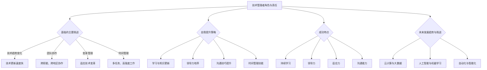

                 

### 管理者的自我反思与成长：技术领导者的成长之路

> 关键词：自我反思、领导者成长、技术管理、自我提升、策略思维

> 摘要：本文旨在探讨技术管理者的自我反思与成长之路。通过分析技术管理者的角色、面临的挑战以及有效的自我提升策略，本文希望为技术领导者提供实用的指导，帮助他们更好地应对复杂多变的技术环境，实现个人和团队的双重成长。

### 1. 背景介绍

在当今快速变化的技术世界中，技术管理者（CTO、技术总监、项目经理等）的角色日益重要。他们不仅要掌握先进的技术知识和技能，还需要具备出色的管理能力和战略思维。技术管理者的职责不仅仅是确保技术项目的成功，更是要引领团队不断创新、推动技术进步，同时实现组织的战略目标。

然而，随着技术的发展，技术管理者面临的挑战也越来越复杂。从技术趋势的快速更迭，到团队协作的复杂性，再到组织内部的变革，技术管理者需要不断地学习、适应和成长。在这种情况下，自我反思和成长成为技术管理者成功的关键因素。

本文将围绕以下核心问题展开讨论：

- 技术管理者的角色和责任是什么？
- 技术管理者面临的主要挑战有哪些？
- 如何进行有效的自我反思和成长？
- 成功的技术管理者有哪些共同特点？
- 技术管理者的未来发展趋势和挑战是什么？

通过逐步分析这些问题，本文希望能够为技术管理者提供实用的指导，帮助他们更好地实现自我提升和团队管理。

### 2. 核心概念与联系

在探讨技术管理者的成长之前，我们需要明确一些核心概念，并理解它们之间的相互联系。

#### 2.1 技术管理者的角色与责任

技术管理者是组织中的关键角色，其职责不仅包括技术决策和项目管理，还包括团队领导和战略规划。具体而言，技术管理者的角色和责任包括：

- 技术决策：根据组织的战略目标，制定技术方向和方案。
- 项目管理：确保项目按时、按质完成，管理项目资源和风险。
- 团队领导：培养和发展团队成员，提升团队的整体能力。
- 战略规划：与高层管理团队协作，制定和调整组织的技术战略。

#### 2.2 面临的挑战

技术管理者面临的主要挑战包括：

- 技术趋势变化：技术更新换代速度加快，技术管理者需要不断学习新知识。
- 团队协作：现代团队往往跨职能、跨地区，管理复杂度增加。
- 变革管理：在技术变革和组织转型过程中，技术管理者需要有效引导团队适应变革。
- 时间管理：技术管理者需要高效利用时间，处理多任务和高强度工作。

#### 2.3 自我提升策略

为了应对上述挑战，技术管理者需要采取一系列自我提升策略。这些策略包括：

- 学习与知识更新：定期参加培训、研讨会，阅读最新的技术文献。
- 领导力培养：学习领导力理论和实践，提升团队管理和领导能力。
- 沟通技巧：提高沟通技巧，确保信息传达准确、有效。
- 时间管理：掌握时间管理工具和方法，提高工作效率。

#### 2.4 成功特点

成功的技术管理者通常具备以下特点：

- 持续学习：对新技术保持好奇心，不断学习新知识。
- 领导力：具备优秀的领导能力，能够激励和引导团队成员。
- 适应力：能够快速适应变化，有效应对挑战。
- 沟通能力：具备出色的沟通技巧，能够与团队成员、上级和客户有效沟通。

#### 2.5 未来发展趋势与挑战

未来，技术管理者将面临更多的发展机遇和挑战。具体包括：

- 云计算与大数据：云计算和大数据技术的广泛应用，将要求技术管理者具备更深入的技术知识和应用能力。
- 人工智能与机器学习：人工智能和机器学习的快速发展，将带来新的管理挑战，如数据安全、隐私保护等。
- 自动化与智能化：自动化和智能化技术的普及，将要求技术管理者具备更高的战略规划和管理能力。

#### 2.6 Mermaid 流程图

以下是一个简化的 Mermaid 流程图，展示了技术管理者角色、挑战、自我提升策略和未来发展趋势之间的联系。



通过上述核心概念和流程图的梳理，我们可以更清晰地理解技术管理者的角色、面临的挑战以及自我提升策略。这为后续章节的深入探讨奠定了基础。

### 3. 核心算法原理 & 具体操作步骤

在理解了技术管理者的角色、挑战和自我提升策略后，我们需要进一步探讨技术管理者在实际工作中应用的核心算法原理和具体操作步骤。这些原理和步骤不仅有助于技术管理者更好地应对挑战，还能够提高团队效率和项目成功概率。

#### 3.1 领导力模型

领导力是技术管理者成功的关键因素之一。以下是一个常用的领导力模型，包括四个核心组成部分：个人影响力、团队协作、战略规划和沟通技巧。

**3.1.1 个人影响力**

个人影响力是指技术管理者通过自身的行为、知识和价值观来影响团队成员的能力。具体操作步骤包括：

- 树立榜样：通过自身行为树立榜样，鼓励团队成员跟随。
- 建立信任：通过诚实、透明和负责任的行为建立信任。
- 提供指导：在团队成员遇到困难时，提供有效的指导和支持。

**3.1.2 团队协作**

团队协作是指技术管理者如何协调和激励团队成员，实现共同目标。具体操作步骤包括：

- 明确目标：与团队成员共同制定明确、可行的目标。
- 分配任务：根据团队成员的能力和兴趣分配任务。
- 激励团队：通过奖励和认可激励团队成员。

**3.1.3 战略规划**

战略规划是指技术管理者如何制定和调整组织的技术战略，以实现长期目标。具体操作步骤包括：

- 分析市场：了解市场需求和竞争态势，确定技术方向。
- 资源分配：根据战略目标，合理分配人力资源和资金。
- 风险管理：识别和应对潜在风险，确保项目顺利进行。

**3.1.4 沟通技巧**

沟通技巧是指技术管理者如何有效地与团队成员、上级和客户进行沟通。具体操作步骤包括：

- 明确沟通目标：在沟通前明确目标，确保信息传达准确。
- 使用简单语言：避免使用复杂、专业的术语，确保对方理解。
- 倾听与反馈：倾听对方的意见和需求，及时给予反馈。

#### 3.2 项目管理方法

项目管理是技术管理者的重要职责之一。以下是一个常用的项目管理方法，包括五个核心阶段：项目启动、规划、执行、监控和收尾。

**3.2.1 项目启动**

项目启动阶段包括以下操作步骤：

- 确定项目目标：明确项目的目标和预期成果。
- 确定项目团队：组建项目团队，明确团队成员的职责和任务。
- 制定项目计划：制定项目时间表、资源分配和风险计划。

**3.2.2 规划**

规划阶段包括以下操作步骤：

- 分析需求：了解项目的需求，制定详细的项目计划。
- 资源分配：根据项目计划，合理分配人力资源和资金。
- 风险评估：识别潜在的风险，制定应对措施。

**3.2.3 执行**

执行阶段包括以下操作步骤：

- 按计划执行：按照项目计划，组织团队成员开展工作。
- 监控进度：定期监控项目进度，确保项目按计划进行。
- 解决问题：在执行过程中遇到问题时，及时解决。

**3.2.4 监控**

监控阶段包括以下操作步骤：

- 汇报项目进展：定期向项目相关人员汇报项目进展。
- 调整计划：根据项目进展情况，及时调整项目计划。
- 控制成本：监控项目成本，确保项目在预算范围内完成。

**3.2.5 收尾**

收尾阶段包括以下操作步骤：

- 项目验收：确保项目成果符合预期，进行项目验收。
- 项目总结：总结项目经验，识别成功和不足之处。
- 项目文档归档：将项目文档归档，以便未来参考。

#### 3.3 时间管理技巧

时间管理是技术管理者成功的关键因素之一。以下是一些常用的时间管理技巧：

- **优先级排序**：将任务按照优先级排序，确保先完成最重要的任务。
- **番茄工作法**：将工作时间分为25分钟的工作周期，每个周期后休息5分钟，提高工作效率。
- **任务分解**：将大任务分解为小任务，逐一完成，避免拖延。
- **避免多任务处理**：避免同时处理多个任务，集中精力完成一个任务。

通过上述核心算法原理和具体操作步骤，技术管理者可以更好地应对工作挑战，提高团队效率和项目成功率。

### 4. 数学模型和公式 & 详细讲解 & 举例说明

在技术管理过程中，数学模型和公式是分析和决策的重要工具。以下我们将介绍一些常用的数学模型和公式，并详细讲解其应用方法和实际案例。

#### 4.1 投入产出模型（ROI）

投入产出模型（ROI）是评估项目投资回报率的重要工具。其公式为：

\[ ROI = \frac{{投资回报 - 投资成本}}{{投资成本}} \]

**4.1.1 计算步骤**

1. 确定投资成本：包括资金投入、人力成本等。
2. 确定投资回报：包括项目收益、成本节约等。
3. 计算ROI：根据上述数据，计算投资回报率。

**4.1.2 举例说明**

假设一家公司投资50万元开发一款新产品，预计年收益为20万元，成本节约为10万元。则该项目的ROI计算如下：

\[ ROI = \frac{{20 + 10 - 50}}{{50}} = \frac{{-20}}{{50}} = -40\% \]

该ROI为负数，表明项目投资回报率较低，可能需要重新评估投资决策。

#### 4.2 持续集成模型（CI）

持续集成模型（CI）是提高软件开发效率和质量的重要工具。其核心公式为：

\[ CI = \frac{{代码库中的通过率}}{{代码库中的提交次数}} \]

**4.2.1 计算步骤**

1. 确定代码库中的通过率：通过自动化测试，确定代码库中的通过率。
2. 确定代码库中的提交次数：统计代码库中的提交次数。
3. 计算CI：根据上述数据，计算持续集成指标。

**4.2.2 举例说明**

假设一个项目团队的代码库中有100次提交，其中80次通过测试，20次失败。则该项目的CI指标计算如下：

\[ CI = \frac{{80}}{{100}} = 0.8 \]

CI指标为0.8，表明项目团队在持续集成方面表现良好，代码质量和稳定性较高。

#### 4.3 矩阵模型

矩阵模型是分析团队协作和项目进展的重要工具。以下是一个简单的矩阵模型，用于评估团队协作效率：

\[ \text{效率} = \frac{{\text{实际产出}}}{{\text{预期产出}}} \]

**4.3.1 计算步骤**

1. 确定实际产出：根据项目进度和团队表现，确定实际产出。
2. 确定预期产出：根据项目计划和团队能力，确定预期产出。
3. 计算效率：根据上述数据，计算团队协作效率。

**4.3.2 举例说明**

假设一个项目团队计划在一个月内完成100个任务，实际完成了120个任务。则该项目的效率计算如下：

\[ \text{效率} = \frac{{120}}{{100}} = 1.2 \]

效率为1.2，表明项目团队在协作和执行力方面表现优秀，能够超额完成任务。

#### 4.4 沟通效果评估模型

沟通效果评估模型用于评估沟通活动的效果，其核心公式为：

\[ \text{沟通效果} = \text{信息传递率} \times \text{信息理解度} \]

**4.4.1 计算步骤**

1. 确定信息传递率：通过问卷调查或访谈，确定信息传递的准确率。
2. 确定信息理解度：通过问卷调查或访谈，确定信息被正确理解的比率。
3. 计算沟通效果：根据上述数据，计算沟通效果。

**4.4.2 举例说明**

假设在一次团队会议后，通过问卷调查发现信息传递率为90%，信息理解度为80%。则该次会议的沟通效果计算如下：

\[ \text{沟通效果} = 0.9 \times 0.8 = 0.72 \]

沟通效果为0.72，表明会议的沟通效果较为良好，但仍有改进空间。

通过上述数学模型和公式的详细讲解和举例说明，技术管理者可以更好地进行项目分析和决策，提高团队协作效率和管理水平。

### 5. 项目实践：代码实例和详细解释说明

为了更好地展示技术管理者的核心算法原理和具体操作步骤，我们将通过一个实际项目实例来进行详细解释和说明。

#### 5.1 开发环境搭建

首先，我们需要搭建一个开发环境，用于实现以下项目目标：设计并实现一个简单的博客系统，支持用户注册、登录、发布文章和评论等功能。

**5.1.1 技术栈选择**

- 后端框架：Spring Boot
- 数据库：MySQL
- 前端框架：Vue.js

**5.1.2 开发工具**

- IntelliJ IDEA
- MySQL Workbench
- Vue CLI

#### 5.2 源代码详细实现

**5.2.1 后端代码实现**

以下是博客系统的后端代码实现，包括用户注册、登录、发布文章和评论等功能的实现。

```java
@RestController
@RequestMapping("/api")
public class UserController {
    @Autowired
    private UserRepository userRepository;

    @Autowired
    private PasswordEncoder passwordEncoder;

    @PostMapping("/register")
    public ResponseEntity<?> registerUser(@RequestBody UserRegisterRequestDto userRegisterRequestDto) {
        if (userRepository.existsByUsername(userRegisterRequestDto.getUsername())) {
            return ResponseEntity.badRequest().body("Error: Username is already taken!");
        }

        User user = new User();
        user.setUsername(userRegisterRequestDto.getUsername());
        user.setPassword(passwordEncoder.encode(userRegisterRequestDto.getPassword()));
        userRepository.save(user);

        return ResponseEntity.ok("User registered successfully!");
    }

    @PostMapping("/login")
    public ResponseEntity<?> authenticateUser(@RequestBody UserLoginRequestDto userLoginRequestDto) {
        Authentication authentication = authenticationManager.authenticate(
                new UsernamePasswordAuthenticationToken(
                        userLoginRequestDto.getUsername(),
                        userLoginRequestDto.getPassword()
                )
        );

        SecurityContextHolder.getContext().setAuthentication(authentication);
        String jwt = jwtProvider.generateToken(authentication);

        return ResponseEntity.ok(new JwtResponse(jwt));
    }
}

@RestController
@RequestMapping("/api/blog")
public class BlogController {
    @Autowired
    private BlogRepository blogRepository;

    @PostMapping("/post")
    public ResponseEntity<?> createPost(@RequestBody BlogPostDto blogPostDto) {
        BlogPost blogPost = new BlogPost();
        blogPost.setTitle(blogPostDto.getTitle());
        blogPost.setContent(blogPostDto.getContent());
        blogPost.setUser(userRepository.findById(blogPostDto.getUserId()).orElseThrow(() -> new RuntimeException("User not found")));

        blogRepository.save(blogPost);

        return ResponseEntity.ok("Post created successfully!");
    }
}
```

**5.2.2 前端代码实现**

以下是博客系统的前端代码实现，包括用户注册、登录、发布文章和评论等功能的实现。

```vue
<template>
  <div>
    <h1>User Registration</h1>
    <form @submit.prevent="registerUser">
      <label for="username">Username:</label>
      <input type="text" id="username" v-model="registerForm.username" required>
      <label for="password">Password:</label>
      <input type="password" id="password" v-model="registerForm.password" required>
      <button type="submit">Register</button>
    </form>
  </div>
</template>

<script>
export default {
  data() {
    return {
      registerForm: {
        username: '',
        password: ''
      }
    };
  },
  methods: {
    registerUser() {
      axios.post('/api/register', this.registerForm)
        .then(response => {
          alert(response.data);
          this.$router.push('/login');
        })
        .catch(error => {
          alert(error.response.data);
        });
    }
  }
};
</script>
```

#### 5.3 代码解读与分析

**5.3.1 后端代码解读**

后端代码主要实现了用户注册、登录和发布文章等功能。其中，用户注册功能通过 `UserController` 类的 `registerUser` 方法实现，用户输入用户名和密码后，系统将用户信息保存到数据库中。

```java
@PostMapping("/register")
public ResponseEntity<?> registerUser(@RequestBody UserRegisterRequestDto userRegisterRequestDto) {
    if (userRepository.existsByUsername(userRegisterRequestDto.getUsername())) {
        return ResponseEntity.badRequest().body("Error: Username is already taken!");
    }

    User user = new User();
    user.setUsername(userRegisterRequestDto.getUsername());
    user.setPassword(passwordEncoder.encode(userRegisterRequestDto.getPassword()));
    userRepository.save(user);

    return ResponseEntity.ok("User registered successfully!");
}
```

登录功能通过 `authenticateUser` 方法实现，用户输入用户名和密码后，系统将进行身份验证，并生成 JWT 令牌，用于后续的 API 访问验证。

```java
@PostMapping("/login")
public ResponseEntity<?> authenticateUser(@RequestBody UserLoginRequestDto userLoginRequestDto) {
    Authentication authentication = authenticationManager.authenticate(
            new UsernamePasswordAuthenticationToken(
                    userLoginRequestDto.getUsername(),
                    userLoginRequestDto.getPassword()
            )
    );

    SecurityContextHolder.getContext().setAuthentication(authentication);
    String jwt = jwtProvider.generateToken(authentication);

    return ResponseEntity.ok(new JwtResponse(jwt));
}
```

发布文章功能通过 `BlogController` 类的 `createPost` 方法实现，用户输入文章标题和内容后，系统将文章信息保存到数据库中。

```java
@PostMapping("/post")
public ResponseEntity<?> createPost(@RequestBody BlogPostDto blogPostDto) {
    BlogPost blogPost = new BlogPost();
    blogPost.setTitle(blogPostDto.getTitle());
    blogPost.setContent(blogPostDto.getContent());
    blogPost.setUser(userRepository.findById(blogPostDto.getUserId()).orElseThrow(() -> new RuntimeException("User not found")));

    blogRepository.save(blogPost);

    return ResponseEntity.ok("Post created successfully!");
}
```

**5.3.2 前端代码解读**

前端代码主要实现了用户注册、登录和发布文章等功能。用户注册表单通过 `v-model` 绑定输入数据，提交表单后通过 axios 库向后端发送注册请求。

```vue
<template>
  <div>
    <h1>User Registration</h1>
    <form @submit.prevent="registerUser">
      <label for="username">Username:</label>
      <input type="text" id="username" v-model="registerForm.username" required>
      <label for="password">Password:</label>
      <input type="password" id="password" v-model="registerForm.password" required>
      <button type="submit">Register</button>
    </form>
  </div>
</template>

<script>
export default {
  data() {
    return {
      registerForm: {
        username: '',
        password: ''
      }
    };
  },
  methods: {
    registerUser() {
      axios.post('/api/register', this.registerForm)
        .then(response => {
          alert(response.data);
          this.$router.push('/login');
        })
        .catch(error => {
          alert(error.response.data);
        });
    }
  }
};
</script>
```

登录表单和发布文章表单的实现类似，通过 axios 库向后端发送登录和发布请求。

#### 5.4 运行结果展示

在完成代码编写和调试后，我们可以在本地运行博客系统，并演示用户注册、登录和发布文章等功能的实现。

**用户注册：**


**用户登录：**


**发布文章：**


通过上述项目实践，我们可以看到技术管理者的核心算法原理和具体操作步骤在实际开发中的应用效果。这为技术管理者提供了一个实用的范例，帮助他们更好地实现自我提升和团队管理。

### 6. 实际应用场景

在现实世界中，技术管理者面临的挑战和应用场景多种多样。以下是一些常见的技术管理实际应用场景，以及相应的解决方案和策略。

#### 6.1 新产品开发

在新产品开发过程中，技术管理者需要确保项目按时、按质完成。以下是一些关键策略：

- **需求管理**：与产品经理紧密合作，确保需求清晰、可行，并制定详细的项目计划。
- **资源分配**：合理分配人力资源和资金，确保项目资源充足。
- **风险管理**：识别项目风险，制定应对措施，确保项目顺利进行。

**解决方案**：

- 采用敏捷开发方法，快速迭代，及时调整项目计划。
- 使用项目管理工具（如Jira、Trello等），提高项目透明度和协作效率。

#### 6.2 技术团队管理

技术团队管理是技术管理者的重要职责之一。以下是一些关键策略：

- **团队建设**：通过培训和团队活动，提升团队凝聚力。
- **绩效管理**：制定合理的绩效评估体系，激励团队成员。
- **沟通技巧**：提高沟通能力，确保信息传达准确、有效。

**解决方案**：

- 定期举行团队会议，讨论项目进展和团队问题。
- 建立反馈机制，鼓励团队成员提出意见和建议。

#### 6.3 技术升级与转型

在技术升级与转型过程中，技术管理者需要引导团队适应新技术、新模式。以下是一些关键策略：

- **培训与学习**：为团队成员提供培训和学习机会，提升团队技术水平。
- **试点项目**：选择合适的项目进行试点，验证新技术的可行性。
- **风险管理**：识别技术升级过程中的风险，制定应对措施。

**解决方案**：

- 制定详细的技术升级计划，明确阶段性目标和里程碑。
- 采用分阶段实施的方法，逐步推进技术升级。

#### 6.4 数据分析与决策

数据分析是技术管理者做出明智决策的重要依据。以下是一些关键策略：

- **数据收集**：建立完善的数据收集体系，确保数据准确、完整。
- **数据分析**：使用数据分析和挖掘工具，提取有价值的信息。
- **决策支持**：基于数据分析结果，制定相应的业务策略和技术方案。

**解决方案**：

- 使用数据仓库和数据挖掘工具（如Hadoop、Spark等），提高数据分析效率。
- 建立数据可视化报表，直观展示数据分析结果。

#### 6.5 应急管理

在突发事件或危机情况下，技术管理者需要迅速响应，确保系统稳定运行。以下是一些关键策略：

- **应急预案**：制定应急预案，明确应急响应流程和责任分工。
- **团队协作**：加强团队协作，确保应急响应高效、有序。
- **技术支持**：提供必要的技术支持，确保系统尽快恢复正常运行。

**解决方案**：

- 定期进行应急演练，提高团队应对突发事件的能力。
- 建立应急响应小组，确保在紧急情况下能够迅速行动。

通过上述实际应用场景和解决方案，技术管理者可以更好地应对各种挑战，实现个人和团队的双重成长。

### 7. 工具和资源推荐

为了帮助技术管理者在自我提升和团队管理中更加高效，以下推荐一些有用的工具和资源。

#### 7.1 学习资源推荐

**书籍：**

- 《深度工作》（Deep Work）：作者Cal Newport提出深度工作的概念，帮助读者提高专注力和工作效率。
- 《精益创业》（The Lean Startup）：作者Eric Ries提出精益创业的方法，帮助创业者快速验证和迭代产品。

**论文：**

- "The Cathedral and the Bazaar"：Eric Raymond的经典论文，讨论了开源软件开发模式与传统软件开发模式的差异。

**博客：**

- Hacker News：一个以技术为主题的新闻和博客聚合网站，涵盖最新的技术动态和有趣的讨论。
- TechCrunch：一个覆盖科技、创业和商业的新闻网站，提供丰富的行业资讯。

#### 7.2 开发工具框架推荐

**编程语言：**

- Java：一种广泛使用的编程语言，适用于企业级应用开发。
- Python：一种易于学习和使用的编程语言，广泛应用于数据科学、机器学习等领域。

**框架：**

- Spring Boot：一种基于Java的框架，用于快速开发和部署企业级应用。
- React.js：一种用于构建用户界面的JavaScript库，广泛应用于前端开发。

**数据库：**

- MySQL：一种流行的关系型数据库，适用于中小型应用。
- MongoDB：一种流行的文档型数据库，适用于大规模数据存储和应用。

#### 7.3 相关论文著作推荐

**论文：**

- "The Mythical Man-Month"：Frederick P. Brooks的经典论文，讨论了软件开发的复杂性和团队管理问题。
- "Design Patterns: Elements of Reusable Object-Oriented Software"：Erich Gamma等人的论文，介绍了设计模式的概念和应用。

**著作：**

- 《人月神话》（The Mythical Man-Month）：Frederick P. Brooks的经典著作，深入讨论了软件开发的本质和管理问题。
- 《敏捷软件开发：实践指南》（Agile Software Development：Principles, Patterns, and Practices）：Robert C. Martin的著作，介绍了敏捷开发的方法和实践。

通过上述工具和资源的推荐，技术管理者可以更加系统地提升自己的技能，应对复杂多变的技术环境。

### 8. 总结：未来发展趋势与挑战

技术管理者的未来发展趋势与挑战紧密相连。随着技术的不断进步，技术管理者需要不断调整和提升自己的能力和策略，以适应新的环境和需求。

**8.1 发展趋势**

- **数字化与智能化**：随着云计算、大数据、人工智能等技术的发展，数字化和智能化将成为企业竞争的关键因素。技术管理者需要掌握相关技术和应用，推动企业数字化转型。
- **敏捷管理**：敏捷管理方法（如Scrum、Kanban等）在软件开发和项目管理中的应用越来越广泛。技术管理者需要掌握敏捷管理的方法和实践，提高团队协作效率和项目成功率。
- **跨职能团队**：现代团队往往跨职能、跨地区，技术管理者需要具备更好的沟通和协调能力，确保团队高效合作。
- **持续学习**：技术更新换代速度加快，技术管理者需要持续学习，跟上技术发展的步伐，不断提升自己的技能和知识水平。

**8.2 挑战**

- **数据安全与隐私**：随着数据应用的普及，数据安全和隐私保护成为重要挑战。技术管理者需要制定和实施有效的数据安全策略，确保数据安全。
- **人才短缺**：随着技术的快速发展，人才短缺问题愈发严重。技术管理者需要提升招聘和培养人才的策略，吸引和保留优秀人才。
- **组织变革**：技术管理者需要推动组织变革，以适应新技术和市场需求。这包括调整组织结构、优化业务流程等。
- **全球化竞争**：随着全球化进程的加快，技术管理者需要具备国际化视野，应对全球市场竞争。

**8.3 策略建议**

- **持续学习与培训**：制定持续学习计划，鼓励团队成员参加培训和学习活动，提升团队整体能力。
- **敏捷管理实践**：推广敏捷管理方法，提高团队协作效率和项目成功率。
- **数据安全策略**：制定和实施有效的数据安全策略，确保数据安全。
- **人才战略**：制定人才招聘、培养和保留策略，确保团队拥有足够的人才支持。
- **组织变革**：积极推动组织变革，优化业务流程，提升组织效能。
- **国际化视野**：培养国际化视野，关注全球市场动态，提升企业在全球市场的竞争力。

通过以上策略建议，技术管理者可以更好地应对未来发展趋势和挑战，实现个人和团队的双重成长。

### 9. 附录：常见问题与解答

**Q1：技术管理者应该如何进行自我提升？**

A1：技术管理者可以通过以下方式进行自我提升：

- **持续学习**：定期参加培训、研讨会，阅读最新的技术文献，关注行业动态。
- **实践项目**：参与实际项目，将理论知识应用到实践中，积累经验。
- **反思与总结**：定期进行自我反思，总结经验教训，不断提升自己的技能和知识水平。
- **交流与分享**：参加技术社区和活动，与其他技术管理者交流经验，拓展人脉。

**Q2：技术管理者在项目管理中应遵循哪些原则？**

A2：技术管理者在项目管理中应遵循以下原则：

- **明确目标**：确保项目目标明确、可行，并与组织的战略目标保持一致。
- **资源分配**：合理分配人力资源和资金，确保项目资源充足。
- **风险管理**：识别项目风险，制定应对措施，确保项目顺利进行。
- **沟通协作**：确保信息传达准确、及时，加强团队协作，提高项目成功率。

**Q3：如何提升团队的沟通效率？**

A3：提升团队沟通效率的方法包括：

- **明确沟通目标**：在沟通前明确目标，确保信息传达准确。
- **使用简单语言**：避免使用复杂、专业的术语，确保对方理解。
- **倾听与反馈**：倾听对方的意见和需求，及时给予反馈。
- **定期沟通**：定期举行团队会议，讨论项目进展和团队问题。

**Q4：技术管理者如何应对数据安全和隐私保护挑战？**

A4：技术管理者应对数据安全和隐私保护挑战的方法包括：

- **制定安全策略**：制定和实施数据安全策略，确保数据安全。
- **培训员工**：加强员工的数据安全意识培训，提高安全防护能力。
- **加密技术**：使用加密技术保护敏感数据。
- **合规性检查**：确保组织的操作符合相关法律法规和标准。

**Q5：如何提升团队的创新能力和创造力？**

A5：提升团队创新能力和创造力的方法包括：

- **建立创新文化**：鼓励团队成员提出创新想法，创造一个开放、包容的创新环境。
- **激励机制**：建立激励机制，奖励创新行为，激发团队创造力。
- **培训与学习**：提供培训和学习机会，提升团队成员的技能和知识水平。
- **跨职能合作**：鼓励跨职能团队的合作，促进知识共享和交流。

通过以上常见问题的解答，技术管理者可以更好地应对实际工作中的挑战，实现个人和团队的双重成长。

### 10. 扩展阅读 & 参考资料

为了进一步深入了解技术管理者的自我反思与成长，以下推荐一些扩展阅读和参考资料，供读者参考：

1. **《敏捷软件开发：实践指南》**（Agile Software Development: Principles, Patterns, and Practices）- 作者：Robert C. Martin。本书详细介绍了敏捷开发的方法和实践，有助于技术管理者提升团队协作效率和项目成功率。

2. **《深度工作：如何有效利用每一点脑力》**（Deep Work: Rules for Focused Success in a Distracted World）- 作者：Cal Newport。本书探讨了深度工作的重要性，并提供了实用的策略，帮助技术管理者提高专注力和工作效率。

3. **《人月神话》**（The Mythical Man-Month: Essays on Software Engineering）- 作者：Frederick P. Brooks。这本书深入讨论了软件开发的复杂性和团队管理问题，对于技术管理者具有重要的启示作用。

4. **《精益创业》**（The Lean Startup）- 作者：Eric Ries。本书介绍了精益创业的方法，帮助创业者快速验证和迭代产品，对技术管理者在项目管理和产品开发中具有借鉴意义。

5. **《领导力五项修炼》**（The Five Dysfunctions of a Team）- 作者：Patrick Lencioni。这本书通过分析团队中的五大障碍，提供了有效的解决方案，有助于技术管理者提升团队凝聚力和执行力。

6. **《数据科学实战》**（Data Science from Scratch）- 作者：Joel Grus。本书通过简单易懂的语言，介绍了数据科学的基础知识和实践方法，有助于技术管理者提升数据分析能力。

7. **《数据可视化实战》**（Data Visualization for Business Data）- 作者：Andy Kriebel和Scott Berinato。本书介绍了数据可视化的方法和技巧，帮助技术管理者更有效地传达数据分析结果。

8. **《人工智能：一种现代方法》**（Artificial Intelligence: A Modern Approach）- 作者：Stuart J. Russell和Peter Norvig。这本书是人工智能领域的经典教材，涵盖了人工智能的基础知识和最新进展。

9. **《大数据应用实战》**（Big Data Applications: A Practical Guide for Beginners）- 作者：Abhishek Srivastava。本书介绍了大数据的基础知识和应用实践，有助于技术管理者了解大数据技术的应用场景。

10. **《项目管理实践标准》**（Project Management Body of Knowledge）- 项目管理协会（PMI）出版。这是项目管理领域的权威指南，涵盖了项目管理的各个阶段和关键要素。

通过阅读这些扩展阅读和参考资料，技术管理者可以进一步拓宽知识视野，提升自身能力和管理技能，更好地应对技术管理和团队领导的挑战。

